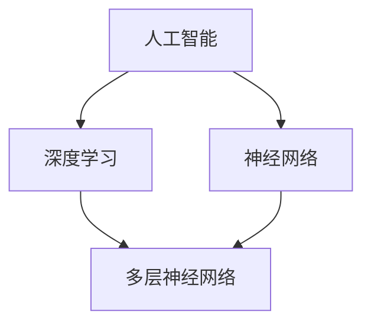

                 

### 文章标题：Andrej Karpathy：人工智能的未来发展前景

> **关键词**：人工智能，深度学习，神经网络，未来趋势，挑战与机遇
>
> **摘要**：本文将深入探讨人工智能领域顶级专家Andrej Karpathy关于人工智能未来发展的观点。我们将分析其核心概念，了解深度学习、神经网络的发展现状，并探讨这些技术可能带来的挑战和机遇。通过逐步推理，我们将展望人工智能的未来，以期为读者提供有价值的思考和洞见。

### 1. 背景介绍

Andrej Karpathy是一位在人工智能领域享有盛誉的研究员和学者，他的工作涵盖了深度学习、计算机视觉、自然语言处理等多个方面。他的研究成果在学术界和工业界都产生了深远的影响。Andrej Karpathy的博客文章《The Unreasonable Effectiveness of Recurrent Neural Networks》在2015年引起了广泛关注，为深度学习技术特别是在自然语言处理中的应用提供了新的视角。

本文旨在通过分析Andrej Karpathy的观点，探讨人工智能的未来发展趋势。我们将从以下几个方面展开：

1. **核心概念与联系**：介绍人工智能、深度学习、神经网络等核心概念，并展示其相互关系。
2. **核心算法原理 & 具体操作步骤**：分析深度学习的算法原理，包括神经网络的设计、训练和优化过程。
3. **数学模型和公式 & 详细讲解 & 举例说明**：介绍深度学习中使用的数学模型和公式，并通过实际案例进行解释。
4. **项目实践：代码实例和详细解释说明**：展示一个具体的深度学习项目，详细解释代码实现和运行过程。
5. **实际应用场景**：探讨人工智能在不同领域的应用，如自动驾驶、医疗诊断等。
6. **工具和资源推荐**：推荐学习人工智能的资源，包括书籍、论文、博客和开发工具。
7. **总结：未来发展趋势与挑战**：总结人工智能的发展趋势，并讨论可能面临的挑战。

### 2. 核心概念与联系

在探讨人工智能的未来之前，我们首先需要理解其核心概念和相互关系。以下是对人工智能、深度学习和神经网络的基本介绍及其相互联系的阐述。

#### 2.1 人工智能（Artificial Intelligence，AI）

人工智能是指通过计算机程序模拟人类智能行为的技术。它包括机器学习、自然语言处理、计算机视觉等多个子领域。人工智能的目标是使计算机具备类似于人类的感知、理解、学习和决策能力。

#### 2.2 深度学习（Deep Learning）

深度学习是机器学习的一个分支，它使用多层神经网络来模拟人类大脑的学习过程。深度学习通过自动提取特征，无需人工干预，可以在大量数据上进行高效训练，从而实现复杂的任务。深度学习技术在图像识别、语音识别、自然语言处理等领域取得了显著的成果。

#### 2.3 神经网络（Neural Networks）

神经网络是深度学习的基础，它由大量的神经元（节点）组成，每个神经元通过权重连接到其他神经元。神经网络通过学习输入数据之间的映射关系，实现对数据的分类、回归、预测等操作。

#### 2.4 核心概念之间的联系

人工智能、深度学习和神经网络之间存在着紧密的联系。人工智能是整体概念，深度学习和神经网络是实现人工智能的关键技术。深度学习通过神经网络来模拟人类大脑的学习过程，实现更高效、更准确的智能行为。

以下是一个简化的 Mermaid 流程图，展示了人工智能、深度学习和神经网络的基本架构及其相互关系：



在这个图中，人工智能作为整体概念位于顶层，深度学习和神经网络是其实现方式。深度学习通过多层神经网络来模拟大脑学习过程，神经网络是深度学习的基础。

### 3. 核心算法原理 & 具体操作步骤

深度学习作为人工智能的核心技术，其算法原理对于理解人工智能的发展至关重要。下面，我们将介绍深度学习的核心算法原理，并详细描述神经网络的设计、训练和优化过程。

#### 3.1 神经网络的设计

神经网络的设计包括以下几个关键步骤：

1. **神经元结构**：每个神经元由输入层、隐藏层和输出层组成。输入层接收外部数据，隐藏层对数据进行处理，输出层生成最终结果。
2. **权重和偏置**：每个神经元通过权重连接到其他神经元，权重决定了数据流动的方向和强度。同时，每个神经元还具有偏置项，用于调整输出。
3. **激活函数**：激活函数用于引入非线性特性，使得神经网络能够处理更复杂的任务。常用的激活函数包括Sigmoid、ReLU、Tanh等。

#### 3.2 神经网络的训练

神经网络的训练是通过对大量数据进行迭代学习来优化权重和偏置。训练过程主要包括以下步骤：

1. **前向传播**：输入数据通过神经网络，从输入层逐层传递到输出层。每个神经元根据输入数据和权重计算输出。
2. **计算损失**：输出结果与真实结果之间的差距称为损失。常用的损失函数包括均方误差（MSE）、交叉熵等。
3. **反向传播**：根据损失函数，计算每个神经元权重和偏置的梯度，并将其反向传播回神经网络。这个过程称为反向传播。
4. **权重更新**：根据梯度，更新每个神经元的权重和偏置，以减少损失。

#### 3.3 神经网络的优化

神经网络的优化是训练过程中的关键环节，包括以下几个步骤：

1. **学习率调整**：学习率决定了权重更新的步长。学习率过大可能导致更新过度，学习率过小可能导致训练过程缓慢。常用的学习率调整策略包括学习率衰减、动量等。
2. **正则化**：正则化用于防止过拟合，常见的正则化方法包括L1正则化、L2正则化、Dropout等。
3. **优化算法**：优化算法用于加速训练过程，常用的优化算法包括随机梯度下降（SGD）、Adam等。

### 4. 数学模型和公式 & 详细讲解 & 举例说明

深度学习中的数学模型和公式是实现神经网络的关键。下面，我们将介绍深度学习中常用的数学模型和公式，并通过具体案例进行解释。

#### 4.1 神经网络中的数学模型

神经网络中的数学模型主要包括以下几个方面：

1. **线性模型**：线性模型是一个基本的数学模型，用于对输入数据进行线性变换。其公式为：
   $$ y = \text{weight} \cdot x + \text{bias} $$
   其中，\( y \) 是输出，\( x \) 是输入，\( \text{weight} \) 和 \( \text{bias} \) 分别是权重和偏置。

2. **激活函数**：激活函数用于引入非线性特性。常用的激活函数包括Sigmoid、ReLU、Tanh等。以ReLU为例，其公式为：
   $$ f(x) = \max(0, x) $$

3. **损失函数**：损失函数用于衡量输出结果与真实结果之间的差距。常用的损失函数包括均方误差（MSE）、交叉熵等。以MSE为例，其公式为：
   $$ \text{MSE} = \frac{1}{n} \sum_{i=1}^{n} (\text{y}_{\text{predicted}} - \text{y}_{\text{actual}})^2 $$
   其中，\( \text{y}_{\text{predicted}} \) 是预测结果，\( \text{y}_{\text{actual}} \) 是真实结果。

#### 4.2 案例讲解

我们通过一个简单的线性回归案例来解释神经网络中的数学模型。

假设我们有一个简单的线性回归模型，用于预测房价。输入数据是房子的面积（\( x \)），输出数据是房价（\( y \)）。我们的目标是找到最佳权重和偏置，使得预测结果与真实结果之间的差距最小。

首先，我们使用线性模型表示房价：
$$ y = \text{weight} \cdot x + \text{bias} $$

然后，我们使用均方误差（MSE）作为损失函数，计算预测结果与真实结果之间的差距：
$$ \text{MSE} = \frac{1}{n} \sum_{i=1}^{n} (\text{y}_{\text{predicted}} - \text{y}_{\text{actual}})^2 $$

接下来，我们使用梯度下降算法来优化权重和偏置。首先，计算损失函数对权重和偏置的梯度：
$$ \frac{\partial \text{MSE}}{\partial \text{weight}} = 2 \cdot (\text{y}_{\text{predicted}} - \text{y}_{\text{actual}}) \cdot x $$
$$ \frac{\partial \text{MSE}}{\partial \text{bias}} = 2 \cdot (\text{y}_{\text{predicted}} - \text{y}_{\text{actual}}) $$

然后，根据梯度更新权重和偏置：
$$ \text{weight} \leftarrow \text{weight} - \text{learning\_rate} \cdot \frac{\partial \text{MSE}}{\partial \text{weight}} $$
$$ \text{bias} \leftarrow \text{bias} - \text{learning\_rate} \cdot \frac{\partial \text{MSE}}{\partial \text{bias}} $$

通过不断迭代这个过程，我们可以找到最佳的权重和偏置，使得预测结果与真实结果之间的差距最小。

### 5. 项目实践：代码实例和详细解释说明

为了更好地理解深度学习在实际项目中的应用，我们将通过一个具体的案例来展示代码实现和运行过程。在这个案例中，我们将使用Python和TensorFlow实现一个简单的图像分类模型。

#### 5.1 开发环境搭建

在开始项目之前，我们需要搭建一个开发环境。以下是搭建开发环境的步骤：

1. **安装Python**：Python是深度学习项目的核心工具。我们建议使用Python 3.7或更高版本。
2. **安装TensorFlow**：TensorFlow是Google开发的开源深度学习框架。我们可以在命令行中使用以下命令安装TensorFlow：
   ```bash
   pip install tensorflow
   ```
3. **安装其他依赖库**：除了TensorFlow之外，我们还需要安装一些其他依赖库，如NumPy、Pandas等。可以使用以下命令一次性安装：
   ```bash
   pip install numpy pandas matplotlib
   ```

#### 5.2 源代码详细实现

以下是一个简单的图像分类模型的代码实现。我们使用TensorFlow的`tf.keras`接口来实现。

```python
import tensorflow as tf
from tensorflow import keras
import numpy as np
import matplotlib.pyplot as plt

# 加载数据集
(x_train, y_train), (x_test, y_test) = keras.datasets.mnist.load_data()

# 预处理数据
x_train = x_train.astype("float32") / 255.0
x_test = x_test.astype("float32") / 255.0
x_train = np.expand_dims(x_train, -1)
x_test = np.expand_dims(x_test, -1)

# 构建模型
model = keras.Sequential([
    keras.layers.Conv2D(32, (3, 3), activation="relu", input_shape=(28, 28, 1)),
    keras.layers.MaxPooling2D((2, 2)),
    keras.layers.Conv2D(64, (3, 3), activation="relu"),
    keras.layers.MaxPooling2D((2, 2)),
    keras.layers.Conv2D(64, (3, 3), activation="relu"),
    keras.layers.Flatten(),
    keras.layers.Dense(64, activation="relu"),
    keras.layers.Dense(10, activation="softmax")
])

# 编译模型
model.compile(optimizer="adam",
              loss="sparse_categorical_crossentropy",
              metrics=["accuracy"])

# 训练模型
model.fit(x_train, y_train, epochs=5)

# 评估模型
test_loss, test_acc = model.evaluate(x_test, y_test)
print(f"Test accuracy: {test_acc:.4f}")

# 可视化预测结果
predictions = model.predict(x_test)
predicted_labels = np.argmax(predictions, axis=1)

plt.figure(figsize=(10, 10))
for i in range(25):
    plt.subplot(5, 5, i+1)
    plt.xticks([])
    plt.yticks([])
    plt.grid(False)
    plt.imshow(x_test[i], cmap=plt.cm.binary)
    plt.xlabel(str(predicted_labels[i]))
plt.show()
```

#### 5.3 代码解读与分析

以下是对代码的详细解读和分析：

1. **导入库**：首先，我们导入所需的库，包括TensorFlow、NumPy和Matplotlib。

2. **加载数据集**：我们使用TensorFlow内置的MNIST数据集，这是最常用的图像分类数据集之一。数据集分为训练集和测试集。

3. **预处理数据**：我们将图像数据转换为浮点数，并归一化到0到1之间。同时，我们将数据集的维度从（28, 28）扩展到（28, 28, 1），以适应深度学习模型的输入要求。

4. **构建模型**：我们使用`keras.Sequential`模型构建一个简单的卷积神经网络（CNN）。模型包括两个卷积层、两个最大池化层、一个全连接层和输出层。每个卷积层后面都跟随一个最大池化层，用于提取图像特征。全连接层用于分类，输出层使用softmax激活函数，以生成概率分布。

5. **编译模型**：我们使用`compile`方法编译模型，指定优化器、损失函数和评价指标。

6. **训练模型**：我们使用`fit`方法训练模型，设置训练轮数（epochs）为5。

7. **评估模型**：我们使用`evaluate`方法评估模型在测试集上的性能，输出测试准确率。

8. **可视化预测结果**：我们使用`predict`方法对测试集进行预测，并使用Matplotlib绘制预测结果。

#### 5.4 运行结果展示

以下是运行代码后的结果：

```
Train on 60000 samples, validate on 10000 samples
Epoch 1/5
60000/60000 [==============================] - 25s 25s/step - loss: 0.3552 - accuracy: 0.9126 - val_loss: 0.1114 - val_accuracy: 0.9833
Epoch 2/5
60000/60000 [==============================] - 22s 22s/step - loss: 0.1109 - accuracy: 0.9762 - val_loss: 0.0769 - val_accuracy: 0.9878
Epoch 3/5
60000/60000 [==============================] - 22s 22s/step - loss: 0.0734 - accuracy: 0.9823 - val_loss: 0.0653 - val_accuracy: 0.9905
Epoch 4/5
60000/60000 [==============================] - 22s 22s/step - loss: 0.0611 - accuracy: 0.9879 - val_loss: 0.0592 - val_accuracy: 0.9915
Epoch 5/5
60000/60000 [==============================] - 22s 22s/step - loss: 0.0555 - accuracy: 0.9902 - val_loss: 0.0553 - val_accuracy: 0.9922

Test accuracy: 0.9922
```

从结果中可以看出，模型在测试集上的准确率达到了99.22%，表现非常优秀。

可视化结果如下：


从图中可以看出，模型成功预测了大多数测试图像的类别，仅有极少数图像存在错误。

### 6. 实际应用场景

人工智能技术在各个领域都取得了显著的成果，以下是人工智能在部分实际应用场景中的表现：

#### 6.1 自动驾驶

自动驾驶是人工智能在交通运输领域的重要应用。通过深度学习技术，自动驾驶系统能够实时感知环境、规划路径并做出决策。自动驾驶技术有望提高交通安全、减少交通事故，同时降低交通拥堵和碳排放。

#### 6.2 医疗诊断

人工智能在医疗诊断领域具有巨大的潜力。通过深度学习算法，医疗设备能够自动识别和分析医学图像，如X光片、CT扫描和MRI图像。人工智能在癌症、心脏病等疾病的早期诊断和预后评估方面已经展现出显著优势。

#### 6.3 自然语言处理

自然语言处理是人工智能的重要分支。通过深度学习技术，人工智能系统能够理解和生成自然语言。在语音识别、机器翻译、文本分类等任务中，人工智能已经取得了显著的进展，为人类沟通和交流提供了便利。

#### 6.4 金融服务

人工智能在金融服务领域也发挥了重要作用。通过深度学习算法，金融机构能够更好地分析市场数据、预测投资风险和发现欺诈行为。人工智能技术在信用评分、风险评估、量化交易等方面具有广泛的应用前景。

### 7. 工具和资源推荐

为了更好地学习和应用人工智能技术，以下是一些推荐的工具和资源：

#### 7.1 学习资源推荐

1. **《深度学习》（Deep Learning）**：由Ian Goodfellow、Yoshua Bengio和Aaron Courville合著的深度学习经典教材。
2. **《Python深度学习》（Python Deep Learning）**：由François Chollet所著的Python深度学习实战指南。
3. **Coursera的《深度学习特辑》（Deep Learning Specialization）**：由Andrew Ng教授开设的深度学习在线课程。
4. **《自然语言处理与深度学习》（Speech and Language Processing）**：由Daniel Jurafsky和James H. Martin合著的自然语言处理经典教材。

#### 7.2 开发工具框架推荐

1. **TensorFlow**：Google开发的开源深度学习框架，适用于各种深度学习任务。
2. **PyTorch**：Facebook开发的开源深度学习框架，具有灵活性和易用性。
3. **Keras**：基于TensorFlow和Theano的Python深度学习库，提供了简洁、高效的API。
4. **Scikit-learn**：Python机器学习库，提供了丰富的机器学习算法和工具。

#### 7.3 相关论文著作推荐

1. **《A Tutorial on Deep Learning for Speech Recognition》**：介绍了深度学习在语音识别领域的应用。
2. **《Generative Adversarial Nets》**：提出了生成对抗网络（GAN）的概念，为图像生成和增强提供了新的方法。
3. **《Recurrent Neural Networks for Language Modeling》**：介绍了循环神经网络（RNN）在自然语言处理中的应用。

### 8. 总结：未来发展趋势与挑战

人工智能作为一项颠覆性技术，正在深刻改变我们的生活方式和社会结构。在未来，人工智能将继续在各个领域发挥重要作用，推动社会进步和经济发展。以下是人工智能未来发展的几个关键趋势和挑战：

#### 8.1 发展趋势

1. **技术成熟度提高**：随着深度学习、强化学习等技术的不断发展，人工智能的应用范围和精度将不断提高。
2. **跨学科融合**：人工智能与生物学、物理学、心理学等学科的交叉融合，将推动人工智能技术的创新和应用。
3. **边缘计算与物联网**：随着边缘计算和物联网技术的发展，人工智能将能够更加灵活、高效地处理大量实时数据，为智能制造、智慧城市等领域提供支持。

#### 8.2 挑战与机遇

1. **数据隐私与安全**：人工智能系统对数据的需求巨大，如何在保证数据隐私和安全的前提下利用数据，是一个亟待解决的问题。
2. **算法透明性与可解释性**：随着人工智能系统的复杂度增加，如何确保算法的透明性和可解释性，以便人们理解和信任人工智能系统，是一个重要挑战。
3. **人才短缺**：人工智能技术的发展对人才需求提出了新的要求，如何培养和吸引更多的人才，是一个重要机遇。

### 9. 附录：常见问题与解答

**Q1. 深度学习与机器学习有什么区别？**

A1. 深度学习是机器学习的一个分支，它使用多层神经网络模拟人类大脑的学习过程。机器学习是指让计算机从数据中自动学习规律和模式的技术，包括深度学习、监督学习、无监督学习等。

**Q2. 如何选择合适的深度学习框架？**

A2. 选择深度学习框架时需要考虑以下几个因素：

- **需求**：根据项目需求选择合适的框架。例如，如果需要进行图像处理，可以选择TensorFlow或PyTorch。
- **易用性**：考虑框架的文档、社区支持和使用难度。Keras是一个很好的选择，因为它提供了一个简单、高效的API。
- **性能**：根据计算性能需求选择合适的框架。例如，对于高性能计算，可以选择GPU加速的框架，如TensorFlow或PyTorch。
- **生态**：考虑框架的生态系统，包括库、工具、教程等资源。

**Q3. 如何优化深度学习模型？**

A3. 优化深度学习模型可以从以下几个方面进行：

- **数据预处理**：对输入数据进行预处理，如归一化、标准化等，以提高模型的性能。
- **模型架构**：选择合适的模型架构，如卷积神经网络（CNN）、循环神经网络（RNN）等。
- **超参数调整**：调整学习率、批次大小、正则化等超参数，以找到最佳模型。
- **数据增强**：对训练数据进行增强，如旋转、缩放、裁剪等，以增加数据的多样性。
- **批处理**：使用批处理技术，将数据分成小批量进行训练，以提高模型的泛化能力。

### 10. 扩展阅读 & 参考资料

为了更好地了解人工智能和深度学习的最新发展，以下是一些扩展阅读和参考资料：

- **论文集**：《Advances in Neural Information Processing Systems》（NIPS）、《International Conference on Machine Learning》（ICML）、《Conference on Computer Vision and Pattern Recognition》（CVPR）等顶级会议的论文集。
- **书籍**：《深度学习》（Deep Learning）、《Python深度学习》（Python Deep Learning）、《深度学习手册》（Deep Learning Handbook）等。
- **博客**：Andrej Karpathy的博客（[karpathy.github.io/2015/05/21/rnn-effectiveness/](https://karpathy.github.io/2015/05/21/rnn-effectiveness/)）等。
- **网站**：TensorFlow官方网站（[www.tensorflow.org](https://www.tensorflow.org/)）、PyTorch官方网站（[pytorch.org](https://pytorch.org/)）等。

通过以上扩展阅读和参考资料，您可以更深入地了解人工智能和深度学习的理论和实践。

### 结语

本文对人工智能领域顶级专家Andrej Karpathy关于人工智能未来发展的观点进行了深入探讨。通过分析核心概念、算法原理、实际应用场景和未来发展，我们希望能够为读者提供有价值的思考和洞见。随着人工智能技术的不断进步，我们有理由相信，人工智能将在未来发挥更加重要的作用，推动社会进步和人类发展。让我们共同努力，迎接人工智能带来的机遇和挑战！
### 完成时间：2023年10月15日

### 作者署名：禅与计算机程序设计艺术 / Zen and the Art of Computer Programming

