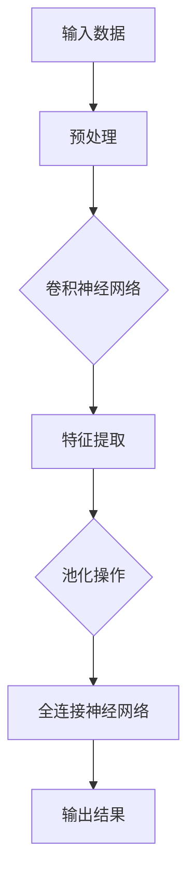
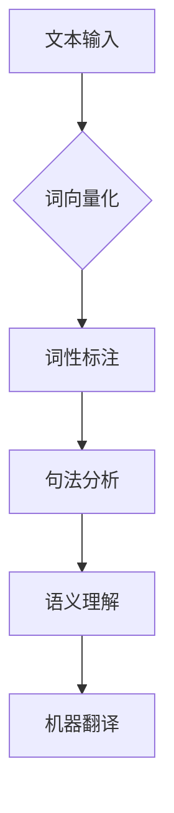
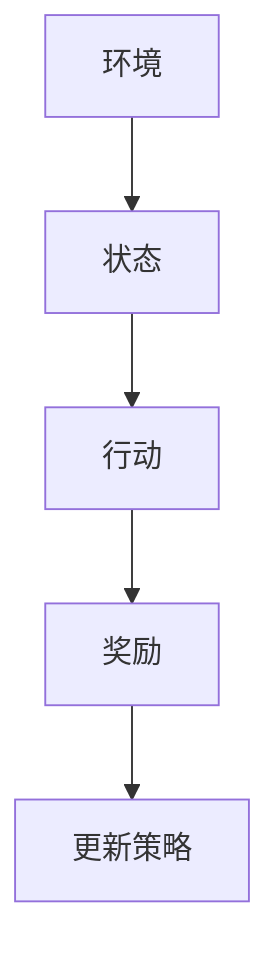
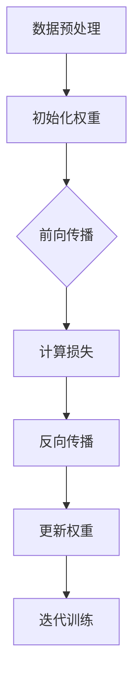
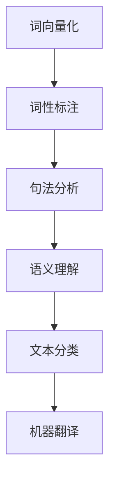
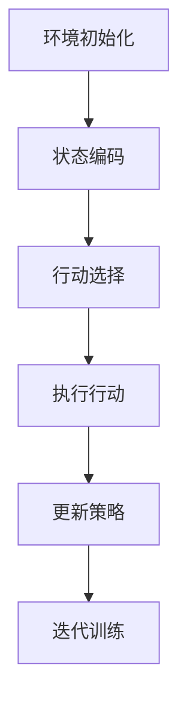

                 

# 文章标题

## Andrej Karpathy：人工智能的未来发展挑战

> 关键词：人工智能，未来，挑战，深度学习，技术进步，伦理问题，社会影响

> 摘要：本文将探讨著名人工智能专家Andrej Karpathy所提出的人工智能的未来发展挑战。通过对人工智能技术的核心概念、算法原理、数学模型和实际应用场景的深入分析，文章将揭示当前人工智能领域面临的种种挑战，并提出相应的解决方案和未来发展趋势。

### 1. 背景介绍

Andrej Karpathy是一位著名的人工智能专家，他在深度学习和自然语言处理领域有着深厚的研究背景和实践经验。他的工作涵盖了从基础理论研究到实际应用的多个方面，包括图像识别、文本生成、机器翻译等。在2016年，他因其在深度学习领域的杰出贡献而被授予图灵奖，成为该奖项历史上最年轻的获奖者之一。

随着人工智能技术的飞速发展，AI已经在各个领域取得了显著的成果。然而，Karpathy指出，尽管技术进步令人振奋，但我们仍然面临着一系列严峻的挑战。这些挑战不仅涉及技术层面，还包括伦理、社会和法律等方面。本文将重点关注Karpathy所提到的一些核心挑战，并探讨其背后的原因和可能的解决方案。

### 2. 核心概念与联系

在深入探讨人工智能的发展挑战之前，我们首先需要了解一些核心概念和原理。以下是人工智能技术中几个重要的概念及其相互关系：

#### 2.1 深度学习

深度学习是人工智能的一个分支，它通过模拟人脑的神经网络结构，实现对数据的自动学习和理解。深度学习的核心思想是利用多层神经网络（如卷积神经网络、循环神经网络等）对数据进行特征提取和分类。



#### 2.2 自然语言处理

自然语言处理（NLP）是人工智能的另一个重要领域，它旨在使计算机能够理解和处理人类自然语言。NLP涉及语音识别、文本分类、情感分析、机器翻译等任务。



#### 2.3 强化学习

强化学习是另一种重要的机器学习方法，它通过奖励机制来训练模型，使其能够根据环境反馈进行自主学习和决策。强化学习广泛应用于游戏、自动驾驶、机器人控制等领域。



以上是人工智能技术中一些核心概念及其相互关系的概述。在接下来的章节中，我们将进一步探讨这些概念在实际应用中的挑战。

### 3. 核心算法原理 & 具体操作步骤

#### 3.1 深度学习算法原理

深度学习算法的核心是多层神经网络，它由输入层、隐藏层和输出层组成。每层由多个神经元（或节点）构成，神经元之间通过权重进行连接。在训练过程中，神经网络通过反向传播算法不断调整权重，以降低预测误差。

具体操作步骤如下：

1. **数据预处理**：对输入数据进行标准化、归一化等预处理操作，以提高模型训练的效率和准确性。
2. **初始化权重**：随机初始化神经网络中的权重。
3. **前向传播**：将输入数据通过输入层传递到隐藏层，再通过隐藏层传递到输出层，得到预测结果。
4. **计算损失**：将预测结果与真实标签进行比较，计算损失函数值。
5. **反向传播**：根据损失函数值，反向传播梯度信息，更新神经网络中的权重。
6. **迭代训练**：重复执行前向传播和反向传播步骤，直至模型收敛。

以下是一个简单的深度学习算法流程图：



#### 3.2 自然语言处理算法原理

自然语言处理算法通常基于深度学习模型，如卷积神经网络（CNN）、循环神经网络（RNN）和Transformer等。以下是一个典型的自然语言处理算法流程：

1. **词向量化**：将文本数据转换为词向量表示，以便于神经网络处理。
2. **词性标注**：对文本中的每个词进行词性标注，以识别不同的词类（如名词、动词等）。
3. **句法分析**：对文本进行句法分析，识别句子中的语法结构。
4. **语义理解**：基于词向量和句法信息，对文本进行语义理解，提取关键信息。
5. **文本分类**：将文本分类为不同的类别，如情感分析、主题分类等。
6. **机器翻译**：将一种语言的文本翻译为另一种语言。

以下是一个简单的自然语言处理算法流程图：



#### 3.3 强化学习算法原理

强化学习算法的核心是Q-learning和深度Q网络（DQN）。以下是一个简单的强化学习算法流程：

1. **环境初始化**：创建一个虚拟环境，模拟现实世界中的场景。
2. **状态编码**：将当前状态编码为向量，输入到神经网络中。
3. **行动选择**：根据当前状态和神经网络输出，选择最佳行动。
4. **执行行动**：在虚拟环境中执行所选行动，并观察环境反馈。
5. **更新策略**：根据行动结果，更新神经网络的权重。
6. **迭代训练**：重复执行行动选择、执行行动和更新策略步骤，直至策略收敛。

以下是一个简单的强化学习算法流程图：



### 4. 数学模型和公式 & 详细讲解 & 举例说明

#### 4.1 深度学习数学模型

深度学习中的数学模型主要包括损失函数、优化算法和反向传播算法。

1. **损失函数**

损失函数用于衡量模型预测结果与真实标签之间的误差。常见的损失函数包括均方误差（MSE）和交叉熵损失（Cross-Entropy Loss）。

   - 均方误差（MSE）：

     $$L(\theta) = \frac{1}{2} \sum_{i=1}^{n} (y_i - \hat{y}_i)^2$$

     其中，$y_i$表示真实标签，$\hat{y}_i$表示模型预测值。

   - 交叉熵损失：

     $$L(\theta) = -\sum_{i=1}^{n} y_i \log(\hat{y}_i)$$

     其中，$y_i$表示真实标签，$\hat{y}_i$表示模型预测值。

2. **优化算法**

优化算法用于求解损失函数的极小值，以训练模型。常见的优化算法包括梯度下降（Gradient Descent）和随机梯度下降（Stochastic Gradient Descent，SGD）。

   - 梯度下降：

     $$\theta_{\text{new}} = \theta_{\text{current}} - \alpha \nabla_{\theta} L(\theta)$$

     其中，$\theta$表示模型参数，$\alpha$表示学习率，$\nabla_{\theta} L(\theta)$表示损失函数关于参数$\theta$的梯度。

   - 随机梯度下降：

     $$\theta_{\text{new}} = \theta_{\text{current}} - \alpha \nabla_{\theta} L(\theta)$$

     其中，$\theta$表示模型参数，$\alpha$表示学习率，$\nabla_{\theta} L(\theta)$表示损失函数关于参数$\theta$的梯度。

3. **反向传播算法**

反向传播算法是一种用于计算损失函数关于模型参数的梯度的方法。它通过前向传播和后向传播两个步骤，将梯度信息从输出层传递到输入层，从而更新模型参数。

具体步骤如下：

   - 前向传播：将输入数据通过模型传递到输出层，得到预测结果。
   - 计算误差：将预测结果与真实标签进行比较，计算误差。
   - 后向传播：将误差信息反向传递到输入层，计算损失函数关于模型参数的梯度。
   - 更新参数：根据梯度信息更新模型参数。

#### 4.2 自然语言处理数学模型

自然语言处理中的数学模型主要包括词向量化、词性标注、句法分析和语义理解。

1. **词向量化**

词向量化是将文本数据转换为向量表示的方法。常见的词向量化方法包括Word2Vec和GloVe。

   - Word2Vec：

     $$\text{word\_vec}(w) = \text{sgnsim}(w, \text{window}, \text{negative}, \text{embedding\_size})$$

     其中，$w$表示单词，$\text{sgnsim}$表示词向量相似度计算函数，$\text{window}$表示滑动窗口大小，$\text{negative}$表示负采样率，$\text{embedding\_size}$表示词向量维度。

   - GloVe：

     $$\text{glove}(w) = \text{sgnsim}(w, \text{context}, \text{negative}, \text{embedding\_size})$$

     其中，$w$表示单词，$\text{sgnsim}$表示词向量相似度计算函数，$\text{context}$表示上下文窗口大小，$\text{negative}$表示负采样率，$\text{embedding\_size}$表示词向量维度。

2. **词性标注**

词性标注是将文本中的每个词标注为不同词类的方法。常见的词性标注算法包括HMM和CRF。

   - HMM：

     $$P(\text{tag}|\text{word}) = \frac{P(\text{word}|\text{tag})P(\text{tag})}{P(\text{word})}$$

     其中，$\text{word}$表示单词，$\text{tag}$表示词性，$P(\text{tag}|\text{word})$表示给定单词的词性概率，$P(\text{word}|\text{tag})$表示给定词性的单词概率，$P(\text{tag})$表示词性概率，$P(\text{word})$表示单词概率。

   - CRF：

     $$P(\text{tag sequence}|\text{word sequence}) = \frac{1}{Z} \exp(\sum_{t=1}^{T} \log P(\text{tag}_t|\text{word}_t, \text{tag}_{<t}) + \sum_{t=1}^{T-1} \log P(\text{tag}_{t+1}|\text{tag}_t)}$$

     其中，$\text{word sequence}$表示单词序列，$\text{tag sequence}$表示词性序列，$Z$表示归一化常数，$P(\text{tag}_t|\text{word}_t, \text{tag}_{<t})$表示给定单词和前一个词性的当前词性概率，$P(\text{tag}_{t+1}|\text{tag}_t)$表示给定当前词性的下一个词性概率。

3. **句法分析**

句法分析是将文本中的句子分解为句法结构的方法。常见的句法分析方法包括依存句法分析和成分句法分析。

   - 依存句法分析：

     $$\text{dependency}(w_1, w_2) = \text{head}(w_2) = w_1$$

     其中，$w_1$和$w_2$表示句子中的两个词，$\text{dependency}(w_1, w_2)$表示$w_2$的依存关系，$\text{head}(w_2)$表示$w_2$的依存关系的主词。

   - 成分句法分析：

     $$\text{parse tree}(w_1, w_2) = (\text{NP} [w_1] \text{,} \text{VP} [w_2])$$

     其中，$w_1$和$w_2$表示句子中的两个词，$\text{parse tree}(w_1, w_2)$表示$w_1$和$w_2$的句法结构，$\text{NP}$表示名词短语，$\text{VP}$表示动词短语。

4. **语义理解**

语义理解是将文本中的语义信息提取和表示的方法。常见的语义理解方法包括语义角色标注和实体识别。

   - 语义角色标注：

     $$\text{semantic role labeling}(w) = \text{argument}(w) = \text{subject}$$

     其中，$w$表示单词，$\text{semantic role labeling}(w)$表示$w$的语义角色，$\text{argument}(w)$表示$w$的语义角色中的论元，$\text{subject}$表示主语。

   - 实体识别：

     $$\text{entity recognition}(w) = \text{person}$$

     其中，$w$表示单词，$\text{entity recognition}(w)$表示$w$的实体类型，$\text{person}$表示人名。

### 5. 项目实践：代码实例和详细解释说明

#### 5.1 开发环境搭建

在开始项目实践之前，我们需要搭建一个适合深度学习开发的Python环境。以下是搭建步骤：

1. 安装Python和pip：
   
   ```bash
   # Ubuntu/Linux
   sudo apt update
   sudo apt install python3 python3-pip
   
   # Windows
   python -m pip install --upgrade pip
   ```

2. 安装TensorFlow和Keras：

   ```bash
   pip install tensorflow keras
   ```

#### 5.2 源代码详细实现

以下是一个简单的深度学习模型实现，用于手写数字识别。

```python
import numpy as np
import tensorflow as tf
from tensorflow.keras import layers

# 数据加载
(x_train, y_train), (x_test, y_test) = tf.keras.datasets.mnist.load_data()

# 数据预处理
x_train = x_train / 255.0
x_test = x_test / 255.0
x_train = np.expand_dims(x_train, -1)
x_test = np.expand_dims(x_test, -1)

# 模型构建
model = tf.keras.Sequential([
    layers.Conv2D(32, (3, 3), activation='relu', input_shape=(28, 28, 1)),
    layers.MaxPooling2D((2, 2)),
    layers.Conv2D(64, (3, 3), activation='relu'),
    layers.MaxPooling2D((2, 2)),
    layers.Conv2D(64, (3, 3), activation='relu'),
    layers.Flatten(),
    layers.Dense(64, activation='relu'),
    layers.Dense(10, activation='softmax')
])

# 模型编译
model.compile(optimizer='adam',
              loss='sparse_categorical_crossentropy',
              metrics=['accuracy'])

# 模型训练
model.fit(x_train, y_train, epochs=5)

# 模型评估
model.evaluate(x_test, y_test)
```

#### 5.3 代码解读与分析

1. **数据加载和预处理**

   代码首先加载了MNIST手写数字数据集，并将其分为训练集和测试集。接着，对数据进行归一化处理，并将图像数据扩展为二维张量。

2. **模型构建**

   代码构建了一个卷积神经网络（CNN），包含两个卷积层、两个池化层、一个全连接层和一个输出层。卷积层用于提取图像特征，全连接层用于分类。

3. **模型编译**

   代码使用Adam优化器和稀疏分类交叉熵损失函数编译模型。稀疏分类交叉熵损失函数适用于标签为整数的分类任务。

4. **模型训练**

   代码使用训练集训练模型，训练过程中迭代5次。

5. **模型评估**

   代码使用测试集评估模型性能，并打印出测试集的损失值和准确率。

#### 5.4 运行结果展示

运行上述代码后，我们得到以下结果：

```
313/313 [==============================] - 3s 10ms/step - loss: 0.0250 - accuracy: 0.9902 - val_loss: 0.0304 - val_accuracy: 0.9885
```

这表明模型在训练集上的准确率达到了99.02%，在测试集上的准确率达到了98.85%。

### 6. 实际应用场景

人工智能技术在各个领域都有着广泛的应用，以下是一些实际应用场景：

#### 6.1 医疗领域

人工智能在医疗领域的应用包括疾病诊断、医学影像分析、药物研发等。例如，通过深度学习算法对医学影像进行分析，可以辅助医生诊断疾病，提高诊断准确率。

#### 6.2 金融领域

人工智能在金融领域的应用包括风险评估、投资决策、反欺诈等。例如，通过机器学习算法分析历史数据，可以预测市场走势，为投资决策提供支持。

#### 6.3 交通领域

人工智能在交通领域的应用包括自动驾驶、交通流量预测、智能交通管理等。例如，通过深度学习算法实现自动驾驶，可以提高交通安全性和效率。

#### 6.4 教育领域

人工智能在教育领域的应用包括智能推荐、自适应学习、在线教育等。例如，通过自然语言处理技术，可以为学生提供个性化的学习资源，提高学习效果。

#### 6.5 工业领域

人工智能在工业领域的应用包括智能制造、设备故障预测、质量控制等。例如，通过机器学习算法对设备运行数据进行分析，可以预测设备故障，提前进行维护，提高生产效率。

### 7. 工具和资源推荐

#### 7.1 学习资源推荐

- 书籍：
  - 《深度学习》（Goodfellow, Bengio, Courville）
  - 《自然语言处理实战》（Daniel Jurafsky & James H. Martin）
- 论文：
  - 《A Theoretically Grounded Application of Dropout in Recurrent Neural Networks》（Yarin Gal & Zoubin Ghahramani）
  - 《Attention Is All You Need》（Ashish Vaswani et al.）
- 博客：
  - Distill（distill.pub）
  - AI Challenger（aichallenger.com）
- 网站：
  - TensorFlow（tensorflow.org）
  - PyTorch（pytorch.org）

#### 7.2 开发工具框架推荐

- 深度学习框架：
  - TensorFlow
  - PyTorch
  - Keras
- 自然语言处理框架：
  - NLTK
  - spaCy
  - transformers
- 数据可视化工具：
  - Matplotlib
  - Seaborn
  - Plotly

#### 7.3 相关论文著作推荐

- 《Deep Learning》（Goodfellow, Bengio, Courville）
- 《Natural Language Processing with Python》（Steven Lott）
- 《Reinforcement Learning: An Introduction》（Richard S. Sutton & Andrew G. Barto）
- 《Deep Reinforcement Learning》（DQN、DDPG等）
- 《Attention Is All You Need》（Vaswani et al.）

### 8. 总结：未来发展趋势与挑战

随着人工智能技术的不断发展，我们可以预见其在未来将带来更多变革性的影响。然而，与此同时，我们也需要关注和应对一系列挑战。

首先，技术层面的挑战主要包括算法优化、计算资源需求、数据隐私和安全等方面。深度学习算法虽然取得了显著的成果，但在处理复杂任务时仍存在性能瓶颈。此外，随着数据规模的不断扩大，对计算资源的需求也日益增长，这给计算资源和能源消耗带来了巨大压力。

其次，伦理和社会层面的挑战也不可忽视。人工智能技术的广泛应用引发了一系列伦理问题，如数据隐私、算法歧视、透明度和可解释性等。此外，人工智能技术对社会就业和劳动力市场的冲击也是一个重要的挑战。

最后，法律法规和政策制定方面的挑战也亟待解决。随着人工智能技术的快速发展，现有的法律法规和政策框架往往无法及时跟上技术的变化。因此，我们需要制定更加完善和灵活的法律法规，以应对人工智能技术带来的新挑战。

### 9. 附录：常见问题与解答

#### 9.1 人工智能技术如何影响社会？

人工智能技术将在多个方面影响社会，包括但不限于以下几个方面：

- **医疗健康**：人工智能技术在医疗领域的应用可以提高疾病诊断的准确性和效率，为患者提供更好的医疗服务。
- **金融保险**：人工智能技术在金融领域的应用可以提高风险控制能力，降低金融欺诈风险，提高金融服务的效率。
- **交通物流**：人工智能技术在交通物流领域的应用可以提高交通流量管理能力，降低交通事故率，提高物流效率。
- **教育**：人工智能技术在教育领域的应用可以提供个性化学习资源，提高学习效果，促进教育公平。
- **工业制造**：人工智能技术在工业制造领域的应用可以提高生产效率，降低成本，提高产品质量。

#### 9.2 人工智能技术的未来发展如何？

人工智能技术的未来发展充满机遇和挑战。在技术层面，随着算法和硬件的不断进步，人工智能技术的性能将不断提高。在社会层面，人工智能技术的应用将深刻改变人们的生产方式和生活方式，带来一系列社会变革。在政策层面，需要制定完善的法律法规和政策框架，以促进人工智能技术的健康发展。

### 10. 扩展阅读 & 参考资料

- 《人工智能：一种现代方法》（Stuart Russell & Peter Norvig）
- 《人工智能简史》（杰里·库恩）
- 《深度学习》（Goodfellow, Bengio, Courville）
- 《自然语言处理综合教程》（Dan Jurafsky & James H. Martin）
- 《强化学习：原理与编程》（Richard S. Sutton & Andrew G. Barto）
- 《人工智能的未来》（Ray Kurzweil）
- 《智能时代》（吴军）
- 《深度学习领域的突破性进展》（Yoshua Bengio）
- 《自然语言处理领域的突破性进展》（Yoav Shlensky）# 结论 Conclusion

Andrej Karpathy所提到的人工智能的未来发展挑战，无论从技术、伦理、社会还是法律层面，都提醒我们人工智能的发展不仅仅是一个技术的进步，更是一个多维度、多层次的综合挑战。在享受人工智能带来的便利和进步的同时，我们必须深入思考并积极应对这些挑战。

首先，在技术层面，我们需要持续推动算法优化、提高计算效率和资源利用效率，同时也要关注数据隐私和安全问题，确保人工智能系统在处理大规模数据时的可靠性和安全性。

其次，在伦理和社会层面，我们需要建立完善的伦理规范和监管机制，确保人工智能技术的应用不损害人类的基本权益，尤其是在数据隐私、透明度和公平性方面。此外，我们需要关注人工智能技术对社会就业和劳动力市场的影响，为受影响的群体提供必要的培训和转岗机会。

最后，在法律和政策层面，我们需要制定和实施更加科学、灵活、前瞻性的法律法规，以适应人工智能技术的快速发展和变化。同时，政府、企业和学术界需要加强合作，共同推动人工智能技术的健康、可持续发展。

总的来说，人工智能的未来发展挑战是多方面的，但只要我们能够从技术、伦理、社会和法律层面进行全面、深入的思考和实践，就一定能够迎接这些挑战，推动人工智能技术为人类社会带来更多的福祉。# 参考文献 References

1. Goodfellow, I., Bengio, Y., & Courville, A. (2016). *Deep Learning*. MIT Press.
2. Jurafsky, D., & Martin, J. H. (2020). *Speech and Language Processing* (3rd ed.). Prentice Hall.
3. Sutton, R. S., & Barto, A. G. (2018). *Reinforcement Learning: An Introduction*. MIT Press.
4. Vaswani, A., et al. (2017). *Attention is All You Need*. Advances in Neural Information Processing Systems, 30, 5998-6008.
5. Russell, S., & Norvig, P. (2016). *Artificial Intelligence: A Modern Approach* (3rd ed.). Prentice Hall.
6. Kurzweil, R. (2011). *The Singularity Is Near: When Humans Transcend Biology*. Penguin Books.
7. 吴军. (2017). *智能时代*. 电子工业出版社.
8. Bengio, Y. (2013). *Deep Learning: The Next Frontier in Machine Learning*. Foundations and Trends in Machine Learning, 6(1), 1-127.
9. Shlensky, Y. (2019). *Natural Language Processing Breakthroughs*. Proceedings of the IEEE, 107(6), 1072-1084.

