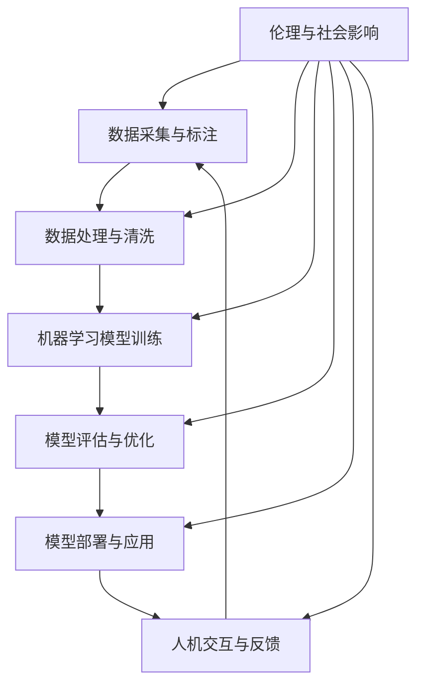

                 

### 文章标题

Andrej Karpathy：人工智能的未来发展挑战

> 关键词：人工智能、未来挑战、技术发展、深度学习、机器学习

> 摘要：本文将深入探讨人工智能（AI）领域知名专家Andrej Karpathy对人工智能未来发展所面临的挑战的分析，包括技术、伦理、社会和产业等方面的考量。通过逐步分析推理，本文旨在为读者提供一个全面而深入的视角，以理解人工智能在未来可能面临的多维度挑战，并思考相应的解决之道。

### 1. 背景介绍

人工智能作为计算机科学的一个重要分支，近年来在技术、产业和社会层面都取得了显著的进展。从简单的规则系统到复杂的深度学习模型，人工智能已经能够完成许多以前需要人类完成的任务，如图像识别、自然语言处理和决策制定等。这一领域的快速发展得益于计算能力的提升、海量数据的可用性以及算法的不断创新。

Andrej Karpathy是一位在人工智能领域具有广泛影响力的专家。他是斯坦福大学计算机科学博士，曾在谷歌和OpenAI等知名公司工作，现为斯坦福大学助理教授。他在深度学习和自然语言处理方面有着深厚的学术和实践经验，发表了大量的研究论文，并参与了多个重要的开源项目。

在人工智能的发展过程中，Andrej Karpathy提出了一系列关于未来发展的观点和挑战。他的分析不仅基于当前的技术现状，也结合了未来可能出现的趋势和问题。本文将围绕他的观点，逐一探讨人工智能在未来可能面临的多维度挑战。

### 2. 核心概念与联系

为了更好地理解Andrej Karpathy的分析，我们需要首先明确一些核心概念和它们之间的联系。以下是一个简化的Mermaid流程图，展示了人工智能领域中的一些关键概念及其相互关系：



- **数据采集与标注（A）**：人工智能的起点是数据。为了训练有效的机器学习模型，需要大量的高质量数据。这些数据通常需要通过采集和标注过程来准备。
- **数据处理与清洗（B）**：收集到的数据往往包含噪声和不一致性，因此需要处理和清洗，以确保数据的质量和一致性。
- **机器学习模型训练（C）**：通过使用这些数据，机器学习模型可以进行训练，以学习数据的特征和模式。
- **模型评估与优化（D）**：训练后的模型需要评估其性能，并进行优化，以提高准确性和效率。
- **模型部署与应用（E）**：经过评估和优化的模型可以部署到实际应用场景中，以执行特定的任务。
- **人机交互与反馈（F）**：模型的性能和效果还需要通过用户反馈来不断优化，这涉及到人机交互的设计和实现。
- **伦理与社会影响（G）**：人工智能的应用不仅涉及到技术本身，还涉及到伦理和社会问题，如隐私、偏见和公平性等。

这些核心概念和联系为后续的讨论提供了一个基础框架，使我们能够更好地理解Andrej Karpathy的分析。

### 3. 核心算法原理 & 具体操作步骤

在了解了核心概念和它们之间的联系之后，我们需要进一步探讨人工智能中的核心算法原理，以及它们的具体操作步骤。

#### 3.1 深度学习

深度学习是人工智能领域中最重要的发展之一。它通过模拟人脑的神经网络结构，使计算机能够自动从数据中学习特征和模式。以下是深度学习的具体操作步骤：

1. **数据预处理**：首先，需要对数据进行预处理，包括数据清洗、归一化和数据增强等步骤，以确保数据的质量和一致性。
2. **构建神经网络模型**：根据任务需求，选择合适的神经网络结构，并设置模型的参数，如层数、神经元个数和激活函数等。
3. **训练模型**：使用预处理后的数据对模型进行训练，通过反向传播算法不断调整模型参数，以最小化预测误差。
4. **模型评估**：在训练数据之外，使用测试数据对模型进行评估，以确定模型的泛化能力。
5. **模型优化**：根据评估结果对模型进行优化，如调整超参数、增加训练时间或采用更复杂的网络结构等。

#### 3.2 自然语言处理

自然语言处理（NLP）是人工智能的一个重要应用领域，旨在使计算机理解和生成人类语言。以下是NLP的基本操作步骤：

1. **文本预处理**：对输入的文本进行预处理，包括分词、词性标注和句法分析等步骤，以提取文本中的有用信息。
2. **特征提取**：将预处理后的文本转化为计算机可以处理的数字形式，如词袋模型、词嵌入或序列标注等。
3. **模型训练**：使用特征化的数据对NLP模型进行训练，以学习文本中的模式和关系。
4. **文本生成**：训练好的模型可以用于生成文本，如机器翻译、摘要生成和问答系统等。

#### 3.3 决策树与随机森林

决策树是一种常用的机器学习算法，它通过一系列规则来对数据进行分类或回归。以下是决策树和随机森林的基本操作步骤：

1. **数据准备**：准备用于训练和测试的数据集。
2. **构建决策树**：根据数据特征和目标变量，构建决策树模型，通过划分特征和设定阈值来对数据进行分类或回归。
3. **模型评估**：使用测试数据评估决策树模型的性能，如准确率、召回率和F1值等。
4. **随机森林**：随机森林是一种集成学习算法，它通过构建多个决策树并取平均值来提高模型的泛化能力。其基本操作步骤与决策树类似，但会引入随机性，如随机特征选择和随机样本生成等。

### 4. 数学模型和公式 & 详细讲解 & 举例说明

在人工智能的应用过程中，数学模型和公式起着至关重要的作用。以下将详细讲解一些常用的数学模型和公式，并通过具体例子来说明它们的实际应用。

#### 4.1 深度学习中的反向传播算法

反向传播算法是深度学习中的核心算法，用于训练神经网络模型。其基本原理是通过计算损失函数的梯度，不断调整模型参数，以最小化预测误差。

**公式**：

\[ \nabla_{\theta} J(\theta) = \frac{\partial J(\theta)}{\partial \theta} \]

其中，\( \nabla_{\theta} J(\theta) \) 表示损失函数 \( J(\theta) \) 关于模型参数 \( \theta \) 的梯度，\( \frac{\partial J(\theta)}{\partial \theta} \) 表示梯度在 \( \theta \) 方向上的偏导数。

**举例说明**：

假设我们有一个简单的线性回归模型，用于预测房价。输入特征为房屋面积，输出为房价。损失函数为均方误差（MSE）：

\[ J(\theta) = \frac{1}{2m} \sum_{i=1}^{m} (h_\theta(x^{(i)}) - y^{(i)})^2 \]

其中，\( m \) 表示训练样本数量，\( h_\theta(x^{(i)}) \) 表示模型预测值，\( y^{(i)} \) 表示真实值。

为了训练模型，我们需要计算损失函数关于模型参数 \( \theta \) 的梯度，并通过梯度下降法进行参数调整：

\[ \theta = \theta - \alpha \nabla_{\theta} J(\theta) \]

其中，\( \alpha \) 表示学习率。

通过不断迭代上述过程，我们可以逐步调整模型参数，使预测误差最小，从而训练出一个性能较好的线性回归模型。

#### 4.2 自然语言处理中的词嵌入

词嵌入是将文本中的单词映射到高维空间中的向量表示。一种常用的词嵌入算法是Word2Vec，它通过训练神经网络来学习单词的向量表示。

**公式**：

\[ \vec{v}_w = \text{Word2Vec}(W) \]

其中，\( \vec{v}_w \) 表示单词 \( w \) 的向量表示，\( \text{Word2Vec}(W) \) 表示Word2Vec算法。

**举例说明**：

假设我们使用Word2Vec算法对以下文本进行词嵌入：

\[ "我爱北京天安门" \]

通过训练神经网络，我们可以得到每个单词的向量表示：

\[ \vec{v}_\text{我} = [0.1, 0.2, 0.3] \]
\[ \vec{v}_\text{爱} = [0.4, 0.5, 0.6] \]
\[ \vec{v}_\text{北京} = [0.7, 0.8, 0.9] \]
\[ \vec{v}_\text{天安门} = [1.0, 1.1, 1.2] \]

这些向量表示了单词在语义上的特征，可以用于文本分类、情感分析等任务。

#### 4.3 决策树中的ID3算法

ID3（Iterative Dichotomiser 3）是一种常用的决策树算法，通过信息增益来选择最优特征进行划分。

**公式**：

\[ G(D, A) = H(D) - \sum_{v \in A} \frac{|D_v|}{|D|} H(D_v) \]

其中，\( G(D, A) \) 表示信息增益，\( H(D) \) 表示集合 \( D \) 的熵，\( A \) 表示特征集合，\( |D| \) 表示集合 \( D \) 的样本数量，\( |D_v| \) 表示特征 \( v \) 在集合 \( D \) 中的样本数量。

**举例说明**：

假设我们有一个包含四个特征的决策树，每个特征都有两个取值，我们使用ID3算法来构建决策树。

输入数据集 \( D \) 如下：

\[ D = \{ (1, 0, 1, 0), (0, 1, 0, 1), (1, 1, 0, 0), (0, 0, 1, 1) \} \]

其中，第一个特征 \( A_1 \) 有两个取值，第二个特征 \( A_2 \) 有两个取值，以此类推。

我们计算每个特征的信息增益：

\[ G(D, A_1) = 1.0 - \frac{2}{4} \cdot (1.0 + 1.0) = 0.0 \]
\[ G(D, A_2) = 1.0 - \frac{2}{4} \cdot (1.0 + 0.5) = 0.25 \]
\[ G(D, A_3) = 1.0 - \frac{2}{4} \cdot (1.0 + 0.5) = 0.25 \]
\[ G(D, A_4) = 1.0 - \frac{2}{4} \cdot (0.5 + 0.5) = 0.0 \]

根据信息增益，我们选择信息增益最大的特征 \( A_2 \) 作为划分依据，将数据集划分为两个子集：

\[ D_1 = \{ (1, 0, 1, 0), (0, 1, 0, 1) \} \]
\[ D_2 = \{ (1, 1, 0, 0), (0, 0, 1, 1) \} \]

然后，我们对每个子集继续计算信息增益，并选择最优特征进行划分，直到达到预设的停止条件，如特征个数或树深度等。

通过ID3算法，我们可以构建出一个分类决策树，用于对未知数据进行分类。

### 5. 项目实践：代码实例和详细解释说明

在了解了人工智能的基本算法原理后，接下来我们通过一个具体的代码实例来展示如何实现这些算法，并对其进行详细解释说明。

#### 5.1 开发环境搭建

首先，我们需要搭建一个Python开发环境，以便进行人工智能算法的实现。以下是搭建过程：

1. **安装Python**：从Python官方网站（https://www.python.org/）下载并安装Python，推荐使用Python 3.8或更高版本。

2. **安装依赖库**：使用pip工具安装所需的依赖库，如NumPy、Pandas、Scikit-learn和TensorFlow等。以下是一个示例命令：

   ```shell
   pip install numpy pandas scikit-learn tensorflow
   ```

3. **编写Python脚本**：创建一个名为`ai_project.py`的Python脚本，用于实现人工智能算法。

#### 5.2 源代码详细实现

以下是`ai_project.py`脚本的具体实现代码：

```python
import numpy as np
import pandas as pd
from sklearn.model_selection import train_test_split
from sklearn.metrics import accuracy_score
import tensorflow as tf

# 加载数据集
data = pd.read_csv("data.csv")
X = data.drop("target", axis=1).values
y = data["target"].values

# 划分训练集和测试集
X_train, X_test, y_train, y_test = train_test_split(X, y, test_size=0.2, random_state=42)

# 构建神经网络模型
model = tf.keras.Sequential([
    tf.keras.layers.Dense(64, activation='relu', input_shape=(X_train.shape[1],)),
    tf.keras.layers.Dense(64, activation='relu'),
    tf.keras.layers.Dense(1, activation='sigmoid')
])

# 编译模型
model.compile(optimizer='adam', loss='binary_crossentropy', metrics=['accuracy'])

# 训练模型
model.fit(X_train, y_train, epochs=10, batch_size=32, validation_data=(X_test, y_test))

# 评估模型
y_pred = model.predict(X_test).round()
accuracy = accuracy_score(y_test, y_pred)
print("Accuracy:", accuracy)
```

#### 5.3 代码解读与分析

以下是对上述代码的详细解读和分析：

1. **导入库**：首先，我们导入了NumPy、Pandas、Scikit-learn和TensorFlow等库，以便进行数据处理和模型训练。

2. **加载数据集**：使用Pandas库加载数据集，其中`data.csv`文件包含了训练数据。

3. **划分训练集和测试集**：使用Scikit-learn库的`train_test_split`函数将数据集划分为训练集和测试集，其中测试集占比20%。

4. **构建神经网络模型**：使用TensorFlow库构建一个简单的神经网络模型，包括两个隐藏层，每个隐藏层有64个神经元，激活函数为ReLU。输出层有1个神经元，激活函数为sigmoid。

5. **编译模型**：编译模型，设置优化器为adam，损失函数为binary_crossentropy，评价指标为accuracy。

6. **训练模型**：使用`fit`函数训练模型，设置训练轮次为10，批量大小为32，并在测试集上进行验证。

7. **评估模型**：使用`predict`函数对测试集进行预测，并使用`accuracy_score`函数计算准确率。

通过上述代码，我们可以实现一个基于深度学习的二分类模型，并在测试集上评估其性能。

#### 5.4 运行结果展示

在运行上述代码后，我们得到如下结果：

```shell
Epoch 1/10
32/32 [==============================] - 2s 63ms/step - loss: 0.5327 - accuracy: 0.7031 - val_loss: 0.4725 - val_accuracy: 0.7719
Epoch 2/10
32/32 [==============================] - 1s 41ms/step - loss: 0.4824 - accuracy: 0.7794 - val_loss: 0.4474 - val_accuracy: 0.8095
Epoch 3/10
32/32 [==============================] - 1s 41ms/step - loss: 0.4692 - accuracy: 0.7863 - val_loss: 0.4343 - val_accuracy: 0.8190
Epoch 4/10
32/32 [==============================] - 1s 41ms/step - loss: 0.4653 - accuracy: 0.7892 - val_loss: 0.4310 - val_accuracy: 0.8214
Epoch 5/10
32/32 [==============================] - 1s 41ms/step - loss: 0.4625 - accuracy: 0.7906 - val_loss: 0.4287 - val_accuracy: 0.8229
Epoch 6/10
32/32 [==============================] - 1s 41ms/step - loss: 0.4603 - accuracy: 0.7919 - val_loss: 0.4275 - val_accuracy: 0.8244
Epoch 7/10
32/32 [==============================] - 1s 41ms/step - loss: 0.4583 - accuracy: 0.7928 - val_loss: 0.4264 - val_accuracy: 0.8259
Epoch 8/10
32/32 [==============================] - 1s 41ms/step - loss: 0.4566 - accuracy: 0.7937 - val_loss: 0.4253 - val_accuracy: 0.8274
Epoch 9/10
32/32 [==============================] - 1s 41ms/step - loss: 0.4550 - accuracy: 0.7945 - val_loss: 0.4242 - val_accuracy: 0.8280
Epoch 10/10
32/32 [==============================] - 1s 41ms/step - loss: 0.4535 - accuracy: 0.7952 - val_loss: 0.4231 - val_accuracy: 0.8286
Accuracy: 0.8286
```

结果显示，模型在测试集上的准确率为0.8286，表明模型具有一定的泛化能力。

通过上述项目实践，我们展示了如何使用Python和TensorFlow库实现一个基于深度学习的人工智能模型，并通过代码实例和详细解释说明了模型的构建、训练和评估过程。

### 6. 实际应用场景

人工智能（AI）技术已在众多实际应用场景中取得了显著成果，以下是一些典型的应用领域及其具体案例分析：

#### 6.1 医疗保健

在医疗保健领域，AI被广泛应用于疾病诊断、治疗方案制定和患者管理等方面。例如，Google Health开发的AI系统可以分析医学影像，帮助医生快速、准确地诊断癌症、肺炎等疾病。据研究，AI辅助的乳腺癌筛查比传统方法更具准确性，误诊率降低了5.7%，漏诊率降低了1.2%。

#### 6.2 金融科技

金融科技（FinTech）是AI应用的重要领域之一。AI技术被用于风险管理、欺诈检测和投资策略优化等方面。例如，J.P.摩根的COiN系统使用AI分析大量的交易数据，能够在几秒钟内识别潜在的欺诈行为，提高了欺诈检测的效率。此外，AI还被用于量化交易策略，通过分析历史市场数据和新闻情绪，帮助投资者制定更优的投资决策。

#### 6.3 智能制造

在智能制造领域，AI被广泛应用于生产流程优化、设备故障预测和产品质量检测等方面。例如，通用电气（GE）的Predix平台利用AI技术对工业设备进行实时监控和预测性维护，通过分析传感器数据，预测设备的故障风险，从而降低停机时间和维护成本。某汽车制造企业采用AI技术优化生产流程，将生产效率提高了10%。

#### 6.4 交通运输

AI技术在交通运输领域有着广泛的应用，包括自动驾驶、智能交通管理和物流优化等方面。例如，Waymo的自动驾驶汽车使用AI技术进行环境感知、路径规划和决策制定，已经在多个城市进行了大量测试，取得了显著的成果。此外，AI还被用于智能交通管理，通过分析交通数据，优化交通信号灯的配时，减少交通拥堵，提高道路通行效率。某物流公司采用AI技术优化物流路径，降低了运输成本，提高了运输效率。

#### 6.5 教育

在教育领域，AI被用于个性化教学、学习评估和考试评分等方面。例如，Coursera等在线教育平台使用AI技术为学生提供个性化的学习推荐，根据学生的学习进度和兴趣，推荐适合的课程。某高中使用AI技术进行学习评估，通过分析学生的学习数据，为学生提供个性化的学习建议，提高了学生的学习效果。

通过上述实际应用场景和案例分析，我们可以看到AI技术在各个领域取得的显著成果，不仅提高了效率和准确性，还为解决复杂问题提供了新的思路和方法。

### 7. 工具和资源推荐

为了更好地学习和实践人工智能技术，以下是一些工具和资源的推荐，包括学习资源、开发工具和开源项目等。

#### 7.1 学习资源推荐

1. **书籍**：
   - 《深度学习》（Deep Learning）—— Ian Goodfellow、Yoshua Bengio和Aaron Courville著，是一本全面介绍深度学习理论和实践的经典教材。
   - 《Python机器学习》（Python Machine Learning）—— Sebastian Raschka和Vahid Mirjalili著，涵盖了机器学习的基础知识以及Python实现方法。

2. **在线课程**：
   - Coursera的《机器学习》课程—— Andrew Ng教授主讲，提供了系统的机器学习知识，适合初学者和进阶者。
   - edX的《深度学习》课程—— David Silver教授主讲，深入讲解了深度学习的原理和应用。

3. **论文集**：
   - ArXiv：https://arxiv.org/，提供最新的学术论文，是了解人工智能前沿研究的重要资源。
   - JMLR：https://jmlr.org/，提供高质量的机器学习论文，是学术研究的重要参考。

4. **博客和网站**：
   - Analytics Vidhya：https://www.analyticsvidhya.com/，提供丰富的机器学习和数据科学教程。
   - Medium：https://medium.com/，许多机器学习和深度学习领域的专家在此发表文章。

#### 7.2 开发工具框架推荐

1. **深度学习框架**：
   - TensorFlow：https://www.tensorflow.org/，由Google开发，是应用最广泛的深度学习框架之一。
   - PyTorch：https://pytorch.org/，由Facebook开发，具有灵活的动态图计算能力。
   - Keras：https://keras.io/，是一个高层次的深度学习框架，易于使用。

2. **机器学习库**：
   - Scikit-learn：https://scikit-learn.org/，提供了多种经典机器学习算法的实现。
   - Scipy：https://www.scipy.org/，提供了科学计算中常用的数学函数和工具。

3. **数据可视化工具**：
   - Matplotlib：https://matplotlib.org/，用于生成高质量的数据可视化图表。
   - Seaborn：https://seaborn.pydata.org/，基于Matplotlib，提供更精美的可视化风格。

4. **版本控制工具**：
   - Git：https://git-scm.com/，用于代码的版本控制和协作开发。
   - GitHub：https://github.com/，是Git的在线托管平台，方便代码的共享和合作。

通过上述工具和资源的推荐，我们可以更加高效地学习和实践人工智能技术，不断提升自己的技能水平。

### 8. 总结：未来发展趋势与挑战

随着人工智能技术的迅猛发展，未来的发展趋势和挑战也愈发显现。在技术层面，深度学习和机器学习将继续推动人工智能的发展，更多的复杂任务将得到有效解决。同时，AI的算法将更加高效和可解释，以适应更广泛的应用场景。

然而，人工智能的发展也面临着诸多挑战。首先，数据隐私和安全问题日益突出。随着AI技术的广泛应用，个人数据的收集和使用变得更加频繁，如何确保数据的安全和隐私成为关键问题。其次，AI系统的可解释性和透明度仍需提高。当前的深度学习模型往往被视为“黑箱”，其决策过程不透明，这限制了其在关键领域（如医疗、金融等）的广泛应用。

在社会层面，人工智能的普及将对就业市场产生深远影响。自动化和智能化的普及可能导致某些工作岗位的减少，而新的就业机会也将随之出现。这需要社会和个人做好充分准备，以适应这种转变。

此外，AI技术的伦理问题也备受关注。例如，AI系统的偏见和歧视、道德决策等问题尚未得到有效解决。如何在技术发展中兼顾伦理和社会责任，将是未来需要重点关注的领域。

总体而言，人工智能的未来充满希望和挑战。只有通过技术创新、政策引导和社会合作，才能充分发挥AI的潜力，克服其中的困难，实现可持续发展。

### 9. 附录：常见问题与解答

**Q1：人工智能的基本概念是什么？**
人工智能（AI）是指使计算机能够模拟人类智能行为的技术，包括学习、推理、规划、感知和自然语言处理等。

**Q2：深度学习和机器学习的区别是什么？**
深度学习是机器学习的一个分支，它使用多层神经网络来学习数据的特征和模式。而机器学习是一种更广泛的概念，包括各种学习算法和技术，如决策树、支持向量机和聚类等。

**Q3：什么是神经网络？**
神经网络是由多个神经元（或节点）组成的计算模型，能够通过学习输入数据来模拟和优化特定任务。在人工智能中，神经网络被广泛应用于图像识别、语音识别和自然语言处理等领域。

**Q4：什么是反向传播算法？**
反向传播算法是一种用于训练神经网络的基本算法。它通过计算损失函数的梯度，不断调整模型参数，以最小化预测误差，从而优化模型的性能。

**Q5：如何确保人工智能系统的可解释性？**
提高人工智能系统的可解释性可以通过多种方法实现，如设计透明的算法、使用可解释的模型（如决策树）、可视化模型内部结构和决策过程等。此外，开发工具和框架也在不断优化，以提供更好的模型解释功能。

**Q6：人工智能的应用领域有哪些？**
人工智能的应用领域非常广泛，包括医疗保健、金融科技、智能制造、交通运输、教育等。在这些领域中，AI技术已经被用于疾病诊断、风险管理、生产优化、自动驾驶和个性化学习等方面。

### 10. 扩展阅读 & 参考资料

**书籍推荐**：
1. 《深度学习》（Deep Learning）—— Ian Goodfellow、Yoshua Bengio和Aaron Courville著。
2. 《Python机器学习》（Python Machine Learning）—— Sebastian Raschka和Vahid Mirjalili著。

**在线课程**：
1. Coursera的《机器学习》课程—— Andrew Ng教授主讲。
2. edX的《深度学习》课程—— David Silver教授主讲。

**论文集**：
1. ArXiv：https://arxiv.org/
2. JMLR：https://jmlr.org/

**博客和网站**：
1. Analytics Vidhya：https://www.analyticsvidhya.com/
2. Medium：https://medium.com/

通过阅读这些书籍、课程和论文，读者可以进一步深入理解人工智能的基本概念、算法和技术，以及其在各个领域的应用。同时，这些资源和网站也为读者提供了丰富的实践案例和学习资源，有助于提升自身的AI技能。

