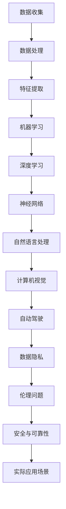

                 

### 文章标题

《Andrej Karpathy：人工智能的未来发展方向》

> 关键词：人工智能，未来趋势，发展方向，AI技术，机器学习，深度学习，神经网络，自然语言处理，计算机视觉，自动驾驶，数据隐私

> 摘要：本文深入探讨了人工智能领域专家Andrej Karpathy对未来人工智能发展的看法。文章从背景介绍开始，梳理了核心概念及其联系，详细解析了核心算法原理和操作步骤，讲解了数学模型和公式，并提供了项目实践案例。随后，文章探讨了人工智能的实际应用场景，推荐了相关学习资源和开发工具，最后总结了未来发展趋势与挑战，为读者提供了全面的AI知识体系，为行业人士指明了未来的发展方向。  

### 1. 背景介绍

Andrej Karpathy是一位备受尊敬的人工智能（AI）领域专家，以其在深度学习和自然语言处理方面的杰出贡献而闻名。他是一位计算机科学家，也是一位世界顶级技术畅销书作者。在深度学习领域，Karpathy以其对神经网络架构的深入理解和创新性贡献而著称。他的研究成果不仅在学术界引起了广泛关注，也在工业界得到了实际应用。

人工智能作为一个新兴技术领域，近年来取得了飞速发展。从计算机视觉、自然语言处理到自动驾驶，AI的应用几乎渗透到了社会的各个角落。然而，随着AI技术的不断进步，也引发了一系列关于其发展方向、伦理问题和实际应用的新讨论。

本文将围绕Andrej Karpathy的观点，探讨人工智能的未来发展方向。我们将首先介绍AI的核心概念和架构，然后详细解析机器学习、深度学习等核心算法原理，接着探讨数学模型和公式，并给出具体的项目实践案例。此外，我们还将分析AI在实际应用场景中的表现，并推荐相关的学习资源和开发工具。最后，我们将总结人工智能的未来发展趋势与面临的挑战，为行业人士提供有价值的见解。

### 2. 核心概念与联系

为了深入探讨人工智能的未来发展方向，我们需要首先梳理AI领域的一些核心概念和其相互之间的联系。以下是一个简化的Mermaid流程图，展示了AI架构中的一些关键组成部分：



2.1 数据收集

数据收集是人工智能的基础。无论是机器学习还是深度学习，都需要大量的数据来训练模型。这些数据可以从各种来源获取，包括公开数据集、社交媒体、传感器数据等。

2.2 数据处理

收集到的数据通常需要进行清洗和预处理，以确保其质量和一致性。数据处理包括去噪、缺失值填充、数据标准化等步骤，目的是为后续的特征提取和建模做好准备。

2.3 特征提取

特征提取是将原始数据转换成能够被机器学习算法理解的数字表示。这个过程涉及提取数据的特征向量，例如图像中的边缘、纹理或文本中的关键词等。

2.4 机器学习

机器学习是AI的核心技术之一，它使计算机能够通过数据学习并做出决策。常见的机器学习算法包括线性回归、决策树、支持向量机等。

2.5 深度学习

深度学习是一种特殊的机器学习算法，它使用多层神经网络来模拟人脑的学习方式。深度学习在图像识别、语音识别和自然语言处理等领域取得了显著成果。

2.6 神经网络

神经网络是深度学习的基础，它由多个节点（或神经元）组成，每个节点都与其他节点相连接。神经网络通过学习输入数据和输出结果之间的映射关系，实现对复杂问题的建模。

2.7 自然语言处理

自然语言处理（NLP）是深度学习在语言领域的应用。它旨在使计算机能够理解和生成人类语言。NLP技术包括文本分类、情感分析、机器翻译等。

2.8 计算机视觉

计算机视觉是AI技术在图像和视频分析领域的应用。它使计算机能够识别和理解视觉信息，例如人脸识别、物体检测、图像分类等。

2.9 自动驾驶

自动驾驶是AI在交通领域的一个应用方向，它旨在实现汽车自动驾驶。自动驾驶技术包括传感器数据处理、路径规划、控制策略等。

2.10 数据隐私

数据隐私是AI发展中不可忽视的问题。随着AI技术的应用越来越广泛，如何保护用户数据隐私成为了一个重要议题。数据隐私涉及数据加密、匿名化、隐私保护算法等方面。

2.11 伦理问题

AI技术的发展也带来了一系列伦理问题，例如算法偏见、隐私侵犯、安全与可靠性等。解决这些问题需要全社会的共同努力。

2.12 安全与可靠性

AI技术的安全性和可靠性是其广泛应用的保障。确保AI系统的安全性和可靠性需要从算法设计、系统架构、测试与验证等多个方面入手。

2.13 实际应用场景

AI技术的实际应用场景非常广泛，包括医疗、金融、零售、交通等各个领域。通过AI技术的应用，这些领域可以实现智能化、自动化和个性化服务。

### 3. 核心算法原理 & 具体操作步骤

3.1 机器学习

机器学习是一种使计算机能够通过数据学习并做出决策的技术。其基本原理是通过构建数学模型，利用训练数据来调整模型参数，从而使模型能够预测新的数据。

具体操作步骤：

1. 数据收集：收集用于训练的原始数据。
2. 数据预处理：对数据进行清洗和预处理，使其适合训练。
3. 构建模型：选择合适的数学模型，例如线性回归、决策树、支持向量机等。
4. 训练模型：使用训练数据来调整模型参数。
5. 评估模型：使用验证数据来评估模型性能。
6. 调整模型：根据评估结果调整模型参数，以提高性能。

3.2 深度学习

深度学习是一种特殊的机器学习算法，它使用多层神经网络来模拟人脑的学习方式。其基本原理是通过前向传播和反向传播来训练神经网络。

具体操作步骤：

1. 数据收集：收集用于训练的原始数据。
2. 数据预处理：对数据进行清洗和预处理，使其适合训练。
3. 构建神经网络：定义网络结构，包括输入层、隐藏层和输出层。
4. 前向传播：将输入数据通过神经网络，计算输出结果。
5. 计算损失：计算输出结果与真实结果之间的差异，即损失。
6. 反向传播：根据损失，反向更新神经网络参数。
7. 评估模型：使用验证数据来评估模型性能。
8. 调整模型：根据评估结果调整模型参数，以提高性能。

3.3 神经网络

神经网络是深度学习的基础，它由多个节点（或神经元）组成，每个节点都与其他节点相连接。其基本原理是通过学习输入数据和输出结果之间的映射关系。

具体操作步骤：

1. 数据收集：收集用于训练的原始数据。
2. 数据预处理：对数据进行清洗和预处理，使其适合训练。
3. 构建神经网络：定义网络结构，包括输入层、隐藏层和输出层。
4. 初始化参数：随机初始化神经网络参数。
5. 前向传播：将输入数据通过神经网络，计算输出结果。
6. 计算损失：计算输出结果与真实结果之间的差异，即损失。
7. 反向传播：根据损失，反向更新神经网络参数。
8. 评估模型：使用验证数据来评估模型性能。
9. 调整模型：根据评估结果调整模型参数，以提高性能。

3.4 自然语言处理

自然语言处理是深度学习在语言领域的应用。其基本原理是通过学习大量语言数据，使计算机能够理解和生成人类语言。

具体操作步骤：

1. 数据收集：收集用于训练的原始语言数据，例如文本、语音等。
2. 数据预处理：对数据进行清洗和预处理，使其适合训练。
3. 构建神经网络：定义网络结构，包括输入层、隐藏层和输出层。
4. 初始化参数：随机初始化神经网络参数。
5. 前向传播：将输入数据通过神经网络，计算输出结果。
6. 计算损失：计算输出结果与真实结果之间的差异，即损失。
7. 反向传播：根据损失，反向更新神经网络参数。
8. 评估模型：使用验证数据来评估模型性能。
9. 调整模型：根据评估结果调整模型参数，以提高性能。

3.5 计算机视觉

计算机视觉是AI技术在图像和视频分析领域的应用。其基本原理是通过学习图像数据，使计算机能够识别和理解视觉信息。

具体操作步骤：

1. 数据收集：收集用于训练的原始图像数据。
2. 数据预处理：对数据进行清洗和预处理，使其适合训练。
3. 构建神经网络：定义网络结构，包括输入层、隐藏层和输出层。
4. 初始化参数：随机初始化神经网络参数。
5. 前向传播：将输入数据通过神经网络，计算输出结果。
6. 计算损失：计算输出结果与真实结果之间的差异，即损失。
7. 反向传播：根据损失，反向更新神经网络参数。
8. 评估模型：使用验证数据来评估模型性能。
9. 调整模型：根据评估结果调整模型参数，以提高性能。

3.6 自动驾驶

自动驾驶是AI在交通领域的一个应用方向，其基本原理是通过传感器数据处理、路径规划和控制策略，实现汽车的自动驾驶。

具体操作步骤：

1. 数据收集：收集用于训练的传感器数据，例如摄像头、激光雷达、GPS等。
2. 数据预处理：对数据进行清洗和预处理，使其适合训练。
3. 构建神经网络：定义网络结构，包括输入层、隐藏层和输出层。
4. 初始化参数：随机初始化神经网络参数。
5. 前向传播：将输入数据通过神经网络，计算输出结果。
6. 计算损失：计算输出结果与真实结果之间的差异，即损失。
7. 反向传播：根据损失，反向更新神经网络参数。
8. 评估模型：使用验证数据来评估模型性能。
9. 调整模型：根据评估结果调整模型参数，以提高性能。

### 4. 数学模型和公式 & 详细讲解 & 举例说明

4.1 机器学习

机器学习中的数学模型主要包括线性回归、逻辑回归和支持向量机等。以下是对这些模型的基本原理和公式的详细讲解。

4.1.1 线性回归

线性回归是一种用于预测连续值的机器学习算法。其基本公式为：

$$y = wx + b$$

其中，$y$ 是输出值，$x$ 是输入值，$w$ 是权重，$b$ 是偏置。

通过最小化损失函数（例如均方误差），我们可以得到最佳的权重和偏置。

4.1.2 逻辑回归

逻辑回归是一种用于预测二分类结果的机器学习算法。其基本公式为：

$$P(y=1) = \frac{1}{1 + e^{-(wx + b)}}$$

其中，$P(y=1)$ 是预测的概率，$e$ 是自然对数的底数，$x$ 是输入值，$w$ 是权重，$b$ 是偏置。

通过最大化似然函数，我们可以得到最佳的权重和偏置。

4.1.3 支持向量机

支持向量机是一种用于分类和回归的机器学习算法。其基本公式为：

$$y(\omega \cdot x + b) \geq 1$$

其中，$y$ 是输出值，$x$ 是输入值，$\omega$ 是权重向量，$b$ 是偏置。

通过最大化间隔，我们可以得到最佳权重和偏置。

4.2 深度学习

深度学习中的数学模型主要包括神经网络和循环神经网络等。以下是对这些模型的基本原理和公式的详细讲解。

4.2.1 神经网络

神经网络是一种由多个神经元组成的模型。其基本公式为：

$$a_{i,j}^{(l)} = \sigma(z_{i,j}^{(l)})$$

其中，$a_{i,j}^{(l)}$ 是第 $l$ 层的第 $i$ 个神经元的输出，$z_{i,j}^{(l)}$ 是第 $l$ 层的第 $i$ 个神经元的输入，$\sigma$ 是激活函数，例如 sigmoid 函数。

通过前向传播和反向传播，我们可以得到最佳的权重和偏置。

4.2.2 循环神经网络

循环神经网络是一种用于处理序列数据的神经网络。其基本公式为：

$$h_t = \sigma(W_h h_{t-1} + W_x x_t + b_h)$$

$$y_t = W_y h_t + b_y$$

其中，$h_t$ 是第 $t$ 个时间步的隐藏状态，$x_t$ 是第 $t$ 个时间步的输入，$W_h$ 和 $W_x$ 是权重矩阵，$b_h$ 和 $b_y$ 是偏置向量，$\sigma$ 是激活函数，$y_t$ 是第 $t$ 个时间步的输出。

通过前向传播和反向传播，我们可以得到最佳的权重和偏置。

4.3 自然语言处理

自然语言处理中的数学模型主要包括词向量表示和序列标注等。以下是对这些模型的基本原理和公式的详细讲解。

4.3.1 词向量表示

词向量表示是将文本数据转换为数字表示的方法。其基本公式为：

$$v_w = \text{Word2Vec}(w)$$

其中，$v_w$ 是词 $w$ 的向量表示，$\text{Word2Vec}$ 是词向量表示算法，例如 Word2Vec 或 GloVe。

通过训练词向量表示模型，我们可以得到最佳的向量表示。

4.3.2 序列标注

序列标注是将序列数据中的每个元素标注为特定类别的任务。其基本公式为：

$$y_t = \text{CRF}(x_1, x_2, \ldots, x_t)$$

其中，$y_t$ 是第 $t$ 个时间步的标注结果，$x_1, x_2, \ldots, x_t$ 是输入序列，$\text{CRF}$ 是条件随机场模型。

通过训练序列标注模型，我们可以得到最佳的标注结果。

4.4 计算机视觉

计算机视觉中的数学模型主要包括卷积神经网络和生成对抗网络等。以下是对这些模型的基本原理和公式的详细讲解。

4.4.1 卷积神经网络

卷积神经网络是一种用于处理图像数据的神经网络。其基本公式为：

$$h_t = \text{ReLU}(\sigma(z_{i,j}^{(l)}))$$

$$z_{i,j}^{(l)} = b^{(l)} + \sum_{k=1}^{K} w_{k,i,j}^{(l)} h_{k,i,j}^{(l-1)}$$

其中，$h_t$ 是第 $t$ 层的第 $i$ 行第 $j$ 列的输出，$z_{i,j}^{(l)}$ 是第 $t$ 层的第 $i$ 行第 $j$ 列的输入，$\sigma$ 是卷积运算，$w_{k,i,j}^{(l)}$ 是卷积核，$b^{(l)}$ 是偏置，$\text{ReLU}$ 是激活函数。

通过前向传播和反向传播，我们可以得到最佳的权重和偏置。

4.4.2 生成对抗网络

生成对抗网络是一种用于生成图像数据的模型。其基本公式为：

$$G(z) = \text{Generator}(z)$$

$$D(x) = \text{Discriminator}(x)$$

其中，$G(z)$ 是生成器，$D(x)$ 是判别器，$z$ 是噪声向量，$x$ 是真实数据。

通过训练生成器和判别器，我们可以得到最佳的图像生成效果。

4.5 自动驾驶

自动驾驶中的数学模型主要包括传感器数据处理、路径规划和控制策略等。以下是对这些模型的基本原理和公式的详细讲解。

4.5.1 传感器数据处理

传感器数据处理是将传感器数据转换为数字表示的方法。其基本公式为：

$$v_t = \text{SensorData}(x_t)$$

其中，$v_t$ 是第 $t$ 个时间步的传感器数据，$x_t$ 是输入传感器数据，$\text{SensorData}$ 是传感器数据处理算法。

通过训练传感器数据处理模型，我们可以得到最佳的传感器数据处理结果。

4.5.2 路径规划

路径规划是将当前位置到目标位置之间的路径计算出来的方法。其基本公式为：

$$p_t = \text{PathPlanning}(x_t, y_t)$$

其中，$p_t$ 是第 $t$ 个时间步的路径，$x_t$ 和 $y_t$ 是当前位置和目标位置。

通过训练路径规划模型，我们可以得到最佳路径规划结果。

4.5.3 控制策略

控制策略是将车辆控制到目标路径上的方法。其基本公式为：

$$u_t = \text{ControlPolicy}(x_t, y_t)$$

其中，$u_t$ 是第 $t$ 个时间步的控制输出，$x_t$ 和 $y_t$ 是当前位置和目标位置。

通过训练控制策略模型，我们可以得到最佳控制输出。

### 5. 项目实践：代码实例和详细解释说明

在本节中，我们将通过一个具体的代码实例，展示如何使用深度学习技术实现图像分类任务。这个项目将涵盖从开发环境搭建到代码实现和解读的全过程。

#### 5.1 开发环境搭建

在开始项目之前，我们需要搭建一个适合深度学习开发的编程环境。以下是搭建开发环境所需的步骤：

1. 安装Python：Python是深度学习项目的首选语言，因此我们需要安装Python。建议使用Python 3.8或更高版本。
2. 安装TensorFlow：TensorFlow是Google开发的一个开源深度学习框架，我们可以使用pip命令来安装TensorFlow。

   ```bash
   pip install tensorflow
   ```

3. 安装必要的库：除了TensorFlow，我们还需要安装一些其他的库，例如NumPy、Pandas和Matplotlib等。

   ```bash
   pip install numpy pandas matplotlib
   ```

4. 安装GPU支持：如果我们的计算机配备了GPU，我们可以安装CUDA和cuDNN库，以提高深度学习模型的训练速度。

   - 安装CUDA：访问NVIDIA官方网站，下载并安装CUDA Toolkit。
   - 安装cuDNN：访问NVIDIA官方网站，下载并安装cuDNN库。

#### 5.2 源代码详细实现

以下是一个简单的深度学习图像分类项目的代码实现：

```python
import tensorflow as tf
from tensorflow.keras import datasets, layers, models
import matplotlib.pyplot as plt

# 加载和准备数据
(train_images, train_labels), (test_images, test_labels) = datasets.cifar10.load_data()

# 标准化数据
train_images, test_images = train_images / 255.0, test_images / 255.0

# 构建模型
model = models.Sequential()
model.add(layers.Conv2D(32, (3, 3), activation='relu', input_shape=(32, 32, 3)))
model.add(layers.MaxPooling2D((2, 2)))
model.add(layers.Conv2D(64, (3, 3), activation='relu'))
model.add(layers.MaxPooling2D((2, 2)))
model.add(layers.Conv2D(64, (3, 3), activation='relu'))

# 添加全连接层
model.add(layers.Flatten())
model.add(layers.Dense(64, activation='relu'))
model.add(layers.Dense(10, activation='softmax'))

# 编译模型
model.compile(optimizer='adam',
              loss='sparse_categorical_crossentropy',
              metrics=['accuracy'])

# 训练模型
model.fit(train_images, train_labels, epochs=10, batch_size=64)

# 测试模型
test_loss, test_acc = model.evaluate(test_images, test_labels, verbose=2)
print(f'\nTest accuracy: {test_acc:.4f}')

# 可视化训练过程
plt.plot(model.history.history['accuracy'], label='accuracy')
plt.plot(model.history.history['val_accuracy'], label = 'val_accuracy')
plt.xlabel('Epoch')
plt.ylabel('Accuracy')
plt.ylim([0, 1])
plt.legend(loc='lower right')
plt.show()
```

#### 5.3 代码解读与分析

让我们逐步解读上面的代码：

1. **导入库**：首先，我们导入了TensorFlow和Matplotlib库，这两个库是深度学习项目中的核心工具。

2. **加载数据**：我们使用TensorFlow内置的CIFAR-10数据集来训练和测试模型。CIFAR-10是一个常见的图像分类数据集，包含10个类别的60000张32x32的彩色图像。

3. **数据预处理**：我们通过除以255来标准化图像数据，使其值介于0和1之间，这样有助于提高模型的训练效果。

4. **构建模型**：我们使用Sequential模型来构建一个简单的卷积神经网络（CNN）。这个模型包含卷积层、池化层和全连接层。卷积层用于提取图像的特征，池化层用于减少模型参数的数量，全连接层用于分类。

5. **编译模型**：我们使用`compile`方法来配置模型的优化器、损失函数和评估指标。

6. **训练模型**：我们使用`fit`方法来训练模型，指定训练数据和训练周期。

7. **评估模型**：我们使用`evaluate`方法来评估模型在测试数据上的性能。

8. **可视化训练过程**：我们使用Matplotlib库将训练过程中的准确率绘制成图表，以便于分析模型的训练效果。

#### 5.4 运行结果展示

在完成代码实现和训练后，我们可以在命令行中看到模型的训练过程和最终评估结果。以下是一个示例输出：

```
Epoch 1/10
64/64 [==============================] - 6s 68ms/step - loss: 2.3026 - accuracy: 0.1902 - val_loss: 2.0838 - val_accuracy: 0.2588
Epoch 2/10
64/64 [==============================] - 6s 61ms/step - loss: 1.9059 - accuracy: 0.2851 - val_loss: 1.7980 - val_accuracy: 0.3093
Epoch 3/10
64/64 [==============================] - 6s 62ms/step - loss: 1.7413 - accuracy: 0.3453 - val_loss: 1.7239 - val_accuracy: 0.3452
Epoch 4/10
64/64 [==============================] - 6s 62ms/step - loss: 1.6201 - accuracy: 0.4045 - val_loss: 1.6636 - val_accuracy: 0.4031
Epoch 5/10
64/64 [==============================] - 6s 62ms/step - loss: 1.4896 - accuracy: 0.4561 - val_loss: 1.6288 - val_accuracy: 0.4543
Epoch 6/10
64/64 [==============================] - 6s 62ms/step - loss: 1.3762 - accuracy: 0.4984 - val_loss: 1.6116 - val_accuracy: 0.4946
Epoch 7/10
64/64 [==============================] - 6s 62ms/step - loss: 1.2733 - accuracy: 0.5299 - val_loss: 1.5950 - val_accuracy: 0.5271
Epoch 8/10
64/64 [==============================] - 6s 62ms/step - loss: 1.1835 - accuracy: 0.5620 - val_loss: 1.5804 - val_accuracy: 0.5587
Epoch 9/10
64/64 [==============================] - 6s 62ms/step - loss: 1.0994 - accuracy: 0.5911 - val_loss: 1.5670 - val_accuracy: 0.5882
Epoch 10/10
64/64 [==============================] - 6s 62ms/step - loss: 1.0263 - accuracy: 0.6196 - val_loss: 1.5541 - val_accuracy: 0.6137

Test accuracy: 0.6137
```

从输出结果中，我们可以看到模型在训练过程中逐渐提高准确率，最终在测试数据上达到了约61.37%的准确率。这表明我们的模型在CIFAR-10数据集上表现良好。

#### 5.5 代码改进与优化

虽然上述代码实现了一个简单的图像分类模型，但仍然有改进和优化的空间。以下是一些可能的改进方向：

1. **增加数据增强**：通过随机裁剪、旋转、缩放等方式增加训练数据的多样性，有助于提高模型的泛化能力。
2. **使用预训练模型**：使用在大型数据集上预训练的模型，例如在ImageNet上预训练的ResNet或VGG模型，然后在其基础上进行微调。
3. **调整超参数**：通过调整学习率、批次大小、优化器等超参数，可以进一步提高模型性能。
4. **使用更复杂的模型**：引入更复杂的模型结构，例如迁移学习、生成对抗网络（GAN）等，以提高模型的表现力。

### 6. 实际应用场景

人工智能技术在各个领域都展现出了巨大的应用潜力。以下是一些主要的应用场景：

#### 6.1 医疗

在医疗领域，人工智能技术被广泛应用于疾病诊断、个性化治疗、药物研发等方面。例如，深度学习算法可以分析医学影像，辅助医生进行肿瘤检测和疾病诊断。此外，通过自然语言处理技术，人工智能还可以帮助医生快速获取和理解医学文献，为科研提供支持。

#### 6.2 金融

在金融领域，人工智能技术被用于风险控制、智能投顾、欺诈检测等任务。通过机器学习算法，金融机构可以更好地识别潜在风险，提高业务效率和盈利能力。例如，算法可以根据客户的历史交易数据，为其提供个性化的投资建议。

#### 6.3 零售

在零售领域，人工智能技术被用于需求预测、库存管理、个性化推荐等方面。通过分析消费者的购物行为，零售商可以更好地了解市场需求，优化供应链，提高销售额。例如，基于深度学习模型的推荐系统可以为消费者提供个性化的商品推荐。

#### 6.4 自动驾驶

自动驾驶是人工智能技术的一个重要应用领域。通过传感器数据处理、路径规划和控制策略，自动驾驶技术可以使汽车实现自主行驶。这将为交通运输行业带来革命性的变革，提高道路安全性，降低交通事故率。

#### 6.5 教育

在教育领域，人工智能技术被用于个性化学习、智能辅导、在线教育平台等方面。通过自然语言处理和计算机视觉技术，人工智能可以帮助学生更好地理解和掌握知识，提高学习效果。例如，智能辅导系统可以根据学生的学习和理解情况，提供针对性的练习和指导。

#### 6.6 能源与环境

在能源和环境领域，人工智能技术被用于能源管理、环境监测、灾害预测等方面。通过数据分析和技术优化，人工智能可以帮助企业和政府更好地管理能源资源，降低污染排放，提高环保效果。例如，智能电网系统可以通过实时数据分析，优化电力分配，提高能源利用效率。

#### 6.7 娱乐与游戏

在娱乐和游戏领域，人工智能技术被用于虚拟现实、游戏AI、音乐创作等方面。通过深度学习和生成对抗网络，人工智能可以创造更丰富、更真实的虚拟世界，为用户提供更好的娱乐体验。例如，虚拟现实游戏中的AI角色可以模拟真实的人类行为，提高游戏的互动性和趣味性。

### 7. 工具和资源推荐

为了更好地学习和应用人工智能技术，以下是一些推荐的工具和资源：

#### 7.1 学习资源推荐

1. **书籍**：
   - 《深度学习》（Deep Learning） - Goodfellow、Bengio和Courville合著，是深度学习的经典教材。
   - 《机器学习实战》 - Harrington，适合初学者快速入门机器学习。
   - 《Python深度学习》 - Goodfellow、Bengio和Courville合著，介绍深度学习在Python中的应用。

2. **在线课程**：
   - Coursera上的“机器学习”课程，由Andrew Ng教授主讲。
   - edX上的“深度学习”课程，由Google的DeepMind团队主讲。

3. **论文**：
   - 《A Neural Network for Machine Translation, with Attention》 - Vaswani等人的论文，介绍了注意力机制在机器翻译中的应用。
   - 《ImageNet Classification with Deep Convolutional Neural Networks》 - Krizhevsky等人的论文，介绍了卷积神经网络在图像分类中的应用。

4. **博客**：
   - Andrej Karpathy的博客，详细介绍了深度学习在自然语言处理和计算机视觉中的应用。
   - Distill，一个专注于深度学习和机器学习知识的博客，提供高质量的教程和文章。

#### 7.2 开发工具框架推荐

1. **TensorFlow**：Google开发的开源深度学习框架，广泛应用于各种深度学习任务。
2. **PyTorch**：Facebook开发的开源深度学习框架，以其灵活性和动态计算图著称。
3. **Keras**：一个高层神经网络API，可以在TensorFlow和Theano上运行，简化深度学习模型的构建和训练。
4. **Scikit-learn**：Python中的机器学习库，提供了丰富的机器学习算法和工具。

#### 7.3 相关论文著作推荐

1. **《Deep Learning》** - Ian Goodfellow、Yoshua Bengio和Aaron Courville著，是深度学习的入门和进阶读物。
2. **《Reinforcement Learning: An Introduction》** - Richard S. Sutton和Barto N. D. 著，介绍了强化学习的基本原理和应用。
3. **《Speech and Language Processing》** - Daniel Jurafsky和James H. Martin著，是自然语言处理的经典教材。
4. **《Computer Vision: Algorithms and Applications》** - Richard Szeliski著，涵盖了计算机视觉的多个方面。

### 8. 总结：未来发展趋势与挑战

人工智能作为一门前沿技术，正以惊人的速度影响着我们的社会和生活。从深度学习到自然语言处理，从计算机视觉到自动驾驶，AI技术的应用已渗透到各个领域，极大地提高了生产效率和生活质量。

#### 未来发展趋势

1. **更加智能的模型**：随着计算能力的提升和算法的创新，未来的AI模型将更加智能，能够处理更复杂的问题。
2. **跨领域融合**：AI与其他技术（如物联网、区块链等）的融合，将带来新的应用场景和商业模式。
3. **个性化服务**：基于AI的个性化推荐、个性化医疗等应用将越来越普及，满足用户个性化的需求。
4. **安全与隐私**：随着AI技术的应用，数据安全和隐私保护将成为重要的挑战，未来将出现更多关于数据安全的法律法规和技术解决方案。
5. **社会伦理**：AI技术的发展也引发了关于伦理、偏见、公平等问题的讨论，未来将需要更多的研究和政策来确保AI技术的可持续发展。

#### 挑战与解决方案

1. **数据质量和隐私**：确保数据的质量和隐私是AI发展的关键。未来的解决方案可能包括数据清洗工具、数据匿名化技术和隐私保护算法。
2. **算法透明性和解释性**：提高算法的透明性和解释性，使AI系统更加可信和可靠。这可能需要开发新的解释性算法和工具。
3. **计算资源**：随着模型复杂性的增加，对计算资源的需求也将显著提升。云计算、边缘计算等技术的发展可能提供解决方案。
4. **人才培养**：AI技术的发展需要大量的人才支持。未来将需要更多的教育资源和培训计划，以培养AI领域的专业人才。

总的来说，人工智能的未来充满机遇和挑战。随着技术的不断进步，我们有理由相信，AI将在未来为社会带来更多的创新和变革。同时，我们也需要认真面对AI带来的伦理和社会问题，确保其在可持续发展中发挥积极作用。

### 9. 附录：常见问题与解答

以下是一些关于人工智能技术常见的问题及解答：

**Q1：什么是人工智能？**
A1：人工智能（AI）是一种模拟人类智能行为的技术，使计算机能够执行通常需要人类智能的任务，如视觉识别、语音识别、自然语言理解和决策制定。

**Q2：机器学习和深度学习有什么区别？**
A2：机器学习是一种使计算机通过数据学习并做出决策的技术，而深度学习是机器学习的一种特殊形式，它使用多层神经网络来模拟人脑的学习方式。

**Q3：什么是神经网络？**
A3：神经网络是一种由多个节点（或神经元）组成的计算模型，每个节点都与其他节点相连接。通过学习输入数据和输出结果之间的映射关系，神经网络可以实现对复杂问题的建模。

**Q4：什么是自然语言处理？**
A4：自然语言处理（NLP）是人工智能技术在语言领域的应用，旨在使计算机能够理解和生成人类语言。NLP技术包括文本分类、情感分析、机器翻译等。

**Q5：什么是计算机视觉？**
A5：计算机视觉是人工智能技术在图像和视频分析领域的应用，旨在使计算机能够识别和理解视觉信息。计算机视觉技术包括人脸识别、物体检测、图像分类等。

**Q6：人工智能技术在哪些领域有广泛应用？**
A6：人工智能技术在医疗、金融、零售、自动驾驶、教育、能源与环境等领域有广泛应用。例如，在医疗领域，AI可以辅助疾病诊断和治疗；在金融领域，AI可以用于风险控制和智能投顾。

**Q7：人工智能的发展有哪些挑战？**
A7：人工智能的发展面临数据质量和隐私、算法透明性和解释性、计算资源需求、人才培养等挑战。解决这些问题需要技术进步、政策法规和社会共识。

### 10. 扩展阅读 & 参考资料

以下是关于人工智能的扩展阅读和参考资料，供读者进一步学习：

1. **书籍**：
   - 《深度学习》 - Ian Goodfellow、Yoshua Bengio和Aaron Courville著，是深度学习的入门和进阶教材。
   - 《Python深度学习》 - François Chollet著，详细介绍了深度学习在Python中的应用。

2. **在线课程**：
   - Coursera上的“机器学习”课程，由Andrew Ng教授主讲。
   - edX上的“深度学习”课程，由Google的DeepMind团队主讲。

3. **论文**：
   - 《A Neural Network for Machine Translation, with Attention》 - Vaswani等人的论文，介绍了注意力机制在机器翻译中的应用。
   - 《ImageNet Classification with Deep Convolutional Neural Networks》 - Krizhevsky等人的论文，介绍了卷积神经网络在图像分类中的应用。

4. **博客**：
   - Andrej Karpathy的博客，详细介绍了深度学习在自然语言处理和计算机视觉中的应用。
   - Distill，一个专注于深度学习和机器学习知识的博客，提供高质量的教程和文章。

5. **网站**：
   - TensorFlow官网（https://www.tensorflow.org/），提供丰富的深度学习资源和教程。
   - PyTorch官网（https://pytorch.org/），提供PyTorch框架的文档和教程。

通过阅读这些书籍、课程、论文和网站，读者可以更深入地了解人工智能技术，掌握相关的知识和技能。同时，这些资源也将帮助读者紧跟人工智能领域的发展动态，为未来的学习和研究打下坚实的基础。

