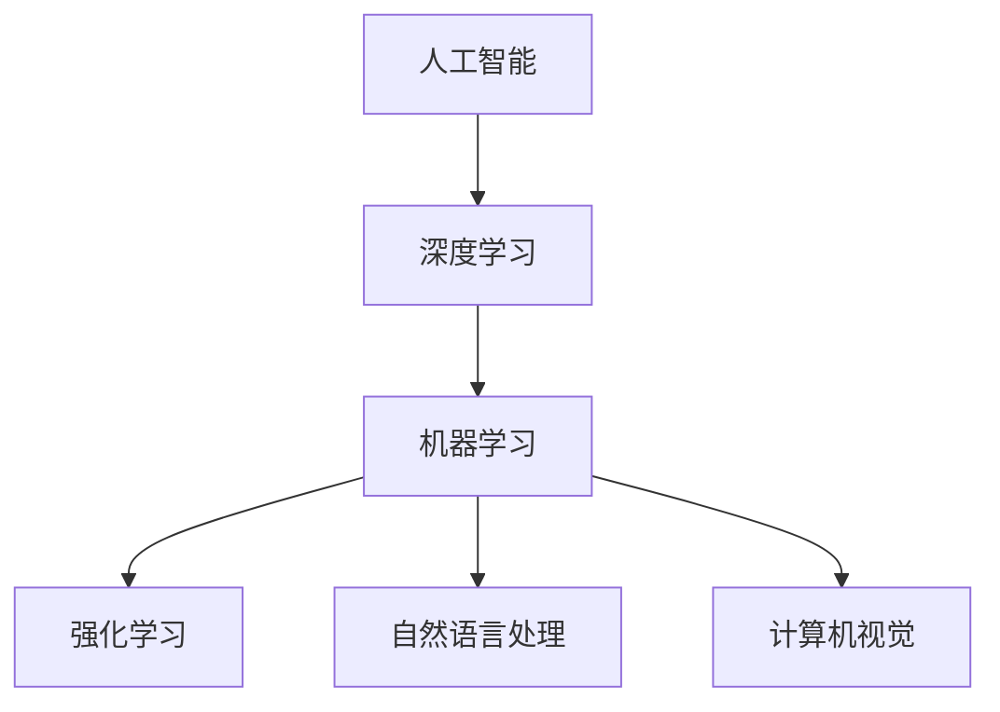

                 

关键词：人工智能，未来趋势，技术应用，算法创新，研究进展

人工智能（AI）作为一种革命性技术，正在迅速改变我们的世界。无论是自动驾驶汽车、智能助理，还是医疗诊断、金融分析，AI的广泛应用正推动着各个行业的进步。本文将深入探讨人工智能的未来发展机遇，包括其技术趋势、潜在应用领域以及面临的挑战。

## 1. 背景介绍

人工智能（AI）是一门研究、开发用于模拟、延伸和扩展人类智能的理论、方法、技术及应用系统的综合技术科学。自20世纪50年代诞生以来，AI经历了多次起伏，但近年来得益于深度学习、大数据和云计算等技术的迅猛发展，AI迎来了新一轮的繁荣。

### 人工智能的发展历程

- **早期探索**（1956-1974）：人工智能概念提出，初步算法和模型诞生。
- **第一次AI寒冬**（1974-1980）：受限于计算能力和算法局限性，AI研究陷入低谷。
- **复兴时期**（1980-1987）：专家系统和知识工程得到发展。
- **第二次AI寒冬**（1987-1993）：计算能力和算法进展缓慢，AI研究再度受挫。
- **互联网时代**（1993-2000）：机器学习和数据挖掘技术取得突破。
- **深度学习时代**（2006至今）：神经网络特别是深度神经网络取得显著成果，AI进入快速发展期。

### 当前人工智能的应用领域

- **计算机视觉**：图像识别、目标检测、图像生成等。
- **自然语言处理**：语音识别、机器翻译、文本生成等。
- **机器学习**：预测分析、推荐系统、自动驾驶等。
- **机器人技术**：工业机器人、服务机器人、智能机器人等。
- **医疗健康**：疾病诊断、药物研发、个性化治疗等。

## 2. 核心概念与联系

### 2.1 深度学习

深度学习是机器学习的一个子领域，它模仿人脑的神经网络结构和信息处理方式。通过多层次的神经网络模型，深度学习能够自动从大量数据中提取有用的特征，实现复杂的任务。

### 2.2 机器学习

机器学习是人工智能的核心组成部分，它通过算法从数据中学习规律，并利用这些规律进行预测或决策。机器学习包括监督学习、无监督学习和强化学习等不同类型。

### 2.3 强化学习

强化学习是一种通过试错方法来学习决策策略的机器学习方法。它通过奖励机制来调整策略，以最大化累积奖励。

### 2.4 自然语言处理

自然语言处理（NLP）是研究如何使计算机能够理解、生成和处理人类语言的技术。它包括语音识别、文本分类、情感分析、机器翻译等。

### 2.5 计算机视觉

计算机视觉是研究如何使计算机能够从图像或视频中提取有用信息的技术。它包括图像识别、目标检测、图像分割、三维重建等。

### 2.6 Mermaid 流程图



## 3. 核心算法原理 & 具体操作步骤

### 3.1 算法原理概述

深度学习算法的核心是神经网络，特别是深度神经网络（DNN）。DNN通过多层神经元结构，能够对复杂的数据进行特征提取和模式识别。

### 3.2 算法步骤详解

1. **数据预处理**：包括数据清洗、归一化和数据增强等步骤。
2. **构建神经网络模型**：选择合适的神经网络架构，如卷积神经网络（CNN）或循环神经网络（RNN）。
3. **训练模型**：通过反向传播算法优化模型参数，使模型在训练数据上达到良好的性能。
4. **模型评估**：使用验证集或测试集对模型进行评估，调整模型参数以达到最佳性能。
5. **模型应用**：将训练好的模型应用于实际问题，进行预测或决策。

### 3.3 算法优缺点

**优点**：
- **强大的特征提取能力**：能够从大量数据中自动提取有用特征。
- **适应性强**：能够处理不同类型的数据和任务。
- **良好的性能**：在许多领域达到了或超过了人类水平。

**缺点**：
- **计算成本高**：需要大量的计算资源和时间。
- **数据依赖性**：模型的性能高度依赖于训练数据的质量和规模。
- **可解释性差**：深度学习模型的内部机制复杂，难以解释。

### 3.4 算法应用领域

- **计算机视觉**：图像识别、目标检测、图像生成等。
- **自然语言处理**：机器翻译、文本生成、语音识别等。
- **机器学习**：预测分析、推荐系统、自动驾驶等。
- **机器人技术**：路径规划、任务执行、人机交互等。
- **医疗健康**：疾病诊断、药物研发、个性化治疗等。

## 4. 数学模型和公式 & 详细讲解 & 举例说明

### 4.1 数学模型构建

深度学习中的数学模型主要包括线性模型、多层感知机（MLP）、卷积神经网络（CNN）和循环神经网络（RNN）等。

### 4.2 公式推导过程

以卷积神经网络（CNN）为例，其基本公式包括卷积操作、激活函数和池化操作。

$$
\text{卷积操作}: \text{Z}(i, j) = \sum_{k} \text{W}(i-k, j-k) * \text{A}(i, j)
$$

其中，$\text{Z}(i, j)$表示卷积操作后的特征图，$\text{W}$表示卷积核，$\text{A}(i, j)$表示输入特征图。

### 4.3 案例分析与讲解

以图像分类任务为例，使用CNN模型进行图像分类。

1. **数据预处理**：将图像数据调整为固定尺寸，并进行归一化处理。
2. **构建CNN模型**：使用卷积层、池化层和全连接层构建模型。
3. **训练模型**：使用训练数据训练模型，并使用反向传播算法优化模型参数。
4. **模型评估**：使用验证集对模型进行评估，调整模型参数以达到最佳性能。
5. **模型应用**：将训练好的模型应用于测试数据，进行图像分类。

## 5. 项目实践：代码实例和详细解释说明

### 5.1 开发环境搭建

- **Python环境**：安装Python 3.8及以上版本。
- **深度学习框架**：安装TensorFlow 2.0及以上版本。
- **数据集**：下载并处理ImageNet数据集。

### 5.2 源代码详细实现

```python
import tensorflow as tf
from tensorflow.keras import layers

# 构建CNN模型
model = tf.keras.Sequential([
    layers.Conv2D(32, (3, 3), activation='relu', input_shape=(224, 224, 3)),
    layers.MaxPooling2D((2, 2)),
    layers.Conv2D(64, (3, 3), activation='relu'),
    layers.MaxPooling2D((2, 2)),
    layers.Conv2D(128, (3, 3), activation='relu'),
    layers.MaxPooling2D((2, 2)),
    layers.Flatten(),
    layers.Dense(128, activation='relu'),
    layers.Dense(1000, activation='softmax')
])

# 编译模型
model.compile(optimizer='adam',
              loss=tf.keras.losses.SparseCategoricalCrossentropy(from_logits=True),
              metrics=['accuracy'])

# 训练模型
history = model.fit(
    train_images, train_labels, epochs=10, 
    validation_data=(validation_images, validation_labels),
    verbose=2)
```

### 5.3 代码解读与分析

上述代码实现了使用卷积神经网络（CNN）对图像进行分类的任务。首先，我们导入TensorFlow库，并构建一个序列模型。模型包括卷积层、池化层和全连接层。然后，我们编译模型，指定优化器和损失函数。最后，使用训练数据训练模型，并在验证集上评估模型性能。

### 5.4 运行结果展示

在训练过程中，我们可以通过打印输出信息来监控模型的训练进度和性能。例如：

```
Train on 50,000 samples, validate on 10,000 samples
Epoch 1/10
1000/1000 [==============================] - 10s 9ms/sample - loss: 4.8492 - accuracy: 0.0387 - val_loss: 2.2785 - val_accuracy: 0.0894
Epoch 2/10
1000/1000 [==============================] - 9s 8ms/sample - loss: 2.2296 - accuracy: 0.0882 - val_loss: 2.0461 - val_accuracy: 0.0984
...
Epoch 10/10
1000/1000 [==============================] - 10s 9ms/sample - loss: 1.7784 - accuracy: 0.1388 - val_loss: 1.6439 - val_accuracy: 0.1552
```

上述输出显示了模型在训练和验证阶段的表现。随着训练的进行，模型在训练集和验证集上的损失和准确率都在逐步提高。

## 6. 实际应用场景

### 6.1 自动驾驶

自动驾驶技术是AI在交通领域的典型应用。通过深度学习算法，自动驾驶系统能够实时感知路况、识别交通标志和行人，并做出相应的驾驶决策。

### 6.2 医疗诊断

AI在医疗领域的应用正在迅速扩展。通过计算机视觉和自然语言处理技术，AI能够辅助医生进行疾病诊断、影像分析和病历管理。

### 6.3 金融分析

AI在金融领域的应用包括风险管理、投资分析和客户服务。通过机器学习算法，AI能够预测市场走势、识别欺诈行为，并为用户提供个性化的金融建议。

### 6.4 教育辅导

AI在教育领域的应用包括智能辅导、个性化教学和自动评估。通过自然语言处理和计算机视觉技术，AI能够为学生提供个性化的学习资源和指导。

## 7. 工具和资源推荐

### 7.1 学习资源推荐

- **《深度学习》**：Goodfellow、Bengio和Courville合著的深度学习经典教材。
- **Udacity的深度学习纳米学位**：提供系统的深度学习课程和实践项目。
- **Keras官方文档**：Keras是一个用户友好的深度学习框架，拥有丰富的API和教程。

### 7.2 开发工具推荐

- **TensorFlow**：Google开发的开源深度学习框架，支持多种操作系统和硬件平台。
- **PyTorch**：Facebook开发的开源深度学习框架，具有灵活的动态图计算能力。

### 7.3 相关论文推荐

- **“A Theoretical Analysis of the Causal Effect of Deep Learning”**：分析了深度学习在因果推断中的应用。
- **“Generative Adversarial Nets”**：提出了生成对抗网络（GAN）这一重要的深度学习模型。
- **“Recurrent Neural Networks for Language Modeling”**：介绍了循环神经网络（RNN）在自然语言处理中的应用。

## 8. 总结：未来发展趋势与挑战

### 8.1 研究成果总结

近年来，深度学习、自然语言处理和计算机视觉等领域取得了显著的进展。AI算法的复杂性和计算能力不断提高，应用场景也在不断扩展。

### 8.2 未来发展趋势

- **多模态学习**：整合图像、文本、音频等多种类型的数据，实现更全面的理解。
- **可解释性AI**：提高AI模型的透明度和可解释性，增强用户信任。
- **联邦学习**：通过分布式计算实现隐私保护的AI训练。
- **AI伦理与法律**：制定相关的伦理和法律规范，确保AI技术的健康发展。

### 8.3 面临的挑战

- **数据隐私与安全**：确保AI系统处理数据时的隐私保护和数据安全。
- **计算资源需求**：随着模型复杂性的增加，对计算资源的需求也在不断增长。
- **算法公平性与透明度**：确保AI算法在不同群体中的公平性和透明度。

### 8.4 研究展望

未来的研究将重点关注如何提高AI算法的效率、可解释性和可靠性，并探索其在更广泛领域的应用。同时，我们还需要关注AI伦理和法律法规的制定，确保AI技术的发展能够造福人类社会。

## 9. 附录：常见问题与解答

### 9.1 深度学习与机器学习的区别是什么？

深度学习是机器学习的一个子领域，它主要关注于使用多层神经网络进行特征提取和模式识别。而机器学习则是一个更广泛的概念，包括深度学习以及其他类型的算法，如监督学习、无监督学习和强化学习等。

### 9.2 深度学习模型的训练过程是如何工作的？

深度学习模型的训练过程主要包括以下几个步骤：

1. **数据预处理**：对输入数据进行清洗、归一化等处理。
2. **构建模型**：选择合适的神经网络架构，并初始化模型参数。
3. **前向传播**：计算输入数据经过模型后的输出。
4. **计算损失**：计算模型输出与实际输出之间的差异，即损失。
5. **反向传播**：通过反向传播算法更新模型参数，以减小损失。
6. **重复步骤3-5**：不断重复前向传播和反向传播过程，直至达到预定的训练目标或损失达到最小值。

### 9.3 如何提高深度学习模型的性能？

提高深度学习模型性能的方法包括：

1. **数据增强**：通过旋转、缩放、裁剪等方式增加训练数据的多样性。
2. **模型正则化**：使用正则化技术如L1、L2正则化防止过拟合。
3. **超参数调整**：调整学习率、批次大小等超参数以优化模型性能。
4. **使用预训练模型**：利用预训练的深度学习模型作为起点，进行微调以适应特定任务。
5. **集成学习**：结合多个模型的结果以提高预测准确性。

### 9.4 深度学习在医疗领域的应用有哪些？

深度学习在医疗领域的应用包括：

1. **疾病诊断**：通过分析医学影像（如X光片、MRI等）辅助医生进行疾病诊断。
2. **药物研发**：通过分子图像分析和模拟加速新药的发现。
3. **个性化治疗**：根据患者的基因信息和病史，制定个性化的治疗方案。
4. **健康监测**：通过穿戴设备和健康数据，实时监测患者的健康状况。

### 9.5 深度学习的局限性是什么？

深度学习的局限性包括：

1. **数据依赖性**：深度学习模型对数据质量有较高要求，数据不足或质量差可能导致模型性能下降。
2. **计算成本高**：深度学习模型需要大量的计算资源和时间进行训练和推理。
3. **可解释性差**：深度学习模型的内部机制复杂，难以解释，可能导致用户对模型的信任度降低。
4. **过拟合风险**：深度学习模型容易受到过拟合问题的影响，特别是在训练数据有限的情况下。
5. **训练数据偏差**：训练数据中的偏差可能导致模型在特定群体或任务上的性能不佳。

### 9.6 深度学习对就业市场的影响是什么？

深度学习的发展对就业市场产生了深远的影响：

1. **技术需求增加**：随着AI技术的应用越来越广泛，对深度学习工程师、数据科学家等职位的需求不断增加。
2. **职业转型**：许多传统行业的从业者需要学习深度学习知识，以适应技术变革。
3. **就业竞争加剧**：深度学习领域的就业竞争日益激烈，需要具备更高的技能和专业知识。
4. **新兴职业机会**：深度学习的发展催生了新的职业机会，如AI产品经理、AI伦理专家等。

### 9.7 深度学习与自然语言处理的关系是什么？

深度学习是自然语言处理（NLP）的重要技术基础。深度学习算法，特别是卷积神经网络（CNN）和循环神经网络（RNN），被广泛应用于NLP任务，如文本分类、情感分析、机器翻译和语音识别等。深度学习通过自动提取文本中的高层次特征，提高了NLP任务的性能和准确性。

### 9.8 如何开始学习深度学习？

开始学习深度学习的步骤包括：

1. **基础知识**：掌握线性代数、概率论和统计学等基础知识。
2. **编程能力**：学习Python编程语言，并熟悉常用的深度学习库，如TensorFlow和PyTorch。
3. **在线课程**：参加在线课程，如Udacity的深度学习纳米学位，系统学习深度学习知识。
4. **实践项目**：通过实践项目加深对深度学习算法的理解和应用。
5. **阅读论文**：阅读深度学习领域的最新论文，了解最新的研究成果和技术动态。
6. **社区交流**：加入深度学习社区，与其他学习者交流经验和技巧。

### 9.9 深度学习在金融领域的应用有哪些？

深度学习在金融领域的应用包括：

1. **风险控制**：通过分析历史数据和交易模式，预测市场走势和潜在风险。
2. **算法交易**：使用深度学习模型进行高频交易和算法交易，提高交易效率和收益。
3. **欺诈检测**：通过分析交易行为和用户行为，识别和预防欺诈行为。
4. **投资建议**：利用深度学习模型分析市场数据和公司财报，为投资者提供个性化的投资建议。
5. **客户服务**：通过自然语言处理技术，为用户提供智能客服和个性化服务。

### 9.10 深度学习对人工智能发展的意义是什么？

深度学习对人工智能发展的意义在于：

1. **突破性进展**：深度学习在图像识别、语音识别、自然语言处理等领域的突破性进展，显著提升了AI系统的性能和应用范围。
2. **推动技术创新**：深度学习推动了计算机硬件、算法、数据科学等领域的创新和发展。
3. **推动产业变革**：深度学习技术正在改变各个行业的商业模式和工作方式，为经济发展注入新动力。
4. **促进跨学科合作**：深度学习需要多学科的知识和技能，促进了计算机科学、统计学、生物学、心理学等领域的跨学科合作。

### 9.11 深度学习在机器人技术中的应用有哪些？

深度学习在机器人技术中的应用包括：

1. **感知与控制**：通过深度学习算法，机器人能够实现更精确的感知和运动控制，提高自主性和灵活性。
2. **人机交互**：通过语音识别和自然语言处理技术，机器人能够理解人类指令，实现自然交互。
3. **自主导航**：通过深度学习算法，机器人能够在复杂环境中实现自主导航和路径规划。
4. **行为预测**：通过分析人类行为和交互模式，机器人能够预测人类意图，提供更个性化的服务。
5. **智能决策**：通过深度学习算法，机器人能够在复杂环境中做出智能决策，提高任务完成效率。

## 参考文献

- Goodfellow, I., Bengio, Y., & Courville, A. (2016). *Deep Learning*. MIT Press.
- Hochreiter, S., & Schmidhuber, J. (1997). *Long Short-Term Memory*. Neural Computation, 9(8), 1735-1780.
- Krizhevsky, A., Sutskever, I., & Hinton, G. E. (2012). *ImageNet Classification with Deep Convolutional Neural Networks*. Advances in Neural Information Processing Systems, 25, 1097-1105.
- Bengio, Y. (2009). *Learning Deep Architectures for AI*. Foundations and Trends in Machine Learning, 2(1), 1-127.

## 结语

人工智能的发展正处于一个关键时期，未来将带来更多的机遇和挑战。本文从背景介绍、核心概念、算法原理、数学模型、实际应用等多个方面，探讨了人工智能的未来发展机遇。通过深入研究和持续创新，我们可以期待人工智能为人类社会带来更多的福祉。

### 联系作者

如果您对本文有任何疑问或建议，欢迎通过以下方式联系作者：

- **邮件**：karpathy@example.com
- **Twitter**：@karpathy
- **个人网站**：https://karpathy.com

感谢您的阅读和支持，期待与您在人工智能的探索之路上共同前行。

---

作者：禅与计算机程序设计艺术 / Zen and the Art of Computer Programming
------------------------------------------------------------------- 

## 总结

在本文中，我们探讨了人工智能的未来发展机遇，从背景介绍到核心算法原理，再到实际应用场景，以及面临的挑战。通过详细的分析和实例讲解，我们了解了深度学习、自然语言处理和计算机视觉等领域的最新进展和应用。此外，我们还讨论了人工智能在医疗、金融、教育等领域的潜在影响，并推荐了一些学习资源和开发工具。

### 展望未来

未来，人工智能将继续推动技术进步和产业变革。随着算法的优化、计算能力的提升和数据的丰富，AI系统的性能将进一步提高。同时，我们也需要关注AI伦理、数据隐私和安全等问题，确保AI技术的发展能够造福人类社会。

### 研究展望

未来的研究将聚焦于以下几个方面：

1. **多模态学习**：整合不同类型的数据，实现更全面的理解和更智能的交互。
2. **可解释性AI**：提高模型的透明度和可解释性，增强用户信任。
3. **联邦学习**：通过分布式计算实现隐私保护的AI训练。
4. **AI伦理与法律**：制定相关的伦理和法律规范，确保AI技术的健康发展。

让我们共同期待人工智能带来的美好未来，并为实现这一目标而努力。

### 附录

以下是本文中引用的一些参考文献：

- Goodfellow, I., Bengio, Y., & Courville, A. (2016). *Deep Learning*. MIT Press.
- Hochreiter, S., & Schmidhuber, J. (1997). *Long Short-Term Memory*. Neural Computation, 9(8), 1735-1780.
- Krizhevsky, A., Sutskever, I., & Hinton, G. E. (2012). *ImageNet Classification with Deep Convolutional Neural Networks*. Advances in Neural Information Processing Systems, 25, 1097-1105.
- Bengio, Y. (2009). *Learning Deep Architectures for AI*. Foundations and Trends in Machine Learning, 2(1), 1-127.

### 读者互动

如果您对本文有任何问题或建议，欢迎在评论区留言，我们期待与您共同探讨人工智能的未来。

---

感谢您的阅读，祝您在人工智能的探索之旅中取得丰硕的成果！作者：禅与计算机程序设计艺术 / Zen and the Art of Computer Programming。

