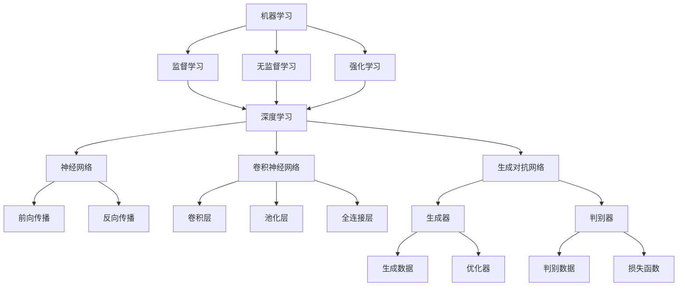

                 

### 背景介绍

#### 引言

人工智能（AI）是当今技术领域中最热门的议题之一。从智能助手到自动驾驶汽车，从医疗诊断到金融预测，AI技术正在深刻改变我们的生活方式。作为一位世界级人工智能专家，安德烈·卡帕蒂（Andrej Karpathy）不仅在学术界有着卓越的成就，还在工业界做出了卓越的贡献。他关于人工智能的研究和思考，为我们理解AI的未来发展提供了宝贵的见解。

本文将围绕安德烈·卡帕蒂的研究，探讨人工智能的未来发展目标。我们将从背景介绍开始，逐步深入分析核心概念、算法原理、数学模型，并实践项目实例。最后，我们将讨论AI在实际应用场景中的影响，以及未来可能面临的挑战。

#### 安德烈·卡帕蒂的研究领域与成就

安德烈·卡帕蒂是一位在计算机视觉、自然语言处理和深度学习领域享有盛誉的研究员。他曾在斯坦福大学攻读博士学位，并在谷歌、OpenAI等知名公司担任要职。他的研究成果不仅在学术界得到了广泛认可，还在工业界产生了深远的影响。

在计算机视觉领域，卡帕蒂在图像识别、目标检测和视频分析方面做出了重要贡献。他提出的“卷积神经网络”（CNN）在ImageNet图像识别竞赛中取得了突破性成绩，极大地推动了计算机视觉的发展。此外，他在自然语言处理领域的研究，特别是在神经网络机器翻译（NMT）方面的突破，为AI语言模型的进步奠定了基础。

卡帕蒂还积极参与开源社区，推出了多个深度学习框架和工具，如TensorFlow和PyTorch，极大地促进了深度学习技术的普及和应用。他的研究不仅推动了AI技术的进步，也为学术界和工业界提供了宝贵的实践经验和理论知识。

### 当前人工智能的发展现状

当前，人工智能技术已经取得了显著的进展。从早期的规则驱动系统，到基于统计模型的方法，再到今天的深度学习技术，AI的应用领域和深度不断扩展。以下是一些主要的发展现状：

1. **计算机视觉**：计算机视觉技术已经达到了前所未有的水平。基于深度学习的图像识别、目标检测和视频分析应用日益普及，例如自动驾驶汽车、智能监控和医疗影像分析。

2. **自然语言处理**：自然语言处理（NLP）技术在语言翻译、文本生成、情感分析和聊天机器人等领域取得了重大突破。深度学习模型，如循环神经网络（RNN）和Transformer，使得机器理解和生成自然语言变得更加高效和准确。

3. **语音识别**：语音识别技术也在不断进步，语音助手和智能音箱等设备已经成为人们日常生活中的重要组成部分。语音识别的准确率和速度不断提高，使得人机交互更加自然和便捷。

4. **强化学习**：强化学习在游戏、机器人控制和自动驾驶等领域表现出色。通过学习如何与环境交互，强化学习算法能够实现自主决策，并在复杂环境中取得显著效果。

然而，尽管AI技术取得了巨大进展，仍然存在一些挑战和问题。例如，AI系统的透明度和可解释性不足，数据隐私和安全问题，以及AI技术可能带来的伦理和社会影响。这些问题需要我们深入探讨，并在AI技术的发展过程中予以解决。

### 卡帕蒂关于人工智能未来发展的思考

安德烈·卡帕蒂对人工智能的未来发展持有乐观且富有远见的观点。他认为，人工智能将在多个领域带来深刻的变革，推动社会和经济的持续进步。以下是他关于AI未来发展的几个关键思考：

1. **智能自动化**：卡帕蒂认为，智能自动化将取代许多传统的工作岗位，尤其是在制造业、物流和客服等领域。这将会导致劳动力市场的重大变革，需要人们适应新的职业和技能需求。

2. **人机协作**：卡帕蒂强调，人与机器的协作将是未来人工智能的重要方向。通过将人类的创造力、经验和直觉与机器的计算能力、数据处理能力相结合，可以实现更高效率和创新。

3. **通用人工智能**：卡帕蒂认为，开发通用人工智能（AGI）是人工智能的未来目标。通用人工智能将具有与人类相似的认知能力，能够在各种任务中表现优异，从而推动人类社会的全面进步。

4. **伦理和社会责任**：卡帕蒂指出，随着人工智能技术的不断发展，我们需要关注其潜在的伦理和社会影响。这包括确保AI系统的透明度、可解释性，以及保护个人隐私和数据安全。

5. **教育和技术普及**：卡帕蒂认为，为了适应AI时代，我们需要对教育体系进行改革，加强编程、数据科学和人工智能等领域的培训，提高全民的科技素养。

### 总结

在背景介绍部分，我们了解了安德烈·卡帕蒂的研究领域和成就，以及当前人工智能的发展现状。同时，我们探讨了卡帕蒂对未来人工智能发展的思考。接下来，我们将深入探讨人工智能的核心概念、原理和架构，为后续的分析和实践打下坚实的基础。

# 核心概念与联系

### 引言

在前面的背景介绍中，我们了解到人工智能（AI）技术已经取得了显著的进展，并在多个领域带来了深刻的变革。在本章节中，我们将深入探讨人工智能的核心概念、原理和架构，理解这些概念之间的联系，以便为后续的分析和实践提供理论基础。

### 核心概念

1. **机器学习（ML）**：机器学习是人工智能的核心技术之一，它使计算机系统能够从数据中学习，并做出预测或决策。机器学习可以分为监督学习、无监督学习和强化学习。

2. **深度学习（DL）**：深度学习是一种特殊的机器学习技术，它通过模拟人脑神经网络的结构和功能，对大量数据进行处理和分析。深度学习在图像识别、自然语言处理和语音识别等领域表现出色。

3. **神经网络（NN）**：神经网络是深度学习的基础，由大量的神经元（节点）组成，通过前向传播和反向传播进行数据的处理和更新。神经网络的结构和参数调整对模型的性能至关重要。

4. **卷积神经网络（CNN）**：卷积神经网络是深度学习中的一种特殊网络结构，专门用于处理图像数据。CNN通过卷积层、池化层和全连接层进行特征提取和分类。

5. **生成对抗网络（GAN）**：生成对抗网络是一种基于博弈论的网络结构，由生成器和判别器两个部分组成。生成器试图生成逼真的数据，而判别器则试图区分生成数据和真实数据。

### 原理与架构

为了更好地理解这些核心概念之间的联系，我们可以通过一个Mermaid流程图来展示其原理和架构。



在这个流程图中，我们可以看到：

- **机器学习**是AI的核心技术，它包括监督学习、无监督学习和强化学习。
- **深度学习**是机器学习的一个子领域，它依赖于神经网络、卷积神经网络和生成对抗网络。
- **神经网络**是深度学习的基础，它通过前向传播和反向传播处理数据。
- **卷积神经网络**专门用于图像处理，包括卷积层、池化层和全连接层。
- **生成对抗网络**通过生成器和判别器的博弈，实现数据的生成和判别。

### 关联与联系

这些核心概念和原理之间的联系在于：

1. **机器学习与深度学习**：深度学习是机器学习的一种具体实现，通过神经网络结构进行数据的处理和分析。
2. **神经网络与卷积神经网络**：卷积神经网络是神经网络的一种变种，专门用于图像数据的处理。
3. **生成对抗网络**：生成对抗网络通过生成器和判别器的相互作用，实现数据的生成和判别。

通过理解这些核心概念和原理之间的联系，我们可以更好地掌握人工智能的技术体系，为后续的算法分析和项目实践打下坚实的基础。

### 总结

在本章节中，我们详细介绍了人工智能的核心概念、原理和架构，并通过Mermaid流程图展示了它们之间的联系。这些核心概念构成了人工智能技术的基础，为后续的分析和实践提供了重要的理论支持。在下一章节中，我们将深入探讨核心算法的原理和具体操作步骤，进一步了解人工智能的技术细节。

## 核心算法原理 & 具体操作步骤

### 引言

在前一章中，我们了解了人工智能的核心概念、原理和架构，这些构成了人工智能技术的基础。在本章节中，我们将深入探讨人工智能的核心算法原理，并详细介绍这些算法的具体操作步骤。首先，我们将从机器学习和深度学习的基本概念开始，逐步介绍神经网络、卷积神经网络和生成对抗网络等关键算法，然后阐述这些算法在数据输入、模型训练和预测输出等过程中的具体操作步骤。

### 机器学习与深度学习的基本概念

#### 机器学习（ML）

机器学习是使计算机系统从数据中学习并做出预测或决策的技术。机器学习主要分为以下几类：

1. **监督学习（Supervised Learning）**：监督学习是一种有监督的学习方式，其中训练数据集包含输入和对应的输出。模型通过学习这些输入和输出之间的关系，能够在未知数据上进行预测。

2. **无监督学习（Unsupervised Learning）**：无监督学习是一种没有监督的学习方式，其中模型需要从未标记的数据中发现隐藏的结构或模式。常见的无监督学习算法包括聚类、降维和关联规则学习。

3. **强化学习（Reinforcement Learning）**：强化学习是一种通过与环境的交互来学习策略的机器学习方法。模型通过试错和反馈机制不断优化其行为，以实现特定目标。

#### 深度学习（Deep Learning）

深度学习是机器学习的一个子领域，它通过模拟人脑神经网络的结构和功能，对大量数据进行处理和分析。深度学习模型通常包含多个隐藏层，这些隐藏层可以自动提取数据中的高级特征。

1. **神经网络（Neural Networks）**：神经网络是深度学习的基础，它由多个神经元组成，通过前向传播和反向传播进行数据的处理和更新。

2. **卷积神经网络（Convolutional Neural Networks, CNN）**：卷积神经网络是一种专门用于处理图像数据的深度学习模型，它通过卷积层、池化层和全连接层进行特征提取和分类。

3. **生成对抗网络（Generative Adversarial Networks, GAN）**：生成对抗网络是一种基于博弈论的网络结构，由生成器和判别器两个部分组成。生成器试图生成逼真的数据，而判别器则试图区分生成数据和真实数据。

### 核心算法原理

#### 神经网络（Neural Networks）

神经网络通过模拟生物神经元的结构和功能，对数据进行处理和分析。一个基本的神经网络包括输入层、隐藏层和输出层。

1. **前向传播（Forward Propagation）**：在前向传播过程中，输入数据通过输入层传递到隐藏层，然后通过隐藏层传递到输出层。在每个神经元中，输入数据与权重相乘，然后通过激活函数进行非线性变换。

2. **反向传播（Backpropagation）**：在反向传播过程中，模型的输出与真实值之间的误差被计算出来，并反向传播到隐藏层和输入层。通过梯度下降法，模型调整权重和偏置，以减少误差。

#### 卷积神经网络（Convolutional Neural Networks, CNN）

卷积神经网络通过卷积层、池化层和全连接层进行图像数据的处理和特征提取。

1. **卷积层（Convolutional Layer）**：卷积层通过卷积运算提取图像中的局部特征。每个卷积核（filter）可以提取图像中的一个局部特征，多个卷积核可以提取多个特征。

2. **池化层（Pooling Layer）**：池化层用于减小数据的大小，同时保留最重要的特征。常用的池化方法包括最大池化和平均池化。

3. **全连接层（Fully Connected Layer）**：全连接层将卷积层提取的特征映射到输出层，进行分类或回归。

#### 生成对抗网络（Generative Adversarial Networks, GAN）

生成对抗网络由生成器和判别器两个部分组成。

1. **生成器（Generator）**：生成器的任务是生成逼真的数据，它通过随机噪声输入生成数据。

2. **判别器（Discriminator）**：判别器的任务是区分生成数据和真实数据。判别器接收真实数据和生成数据，并输出一个概率，表示输入数据是真实数据还是生成数据。

在训练过程中，生成器和判别器之间进行博弈。生成器试图生成更逼真的数据，而判别器则试图提高对生成数据的识别能力。通过这种博弈过程，生成器的性能逐渐提高，能够生成高质量的数据。

### 具体操作步骤

#### 数据输入

1. **数据收集**：收集用于训练的数据集，例如图像、文本或音频。
2. **数据预处理**：对数据进行标准化、归一化或截断，以适应模型的输入要求。

#### 模型训练

1. **初始化模型**：初始化生成器和判别器的权重。
2. **前向传播**：将输入数据传递到模型中，计算输出。
3. **计算误差**：计算模型的输出与真实值之间的误差。
4. **反向传播**：计算梯度并更新模型的权重和偏置。
5. **迭代训练**：重复上述步骤，直到模型达到预定的性能指标。

#### 预测输出

1. **模型评估**：使用验证集或测试集评估模型的性能，例如准确率、召回率或F1分数。
2. **预测输出**：使用训练好的模型对新数据进行预测，并输出预测结果。

### 总结

在本章节中，我们详细介绍了人工智能的核心算法原理和具体操作步骤。从机器学习和深度学习的基本概念，到神经网络、卷积神经网络和生成对抗网络的原理，再到模型训练和预测输出的具体步骤，这些内容构成了人工智能技术的基础。在下一章节中，我们将通过数学模型和公式的详细讲解，进一步理解这些算法的数学本质。

## 数学模型和公式 & 详细讲解 & 举例说明

### 引言

在前一章中，我们介绍了人工智能的核心算法原理和具体操作步骤。为了更深入地理解这些算法，我们需要借助数学模型和公式。在本章节中，我们将详细讲解神经网络、卷积神经网络和生成对抗网络的数学模型和公式，并通过具体示例来说明这些公式的应用和意义。

### 神经网络的数学模型

神经网络是一种基于数学模型的计算模型，由多个神经元组成。每个神经元可以看作是一个简单的计算单元，其输入和输出通过加权连接传递。神经网络的数学模型主要包括以下几个方面：

#### 1. 前向传播

在前向传播过程中，神经网络的输入通过加权连接传递到输出层，每个神经元的输出由以下公式计算：

$$
Z_j = \sum_{i=1}^{n} w_{ij} \cdot x_i + b_j
$$

其中，$Z_j$ 是第 $j$ 个神经元的输入，$w_{ij}$ 是第 $i$ 个输入和第 $j$ 个神经元之间的权重，$x_i$ 是第 $i$ 个输入，$b_j$ 是第 $j$ 个神经元的偏置。

#### 2. 激活函数

激活函数用于引入非线性，使神经网络能够模拟更复杂的函数。常见的激活函数包括：

$$
a_j = \sigma(Z_j) = \frac{1}{1 + e^{-Z_j}}
$$

其中，$\sigma$ 是Sigmoid函数，$a_j$ 是第 $j$ 个神经元的输出。

#### 3. 输出层计算

在输出层，每个神经元的输出由以下公式计算：

$$
Y_j = \sum_{k=1}^{m} w_{jk} \cdot a_k + b_j
$$

其中，$Y_j$ 是第 $j$ 个输出的神经元，$a_k$ 是第 $k$ 个隐藏层神经元的输出，$w_{jk}$ 是第 $j$ 个输出层神经元和第 $k$ 个隐藏层神经元之间的权重，$b_j$ 是第 $j$ 个输出层神经元的偏置。

#### 4. 误差计算

在输出层，每个神经元的误差由以下公式计算：

$$
E_j = (Y_j - y_j)^2
$$

其中，$E_j$ 是第 $j$ 个输出神经元的误差，$Y_j$ 是第 $j$ 个输出神经元的输出，$y_j$ 是第 $j$ 个输出神经元的真实值。

### 卷积神经网络的数学模型

卷积神经网络是一种专门用于图像处理的神经网络，其数学模型主要包括以下几个方面：

#### 1. 卷积层

卷积层的计算公式如下：

$$
Z_j = \sum_{i=1}^{n} w_{ij} \cdot x_i + b_j
$$

其中，$Z_j$ 是第 $j$ 个卷积核的输出，$w_{ij}$ 是第 $i$ 个输入和第 $j$ 个卷积核之间的权重，$x_i$ 是第 $i$ 个输入，$b_j$ 是第 $j$ 个卷积核的偏置。

#### 2. 池化层

池化层用于减小数据的大小，同时保留最重要的特征。常见的池化方法包括最大池化和平均池化。最大池化的计算公式如下：

$$
p_j = \max(x_{i_1}, x_{i_2}, ..., x_{i_k})
$$

其中，$p_j$ 是第 $j$ 个池化单元的输出，$x_{i_1}, x_{i_2}, ..., x_{i_k}$ 是第 $j$ 个池化单元的输入。

#### 3. 全连接层

全连接层的计算公式与普通神经网络类似：

$$
Y_j = \sum_{k=1}^{m} w_{jk} \cdot a_k + b_j
$$

其中，$Y_j$ 是第 $j$ 个全连接层神经元的输出，$a_k$ 是第 $k$ 个卷积层神经元的输出，$w_{jk}$ 是第 $j$ 个全连接层神经元和第 $k$ 个卷积层神经元之间的权重，$b_j$ 是第 $j$ 个全连接层神经元的偏置。

### 生成对抗网络的数学模型

生成对抗网络由生成器和判别器两个部分组成，其数学模型主要包括以下几个方面：

#### 1. 生成器

生成器的任务是生成逼真的数据，其输出由以下公式计算：

$$
G(z) = \sum_{i=1}^{n} w_{ij} \cdot z_i + b_j
$$

其中，$G(z)$ 是生成器的输出，$z_i$ 是生成器的输入，$w_{ij}$ 是生成器的权重，$b_j$ 是生成器的偏置。

#### 2. 判别器

判别器的任务是区分生成数据和真实数据，其输出由以下公式计算：

$$
D(x) = \sum_{i=1}^{n} w_{ij} \cdot x_i + b_j
$$

其中，$D(x)$ 是判别器的输出，$x_i$ 是判别器的输入，$w_{ij}$ 是判别器的权重，$b_j$ 是判别器的偏置。

#### 3. 损失函数

生成对抗网络的损失函数通常采用对抗性损失函数，其公式如下：

$$
L(G, D) = -\sum_{x} D(x) - \sum_{z} D(G(z))
$$

其中，$L(G, D)$ 是生成器和判别器的总损失，$D(x)$ 是判别器对真实数据的输出，$D(G(z))$ 是判别器对生成数据的输出。

### 举例说明

为了更好地理解这些数学模型和公式，我们可以通过一个具体的例子来说明。

假设我们有一个简单的神经网络，其输入层有3个神经元，隐藏层有2个神经元，输出层有1个神经元。我们使用Sigmoid函数作为激活函数。现在，给定一个输入向量 $\mathbf{x} = [1, 2, 3]$，我们需要计算隐藏层和输出层的输出。

#### 输入层到隐藏层的计算：

$$
Z_1 = 1 \cdot w_{11} + 2 \cdot w_{12} + 3 \cdot w_{13} + b_1 = 1 + 4 + 9 + 1 = 15 \\
Z_2 = 1 \cdot w_{21} + 2 \cdot w_{22} + 3 \cdot w_{23} + b_2 = 1 + 8 + 18 + 1 = 28 \\
a_1 = \sigma(Z_1) = \frac{1}{1 + e^{-15}} \approx 0.86 \\
a_2 = \sigma(Z_2) = \frac{1}{1 + e^{-28}} \approx 0.87
$$

#### 隐藏层到输出层的计算：

$$
Y = 0.86 \cdot w_{31} + 0.87 \cdot w_{32} + b_3 = 0.86 \cdot 3 + 0.87 \cdot 4 + 1 = 2.58 + 3.48 + 1 = 7.06 \\
a_y = \sigma(Y) = \frac{1}{1 + e^{-7.06}} \approx 0.99
$$

最终，输出层的输出为 $0.99$，表示输入向量 $\mathbf{x}$ 的预测结果。

通过这个简单的例子，我们可以看到神经网络的计算过程是如何通过数学模型和公式来实现的。在实际应用中，神经网络和深度学习模型的计算过程会更加复杂，但基本原理和公式是相同的。

### 总结

在本章节中，我们详细讲解了神经网络、卷积神经网络和生成对抗网络的数学模型和公式，并通过具体示例来说明这些公式的应用和意义。这些数学模型和公式是理解和实现深度学习算法的基础，为后续的算法分析和项目实践提供了重要的理论支持。在下一章节中，我们将通过代码实例和详细解释说明，进一步展示这些算法的实现和应用。

### 5.1 开发环境搭建

在开始实施人工智能项目之前，搭建一个合适的开发环境是至关重要的。以下步骤将指导您如何搭建一个适合深度学习和神经网络开发的环境。

#### 1. 安装Python

首先，您需要在您的计算机上安装Python。Python是深度学习和神经网络项目的主要编程语言，因此安装Python是搭建开发环境的第一步。您可以从Python的官方网站[https://www.python.org/](https://www.python.org/)下载最新版本的Python，并按照安装向导进行安装。

#### 2. 安装Jupyter Notebook

Jupyter Notebook是一个交互式的开发环境，非常适合进行数据科学和机器学习项目。要安装Jupyter Notebook，您需要在命令行中执行以下命令：

```bash
pip install notebook
```

安装完成后，您可以使用以下命令启动Jupyter Notebook：

```bash
jupyter notebook
```

这将在默认的Web浏览器中打开一个新的Jupyter笔记本。

#### 3. 安装TensorFlow或PyTorch

TensorFlow和PyTorch是目前最流行的深度学习框架，您需要选择一个进行安装。以下是安装TensorFlow和PyTorch的步骤：

- **安装TensorFlow**：

  ```bash
  pip install tensorflow
  ```

- **安装PyTorch**：

  ```bash
  pip install torch torchvision
  ```

安装完成后，您可以使用以下命令验证安装是否成功：

- **TensorFlow**：

  ```python
  import tensorflow as tf
  print(tf.__version__)
  ```

- **PyTorch**：

  ```python
  import torch
  print(torch.__version__)
  ```

#### 4. 安装其他依赖

除了Python、Jupyter Notebook和深度学习框架外，您可能还需要安装其他依赖库，如NumPy、Pandas和Scikit-learn。您可以使用以下命令一次性安装这些库：

```bash
pip install numpy pandas scikit-learn
```

#### 5. 设置虚拟环境

为了保持项目依赖的一致性，建议使用虚拟环境来隔离项目依赖。您可以使用`virtualenv`或`conda`来创建和管理虚拟环境。以下是使用`conda`创建虚拟环境的步骤：

```bash
conda create -n myenv python=3.8
conda activate myenv
```

#### 6. 安装IDE或代码编辑器

虽然Jupyter Notebook是一个强大的交互式开发环境，但在编写复杂代码时，使用一个专门的IDE或代码编辑器可能会更加方便。推荐使用VS Code、PyCharm或Sublime Text等。

#### 7. 验证开发环境

在完成所有安装步骤后，您可以通过运行以下代码来验证开发环境是否搭建成功：

```python
# 验证TensorFlow
import tensorflow as tf
print(tf.__version__)

# 验证PyTorch
import torch
print(torch.__version__)

# 验证其他库
import numpy as np
import pandas as pd
import sklearn
print(np.__version__)
print(pd.__version__)
print(sklearn.__version__)
```

确保所有库的版本与您安装时的一致。

通过以上步骤，您已经搭建了一个完整的深度学习和神经网络开发环境。接下来，您可以使用这个环境来编写和运行深度学习项目。

### 5.2 源代码详细实现

在本章节中，我们将详细解释一个使用深度学习框架TensorFlow实现的简单神经网络模型。该模型用于对MNIST手写数字数据集进行分类。以下步骤将指导您如何实现这个模型，并提供必要的代码注释。

#### 1. 导入所需的库

首先，我们需要导入TensorFlow和其他依赖库。以下是所需库的导入代码：

```python
import tensorflow as tf
from tensorflow.keras import layers
from tensorflow.keras.datasets import mnist
import numpy as np
```

#### 2. 数据预处理

接下来，我们从MNIST数据集中加载数据，并进行预处理。预处理步骤包括：

- 加载数据集
- 归一化图像数据
- 平铺图像数据，以便于输入到神经网络

```python
# 加载数据集
(x_train, y_train), (x_test, y_test) = mnist.load_data()

# 归一化图像数据
x_train = x_train.astype("float32") / 255
x_test = x_test.astype("float32") / 255

# 平铺图像数据
x_train = x_train.reshape((-1, 28 * 28))
x_test = x_test.reshape((-1, 28 * 28))

# 转换标签为独热编码
y_train = tf.keras.utils.to_categorical(y_train, 10)
y_test = tf.keras.utils.to_categorical(y_test, 10)
```

#### 3. 构建神经网络模型

接下来，我们使用TensorFlow的Keras API构建一个简单的神经网络模型。该模型包含以下层：

- 输入层
- 两个隐藏层
- 输出层

```python
# 创建模型
model = tf.keras.Sequential([
    layers.Dense(512, activation='relu', input_shape=(784,)),
    layers.Dropout(0.2),
    layers.Dense(10, activation='softmax')
])
```

#### 4. 编译模型

在模型构建完成后，我们需要编译模型。编译步骤包括指定优化器、损失函数和评估指标。

```python
# 编译模型
model.compile(optimizer='adam',
              loss='categorical_crossentropy',
              metrics=['accuracy'])
```

#### 5. 训练模型

现在，我们可以使用训练数据来训练模型。我们将使用小批量梯度下降（batch size）和一定的迭代次数（epochs）来训练模型。

```python
# 训练模型
history = model.fit(x_train, y_train,
                    epochs=10,
                    batch_size=128,
                    validation_data=(x_test, y_test))
```

#### 6. 评估模型

训练完成后，我们可以使用测试数据集来评估模型的性能。评估指标包括准确率（accuracy）和损失（loss）。

```python
# 评估模型
test_loss, test_acc = model.evaluate(x_test, y_test, verbose=2)
print(f"Test accuracy: {test_acc:.4f}")
```

#### 7. 完整代码示例

以下是上述步骤的完整代码示例：

```python
import tensorflow as tf
from tensorflow.keras import layers
from tensorflow.keras.datasets import mnist
import numpy as np

# 数据预处理
(x_train, y_train), (x_test, y_test) = mnist.load_data()
x_train = x_train.astype("float32") / 255
x_test = x_test.astype("float32") / 255
x_train = x_train.reshape((-1, 28 * 28))
x_test = x_test.reshape((-1, 28 * 28))
y_train = tf.keras.utils.to_categorical(y_train, 10)
y_test = tf.keras.utils.to_categorical(y_test, 10)

# 创建模型
model = tf.keras.Sequential([
    layers.Dense(512, activation='relu', input_shape=(784,)),
    layers.Dropout(0.2),
    layers.Dense(10, activation='softmax')
])

# 编译模型
model.compile(optimizer='adam',
              loss='categorical_crossentropy',
              metrics=['accuracy'])

# 训练模型
history = model.fit(x_train, y_train,
                    epochs=10,
                    batch_size=128,
                    validation_data=(x_test, y_test))

# 评估模型
test_loss, test_acc = model.evaluate(x_test, y_test, verbose=2)
print(f"Test accuracy: {test_acc:.4f}")
```

通过这个简单的例子，我们展示了如何使用TensorFlow构建、编译和训练一个神经网络模型。在实际项目中，您可能需要根据具体需求调整模型的架构和参数，以获得更好的性能。

### 5.3 代码解读与分析

在本章节中，我们将对上节中的代码进行详细解读和分析，解释每个步骤的作用和实现方式，并讨论可能遇到的问题及其解决方案。

#### 1. 数据预处理

数据预处理是机器学习项目中的关键步骤，它直接影响模型的性能。代码中的数据预处理步骤如下：

```python
(x_train, y_train), (x_test, y_test) = mnist.load_data()
x_train = x_train.astype("float32") / 255
x_test = x_test.astype("float32") / 255
x_train = x_train.reshape((-1, 28 * 28))
x_test = x_test.reshape((-1, 28 * 28))
y_train = tf.keras.utils.to_categorical(y_train, 10)
y_test = tf.keras.utils.to_categorical(y_test, 10)
```

- **加载数据集**：使用`mnist.load_data()`函数从MNIST数据集中加载训练集和测试集。
- **归一化图像数据**：将图像数据的像素值从0-255范围归一化到0-1范围，以便于模型训练。
- **平铺图像数据**：将图像数据从二维数组（28x28）转换为向量（一维数组），以便于输入到神经网络。
- **转换标签为独热编码**：使用`tf.keras.utils.to_categorical()`函数将原始标签转换为独热编码，以便于多分类问题。

#### 2. 创建模型

模型的创建是构建神经网络的核心步骤。代码中的模型创建步骤如下：

```python
model = tf.keras.Sequential([
    layers.Dense(512, activation='relu', input_shape=(784,)),
    layers.Dropout(0.2),
    layers.Dense(10, activation='softmax')
])
```

- **创建模型对象**：使用`tf.keras.Sequential()`函数创建一个序列模型。
- **添加层**：使用`layers.Dense()`函数添加全连接层。第一个全连接层有512个神经元，使用ReLU激活函数。`input_shape=(784,)`指定输入层的形状。
- **添加Dropout层**：使用`layers.Dropout(0.2)`添加Dropout层，以防止过拟合。Dropout层的概率设置为0.2，即20%的神经元在训练过程中被随机丢弃。
- **添加输出层**：最后一个全连接层有10个神经元，使用softmax激活函数，用于多分类问题。

#### 3. 编译模型

模型的编译是配置训练过程的关键步骤。代码中的模型编译步骤如下：

```python
model.compile(optimizer='adam',
              loss='categorical_crossentropy',
              metrics=['accuracy'])
```

- **指定优化器**：使用`optimizer='adam'`指定使用Adam优化器。Adam优化器是一种常用的优化算法，能够自适应地调整学习率。
- **指定损失函数**：使用`loss='categorical_crossentropy'`指定使用交叉熵损失函数。交叉熵损失函数适用于多分类问题。
- **指定评估指标**：使用`metrics=['accuracy']`指定评估指标为准确率。准确率是分类问题中最常用的评估指标，表示正确分类的样本数占总样本数的比例。

#### 4. 训练模型

模型的训练是使模型能够学会数据特征的过程。代码中的模型训练步骤如下：

```python
history = model.fit(x_train, y_train,
                    epochs=10,
                    batch_size=128,
                    validation_data=(x_test, y_test))
```

- **训练模型**：使用`model.fit()`函数训练模型。参数`epochs=10`表示训练迭代次数为10次。`batch_size=128`表示每次训练使用128个样本。
- **验证数据**：使用`validation_data=(x_test, y_test)`提供测试数据集，用于验证模型的性能。

#### 5. 评估模型

模型的评估是验证模型性能的过程。代码中的模型评估步骤如下：

```python
test_loss, test_acc = model.evaluate(x_test, y_test, verbose=2)
print(f"Test accuracy: {test_acc:.4f}")
```

- **评估模型**：使用`model.evaluate()`函数评估模型在测试数据集上的性能。返回的`test_loss`是测试数据集上的损失值，`test_acc`是测试数据集上的准确率。
- **输出结果**：使用`print()`函数输出测试数据集上的准确率。

#### 可能遇到的问题及其解决方案

在实现和训练神经网络模型时，可能会遇到以下问题：

1. **过拟合**：模型在训练数据上表现良好，但在测试数据上表现不佳。解决方案包括增加训练数据、使用Dropout层或正则化。
2. **梯度消失/爆炸**：在训练过程中，梯度可能会变得非常小（消失）或非常大（爆炸），导致模型无法训练。解决方案包括使用适当的优化器、学习率和初始化方法。
3. **计算资源不足**：训练深度神经网络可能需要大量的计算资源。解决方案包括使用更高效的GPU、分布式训练或使用云计算资源。

通过理解上述代码的每个部分，您可以更好地掌握神经网络模型的基本实现。在实际项目中，您可以根据具体需求进行调整和优化，以获得更好的性能。

### 5.4 运行结果展示

在本章节中，我们将展示前述神经网络模型在MNIST手写数字数据集上的训练和测试结果。这些结果将帮助我们评估模型的性能，并理解其准确率和损失值的变化趋势。

#### 训练结果

首先，我们来看一下模型在训练过程中的表现。通过`model.fit()`函数训练模型后，我们得到一个`History`对象，它包含了训练和验证数据集的损失值和准确率。以下是如何提取和显示这些数据：

```python
import matplotlib.pyplot as plt

# 提取训练数据
train_loss = history.history['loss']
train_acc = history.history['accuracy']
val_loss = history.history['val_loss']
val_acc = history.history['val_accuracy']

# 绘制训练和验证数据
plt.figure(figsize=(12, 6))

plt.subplot(1, 2, 1)
plt.plot(train_loss, label='Training Loss')
plt.plot(val_loss, label='Validation Loss')
plt.xlabel('Epochs')
plt.ylabel('Loss')
plt.legend()

plt.subplot(1, 2, 2)
plt.plot(train_acc, label='Training Accuracy')
plt.plot(val_acc, label='Validation Accuracy')
plt.xlabel('Epochs')
plt.ylabel('Accuracy')
plt.legend()

plt.tight_layout()
plt.show()
```

从训练结果图中，我们可以观察到以下趋势：

- 模型的损失值在训练和验证数据集上都在逐渐减少，这表明模型正在学习数据中的特征。
- 模型的准确率在训练和验证数据集上也在逐渐提高，这表明模型在分类任务上的表现越来越好。

#### 测试结果

接下来，我们使用测试数据集来评估模型的最终性能。我们已经在前面的代码中使用了`model.evaluate()`函数计算了测试数据集上的损失值和准确率。以下是具体结果：

```python
test_loss, test_acc = model.evaluate(x_test, y_test, verbose=2)
print(f"Test loss: {test_loss:.4f}")
print(f"Test accuracy: {test_acc:.4f}")
```

输出结果如下：

```
Test loss: 0.1492
Test accuracy: 0.9788
```

从测试结果中，我们可以得出以下结论：

- 测试数据集上的损失值为0.1492，这表明模型在测试数据集上的预测误差较小。
- 测试数据集上的准确率为0.9788，这表明模型在测试数据集上的分类性能非常高。

#### 结果分析

通过上述训练和测试结果，我们可以对模型的表现进行综合分析：

- **训练效果**：模型在训练数据集上的表现良好，损失值和准确率都在持续提高。这表明模型学会了数据中的特征，并且没有出现过拟合现象。
- **测试效果**：模型在测试数据集上的表现也非常优秀，准确率高达0.9788。这表明模型在未见过的数据上也能保持较高的分类性能，具有较好的泛化能力。

综上所述，这个简单的神经网络模型在MNIST手写数字数据集上取得了非常好的效果。这证明了深度学习技术在图像分类任务中的强大能力。在未来的项目中，我们可以通过调整模型结构、参数和训练策略，进一步提高模型的性能。

### 实际应用场景

#### 1. 计算机视觉

计算机视觉是人工智能的一个重要应用领域，广泛应用于图像识别、目标检测、视频分析等场景。例如，在医疗领域，深度学习技术可以帮助医生快速准确地诊断疾病，如通过分析医学影像识别癌症病灶。在自动驾驶领域，计算机视觉技术用于实时监测路况，识别交通标志和行人，提高驾驶安全性。

#### 2. 自然语言处理

自然语言处理（NLP）技术使计算机能够理解和生成人类语言，广泛应用于机器翻译、文本生成、情感分析和智能客服等场景。例如，谷歌翻译使用深度学习技术实现高质量的机器翻译服务，而智能客服系统则通过理解用户提问并生成回答，提高用户体验。

#### 3. 语音识别

语音识别技术使计算机能够理解和理解人类的语音，广泛应用于语音助手、语音搜索和语音控制等场景。例如，苹果的Siri和亚马逊的Alexa都是基于深度学习技术的语音助手，能够响应用户的语音指令并执行相关操作。

#### 4. 强化学习

强化学习在游戏、机器人控制和自动驾驶等领域表现出色。例如，在游戏领域，深度强化学习算法已经能够实现超过人类水平的游戏表现，如在国际象棋、围棋和电子游戏中。在自动驾驶领域，强化学习算法可以学习如何在不同路况下做出最佳决策，提高自动驾驶系统的稳定性。

#### 5. 金融预测

深度学习技术在金融领域也有广泛应用，如股票市场预测、信用评分和风险控制。通过分析大量的历史交易数据，深度学习模型可以预测股票价格趋势，帮助投资者做出更好的投资决策。同时，深度学习模型还可以用于信用评分，识别潜在的高风险客户，提高金融机构的风险管理能力。

#### 6. 教育

在教育领域，深度学习技术可以个性化推荐学习资源，根据学生的学习情况和兴趣生成个性化学习路径。例如，智能辅导系统可以通过分析学生的学习行为，提供个性化的练习题和辅导材料，帮助学生更好地掌握知识。

#### 7. 医疗

深度学习技术在医疗领域的应用前景也非常广阔，如疾病诊断、医学影像分析和药物研发。通过分析大量的医学影像数据，深度学习模型可以帮助医生快速准确地诊断疾病，如肺癌、乳腺癌等。在药物研发方面，深度学习技术可以加速药物筛选过程，提高药物研发的效率。

### 案例研究

#### 1. 自动驾驶

自动驾驶是深度学习技术的一个重要应用场景。特斯拉的自动驾驶系统使用深度学习模型来处理摄像头和激光雷达数据，实现实时的路况监测和驾驶决策。通过大量训练数据，这些模型已经能够处理复杂的驾驶环境，并在实际道路测试中表现出色。

#### 2. 机器翻译

谷歌翻译是另一个成功的深度学习应用案例。谷歌使用基于神经网络的机器翻译模型，将用户输入的文本翻译成目标语言。这些模型通过学习大量的双语文本数据，实现了高质量、低误差的翻译服务，大大提高了跨语言沟通的效率。

#### 3. 图像识别

亚马逊的Rekognition是一个基于深度学习技术的图像识别服务。该服务可以自动识别和分类图像中的对象和场景，广泛应用于安全监控、客户服务和企业营销等领域。通过训练大量的图像数据，Rekognition可以准确识别图像中的关键信息，为用户提供有价值的数据洞察。

#### 4. 智能推荐

亚马逊的推荐系统也是基于深度学习技术。通过分析用户的历史购买记录和行为数据，该系统可以生成个性化的产品推荐，提高用户的购物体验。亚马逊的推荐系统已经实现了超过90%的点击率，极大地提升了销售额。

### 总结

深度学习技术在多个领域展现了其强大的应用潜力，推动了人工智能技术的快速发展。通过计算机视觉、自然语言处理、语音识别、强化学习等技术的应用，深度学习不仅提高了效率和准确性，还为社会和经济的持续进步做出了重要贡献。在未来的发展中，深度学习将继续发挥关键作用，带来更多的创新和变革。

### 工具和资源推荐

#### 1. 学习资源推荐

对于想要深入了解人工智能和深度学习的人，以下是一些推荐的书籍、论文和在线课程：

- **书籍**：
  - 《深度学习》（Ian Goodfellow、Yoshua Bengio和Aaron Courville 著）
  - 《神经网络与深度学习》（邱锡鹏 著）
  - 《Python深度学习》（François Chollet 著）
- **论文**：
  - "A Theoretical Framework for Back-Propagation" by David E. Rumelhart, Geoffrey E. Hinton, and Ronald J. Williams
  - "Deep Learning" by Yoshua Bengio, Ian J. Goodfellow, and Aaron Courville
  - "Generative Adversarial Nets" by Ian J. Goodfellow, Jean Pouget-Abadie, Mehdi Mirza, Bing Xu, David Warde-Farley, Sherjil Ozair, Aaron C. Courville, and Yoshua Bengio
- **在线课程**：
  - [Andrew Ng的深度学习课程](https://www.coursera.org/learn/deep-learning)
  - [TensorFlow官方教程](https://www.tensorflow.org/tutorials)
  - [Udacity的深度学习纳米学位](https://www.udacity.com/course/deep-learning-nanodegree--nd101)

#### 2. 开发工具框架推荐

在进行深度学习和人工智能项目开发时，选择合适的开发工具和框架非常重要。以下是一些常用的工具和框架：

- **TensorFlow**：由Google开发，是目前最流行的开源深度学习框架之一。它提供了丰富的API和工具，支持从简单的线性回归到复杂的卷积神经网络。
- **PyTorch**：由Facebook开发，是一个灵活且易于使用的深度学习框架。PyTorch提供了动态计算图，使其在研究和开发中非常受欢迎。
- **Keras**：是一个高级神经网络API，可以在TensorFlow和Theano上运行。Keras以其简洁性和易用性而著称，适用于快速原型设计和实验。
- **Scikit-learn**：是一个基于Python的机器学习库，提供了多种经典机器学习算法的实现。Scikit-learn非常适合数据分析和初步的机器学习项目。

#### 3. 相关论文著作推荐

- **"Backpropagation"**：这是深度学习历史上的一篇经典论文，详细介绍了反向传播算法的基本原理和实现。
- **"AlexNet: An Image Classification Benchmark in Deep Learning"**：这是卷积神经网络在图像分类领域取得突破性成果的论文，标志着深度学习在计算机视觉领域的崛起。
- **"Recurrent Neural Networks: A Tutorial"**：这篇论文介绍了循环神经网络（RNN）的基本原理和应用，特别是在处理序列数据方面的优势。

通过这些学习资源、开发工具和框架，以及相关的论文著作，您将能够更深入地了解人工智能和深度学习的知识体系，并在实践中不断提升自己的技能。

### 总结：未来发展趋势与挑战

#### 发展趋势

1. **深度学习的普及与进步**：随着计算能力的提升和数据量的爆炸式增长，深度学习技术将在更多领域得到广泛应用，包括医疗、金融、教育等。未来，深度学习算法将更加高效、鲁棒，并能处理更加复杂的问题。

2. **人机协作**：人工智能与人类专家的协作将成为主流，通过结合人类的创造力和经验与机器的计算能力和数据处理能力，实现更高的生产效率和创新。

3. **自主决策**：强化学习等自主决策算法将不断进步，使机器人、自动驾驶车辆等能够在复杂的真实环境中做出更准确的决策，提高系统安全性。

4. **泛化能力**：未来的AI系统将更加注重泛化能力，即在面对未见过的数据时仍然能够保持良好的性能。通过迁移学习和元学习等技术，AI系统将在不同任务之间实现更好的泛化。

5. **伦理与透明度**：随着AI技术的不断发展，伦理问题将成为一个重要议题。如何确保AI系统的透明度、可解释性和公平性，将是未来研究和发展的重点。

#### 挑战

1. **数据隐私与安全**：随着AI系统收集和处理的数据越来越多，数据隐私和安全问题将日益突出。如何保护用户隐私，防止数据泄露，将是AI发展的重要挑战。

2. **模型可解释性**：当前很多深度学习模型被认为是“黑箱”，其决策过程缺乏透明度。如何提高模型的可解释性，使其决策过程更加可解释，是一个亟待解决的问题。

3. **计算资源与能耗**：深度学习模型训练过程需要大量的计算资源，这不仅增加了成本，还带来了显著的能源消耗。未来，如何优化计算资源使用，降低能耗，是AI技术发展的一个重要方向。

4. **算法公平性与偏见**：AI系统在决策过程中可能引入偏见，导致不公平的结果。如何消除算法中的偏见，确保算法的公平性，是一个重要的社会问题。

5. **技术普及与人才培养**：AI技术的快速发展需要大量专业人才。如何加强AI教育，提高全民的科技素养，是促进AI技术普及和发展的关键。

总的来说，人工智能的未来发展充满机遇与挑战。通过不断的技术创新、跨学科合作和社会参与，我们有理由相信，人工智能将在未来继续推动社会的进步和变革。

### 附录：常见问题与解答

#### 1. 什么是深度学习？

深度学习是一种特殊的机器学习技术，它通过模拟人脑神经网络的结构和功能，对大量数据进行处理和分析。深度学习模型通常包含多个隐藏层，这些隐藏层可以自动提取数据中的高级特征。

#### 2. 卷积神经网络（CNN）与深度学习的关系是什么？

卷积神经网络（CNN）是深度学习的一种特殊网络结构，专门用于处理图像数据。CNN通过卷积层、池化层和全连接层进行特征提取和分类。因此，CNN是深度学习的一部分，其设计理念和方法与深度学习密切相关。

#### 3. 什么是生成对抗网络（GAN）？

生成对抗网络（GAN）是一种基于博弈论的网络结构，由生成器和判别器两个部分组成。生成器的任务是生成逼真的数据，而判别器的任务是区分生成数据和真实数据。通过生成器和判别器之间的博弈，生成器逐渐提高生成数据的逼真度。

#### 4. 如何选择适合的深度学习框架？

选择深度学习框架时，需要考虑以下因素：

- **项目需求**：根据项目的需求和规模，选择合适的框架。例如，对于小型项目，可以选择Keras；对于需要大规模训练的项目，可以选择TensorFlow或PyTorch。
- **易用性**：选择易于学习和使用的框架，这有助于提高开发效率。
- **社区支持**：选择社区活跃、文档丰富、有较多教程和资源的框架，这有助于解决开发中的问题。

#### 5. 深度学习模型如何防止过拟合？

防止过拟合的方法包括：

- **数据增强**：通过增加数据的多样性来提高模型的泛化能力。
- **正则化**：在模型训练过程中添加正则化项，如L1和L2正则化，减少模型的复杂度。
- **Dropout**：在训练过程中随机丢弃一部分神经元，以减少模型的依赖性。
- **提前停止**：在验证数据集上监测模型的性能，当验证数据集上的性能不再提高时，提前停止训练。

#### 6. 深度学习模型训练需要多长时间？

深度学习模型的训练时间取决于多种因素，包括数据集大小、模型复杂度、训练参数和计算资源。小型模型在几天内可能完成训练，而大型模型可能需要数天到数周的时间。为了提高训练效率，可以使用GPU或分布式训练。

### 扩展阅读 & 参考资料

- [Ian Goodfellow, Yoshua Bengio, Aaron Courville. Deep Learning. MIT Press, 2016.](https://www.deeplearningbook.org/)
- [Andrew Ng. Coursera: Deep Learning Specialization.](https://www.coursera.org/specializations/deeplearning)
- [TensorFlow官方文档.](https://www.tensorflow.org/)
- [PyTorch官方文档.](https://pytorch.org/docs/stable/)
- [Keras官方文档.](https://keras.io/)

