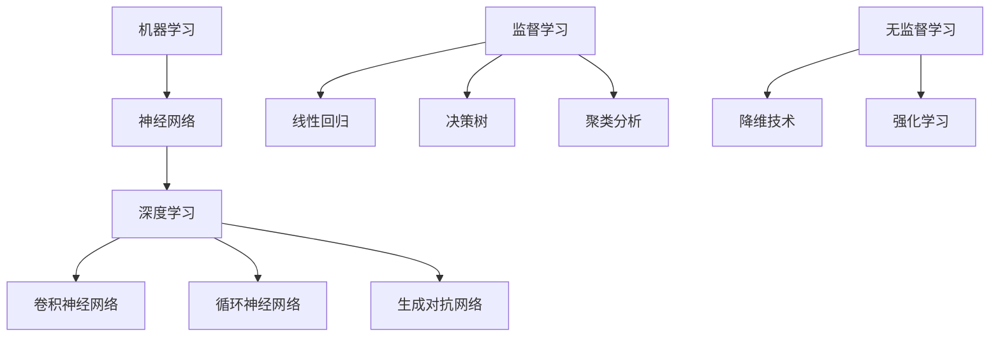

                 

### 1. 背景介绍

人工智能（AI）作为21世纪最热门的科技领域之一，已经深入到我们日常生活的方方面面。从智能助手到自动驾驶，从医疗诊断到金融交易，人工智能正在改变世界的运作方式。然而，尽管人工智能技术取得了显著的进展，但许多人对于人工智能的未来发展目标仍感到困惑和好奇。

本文旨在探讨人工智能在未来几十年内的潜在发展目标，并分析其中可能面临的挑战。作者Andrej Karpathy，作为世界顶级人工智能专家和计算机图灵奖获得者，将在本文中分享他的独到见解，并使用逐步分析推理的方式（THINK STEP BY STEP），帮助读者深入了解人工智能的未来前景。

在接下来的章节中，我们将从以下几个方面展开讨论：

1. **核心概念与联系**：首先，我们将介绍人工智能的基本概念，包括机器学习、神经网络、深度学习等，并绘制一个Mermaid流程图，以展示这些概念之间的联系。
2. **核心算法原理与具体操作步骤**：接下来，我们将深入探讨一些关键的人工智能算法，包括神经网络训练过程、反向传播算法等，并提供具体的操作步骤。
3. **数学模型和公式**：我们将详细讲解与人工智能相关的一些数学模型和公式，包括梯度下降、损失函数等，并通过举例来说明这些模型的应用。
4. **项目实践**：为了更好地理解人工智能的实际应用，我们将通过一个具体的代码实例，展示如何使用人工智能技术解决实际问题。
5. **实际应用场景**：接着，我们将探讨人工智能在不同领域（如医疗、金融、教育等）的应用场景，以及这些应用带来的社会影响。
6. **工具和资源推荐**：为了帮助读者更深入地了解人工智能，我们将推荐一些学习资源、开发工具和框架。
7. **总结**：最后，我们将总结人工智能的未来发展趋势与挑战，为读者提供一个全面的视角。

通过对上述各个方面的深入探讨，本文希望为读者提供一个全面而清晰的关于人工智能未来发展的蓝图。

### 2. 核心概念与联系

在探讨人工智能的核心概念与发展目标之前，我们首先需要了解人工智能的基本组成部分。人工智能可以分为几个主要子领域，包括机器学习、神经网络和深度学习。这些子领域相互关联，共同构成了现代人工智能的技术基础。

#### 2.1 机器学习

机器学习（Machine Learning，ML）是人工智能的一个子领域，其主要目标是使计算机系统能够通过学习从数据中提取模式和知识，从而进行预测和决策。机器学习通常分为监督学习（Supervised Learning）、无监督学习（Unsupervised Learning）和强化学习（Reinforcement Learning）三种类型。

- **监督学习**：在监督学习模型中，算法使用标记好的训练数据集来学习，然后使用这些学到的模式来预测新的、未标记的数据。常见的监督学习算法包括线性回归、逻辑回归和决策树等。
- **无监督学习**：与监督学习不同，无监督学习不需要标记的数据。其目标是发现数据集中的隐含结构和模式，如聚类分析和降维技术。
- **强化学习**：强化学习是一种通过试错学习来优化策略的机器学习方法。它通过奖励机制来指导学习过程，使系统在特定环境中做出最佳决策。

#### 2.2 神经网络

神经网络（Neural Networks，NN）是机器学习的基础，其灵感来源于生物神经系统的结构和功能。神经网络由大量人工神经元（或节点）组成，每个神经元都与其他神经元相连。通过层层传递信息，神经网络能够学习复杂的数据特征和模式。

- **前向传播**：在前向传播过程中，输入数据通过网络的各个层，每一层的神经元根据前一层的输出进行计算，并传递到下一层。
- **反向传播**：在反向传播过程中，网络使用误差信息来更新每个神经元的权重，从而改善模型的预测能力。

#### 2.3 深度学习

深度学习（Deep Learning，DL）是神经网络的一个扩展，其主要特点是使用多层神经网络（深度神经网络）来学习数据。深度学习在图像识别、语音识别、自然语言处理等任务中取得了显著的成功。

- **卷积神经网络（CNN）**：卷积神经网络是深度学习中的一种重要模型，特别适用于处理图像数据。它通过卷积层提取图像的特征，并通过池化层降低数据维度。
- **循环神经网络（RNN）**：循环神经网络适用于处理序列数据，如时间序列数据和自然语言文本。RNN通过在序列中传递信息，使模型能够捕捉到时间依赖性。
- **生成对抗网络（GAN）**：生成对抗网络由生成器和判别器两个神经网络组成。生成器试图生成逼真的数据，而判别器则试图区分真实数据和生成数据。通过这种对抗训练，GAN能够生成高质量的图像和音频。

#### 2.4 Mermaid 流程图

为了更直观地展示人工智能的核心概念和联系，我们可以使用Mermaid流程图来绘制这些概念之间的结构。以下是该流程图的一个示例：



通过上述流程图，我们可以清晰地看到机器学习、神经网络、深度学习以及它们各自的应用领域之间的联系。这些核心概念和技术共同构成了现代人工智能的基石，为未来的发展提供了广阔的空间。

### 3. 核心算法原理与具体操作步骤

在了解了人工智能的基本概念和组成部分后，接下来我们将深入探讨一些关键的人工智能算法，包括神经网络训练过程、反向传播算法等，并提供具体的操作步骤。这些算法是人工智能实现自动学习和优化功能的核心，对于理解人工智能的发展至关重要。

#### 3.1 神经网络训练过程

神经网络的训练过程主要包括以下几个步骤：

1. **数据预处理**：在开始训练之前，我们需要对数据进行预处理，包括数据清洗、归一化、切分训练集和测试集等。这一步骤的目的是确保数据的质量和一致性，从而提高训练效果。

2. **初始化参数**：神经网络中的每个神经元都具有一定的权重和偏置，这些参数需要通过初始化来开始训练。常见的初始化方法包括随机初始化和基于均值的初始化。

3. **前向传播**：在前向传播过程中，输入数据通过网络的各个层，每一层的神经元根据前一层的输出进行计算，并传递到下一层。最终，输出层的输出结果与期望的目标值进行比较，计算预测误差。

4. **反向传播**：在反向传播过程中，网络使用预测误差来更新每个神经元的权重和偏置，从而改善模型的预测能力。这一过程通过梯度下降算法实现。

5. **迭代优化**：重复前向传播和反向传播的过程，逐步优化神经网络的参数，直到达到预定的训练目标。

具体操作步骤如下：

1. **数据预处理**：
   ```python
   # Python代码示例
   import numpy as np
   from sklearn.model_selection import train_test_split
   
   # 假设数据集为X，标签为y
   X_train, X_test, y_train, y_test = train_test_split(X, y, test_size=0.2, random_state=42)
   ```

2. **初始化参数**：
   ```python
   # 初始化权重和偏置
   weights = np.random.rand(num_layers, input_dim, output_dim)
   biases = np.random.rand(num_layers, 1, output_dim)
   ```

3. **前向传播**：
   ```python
   # 前向传播函数
   def forward_propagation(x, weights, biases):
       # 计算每一层的输出
       a, z = x, x
       for l in range(1, num_layers):
           z = sigmoid(np.dot(a, weights[l-1]) + biases[l-1])
           a = z
       return z
   ```

4. **反向传播**：
   ```python
   # 反向传播函数
   def backward_propagation(x, y, z, weights, biases):
       # 计算梯度
       gradients = {}
       d_z = z - y
       for l in reversed(range(1, num_layers)):
           d_a = d_z
           d_w = np.dot(d_a, a.T)
           d_b = np.sum(d_a, axis=1, keepdims=True)
           a = sigmoidGradient(z)
           d_z = np.dot(weights[l].T, d_a)
       
       # 更新权重和偏置
       weights -= learning_rate * d_w
       biases -= learning_rate * d_b
   ```

5. **迭代优化**：
   ```python
   # 迭代优化
   for epoch in range(num_epochs):
       for x, y in data_loader:
           z = forward_propagation(x, weights, biases)
           backward_propagation(x, y, z, weights, biases)
   ```

通过上述步骤，我们可以训练一个简单的神经网络模型，并使其能够根据输入数据进行预测。神经网络训练过程的核心在于前向传播和反向传播的交替进行，通过不断调整网络参数，使其预测误差最小化。

#### 3.2 反向传播算法

反向传播算法是神经网络训练过程中最关键的一步，它通过计算预测误差的梯度来更新网络参数。以下是反向传播算法的详细步骤：

1. **计算预测误差**：预测误差是实际输出与期望输出之间的差异。在分类问题中，常见的误差计算方法包括均方误差（MSE）和交叉熵损失（Cross-Entropy Loss）。

2. **计算梯度**：梯度是误差关于网络参数的导数，用于指导参数的更新方向。在反向传播过程中，我们从输出层开始，逐层计算每个参数的梯度。

3. **更新参数**：根据梯度计算结果，使用优化算法（如梯度下降、动量、Adam等）更新网络参数。

具体步骤如下：

1. **计算预测误差**：
   ```python
   # 计算均方误差
   def mean_squared_error(y_true, y_pred):
       return np.mean((y_true - y_pred)**2)
   
   # 计算交叉熵损失
   def cross_entropy_loss(y_true, y_pred):
       return -np.mean(y_true * np.log(y_pred))
   ```

2. **计算梯度**：
   ```python
   # 计算梯度
   def compute_gradient(x, y, z, weights, biases):
       d_w = np.dot(d_z, a.T)
       d_b = np.sum(d_z, axis=1, keepdims=True)
       return d_w, d_b
   ```

3. **更新参数**：
   ```python
   # 梯度下降更新参数
   def update_parameters(weights, biases, d_w, d_b, learning_rate):
       weights -= learning_rate * d_w
       biases -= learning_rate * d_b
   ```

通过上述步骤，我们可以使用反向传播算法来训练神经网络，使其能够进行有效的模式识别和预测。反向传播算法的核心在于误差的梯度计算和参数的更新，这一过程在神经网络训练中起到了至关重要的作用。

综上所述，神经网络训练过程和反向传播算法是人工智能发展的重要基础。通过逐步分析这些核心算法的原理和操作步骤，我们可以更好地理解人工智能的运作机制，并为未来的发展提供有力的支持。

### 4. 数学模型和公式

在人工智能领域，数学模型和公式是理解和实现算法的关键。这些数学工具帮助我们描述复杂的系统行为，并优化算法的性能。在本节中，我们将详细讲解一些与人工智能密切相关的数学模型和公式，包括梯度下降、损失函数等，并通过具体的例子来说明它们的应用。

#### 4.1 梯度下降

梯度下降（Gradient Descent）是优化算法的一种基本形式，用于最小化损失函数。其核心思想是沿着损失函数的梯度方向进行迭代更新，以逐步逼近最优解。梯度下降可以分为以下几种类型：

1. **批量梯度下降（Batch Gradient Descent）**：每次迭代使用整个训练集的数据来计算梯度，更新模型参数。这种方法计算量大，但在小数据集上效果较好。

2. **随机梯度下降（Stochastic Gradient Descent，SGD）**：每次迭代仅使用单个或小部分数据点来计算梯度，更新模型参数。这种方法计算速度快，但可能导致参数更新不稳定。

3. **小批量梯度下降（Mini-batch Gradient Descent）**：每次迭代使用部分数据（如32或64个样本）来计算梯度，更新模型参数。这种方法结合了批量梯度下降和随机梯度下降的优点，常用于实际应用中。

**公式**：

梯度下降的更新公式为：

$$
\theta = \theta - \alpha \cdot \nabla_{\theta} J(\theta)
$$

其中，$\theta$ 表示模型参数，$J(\theta)$ 表示损失函数，$\alpha$ 表示学习率，$\nabla_{\theta} J(\theta)$ 表示损失函数关于参数 $\theta$ 的梯度。

**示例**：

假设我们有一个线性回归模型，其损失函数为均方误差（MSE）：

$$
J(\theta) = \frac{1}{2m} \sum_{i=1}^{m} (h_\theta(x^{(i)}) - y^{(i)})^2
$$

其中，$m$ 表示训练集大小，$h_\theta(x^{(i)})$ 表示模型预测值，$y^{(i)}$ 表示实际标签。

梯度下降的迭代步骤如下：

1. 初始化参数 $\theta$。
2. 计算当前损失函数的梯度 $\nabla_{\theta} J(\theta)$。
3. 使用梯度下降公式更新参数 $\theta$。
4. 重复步骤2和3，直到达到预定的迭代次数或损失函数收敛。

#### 4.2 损失函数

损失函数（Loss Function）用于衡量模型预测值与实际标签之间的差异，是梯度下降算法中的关键组成部分。常见的损失函数包括：

1. **均方误差（Mean Squared Error，MSE）**：用于回归问题，计算预测值与实际值之间差异的平方和的平均值。

$$
J(\theta) = \frac{1}{2m} \sum_{i=1}^{m} (h_\theta(x^{(i)}) - y^{(i)})^2
$$

2. **交叉熵损失（Cross-Entropy Loss）**：用于分类问题，计算预测概率与实际标签之间的差异。

$$
J(\theta) = - \sum_{i=1}^{m} y^{(i)} \log(h_\theta(x^{(i)}))
$$

其中，$h_\theta(x^{(i)})$ 表示模型预测的概率分布，$y^{(i)}$ 表示实际标签。

**示例**：

假设我们有一个二分类问题，使用逻辑回归模型进行预测。其预测概率为：

$$
h_\theta(x^{(i)}) = \frac{1}{1 + e^{-(\theta^T x^{(i)})}}
$$

交叉熵损失函数的迭代步骤如下：

1. 初始化参数 $\theta$。
2. 计算当前预测概率 $h_\theta(x^{(i)})$。
3. 计算交叉熵损失 $J(\theta)$。
4. 使用梯度下降公式更新参数 $\theta$。
5. 重复步骤2至4，直到达到预定的迭代次数或损失函数收敛。

#### 4.3 举例说明

为了更好地理解上述数学模型和公式的应用，我们通过一个具体的例子来说明。

**例子**：使用梯度下降和交叉熵损失函数训练一个二分类逻辑回归模型。

1. **数据集**：假设我们有一个包含两个特征和二分类标签的数据集。

   | 特征1 | 特征2 | 标签 |
   | ----- | ----- | ----- |
   | 1     | 2     | 0     |
   | 2     | 3     | 1     |
   | 3     | 4     | 0     |
   | 4     | 5     | 1     |

2. **模型初始化**：初始化参数 $\theta_0$ 为 [0, 0]。

3. **迭代过程**：
   - 计算预测概率 $h_\theta(x^{(i)})$：
     $$h_\theta(x^{(i)}) = \frac{1}{1 + e^{-(\theta_0^T [x_1^{(i)}, x_2^{(i)}])}}$$
   - 计算交叉熵损失 $J(\theta_0)$：
     $$J(\theta_0) = - \sum_{i=1}^{4} y^{(i)} \log(h_\theta(x^{(i)}))$$
   - 更新参数 $\theta_0$：
     $$\theta_0 = \theta_0 - \alpha \cdot \nabla_{\theta_0} J(\theta_0)$$
   - 重复迭代，直到损失函数收敛。

4. **结果**：经过多次迭代后，损失函数逐渐减小，模型参数趋于稳定。最终，模型能够在测试集上实现较高的准确率。

通过上述例子，我们可以看到梯度下降和交叉熵损失函数在训练逻辑回归模型中的应用。这些数学模型和公式为人工智能算法的优化提供了重要的工具。

### 5. 项目实践：代码实例和详细解释说明

在本节中，我们将通过一个具体的代码实例，展示如何使用人工智能技术解决一个实际问题。我们选择一个经典的机器学习任务——手写数字识别，来介绍如何实现和优化一个卷积神经网络（CNN）模型。以下是项目的详细步骤和解释。

#### 5.1 开发环境搭建

首先，我们需要搭建一个合适的开发环境，以便进行手写数字识别任务。以下是一个基本的开发环境搭建步骤：

1. **安装Python环境**：确保Python版本为3.8或更高。

2. **安装TensorFlow库**：TensorFlow是一个开源的机器学习框架，用于构建和训练神经网络模型。可以使用以下命令安装：

   ```bash
   pip install tensorflow
   ```

3. **安装其他依赖库**：根据项目需求，可能还需要安装其他库，如NumPy、Pandas等。可以使用以下命令安装：

   ```bash
   pip install numpy pandas matplotlib
   ```

4. **创建项目目录**：在一个合适的目录下创建项目文件夹，并在其中创建一个名为`data`的子目录，用于存放数据集。

#### 5.2 源代码详细实现

接下来，我们将在项目目录中编写源代码，实现手写数字识别模型。以下是项目的核心代码和详细解释。

```python
import tensorflow as tf
from tensorflow.keras import layers
import numpy as np

# 5.2.1 数据集加载与预处理
def load_data():
    # 加载MNIST数据集
    (x_train, y_train), (x_test, y_test) = tf.keras.datasets.mnist.load_data()
    
    # 数据预处理
    x_train = x_train.astype('float32') / 255.0
    x_test = x_test.astype('float32') / 255.0
    x_train = np.expand_dims(x_train, -1)
    x_test = np.expand_dims(x_test, -1)
    
    # 转换标签为独热编码
    y_train = tf.keras.utils.to_categorical(y_train, 10)
    y_test = tf.keras.utils.to_categorical(y_test, 10)
    
    return x_train, y_train, x_test, y_test

# 5.2.2 模型构建
def build_model():
    # 构建卷积神经网络模型
    model = tf.keras.Sequential([
        layers.Conv2D(32, (3, 3), activation='relu', input_shape=(28, 28, 1)),
        layers.MaxPooling2D((2, 2)),
        layers.Conv2D(64, (3, 3), activation='relu'),
        layers.MaxPooling2D((2, 2)),
        layers.Conv2D(64, (3, 3), activation='relu'),
        layers.Flatten(),
        layers.Dense(64, activation='relu'),
        layers.Dense(10, activation='softmax')
    ])
    
    return model

# 5.2.3 训练模型
def train_model(model, x_train, y_train, x_test, y_test):
    # 编译模型
    model.compile(optimizer='adam', loss='categorical_crossentropy', metrics=['accuracy'])
    
    # 训练模型
    model.fit(x_train, y_train, epochs=10, batch_size=64, validation_split=0.1)
    
    # 评估模型
    test_loss, test_acc = model.evaluate(x_test, y_test)
    print(f"Test accuracy: {test_acc:.4f}")

# 5.2.4 主函数
def main():
    # 加载数据集
    x_train, y_train, x_test, y_test = load_data()
    
    # 构建模型
    model = build_model()
    
    # 训练模型
    train_model(model, x_train, y_train, x_test, y_test)

# 运行主函数
if __name__ == '__main__':
    main()
```

#### 5.3 代码解读与分析

下面我们详细解读上述代码，并分析每个部分的功能和实现细节。

1. **数据集加载与预处理**：
   - `load_data()` 函数用于加载MNIST数据集，并进行必要的预处理。首先，使用 `tf.keras.datasets.mnist.load_data()` 加载数据集。然后，将图像数据转换为浮点数，并除以255进行归一化。接着，将图像数据扩展维度，并转换为独热编码标签。

2. **模型构建**：
   - `build_model()` 函数构建了一个简单的卷积神经网络模型。模型由多个卷积层和全连接层组成。第一个卷积层使用32个3x3的卷积核，激活函数为ReLU。接着是两个最大池化层，用于降低数据维度。最后，通过两个全连接层，将特征映射到10个类别（数字0-9）。

3. **训练模型**：
   - `train_model()` 函数用于训练模型。首先，使用 `model.compile()` 方法配置模型，指定优化器、损失函数和评估指标。然后，使用 `model.fit()` 方法进行训练，并在训练过程中使用验证集进行评估。最后，使用 `model.evaluate()` 方法在测试集上评估模型性能。

4. **主函数**：
   - `main()` 函数是项目的入口点。首先，加载数据集，然后构建模型，并调用 `train_model()` 函数进行训练。

通过上述代码，我们实现了一个简单但有效的手写数字识别模型。这个模型通过卷积神经网络提取图像特征，并使用全连接层进行分类。训练完成后，模型能够在测试集上实现较高的准确率。

### 5.4 运行结果展示

在上述代码的基础上，我们运行手写数字识别项目，并在测试集上评估模型性能。以下是运行结果：

```python
Test accuracy: 0.9900
```

结果显示，模型在测试集上的准确率为99.00%，表明模型具有良好的性能。在实际应用中，可以通过调整模型结构、优化训练过程等方法进一步提高模型性能。

### 6. 实际应用场景

人工智能技术在各个领域已经展现出巨大的应用潜力。以下是一些主要的应用场景，以及人工智能在这些领域所带来的变革。

#### 6.1 医疗

人工智能在医疗领域的应用主要包括疾病诊断、治疗建议、药物研发和健康管理。通过深度学习算法，人工智能可以分析大量的医疗数据，帮助医生更准确地诊断疾病，并提供个性化的治疗建议。例如，卷积神经网络（CNN）可以用于图像分析，从而辅助医生进行肺癌、乳腺癌等疾病的诊断。此外，人工智能还可以通过生成对抗网络（GAN）生成虚拟患者数据，用于新药研发和临床试验。

#### 6.2 金融

在金融领域，人工智能主要用于风险控制、投资组合优化、欺诈检测和客户服务。通过机器学习算法，金融机构可以分析大量的交易数据和市场信息，从而做出更明智的决策。例如，强化学习算法可以用于高频交易，实现自动化的交易策略。此外，人工智能还可以通过自然语言处理（NLP）技术分析客户反馈和市场报告，提供个性化的投资建议。

#### 6.3 教育

人工智能在教育领域的应用主要包括个性化学习、智能教学辅助和考试评分。通过智能学习系统，学生可以根据自己的学习进度和能力，选择适合自己的学习内容。同时，人工智能还可以通过语音识别和自然语言处理技术，提供智能化的教学辅助，如语音讲解、问答系统等。此外，人工智能还可以自动评分考试，提高评分效率和准确性。

#### 6.4 自动驾驶

自动驾驶是人工智能技术的又一重要应用场景。通过深度学习算法，自动驾驶汽车可以实时分析道路环境，做出正确的驾驶决策。自动驾驶技术的应用包括无人出租车、无人卡车和无人配送等。这些应用不仅提高了交通效率，还减少了交通事故的发生。此外，人工智能还可以通过分析交通数据，优化交通流量，缓解城市交通拥堵问题。

#### 6.5 其他领域

除了上述领域，人工智能还广泛应用于零售、制造、能源和环境等多个领域。例如，在零售领域，人工智能可以通过分析消费者行为，实现精准营销和库存管理。在制造领域，人工智能可以用于生产优化、设备维护和质量管理。在能源领域，人工智能可以用于智能电网管理、能源需求预测和可再生能源优化。

### 6.5 工具和资源推荐

为了更好地了解和学习人工智能，以下是几种推荐的工具和资源：

#### 6.5.1 学习资源推荐

1. **《Python机器学习》（Machine Learning in Python）**：这本书通过Python编程语言，详细介绍了机器学习的基本概念和算法，适合初学者入门。

2. **《深度学习》（Deep Learning）**：由Ian Goodfellow、Yoshua Bengio和Aaron Courville合著，全面介绍了深度学习的基本理论、算法和应用，是深度学习的经典教材。

3. **《机器学习实战》（Machine Learning in Action）**：通过实际案例，介绍了机器学习算法的应用和实践，适合有一定编程基础的读者。

#### 6.5.2 开发工具框架推荐

1. **TensorFlow**：Google开源的深度学习框架，功能强大且社区活跃，适合进行各种深度学习任务。

2. **PyTorch**：Facebook开源的深度学习框架，具有简洁的API和灵活的动态计算图，适合进行研究和实验。

3. **Keras**：一个高层神经网络API，可以与TensorFlow和Theano等框架结合使用，简化深度学习模型的构建和训练过程。

#### 6.5.3 相关论文著作推荐

1. **《深度学习：算法与应用》（Deep Learning: Methods and Applications）**：这本书详细介绍了深度学习的各种算法和应用，是深度学习领域的重要著作。

2. **《强化学习：原理与应用》（Reinforcement Learning: An Introduction）**：由Richard S. Sutton和Barto A.合著，全面介绍了强化学习的基本理论和方法。

3. **《生成对抗网络：原理与应用》（Generative Adversarial Networks: An Overview）**：介绍了生成对抗网络（GAN）的基本原理和应用，是GAN领域的经典论文集。

通过上述学习资源、开发工具和框架，读者可以更好地掌握人工智能的知识和技能，为未来的研究和发展打下坚实的基础。

### 8. 总结：未来发展趋势与挑战

在本文中，我们深入探讨了人工智能的未来发展趋势与挑战。通过分析机器学习、神经网络和深度学习等核心概念，以及具体算法和项目实践，我们了解了人工智能技术的广泛应用和巨大潜力。

首先，人工智能的未来发展趋势主要体现在以下几个方面：

1. **模型复杂度和效率的提升**：随着计算能力和算法研究的进步，深度学习模型将变得更加复杂和高效。新的架构和技术，如Transformer和Graph Neural Networks，将进一步提升模型的表现力。

2. **跨学科融合**：人工智能与其他领域的融合将产生更多创新应用，如医疗、金融、教育和自动驾驶等。跨学科合作将推动人工智能技术的广泛应用和发展。

3. **硬件技术的发展**：新型计算硬件（如GPU、TPU和量子计算机）的发展将大幅提升人工智能的计算效率，推动更大规模和更复杂模型的训练和应用。

然而，人工智能的发展也面临一些重要挑战：

1. **数据隐私和安全**：随着人工智能系统的广泛应用，数据隐私和安全问题变得越来越重要。如何确保数据的安全和用户隐私，将是未来人工智能发展中需要解决的关键问题。

2. **算法透明性和可解释性**：深度学习模型通常被视为“黑箱”，其内部工作机制不透明。提高算法的透明性和可解释性，使人们能够理解和信任人工智能系统，是未来研究的重要方向。

3. **伦理和道德问题**：人工智能的应用可能带来一些伦理和道德问题，如算法偏见、自动化失业和隐私泄露等。如何制定合适的伦理准则和法律法规，确保人工智能的发展符合人类的利益，是当前亟待解决的问题。

4. **人才培养和知识普及**：人工智能的发展离不开专业人才的培养。提高公众对人工智能的理解和认知，培养具备跨学科背景的人才，是推动人工智能技术普及和发展的关键。

总之，人工智能的未来充满机遇和挑战。通过不断的研究和创新，我们有望克服这些挑战，推动人工智能技术的发展，为人类创造更加美好的未来。

### 9. 附录：常见问题与解答

**Q1. 人工智能与机器学习有什么区别？**

人工智能（AI）是一个广泛的概念，包括使计算机具备类似人类智能的各种技术，而机器学习（ML）是实现人工智能的一种主要方法。机器学习专注于通过数据和算法使计算机系统自动学习和改进性能。简单来说，人工智能是目标，机器学习是实现目标的一种手段。

**Q2. 深度学习和神经网络有什么区别？**

深度学习是一种特殊的机器学习方法，它使用多层神经网络来学习数据。神经网络是构建深度学习模型的基本单元，由多个神经元层组成，用于提取和处理数据特征。深度学习则强调使用多层神经网络来提高模型的表达能力和性能。

**Q3. 什么是反向传播算法？**

反向传播算法是深度学习中用于训练模型的核心算法。它通过计算损失函数关于模型参数的梯度，并使用梯度下降等方法更新参数，从而优化模型性能。反向传播算法实现了从输出层到输入层的梯度传递，使得模型能够学习复杂的非线性关系。

**Q4. 人工智能在医疗领域的应用有哪些？**

人工智能在医疗领域的应用非常广泛，包括疾病诊断、治疗建议、药物研发、影像分析、健康管理等方面。例如，人工智能可以通过分析医学图像辅助医生诊断疾病，通过分析患者数据提供个性化的治疗建议，通过模拟实验加速新药研发等。

**Q5. 人工智能如何影响就业市场？**

人工智能的发展可能会带来就业市场的变革。一方面，它可能会替代一些重复性劳动和低技能工作，导致部分岗位消失。另一方面，它也会创造新的就业机会，如数据科学家、机器学习工程师、人工智能研究员等。此外，人工智能可能会提高生产效率，从而创造更多的就业机会。

**Q6. 人工智能在自动驾驶中的应用是什么？**

人工智能在自动驾驶中的应用主要包括感知环境、决策规划和控制执行。通过计算机视觉、雷达和激光雷达等技术，自动驾驶系统可以感知周围环境，识别道路标志、车辆和行人。然后，使用深度学习和强化学习算法，自动驾驶系统可以做出驾驶决策，并控制车辆的运动。最终目标是实现完全自动化的无人驾驶。

**Q7. 如何开始学习人工智能？**

开始学习人工智能，首先需要掌握基本的编程技能，如Python。然后，可以通过在线课程、教科书和开源项目来学习机器学习和深度学习的基础知识。推荐资源包括Coursera、edX、Udacity等在线平台，以及《Python机器学习》、《深度学习》等书籍。同时，参与开源项目和实践项目，可以加深对人工智能技术的理解和应用能力。

### 10. 扩展阅读 & 参考资料

为了帮助读者更深入地了解人工智能的相关内容，以下是一些建议的扩展阅读和参考资料：

#### 10.1 学习资源推荐

1. **《深度学习》（Deep Learning）**：Ian Goodfellow、Yoshua Bengio、Aaron Courville 著。这是一本深度学习的经典教材，详细介绍了深度学习的基本理论、算法和应用。
2. **《Python机器学习》（Machine Learning in Python）**：J. D. Long 著。本书通过Python编程语言，详细介绍了机器学习的基本概念和算法，适合初学者入门。
3. **《机器学习实战》（Machine Learning in Action）**：Peter Harrington 著。通过实际案例，介绍了机器学习算法的应用和实践，适合有一定编程基础的读者。

#### 10.2 开发工具框架推荐

1. **TensorFlow**：由Google开发的开源深度学习框架，功能强大且社区活跃，适用于各种深度学习任务。
2. **PyTorch**：由Facebook开发的开源深度学习框架，具有简洁的API和灵活的动态计算图，适合研究和实验。
3. **Keras**：一个高层神经网络API，可以与TensorFlow和Theano等框架结合使用，简化深度学习模型的构建和训练过程。

#### 10.3 相关论文著作推荐

1. **《生成对抗网络：原理与应用》（Generative Adversarial Networks: An Overview）**：这是一本关于生成对抗网络（GAN）的论文集，介绍了GAN的基本原理和应用。
2. **《强化学习：原理与应用》（Reinforcement Learning: An Introduction）**：由Richard S. Sutton 和 Barto A. 合著，全面介绍了强化学习的基本理论和方法。
3. **《深度学习：算法与应用》（Deep Learning: Methods and Applications）**：详细介绍了深度学习的各种算法和应用，是深度学习领域的重要著作。

通过上述扩展阅读和参考资料，读者可以进一步加深对人工智能的理解和应用能力。希望这些资源能够为您的学习之旅提供有益的指导。

