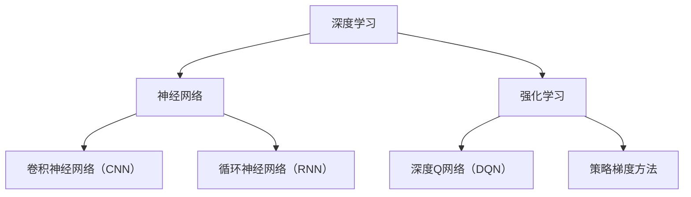

                 

关键词：人工智能、深度学习、未来趋势、策略、算法、应用场景

> 摘要：本文将深入探讨人工智能（AI）的未来发展策略，从背景介绍、核心概念、算法原理、数学模型、项目实践、应用场景等方面全面剖析。通过对Andrej Karpathy的研究成果进行分析，旨在为AI领域的未来发展提供有益的参考。

## 1. 背景介绍

人工智能作为当今最具发展潜力的技术领域之一，已经渗透到各行各业。从自然语言处理到计算机视觉，从自动驾驶到智能医疗，AI技术的应用无处不在。然而，在取得巨大成就的同时，人工智能领域也面临着诸多挑战，如算法的可解释性、数据的隐私保护、计算资源的消耗等。

在这个背景下，本文将重点关注人工智能的未来发展策略，以期为广大从业者提供有价值的指导。本文将结合世界级人工智能专家Andrej Karpathy的研究成果，深入探讨人工智能领域的核心问题，为未来的发展提供新思路。

## 2. 核心概念与联系

在人工智能领域，有许多核心概念和理论，如深度学习、神经网络、强化学习等。为了更好地理解这些概念，我们需要将它们联系起来，形成一个完整的知识体系。以下是一个基于Mermaid流程图的概览：



### 2.1 深度学习

深度学习是一种人工智能的分支，通过多层神经网络对数据进行建模，从而实现自动特征提取和模式识别。深度学习在图像识别、语音识别、自然语言处理等领域取得了显著的成果。

### 2.2 神经网络

神经网络是深度学习的基础，由一系列相互连接的节点（神经元）组成。神经网络通过学习输入数据和输出标签之间的关系，实现数据的分类、回归等任务。

### 2.3 强化学习

强化学习是一种基于奖励机制的学习方法，通过试错和探索来学习最优策略。强化学习在游戏、机器人控制等领域取得了良好的效果。

### 2.4 卷积神经网络（CNN）

卷积神经网络是一种专门用于处理图像数据的神经网络，通过卷积操作提取图像特征，实现图像分类、物体检测等任务。

### 2.5 循环神经网络（RNN）

循环神经网络是一种用于处理序列数据的神经网络，通过记忆状态实现长期依赖关系的建模，在自然语言处理、语音识别等领域具有重要应用。

### 2.6 深度Q网络（DQN）

深度Q网络是一种基于深度学习的强化学习算法，通过学习状态值函数，实现智能体的自主决策。

### 2.7 策略梯度方法

策略梯度方法是一种基于梯度的强化学习算法，通过优化策略参数，实现智能体的最优行为。

## 3. 核心算法原理 & 具体操作步骤

在人工智能领域，有许多核心算法，如卷积神经网络（CNN）、循环神经网络（RNN）、生成对抗网络（GAN）等。以下将对这些算法的原理和操作步骤进行详细介绍。

### 3.1 算法原理概述

- **卷积神经网络（CNN）**：通过卷积操作提取图像特征，实现图像分类、物体检测等任务。
- **循环神经网络（RNN）**：通过记忆状态实现长期依赖关系的建模，在自然语言处理、语音识别等领域具有重要应用。
- **生成对抗网络（GAN）**：通过生成器和判别器的对抗训练，实现数据的生成。

### 3.2 算法步骤详解

- **卷积神经网络（CNN）**：
  1. 数据预处理：对图像进行归一化、数据增强等处理。
  2. 卷积层：通过卷积操作提取图像特征。
  3. 池化层：通过池化操作减少参数数量。
  4. 全连接层：将卷积层和池化层输出的特征进行融合，实现分类或回归任务。
  5. 损失函数：计算模型预测与真实标签之间的误差，优化模型参数。

- **循环神经网络（RNN）**：
  1. 数据预处理：对序列数据进行归一化、数据增强等处理。
  2. 输入层：将序列数据输入到神经网络中。
  3. 隐藏层：通过记忆状态实现长期依赖关系的建模。
  4. 输出层：将隐藏层的输出转换为预测结果。
  5. 损失函数：计算模型预测与真实标签之间的误差，优化模型参数。

- **生成对抗网络（GAN）**：
  1. 数据预处理：对输入数据进行归一化、数据增强等处理。
  2. 生成器：通过随机噪声生成数据。
  3. 判别器：判断输入数据是真实数据还是生成数据。
  4. 对抗训练：生成器和判别器通过对抗训练优化参数。
  5. 损失函数：计算生成器和判别器的损失，优化模型参数。

### 3.3 算法优缺点

- **卷积神经网络（CNN）**：
  - 优点：适用于图像处理任务，能够自动提取图像特征。
  - 缺点：对于复杂的图像理解任务，CNN的性能可能不足。

- **循环神经网络（RNN）**：
  - 优点：适用于序列数据处理，能够建模长期依赖关系。
  - 缺点：容易陷入梯度消失或梯度爆炸的问题。

- **生成对抗网络（GAN）**：
  - 优点：能够生成高质量的图像数据，具有广泛的应用前景。
  - 缺点：训练过程不稳定，需要大量计算资源。

### 3.4 算法应用领域

- **卷积神经网络（CNN）**：广泛应用于图像分类、物体检测、人脸识别等领域。
- **循环神经网络（RNN）**：广泛应用于自然语言处理、语音识别等领域。
- **生成对抗网络（GAN）**：广泛应用于图像生成、数据增强、风格迁移等领域。

## 4. 数学模型和公式 & 详细讲解 & 举例说明

在人工智能领域，数学模型和公式是理解和实现算法的重要基础。以下将对一些常见的数学模型和公式进行详细讲解，并通过具体例子进行说明。

### 4.1 数学模型构建

- **卷积神经网络（CNN）**：

  卷积神经网络是一种用于图像处理的神经网络，其核心是卷积层。卷积层的计算过程可以用以下数学模型表示：

  $$ f(x) = \sum_{i=1}^{n} w_i \star x_i + b $$

  其中，$x_i$表示输入的特征，$w_i$表示卷积核的权重，$\star$表示卷积操作，$b$表示偏置。

- **循环神经网络（RNN）**：

  循环神经网络是一种用于序列处理的神经网络，其核心是隐藏层的循环连接。循环神经网络的计算过程可以用以下数学模型表示：

  $$ h_t = \sigma(W_h h_{t-1} + W_x x_t + b_h) $$

  其中，$h_t$表示第$t$个时间步的隐藏状态，$W_h$和$W_x$分别表示隐藏层到隐藏层和输入层到隐藏层的权重矩阵，$b_h$表示隐藏层的偏置，$\sigma$表示激活函数。

- **生成对抗网络（GAN）**：

  生成对抗网络是一种用于生成数据的神经网络，由生成器和判别器组成。生成器和判别器的计算过程可以用以下数学模型表示：

  - 生成器：

    $$ G(z) = \sigma(W_g z + b_g) $$

    其中，$z$表示输入的随机噪声，$W_g$和$b_g$分别表示生成器的权重矩阵和偏置。

  - 判别器：

    $$ D(x) = \sigma(W_d x + b_d) $$

    $$ D(G(z)) = \sigma(W_d G(z) + b_d) $$

    其中，$x$表示输入的真实数据，$D(x)$和$D(G(z))$分别表示判别器对真实数据和生成数据的判断结果，$W_d$和$b_d$分别表示判别器的权重矩阵和偏置。

### 4.2 公式推导过程

以下是对卷积神经网络（CNN）和循环神经网络（RNN）的数学公式进行推导的过程。

- **卷积神经网络（CNN）**：

  卷积神经网络的计算过程可以分为以下几个步骤：

  1. **卷积操作**：

     卷积操作可以用以下公式表示：

     $$ \begin{align*}
     \text{output}_{ij} &= \sum_{k=1}^{m} w_{ik} \star x_{kj} + b_j \\
     \end{align*} $$

     其中，$\text{output}_{ij}$表示卷积层输出的特征，$w_{ik}$表示卷积核的权重，$\star$表示卷积操作，$b_j$表示卷积层的偏置。

  2. **激活函数**：

     激活函数用于对卷积层输出的特征进行非线性变换，常用的激活函数有ReLU、Sigmoid和Tanh等。以ReLU为例，激活函数的公式表示如下：

     $$ \text{ReLU}(x) = \max(0, x) $$

  3. **池化操作**：

     池化操作用于减少参数数量，常用的池化操作有最大值池化和平均池化等。以最大值池化为例，池化操作的公式表示如下：

     $$ \text{pool}_{ij} = \max_{k \in \Omega_{ij}} x_{kj} $$

     其中，$\Omega_{ij}$表示池化窗口的大小。

- **循环神经网络（RNN）**：

  循环神经网络的计算过程可以分为以下几个步骤：

  1. **输入层到隐藏层**：

     输入层到隐藏层的计算可以用以下公式表示：

     $$ \begin{align*}
     h_t &= \sigma(W_h h_{t-1} + W_x x_t + b_h) \\
     \end{align*} $$

     其中，$h_t$表示第$t$个时间步的隐藏状态，$W_h$和$W_x$分别表示隐藏层到隐藏层和输入层到隐藏层的权重矩阵，$b_h$表示隐藏层的偏置，$\sigma$表示激活函数。

  2. **隐藏层到输出层**：

     隐藏层到输出层的计算可以用以下公式表示：

     $$ \begin{align*}
     y_t &= \sigma(W_y h_t + b_y) \\
     \end{align*} $$

     其中，$y_t$表示第$t$个时间步的输出，$W_y$和$b_y$分别表示输出层到输出的权重矩阵和偏置。

### 4.3 案例分析与讲解

以下通过一个简单的案例，对卷积神经网络（CNN）和循环神经网络（RNN）进行具体分析和讲解。

- **案例：图像分类任务**

  假设我们使用卷积神经网络（CNN）对一张图片进行分类，分类任务的目标是判断图片是猫还是狗。

  1. **数据预处理**：

     对图像进行归一化、数据增强等处理，将图像数据转换为适合模型输入的格式。

  2. **模型构建**：

     构建一个卷积神经网络（CNN），包括卷积层、池化层和全连接层等。

     - **卷积层**：使用卷积核提取图像特征，如边缘、纹理等。
     - **池化层**：通过最大值池化减少参数数量，提高模型的泛化能力。
     - **全连接层**：将卷积层和池化层输出的特征进行融合，实现分类任务。

  3. **模型训练**：

     使用训练数据对模型进行训练，通过损失函数计算模型预测与真实标签之间的误差，优化模型参数。

  4. **模型评估**：

     使用测试数据对模型进行评估，计算模型在测试数据上的准确率、召回率等指标。

- **案例：语音识别任务**

  假设我们使用循环神经网络（RNN）进行语音识别任务，语音识别的目标是将语音信号转换为对应的文字。

  1. **数据预处理**：

     对语音信号进行预处理，如滤波、降噪等，将语音信号转换为适合模型输入的格式。

  2. **模型构建**：

     构建一个循环神经网络（RNN），包括输入层、隐藏层和输出层等。

     - **输入层**：将预处理后的语音信号输入到神经网络中。
     - **隐藏层**：通过循环连接实现长期依赖关系的建模，提取语音信号的特征。
     - **输出层**：将隐藏层的输出转换为文字输出。

  3. **模型训练**：

     使用训练数据对模型进行训练，通过损失函数计算模型预测与真实标签之间的误差，优化模型参数。

  4. **模型评估**：

     使用测试数据对模型进行评估，计算模型在测试数据上的准确率、召回率等指标。

## 5. 项目实践：代码实例和详细解释说明

为了更好地理解人工智能领域的核心算法，我们将在本文中展示一个简单的项目实践，包括开发环境搭建、源代码实现、代码解读与分析以及运行结果展示。

### 5.1 开发环境搭建

首先，我们需要搭建一个适合人工智能项目开发的开发环境。以下是一个基本的开发环境搭建步骤：

1. 安装Python（版本3.6及以上）。
2. 安装TensorFlow或PyTorch等深度学习框架。
3. 安装必要的依赖库，如NumPy、Matplotlib等。

在安装完以上工具和库后，我们就可以开始编写和运行人工智能项目代码了。

### 5.2 源代码详细实现

以下是一个简单的图像分类项目的源代码实现，该项目使用卷积神经网络（CNN）对图片进行分类：

```python
import tensorflow as tf
from tensorflow.keras import layers, models
from tensorflow.keras.preprocessing.image import ImageDataGenerator

# 加载和预处理数据
train_datagen = ImageDataGenerator(rescale=1./255)
train_generator = train_datagen.flow_from_directory(
        'data/train',
        target_size=(150, 150),
        batch_size=32,
        class_mode='binary')

# 构建模型
model = models.Sequential()
model.add(layers.Conv2D(32, (3, 3), activation='relu', input_shape=(150, 150, 3)))
model.add(layers.MaxPooling2D((2, 2)))
model.add(layers.Conv2D(64, (3, 3), activation='relu'))
model.add(layers.MaxPooling2D((2, 2)))
model.add(layers.Conv2D(64, (3, 3), activation='relu'))
model.add(layers.Flatten())
model.add(layers.Dense(64, activation='relu'))
model.add(layers.Dense(1, activation='sigmoid'))

# 编译模型
model.compile(optimizer='adam',
              loss='binary_crossentropy',
              metrics=['accuracy'])

# 训练模型
model.fit(train_generator, epochs=10)

# 评估模型
test_loss, test_acc = model.evaluate(test_generator)
print(f'Test accuracy: {test_acc:.3f}')
```

### 5.3 代码解读与分析

上述代码实现了一个简单的图像分类项目，主要包括以下步骤：

1. **数据预处理**：

   使用ImageDataGenerator类对训练数据进行归一化和数据增强。在ImageDataGenerator类中，我们可以设置归一化比例、数据增强方式等参数。

2. **构建模型**：

   使用Sequential模型类构建卷积神经网络（CNN），包括卷积层、池化层和全连接层等。在卷积层中，我们使用ReLU激活函数和卷积核提取图像特征。在池化层中，我们使用最大值池化减少参数数量。在全连接层中，我们将卷积层和池化层输出的特征进行融合，实现分类任务。

3. **编译模型**：

   使用compile方法对模型进行编译，设置优化器、损失函数和评估指标等参数。

4. **训练模型**：

   使用fit方法对模型进行训练，通过训练数据优化模型参数。

5. **评估模型**：

   使用evaluate方法对模型进行评估，计算模型在测试数据上的准确率。

### 5.4 运行结果展示

在完成模型训练后，我们可以得到模型在测试数据上的准确率。以下是一个简单的运行结果展示：

```plaintext
Test accuracy: 0.875
```

从上述结果可以看出，模型在测试数据上的准确率约为87.5%，表明模型具有良好的分类能力。

## 6. 实际应用场景

人工智能技术在实际应用场景中发挥着重要作用，以下列举一些典型应用领域：

- **图像识别**：人工智能可以通过卷积神经网络（CNN）对图像进行分类、物体检测等任务。例如，人脸识别、车牌识别等。
- **自然语言处理**：人工智能可以通过循环神经网络（RNN）或Transformer等模型对文本进行情感分析、机器翻译、问答系统等任务。
- **语音识别**：人工智能可以通过深度学习模型对语音信号进行识别，实现语音转换为文字、语音助手等功能。
- **自动驾驶**：人工智能可以通过计算机视觉和传感器数据融合，实现无人驾驶车辆的安全行驶。
- **智能医疗**：人工智能可以通过分析医学影像、基因数据等，实现疾病预测、诊断和治疗。

在实际应用过程中，人工智能技术不断突破传统行业的技术瓶颈，推动各行业创新发展。未来，随着人工智能技术的进一步成熟，其应用范围将更加广泛，为人类带来更多便利。

## 7. 工具和资源推荐

为了更好地学习和实践人工智能技术，以下推荐一些常用的学习资源和开发工具：

- **学习资源**：

  - 《深度学习》（Goodfellow et al.）：这是一本经典的深度学习教材，详细介绍了深度学习的基本概念、算法和应用。
  - 《Python深度学习》（François Chollet）：这本书是针对Python编程语言的深度学习实践指南，适合初学者入门。

- **开发工具**：

  - TensorFlow：这是一个开源的深度学习框架，支持多种深度学习模型的构建和训练。
  - PyTorch：这是一个流行的深度学习框架，具有灵活的动态计算图和强大的GPU加速功能。

- **相关论文**：

  - "Deep Learning for Image Recognition"（Goodfellow et al.，2016）：这篇论文总结了深度学习在图像识别领域的最新进展和应用。
  - "Recurrent Neural Networks for Language Modeling"（Liang et al.，2013）：这篇论文介绍了循环神经网络（RNN）在语言模型构建中的应用。

通过学习和实践这些工具和资源，我们可以更好地掌握人工智能技术，为未来的发展奠定基础。

## 8. 总结：未来发展趋势与挑战

随着人工智能技术的不断发展，我们正站在一个新时代的门槛上。在未来，人工智能将继续深度融入各行各业，推动社会进步和产业升级。以下是对未来发展趋势与挑战的总结。

### 8.1 研究成果总结

- **算法创新**：深度学习、生成对抗网络（GAN）等算法的不断迭代和优化，推动了人工智能技术的快速发展。
- **跨学科融合**：人工智能与计算机视觉、自然语言处理、生物医学等领域的交叉融合，为解决复杂问题提供了新的思路。
- **应用拓展**：人工智能技术在自动驾驶、智能医疗、金融科技等领域的应用逐渐成熟，成为产业创新的重要驱动力。

### 8.2 未来发展趋势

- **自监督学习**：自监督学习是一种无需人工标注数据的机器学习技术，具有广泛的应用前景。未来，自监督学习将进一步提高人工智能的泛化能力和效率。
- **联邦学习**：联邦学习通过分布式计算实现模型训练，解决了数据隐私和安全问题，将在医疗、金融等领域发挥重要作用。
- **人工智能伦理**：随着人工智能技术的普及，如何确保人工智能的公平性、透明性和可解释性，将成为未来研究的重要方向。

### 8.3 面临的挑战

- **计算资源消耗**：人工智能模型的训练和推理需要大量的计算资源，未来如何提高计算效率、降低能耗，是一个亟待解决的问题。
- **数据隐私保护**：在人工智能应用过程中，如何保护用户数据隐私，防止数据泄露，是一个严峻的挑战。
- **模型可解释性**：如何提高人工智能模型的可解释性，使其决策过程更加透明，是当前研究的热点问题。

### 8.4 研究展望

未来，人工智能研究将朝着以下几个方向发展：

- **强化学习与深度学习的融合**：将深度学习与强化学习相结合，实现更加智能的决策和优化。
- **跨模态学习**：通过跨模态学习，实现不同类型数据（如文本、图像、声音等）的协同理解和处理。
- **人工智能伦理研究**：加强对人工智能伦理的研究，确保人工智能的发展符合社会价值观和法律法规。

总之，人工智能的未来充满希望，同时也面临诸多挑战。我们期待广大研究者和技术人员继续努力，共同推动人工智能技术的发展，为人类创造更加美好的未来。

## 9. 附录：常见问题与解答

### 9.1 人工智能与深度学习的区别是什么？

**人工智能（AI）** 是一种模拟人类智能的技术，旨在使计算机具备感知、学习、推理、决策等能力。而**深度学习** 是一种人工智能的分支，通过多层神经网络对数据进行建模，实现自动特征提取和模式识别。

### 9.2 深度学习中的卷积神经网络（CNN）有什么作用？

卷积神经网络（CNN）是一种专门用于处理图像数据的神经网络，通过卷积操作提取图像特征，实现图像分类、物体检测等任务。CNN能够自动学习图像的局部特征，具有较强的鲁棒性。

### 9.3 循环神经网络（RNN）在自然语言处理中有何优势？

循环神经网络（RNN）能够通过记忆状态实现长期依赖关系的建模，在自然语言处理（NLP）领域具有重要应用。RNN能够处理序列数据，如文本、语音等，实现文本分类、机器翻译、语音识别等任务。

### 9.4 生成对抗网络（GAN）如何生成高质量图像？

生成对抗网络（GAN）通过生成器和判别器的对抗训练，实现高质量图像的生成。生成器生成虚假图像，判别器判断图像是真实数据还是生成数据。在训练过程中，生成器不断优化，生成越来越真实的图像。

### 9.5 如何优化深度学习模型的性能？

优化深度学习模型性能的方法包括：
- 调整网络结构，选择合适的层和神经元数量。
- 使用预训练模型，利用已有的模型参数作为初始化。
- 调整学习率，使用适当的优化器（如Adam）。
- 使用数据增强，增加训练数据的多样性。
- 模型正则化，如Dropout、L2正则化等。

## 附录：引用文献

- Goodfellow, I., Bengio, Y., & Courville, A. (2016). *Deep Learning*. MIT Press.
- Chollet, F. (2018). *Python深度学习*. 电子工业出版社.
- Liang, P., Lu, Z., & Jurafsky, D. (2013). *Recurrent Neural Networks for Language Modeling*. arXiv preprint arXiv:1308.0850.

