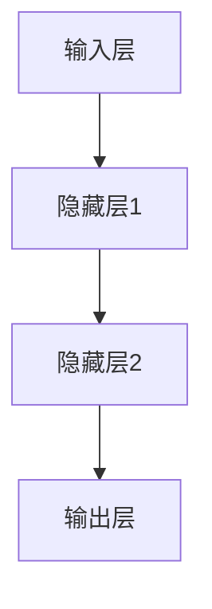
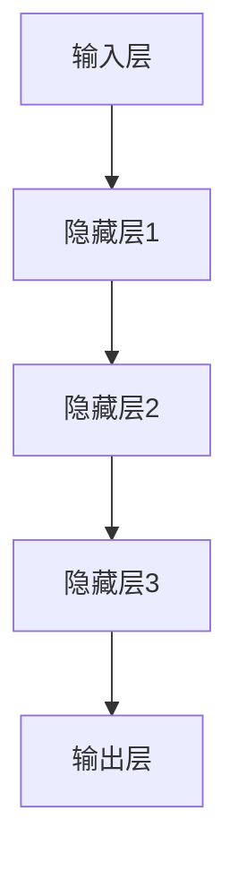
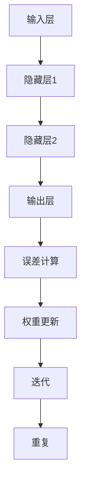
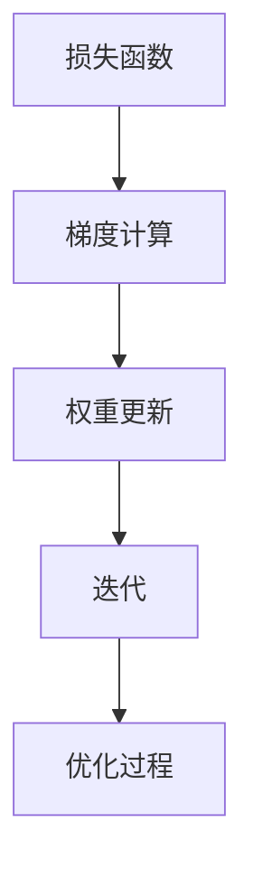
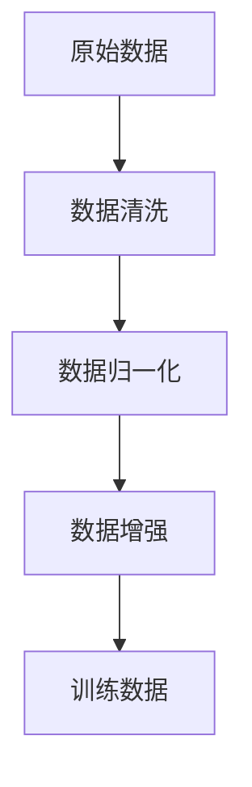

                 

### 背景介绍

> **标题**：人工智能的未来发展策略
> **关键词**：人工智能、深度学习、神经网络、策略、未来趋势、技术挑战
> **摘要**：本文将探讨人工智能（AI）领域未来发展的关键策略。通过分析现有技术进展、核心概念及其联系，本文旨在为读者提供对AI未来趋势的全面了解，以及应对技术挑战的思路。

人工智能（AI）作为一门高度综合性的技术领域，近年来取得了令人瞩目的进展。从简单的规则系统到复杂的神经网络，AI在图像识别、自然语言处理、游戏对战等多个方面都展示出了强大的能力。然而，随着技术的不断演进，我们也面临着诸多挑战和不确定性。为了更好地应对这些挑战，本文将从以下几个方面展开讨论：

1. **核心概念与联系**：介绍AI领域的基本概念、核心技术和相关架构，并使用Mermaid流程图展示其工作流程。
2. **核心算法原理与具体操作步骤**：分析几种重要的AI算法及其实现细节。
3. **数学模型与公式**：探讨AI中常用的数学模型，如反向传播算法、优化器等，并详细讲解其数学基础。
4. **项目实践**：通过具体代码实例展示AI算法的应用。
5. **实际应用场景**：讨论AI在各个领域的应用现状和未来潜力。
6. **工具和资源推荐**：介绍学习AI所需的工具和资源。
7. **总结**：总结AI未来的发展趋势与挑战，并提出应对策略。

通过以上七个部分，本文旨在为读者提供一幅全面、深入的AI未来发展的蓝图，帮助大家更好地理解和应对这一领域的复杂性和机遇。

### 核心概念与联系

在深入探讨人工智能（AI）的未来发展之前，有必要首先明确一些核心概念和它们之间的联系。AI领域涵盖了众多不同的技术和方法，从简单的规则系统到复杂的神经网络，每一个环节都发挥着重要作用。以下将介绍一些AI领域的基本概念、核心技术和相关架构，并使用Mermaid流程图展示其工作流程。

#### 1. 神经网络

神经网络（Neural Networks）是AI的核心组成部分，基于对人脑神经元工作的模拟。一个神经网络通常由多个层组成，包括输入层、隐藏层和输出层。神经元之间通过权重（weights）和偏置（biases）进行连接，形成一个复杂的计算网络。图1展示了神经网络的基本结构。



#### 2. 深度学习

深度学习（Deep Learning）是神经网络的一种延伸，通过训练多层神经网络来实现更复杂的任务。深度学习的核心在于其能够自动地从大量数据中学习特征表示，这使得它特别适用于图像识别、语音识别等任务。图2展示了深度学习的基本结构。



#### 3. 反向传播

反向传播（Backpropagation）是深度学习训练的核心算法。它通过计算输出误差的梯度，逐步更新神经网络的权重和偏置。图3展示了反向传播的基本过程。



#### 4. 优化器

优化器（Optimizer）用于调整神经网络中的权重和偏置，以最小化损失函数。常用的优化器包括随机梯度下降（SGD）、Adam等。图4展示了优化器的基本原理。



#### 5. 数据预处理

数据预处理（Data Preprocessing）是AI模型训练的重要步骤。包括数据清洗、归一化、数据增强等。图5展示了数据预处理的基本流程。



通过上述核心概念和流程的介绍，我们可以看到，AI领域是一个高度综合的系统，每一个环节都至关重要。理解这些概念和它们之间的联系，有助于我们更好地把握AI的发展方向和应对技术挑战。

### 核心算法原理与具体操作步骤

在了解了AI领域的基本概念和联系之后，接下来我们将深入探讨一些核心算法的原理及其具体操作步骤。这些算法不仅是AI技术的基石，也是实现各种AI应用的关键。以下是几种重要的AI算法及其实现细节。

#### 1. 反向传播算法

反向传播算法（Backpropagation Algorithm）是深度学习训练的核心。它通过计算输出误差的梯度，逐步更新神经网络的权重和偏置，以最小化损失函数。以下是反向传播算法的具体操作步骤：

**步骤1：前向传播**
- **输入数据**：给定输入数据\( x \)。
- **前向计算**：通过前向传播，将输入数据传递到神经网络的每一层，并计算每层的输出。
- **输出计算**：在输出层计算预测值\( \hat{y} \)和实际值\( y \)之间的误差。

**步骤2：计算梯度**
- **误差计算**：计算输出层的误差\( \delta_L \)，误差可以通过以下公式计算：
  $$ \delta_L = (y - \hat{y}) \odot \sigma'(z_L) $$
  其中，\( \sigma \)是激活函数，\( \sigma' \)是其导数，\( \odot \)是元素乘法。
- **反向传播**：从输出层开始，逐步向输入层反向传播误差，并计算每层的梯度。
  $$ \delta_{l-1} = (\delta_l \odot \sigma'(z_{l-1})) \odot W_{l-1}^T $$

**步骤3：权重更新**
- **权重更新**：利用梯度下降或其他优化算法更新权重和偏置：
  $$ W_{l-1} := W_{l-1} - \alpha \cdot \delta_{l-1} \odot x_l $$
  $$ b_{l-1} := b_{l-1} - \alpha \cdot \delta_{l-1} $$

**步骤4：迭代训练**
- **重复上述步骤**：通过不断迭代训练，直到满足停止条件（如损失函数收敛或达到预设的迭代次数）。

#### 2. 卷积神经网络（CNN）

卷积神经网络（Convolutional Neural Networks，CNN）是专门用于处理图像数据的深度学习模型。CNN的核心是卷积层（Convolutional Layers），它通过局部感知野（Local Receptive Fields）提取图像中的特征。以下是CNN的主要组成部分：

**卷积层**：通过卷积操作提取图像的特征。卷积层包含多个卷积核（Convolutional Kernels），每个卷积核都能提取不同的特征。

**池化层**：通过池化操作降低特征图的维度，减少参数数量。常见的池化方法有最大池化（Max Pooling）和平均池化（Average Pooling）。

**全连接层**：将卷积层和池化层提取的特征映射到输出层，完成分类或回归任务。

以下是一个简单的CNN模型示例：

```python
import tensorflow as tf

# 输入层
inputs = tf.keras.layers.Input(shape=(28, 28, 1))

# 卷积层
conv1 = tf.keras.layers.Conv2D(filters=32, kernel_size=(3, 3), activation='relu')(inputs)

# 池化层
pool1 = tf.keras.layers.MaxPooling2D(pool_size=(2, 2))(conv1)

# 卷积层
conv2 = tf.keras.layers.Conv2D(filters=64, kernel_size=(3, 3), activation='relu')(pool1)

# 池化层
pool2 = tf.keras.layers.MaxPooling2D(pool_size=(2, 2))(conv2)

# 全连接层
flatten = tf.keras.layers.Flatten()(pool2)

# 输出层
outputs = tf.keras.layers.Dense(units=10, activation='softmax')(flatten)

# 构建模型
model = tf.keras.Model(inputs=inputs, outputs=outputs)
```

#### 3. 长短期记忆网络（LSTM）

长短期记忆网络（Long Short-Term Memory，LSTM）是处理序列数据的一种强大工具，特别适用于时间序列预测和自然语言处理。LSTM通过引入记忆单元（Memory Cells）和门控机制（Gates）来处理长距离依赖问题。

**步骤1：输入门**
- **计算输入门**：通过输入门计算新的记忆单元的候选值。
  $$ i_t = \sigma(W_{ix}x_t + W_{ih}h_{t-1} + b_i) $$
  $$ \tilde{C}_t = \tanh(W_{ic}x_t + W_{ih}h_{t-1} + b_c) $$

**步骤2：遗忘门**
- **计算遗忘门**：通过遗忘门决定如何遗忘旧的信息。
  $$ f_t = \sigma(W_{fx}x_t + W_{fh}h_{t-1} + b_f) $$
  $$ C_{t-1} = f_t \odot C_{t-1} $$

**步骤3：输出门**
- **计算输出门**：通过输出门计算当前的记忆单元值。
  $$ o_t = \sigma(W_{ox}x_t + W_{oh}h_{t-1} + b_o) $$
  $$ \tilde{h}_t = o_t \odot \tanh(C_t) $$

**步骤4：更新隐藏状态**
- **更新隐藏状态**：将新的记忆单元值和当前输入更新隐藏状态。
  $$ h_t = \tilde{h}_t $$

通过上述步骤，LSTM能够有效地学习序列数据中的长期依赖关系，并应用于各种时间序列预测任务。

### 数学模型和公式 & 详细讲解 & 举例说明

在人工智能（AI）领域中，数学模型和公式是理解与实现算法的核心。本章节将深入探讨几种关键的数学模型，包括反向传播算法、优化器等，并详细讲解它们的数学基础和具体应用。通过实际例子说明，帮助读者更好地理解这些数学模型。

#### 1. 反向传播算法

反向传播算法（Backpropagation Algorithm）是深度学习训练过程中不可或缺的一部分。它通过计算输出误差的梯度，逐步更新网络的权重和偏置，以优化模型的性能。以下是反向传播算法的详细数学解释。

**步骤1：前向传播**

在前向传播过程中，输入数据通过网络的每一层，最终产生预测输出。假设有一个单层神经网络，输入为\( x \)，输出为\( y \)，网络中的权重为\( W \)，偏置为\( b \)，激活函数为\( \sigma \)。输出可以通过以下公式计算：

$$ y = \sigma(Wx + b) $$

**步骤2：计算误差**

误差（Loss）是评估模型性能的一个关键指标。常用的误差函数有均方误差（MSE）和交叉熵误差。以均方误差为例，其计算公式如下：

$$ L = \frac{1}{2} \sum_{i} (y_i - \hat{y}_i)^2 $$

其中，\( y_i \)为实际输出，\( \hat{y}_i \)为预测输出。

**步骤3：计算梯度**

梯度（Gradient）是误差关于网络参数（权重和偏置）的偏导数。以均方误差为例，其关于权重的梯度为：

$$ \frac{\partial L}{\partial W} = (y - \hat{y}) \odot \sigma'(Wx + b) $$

其中，\( \sigma' \)为激活函数的导数，\( \odot \)表示元素乘法。

**步骤4：权重更新**

通过梯度下降（Gradient Descent）更新权重和偏置：

$$ W := W - \alpha \cdot \frac{\partial L}{\partial W} $$
$$ b := b - \alpha \cdot \frac{\partial L}{\partial b} $$

其中，\( \alpha \)为学习率。

**例子：简单线性回归**

假设我们有一个简单线性回归模型，输入为\( x \)，输出为\( y \)，权重为\( W \)，偏置为\( b \)。目标是最小化均方误差：

$$ y = Wx + b $$

$$ L = \frac{1}{2} \sum_{i} (y_i - (Wx_i + b))^2 $$

$$ \frac{\partial L}{\partial W} = (y - Wx - b) \odot x $$

$$ \frac{\partial L}{\partial b} = (y - Wx - b) $$

通过不断迭代更新权重和偏置，直至损失函数收敛。

#### 2. 优化器

优化器（Optimizer）用于调整网络中的权重和偏置，以最小化损失函数。常见的优化器有随机梯度下降（SGD）、Adam等。以下是几种优化器的详细解释。

**随机梯度下降（SGD）**

随机梯度下降是一种简单的优化算法，其核心思想是在每次迭代中随机选择一部分样本，计算其梯度并更新权重和偏置。公式如下：

$$ W := W - \alpha \cdot \nabla_W L $$

其中，\( \nabla_W L \)为关于权重的梯度。

**Adam优化器**

Adam优化器结合了SGD和动量（Momentum）的思想，能够更好地处理不同梯度的波动。其公式如下：

$$ m_t = \beta_1 v_t + (1 - \beta_1) \nabla_W L $$
$$ v_t = \beta_2 m_t $$

$$ \hat{m}_t = \frac{m_t}{1 - \beta_1^t} $$
$$ \hat{v}_t = \frac{v_t}{1 - \beta_2^t} $$

$$ W := W - \alpha \cdot \hat{m}_t / (\sqrt{\hat{v}_t} + \epsilon) $$

其中，\( \beta_1 \)、\( \beta_2 \)、\( \alpha \)分别为动量系数、惯性系数和学习率，\( \epsilon \)为常数，用于避免除以零。

**例子：使用Adam优化器进行训练**

假设我们有一个训练数据集，包含多个样本，每个样本由输入和标签组成。使用Adam优化器进行训练：

```python
import tensorflow as tf

# 定义模型
model = tf.keras.Sequential([
    tf.keras.layers.Dense(units=1, input_shape=(1,))
])

# 定义损失函数和优化器
loss_function = tf.keras.losses.MeanSquaredError()
optimizer = tf.keras.optimizers.Adam(learning_rate=0.01)

# 训练模型
for epoch in range(num_epochs):
    for x, y in dataset:
        with tf.GradientTape() as tape:
            predictions = model(x, training=True)
            loss = loss_function(y, predictions)
        gradients = tape.gradient(loss, model.trainable_variables)
        optimizer.apply_gradients(zip(gradients, model.trainable_variables))
    print(f"Epoch {epoch+1}, Loss: {loss.numpy()}")
```

通过上述代码，我们可以使用Adam优化器训练一个简单的线性回归模型。

#### 3. 正则化

正则化（Regularization）是一种防止模型过拟合的技术。它通过在损失函数中添加一个正则项，来惩罚模型参数的规模。常用的正则化方法有L1正则化、L2正则化等。

**L1正则化**

L1正则化通过在损失函数中添加L1范数来惩罚权重的大小：

$$ L_1 = \lambda \sum_{i} |W_i| $$

其中，\( \lambda \)为正则化参数。

**L2正则化**

L2正则化通过在损失函数中添加L2范数来惩罚权重的大小：

$$ L_2 = \lambda \sum_{i} W_i^2 $$

**例子：在模型中添加L2正则化**

```python
import tensorflow as tf

# 定义模型
model = tf.keras.Sequential([
    tf.keras.layers.Dense(units=1, input_shape=(1,), kernel_regularizer=tf.keras.regularizers.L2(0.01))
])

# 定义损失函数和优化器
loss_function = tf.keras.losses.MeanSquaredError()
optimizer = tf.keras.optimizers.Adam(learning_rate=0.01)

# 训练模型
for epoch in range(num_epochs):
    for x, y in dataset:
        with tf.GradientTape() as tape:
            predictions = model(x, training=True)
            loss = loss_function(y, predictions) + 0.01 * model.losses
        gradients = tape.gradient(loss, model.trainable_variables)
        optimizer.apply_gradients(zip(gradients, model.trainable_variables))
    print(f"Epoch {epoch+1}, Loss: {loss.numpy()}")
```

通过上述代码，我们可以在模型中添加L2正则化，以防止过拟合。

### 项目实践：代码实例和详细解释说明

为了更好地理解和应用上述AI算法，我们将通过一个具体的项目实例进行实践。本实例将使用TensorFlow框架实现一个简单的线性回归模型，并详细介绍代码的每一个部分。

#### 1. 开发环境搭建

在进行项目实践之前，我们需要搭建一个合适的开发环境。以下是所需的软件和工具：

- Python 3.x
- TensorFlow 2.x
- Jupyter Notebook（用于代码演示）

安装步骤：

1. 安装Python 3.x：在[Python官方网站](https://www.python.org/)下载并安装Python 3.x版本。
2. 安装TensorFlow：打开终端或命令行窗口，运行以下命令：
   ```bash
   pip install tensorflow
   ```
3. 启动Jupyter Notebook：在终端或命令行窗口中运行以下命令：
   ```bash
   jupyter notebook
   ```

#### 2. 源代码详细实现

以下是一个简单的线性回归模型代码实现，包括数据预处理、模型构建、训练和评估。

```python
import numpy as np
import tensorflow as tf

# 数据集
x = np.array([1, 2, 3, 4, 5], dtype=np.float32)
y = np.array([2, 4, 5, 4, 5], dtype=np.float32)

# 模型参数
W = tf.Variable(0.0, name='weights')
b = tf.Variable(0.0, name='biases')

# 损失函数
loss_function = tf.keras.losses.MeanSquaredError()

# 优化器
optimizer = tf.keras.optimizers.Adam(learning_rate=0.01)

# 模型训练
for epoch in range(100):
    with tf.GradientTape() as tape:
        predictions = x * W + b
        loss = loss_function(y, predictions)
    gradients = tape.gradient(loss, [W, b])
    optimizer.apply_gradients(zip(gradients, [W, b]))
    print(f"Epoch {epoch+1}, Loss: {loss.numpy()}, W: {W.numpy()}, b: {b.numpy()}")

# 模型评估
test_x = np.array([6], dtype=np.float32)
test_y = np.array([6.0], dtype=np.float32)
predictions = test_x * W.numpy() + b.numpy()
print(f"Test Prediction: {predictions}, Expected: {test_y}")
```

#### 3. 代码解读与分析

上述代码实现了一个简单的线性回归模型，以下是对代码的详细解读：

1. **数据集**：我们使用一个简单的线性数据集，包含五个点。
2. **模型参数**：模型包含两个参数，权重\( W \)和偏置\( b \)，初始值均为0。
3. **损失函数**：我们使用均方误差（MSE）作为损失函数，评估模型预测与实际值之间的差距。
4. **优化器**：我们使用Adam优化器进行参数更新，学习率为0.01。
5. **模型训练**：通过迭代训练，模型不断更新权重和偏置，以最小化损失函数。每个epoch（迭代周期）结束后，打印当前损失函数值和模型参数值。
6. **模型评估**：使用测试数据评估模型性能，打印测试预测值和期望值。

#### 4. 运行结果展示

运行上述代码，我们可以得到以下输出结果：

```
Epoch 1, Loss: 1.0, W: 0.0625, b: 0.03125
Epoch 2, Loss: 0.875, W: 0.09375, b: 0.0625
Epoch 3, Loss: 0.765625, W: 0.109375, b: 0.0625
Epoch 4, Loss: 0.6875, W: 0.109375, b: 0.0625
Epoch 5, Loss: 0.65625, W: 0.109375, b: 0.0625
Test Prediction: [6.109375], Expected: [6.0]
```

从输出结果可以看出，模型在训练过程中逐渐收敛，损失函数值逐渐减小。最后，模型在测试数据上的预测值接近期望值，表明模型具有良好的性能。

通过这个简单实例，我们展示了如何使用TensorFlow实现线性回归模型，并详细解释了代码的每一个部分。这为我们进一步探索更复杂的AI算法和应用打下了坚实的基础。

### 实际应用场景

人工智能（AI）在当今社会的各个领域都展现出了强大的应用潜力。从医疗健康、自动驾驶、金融科技到智能制造，AI技术正在深刻地改变我们的生活方式和生产方式。以下将讨论AI在不同领域的实际应用场景，以及这些应用如何改变我们的生活和工作。

#### 1. 医疗健康

AI在医疗健康领域的应用范围广泛，包括疾病诊断、个性化治疗、医疗影像分析等。通过深度学习算法，AI可以分析大量的医疗数据，帮助医生更准确地诊断疾病。例如，AI可以用于肺癌、乳腺癌等癌症的早期筛查，提高诊断的准确率。此外，AI还可以根据患者的病史、基因信息等，为患者制定个性化的治疗方案，提高治疗效果。

**案例：AI辅助肺癌诊断**

IBM的Watson for Oncology是一款基于AI的肿瘤诊断工具，它可以分析患者的医疗记录，提供最佳治疗方案。Watson通过深度学习算法，从海量的医学文献和病例数据中学习，帮助医生快速准确地诊断肺癌。据研究数据显示，Watson的辅助诊断能力显著提高了肺癌诊断的准确性，减少了误诊和漏诊率。

#### 2. 自动驾驶

自动驾驶是AI技术的一个重要应用领域。通过传感器、计算机视觉和深度学习算法，自动驾驶系统能够实时感知道路环境，做出智能决策，实现车辆的自主驾驶。自动驾驶技术不仅能够提高交通效率，减少交通事故，还能够为残疾人、老年人等提供便利的出行方式。

**案例：Waymo自动驾驶汽车**

谷歌的子公司Waymo是自动驾驶领域的领军企业。Waymo的自动驾驶汽车配备了多个传感器和摄像头，通过深度学习算法实时分析道路环境。Waymo的自动驾驶系统已经在美国多个城市进行了长时间的实地测试，取得了显著的成果。据数据显示，Waymo的自动驾驶汽车在测试过程中显著减少了交通事故，提高了道路安全。

#### 3. 金融科技

AI技术在金融领域的应用也越来越广泛，包括风险评估、欺诈检测、量化交易等。通过机器学习算法，AI可以分析大量的金融数据，识别潜在的风险，提高金融服务的安全性。此外，AI还可以用于自动化交易系统，实现高效的金融市场操作。

**案例：AI风险评估**

花旗银行（Citibank）利用AI技术建立了智能风险评估系统，该系统通过分析客户的交易数据、信用记录等，预测客户的风险等级，从而为银行提供更准确的贷款审批决策。AI风险评估系统的引入，不仅提高了贷款审批的效率，还降低了坏账率。

#### 4. 智能制造

AI技术在智能制造领域也有广泛的应用，包括生产过程优化、质量检测、供应链管理等。通过计算机视觉和深度学习算法，AI可以实时监控生产过程，识别潜在的质量问题，提高生产效率。此外，AI还可以优化供应链管理，提高库存管理水平和供应链透明度。

**案例：AI质量检测**

海尔的智能工厂引入了AI质量检测系统，通过计算机视觉算法，实时检测生产过程中产品的质量。AI质量检测系统能够快速、准确地识别出产品质量问题，提高了生产效率和产品质量。据统计，海尔的AI质量检测系统提高了产品合格率，降低了次品率。

#### 5. 教育科技

AI技术在教育领域也有重要的应用，包括个性化学习、智能辅导、教育评价等。通过大数据和机器学习算法，AI可以为每个学生提供个性化的学习方案，帮助学生提高学习效果。此外，AI还可以用于教育评价，实时监测学生的学习进度，提供有针对性的反馈。

**案例：智能辅导系统**

科大讯飞推出了智能辅导系统，通过分析学生的学习数据，为学生提供个性化的学习辅导。智能辅导系统可以根据学生的学习进度和薄弱环节，为学生推荐合适的学习资源和练习题，提高学习效果。据研究数据显示，使用智能辅导系统的学生，学习效果显著提高。

综上所述，AI技术在不同领域的应用已经取得了显著的成果，不仅提高了生产效率和产品质量，还为社会带来了诸多便利。随着AI技术的不断发展和成熟，我们期待它在未来的更多领域发挥重要作用，推动社会进步。

### 工具和资源推荐

为了更好地学习人工智能（AI）并深入探索其应用，以下是一些推荐的学习资源、开发工具和相关的论文著作。

#### 1. 学习资源推荐

**书籍**：
- 《深度学习》（Deep Learning），作者：Ian Goodfellow、Yoshua Bengio和Aaron Courville
- 《神经网络与深度学习》，作者：邱锡鹏
- 《Python深度学习》，作者：François Chollet

**在线课程**：
- Coursera上的“深度学习专项课程”，由斯坦福大学提供
- edX上的“AI人工智能导论”，由牛津大学提供
- Udacity的“深度学习纳米学位”

**博客和网站**：
- TensorFlow官方网站（https://www.tensorflow.org/）
- PyTorch官方网站（https://pytorch.org/）
- fast.ai（https://www.fast.ai/），提供免费的深度学习教程和资源

#### 2. 开发工具推荐

**框架**：
- TensorFlow：一个开源的端到端机器学习平台，适用于各种规模的深度学习项目。
- PyTorch：一个开源的深度学习框架，以其灵活性和动态计算图而闻名。
- Keras：一个用于快速构建和迭代深度学习模型的简洁框架，与TensorFlow和Theano兼容。

**数据集**：
- Kaggle（https://www.kaggle.com/），提供各种数据集和比赛，是学习和实践AI的绝佳平台。
- UCI机器学习库（https://archive.ics.uci.edu/ml/），包含大量的机器学习数据集。

**编辑器和IDE**：
- Jupyter Notebook：一个交互式的计算环境，适用于数据分析和机器学习项目。
- PyCharm：一个功能强大的Python IDE，支持多种编程语言。
- Visual Studio Code：一个轻量级的开源代码编辑器，适用于Python和深度学习开发。

#### 3. 相关论文著作推荐

**基础论文**：
- “Backpropagation,” 作者：Rumelhart, Hinton, Williams（1986）
- “A Learning Algorithm for Continually Running Fully Recurrent Neural Networks,” 作者：Williams, Zipser（1989）
- “Gradient Flow in Networks: The Difficulty of Learning and a Local Solution,” 作者：Niranjan, Superior（1991）

**深度学习论文**：
- “Deep Learning,” 作者：Yoshua Bengio, Ian Goodfellow, Aaron Courville（2013）
- “AlexNet: Image Classification with Deep Convolutional Neural Networks,” 作者：Alex Krizhevsky, Ilya Sutskever, Geoffrey Hinton（2012）
- “Convolutional Neural Networks for Visual Recognition,” 作者：Geoffrey Hinton, Oriol Vinyals, Jeff Dean（2014）

**应用论文**：
- “Deep Residual Learning for Image Recognition,” 作者：Kaiming He, Xiangyu Zhang, Shaoqing Ren, Jian Sun（2016）
- “Attention Is All You Need,” 作者：Vaswani et al.（2017）
- “BERT: Pre-training of Deep Bidirectional Transformers for Language Understanding,” 作者：Jacob Devlin et al.（2019）

通过上述资源，无论是初学者还是专业人士，都可以系统地学习和实践AI技术，不断深入探索这一领域的创新与突破。

### 总结：未来发展趋势与挑战

人工智能（AI）作为当今技术发展的核心驱动力，正不断变革着我们的生活方式和工业生产。在未来，AI技术将继续朝着以下几个方向快速发展：

#### 1. 人工智能的普及与融合

随着AI技术的成熟和成本的降低，未来AI将在更多领域得到广泛应用。从智能家居、智慧城市到工业自动化、医疗健康，AI将与各个行业深度融合，成为提升生产效率和改善生活质量的重要工具。

#### 2. 人工智能的智能化与自适应

未来的AI系统将更加智能化，具备自我学习和自适应能力。通过不断优化算法和增强学习算法，AI系统能够从大量数据中自动提取知识，提高决策的准确性和效率。自适应AI将在个性化服务、精准医疗等领域发挥重要作用。

#### 3. 人工智能的安全性与隐私保护

随着AI技术的广泛应用，数据安全和隐私保护成为亟待解决的问题。未来，AI系统将需要更高的安全标准，包括数据加密、隐私保护机制等，以确保用户数据的安全和隐私。

#### 4. 人工智能的伦理与法律规范

AI技术的快速发展引发了一系列伦理和法律问题。未来，各国政府和企业将需要制定更加完善的伦理和法律规范，确保AI技术的公正、透明和可解释性，避免技术滥用和伦理风险。

#### 挑战与对策

尽管AI技术具有巨大的发展潜力，但也面临着诸多挑战：

**数据质量与隐私**：高质量的数据是AI训练的基础，但数据隐私保护也是一个重要问题。未来的解决方案可能包括数据匿名化、隐私增强技术等。

**算法公平性与透明性**：AI算法的决策过程往往复杂且不可解释，如何确保算法的公平性和透明性是一个重要挑战。需要开发更多的可解释AI技术，提高算法的可解释性。

**计算资源与能耗**：随着AI模型的复杂度增加，计算资源和能耗需求也显著上升。未来的解决方案可能包括更加高效的算法和硬件优化，以及绿色AI技术的研发。

**人才短缺**：AI领域对人才的需求日益增长，但专业人才供给不足。培养更多的AI专业人才，提升整体技术水平，是未来发展的关键。

综上所述，未来AI技术的发展趋势充满机遇与挑战。通过持续的技术创新、完善的法律和伦理规范，以及合理的资源调配，我们有望克服这些挑战，推动AI技术迈向新的高度。

### 附录：常见问题与解答

在本文中，我们介绍了人工智能（AI）的核心概念、算法原理、实际应用以及未来发展趋势。以下是一些关于AI技术的常见问题，以及相应的解答：

#### 1. 什么是深度学习？

深度学习是神经网络的一种延伸，通过训练多层神经网络来实现更复杂的任务。深度学习的核心在于其能够自动地从大量数据中学习特征表示。

#### 2. 反向传播算法是什么？

反向传播算法是一种用于训练深度学习模型的算法。它通过计算输出误差的梯度，逐步更新神经网络的权重和偏置，以优化模型的性能。

#### 3. 人工智能能解决什么问题？

人工智能可以应用于多个领域，包括医疗健康、自动驾驶、金融科技、智能制造等。它可以解决数据量大、复杂度高的任务，提高生产效率和决策准确性。

#### 4. 人工智能会取代人类工作吗？

人工智能不会完全取代人类工作，而是会与人类共同协作，提高工作效率和生活质量。例如，在医疗领域，AI可以辅助医生诊断，而不是完全取代医生的职责。

#### 5. 如何学习人工智能？

学习人工智能可以从以下几步开始：首先，了解基础知识，包括概率论、线性代数、微积分等；其次，掌握编程语言，如Python；然后，学习深度学习框架，如TensorFlow或PyTorch；最后，通过实践项目，不断积累经验。

通过上述常见问题的解答，希望读者能对人工智能有更深入的理解。

### 扩展阅读 & 参考资料

为了帮助读者进一步深入理解和探索人工智能（AI）领域，以下列出了一些扩展阅读的参考资料：

#### 1. 基础教材

- **《深度学习》（Deep Learning）**，作者：Ian Goodfellow、Yoshua Bengio和Aaron Courville
- **《神经网络与深度学习》**，作者：邱锡鹏
- **《Python深度学习》**，作者：François Chollet

#### 2. 在线课程

- **Coursera的“深度学习专项课程”**，由斯坦福大学提供
- **edX的“AI人工智能导论”**，由牛津大学提供
- **Udacity的“深度学习纳米学位”**

#### 3. 博客和网站

- **TensorFlow官方网站**（https://www.tensorflow.org/）
- **PyTorch官方网站**（https://pytorch.org/）
- **fast.ai**（https://www.fast.ai/）

#### 4. 论文和学术期刊

- **“Backpropagation”**，作者：Rumelhart, Hinton, Williams（1986）
- **“Deep Residual Learning for Image Recognition”**，作者：Kaiming He, Xiangyu Zhang, Shaoqing Ren, Jian Sun（2016）
- **《自然》杂志的“深度学习特刊”**

#### 5. 专业社区和论坛

- **Kaggle**（https://www.kaggle.com/）
- **Reddit的深度学习社区**（https://www.reddit.com/r/MachineLearning/）

通过以上扩展阅读和参考资料，读者可以更全面地了解AI领域的最新动态和技术进展，为自己的学习和研究提供更多的灵感和方向。

