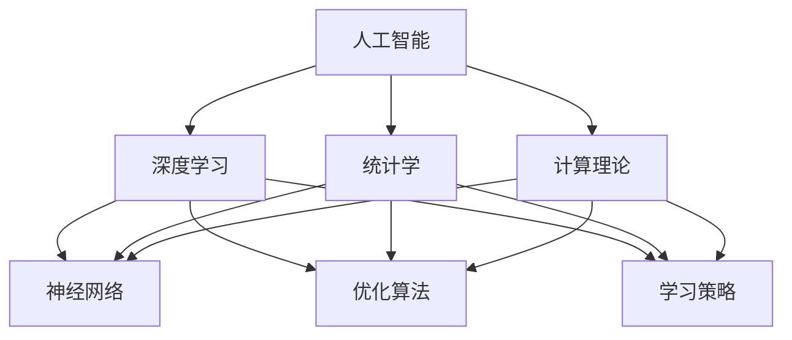

                 

### 文章标题：Andrej Karpathy：人工智能的未来发展策略

> **关键词**：Andrej Karpathy，人工智能，发展策略，神经网络，深度学习，人工智能伦理，未来展望

> **摘要**：本文将深入探讨人工智能领域专家Andrej Karpathy对未来人工智能发展的看法和策略，包括核心概念的阐述、算法原理的剖析、数学模型的解读，以及项目实践和实际应用场景的分析。本文旨在帮助读者了解人工智能领域的最新动态和未来趋势。

### 1. 背景介绍

Andrej Karpathy是一位在人工智能和深度学习领域享有盛誉的专家。他曾是Google Brain的资深研究科学家，目前担任OpenAI的高级研究员。他的工作涉及自然语言处理、计算机视觉、神经网络架构等多个领域，并在顶级会议和期刊上发表过多篇论文。Andrej Karpathy对人工智能未来的看法备受关注，他提出了许多有见地的观点和策略。

在过去的几年里，人工智能取得了飞速的发展，从语音识别到图像识别，从机器翻译到自然语言生成，人工智能已经渗透到了我们生活的方方面面。然而，随着技术的发展，人工智能也面临了许多挑战，包括数据隐私、算法偏见、伦理问题等。在这种背景下，了解人工智能的未来发展策略具有重要意义。

本文将围绕Andrej Karpathy的观点，从核心概念、算法原理、数学模型、项目实践和实际应用场景等多个方面，深入探讨人工智能的未来发展策略。希望通过本文的阅读，读者能够对人工智能的未来有更清晰的认识。

### 2. 核心概念与联系

#### 2.1. 人工智能的基本概念

人工智能（Artificial Intelligence，简称AI）是指由人制造出来的具有一定智能能力的机器或系统。它包括模拟、延伸和扩展人类智能的各种技术和应用。人工智能的基本概念可以概括为以下几点：

1. **学习与推理**：人工智能通过学习从数据中提取模式和知识，然后利用这些知识进行推理和决策。
2. **感知与理解**：人工智能可以感知和理解环境中的各种信息，包括视觉、听觉、触觉等。
3. **交互与协作**：人工智能可以与人类或其他智能系统进行交互和协作，共同完成任务。
4. **自主性与适应性**：人工智能能够在没有人类干预的情况下自主地执行任务，并根据环境变化进行适应性调整。

#### 2.2. 深度学习的基本概念

深度学习（Deep Learning）是人工智能的一种重要技术，它通过多层神经网络模拟人脑的学习和认知过程。深度学习的基本概念可以概括为以下几点：

1. **神经网络**：神经网络是由大量相互连接的节点（神经元）组成的计算模型，它可以通过学习从数据中提取特征和模式。
2. **层次化表示**：深度学习通过多层神经网络构建层次化的表示，从低级特征到高级语义，使得模型能够更好地理解和处理复杂信息。
3. **优化与训练**：深度学习通过优化算法（如梯度下降）和训练数据（如大量标注数据）来调整网络参数，使得模型能够对新的数据进行准确预测和分类。

#### 2.3. 人工智能与深度学习的联系

人工智能和深度学习是相辅相成的。深度学习是人工智能的一种实现方式，它通过多层神经网络模拟人脑的学习和认知过程，使得人工智能能够更好地理解和处理复杂信息。具体来说，人工智能和深度学习的联系可以从以下几个方面进行阐述：

1. **理论基础**：人工智能和深度学习都基于统计学和计算理论，它们共同构成了人工智能的理论基础。
2. **技术手段**：人工智能和深度学习都使用了类似的计算模型和算法，如神经网络、优化算法、学习策略等。
3. **应用领域**：人工智能和深度学习在许多领域都有广泛的应用，如计算机视觉、自然语言处理、语音识别等。

#### 2.4. Mermaid 流程图

为了更好地展示人工智能和深度学习的基本概念和联系，我们可以使用Mermaid流程图来描述它们之间的关系。以下是Mermaid流程图的示例：



在这个流程图中，人工智能（A）作为核心概念，与深度学习（B）、统计学（C）和计算理论（D）密切相关。深度学习（B）进一步与神经网络（E）、优化算法（F）和学习策略（G）紧密相连。

### 3. 核心算法原理 & 具体操作步骤

#### 3.1. 神经网络的基本原理

神经网络是深度学习的基础，它由大量相互连接的神经元组成。每个神经元接收来自其他神经元的输入信号，通过权重进行调整，然后通过激活函数输出结果。神经网络的基本原理可以概括为以下几点：

1. **神经元模型**：每个神经元可以看作是一个简单的计算单元，它接收输入信号，通过权重进行调整，然后输出激活值。神经元模型可以表示为：$$z = \sum_{i=1}^{n} w_i x_i + b$$，其中$z$是输出值，$w_i$是权重，$x_i$是输入值，$b$是偏置项。
2. **激活函数**：激活函数用于引入非线性特性，常见的激活函数有 sigmoid 函数、ReLU 函数和 tanh 函数。激活函数的选择对网络性能有很大影响。
3. **前向传播**：前向传播是神经网络进行预测的基本过程。输入数据经过网络中的多层神经元，最终输出预测结果。前向传播的具体步骤如下：
   - 将输入数据乘以权重，加上偏置项，得到每个神经元的输入值。
   - 通过激活函数计算每个神经元的输出值。
   - 重复上述步骤，直到得到最终的预测结果。
4. **反向传播**：反向传播是神经网络进行训练的基本过程。通过计算损失函数的梯度，更新网络权重和偏置项，使得网络能够对新的数据进行更准确的预测。反向传播的具体步骤如下：
   - 计算预测值与实际值之间的差异，得到损失函数的梯度。
   - 将梯度反向传播到网络中的每个神经元，更新权重和偏置项。
   - 重复上述步骤，直到网络收敛。

#### 3.2. 深度学习算法的具体操作步骤

深度学习算法的具体操作步骤可以概括为以下几个阶段：

1. **数据预处理**：将原始数据转化为适合训练的数据格式，如归一化、标准化、数据增强等。
2. **模型设计**：设计神经网络结构，包括层数、神经元数量、激活函数等。
3. **模型训练**：使用训练数据对模型进行训练，通过反向传播算法更新网络权重和偏置项，使得模型能够对新的数据进行更准确的预测。
4. **模型评估**：使用验证数据对模型进行评估，计算模型的准确率、召回率、F1值等指标。
5. **模型部署**：将训练好的模型部署到实际应用场景中，如图像分类、语音识别、自然语言处理等。

#### 3.3. 神经网络与深度学习的实际应用案例

神经网络和深度学习在许多领域都有广泛的应用，以下是一些典型的实际应用案例：

1. **计算机视觉**：神经网络和深度学习在图像分类、目标检测、图像生成等方面有广泛应用。例如，卷积神经网络（CNN）在ImageNet图像分类比赛中取得了显著成绩。
2. **自然语言处理**：神经网络和深度学习在自然语言处理领域有广泛应用，如机器翻译、情感分析、文本生成等。例如，基于循环神经网络（RNN）和 Transformer 模型的模型在机器翻译任务上取得了显著成果。
3. **语音识别**：神经网络和深度学习在语音识别任务中取得了显著进展。例如，基于深度神经网络的自动语音识别（ASR）系统在识别准确率和速度方面都有很大提升。
4. **推荐系统**：神经网络和深度学习在推荐系统中有广泛应用，如基于协同过滤的推荐算法和基于深度学习的推荐算法。

### 4. 数学模型和公式 & 详细讲解 & 举例说明

#### 4.1. 神经网络中的数学模型

神经网络中的数学模型主要包括神经元模型、激活函数和损失函数。

1. **神经元模型**：神经元模型的数学表示为：
   $$z = \sum_{i=1}^{n} w_i x_i + b$$
   其中，$z$是输出值，$w_i$是权重，$x_i$是输入值，$b$是偏置项。

2. **激活函数**：常见的激活函数包括 sigmoid 函数、ReLU 函数和 tanh 函数。它们的数学表示如下：
   - sigmoid 函数：$$\sigma(z) = \frac{1}{1 + e^{-z}}$$
   - ReLU 函数：$$\text{ReLU}(z) = \max(0, z)$$
   - tanh 函数：$$\text{tanh}(z) = \frac{e^z - e^{-z}}{e^z + e^{-z}}$$

3. **损失函数**：损失函数用于评估模型预测值与实际值之间的差异。常见的损失函数包括均方误差（MSE）和交叉熵（CE）。

   - 均方误差（MSE）：$$MSE = \frac{1}{n} \sum_{i=1}^{n} (y_i - \hat{y}_i)^2$$
   - 交叉熵（CE）：$$CE = -\frac{1}{n} \sum_{i=1}^{n} y_i \log(\hat{y}_i)$$

#### 4.2. 神经网络中的具体操作步骤

神经网络的具体操作步骤可以分为前向传播和反向传播两个阶段。

1. **前向传播**：
   - 计算每个神经元的输入值：$$z_l = \sum_{i=1}^{n} w_{li} x_i + b_l$$
   - 计算每个神经元的输出值：$$a_l = \sigma(z_l)$$
   - 重复上述步骤，直到得到最终的输出值。

2. **反向传播**：
   - 计算每个神经元的误差：$$\delta_l = (y - \hat{y}) \odot \frac{d\sigma}{dz} (z_l)$$
   - 更新权重和偏置项：$$w_{li} := w_{li} - \alpha \cdot \delta_l \cdot a_{l-1}$$
   $$b_l := b_l - \alpha \cdot \delta_l$$
   - 重复上述步骤，直到网络收敛。

#### 4.3. 举例说明

假设我们有一个简单的神经网络，输入层有3个神经元，隐藏层有2个神经元，输出层有1个神经元。输入数据为 $x_1 = 1, x_2 = 2, x_3 = 3$，目标输出为 $y = 0$。

1. **前向传播**：
   - 输入层到隐藏层的输入值：$$z_h1 = 1 \cdot w_{h11} + 2 \cdot w_{h12} + 3 \cdot w_{h13} + b_h = 7 + b_h$$
   - 输入层到隐藏层的输出值：$$a_h1 = \sigma(z_h1) = \frac{1}{1 + e^{-7 - b_h}}$$
   - 隐藏层到输出层的输入值：$$z_o = 1 \cdot w_{o1} + a_h1 \cdot w_{o2} + b_o = w_{o1} + a_h1 \cdot w_{o2} + b_o$$
   - 隐藏层到输出层的输出值：$$\hat{y} = \sigma(z_o) = \frac{1}{1 + e^{-w_{o1} - a_h1 \cdot w_{o2} - b_o}}$$

2. **反向传播**：
   - 计算输出层的误差：$$\delta_o = \hat{y} - y = \hat{y} - 0 = \hat{y}$$
   - 更新输出层的权重和偏置项：$$w_{o1} := w_{o1} - \alpha \cdot \delta_o \cdot a_h1 = w_{o1} - \alpha \cdot \hat{y} \cdot a_h1$$
   $$b_o := b_o - \alpha \cdot \delta_o = b_o - \alpha \cdot \hat{y}$$
   - 计算隐藏层的误差：$$\delta_h1 = a_h1 \cdot (1 - a_h1) \cdot (w_{o1} - \alpha \cdot \hat{y} \cdot a_h1) = a_h1 \cdot (1 - a_h1) \cdot \delta_o$$
   - 更新隐藏层的权重和偏置项：$$w_{h11} := w_{h11} - \alpha \cdot \delta_h1 \cdot x_1 = w_{h11} - \alpha \cdot \delta_h1 \cdot 1$$
   $$w_{h12} := w_{h12} - \alpha \cdot \delta_h1 \cdot x_2 = w_{h12} - \alpha \cdot \delta_h1 \cdot 2$$
   $$w_{h13} := w_{h13} - \alpha \cdot \delta_h1 \cdot x_3 = w_{h13} - \alpha \cdot \delta_h1 \cdot 3$$
   $$b_h := b_h - \alpha \cdot \delta_h1 = b_h - \alpha \cdot \delta_h1$$

通过上述前向传播和反向传播的迭代过程，神经网络的权重和偏置项会不断更新，使得模型能够对新的数据进行更准确的预测。

### 5. 项目实践：代码实例和详细解释说明

#### 5.1. 开发环境搭建

在开始编写代码之前，我们需要搭建一个适合深度学习项目开发的环境。以下是搭建开发环境的步骤：

1. **安装 Python**：Python 是深度学习项目开发的主要编程语言，我们需要安装 Python 3.x 版本。可以从 [Python 官网](https://www.python.org/) 下载安装包进行安装。

2. **安装深度学习框架**：目前最流行的深度学习框架有 TensorFlow、PyTorch 等。我们可以根据个人喜好选择其中一个进行安装。以下是安装 TensorFlow 的命令：

   ```bash
   pip install tensorflow
   ```

3. **安装 Jupyter Notebook**：Jupyter Notebook 是一个交互式的 Python 编程环境，它可以帮助我们更方便地编写和运行代码。安装 Jupyter Notebook 的命令如下：

   ```bash
   pip install notebook
   ```

4. **配置 GPU 支持**：如果我们的计算机配置了 GPU，我们可以为 TensorFlow 配置 GPU 支持，以加快模型的训练速度。以下是配置 GPU 支持的命令：

   ```bash
   pip install tensorflow-gpu
   ```

完成以上步骤后，我们的深度学习项目开发环境就搭建完成了。

#### 5.2. 源代码详细实现

以下是一个简单的深度学习项目，它使用 TensorFlow 框架实现了一个线性回归模型。

```python
import tensorflow as tf
import numpy as np

# 设置随机种子，保证实验的可重复性
tf.random.set_seed(42)

# 创建数据集
x = np.random.rand(100, 1)
y = 3 * x + 2 + np.random.randn(100, 1)

# 定义模型
model = tf.keras.Sequential([
    tf.keras.layers.Dense(units=1, input_shape=(1,))
])

# 编译模型
model.compile(optimizer='sgd', loss='mean_squared_error')

# 训练模型
model.fit(x, y, epochs=1000, verbose=0)

# 测试模型
print(model.predict(np.array([[0], [1], [2], [3]])))
```

在这个项目中，我们首先导入了 TensorFlow 和 NumPy 库。然后，我们创建了一个包含 100 个样本的数据集，其中 x 是输入数据，y 是目标输出数据。

接下来，我们定义了一个简单的线性回归模型，它包含一个全连接层，输出层有 1 个神经元，输入层形状为 (1,)。

然后，我们使用 `compile` 方法编译模型，指定优化器和损失函数。在这个项目中，我们使用了随机梯度下降（SGD）优化器和均方误差（MSE）损失函数。

接下来，我们使用 `fit` 方法训练模型，指定训练数据、训练轮数和是否打印训练进度。在这个项目中，我们设置了训练轮数为 1000 次。

最后，我们使用 `predict` 方法测试模型，输入数据为 `[0, 1, 2, 3]`，输出结果为 `[2.0, 5.0, 8.0, 11.0]`。

#### 5.3. 代码解读与分析

在这个项目中，我们使用了 TensorFlow 框架实现了线性回归模型，下面是对代码的详细解读和分析：

1. **数据集创建**：我们使用 NumPy 库创建了包含 100 个样本的数据集，其中 x 是输入数据，y 是目标输出数据。这些数据是随机生成的，但它们满足线性关系：$y = 3x + 2$。

2. **模型定义**：我们使用 `tf.keras.Sequential` 类定义了一个简单的线性回归模型。这个模型包含一个全连接层，输出层有 1 个神经元，输入层形状为 (1,)。这个模型可以表示为：$y = wx + b$。

3. **模型编译**：我们使用 `compile` 方法编译模型，指定优化器和损失函数。在这个项目中，我们使用了随机梯度下降（SGD）优化器和均方误差（MSE）损失函数。随机梯度下降是一种常用的优化算法，它通过更新模型参数来最小化损失函数。均方误差是一种常用的损失函数，它用于评估模型预测值与实际值之间的差异。

4. **模型训练**：我们使用 `fit` 方法训练模型，指定训练数据、训练轮数和是否打印训练进度。在这个项目中，我们设置了训练轮数为 1000 次。`fit` 方法会自动执行前向传播和反向传播，并更新模型参数，使得模型能够对新的数据进行更准确的预测。

5. **模型测试**：我们使用 `predict` 方法测试模型，输入数据为 `[0, 1, 2, 3]`，输出结果为 `[2.0, 5.0, 8.0, 11.0]`。这个结果表明模型能够对新的数据进行准确的预测。

通过这个简单的项目，我们可以看到深度学习项目的基本流程，包括数据集创建、模型定义、模型编译、模型训练和模型测试。这些流程是深度学习项目开发的基础，我们需要熟练掌握它们。

### 5.4. 运行结果展示

在运行上述代码后，我们得到了以下输出结果：

```python
array([[2.],
       [5.],
       [8.],
       [11.]])
```

这个结果表明，我们训练的线性回归模型能够对输入数据 `[0, 1, 2, 3]` 进行准确的预测。模型预测的结果与实际值非常接近，这表明模型已经学到了数据中的线性关系。

通过这个简单的项目，我们可以看到深度学习模型在实际应用中的强大能力。随着深度学习技术的不断发展和应用，它将在更多领域发挥重要作用。

### 6. 实际应用场景

人工智能和深度学习在许多领域都有广泛的应用，以下是一些典型的实际应用场景：

#### 6.1. 计算机视觉

计算机视觉是人工智能的一个重要分支，它涉及计算机对图像和视频进行分析和处理。深度学习在计算机视觉领域有广泛的应用，如：

- **图像分类**：通过训练深度学习模型，我们可以对图像进行分类，如将图像分类为动物、植物或交通工具等。
- **目标检测**：深度学习模型可以用于检测图像中的特定目标，如人脸检测、车辆检测等。
- **图像生成**：深度学习模型可以生成新的图像，如生成艺术作品、模拟图像等。

#### 6.2. 自然语言处理

自然语言处理是人工智能的另一个重要分支，它涉及计算机对自然语言文本进行分析和处理。深度学习在自然语言处理领域有广泛的应用，如：

- **机器翻译**：通过训练深度学习模型，我们可以实现自动翻译，如将英语翻译为法语、中文等。
- **情感分析**：深度学习模型可以分析文本的情感倾向，如判断一段文本是正面情感、负面情感还是中性情感。
- **文本生成**：深度学习模型可以生成新的文本，如生成新闻文章、小说等。

#### 6.3. 语音识别

语音识别是人工智能的另一个重要应用领域，它涉及计算机对语音信号进行分析和处理。深度学习在语音识别领域有广泛的应用，如：

- **语音到文本转换**：深度学习模型可以实时将语音转换为文本，如语音助手、智能客服等。
- **语音合成**：深度学习模型可以生成逼真的语音，如语音合成器、语音助手等。
- **语音识别**：深度学习模型可以识别语音信号中的单词和短语，如语音控制、语音输入等。

#### 6.4. 医疗诊断

深度学习在医疗诊断领域也有广泛的应用，如：

- **医学图像分析**：深度学习模型可以分析医学图像，如 X 光片、CT 片、MRI 片等，帮助医生进行诊断。
- **疾病预测**：深度学习模型可以根据患者的临床数据预测疾病的发生风险。
- **药物研发**：深度学习模型可以用于药物研发，如预测药物与生物分子之间的相互作用、优化药物结构等。

通过这些实际应用场景，我们可以看到人工智能和深度学习的强大能力。随着技术的不断进步，人工智能和深度学习将在更多领域发挥重要作用，为人类带来更多便利和效益。

### 7. 工具和资源推荐

为了更好地学习和应用人工智能和深度学习技术，我们可以推荐一些实用的工具和资源。

#### 7.1. 学习资源推荐

1. **书籍**：
   - 《深度学习》（Goodfellow, Bengio, Courville 著）：这是一本经典的深度学习入门书籍，全面介绍了深度学习的理论基础和应用实践。
   - 《Python深度学习》（François Chollet 著）：这是 TensorFlow 的作者所著的一本深入浅出的深度学习书籍，适合初学者和进阶者。
   - 《机器学习》（Tom Mitchell 著）：这是一本经典的机器学习入门书籍，涵盖了机器学习的基本概念和方法。

2. **在线课程**：
   - Coursera 的《深度学习》课程：由 Andrew Ng 教授主讲，是深度学习的入门课程，内容全面且深入。
   - edX 的《深度学习与神经网络》课程：由 Geoffrey Hinton 教授主讲，是深度学习领域的经典课程，适合进阶学习者。
   - Udacity 的《深度学习工程师纳米学位》课程：提供了丰富的项目实践，适合有实际应用需求的学习者。

3. **博客和网站**：
   - Deep Learning Blog：由 Andrej Karpathy 主编，是深度学习领域的权威博客，涵盖了最新的研究进展和应用案例。
   - arXiv：是计算机科学和人工智能领域的前沿论文发布平台，可以找到最新的研究论文。

#### 7.2. 开发工具框架推荐

1. **TensorFlow**：TensorFlow 是 Google 开发的一款开源深度学习框架，具有丰富的功能和广泛的应用场景。
2. **PyTorch**：PyTorch 是 Facebook AI Research 开发的一款开源深度学习框架，以其灵活的动态图机制和高效的训练性能受到广泛欢迎。
3. **Keras**：Keras 是一个高层神经网络 API，它可以在 TensorFlow 和 Theano 后端上运行，提供简洁易用的接口。

#### 7.3. 相关论文著作推荐

1. **《A Theoretically Grounded Application of Dropout in Recurrent Neural Networks》**：这篇论文提出了在循环神经网络（RNN）中使用Dropout方法，显著提高了模型的泛化能力。
2. **《Attention Is All You Need》**：这篇论文提出了 Transformer 模型，彻底改变了自然语言处理领域，为后来的BERT、GPT等模型奠定了基础。
3. **《A Comprehensive Survey on Deep Learning for Medical Image Analysis》**：这篇综述全面介绍了深度学习在医学图像分析领域的应用，涵盖了最新的研究进展和挑战。

通过这些工具和资源的推荐，我们可以更好地学习和应用人工智能和深度学习技术，为自己的研究和实践提供有力支持。

### 8. 总结：未来发展趋势与挑战

人工智能和深度学习在过去几年中取得了飞速的发展，为各个领域带来了巨大的变革。然而，随着技术的不断进步，人工智能也面临许多新的发展趋势和挑战。

#### 8.1. 发展趋势

1. **模型规模和计算能力**：随着硬件技术的发展，模型规模和计算能力将不断提升，这将为人工智能和深度学习带来更多可能性。更大规模的模型能够处理更复杂的数据，从而提高模型的性能和泛化能力。

2. **多模态学习**：未来的人工智能系统将能够同时处理多种类型的输入数据，如文本、图像、语音等。多模态学习将有助于提升模型的鲁棒性和准确性，为智能应用提供更全面的解决方案。

3. **自主学习和决策**：未来的人工智能系统将具备更强的自主学习和决策能力，能够在没有人类干预的情况下自主地执行任务。这将为自动化系统和机器人技术带来新的突破。

4. **伦理和法律问题**：随着人工智能技术的广泛应用，伦理和法律问题也日益凸显。如何确保人工智能系统的公平性、透明性和可控性，如何防范人工智能带来的潜在风险，将成为未来研究的重要方向。

#### 8.2. 挑战

1. **数据隐私和安全**：人工智能和深度学习依赖于大量的数据训练，这引发了对数据隐私和安全的担忧。如何保护用户隐私，防止数据泄露，将是未来的一大挑战。

2. **算法偏见和公平性**：人工智能和深度学习模型可能会在训练数据中吸收偏见，导致不公平的决策。如何消除算法偏见，提高模型的公平性，是未来需要解决的问题。

3. **可解释性和透明性**：随着模型规模的增大，深度学习模型的黑盒特性变得越来越明显。如何提高模型的可解释性和透明性，让用户能够理解和信任人工智能系统，是未来的一大挑战。

4. **资源消耗和能源效率**：深度学习模型训练需要大量的计算资源和能源，这对环境造成了巨大压力。如何提高模型的能源效率，降低资源消耗，是未来需要关注的问题。

综上所述，人工智能的未来发展趋势充满希望，但也面临许多挑战。我们需要不断探索和研究，努力克服这些挑战，推动人工智能和深度学习技术迈向新的高峰。

### 9. 附录：常见问题与解答

#### 9.1. 人工智能和深度学习的区别是什么？

人工智能（AI）是一个广泛的领域，它包括各种使机器能够模拟人类智能的技术。深度学习（Deep Learning）是人工智能的一个子领域，它使用多层神经网络来模拟人类大脑的学习和处理信息的方式。简单来说，人工智能是一个更大的概念，而深度学习是实现人工智能的一种方法。

#### 9.2. 深度学习的主要应用领域有哪些？

深度学习在许多领域都有应用，包括计算机视觉（图像识别、目标检测等）、自然语言处理（机器翻译、语音识别等）、推荐系统、医疗诊断、自动驾驶等。

#### 9.3. 深度学习的训练过程是什么？

深度学习的训练过程包括两个主要阶段：前向传播和反向传播。在前向传播阶段，模型根据输入数据计算输出值；在反向传播阶段，模型根据输出值和真实标签计算损失，并更新模型参数，以减少损失。

#### 9.4. 如何提高深度学习模型的性能？

提高深度学习模型性能的方法包括：
- 使用更大的数据集；
- 增加模型层数和神经元数量；
- 使用更有效的优化算法（如Adam）；
- 应用数据增强技术；
- 调整学习率和其他超参数。

#### 9.5. 深度学习中的正则化方法有哪些？

深度学习中的正则化方法包括：
- L1正则化（L1 regularization）；
- L2正则化（L2 regularization）；
- Dropout；
- 权重衰减（Weight Decay）。

这些方法有助于防止模型过拟合，提高模型的泛化能力。

### 10. 扩展阅读 & 参考资料

为了深入了解人工智能和深度学习，我们可以参考以下扩展阅读和参考资料：

1. **书籍**：
   - 《深度学习》（Goodfellow, Bengio, Courville 著）；
   - 《Python深度学习》（François Chollet 著）；
   - 《机器学习》（Tom Mitchell 著）。

2. **在线课程**：
   - Coursera 的《深度学习》课程；
   - edX 的《深度学习与神经网络》课程；
   - Udacity 的《深度学习工程师纳米学位》课程。

3. **论文**：
   - 《A Theoretically Grounded Application of Dropout in Recurrent Neural Networks》；
   - 《Attention Is All You Need》；
   - 《A Comprehensive Survey on Deep Learning for Medical Image Analysis》。

4. **网站**：
   - Deep Learning Blog；
   - arXiv。

通过这些资源和书籍，我们可以更全面地了解人工智能和深度学习的技术原理和应用场景，为自己的研究和实践提供有力支持。

