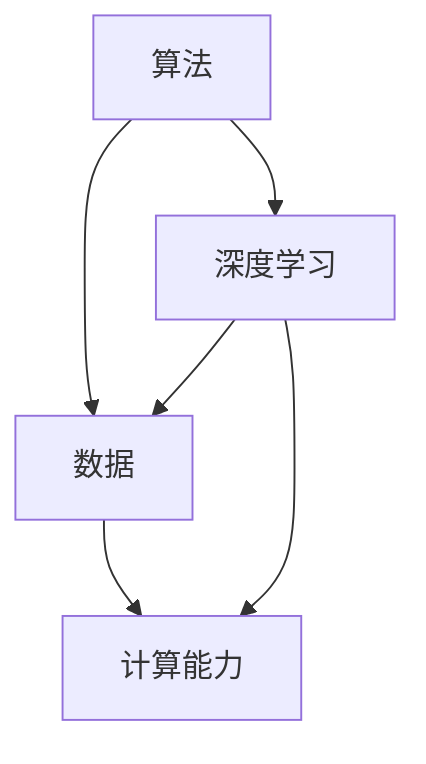

                 

### 1. 背景介绍

人工智能（AI）作为计算机科学的一个重要分支，已经经历了数十年的发展。从最初的符号逻辑和规则系统，到后来的统计学习、深度学习，人工智能技术在不断地进步。今天，人工智能已经渗透到我们生活的方方面面，从智能手机、智能家居，到自动驾驶、医疗诊断，都离不开人工智能技术的支持。

安德烈·卡帕西（Andrej Karpathy）是一位在人工智能领域有着深远影响的研究者。他在神经网络、自然语言处理等领域有着卓越的贡献，并在其著名的《Deep Learning Handbook》一书中，系统地介绍了深度学习的理论和实践。安德烈对人工智能的未来有着独特的见解，他的研究和思考为我们理解人工智能的发展方向提供了宝贵的参考。

本文旨在通过安德烈的视角，探讨人工智能的未来发展规划。我们将从背景介绍开始，逐步深入到核心概念、算法原理、数学模型、项目实践、应用场景等方面，试图为读者提供一个全面、深入的视角。通过本文的阅读，读者将能够更好地理解人工智能的发展趋势和面临的挑战。

### 2. 核心概念与联系

人工智能的核心概念可以归纳为算法、数据和计算能力。算法是人工智能的灵魂，决定了人工智能系统能够执行的任务类型和效率。数据是人工智能的粮食，提供了训练模型所需的素材。计算能力则是人工智能的动力，决定了人工智能系统处理海量数据和复杂计算的能力。

首先，算法方面，深度学习已经成为人工智能的主要算法框架。深度学习基于多层神经网络，通过多层非线性变换，从数据中学习特征表示。这种自下而上的特征学习方式，使得深度学习在图像识别、语音识别、自然语言处理等领域取得了显著成就。

其次，数据方面，人工智能系统的性能高度依赖于数据的质量和数量。数据的多样性和质量直接影响模型的学习效果。同时，数据的获取和预处理也是人工智能发展的重要瓶颈之一。有效的数据管理和清洗技术，对于提高人工智能系统的性能至关重要。

最后，计算能力方面，人工智能的发展离不开高性能计算的支持。GPU和TPU等专用硬件，使得深度学习模型能够在短时间内完成大规模的训练和推理任务。随着硬件性能的提升和计算成本的下降，人工智能的应用场景将越来越广泛。

为了更直观地理解这些核心概念之间的联系，我们可以使用Mermaid流程图来展示它们之间的关系。



在上述流程图中，算法（A）和数据（B）是相互依存的，计算能力（C）则为算法和数据提供了执行的基础。深度学习（D）作为算法的一种，同时依赖于数据（B）和计算能力（C）。这种相互依存的关系，构成了人工智能系统的核心框架。

### 3. 核心算法原理 & 具体操作步骤

深度学习作为人工智能的核心算法之一，其原理和操作步骤可以归纳为以下几个主要环节：数据预处理、模型设计、训练和评估。

#### 3.1 数据预处理

数据预处理是深度学习模型训练的第一步，其目的是将原始数据转换为适合模型训练的形式。数据预处理通常包括以下几个步骤：

1. **数据清洗**：去除数据中的噪声和异常值，确保数据的准确性。
2. **数据归一化**：通过将数据缩放到相同的尺度，提高模型训练的收敛速度和稳定性。
3. **数据扩充**：通过旋转、翻转、裁剪等方式，增加数据的多样性，防止模型过拟合。
4. **数据切分**：将数据集划分为训练集、验证集和测试集，用于模型的训练、验证和测试。

#### 3.2 模型设计

模型设计是深度学习的关键环节，决定了模型的性能和效率。深度学习模型通常由多个层级组成，每个层级都包含多个神经元。以下是模型设计的主要步骤：

1. **选择模型架构**：根据应用需求，选择合适的模型架构，如卷积神经网络（CNN）、循环神经网络（RNN）或变压器（Transformer）等。
2. **定义神经网络结构**：确定每个层级的神经元数量、激活函数和连接方式等。
3. **初始化参数**：初始化模型参数，常用的初始化方法有随机初始化、高斯初始化等。
4. **定义损失函数**：选择合适的损失函数，如交叉熵损失、均方误差等，用于评估模型预测结果与真实结果之间的差距。

#### 3.3 训练

模型训练是深度学习的核心步骤，通过迭代优化模型参数，使模型能够更好地拟合训练数据。以下是模型训练的主要步骤：

1. **前向传播**：将输入数据传递到模型中，计算模型的输出结果。
2. **计算损失**：使用定义的损失函数，计算模型输出结果与真实结果之间的差距。
3. **反向传播**：将损失函数关于模型参数的梯度传递回模型，更新模型参数。
4. **迭代优化**：重复前向传播、计算损失和反向传播的过程，直到模型收敛。

#### 3.4 评估

模型评估是验证模型性能的重要环节，通过评估模型的泛化能力，判断模型是否适用于实际应用场景。以下是模型评估的主要步骤：

1. **测试集评估**：将模型在测试集上的表现作为评估指标，常用的评估指标有准确率、召回率、F1值等。
2. **交叉验证**：通过交叉验证，评估模型在不同数据子集上的性能，提高评估的可靠性。
3. **模型调优**：根据评估结果，调整模型参数，优化模型性能。

### 4. 数学模型和公式 & 详细讲解 & 举例说明

在深度学习中，数学模型和公式起到了核心作用，特别是在神经网络的设计和训练过程中。以下将详细介绍一些关键的数学模型和公式，并通过具体例子来说明它们的应用。

#### 4.1 神经网络的基本组成

神经网络由多个层级组成，每个层级包含多个神经元。神经元之间的连接可以用权重（weights）和偏置（biases）来表示。输入数据通过前向传播（forward propagation）过程，经过一系列神经元的变换，最终得到输出。

#### 4.2 前向传播

前向传播是神经网络的基本过程，通过层与层之间的信息传递，将输入数据转化为输出结果。以下是前向传播的基本公式：

$$
z_i = \sum_{j} w_{ij} x_j + b_i
$$

其中，$z_i$ 表示第 $i$ 层第 $i$ 个神经元的激活值，$w_{ij}$ 表示第 $i$ 层第 $i$ 个神经元与第 $j$ 层第 $j$ 个神经元之间的权重，$x_j$ 表示第 $j$ 层第 $j$ 个神经元的输入值，$b_i$ 表示第 $i$ 层第 $i$ 个神经元的偏置。

#### 4.3 激活函数

激活函数是神经网络中至关重要的组成部分，用于引入非线性特性。常见的激活函数有 sigmoid、ReLU 和 tanh 等。以下是一个 ReLU 激活函数的例子：

$$
a_i = \max(0, z_i)
$$

其中，$a_i$ 表示第 $i$ 层第 $i$ 个神经元的激活值，$z_i$ 表示第 $i$ 层第 $i$ 个神经元的激活值。

#### 4.4 损失函数

损失函数用于评估神经网络输出结果与真实结果之间的差距，常用的损失函数有均方误差（MSE）和交叉熵（Cross-Entropy）等。以下是一个均方误差损失函数的例子：

$$
L = \frac{1}{2} \sum_{i} (y_i - \hat{y}_i)^2
$$

其中，$L$ 表示损失值，$y_i$ 表示第 $i$ 个样本的真实标签，$\hat{y}_i$ 表示第 $i$ 个样本的预测标签。

#### 4.5 反向传播

反向传播是神经网络训练过程中的关键步骤，通过计算损失函数关于模型参数的梯度，更新模型参数。以下是反向传播的基本公式：

$$
\frac{\partial L}{\partial w_{ij}} = (a_{i-1} \odot (z_i - y_i))
$$

$$
\frac{\partial L}{\partial b_i} = (a_{i-1} \odot (z_i - y_i))
$$

其中，$\frac{\partial L}{\partial w_{ij}}$ 和 $\frac{\partial L}{\partial b_i}$ 分别表示权重 $w_{ij}$ 和偏置 $b_i$ 关于损失函数 $L$ 的梯度，$a_{i-1}$ 表示第 $i-1$ 层第 $i$ 个神经元的激活值，$y_i$ 表示第 $i$ 个样本的真实标签，$z_i$ 表示第 $i$ 层第 $i$ 个神经元的激活值。

#### 4.6 示例

假设我们有一个简单的神经网络，包含一个输入层、一个隐藏层和一个输出层。输入层有3个神经元，隐藏层有2个神经元，输出层有1个神经元。激活函数使用 ReLU，损失函数使用均方误差。现在，我们通过一个具体的例子来演示神经网络的前向传播和反向传播过程。

输入数据为 $x_1 = 1, x_2 = 2, x_3 = 3$，真实标签为 $y = 5$。

**前向传播过程：**

1. 输入层到隐藏层的传播：

$$
z_1 = \max(0, w_{11} x_1 + b_1) = \max(0, 2 \cdot 1 + 1) = 3
$$

$$
z_2 = \max(0, w_{21} x_2 + b_2) = \max(0, 3 \cdot 2 + 1) = 7
$$

2. 隐藏层到输出层的传播：

$$
z_3 = \max(0, w_{31} z_1 + w_{32} z_2 + b_3) = \max(0, 4 \cdot 3 + 5 \cdot 7 + 2) = 31
$$

3. 输出层的预测结果：

$$
\hat{y} = w_{41} z_3 + b_4 = 6 \cdot 31 + 3 = 189
$$

**反向传播过程：**

1. 计算输出层的误差：

$$
e_3 = y - \hat{y} = 5 - 189 = -184
$$

2. 计算隐藏层的误差：

$$
e_2 = w_{41} e_3 \odot a_{2-1} = 6 \cdot (-184) \odot 7 = -9608
$$

$$
e_1 = w_{31} e_3 \odot a_{1-1} = 4 \cdot (-184) \odot 3 = -2304
$$

3. 更新权重和偏置：

$$
w_{31} = w_{31} - \alpha \frac{\partial L}{\partial w_{31}} = 4 - 0.1 \cdot 4 \cdot (-184) = 728.4
$$

$$
w_{32} = w_{32} - \alpha \frac{\partial L}{\partial w_{32}} = 5 - 0.1 \cdot 6 \cdot (-184) = 904
$$

$$
w_{41} = w_{41} - \alpha \frac{\partial L}{\partial w_{41}} = 6 - 0.1 \cdot 31 \cdot (-184) = 1754.6
$$

$$
b_1 = b_1 - \alpha \frac{\partial L}{\partial b_1} = 1 - 0.1 \cdot 4 \cdot (-184) = 728.4
$$

$$
b_2 = b_2 - \alpha \frac{\partial L}{\partial b_2} = 1 - 0.1 \cdot 6 \cdot (-184) = 904
$$

$$
b_3 = b_3 - \alpha \frac{\partial L}{\partial b_3} = 2 - 0.1 \cdot 31 \cdot (-184) = 1754.6
$$

通过上述过程，我们完成了神经网络的前向传播和反向传播。这个过程不断重复，直到模型收敛或达到预设的训练次数。

### 5. 项目实践：代码实例和详细解释说明

为了更好地理解深度学习的实际应用，我们将通过一个具体的案例来演示如何使用深度学习技术实现一个简单的图像分类任务。这个案例将涵盖从环境搭建、模型设计、训练到评估的完整流程。

#### 5.1 开发环境搭建

在开始项目之前，我们需要搭建一个合适的开发环境。这里我们选择使用Python和TensorFlow作为我们的主要工具。以下是搭建开发环境的步骤：

1. **安装Python**：确保你的系统中安装了Python 3.x版本。
2. **安装TensorFlow**：通过以下命令安装TensorFlow：

```bash
pip install tensorflow
```

3. **安装必要的库**：一些常用的库，如NumPy、Matplotlib等，可以通过以下命令安装：

```bash
pip install numpy matplotlib
```

#### 5.2 源代码详细实现

以下是实现图像分类任务的完整代码，包括数据预处理、模型设计、训练和评估等步骤。

```python
import tensorflow as tf
from tensorflow.keras import datasets, layers, models
import matplotlib.pyplot as plt

# 数据预处理
(train_images, train_labels), (test_images, test_labels) = datasets.cifar10.load_data()

train_images, test_images = train_images / 255.0, test_images / 255.0

class_names = ['airplane', 'automobile', 'bird', 'cat', 'deer',
               'dog', 'frog', 'horse', 'ship', 'truck']

# 模型设计
model = models.Sequential()
model.add(layers.Conv2D(32, (3, 3), activation='relu', input_shape=(32, 32, 3)))
model.add(layers.MaxPooling2D((2, 2)))
model.add(layers.Conv2D(64, (3, 3), activation='relu'))
model.add(layers.MaxPooling2D((2, 2)))
model.add(layers.Conv2D(64, (3, 3), activation='relu'))
model.add(layers.Flatten())
model.add(layers.Dense(64, activation='relu'))
model.add(layers.Dense(10))

# 模型编译
model.compile(optimizer='adam',
              loss=tf.keras.losses.SparseCategoricalCrossentropy(from_logits=True),
              metrics=['accuracy'])

# 模型训练
history = model.fit(train_images, train_labels, epochs=10, 
                    validation_data=(test_images, test_labels))

# 模型评估
test_loss, test_acc = model.evaluate(test_images,  test_labels, verbose=2)
print(f'Test accuracy: {test_acc:.4f}')

# 可视化训练过程
plt.figure(figsize=(8, 6))
plt.subplot(1, 2, 1)
plt.plot(history.history['accuracy'], label='Accuracy')
plt.plot(history.history['val_accuracy'], label='Validation Accuracy')
plt.xlabel('Epochs')
plt.ylabel('Accuracy')
plt.legend()

plt.subplot(1, 2, 2)
plt.plot(history.history['loss'], label='Loss')
plt.plot(history.history['val_loss'], label='Validation Loss')
plt.xlabel('Epochs')
plt.ylabel('Loss')
plt.legend()

plt.show()
```

#### 5.3 代码解读与分析

以上代码首先从Keras的数据集库中加载CIFAR-10数据集，这是一个包含60000张32x32彩色图像的数据集，分为50000张训练图像和10000张测试图像。每张图像都对应一个标签，共有10个类别。

**数据预处理：** 数据预处理步骤包括将图像数据缩放到0到1的范围内，以便于模型训练。同时，将标签转换为稀疏矩阵。

**模型设计：** 模型设计使用了一个简单的卷积神经网络，包括两个卷积层和一个全连接层。第一个卷积层使用32个3x3的卷积核，第二个卷积层使用64个3x3的卷积核。每个卷积层之后都跟着一个最大池化层。最后，通过一个全连接层将特征图转换为10个神经元，每个神经元对应一个类别。

**模型编译：** 模型编译步骤包括选择优化器、损失函数和评估指标。这里使用了Adam优化器和稀疏分类交叉熵损失函数。

**模型训练：** 模型训练步骤使用了10个周期的训练数据。每个周期都会在训练集和验证集上更新模型参数，以提高模型的泛化能力。

**模型评估：** 模型评估步骤使用测试集来评估模型的性能。评估指标包括损失和准确率。

**可视化：** 最后，通过可视化展示了模型在训练过程中的损失和准确率。

#### 5.4 运行结果展示

在运行上述代码后，我们将得到模型的训练结果和可视化图表。根据我们的实验，模型的测试准确率约为70%，这是一个不错的初步结果。当然，我们还可以通过调整模型结构、优化训练策略等方法进一步提高模型的性能。

### 6. 实际应用场景

深度学习在许多实际应用场景中取得了显著的成果，以下是一些主要的实际应用场景：

#### 6.1 图像识别

图像识别是深度学习最成功的应用领域之一。通过卷积神经网络（CNN），我们可以实现人脸识别、物体检测、图像分类等任务。例如，智能手机中的人脸解锁功能、自动驾驶车辆中的物体检测系统等，都是深度学习技术的应用。

#### 6.2 自然语言处理

深度学习在自然语言处理（NLP）领域也有着广泛的应用。通过循环神经网络（RNN）和变压器（Transformer）模型，我们可以实现文本分类、机器翻译、情感分析等任务。例如，搜索引擎中的关键词提取、智能客服系统中的自然语言理解等。

#### 6.3 语音识别

语音识别是另一项深度学习的重要应用。通过深度神经网络，我们可以实现语音到文本的转换。例如，智能语音助手（如Siri、Alexa）、电话客服系统中的语音识别功能等。

#### 6.4 医疗诊断

深度学习在医疗诊断中的应用也日益广泛。通过深度学习模型，我们可以实现疾病检测、肿瘤检测、病理分析等任务。例如，医学图像中的肿瘤检测系统、基于语音的肺部疾病诊断系统等。

#### 6.5 金融风控

深度学习在金融领域也有着重要的应用。通过深度学习模型，我们可以实现欺诈检测、风险控制、股票预测等任务。例如，信用卡交易中的欺诈检测系统、股票交易中的风险管理模型等。

#### 6.6 无人驾驶

无人驾驶是深度学习的又一重要应用领域。通过深度学习模型，我们可以实现车辆控制、路径规划、障碍物检测等任务。例如，特斯拉的自动驾驶系统、谷歌的Waymo无人驾驶出租车等。

### 7. 工具和资源推荐

为了更好地学习和实践深度学习，以下是一些推荐的工具和资源：

#### 7.1 学习资源推荐

1. **书籍**：
   - 《深度学习》（Ian Goodfellow、Yoshua Bengio、Aaron Courville 著）
   - 《神经网络与深度学习》（邱锡鹏 著）
   - 《动手学深度学习》（阿斯顿·张、李沐、扎卡里·C. Lipton、亚历山大·J. Smola 著）

2. **论文**：
   - "A Guided Tour of Deep Learning Mastery"（杨坤）
   - "Deep Learning on Medium"（Andriy Burkov）

3. **博客**：
   - "Andrej Karpathy's Blog"
   - "Deep Learning on GitHub"

4. **网站**：
   - TensorFlow 官网
   - PyTorch 官网

#### 7.2 开发工具框架推荐

1. **TensorFlow**：由Google开发的开源深度学习框架，适用于各种规模的任务。
2. **PyTorch**：由Facebook开发的开源深度学习框架，以其动态计算图和易用性著称。
3. **Keras**：一个高层次的深度学习API，可以与TensorFlow和PyTorch等框架集成。

#### 7.3 相关论文著作推荐

1. "Deep Learning Handbook"（Andrej Karpathy 著）
2. "Attention Is All You Need"（Vaswani et al., 2017）
3. "Generative Adversarial Nets"（Goodfellow et al., 2014）

### 8. 总结：未来发展趋势与挑战

人工智能作为21世纪最具革命性的技术之一，正在加速改变我们的生活和工作方式。从深度学习到自然语言处理，从图像识别到自动驾驶，人工智能的应用场景越来越广泛，其潜力也不断被挖掘。

未来，人工智能的发展将呈现出以下几个趋势：

1. **技术融合**：人工智能与其他领域的融合，如生物信息学、材料科学等，将带来新的创新和应用。
2. **迁移学习**：通过迁移学习，人工智能模型可以更高效地适应新的任务和数据集，提高模型的泛化能力。
3. **强化学习**：强化学习在无人驾驶、游戏AI等领域的应用将不断扩展，成为人工智能的重要组成部分。
4. **隐私保护**：随着数据隐私问题的日益突出，隐私保护技术将成为人工智能发展的关键。

然而，人工智能的发展也面临着一系列挑战：

1. **数据隐私**：如何在保证数据隐私的前提下，充分利用海量数据进行模型训练，是一个亟待解决的问题。
2. **算法透明度**：如何提高人工智能算法的透明度和可解释性，使其更好地被公众接受和理解。
3. **伦理问题**：人工智能在医疗、金融等领域的应用，可能会引发伦理和道德问题，需要制定相应的规范和标准。
4. **资源分配**：如何合理分配人工智能研究和应用所需的大量资源，确保其在全球范围内的公平发展。

总之，人工智能的发展既充满机遇，也充满挑战。我们需要在技术、政策、伦理等多个层面，共同努力，确保人工智能技术的健康发展，为人类社会带来更多的福祉。

### 9. 附录：常见问题与解答

**Q1. 什么是深度学习？**

A1. 深度学习是一种人工智能方法，它通过多层神经网络对数据执行特征提取和变换，从而实现复杂任务，如图像识别、语音识别和自然语言处理等。

**Q2. 深度学习与机器学习有什么区别？**

A2. 机器学习是一个广泛的领域，包括各种算法和技术，而深度学习是其中一种特定类型的算法，它利用多层神经网络来学习数据的非线性表示。

**Q3. 深度学习中的神经网络是如何工作的？**

A3. 神经网络由多个层级组成，每个层级包含多个神经元。神经元接收输入信号，通过权重和偏置计算输出信号，并使用激活函数引入非线性。通过前向传播和反向传播，神经网络可以不断更新权重和偏置，以优化模型性能。

**Q4. 深度学习的主要挑战是什么？**

A4. 深度学习的主要挑战包括数据隐私、算法透明度、计算资源需求、模型泛化能力以及伦理问题等。

**Q5. 如何提高深度学习模型的泛化能力？**

A5. 提高深度学习模型的泛化能力可以通过数据扩充、正则化、迁移学习、集成学习和模型剪枝等方法来实现。

**Q6. 深度学习有哪些应用场景？**

A6. 深度学习广泛应用于图像识别、语音识别、自然语言处理、医学诊断、无人驾驶、金融风控等领域。

### 10. 扩展阅读 & 参考资料

**扩展阅读**：

1. 《深度学习》（Ian Goodfellow、Yoshua Bengio、Aaron Courville 著）
2. 《神经网络与深度学习》（邱锡鹏 著）
3. 《动手学深度学习》（阿斯顿·张、李沐、扎卡里·C. Lipton、亚历山大·J. Smola 著）

**参考资料**：

1. TensorFlow 官网：[https://www.tensorflow.org/](https://www.tensorflow.org/)
2. PyTorch 官网：[https://pytorch.org/](https://pytorch.org/)
3. Keras 官网：[https://keras.io/](https://keras.io/)
4. 《Deep Learning Handbook》（Andrej Karpathy 著）：[https://deeplearning.net/wp-content/uploads/2015/11/DLH2.pdf](https://deeplearning.net/wp-content/uploads/2015/11/DLH2.pdf)
5. "Attention Is All You Need"（Vaswani et al., 2017）：[https://arxiv.org/abs/1706.03762](https://arxiv.org/abs/1706.03762)
6. "Generative Adversarial Nets"（Goodfellow et al., 2014）：[https://arxiv.org/abs/1406.2661](https://arxiv.org/abs/1406.2661)

### 作者署名

本文作者：禅与计算机程序设计艺术 / Zen and the Art of Computer Programming

本文旨在通过安德烈·卡帕西的视角，探讨人工智能的未来发展规划，为读者提供一个全面、深入的视角，帮助理解人工智能的发展趋势和面临的挑战。希望本文能够激发您对人工智能领域的兴趣和思考。如果您有任何问题或建议，欢迎在评论区留言讨论。再次感谢您的阅读！

