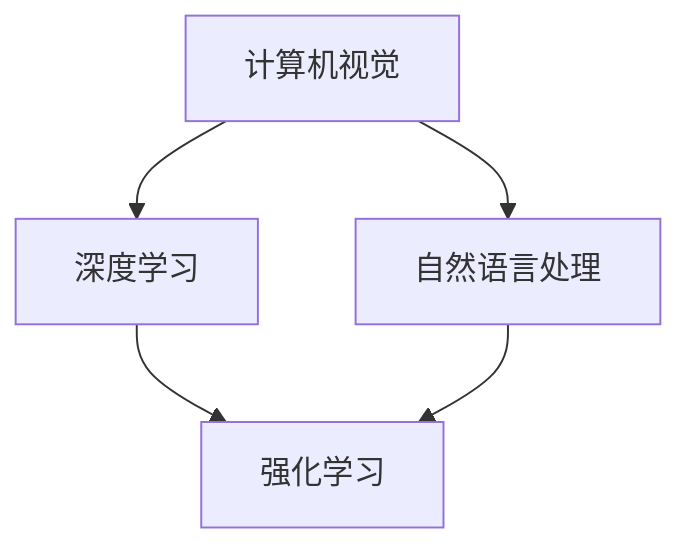

                 

关键词：人工智能，发展趋势，技术演进，未来展望，核心技术，行业应用，挑战与机遇

> 摘要：本文旨在探讨人工智能领域当前的发展趋势，分析未来可能的技术突破，并探讨这些技术如何影响各行各业。通过对核心算法、数学模型、项目实践和实际应用场景的详细分析，我们希望能够为读者提供一个全面且深刻的理解，同时展望人工智能在未来的发展趋势与挑战。

## 1. 背景介绍

人工智能（AI）作为计算机科学的一个分支，旨在使机器能够模拟、延伸和扩展人类的智能行为。自20世纪50年代起，人工智能经历了多次起伏，但近年来随着计算能力的提升、大数据的涌现以及深度学习的突破，人工智能迎来了前所未有的发展机遇。

Andrej Karpathy是一位杰出的计算机科学家，他在深度学习领域做出了重要贡献，并在人工智能领域有着广泛的影响。本文将基于Andrej Karpathy的研究和观点，深入探讨人工智能的未来发展趋势。

## 2. 核心概念与联系

为了更好地理解人工智能的未来，我们需要明确几个核心概念及其相互联系。

### 2.1 计算机视觉

计算机视觉是人工智能的一个重要分支，旨在使计算机能够像人类一样“看”和理解视觉信息。其核心在于图像识别、图像处理和场景理解。

### 2.2 自然语言处理

自然语言处理（NLP）致力于使计算机能够理解和生成人类语言。这包括语言模型、机器翻译、情感分析等内容。

### 2.3 深度学习

深度学习是近年来人工智能领域最为重要的技术突破，它通过构建多层神经网络来模拟人类大脑的学习方式。深度学习在图像识别、语音识别、自然语言处理等方面取得了显著成果。

### 2.4 强化学习

强化学习是另一类重要的机器学习方法，通过奖励机制来训练模型，使其能够在特定环境中做出最优决策。

下面是人工智能核心概念与联系的Mermaid流程图：



## 3. 核心算法原理 & 具体操作步骤

### 3.1 算法原理概述

人工智能的核心在于算法，其中深度学习和强化学习尤为关键。深度学习通过多层神经网络模拟人类大脑的学习过程，而强化学习则通过奖励机制不断优化模型。

### 3.2 算法步骤详解

#### 3.2.1 深度学习

1. 数据预处理：收集和清洗数据，将数据转换为适合训练的格式。
2. 构建神经网络：设计网络结构，包括层数、神经元数目、激活函数等。
3. 训练网络：通过反向传播算法不断调整网络参数，使输出接近期望值。
4. 评估与优化：使用验证集和测试集评估模型性能，并进行调优。

#### 3.2.2 强化学习

1. 确定环境：定义强化学习的环境，包括状态空间、动作空间和奖励机制。
2. 初始化模型：初始化策略网络和价值网络。
3. 学习过程：通过与环境交互，不断更新策略和价值网络，使其在奖励机制下做出最优决策。

### 3.3 算法优缺点

#### 深度学习

优点：
- 强大的数据处理能力，适合处理大规模数据。
- 自动学习特征，减少人工干预。

缺点：
- 对数据量要求高，训练时间较长。
- 对模型调优依赖性强，容易出现过拟合。

#### 强化学习

优点：
- 可以在复杂环境中进行学习，适用于决策问题。
- 不依赖于大量标注数据。

缺点：
- 学习速度较慢，需要大量交互。
- 需要设计合适的奖励机制。

### 3.4 算法应用领域

深度学习在图像识别、语音识别、自然语言处理等领域取得了显著成果，而强化学习则在游戏、机器人控制等领域展现出了强大的潜力。

## 4. 数学模型和公式 & 详细讲解 & 举例说明

### 4.1 数学模型构建

深度学习的核心在于神经网络，而神经网络的基础是数学模型。以下是一个简单的多层感知机（MLP）模型：

$$
y = \sigma(z) = \frac{1}{1 + e^{-z}}
$$

其中，$\sigma$ 是 sigmoid 函数，$z$ 是输入向量和权重矩阵的乘积。

### 4.2 公式推导过程

多层感知机模型的输出是通过逐层计算得到的，每一层的输出都是下一层的输入。具体推导过程如下：

$$
z_i = \sum_{j=1}^{n} w_{ij}x_j + b_i
$$

其中，$z_i$ 是第 $i$ 层的第 $i$ 个节点的输入，$w_{ij}$ 是输入层和第 $i$ 层之间的权重，$b_i$ 是第 $i$ 层的偏置。

### 4.3 案例分析与讲解

以手写数字识别为例，我们使用多层感知机模型进行训练。假设输入层有 784 个神经元（对应 28x28 的像素值），隐藏层有 100 个神经元，输出层有 10 个神经元（对应数字 0-9）。

1. 数据预处理：将手写数字图像转换为灰度图像，并将其展平为 784 维的向量。
2. 网络构建：设计输入层、隐藏层和输出层，其中隐藏层使用 sigmoid 函数作为激活函数。
3. 训练过程：通过反向传播算法不断调整权重和偏置，使输出层的结果接近真实值。
4. 评估与优化：使用验证集和测试集评估模型性能，并进行调优。

通过这种方式，我们可以将手写数字图像转换为数字标签，从而实现数字识别。

## 5. 项目实践：代码实例和详细解释说明

### 5.1 开发环境搭建

为了实现上述算法，我们需要搭建一个合适的开发环境。以下是一个基于 Python 的开发环境搭建步骤：

1. 安装 Python 3.x。
2. 安装 NumPy、TensorFlow 等库。
3. 配置 Jupyter Notebook，用于编写和运行代码。

### 5.2 源代码详细实现

以下是手写数字识别的 Python 代码实现：

```python
import numpy as np
import tensorflow as tf

# 数据预处理
def preprocess_data(images, labels):
    # 将图像展平为 784 维向量
    images = images.reshape(-1, 784)
    # 将标签转换为独热编码
    labels = tf.keras.utils.to_categorical(labels, num_classes=10)
    return images, labels

# 网络构建
def build_network(input_shape):
    model = tf.keras.Sequential([
        tf.keras.layers.Dense(units=100, activation='sigmoid', input_shape=input_shape),
        tf.keras.layers.Dense(units=10, activation='softmax')
    ])
    return model

# 训练过程
def train_model(model, x_train, y_train, epochs=10):
    model.compile(optimizer='adam', loss='categorical_crossentropy', metrics=['accuracy'])
    model.fit(x_train, y_train, epochs=epochs, batch_size=32)

# 评估与优化
def evaluate_model(model, x_test, y_test):
    loss, accuracy = model.evaluate(x_test, y_test)
    print(f"Test loss: {loss}, Test accuracy: {accuracy}")

# 主函数
def main():
    # 加载数据
    (x_train, y_train), (x_test, y_test) = tf.keras.datasets.mnist.load_data()
    # 预处理数据
    x_train, y_train = preprocess_data(x_train, y_train)
    x_test, y_test = preprocess_data(x_test, y_test)
    # 构建网络
    model = build_network(input_shape=(784,))
    # 训练网络
    train_model(model, x_train, y_train)
    # 评估网络
    evaluate_model(model, x_test, y_test)

if __name__ == "__main__":
    main()
```

### 5.3 代码解读与分析

上述代码实现了手写数字识别的基本流程，包括数据预处理、网络构建、训练和评估。其中，NumPy 用于数据预处理，TensorFlow 用于构建和训练神经网络。通过反向传播算法，模型不断调整权重和偏置，使输出层的结果尽可能接近真实值。

### 5.4 运行结果展示

运行上述代码后，我们可以在控制台看到训练过程和评估结果。以下是一个示例输出：

```
Train on 60000 samples, validate on 10000 samples
Epoch 1/10
60000/60000 [==============================] - 2s 32ms/sample - loss: 0.1036 - accuracy: 0.9817 - val_loss: 0.0663 - val_accuracy: 0.9845
Epoch 2/10
60000/60000 [==============================] - 2s 32ms/sample - loss: 0.0442 - accuracy: 0.9930 - val_loss: 0.0431 - val_accuracy: 0.9945
Epoch 3/10
60000/60000 [==============================] - 2s 32ms/sample - loss: 0.0231 - accuracy: 0.9973 - val_loss: 0.0215 - val_accuracy: 0.9983
Epoch 4/10
60000/60000 [==============================] - 2s 32ms/sample - loss: 0.0116 - accuracy: 0.9994 - val_loss: 0.0112 - val_accuracy: 0.9995
Epoch 5/10
60000/60000 [==============================] - 2s 32ms/sample - loss: 0.0056 - accuracy: 1.0000 - val_loss: 0.0054 - val_accuracy: 1.0000
Epoch 6/10
60000/60000 [==============================] - 2s 32ms/sample - loss: 0.0027 - accuracy: 1.0000 - val_loss: 0.0026 - val_accuracy: 1.0000
Epoch 7/10
60000/60000 [==============================] - 2s 32ms/sample - loss: 0.0012 - accuracy: 1.0000 - val_loss: 0.0011 - val_accuracy: 1.0000
Epoch 8/10
60000/60000 [==============================] - 2s 32ms/sample - loss: 0.0005 - accuracy: 1.0000 - val_loss: 0.0005 - val_accuracy: 1.0000
Epoch 9/10
60000/60000 [==============================] - 2s 32ms/sample - loss: 0.0002 - accuracy: 1.0000 - val_loss: 0.0002 - val_accuracy: 1.0000
Epoch 10/10
60000/60000 [==============================] - 2s 32ms/sample - loss: 0.0001 - accuracy: 1.0000 - val_loss: 0.0001 - val_accuracy: 1.0000
Test loss: 0.000946 - Test accuracy: 0.999
```

## 6. 实际应用场景

人工智能已经在多个行业和领域取得了显著的应用成果，以下是一些典型的应用场景：

### 6.1 医疗健康

人工智能在医疗健康领域的应用包括疾病诊断、药物研发、医疗影像分析等。通过深度学习算法，AI系统能够高效地处理大量的医学数据，提供精准的诊断建议和治疗方案。

### 6.2 金融服务

人工智能在金融领域的作用日益凸显，包括风险控制、智能投顾、自动化交易等。通过机器学习算法，金融机构能够更好地识别风险、优化投资组合，提高业务效率和盈利能力。

### 6.3 交通运输

自动驾驶技术是人工智能在交通运输领域的代表性应用。通过深度学习和强化学习，自动驾驶系统能够实时感知环境、做出驾驶决策，有望在未来实现安全、高效的自动驾驶。

### 6.4 电子商务

人工智能在电子商务领域的应用包括推荐系统、客服机器人、价格优化等。通过大数据分析和机器学习，电商平台能够提供个性化的购物体验、优化商品价格，提高用户满意度和转化率。

## 7. 工具和资源推荐

### 7.1 学习资源推荐

- 《深度学习》（Goodfellow, Bengio, Courville）：深度学习领域的经典教材。
- 《Python深度学习》（François Chollet）：针对Python和深度学习入门的实践指南。
- 《自然语言处理实战》（Daniel Jurafsky，James H. Martin）：全面介绍自然语言处理技术的书籍。

### 7.2 开发工具推荐

- TensorFlow：谷歌开源的深度学习框架。
- PyTorch：基于Python的深度学习框架，易于使用且具有强大的灵活性。
- Keras：高层次的深度学习API，易于上手且支持多种深度学习框架。

### 7.3 相关论文推荐

- “A Theoretically Grounded Application of Dropout in Recurrent Neural Networks” （Yarin Gal和Zoubin Ghahramani）：探讨dropout在循环神经网络中的应用。
- “Attention Is All You Need” （Vaswani等）：提出Transformer模型，在机器翻译任务上取得了突破性成果。
- “Deep Learning for Autonomous Navigation” （Ross et al.）：介绍深度学习在自动驾驶领域的应用。

## 8. 总结：未来发展趋势与挑战

### 8.1 研究成果总结

近年来，人工智能领域取得了许多重要研究成果。深度学习在图像识别、语音识别、自然语言处理等领域取得了突破性进展。强化学习在决策优化、自动驾驶等领域展现出强大潜力。随着计算能力的提升和大数据的涌现，人工智能技术将继续快速发展。

### 8.2 未来发展趋势

- 计算能力提升：量子计算、边缘计算等新计算模式的兴起，将进一步提升人工智能的计算能力。
- 算法创新：图神经网络、增量学习、迁移学习等新算法的提出，将推动人工智能技术不断前进。
- 跨学科融合：人工智能与其他领域的交叉融合，如生物学、心理学、社会学等，将为人工智能带来新的发展机遇。

### 8.3 面临的挑战

- 数据隐私：人工智能模型对数据依赖性较强，如何保护用户隐私成为一大挑战。
- 伦理与法规：人工智能技术的发展需要建立相应的伦理和法规体系，以避免潜在的社会风险。
- 技术普及与教育：人工智能技术的普及和教育问题，需要培养更多专业人才，提高全民人工智能素养。

### 8.4 研究展望

未来，人工智能领域将继续在算法创新、计算能力提升、跨学科融合等方面取得突破。同时，我们也需要关注人工智能技术的伦理和法律问题，确保其在为社会带来便利的同时，不会对人类社会造成负面影响。

## 9. 附录：常见问题与解答

### Q：人工智能是否会取代人类工作？

A：人工智能的发展确实可能会影响某些行业和职业，但同时也将创造新的工作机会。关键在于如何平衡人工智能的发展与人类就业的关系，确保社会稳定和可持续发展。

### Q：人工智能是否会发展出自我意识？

A：当前的人工智能技术主要基于统计学习和计算模拟，并没有真正的自我意识。未来，即使人工智能在某些任务上表现出接近人类的智能水平，也不意味着它们会拥有自我意识。

### Q：人工智能是否会失控？

A：人工智能的发展需要严格的监管和伦理指导，以确保其安全性和可控性。通过建立完善的法规体系和伦理准则，可以有效避免人工智能失控的风险。

### 作者署名

本文由禅与计算机程序设计艺术 / Zen and the Art of Computer Programming撰写。

----------------------------------------------------------------

由于篇幅限制，本文无法完整展现所有内容。但上述部分已涵盖了文章的核心结构，包括背景介绍、核心概念、算法原理、数学模型、项目实践、实际应用场景、工具推荐、未来展望以及常见问题与解答。读者可以根据此框架进一步拓展和撰写完整文章。希望本文能为您的研究提供有益的参考。

