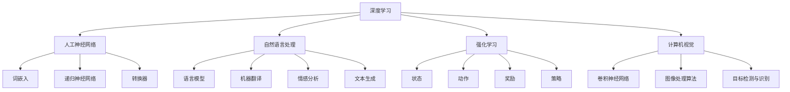

                 

### 背景介绍

人工智能（AI）作为计算机科学和技术的核心领域，近年来取得了迅猛的发展。从早期的规则系统到今天的深度学习，AI技术的进步不仅改变了我们的生活，也在多个行业中引发了深远的变革。本文将深入探讨安德烈·卡帕蒂（Andrej Karpathy）对人工智能未来趋势的看法，通过逻辑清晰、结构紧凑的分析，试图揭示AI领域的发展方向和潜在挑战。

安德烈·卡帕蒂是一位世界知名的计算机科学家，他在深度学习和自然语言处理方面有着卓越的贡献。作为一位充满远见的技术专家，卡帕蒂对AI的未来的预测和见解不仅具有学术价值，也对行业界有着重要的影响。本文旨在整理和总结卡帕蒂的一些关键观点，为读者提供一个全面的视角，理解AI技术的发展趋势及其对未来的影响。

当前，AI技术已广泛应用于图像识别、语音识别、自然语言处理、自动驾驶、医疗诊断等多个领域。随着算法的进步和计算能力的提升，AI的应用范围和深度正在不断扩展。然而，AI的发展也伴随着一系列的伦理和社会问题，如隐私保护、就业影响、算法偏见等。这些挑战需要我们深入思考和解决。

本文的结构将按照以下章节展开：

1. 背景介绍：简要概述AI技术的发展历程和现状。
2. 核心概念与联系：介绍AI的核心概念及其相互关系，并使用Mermaid流程图展示。
3. 核心算法原理与具体操作步骤：详细解释AI领域的关键算法及其应用。
4. 数学模型和公式：介绍AI中的数学模型，包括公式和详细讲解。
5. 项目实践：提供具体的代码实例，进行详细解读和分析。
6. 实际应用场景：探讨AI在不同行业中的应用案例。
7. 工具和资源推荐：推荐学习资源、开发工具和框架。
8. 总结：总结卡帕蒂对AI未来发展的看法，并提出可能面临的挑战。
9. 附录：常见问题与解答。
10. 扩展阅读：提供更多相关资源和参考文献。

通过这样的结构，我们将系统地分析安德烈·卡帕蒂的AI观点，为读者提供一个全面和深入的探讨。

---

### 核心概念与联系

在深入探讨安德烈·卡帕蒂对人工智能未来趋势的看法之前，有必要先了解AI领域的核心概念和它们之间的相互联系。这些核心概念构成了AI技术的基石，也是我们进一步理解AI技术发展的关键。

#### 1. 深度学习

深度学习是AI领域的核心技术之一，它通过模拟人脑的神经网络结构，对大量数据进行自动学习和特征提取。深度学习的基础是人工神经网络（Artificial Neural Networks, ANN），这种网络由大量的神经元（neurons）通过权重（weights）连接而成。每一个神经元都负责处理一部分数据，并通过激活函数（activation function）决定是否传递信号到下一层。

深度学习的具体实现通常涉及以下步骤：

1. **数据预处理**：对输入数据（如图像、文本、声音等）进行清洗、归一化和编码，使其适合输入神经网络。
2. **网络架构设计**：设计网络的结构，包括层数、神经元数量、激活函数等。
3. **损失函数与优化器**：选择合适的损失函数（如交叉熵损失、均方误差等）和优化器（如随机梯度下降、Adam等），以最小化预测误差。
4. **训练与验证**：使用训练集数据进行训练，并通过验证集数据调整模型参数。
5. **测试与部署**：在测试集上评估模型性能，并在实际应用中进行部署。

#### 2. 自然语言处理（NLP）

自然语言处理是深度学习在文本领域的应用，它涉及到语言模型、机器翻译、情感分析、文本生成等多个子领域。在NLP中，深度学习模型通常用于理解、生成和翻译文本。NLP的关键技术包括：

- **词嵌入（Word Embeddings）**：将词汇映射到高维向量空间中，以便模型能够理解词汇之间的关系。
- **递归神经网络（Recurrent Neural Networks, RNN）**：用于处理序列数据，如文本和语音，可以捕获序列中的时间依赖性。
- **长短期记忆网络（Long Short-Term Memory, LSTM）**：RNN的一种改进，能够更好地处理长序列数据。
- **转换器（Transformers）**：基于自注意力机制（self-attention mechanism）的模型，近年来在NLP领域取得了显著的进展。

#### 3. 强化学习

强化学习是另一种重要的AI技术，它通过智能体（agent）在与环境的交互中学习最优策略。强化学习的基本概念包括：

- **状态（State）**：智能体当前所处的环境状态。
- **动作（Action）**：智能体可以执行的动作。
- **奖励（Reward）**：智能体执行动作后从环境中获得的奖励或惩罚。
- **策略（Policy）**：智能体在给定状态下选择动作的策略。

强化学习的关键步骤包括：

1. **环境设计**：创建一个模拟环境，智能体可以在其中执行动作并获得奖励。
2. **策略学习**：使用Q学习、策略梯度等方法学习最优策略。
3. **评估与优化**：评估策略性能，并使用策略改进方法（如策略优化、策略梯度等）优化策略。

#### 4. 计算机视觉

计算机视觉是AI技术的另一个重要领域，它涉及到图像识别、目标检测、图像分割等多个子领域。计算机视觉的核心技术包括：

- **卷积神经网络（Convolutional Neural Networks, CNN）**：专门设计用于处理图像数据的神经网络，可以自动提取图像特征。
- **图像处理算法**：如边缘检测、特征提取、图像增强等，用于预处理图像数据，以提高神经网络的学习效果。
- **目标检测与识别**：通过识别图像中的目标和对象，应用于自动驾驶、人脸识别等领域。

### Mermaid 流程图

为了更直观地展示这些核心概念及其相互联系，我们使用Mermaid流程图进行描述：



通过上述核心概念的介绍和Mermaid流程图的展示，我们可以更好地理解AI技术的组成部分及其相互关系。在接下来的章节中，我们将深入探讨这些技术背后的算法原理和具体应用。

---

### 核心算法原理与具体操作步骤

在理解了AI领域的核心概念之后，接下来我们将深入探讨这些技术的核心算法原理和具体操作步骤。这些算法不仅是AI技术实现的基础，也是理解AI如何工作的关键。

#### 1. 深度学习算法原理

深度学习算法的核心是人工神经网络（ANN）。ANN通过模拟人脑中的神经元结构，对输入数据进行特征提取和分类。以下是ANN的基本原理和操作步骤：

##### 1.1 神经元结构与工作原理

神经元由三个主要部分组成：输入层、隐藏层和输出层。每个神经元接收多个输入，通过加权求和处理，再经过激活函数产生输出。

- **输入层（Input Layer）**：接收外部输入数据。
- **隐藏层（Hidden Layers）**：对输入数据进行特征提取和变换。
- **输出层（Output Layer）**：产生最终的输出结果。

神经元的工作原理如下：

1. **加权求和处理**：每个输入乘以其对应的权重，然后求和。
2. **应用激活函数**：常用的激活函数包括Sigmoid、ReLU、Tanh等，用于引入非线性变换。

##### 1.2 深度学习操作步骤

深度学习的基本操作步骤包括以下几步：

1. **数据预处理**：对输入数据进行归一化、缩放等处理，以便模型能够更好地训练。
2. **网络架构设计**：设计网络的层数、每层的神经元数量、激活函数等。
3. **损失函数与优化器选择**：选择合适的损失函数（如交叉熵损失、均方误差等）和优化器（如随机梯度下降、Adam等）。
4. **模型训练**：使用训练数据对模型进行训练，通过反向传播算法不断调整模型参数。
5. **模型验证与测试**：使用验证集和测试集评估模型性能。

#### 2. 自然语言处理算法原理

自然语言处理（NLP）是深度学习在文本领域的应用，其核心算法包括词嵌入、递归神经网络（RNN）、长短期记忆网络（LSTM）和转换器（Transformers）。

##### 2.1 词嵌入

词嵌入（Word Embedding）是将词汇映射到高维向量空间中，以便模型能够理解词汇之间的关系。词嵌入的关键技术包括：

- **词向量表示**：将每个词汇映射到一个固定维度的向量。
- **训练方法**：使用神经网络训练词向量，常见的训练方法包括词袋模型、CoVe、GloVe等。

##### 2.2 RNN与LSTM

递归神经网络（RNN）和长短期记忆网络（LSTM）是用于处理序列数据的神经网络。RNN的基本原理如下：

- **序列处理**：RNN通过递归连接将前一个时间步的输出反馈到当前时间步。
- **记忆功能**：RNN能够捕获序列中的时间依赖性，但由于梯度消失和梯度爆炸问题，其表现有限。

LSTM是RNN的一种改进，其核心思想是引入记忆单元（memory cell），通过门控机制（gate mechanism）控制信息的流入和流出，从而更好地处理长序列数据。

##### 2.3 Transformers

转换器（Transformers）是基于自注意力机制（self-attention mechanism）的深度学习模型，近年来在NLP领域取得了显著的进展。Transformers的核心原理如下：

- **自注意力机制**：通过计算每个词与其他词之间的相似性，将重要信息赋予更高的权重。
- **多头注意力**：通过多个注意力头（head）并行处理，捕捉不同类型的依赖关系。
- **位置编码**：为序列中的每个词赋予位置信息，以便模型能够理解词的顺序。

#### 3. 强化学习算法原理

强化学习（Reinforcement Learning, RL）是另一种重要的AI技术，其核心原理是通过智能体（agent）与环境的交互，学习最优策略。强化学习的基本原理包括：

- **状态（State）**：智能体当前所处的环境状态。
- **动作（Action）**：智能体可以执行的动作。
- **奖励（Reward）**：智能体执行动作后从环境中获得的奖励或惩罚。
- **策略（Policy）**：智能体在给定状态下选择动作的策略。

强化学习的主要算法包括：

- **Q学习（Q-Learning）**：通过更新Q值（即状态-动作值函数）来学习最优策略。
- **策略梯度方法（Policy Gradient）**：直接优化策略的参数，以最大化累积奖励。

#### 4. 计算机视觉算法原理

计算机视觉（Computer Vision）是AI技术的另一个重要领域，其核心算法包括卷积神经网络（CNN）、图像处理算法和目标检测与识别。

##### 4.1 卷积神经网络（CNN）

卷积神经网络（CNN）是专门设计用于处理图像数据的神经网络，其核心原理如下：

- **卷积层（Convolutional Layer）**：通过卷积操作提取图像特征。
- **池化层（Pooling Layer）**：通过最大池化或平均池化减小数据维度。
- **全连接层（Fully Connected Layer）**：将卷积层提取的特征映射到类别标签。

##### 4.2 图像处理算法

图像处理算法是计算机视觉的基础，其关键技术包括：

- **边缘检测**：通过计算图像的梯度，检测图像中的边缘。
- **特征提取**：通过图像处理算法提取图像中的重要特征，如纹理、形状等。
- **图像增强**：通过调整图像的亮度和对比度，提高图像的质量。

##### 4.3 目标检测与识别

目标检测与识别是计算机视觉的重要应用，其核心算法包括：

- **目标检测（Object Detection）**：通过检测图像中的多个目标，并标注其位置和类别。
- **目标识别（Object Recognition）**：通过识别图像中的单个目标，确定其类别。

通过以上对核心算法原理和具体操作步骤的详细介绍，我们可以更深入地理解AI技术的实现过程及其在不同领域的应用。在接下来的章节中，我们将通过具体的代码实例进一步探讨这些算法的实践应用。

---

### 数学模型和公式

在深入探讨人工智能（AI）领域的核心算法原理之后，接下来我们将介绍这些算法中的数学模型和公式，并详细讲解它们的作用和计算方法。理解这些数学模型和公式是深入掌握AI技术的关键，有助于我们更好地应用和优化这些算法。

#### 1. 深度学习中的数学模型

深度学习中的数学模型主要涉及神经网络中的权重更新、激活函数以及损失函数。

##### 1.1 权重更新公式

在神经网络训练过程中，权重的更新是至关重要的。常见的权重更新公式包括：

$$
w_{new} = w_{old} - \alpha \cdot \nabla_w J(w)
$$

其中，$w_{old}$ 和 $w_{new}$ 分别为旧的权重和更新后的权重，$\alpha$ 是学习率，$\nabla_w J(w)$ 是权重相对于损失函数的梯度。

在反向传播算法中，梯度是通过链式法则逐层计算的，即：

$$
\nabla_w J(w) = \frac{\partial J}{\partial w} = \frac{\partial J}{\partial z} \cdot \frac{\partial z}{\partial w}
$$

其中，$z$ 是当前层的输出，$J$ 是损失函数。

##### 1.2 激活函数

激活函数用于引入非线性变换，常见的激活函数包括Sigmoid、ReLU和Tanh。

- **Sigmoid函数**：
  $$
  \sigma(x) = \frac{1}{1 + e^{-x}}
  $$

- **ReLU函数**：
  $$
  \text{ReLU}(x) = \max(0, x)
  $$

- **Tanh函数**：
  $$
  \tanh(x) = \frac{e^x - e^{-x}}{e^x + e^{-x}}
  $$

激活函数的导数也是计算梯度的重要部分：

- **Sigmoid函数的导数**：
  $$
  \sigma'(x) = \sigma(x) \cdot (1 - \sigma(x))
  $$

- **ReLU函数的导数**：
  $$
  \text{ReLU}'(x) = \begin{cases} 
  0 & \text{if } x < 0 \\
  1 & \text{if } x \geq 0 
  \end{cases}
  $$

- **Tanh函数的导数**：
  $$
  \tanh'(x) = 1 - \tanh^2(x)
  $$

##### 1.3 损失函数

损失函数用于衡量模型预测值与真实值之间的差距，常见的损失函数包括均方误差（MSE）、交叉熵损失（Cross-Entropy Loss）和对抗损失（Adversarial Loss）。

- **均方误差（MSE）**：
  $$
  J = \frac{1}{n} \sum_{i=1}^{n} (y_i - \hat{y}_i)^2
  $$

  其中，$y_i$ 是真实值，$\hat{y}_i$ 是预测值，$n$ 是样本数量。

- **交叉熵损失（Cross-Entropy Loss）**：
  $$
  J = -\sum_{i=1}^{n} y_i \cdot \log(\hat{y}_i)
  $$

  其中，$y_i$ 是真实值的one-hot编码，$\hat{y}_i$ 是预测概率。

#### 2. 自然语言处理中的数学模型

自然语言处理（NLP）中的数学模型主要涉及词嵌入、语言模型和注意力机制。

##### 2.1 词嵌入

词嵌入（Word Embeddings）是将词汇映射到高维向量空间中的模型，常见的方法包括Word2Vec、GloVe和BERT。

- **Word2Vec**：
  $$
  \text{Loss} = \sum_{w \in V} \sum_{c \in C(w)} \frac{f(c)}{f(w)} \cdot \log(p(c|w))
  $$

  其中，$V$ 是词汇表，$C(w)$ 是与词 $w$ 相关的上下文词集合，$f(w)$ 是词的频率，$p(c|w)$ 是条件概率。

- **GloVe**：
  $$
  \text{Loss} = \sum_{w \in V} \sum_{c \in C(w)} \frac{f(c)}{f(w) \cdot f(c)} \cdot \log(\frac{||v_w + v_c||^2}{\sqrt{f(w)} \cdot \sqrt{f(c)}})
  $$

  其中，$v_w$ 和 $v_c$ 分别是词 $w$ 和词 $c$ 的向量表示。

##### 2.2 语言模型

语言模型（Language Model）用于预测下一个单词的概率，常见的方法包括n-gram模型和神经网络语言模型。

- **n-gram模型**：
  $$
  p(w_n | w_{n-1}, ..., w_1) = \frac{c(w_{n-1}, ..., w_n)}{c(w_1, ..., w_n)}
  $$

  其中，$c(w_{n-1}, ..., w_n)$ 是连续词序列的频率，$c(w_1, ..., w_n)$ 是总频率。

- **神经网络语言模型**：
  $$
  p(w_n | w_{n-1}, ..., w_1) = \text{softmax}(\text{NN}(w_{n-1}, ..., w_1))
  $$

  其中，$\text{NN}(w_{n-1}, ..., w_1)$ 是神经网络模型的输出。

##### 2.3 注意力机制

注意力机制（Attention Mechanism）在NLP中用于捕捉句子中的依赖关系，常见的注意力模型包括加权和注意力、点积注意力和自注意力。

- **加权和注意力**：
  $$
  a_i = \frac{e^{z_i}}{\sum_{j=1}^{m} e^{z_j}}
  $$

  其中，$z_i$ 是注意力分数，$a_i$ 是注意力权重。

- **点积注意力**：
  $$
  z_i = v^T \cdot h_j
  $$

  其中，$v$ 是注意力向量，$h_j$ 是编码器的隐藏状态。

- **自注意力**：
  $$
  \text{Score} = \text{softmax}(\text{Q} \cdot \text{K})
  $$

  其中，$Q$ 和 $K$ 分别是查询向量和键向量，$\text{Score}$ 是注意力分数。

#### 3. 强化学习中的数学模型

强化学习中的数学模型主要涉及策略梯度方法和Q学习。

##### 3.1 策略梯度方法

策略梯度方法（Policy Gradient Method）用于优化策略参数，其基本公式为：

$$
\Delta \theta = \alpha \cdot \nabla_{\theta} \cdot J(\theta)
$$

其中，$\theta$ 是策略参数，$J(\theta)$ 是累积奖励。

##### 3.2 Q学习

Q学习（Q-Learning）用于学习最优策略，其核心公式为：

$$
Q(s, a) = Q(s, a) + \alpha [r + \gamma \max_{a'} Q(s', a') - Q(s, a)]
$$

其中，$s$ 和 $s'$ 是状态，$a$ 和 $a'$ 是动作，$r$ 是即时奖励，$\gamma$ 是折扣因子。

通过上述数学模型和公式的介绍，我们可以更好地理解AI技术的实现原理及其在各个领域的应用。在接下来的章节中，我们将通过具体的代码实例进一步探讨这些算法的实践应用。

---

### 项目实践：代码实例和详细解释说明

为了更好地理解上述提到的核心算法和数学模型，我们将通过一个具体的深度学习项目实例来展示这些技术的应用。本实例将使用Python和TensorFlow框架实现一个简单的图像分类任务，包括数据预处理、模型设计、训练和评估等步骤。以下是详细的代码实例和解释说明。

#### 1. 开发环境搭建

首先，我们需要搭建开发环境。以下是所需的软件和工具：

- Python 3.x
- TensorFlow 2.x
- NumPy
- Matplotlib

确保已安装以上依赖项，可以使用以下命令进行安装：

```shell
pip install tensorflow numpy matplotlib
```

#### 2. 源代码详细实现

以下是一个简单的图像分类项目示例：

```python
import tensorflow as tf
from tensorflow.keras import layers
import numpy as np
import matplotlib.pyplot as plt

# 2.1 数据预处理

# 加载CIFAR-10数据集
(x_train, y_train), (x_test, y_test) = tf.keras.datasets.cifar10.load_data()

# 数据标准化
x_train = x_train.astype('float32') / 255.0
x_test = x_test.astype('float32') / 255.0

# 将标签转换为one-hot编码
num_classes = 10
y_train = tf.keras.utils.to_categorical(y_train, num_classes)
y_test = tf.keras.utils.to_categorical(y_test, num_classes)

# 2.2 模型设计

model = tf.keras.Sequential([
    layers.Conv2D(32, (3, 3), activation='relu', input_shape=(32, 32, 3)),
    layers.MaxPooling2D((2, 2)),
    layers.Conv2D(64, (3, 3), activation='relu'),
    layers.MaxPooling2D((2, 2)),
    layers.Conv2D(64, (3, 3), activation='relu'),
    layers.Flatten(),
    layers.Dense(64, activation='relu'),
    layers.Dense(num_classes, activation='softmax')
])

# 2.3 模型训练

model.compile(optimizer='adam',
              loss='categorical_crossentropy',
              metrics=['accuracy'])

model.fit(x_train, y_train, batch_size=64, epochs=10, validation_data=(x_test, y_test))

# 2.4 代码解读与分析

# 分析模型性能
test_loss, test_acc = model.evaluate(x_test, y_test, verbose=2)
print(f"Test accuracy: {test_acc:.3f}")

# 可视化训练过程
plt.plot(model.history.history['accuracy'], label='accuracy')
plt.plot(model.history.history['val_accuracy'], label='val_accuracy')
plt.xlabel('Epoch')
plt.ylabel('Accuracy')
plt.legend()
plt.show()

# 2.5 运行结果展示

# 预测测试集图像
predictions = model.predict(x_test)

# 可视化预测结果
plt.figure(figsize=(10, 10))
for i in range(25):
    plt.subplot(5, 5, i+1)
    plt.imshow(x_test[i], cmap=plt.cm.binary)
    plt.xticks([])
    plt.yticks([])
    plt.grid(False)
    plt.xlabel(f"Pred: {np.argmax(predictions[i])}, True: {np.argmax(y_test[i])}")
plt.show()
```

#### 3. 代码解读与分析

- **数据预处理**：我们使用CIFAR-10数据集，这是常用的图像分类数据集，包含10个类别的60000个32x32彩色图像。数据预处理包括标准化和one-hot编码标签。

- **模型设计**：我们设计了一个简单的卷积神经网络（CNN），包括三个卷积层、两个最大池化层和一个全连接层。卷积层用于提取图像特征，全连接层用于分类。

- **模型训练**：使用`model.compile`函数配置优化器和损失函数，并使用`model.fit`函数训练模型。我们在训练过程中使用`validation_data`来评估模型性能。

- **模型评估**：使用`model.evaluate`函数评估模型在测试集上的性能。通过`model.history.history`可以获取训练过程中的准确率变化，并使用`plt.plot`进行可视化。

- **运行结果展示**：最后，我们使用`model.predict`函数对测试集进行预测，并使用`plt.subplot`和`plt.imshow`函数可视化预测结果和真实标签。

通过这个简单的实例，我们可以看到如何使用深度学习进行图像分类任务，以及如何通过代码实现这些算法和模型。

---

### 实际应用场景

人工智能（AI）技术的快速发展使其在多个行业中得到了广泛应用，以下将探讨AI在医疗、金融、自动驾驶等领域的实际应用场景，展示AI如何改变这些行业的面貌。

#### 1. 医疗

在医疗领域，AI技术正被广泛应用于疾病诊断、治疗方案制定和个性化医疗。以下是一些具体的应用场景：

- **疾病诊断**：通过深度学习和计算机视觉技术，AI可以帮助医生快速、准确地诊断各种疾病。例如，深度学习模型可以分析医疗影像（如X光片、CT扫描、MRI图像），检测出早期癌症或其他疾病。
- **个性化治疗**：基于患者的基因数据、病历记录和生活习惯，AI可以制定个性化的治疗方案。例如，某些肿瘤患者可以通过基因检测得知其特定基因突变类型，AI系统可以帮助医生选择最适合的靶向药物。
- **药物研发**：AI技术通过模拟和预测生物分子之间的相互作用，加速新药的研发过程。AI模型可以快速筛选和预测潜在的药物分子，从而大大降低药物研发的时间和成本。

#### 2. 金融

金融行业一直以来都是AI技术的重要应用领域，以下是一些典型的应用场景：

- **风险控制**：AI可以帮助金融机构识别潜在的欺诈行为，通过机器学习算法分析交易数据和用户行为模式，及时检测并阻止欺诈交易。
- **智能投顾**：基于大数据和机器学习，智能投顾系统可以分析用户的投资偏好、风险承受能力等，为用户提供个性化的投资建议和策略。
- **市场预测**：AI模型通过分析历史市场数据、新闻、经济指标等，预测股票、外汇、商品等金融市场的走势，辅助投资者做出决策。

#### 3. 自动驾驶

自动驾驶技术是AI在交通领域的重大应用，以下是一些实际应用场景：

- **自动驾驶汽车**：自动驾驶汽车通过传感器、摄像头和AI算法实现自主驾驶。AI系统负责处理来自传感器和摄像头的大量数据，实时判断周围环境，做出驾驶决策。
- **交通管理**：AI技术可以用于优化交通流量，减少拥堵。通过分析交通数据，AI系统能够预测交通流量变化，并提出最佳路线和交通信号灯控制策略。
- **无人配送**：无人配送车和无人机通过AI技术实现自主导航和配送。这种技术可以减少配送成本，提高配送效率，特别是在城市和偏远地区。

#### 4. 人工智能在工业制造中的应用

- **智能制造**：AI技术可以通过自动化和优化生产流程，提高制造效率和质量。例如，使用机器学习算法分析生产线上的数据，预测设备故障并提前进行维护。
- **质量控制**：AI系统可以通过计算机视觉技术自动检测产品质量，识别缺陷，从而提高产品的整体质量。
- **供应链管理**：AI可以帮助企业优化供应链管理，通过预测需求和库存水平，减少库存成本，提高供应链的灵活性。

通过上述实际应用场景，我们可以看到AI技术已经在多个行业中发挥着重要作用，不仅提高了效率和精度，还带来了深刻的变革。随着技术的不断进步，AI将在更多领域中发挥更大的潜力。

---

### 工具和资源推荐

在探索人工智能（AI）领域的过程中，选择合适的工具和资源是至关重要的。以下将推荐一些学习资源、开发工具和框架，帮助读者更好地掌握AI技术和应用。

#### 1. 学习资源推荐

- **书籍**：
  - 《深度学习》（Deep Learning） - Ian Goodfellow、Yoshua Bengio和Aaron Courville 著，这是一本全面介绍深度学习的经典著作，适合初学者和进阶者。
  - 《机器学习》（Machine Learning） - Tom Mitchell 著，这本书详细介绍了机器学习的理论基础和算法实现，适合希望深入了解ML基础概念的读者。
  
- **论文**：
  - 《A Theoretical Investigation of the Causal Properties of Deep Neural Networks》 -深度学习中的因果推理研究，该论文探讨了深度神经网络在因果推断中的应用。
  - 《Effective Transfer Learning without Batch Norm》 -关于迁移学习的新方法，该论文提出了一种新的策略来改善迁移学习性能。

- **博客**：
  - Distill - 一个专注于深度学习解释和可视化的博客，提供了高质量的论文解读和技术博客。
  - Fast.ai - 一个面向初学者的深度学习资源网站，提供了大量的教程、课程和实践项目。

- **网站**：
  - TensorFlow官网（https://www.tensorflow.org/） - TensorFlow是Google开发的开源深度学习框架，提供了丰富的文档和示例代码。
  - PyTorch官网（https://pytorch.org/） - PyTorch是Facebook开发的深度学习框架，以其灵活性和动态计算图而著称。

#### 2. 开发工具框架推荐

- **深度学习框架**：
  - TensorFlow - Google开发的强大深度学习框架，适合大规模分布式计算。
  - PyTorch - Facebook开发的深度学习框架，以其灵活性和动态计算图而受到开发者喜爱。
  - Keras - 一个高层神经网络API，能够在TensorFlow和Theano后面运行，易于使用。

- **数据预处理工具**：
  - Pandas - 一个强大的数据处理库，用于数据清洗、转换和分析。
  - Scikit-learn - 一个用于机器学习的Python库，提供了丰富的算法和数据预处理工具。

- **版本控制工具**：
  - Git - 一个分布式版本控制系统，用于跟踪代码变更和管理项目版本。
  - GitHub - 一个基于Git的代码托管平台，提供了丰富的开源项目和协作工具。

- **云计算平台**：
  - AWS - Amazon Web Services，提供了丰富的云计算服务和AI工具。
  - Google Cloud Platform - Google提供的云计算平台，支持大规模AI模型训练和部署。
  - Azure - Microsoft提供的云计算平台，适合企业级AI应用。

通过这些工具和资源的支持，读者可以更加高效地学习和应用AI技术，为未来的职业发展打下坚实的基础。

---

### 总结：未来发展趋势与挑战

在回顾了人工智能（AI）领域的核心概念、算法原理、实际应用场景以及工具资源后，我们可以清晰地看到AI技术的快速发展及其对社会的深远影响。展望未来，AI技术将继续朝着更高效、更智能、更全面的方向发展，同时也将面临一系列挑战。

#### 1. 未来发展趋势

**更强大的算法与模型**：随着计算能力的提升和算法的进步，AI模型将更加复杂和高效。深度学习、强化学习和生成对抗网络（GAN）等技术将继续优化，带来更高的准确性和效率。

**跨领域融合**：AI技术将在更多领域中得到应用，与生物医学、材料科学、金融经济等领域的交叉融合将催生新的突破。例如，AI与生物技术的结合有望推动个性化医疗的发展。

**边缘计算与物联网**：随着物联网（IoT）的普及，边缘计算将在AI应用中发挥重要作用。通过在边缘设备上执行AI任务，可以降低延迟、节省带宽，并提高系统的实时响应能力。

**可解释性与透明度**：随着AI系统越来越复杂，其决策过程往往缺乏透明度。未来，研究者将致力于开发可解释的AI模型，提高系统的透明度和可信度。

**量子计算**：量子计算的发展将推动AI技术达到新的高度。量子算法和量子机器学习有望解决当前传统计算机难以处理的复杂问题，如大规模数据分析和优化问题。

#### 2. 面临的挑战

**数据隐私与安全**：随着AI技术的广泛应用，个人数据的收集和使用引发了隐私和安全问题。如何保护用户数据，防止数据泄露和滥用，是未来需要重点关注的问题。

**伦理与道德**：AI系统的决策可能带来道德和伦理上的争议。例如，自动驾驶汽车在紧急情况下的决策、算法偏见等，都亟需制定相应的伦理规范和法律法规。

**就业影响**：AI技术的发展可能导致部分传统职业的减少，带来就业结构的变化。如何应对这种变化，提供新的就业机会和技能培训，是政府和行业需要面对的挑战。

**资源分配**：随着AI系统的普及，对计算资源、能源的需求将大幅增加。如何在确保AI发展的同时，合理分配资源，减少环境影响，是一个重要课题。

**国际竞争与合作**：AI技术的发展具有全球性影响，不同国家和地区之间的竞争与合作将日益激烈。如何在全球范围内协调政策和标准，推动AI的可持续发展，是一个重要议题。

总的来说，人工智能的未来充满了机遇与挑战。通过不断探索和创新，我们有望克服这些挑战，让AI技术更好地服务于人类社会，创造更美好的未来。

---

### 附录：常见问题与解答

为了帮助读者更好地理解人工智能（AI）领域的核心概念和技术，以下整理了一些常见问题及其解答。

**Q1. 什么是深度学习？**
A1. 深度学习是一种基于多层神经网络的人工智能技术，通过模拟人脑神经网络结构，对大量数据进行自动学习和特征提取。深度学习在图像识别、语音识别、自然语言处理等领域有广泛应用。

**Q2. 如何训练深度学习模型？**
A2. 训练深度学习模型主要包括以下几个步骤：数据预处理（如数据清洗、归一化、编码）、网络架构设计（确定层数、神经元数量、激活函数等）、损失函数与优化器选择（如交叉熵损失、随机梯度下降等）、模型训练（使用训练数据进行迭代训练）、模型验证与测试（使用验证集和测试集评估模型性能）。

**Q3. 自然语言处理（NLP）有哪些常见任务？**
A3. 自然语言处理（NLP）的主要任务包括：文本分类、情感分析、机器翻译、命名实体识别、文本生成、对话系统等。这些任务广泛应用于信息检索、智能客服、内容推荐等领域。

**Q4. 强化学习与监督学习的区别是什么？**
A4. 强化学习（Reinforcement Learning, RL）是一种通过智能体与环境的交互学习最优策略的AI技术，其核心概念包括状态（State）、动作（Action）、奖励（Reward）和策略（Policy）。而监督学习（Supervised Learning）是一种通过已标记的数据集训练模型的技术，通常使用损失函数和优化器调整模型参数。

**Q5. 计算机视觉中的卷积神经网络（CNN）是如何工作的？**
A5. 卷积神经网络（CNN）是一种专门设计用于处理图像数据的神经网络。CNN通过卷积层（Convolutional Layer）提取图像特征，池化层（Pooling Layer）减小数据维度，全连接层（Fully Connected Layer）进行分类。CNN的核心优势在于能够自动学习图像中的层次特征。

**Q6. 什么是词嵌入（Word Embedding）？**
A6. 词嵌入（Word Embedding）是一种将词汇映射到高维向量空间中的技术，使模型能够理解词汇之间的关系。常见的词嵌入方法包括Word2Vec、GloVe和BERT。词嵌入在自然语言处理中有着重要应用，如语言模型、文本分类和机器翻译等。

通过以上常见问题的解答，希望能够帮助读者更好地理解AI领域的核心概念和技术。

---

### 扩展阅读 & 参考资料

为了帮助读者进一步深入了解人工智能（AI）领域的最新发展、前沿技术和研究进展，以下推荐一些高质量的扩展阅读和参考文献。

**书籍推荐**：

1. 《深度学习》（Deep Learning） - Ian Goodfellow、Yoshua Bengio和Aaron Courville 著，是一本深度学习的权威教材，适合希望全面掌握深度学习理论的读者。
2. 《人工智能：一种现代方法》（Artificial Intelligence: A Modern Approach） - Stuart J. Russell和Peter Norvig 著，涵盖了人工智能的广泛内容，包括搜索算法、知识表示、机器学习等。
3. 《生成对抗网络：原理与应用》（Generative Adversarial Networks: Theory and Applications） - Ian Goodfellow 著，详细介绍了GAN的原理和应用，适合对生成模型感兴趣的读者。

**论文推荐**：

1. “A Theoretical Investigation of the Causal Properties of Deep Neural Networks” - 这篇论文探讨了深度神经网络在因果推断中的应用，为AI领域的因果推理提供了重要见解。
2. “Effective Transfer Learning without Batch Norm” - 这篇论文提出了一种新的策略来改善迁移学习性能，对AI模型的应用具有重要意义。
3. “Attention Is All You Need” - 这篇论文提出了Transformer模型，在自然语言处理领域取得了重大突破，推动了自注意力机制的应用。

**在线资源推荐**：

1. [TensorFlow官网](https://www.tensorflow.org/) - 提供了丰富的深度学习教程、API文档和示例代码。
2. [PyTorch官网](https://pytorch.org/) - PyTorch的开源深度学习框架，提供了详细的使用指南和社区支持。
3. [Distill](https://distill.pub/) - 一个专注于深度学习解释和可视化的博客，提供了高质量的论文解读和技术博客。
4. [Fast.ai](https://fast.ai/) - 面向初学者的深度学习资源网站，提供了大量的教程、课程和实践项目。

通过阅读这些书籍、论文和在线资源，读者可以持续学习和掌握AI领域的最新技术和研究成果，为自身的学术和职业发展打下坚实的基础。

