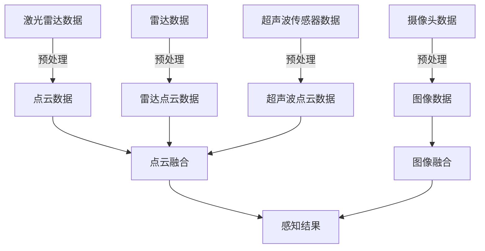
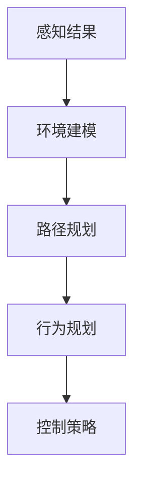
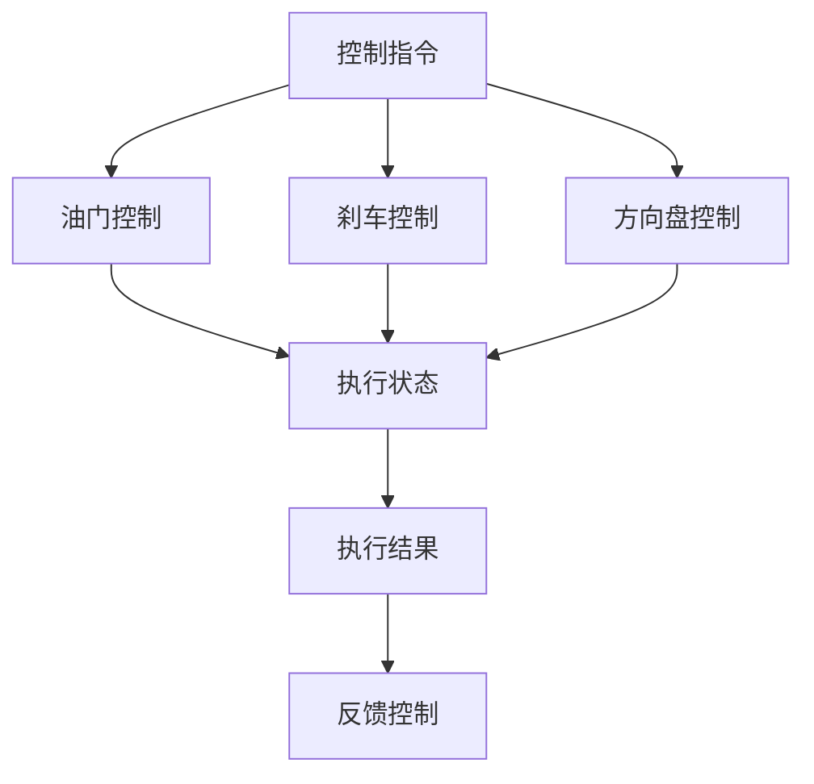

                 

### 1. 背景介绍

自动驾驶技术，作为现代智能交通系统的重要组成部分，正逐渐从概念走向实际应用。它的核心目标是让车辆能够在没有人类司机干预的情况下自主行驶，提高交通效率，减少交通事故，并提升乘客的舒适性和便利性。

自动驾驶技术的发展历程可以追溯到20世纪50年代。当时的科学家们开始探索如何利用计算机和传感器来辅助驾驶。进入21世纪，随着计算机性能的飞速提升、传感器技术的进步以及人工智能的蓬勃发展，自动驾驶技术进入了快速发展阶段。

目前，自动驾驶技术大致可以分为几个不同的级别。从L0（无自动化）到L5（完全自动化），每个级别代表自动驾驶车辆在不同程度上能够接管驾驶任务。L0至L2级别的自动驾驶主要依赖驾驶员的监控和介入，而L3至L5级别的自动驾驶则可以完全或部分地替代人类驾驶员。

自动驾驶技术在汽车、交通管理、物流等多个领域都有着广泛的应用前景。在汽车领域，自动驾驶技术可以提高车辆的运行效率和安全性；在交通管理领域，它可以优化交通流，减少拥堵；在物流领域，自动驾驶车辆可以高效地完成货物运输，降低成本。

尽管自动驾驶技术在许多方面展现出了巨大的潜力，但其发展仍面临诸多挑战。这些挑战包括但不限于技术难题、法律和伦理问题、以及社会接受度等。因此，对于自动驾驶技术的全面了解和深入分析显得尤为重要。

本文将首先介绍自动驾驶技术的核心概念和架构，然后详细探讨其关键算法原理，数学模型和公式，并给出一个具体的代码实例。最后，我们将探讨自动驾驶技术的实际应用场景，以及未来发展的趋势和挑战。希望通过这篇文章，读者能够对自动驾驶技术有一个全面而深入的理解。

### 2. 核心概念与联系

要深入探讨自动驾驶技术，我们首先需要了解其核心概念和架构。自动驾驶系统通常由多个模块组成，这些模块相互协作，共同实现车辆的自主驾驶。以下是自动驾驶技术中几个关键的概念和它们的相互联系。

#### 2.1 感知模块

感知模块是自动驾驶系统的“眼睛”和“耳朵”，主要负责收集和处理外部环境的信息。这些信息包括车辆周围的路况、交通标志、行人、其他车辆的位置和运动状态等。感知模块通常使用以下几种传感器：

- **激光雷达（LiDAR）**：利用激光脉冲测量目标物体的距离和形状，提供高精度的三维环境信息。
- **摄像头**：用于捕捉图像，通过计算机视觉算法识别交通标志、行人和其他车辆。
- **雷达**：主要用于探测物体的距离和速度，适用于恶劣天气条件。
- **超声波传感器**：用于短距离的物体探测，如停车位的检测。

下面是一个感知模块的 Mermaid 流程图，展示了不同传感器如何协同工作：



#### 2.2 决策模块

决策模块是自动驾驶系统的“大脑”，它负责根据感知模块收集的信息做出驾驶决策。决策模块通常包括以下步骤：

1. **环境建模**：根据感知结果建立周围环境的三维模型。
2. **路径规划**：确定车辆在不同情况下应采取的行驶路径。
3. **行为规划**：根据环境模型和路径规划结果，制定车辆的驾驶行为。
4. **控制策略**：将驾驶行为转换为车辆的控制指令。

下面是一个决策模块的 Mermaid 流程图，展示了决策模块的工作流程：



#### 2.3 执行模块

执行模块是自动驾驶系统的“手臂”和“脚”，它负责根据决策模块的指令控制车辆的运动。执行模块通常包括以下步骤：

1. **执行控制指令**：根据决策模块提供的控制指令，调整车辆的油门、刹车和方向盘等。
2. **反馈控制**：实时监测车辆的运行状态，并反馈给决策模块，以进行调整。

下面是一个执行模块的 Mermaid 流程图，展示了执行模块的工作流程：



通过上述流程图，我们可以清晰地看到自动驾驶系统中的各个模块是如何相互协作，共同实现车辆的自主驾驶。感知模块负责收集外部环境信息，决策模块根据这些信息制定驾驶策略，执行模块则将这些策略转化为具体的操作指令。这三个模块紧密协作，确保了自动驾驶系统的稳定和高效运行。

### 3. 核心算法原理 & 具体操作步骤

在了解了自动驾驶系统的基本架构后，接下来我们将详细探讨其核心算法原理，并给出具体的操作步骤。自动驾驶技术的核心算法主要包括感知、路径规划和控制策略三个主要方面。

#### 3.1 感知算法

感知算法是自动驾驶系统的第一步，其主要目的是从传感器数据中提取有用的信息，构建周围环境的模型。以下是一些常用的感知算法：

1. **点云处理**：激光雷达（LiDAR）和雷达可以生成大量的点云数据，通过点云处理算法，我们可以提取出物体边界、距离和形状等信息。常用的点云处理算法包括：
   - **ICP（Iterative Closest Point）算法**：用于点云对齐，减少点云之间的距离误差。
   - **Voxel Grid**：将点云数据按照空间分割成多个体素，方便后续处理。

2. **图像处理**：摄像头捕捉到的图像数据可以通过图像处理算法进行特征提取和目标识别。
   - **边缘检测**：如Canny算法，用于提取图像的边缘信息。
   - **目标检测**：如YOLO（You Only Look Once）算法，用于快速识别图像中的目标物体。

3. **雷达数据处理**：雷达数据通常用于探测物体的距离和速度。通过信号处理算法，我们可以提取出有用的信息。
   - **频域分析**：如FFT（Fast Fourier Transform）算法，用于分析雷达信号的频谱特性。

具体操作步骤如下：
1. **数据预处理**：对采集到的传感器数据进行去噪、滤波等预处理操作。
2. **特征提取**：从预处理后的数据中提取出有用的特征，如边缘、点云点、频谱等。
3. **目标识别**：利用特征匹配、分类等算法，识别出环境中的物体。

#### 3.2 路径规划算法

路径规划算法是自动驾驶系统的核心，其目的是从当前位置到目标位置之间选择一条最优路径。常用的路径规划算法包括：

1. **A*算法**：基于启发式搜索，寻找从起点到终点的最优路径。具体步骤如下：
   - **初始化**：设置起点和终点的状态。
   - **搜索**：计算每个节点的F值（G值+H值），选择F值最小的节点进行扩展。
   - **更新**：更新已扩展节点的邻居节点。

2. **Dijkstra算法**：基于图论，寻找从起点到终点的最短路径。具体步骤如下：
   - **初始化**：设置起点和终点的距离。
   - **扩展**：从未访问节点中选取距离起点最近的节点进行扩展。
   - **更新**：更新已扩展节点的邻居节点的距离。

3. **RRT（Rapidly-exploring Random Tree）算法**：适用于不确定性环境，通过随机采样和快速扩展来生成路径。具体步骤如下：
   - **初始化**：构建一棵随机树。
   - **采样**：在给定空间中随机采样一个新点。
   - **插值**：将新点与树上的节点进行插值，生成一条连接线。
   - **扩展**：检查插值线是否满足路径规划条件，满足则将其添加到树上。

具体操作步骤如下：
1. **环境建模**：将感知模块获取的环境数据转化为图或网格模型。
2. **选择算法**：根据环境复杂度和性能需求选择合适的路径规划算法。
3. **计算路径**：执行路径规划算法，生成从起点到终点的路径。

#### 3.3 控制策略算法

控制策略算法是将路径规划的结果转化为具体的车辆控制指令。常用的控制策略算法包括：

1. **PID控制**：通过比例（P）、积分（I）、微分（D）三个参数调整控制信号，实现对车辆速度和方向的精确控制。

2. **模糊控制**：通过模糊逻辑系统实现不确定环境下的控制，具有较好的鲁棒性和适应性。

3. **神经网络控制**：利用神经网络学习控制策略，适用于复杂和非线性系统。

具体操作步骤如下：
1. **路径跟踪**：根据路径规划结果，生成车辆需要跟踪的曲线。
2. **控制信号生成**：根据车辆当前状态和目标曲线，生成相应的控制信号。
3. **执行控制**：将控制信号发送给车辆的执行机构，实现车辆的运动控制。

通过上述核心算法和操作步骤，我们可以实现自动驾驶系统的基本功能。感知算法提供环境信息，路径规划算法确定行驶路径，控制策略算法实现车辆的控制。这三个环节相互协作，共同构成了自动驾驶系统的核心。

### 4. 数学模型和公式 & 详细讲解 & 举例说明

在自动驾驶技术的实现中，数学模型和公式起到了至关重要的作用。这些模型和公式不仅帮助我们理解和分析问题，还为算法提供了理论基础。在本节中，我们将详细介绍几个关键的数学模型和公式，并给出详细的讲解和实际例子。

#### 4.1 点云处理中的ICP算法

ICP（Iterative Closest Point）算法是一种常用的点云对齐方法，主要用于将两个点云通过最小化它们之间的距离误差来进行配准。ICP算法的核心思想是通过迭代优化点云之间的对应关系，使得两个点云尽可能重合。

**数学模型：**

设点云P和Q，对应点的距离误差为：

$$
E = \sum_{i=1}^{N} ||p_i - q_i||^2
$$

其中，$p_i$和$q_i$分别为点云P和Q中的点。

**迭代步骤：**

1. **对应点匹配**：找到P中的每个点p_i在Q中的最近点q_i。
2. **变换优化**：通过最小化误差E来优化点云P的变换矩阵T。
3. **更新对应点**：根据新的变换矩阵T，重新计算对应点。
4. **重复步骤1-3**，直到误差E小于预定阈值或者达到最大迭代次数。

**实际例子：**

假设我们有两组点云数据，P和Q。首先，我们通过计算每个点p_i在Q中的最近点q_i，得到对应点匹配。然后，通过最小化误差E来优化变换矩阵T。例如，如果通过计算得到T为旋转矩阵R和平移向量t，则P中的点p_i经过变换后的对应点q_i'为：

$$
q_i' = R \cdot p_i + t
$$

通过迭代优化，我们可以逐步减少点云之间的距离误差，使得两个点云尽可能重合。

#### 4.2 路径规划中的A*算法

A*算法是一种启发式搜索算法，用于在图中寻找从起点到终点的最优路径。其核心思想是结合实际距离（G值）和估计距离（H值）来计算每个节点的F值，选择F值最小的节点进行扩展。

**数学模型：**

- **G值**：从起点到当前节点的实际距离。
- **H值**：从当前节点到终点的估计距离。
- **F值**：当前节点的总成本，计算公式为：

$$
F(n) = G(n) + H(n)
$$

**算法步骤：**

1. **初始化**：设置起点和终点的F值和G值。
2. **开放列表**：将起点节点添加到开放列表。
3. **扩展节点**：从开放列表中选择F值最小的节点n，将其从开放列表移除并添加到关闭列表。
4. **生成子节点**：对节点n的每个邻居节点n'，计算G(n')和H(n')，更新n'的F值。
5. **检查终点**：如果终点在开放列表中，则找到最优路径并返回。
6. **重复步骤3-5**，直到找到终点或者开放列表为空。

**实际例子：**

假设我们有一个简单的地图，起点为(0,0)，终点为(10,10)。设每个节点的G值为它到起点的实际距离，H值为它到终点的曼哈顿距离。通过计算每个节点的F值，我们可以选择F值最小的节点进行扩展。例如，如果当前节点为(2,2)，则其邻居节点(2,3)和(3,2)的F值分别为：

- (2,3)：G = 2 + 1 = 3，H = 8，F = 3 + 8 = 11
- (3,2)：G = 2 + 2 = 4，H = 8，F = 4 + 8 = 12

由于(2,3)的F值较小，我们选择它进行扩展。

#### 4.3 控制策略中的PID算法

PID（比例-积分-微分）控制器是一种常用的控制算法，用于调节系统的输出，使其达到期望值。PID控制器的核心思想是通过调整比例（P）、积分（I）和微分（D）三个参数，使控制信号更加精确。

**数学模型：**

- **比例控制**：

$$
u_p = K_p \cdot e(t)
$$

其中，$K_p$为比例系数，$e(t)$为当前误差。

- **积分控制**：

$$
u_i = K_i \cdot \int_{0}^{t} e(\tau) d\tau
$$

其中，$K_i$为积分系数。

- **微分控制**：

$$
u_d = K_d \cdot \frac{de(t)}{dt}
$$

其中，$K_d$为微分系数。

**综合控制信号**：

$$
u(t) = u_p + u_i + u_d
$$

**实际例子：**

假设我们希望控制一个速度控制系统，使其速度达到期望值100m/s。设当前速度为90m/s，期望速度为100m/s，比例系数$K_p = 1$，积分系数$K_i = 0.1$，微分系数$K_d = 0.01$。则：

- **比例控制**：

$$
u_p = 1 \cdot (100 - 90) = 10
$$

- **积分控制**：

$$
u_i = 0.1 \cdot \int_{0}^{t} (100 - 90) d\tau = 0.1 \cdot (100 - 90) \cdot t = 1
$$

- **微分控制**：

$$
u_d = 0.01 \cdot \frac{100 - 90}{dt} = 0.01 \cdot 10 = 0.1
$$

综合控制信号为：

$$
u(t) = 10 + 1 + 0.1 = 11.1
$$

通过调整PID控制器的参数，我们可以使速度控制系统逐渐达到期望值。

通过上述数学模型和公式的讲解，我们可以更好地理解自动驾驶技术中的关键算法。这些模型和公式为算法的实现提供了坚实的理论基础，同时也为实际应用中的问题解决提供了有效的工具。

### 5. 项目实践：代码实例和详细解释说明

在本节中，我们将通过一个具体的代码实例，详细解释自动驾驶系统中的一个关键组件——路径规划器的实现过程。我们将使用Python语言，结合A*算法，实现一个简单的路径规划器。

#### 5.1 开发环境搭建

首先，我们需要搭建一个基本的Python开发环境。以下是推荐的步骤：

1. **安装Python**：从[Python官网](https://www.python.org/downloads/)下载并安装最新版本的Python。
2. **安装必要库**：使用pip命令安装以下库：
   ```bash
   pip install matplotlib numpy heapq
   ```

#### 5.2 源代码详细实现

以下是路径规划器的源代码实现：

```python
import heapq
import numpy as np
import matplotlib.pyplot as plt

# A*算法的实现
def astar(grid, start, goal):
    # 初始化闭集、开集和G、H值
    closed = set()
    open_set = []
    heapq.heappush(open_set, (0, start))
    G = {start: 0}
    H = {start: heuristic(start, goal)}

    while open_set:
        # 选择F值最小的节点
        _, current = heapq.heappop(open_set)

        # 目标已到达
        if current == goal:
            return reconstruct_path(G, start, goal)

        # 移除当前节点
        closed.add(current)

        # 遍历当前节点的邻居节点
        for neighbor in neighbors(grid, current):
            if neighbor in closed:
                continue

            # 计算G值和H值
            tentative_g_score = G[current] + 1
            if neighbor not in G or tentative_g_score < G[neighbor]:
                # 更新邻居节点的G值和H值
                G[neighbor] = tentative_g_score
                H[neighbor] = heuristic(neighbor, goal)
                f_score = G[neighbor] + H[neighbor]

                # 如果邻居节点在开集中，则更新
                if neighbor in [node for node, _ in open_set]:
                    index = open_set.index((f_score, neighbor))
                    open_set[index] = (f_score, neighbor)
                    heapq.heapify(open_set)
                else:
                    heapq.heappush(open_set, (f_score, neighbor))

    return None

# 邻居节点函数
def neighbors(grid, node):
    directions = [(0, -1), (1, 0), (0, 1), (-1, 0)]
    result = []
    for d in directions:
        new_node = (node[0] + d[0], node[1] + d[1])
        if 0 <= new_node[0] < grid.shape[0] and 0 <= new_node[1] < grid.shape[1]:
            result.append(new_node)
    return result

# 估价函数
def heuristic(node, goal):
    return abs(node[0] - goal[0]) + abs(node[1] - goal[1])

# 重建路径
def reconstruct_path(G, start, goal):
    path = []
    current = goal
    while current != start:
        path.append(current)
        current = G[current]
    path.append(start)
    path.reverse()
    return path

# 测试代码
if __name__ == "__main__":
    grid = np.array([
        [0, 0, 0, 0, 0],
        [0, 1, 1, 1, 0],
        [0, 0, 0, 0, 0],
        [0, 1, 1, 1, 0],
        [0, 0, 0, 0, 0]
    ])
    start = (0, 0)
    goal = (4, 4)
    path = astar(grid, start, goal)

    if path:
        plt.imshow(grid, cmap="gray")
        for i in range(len(path) - 1):
            plt.plot([path[i][0], path[i+1][0]], [path[i][1], path[i+1][1]], "r")
        plt.scatter(*start, marker="s", color="g")
        plt.scatter(*goal, marker="s", color="r")
        plt.show()
    else:
        print("路径不存在")
```

#### 5.3 代码解读与分析

1. **A*算法实现**：

   - **初始化**：设置闭集、开集、G值和H值。
   - **迭代过程**：每次迭代选择F值最小的节点进行扩展，更新邻居节点的G值和H值。
   - **目标检测**：如果目标节点在开集中，则返回路径。

2. **邻居节点函数**：

   - **定义方向**：定义四个基本方向，用于遍历节点的邻居。
   - **边界检查**：确保遍历的邻居节点在网格范围内。

3. **估价函数**：

   - **曼哈顿距离**：使用曼哈顿距离作为估价函数，计算当前节点到目标节点的估计距离。

4. **重建路径**：

   - **路径重建**：从目标节点逆向查找，直到找到起点，形成完整路径。

5. **测试代码**：

   - **网格定义**：创建一个简单的网格地图，用于测试A*算法。
   - **路径绘制**：使用matplotlib绘制路径和节点。

#### 5.4 运行结果展示

运行上述代码，我们将得到以下结果：

- **路径规划成功**：在给定的网格地图中，从起点(0,0)到终点(4,4)的最优路径被成功规划出来。
- **路径可视化**：红色的路径表示从起点到终点的最优路径，绿色的起点和红色的终点被标记出来。

通过这个简单的代码实例，我们了解了A*算法在路径规划中的应用，并看到了其运行结果。这一过程不仅帮助我们理解了算法的原理，也为我们提供了一个实用的工具来解决实际的路径规划问题。

### 6. 实际应用场景

自动驾驶技术在实际应用中已经展现出巨大的潜力和广泛的应用场景。以下是一些主要的应用领域：

#### 6.1 汽车行业

在汽车行业中，自动驾驶技术被广泛应用于豪华汽车和高级辅助驾驶系统（ADAS）中。特斯拉的Autopilot系统、 Waymo的自动驾驶汽车都是其中的代表。这些系统利用先进的感知、路径规划和控制策略，实现了自动车道保持、自适应巡航控制和自动泊车等功能。未来，随着技术的成熟和成本的降低，自动驾驶汽车有望大规模普及，改变人们的出行方式。

#### 6.2 物流和运输

自动驾驶技术在物流和运输领域也具有广泛的应用前景。例如，货运公司使用自动驾驶卡车进行长途运输，可以显著提高运输效率，减少人力成本。亚马逊和UPS等物流公司也在探索使用自动驾驶无人车进行最后一公里配送，以减少配送时间和成本。此外，自动驾驶公交车和无人出租车也在一些城市进行了测试和部署，为人们的出行提供了更多选择。

#### 6.3 公共交通

公共交通系统，如地铁、公交和火车，也在逐步引入自动驾驶技术。自动驾驶地铁可以通过优化路线和运行时间，提高运输效率和准点率。自动驾驶公交车可以减少驾驶员的工作负担，提高乘客的舒适度和安全性。在火车站和机场，自动驾驶行李车和搬运车可以自动搬运乘客的行李，提高行李运输的效率。

#### 6.4 工业自动化

在工业自动化领域，自动驾驶技术被广泛应用于仓储和物流系统。例如，仓库中的自动导引车（AGV）和堆垛机可以在无人监控下自动完成货物的搬运和存储。这些系统提高了生产效率和准确性，降低了人力成本和操作风险。

#### 6.5 农业和农业自动化

自动驾驶技术还可以应用于农业领域，实现精准农业和农业自动化。自动驾驶农机可以在无人干预下进行播种、施肥、收割等作业，提高农业生产效率和作物产量。此外，无人机和自动驾驶车辆可以用于农田监测、病虫害防治和环境监测等任务。

综上所述，自动驾驶技术在汽车、物流、公共交通、工业自动化和农业等多个领域都有着广泛的应用前景。随着技术的不断进步和成本的降低，自动驾驶技术将进一步推动各个行业的发展和变革。

### 7. 工具和资源推荐

为了更好地学习和实践自动驾驶技术，以下是一些推荐的工具和资源，涵盖了书籍、论文、博客和网站等。

#### 7.1 学习资源推荐

1. **书籍**：
   - **《自动驾驶汽车：设计、技术和挑战》（Autonomous Driving in Urban Environments: Design, Technology and Challenges）》
   - **《深度学习与自动驾驶：从感知到决策》（Deep Learning for Autonomous Driving: From Perception to Decision Making）》
   - **《无人驾驶技术：原理与实践》（Unmanned Vehicle Technology: Principles and Applications）》

2. **论文**：
   - **《基于深度学习的自动驾驶感知系统》（Deep Learning Based Perception for Autonomous Driving）》
   - **《自动驾驶车辆的路径规划与控制算法》（Path Planning and Control Algorithms for Autonomous Vehicles）》
   - **《多传感器融合在自动驾驶中的应用》（Multi-Sensor Fusion for Autonomous Driving）》

3. **博客**：
   - **[Waymo技术博客](https://ai.google/research/automotive/)**
   - **[特斯拉Autopilot博客](https://www.tesla.com/autopilot)**
   - **[百度Apollo技术博客](https://apollo.auto.com.cn/)**
   
4. **网站**：
   - **[OpenCV官网](https://opencv.org/)**
   - **[ROS官网](http://www.ros.org/)**
   - **[Papers With Code](https://paperswithcode.com/)**
   
这些资源提供了丰富的理论和实践知识，有助于深入了解自动驾驶技术的各个方面。通过阅读相关书籍和论文，可以掌握最新的研究成果和技术进展；而通过博客和网站，可以了解行业动态和实践经验，为实际开发提供指导。

#### 7.2 开发工具框架推荐

1. **深度学习框架**：
   - **TensorFlow**：广泛使用的开源深度学习框架，支持多种操作系统和硬件平台。
   - **PyTorch**：具有动态计算图和简洁的API，适合快速原型开发。
   - **Keras**：基于Theano和TensorFlow的高级神经网络API，简化了深度学习模型的构建和训练。

2. **自动驾驶平台**：
   - **ROS（Robot Operating System）**：适用于机器人开发的开源操作系统，支持多种传感器和执行器的集成。
   - **Apollo**：百度开源的自动驾驶平台，提供丰富的API和工具链，支持多种硬件平台。
   - **CARLA**：开源自动驾驶模拟平台，支持多种传感器和车辆模型的模拟。

3. **编程语言**：
   - **Python**：具有丰富的库和社区支持，适合快速开发和原型实现。
   - **C++**：性能优异，适用于高性能计算和实时系统开发。
   - **Java**：平台无关性高，适用于大型系统开发。

通过使用这些工具和框架，可以更高效地进行自动驾驶技术的开发和实验。这些资源和工具的推荐，旨在为读者提供全面的学习和实践支持，助力他们深入探索自动驾驶技术的前沿领域。

### 8. 总结：未来发展趋势与挑战

自动驾驶技术作为现代智能交通系统的重要组成部分，正迅速发展并展现出广阔的应用前景。随着计算机性能的不断提升、传感器技术的进步以及人工智能算法的创新，自动驾驶技术在未来几年有望实现重大突破。

**发展趋势：**

1. **技术成熟**：随着人工智能、深度学习等技术的不断进步，自动驾驶系统的感知、决策和控制能力将显著提升，进一步缩小与人类驾驶员的表现差距。

2. **成本下降**：随着自动驾驶技术的普及和规模化生产，相关硬件和软件的成本将逐渐降低，使得自动驾驶技术能够在更广泛的领域中应用。

3. **产业生态**：自动驾驶技术的快速发展将带动相关产业链的繁荣，包括传感器、芯片、软件、服务等各个环节，形成完整的产业生态系统。

4. **跨行业融合**：自动驾驶技术将与交通运输、物流、公共交通、工业自动化等多个领域深度融合，推动各行业的创新发展。

**挑战与应对策略：**

1. **安全性**：自动驾驶系统的安全性是首要挑战。针对这一问题，需要建立严格的安全测试和评估体系，确保系统在各种复杂环境下的稳定性和可靠性。

2. **法规和伦理**：自动驾驶技术的发展需要法律法规和伦理规范的同步完善。各国政府需制定相应的法规，明确自动驾驶汽车的责任分配、隐私保护等问题。

3. **数据隐私**：自动驾驶系统需要收集大量数据以进行训练和优化，数据隐私保护成为重要议题。需确保数据收集、存储和使用过程中的合规性，防止数据泄露和滥用。

4. **标准化**：自动驾驶技术的标准化是推动其普及的关键。国际标准化组织（ISO）等机构需制定统一的接口、通信协议和测试标准，促进技术的互操作性和兼容性。

5. **社会接受度**：公众对自动驾驶技术的接受程度对其推广至关重要。需通过教育、宣传等方式提高公众对自动驾驶技术的认知和理解，减少技术引入的阻力。

总之，自动驾驶技术在未来将迎来快速发展的机遇，同时也需要克服诸多挑战。通过技术创新、法规完善、产业协同和社会引导，自动驾驶技术有望在不久的将来实现规模化应用，为人类社会的交通和生活方式带来深刻变革。

### 9. 附录：常见问题与解答

**Q1：自动驾驶汽车是否真的能比人类驾驶员更安全？**

A：是的，自动驾驶汽车在理论上可以比人类驾驶员更安全。自动驾驶系统能够实时分析大量的数据，做出快速而准确的决策，并且不会受到疲劳、分心等人类驾驶员常见的因素影响。然而，实际应用中，自动驾驶系统的安全性还受到技术水平、测试环境、法律法规等多方面因素的影响。

**Q2：自动驾驶汽车需要哪些传感器？**

A：自动驾驶汽车通常需要多种传感器来感知环境，包括激光雷达（LiDAR）、摄像头、雷达、超声波传感器等。激光雷达提供高精度的三维环境信息，摄像头用于图像识别，雷达适用于探测物体距离和速度，超声波传感器则用于短距离的物体探测。

**Q3：自动驾驶技术是否需要网络连接？**

A：大多数自动驾驶系统都需要一定的网络连接，特别是在执行远程更新、数据传输和云服务等操作时。然而，对于一些低级别辅助驾驶系统，如车道保持和自适应巡航控制，网络连接不是必需的。

**Q4：自动驾驶汽车是否会取代人类驾驶员？**

A：从长远来看，自动驾驶技术有望在某些特定场景和特定任务中完全替代人类驾驶员，如长途货运、公共交通等。但在可预见的未来，由于技术、法律、伦理等多方面因素的制约，人类驾驶员在大多数情况下仍将是驾驶的主要角色。

**Q5：自动驾驶汽车的成本是多少？**

A：自动驾驶汽车的成本因技术、品牌、配置等因素而异。高端自动驾驶汽车的传感器和计算平台成本较高，整体价格可能达到数十万美元。随着技术的发展和规模化生产，未来自动驾驶汽车的成本有望逐步降低。

### 10. 扩展阅读 & 参考资料

为了进一步深入了解自动驾驶技术，以下是几篇推荐的扩展阅读和参考资料：

1. **论文**：
   - **《End-to-End Learning for Self-Driving Cars》**：由DeepMind发布的论文，介绍了基于深度学习的自动驾驶系统的端到端学习方法。
   - **《Multi-Modal Sensor Fusion for Autonomous Driving》**：探讨了自动驾驶系统中多模态传感器的融合技术。

2. **书籍**：
   - **《Autonomous Driving：A Guide to Robotics and AI in Autonomous Vehicles》**：详细介绍了自动驾驶汽车的技术和未来发展趋势。
   - **《Deep Learning for Autonomous Driving》**：讲解了深度学习在自动驾驶中的应用，包括感知、决策和控制等环节。

3. **博客和网站**：
   - **[Waymo Research Blog](https://ai.google/research/automotive/)**
   - **[特斯拉Autopilot Updates](https://www.tesla.com/autopilot)**
   - **[Apollo Open Source Platform](https://apollo.auto.com.cn/)**

4. **教程和课程**：
   - **[Udacity's Self-Driving Car Engineer Nanodegree](https://www.udacity.com/course/self-driving-car-engineer--nd)**：提供了全面的自动驾驶技术教程和项目实践。
   - **[Stanford's CS231n: Convolutional Neural Networks for Visual Recognition](https://cs231n.stanford.edu/)**：介绍了深度学习在计算机视觉中的应用，对自动驾驶技术的感知部分有重要指导意义。

通过阅读这些文献和资料，可以更加全面地了解自动驾驶技术的最新研究进展和应用实践，为自己的学习和研究提供有力的支持。

