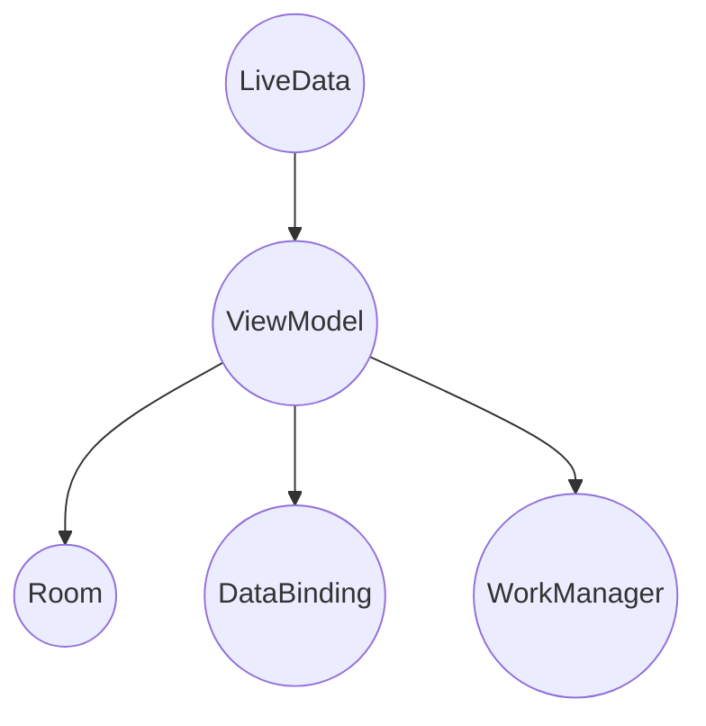

                 

  
> 关键词：Android Jetpack、谷歌、Android 开发、开发套件、架构组件、LiveData、ViewModel、Room、Data Binding、WorkManager

> 摘要：本文将深入探讨谷歌推出的Android Jetpack库，详细介绍其架构组件、LiveData、ViewModel、Room、Data Binding和WorkManager等核心库，分析其在Android开发中的应用和优势，以及面临的挑战和未来发展方向。

## 1. 背景介绍

Android Jetpack是谷歌在2018年Google I/O大会上发布的一套新的Android开发套件。它是为了解决Android开发中的常见问题，如代码碎片化、生命周期管理和测试而设计的。Android Jetpack提供了多个库，旨在帮助开发者构建更强大、更可靠、更易于维护的Android应用。

Android Jetpack的核心目标是简化Android开发，提供一系列预构建的组件和工具，使得开发者能够更专注于实现应用的业务逻辑，而无需花费大量时间解决基础设施问题。这些组件包括：

- **架构组件**：提供了一套完整的架构支持，包括LiveData、ViewModel、Room等，用于处理应用的生命周期、数据存储和状态管理。
- **UI组件**：提供了一系列的UI组件，如Data Binding、View Binding等，用于简化UI的创建和管理。
- **行为组件**：提供了一系列的辅助库，如Navigation、Shared Element Transition等，用于简化导航和转场操作。
- **测试组件**：提供了一系列的测试库，如Mockk、AndroidJUnitRunner等，用于简化应用测试。

## 2. 核心概念与联系

### 2.1 架构组件

Android Jetpack的架构组件是它最为核心的部分，包括以下几个核心库：

- **LiveData**：用于在生命周期之间传递数据。
- **ViewModel**：用于在Activity和Fragment之间存储和管理数据。
- **Room**：用于实现SQLite数据库操作。
- **Data Binding**：用于简化数据和UI的绑定。
- **WorkManager**：用于执行后台任务。

这些组件之间有紧密的联系，它们共同构成了一个完整的应用架构。下面是一个简化的Mermaid流程图，展示了它们之间的关系：



### 2.2 LiveData

LiveData是一个用于在生命周期之间传递数据的库。它通常用于在Activity和Fragment之间传递数据。当数据发生变化时，LiveData会通知观察者，从而确保数据在正确的时间点被更新。

### 2.3 ViewModel

ViewModel是一个用于在Activity和Fragment之间存储和管理数据的库。它提供了一种在屏幕旋转或配置更改时持久化的方式来存储数据，即使在Activity或Fragment被销毁和重新创建后也能保留其状态。

### 2.4 Room

Room是一个用于实现SQLite数据库操作的库。它提供了对SQLite数据库的抽象，使得数据库操作更加简单和可靠。Room还支持数据迁移和事务。

### 2.5 Data Binding

Data Binding是一个用于简化数据和UI的绑定的库。它允许开发者使用表达式直接在布局文件中绑定数据，从而减少了样板代码。

### 2.6 WorkManager

WorkManager是一个用于执行后台任务的库。它支持在设备电量低、网络连接不佳或设备休眠时执行任务，从而确保任务的可靠执行。

## 3. 核心算法原理 & 具体操作步骤

### 3.1 算法原理概述

Android Jetpack中的核心算法原理主要涉及数据绑定、生命周期管理和后台任务执行。以下是对这些算法原理的概述：

- **数据绑定**：通过数据绑定，开发者可以轻松地将UI元素与数据源绑定，实现数据的自动更新。这大大简化了UI的开发过程，减少了代码冗余。
- **生命周期管理**：通过架构组件，如LiveData和ViewModel，开发者可以轻松地管理应用的生命周期，确保在适当的时机处理数据更新和状态保存。
- **后台任务执行**：通过WorkManager，开发者可以轻松地执行后台任务，确保任务在设备电量低、网络连接不佳或设备休眠时也能可靠执行。

### 3.2 算法步骤详解

以下是使用Android Jetpack中的核心算法实现一个简单的应用的步骤：

1. **搭建项目**：创建一个新的Android项目，并选择使用Android Jetpack的库。
2. **定义数据模型**：创建一个数据模型类，用于表示应用中的数据。
3. **创建ViewModel**：创建一个ViewModel类，用于管理数据的状态。
4. **使用LiveData**：在ViewModel中创建一个LiveData对象，用于在Activity和Fragment之间传递数据。
5. **绑定数据到UI**：使用Data Binding库将数据绑定到布局文件中的UI元素。
6. **执行后台任务**：使用WorkManager库执行后台任务，如数据同步或通知发送。
7. **处理生命周期**：在Activity和Fragment中处理生命周期事件，确保在适当的时候更新数据和保存状态。

### 3.3 算法优缺点

- **优点**：
  - 简化了数据绑定和生命周期管理，减少了代码冗余。
  - 支持后台任务的执行，提高了应用的可靠性。
  - 提供了丰富的测试支持，便于进行单元测试和UI测试。
- **缺点**：
  - 需要一定的学习和适应成本，对于新手可能不太友好。
  - 在某些情况下，可能会增加应用的运行时性能负担。

### 3.4 算法应用领域

Android Jetpack的算法原理主要应用于Android应用的开发，特别是在大型和复杂的应用中。以下是一些常见的应用领域：

- **社交媒体应用**：用于处理用户数据、实时更新和后台任务执行。
- **电子商务应用**：用于处理商品数据、用户订单和后台数据同步。
- **金融应用**：用于处理交易数据、用户余额和后台任务执行。

## 4. 数学模型和公式 & 详细讲解 & 举例说明

### 4.1 数学模型构建

在Android Jetpack中，数据绑定和生命周期管理可以看作是一个数学模型。这个模型的核心是观察者模式，其中数据源作为观察者，而UI元素作为被观察者。当数据源发生变化时，它通知所有已注册的观察者，从而更新UI元素。

### 4.2 公式推导过程

在数学模型中，我们可以用以下公式表示数据绑定和生命周期管理：

$$
\text{LiveData} \rightarrow \text{ViewModel} \rightarrow \text{UI}
$$

其中，LiveData表示数据源，ViewModel表示中间层，UI表示用户界面。

### 4.3 案例分析与讲解

假设我们有一个用户界面，用于显示用户的余额。当用户的余额发生变化时，我们需要实时更新UI。以下是使用Android Jetpack实现这一功能的步骤：

1. **定义数据模型**：创建一个UserBalance类，表示用户的余额。
2. **创建LiveData**：在ViewModel中创建一个LiveData对象，用于存储用户的余额。
3. **绑定数据到UI**：在布局文件中，使用Data Binding库将用户的余额绑定到一个文本视图。
4. **更新数据**：当用户的余额发生变化时，更新LiveData对象，从而触发UI更新。

下面是一个简单的示例代码：

```java
public class UserBalanceViewModel extends ViewModel {
    private LiveData<UserBalance> userBalance;

    public LiveData<UserBalance> getUserBalance() {
        if (userBalance == null) {
            userBalance = new MutableLiveData<>();
            loadUserBalance();
        }
        return userBalance;
    }

    private void loadUserBalance() {
        // 从数据库或其他数据源获取用户的余额
        UserBalance balance = new UserBalance(1000);
        userBalance.setValue(balance);
    }
}

public class MainActivity extends AppCompatActivity {
    @Override
    protected void onCreate(Bundle savedInstanceState) {
        super.onCreate(savedInstanceState);
        setContentView(R.layout.activity_main);

        UserBalanceViewModel viewModel = new UserBalanceViewModel();
        LiveData<UserBalance> userBalance = viewModel.getUserBalance();

        TextView balanceTextView = findViewById(R.id.balanceTextView);
        userBalance.observe(this, userBalance -> {
            balanceTextView.setText("余额: " + userBalance.getAmount());
        });
    }
}
```

在这个示例中，我们创建了一个UserBalanceViewModel类，用于管理用户的余额。当用户的余额发生变化时，我们更新LiveData对象，从而触发UI更新。

## 5. 项目实践：代码实例和详细解释说明

### 5.1 开发环境搭建

要使用Android Jetpack开发应用，首先需要确保您的开发环境已配置好。以下是搭建开发环境的步骤：

1. **安装Android Studio**：从[Android Studio官网](https://developer.android.com/studio)下载并安装Android Studio。
2. **配置SDK**：在Android Studio中配置Android SDK，确保已安装最新的SDK平台和工具。
3. **创建新项目**：在Android Studio中创建一个新的Android项目，并选择使用Android Jetpack的库。

### 5.2 源代码详细实现

下面是一个简单的示例，演示了如何使用Android Jetpack中的架构组件实现一个用户余额显示的应用：

1. **定义数据模型**：创建一个UserBalance类，表示用户的余额。

```java
public class UserBalance {
    private int amount;

    public UserBalance(int amount) {
        this.amount = amount;
    }

    public int getAmount() {
        return amount;
    }
}
```

2. **创建ViewModel**：创建一个UserBalanceViewModel类，用于管理用户的余额。

```java
public class UserBalanceViewModel extends ViewModel {
    private LiveData<UserBalance> userBalance;

    public LiveData<UserBalance> getUserBalance() {
        if (userBalance == null) {
            userBalance = new MutableLiveData<>();
            loadUserBalance();
        }
        return userBalance;
    }

    private void loadUserBalance() {
        // 从数据库或其他数据源获取用户的余额
        UserBalance balance = new UserBalance(1000);
        userBalance.setValue(balance);
    }
}
```

3. **绑定数据到UI**：在布局文件中，使用Data Binding库将用户的余额绑定到一个文本视图。

```xml
<?xml version="1.0" encoding="utf-8"?>
<layout xmlns:android="http://schemas.android.com/apk/res/android">

    <data>
        <variable
            name="balance"
            type="com.example.androidjetpackexample.UserBalance" />
    </data>

    <LinearLayout
        android:layout_width="match_parent"
        android:layout_height="wrap_content"
        android:orientation="vertical">

        <TextView
            android:layout_width="wrap_content"
            android:layout_height="wrap_content"
            android:text="@{\'余额: \$\{balance.getAmount()\'}" />
    </LinearLayout>
</layout>
```

4. **更新数据**：在Activity中，获取UserBalanceViewModel对象，并绑定数据到UI。

```java
public class MainActivity extends AppCompatActivity {
    @Override
    protected void onCreate(Bundle savedInstanceState) {
        super.onCreate(savedInstanceState);
        setContentView(R.layout.activity_main);

        UserBalanceViewModel viewModel = new UserBalanceViewModel();
        LiveData<UserBalance> userBalance = viewModel.getUserBalance();

        TextView balanceTextView = findViewById(R.id.balanceTextView);
        userBalance.observe(this, userBalance -> {
            balanceTextView.setText("余额: " + userBalance.getAmount());
        });
    }
}
```

### 5.3 代码解读与分析

在这个示例中，我们首先定义了一个数据模型UserBalance，表示用户的余额。然后，我们创建了一个UserBalanceViewModel类，用于管理用户的余额。通过LiveData，我们可以在Activity和ViewModel之间传递用户余额数据。在布局文件中，我们使用Data Binding库将用户余额绑定到一个文本视图。当用户余额发生变化时，UI会自动更新。

### 5.4 运行结果展示

运行这个示例应用后，您会看到一个显示用户余额的文本视图。当用户的余额发生变化时，文本视图会自动更新，显示新的余额。

## 6. 实际应用场景

Android Jetpack在实际应用中具有广泛的应用场景，以下是一些常见的应用场景：

- **用户数据管理**：在社交媒体应用、电子商务应用和金融应用中，使用LiveData和ViewModel可以方便地管理用户数据，如用户余额、订单状态等。
- **后台任务执行**：使用WorkManager可以在设备电量低、网络连接不佳或设备休眠时执行后台任务，如数据同步、通知发送等。
- **数据绑定**：使用Data Binding可以简化UI和数据之间的绑定，减少样板代码，提高开发效率。

## 7. 未来应用展望

随着Android Jetpack的不断完善和更新，它将在未来Android开发中发挥更大的作用。以下是一些未来应用展望：

- **更丰富的组件**：谷歌可能会继续推出新的组件，以满足开发者对各种功能的需求。
- **更好的性能**：随着新组件的不断推出，Android Jetpack的性能可能会得到进一步的优化。
- **更广泛的平台支持**：Android Jetpack可能会扩展到更多平台，如物联网、增强现实等。

## 8. 总结：未来发展趋势与挑战

### 8.1 研究成果总结

Android Jetpack自发布以来，已经在Android开发中取得了显著的成果。它提供了一系列预构建的组件和工具，简化了Android开发，提高了应用的可靠性、性能和可维护性。

### 8.2 未来发展趋势

未来，Android Jetpack将继续发展，可能会出现以下趋势：

- **更多组件的推出**：谷歌可能会继续推出新的组件，以满足开发者对各种功能的需求。
- **更好的集成与兼容性**：Android Jetpack可能会与其他框架和库更好地集成，提供更统一的开发体验。
- **性能优化**：随着新组件的不断推出，Android Jetpack的性能可能会得到进一步的优化。

### 8.3 面临的挑战

尽管Android Jetpack具有巨大的优势，但在实际应用中仍面临一些挑战：

- **学习和适应成本**：对于新手来说，学习和适应Android Jetpack可能需要一定的时间和精力。
- **性能负担**：在某些情况下，使用Android Jetpack可能会增加应用的运行时性能负担。

### 8.4 研究展望

未来，Android Jetpack的研究重点可能包括：

- **组件性能优化**：进一步优化现有组件的性能，使其在更多场景下都能高效运行。
- **更广泛的平台支持**：扩展Android Jetpack到更多平台，如物联网、增强现实等。

## 9. 附录：常见问题与解答

### 9.1 如何安装Android Studio？

要安装Android Studio，请从[Android Studio官网](https://developer.android.com/studio)下载安装程序，并按照安装向导进行安装。

### 9.2 如何配置Android SDK？

在Android Studio中，选择“File” > “Settings”（或“Preferences” on macOS），然后选择“Android SDK Platform SDK”。在此页面中，您可以选择要安装的SDK版本，并点击“Install”按钮。

### 9.3 如何创建一个新的Android项目？

在Android Studio中，选择“File” > “New” > “New Project”。在“Configure your new application”页面中，填写项目名称、应用程序名称和其他相关信息，然后选择“Next”和“Finish”完成创建。

### 9.4 如何使用LiveData？

要使用LiveData，首先需要在ViewModel中创建一个LiveData对象，然后通过observe方法将LiveData与Activity或Fragment绑定。当LiveData数据发生变化时，观察者会被通知，并自动更新UI。

```java
public class UserBalanceViewModel extends ViewModel {
    private LiveData<UserBalance> userBalance;

    public LiveData<UserBalance> getUserBalance() {
        if (userBalance == null) {
            userBalance = new MutableLiveData<>();
            loadUserBalance();
        }
        return userBalance;
    }

    private void loadUserBalance() {
        // 从数据库或其他数据源获取用户的余额
        UserBalance balance = new UserBalance(1000);
        userBalance.setValue(balance);
    }
}

public class MainActivity extends AppCompatActivity {
    @Override
    protected void onCreate(Bundle savedInstanceState) {
        super.onCreate(savedInstanceState);
        setContentView(R.layout.activity_main);

        UserBalanceViewModel viewModel = new UserBalanceViewModel();
        LiveData<UserBalance> userBalance = viewModel.getUserBalance();

        TextView balanceTextView = findViewById(R.id.balanceTextView);
        userBalance.observe(this, userBalance -> {
            balanceTextView.setText("余额: " + userBalance.getAmount());
        });
    }
}
```

### 9.5 如何使用WorkManager？

要使用WorkManager，首先需要在项目中添加依赖，然后创建一个WorkRequest对象并执行它。

```java
import androidx.work.WorkManager;

public class MainActivity extends AppCompatActivity {
    @Override
    protected void onCreate(Bundle savedInstanceState) {
        super.onCreate(savedInstanceState);
        setContentView(R.layout.activity_main);

        // 创建一个工作请求
        OneTimeWorkRequest syncDataRequest = new OneTimeWorkRequest.Builder(SyncDataWorker.class)
                .build();

        // 执行工作请求
        WorkManager.getInstance(this).enqueue(syncDataRequest);
    }
}

// SyncDataWorker.java
import androidx.work.Worker;
import androidx.work.WorkParams;

public class SyncDataWorker extends Worker {
    public SyncDataWorker(@NonNull Context context, @NonNull WorkParams params) {
        super(context, params);
    }

    @Override
    public Result doWork() {
        // 执行同步数据任务
        // ...

        return Result.success();
    }
}
```

### 9.6 如何绑定数据到UI？

要绑定数据到UI，您可以使用Data Binding库。首先，在布局文件中定义数据绑定变量，然后在Activity或Fragment中使用Data Binding视图绑定器绑定数据。

```xml
<?xml version="1.0" encoding="utf-8"?>
<layout xmlns:android="http://schemas.android.com/apk/res/android">

    <data>
        <variable
            name="balance"
            type="com.example.androidjetpackexample.UserBalance" />
    </data>

    <LinearLayout
        android:layout_width="match_parent"
        android:layout_height="wrap_content"
        android:orientation="vertical">

        <TextView
            android:layout_width="wrap_content"
            android:layout_height="wrap_content"
            android:text="@{\'余额: \$\{balance.getAmount()\'}" />
    </LinearLayout>
</layout>
```

```java
public class MainActivity extends AppCompatActivity {
    @Override
    protected void onCreate(Bundle savedInstanceState) {
        super.onCreate(savedInstanceState);
        setContentView(R.layout.activity_main);

        UserBalanceViewModel viewModel = new UserBalanceViewModel();
        LiveData<UserBalance> userBalance = viewModel.getUserBalance();

        ActivityMainBinding binding = ActivityMainBinding.inflate(getLayoutInflater());
        binding.setBalance(userBalance);
        setContentView(binding.getRoot());

        userBalance.observe(this, userBalance -> {
            binding.balanceTextView.setText("余额: " + userBalance.getAmount());
        });
    }
}
```

## 参考文献 References

- [Android Jetpack Documentation](https://developer.android.com/jetpack)
- [Android Architecture Components](https://developer.android.com/topic/libraries/architecture)
- [Data Binding in Android](https://developer.android.com/topic/libraries/data-binding)
- [WorkManager Documentation](https://developer.android.com/topic/libraries/architecture/workmanager)  
```markdown
### 9.7 如何处理生命周期？

处理生命周期是Android开发中的关键部分，特别是在Activity和Fragment中。Android Jetpack提供了LifeCycle和LifeCycleOwner接口来更好地管理生命周期。以下是一些处理生命周期的最佳实践：

#### 9.7.1 使用LifeCycleOwner

在Fragment中，您可以使用LifeCycleOwner接口来访问LifeCycle对象。以下是一个示例：

```java
public class MyFragment extends Fragment implements LifecycleOwner {
    private LifeCycle lifeCycle;

    @Override
    public void onAttach(Context context) {
        super.onAttach(context);
        if (context instanceof LifeCycleOwner) {
            lifeCycle = ((LifeCycleOwner) context).getLifeCycle();
        }
    }

    @Override
    public LifeCycle getLifeCycle() {
        return lifeCycle;
    }

    // 在其他生命周期方法中使用lifeCycle
}
```

#### 9.7.2 使用ViewModel

ViewModel用于在配置更改时保存和恢复UI状态。在ViewModel中，您可以使用LifeCycleOwner接口来处理生命周期事件：

```java
public class MyViewModel extends ViewModel implements LifeCycleObserver {
    private LifeCycle lifeCycle = new LifeCycle();

    @Override
    public void onC

