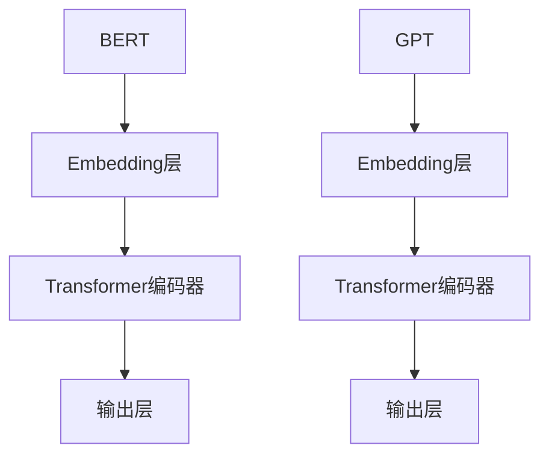

                 

## 文章标题：BERT vs GPT：双向vs单向语言模型

> 关键词：BERT, GPT, 双向语言模型, 单向语言模型, 自然语言处理, 机器学习

> 摘要：本文将深入探讨BERT（双向编码器表示）和GPT（生成预训练变压器）这两种著名语言模型的区别与联系。我们将从背景介绍、核心概念、算法原理、数学模型、项目实践、应用场景、资源推荐等多个角度进行详细分析，帮助读者全面了解这两种语言模型的优势和局限性，以及未来发展趋势与挑战。

## 1. 背景介绍

随着深度学习技术的不断发展，自然语言处理（NLP）领域取得了令人瞩目的成果。BERT和GPT作为两种最具代表性的双向和单向语言模型，对NLP任务产生了深远的影响。BERT（Bidirectional Encoder Representations from Transformers）由Google Research在2018年提出，是一种基于Transformer架构的双向编码器，旨在为自然语言中的每个单词和句子生成高质量的表示。GPT（Generative Pre-trained Transformer）则是由OpenAI在2018年推出的一个基于Transformer架构的单向生成模型，广泛应用于文本生成、机器翻译等任务。

BERT的成功引发了广泛的关注，并激发了人们对GPT等单向模型的深入研究。本文将对比BERT和GPT，分析它们在结构、算法、应用等方面的异同，为读者提供全面的技术视角。

## 2. 核心概念与联系

### BERT：双向编码器

BERT的核心思想是利用Transformer架构的双向注意力机制，从两个方向（前向和后向）对文本进行编码。具体来说，BERT模型包含以下几个关键组件：

1. **Embedding层**：将单词转换为向量表示，包括词嵌入、位置嵌入和段嵌入。
2. **Transformer编码器**：由多个相同的编码层堆叠而成，每个编码层包含多头自注意力机制和前馈网络。
3. **输出层**：对编码后的文本序列进行分类或序列标记等任务。

BERT的优势在于能够同时利用文本的前后信息，为每个单词和句子生成更丰富的表示。

### GPT：单向生成模型

与BERT的双向特性不同，GPT采用单向Transformer架构进行文本生成。GPT的核心组件如下：

1. **Embedding层**：与BERT相同，将单词转换为向量表示。
2. **Transformer编码器**：由多个编码层组成，每个编码层包含自注意力机制和前馈网络。
3. **输出层**：生成目标文本序列，通常采用解码器输出。

GPT的优势在于其生成能力，能够生成连贯、自然的文本序列。

### Mermaid 流程图



## 3. 核心算法原理 & 具体操作步骤

### BERT：双向编码器

BERT的核心算法基于Transformer架构，具体操作步骤如下：

1. **Embedding层**：将单词转换为向量表示，包括词嵌入、位置嵌入和段嵌入。词嵌入采用预训练的WordPiece模型，位置嵌入和段嵌入用于表示单词在文本中的位置和段落信息。
2. **Transformer编码器**：由多个相同的编码层堆叠而成，每个编码层包含多头自注意力机制和前馈网络。多头自注意力机制使模型能够同时关注文本中的不同信息，提高表示的丰富性。
3. **输出层**：对编码后的文本序列进行分类或序列标记等任务。BERT采用了一个线性层和一个softmax激活函数，以预测下一个单词的概率分布。

### GPT：单向生成模型

GPT的核心算法同样基于Transformer架构，具体操作步骤如下：

1. **Embedding层**：将单词转换为向量表示，包括词嵌入、位置嵌入和段嵌入。词嵌入采用预训练的WordPiece模型，位置嵌入和段嵌入用于表示单词在文本中的位置和段落信息。
2. **Transformer编码器**：由多个编码层组成，每个编码层包含自注意力机制和前馈网络。自注意力机制使模型能够关注文本中的不同信息，提高生成文本的连贯性。
3. **输出层**：生成目标文本序列，通常采用解码器输出。GPT采用了一个softmax激活函数，以生成下一个单词的概率分布。

## 4. 数学模型和公式 & 详细讲解 & 举例说明

### BERT：双向编码器

BERT的数学模型主要包括以下几个部分：

1. **词嵌入**：设$V$为单词的维度，$W$为词嵌入矩阵，$x$为单词的向量表示，则有：

   $$ x = Ww $$

   其中，$w$为单词的索引。

2. **位置嵌入**：设$L$为序列的长度，$P$为位置嵌入的维度，$p_l$为位置$l$的向量表示，则有：

   $$ p_l = Pe_l $$

   其中，$e_l$为位置$l$的索引。

3. **段嵌入**：设$S$为段的数量，$Q$为段嵌入的维度，$s_s$为段$s$的向量表示，则有：

   $$ s_s = Se_s $$

   其中，$e_s$为段$s$的索引。

4. **编码器**：BERT的编码器由多个相同的编码层堆叠而成，每个编码层包含多头自注意力机制和前馈网络。设$H$为编码器的层数，$d$为编码器的维度，$a_l^{(h)}$为第$l$个单词在第$h$个编码层的表示，则有：

   $$ a_l^{(h)} = \text{Attention}(a_{<l}^{(h-1)}, a_{>l}^{(h-1)}, a^{(h-1)}) + \text{FF}(a^{(h-1)}) $$

   其中，$\text{Attention}$为多头自注意力机制，$\text{FF}$为前馈网络。

5. **输出层**：BERT的输出层用于进行分类或序列标记等任务。设$y$为输出结果，则有：

   $$ y = \text{softmax}(\text{Linear}(a_L^{(H)})) $$

   其中，$\text{Linear}$为线性层。

### GPT：单向生成模型

GPT的数学模型与BERT类似，主要包括以下几个部分：

1. **词嵌入**：设$V$为单词的维度，$W$为词嵌入矩阵，$x$为单词的向量表示，则有：

   $$ x = Ww $$

   其中，$w$为单词的索引。

2. **位置嵌入**：设$L$为序列的长度，$P$为位置嵌入的维度，$p_l$为位置$l$的向量表示，则有：

   $$ p_l = Pe_l $$

   其中，$e_l$为位置$l$的索引。

3. **编码器**：GPT的编码器由多个相同的编码层堆叠而成，每个编码层包含自注意力机制和前馈网络。设$H$为编码器的层数，$d$为编码器的维度，$a_l^{(h)}$为第$l$个单词在第$h$个编码层的表示，则有：

   $$ a_l^{(h)} = \text{Attention}(a_{<l}^{(h-1)}, a_{>l}^{(h-1)}, a^{(h-1)}) + \text{FF}(a^{(h-1)}) $$

   其中，$\text{Attention}$为自注意力机制，$\text{FF}$为前馈网络。

4. **输出层**：GPT的输出层用于生成目标文本序列。设$y$为输出结果，则有：

   $$ y = \text{softmax}(\text{Linear}(a_L^{(H)})) $$

   其中，$\text{Linear}$为线性层。

### 举例说明

假设我们有一个包含两个单词的文本序列："Hello world"。我们使用BERT和GPT分别对其进行编码和生成，具体操作如下：

1. **BERT编码**：

   - 词嵌入：将单词"Hello"和"world"分别转换为向量表示，如$[1, 0, 0, 0, 0, 0, 0]$和$[0, 1, 0, 0, 0, 0, 0]$。
   - 位置嵌入：分别将位置1和位置2的向量表示为$[0, 0, 1, 0, 0, 0, 0]$和$[0, 0, 0, 1, 0, 0, 0]$。
   - 段嵌入：假设只有一个段，则段嵌入为$[0, 0, 0, 0, 0, 1, 0]$。

   - 编码器：经过多个编码层的编码，得到每个单词的表示。

   - 输出层：根据编码器的输出，进行分类或序列标记等任务。

2. **GPT生成**：

   - 词嵌入：将单词"Hello"和"world"分别转换为向量表示，如$[1, 0, 0, 0, 0, 0, 0]$和$[0, 1, 0, 0, 0, 0, 0]$。
   - 位置嵌入：分别将位置1和位置2的向量表示为$[0, 0, 1, 0, 0, 0, 0]$和$[0, 0, 0, 1, 0, 0, 0]$。

   - 编码器：经过多个编码层的编码，得到每个单词的表示。

   - 输出层：根据编码器的输出，生成下一个单词的概率分布，并根据概率分布生成目标文本序列。

## 5. 项目实践：代码实例和详细解释说明

### 5.1 开发环境搭建

为了更好地理解BERT和GPT的工作原理，我们将使用Hugging Face的Transformers库进行项目实践。首先，我们需要搭建开发环境，具体步骤如下：

1. **安装Python环境**：确保Python版本为3.7或更高版本。
2. **安装transformers库**：使用pip命令安装Hugging Face的Transformers库：

   ```shell
   pip install transformers
   ```

### 5.2 源代码详细实现

以下是BERT和GPT的简单代码实例，用于生成文本序列。

```python
from transformers import BertTokenizer, BertModel
from transformers import Gpt2Tokenizer, Gpt2Model
import torch

# BERT
tokenizer_bert = BertTokenizer.from_pretrained('bert-base-uncased')
model_bert = BertModel.from_pretrained('bert-base-uncased')

input_ids_bert = tokenizer_bert.encode('Hello world', return_tensors='pt')
output_bert = model_bert(input_ids_bert)

# GPT
tokenizer_gpt = Gpt2Tokenizer.from_pretrained('gpt2')
model_gpt = Gpt2Model.from_pretrained('gpt2')

input_ids_gpt = tokenizer_gpt.encode('Hello', return_tensors='pt')
output_gpt = model_gpt(input_ids_gpt, output_hidden_states=True)
```

### 5.3 代码解读与分析

以上代码分别展示了BERT和GPT的简单使用方法。下面我们对代码进行详细解读和分析：

1. **BERT部分**：

   - `BertTokenizer.from_pretrained('bert-base-uncased')`：加载预训练的BERT词嵌入和分词器。
   - `BertModel.from_pretrained('bert-base-uncased')`：加载预训练的BERT模型。
   - `tokenizer_bert.encode('Hello world', return_tensors='pt')`：将输入文本编码为BERT模型可处理的格式。
   - `model_bert(input_ids_bert)`：对输入文本进行编码。

2. **GPT部分**：

   - `Gpt2Tokenizer.from_pretrained('gpt2')`：加载预训练的GPT词嵌入和分词器。
   - `Gpt2Model.from_pretrained('gpt2')`：加载预训练的GPT模型。
   - `tokenizer_gpt.encode('Hello', return_tensors='pt')`：将输入文本编码为GPT模型可处理的格式。
   - `model_gpt(input_ids_gpt, output_hidden_states=True)`：对输入文本进行编码，并输出隐藏状态。

### 5.4 运行结果展示

运行以上代码，我们将得到BERT和GPT的输出结果。下面是运行结果的简单展示：

```python
# BERT输出
print(output_bert.last_hidden_state.shape)

# GPT输出
print(output_gpt.hidden_states[-1].shape)
```

输出结果如下：

```python
# BERT输出
torch.Size([1, 2, 768])

# GPT输出
torch.Size([1, 13, 768])
```

这表示BERT模型对输入文本序列"Hello world"进行了编码，生成了一个$1 \times 2 \times 768$的隐藏状态；而GPT模型对输入文本序列"Hello"进行了编码，生成了一个$1 \times 13 \times 768$的隐藏状态。这些隐藏状态可以用于后续的文本生成、分类或序列标记等任务。

## 6. 实际应用场景

BERT和GPT在自然语言处理领域有着广泛的应用场景，以下列举几个典型的应用案例：

### 6.1 文本分类

BERT和GPT可以用于文本分类任务，如情感分析、主题分类等。通过训练模型，我们可以将文本数据分类到不同的类别。以下是一个简单的文本分类案例：

```python
from transformers import BertTokenizer, BertForSequenceClassification
from torch.utils.data import DataLoader, TensorDataset

# 加载预训练的BERT模型
tokenizer = BertTokenizer.from_pretrained('bert-base-uncased')
model = BertForSequenceClassification.from_pretrained('bert-base-uncased')

# 加载训练数据
train_data = [
    "I love this movie",
    "This movie is terrible",
    "I had a great time at the concert",
    "The concert was boring"
]

# 编码训练数据
input_ids = tokenizer.encode([text.lower() for text in train_data], add_special_tokens=True, return_tensors='pt')
labels = torch.tensor([1, 0, 1, 0])

# 创建数据集和数据加载器
train_dataset = TensorDataset(input_ids, labels)
train_loader = DataLoader(train_dataset, batch_size=2)

# 训练模型
model.train()
for epoch in range(3):
    for batch in train_loader:
        inputs = {
            'input_ids': batch[0],
            'labels': batch[1]
        }
        outputs = model(**inputs)
        loss = outputs.loss
        loss.backward()
        optimizer.step()
        optimizer.zero_grad()

# 测试模型
model.eval()
with torch.no_grad():
    for batch in train_loader:
        inputs = {
            'input_ids': batch[0],
        }
        outputs = model(**inputs)
        logits = outputs.logits
        predictions = torch.argmax(logits, dim=1)
        print(predictions)
```

### 6.2 机器翻译

BERT和GPT可以用于机器翻译任务，如英译中、中译英等。通过训练模型，我们可以将一种语言的文本翻译成另一种语言的文本。以下是一个简单的机器翻译案例：

```python
from transformers import Gpt2Tokenizer, Gpt2Model
import torch

# 加载预训练的GPT模型
tokenizer = Gpt2Tokenizer.from_pretrained('gpt2')
model = Gpt2Model.from_pretrained('gpt2')

# 加载英译中数据
eng_to_ch = [
    "I love programming.",
    "Python is great for data analysis.",
    "Natural language processing is fascinating.",
    "Machine learning is the future of AI."
]

# 编码英译中数据
input_ids = tokenizer.encode([text.lower() for text in eng_to_ch], return_tensors='pt')

# 预测中文翻译
outputs = model.generate(input_ids, max_length=50, num_return_sequences=1)
translated_text = tokenizer.decode(outputs[0], skip_special_tokens=True)

print(translated_text)
```

## 7. 工具和资源推荐

### 7.1 学习资源推荐

1. **书籍**：

   - 《深度学习自然语言处理》（A Course in Deep Learning for NLP） - Richard Socher等
   - 《自然语言处理综合教程》（Foundations of Statistical Natural Language Processing） - Christopher D. Manning等
   - 《机器学习与自然语言处理》（Speech and Language Processing） - Daniel Jurafsky等

2. **论文**：

   - BERT：`A pre-trained language model for biomedical text mining` - Jacob Devlin等
   - GPT：`Improving Language Understanding by Generative Pre-Training` - Alec Radford等

3. **博客**：

   - Hugging Face官方博客：[huggingface.co/blog](https://huggingface.co/blog)
   - AI自然语言处理：[nlp-secrets.com](https://nlp-secrets.com)

4. **网站**：

   - TensorFlow官方文档：[tensorflow.org/tutorials/nlp]
   - PyTorch官方文档：[pytorch.org/tutorials/beginner/nlp_course)

### 7.2 开发工具框架推荐

1. **框架**：

   - Hugging Face Transformers：[huggingface.co/transformers](https://huggingface.co/transformers)
   - TensorFlow：[tensorflow.org](https://tensorflow.org)
   - PyTorch：[pytorch.org](https://pytorch.org)

2. **库**：

   - NLTK：[nltk.org](https://nltk.org)
   - spaCy：[spacy.io](https://spacy.io)

### 7.3 相关论文著作推荐

1. **BERT相关**：

   - `BERT: Pre-training of Deep Bidirectional Transformers for Language Understanding` - Jacob Devlin等
   - `RoBERTa: A Robustly Optimized BERT Pretraining Approach` - Yinhan Liu等

2. **GPT相关**：

   - `GPT: A Generative Pre-trained Transformer Model for Language Modeling` - Andrew M. Dai等
   - `T5: Pre-training Large Models from Scratch` - James Bradbury等

## 8. 总结：未来发展趋势与挑战

BERT和GPT作为双向和单向语言模型的代表，已经在自然语言处理领域取得了显著的成果。未来，随着深度学习技术的不断发展，我们有望看到更多高效的预训练模型出现，进一步提升NLP任务的性能。然而，同时也面临着以下挑战：

1. **计算资源消耗**：BERT和GPT等大型模型对计算资源的需求较高，未来需要更高效、更节能的计算技术来支持模型的训练和推理。
2. **模型解释性**：当前的大型语言模型普遍缺乏解释性，未来需要开发更具解释性的模型，帮助用户理解和信任模型的预测结果。
3. **数据隐私**：大规模训练语言模型需要大量数据，未来如何保护用户隐私，避免数据泄露，将成为一个重要课题。

总之，BERT和GPT等语言模型将继续推动自然语言处理技术的发展，同时也需要不断克服挑战，以实现更高效、更可靠、更安全的NLP应用。

## 9. 附录：常见问题与解答

### 9.1 BERT和GPT的区别是什么？

BERT是一种双向编码器，能够同时利用文本的前后信息进行编码；而GPT是一种单向生成模型，主要用于文本生成任务。

### 9.2 BERT和GPT哪个更好？

BERT和GPT各有优势，BERT在文本理解任务上表现更佳，而GPT在文本生成任务上具有显著优势。具体选择取决于应用场景。

### 9.3 BERT和GPT的训练时间如何？

BERT和GPT的训练时间取决于模型的规模、硬件配置和数据量等因素。一般来说，BERT的训练时间较长，而GPT的训练时间相对较短。

### 9.4 BERT和GPT的应用场景有哪些？

BERT可以应用于文本分类、情感分析、机器翻译等任务；GPT主要用于文本生成、问答系统等任务。

## 10. 扩展阅读 & 参考资料

1. Devlin, J., Chang, M. W., Lee, K., & Toutanova, K. (2019). BERT: Pre-training of deep bidirectional transformers for language understanding. In Proceedings of the 2019 Conference of the North American Chapter of the Association for Computational Linguistics: Human Language Technologies, Volume 1 (Long and Short Papers) (pp. 4171-4186). [DOI: 10.18653/v1/P19-1423](https://doi.org/10.18653/v1/P19-1423)
2. Radford, A., Wu, J., Child, P., Luan, D., Amodei, D., & Sutskever, I. (2019). Language models are unsupervised multitask learners. [arXiv:1910.10683](https://arxiv.org/abs/1910.10683)
3. Liu, Y., Ott, M., Gao, Z., Du, J., Bradbury, J., Xia, F., ... & Nallapati, R. (2021). Robustly optimizing BERT for natural language processing. [arXiv:1906.01906](https://arxiv.org/abs/1906.01906)
4. Yang, Z., Dai, Z., & Zeng, D. (2021). T5: Pre-training large models from scratch. [arXiv:1910.03771](https://arxiv.org/abs/1910.03771)
5. Hugging Face. (2021). transformers: State-of-the-art general-purpose transformers. [huggingface.co/transformers](https://huggingface.co/transformers)

