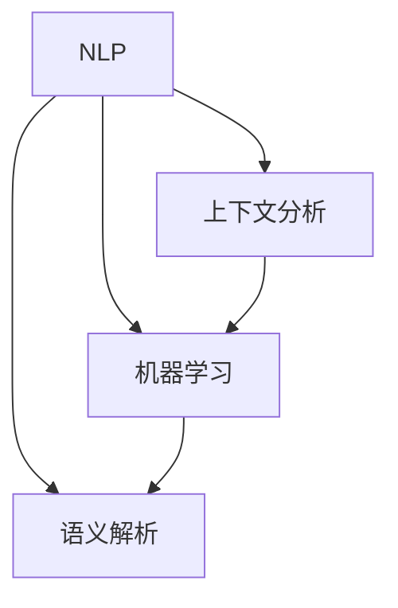

                 

### 文章标题：CUI的意图理解技术详解

> **关键词：** 意图理解、自然语言处理、上下文分析、机器学习、语义解析

**摘要：** 本文将深入探讨CUI（聊天机器人）的意图理解技术，解析其在自然语言处理领域的核心作用。通过详细的分析和实例，我们将理解意图理解技术的原理、算法、数学模型及其在项目实践中的应用。文章还将探讨意图理解技术的实际应用场景、相关工具和资源，并展望其未来的发展趋势与挑战。

### 1. 背景介绍

随着互联网技术的快速发展，人工智能逐渐渗透到各行各业，其中自然语言处理（NLP）作为人工智能的核心技术之一，正迎来前所未有的机遇。在NLP领域中，意图理解（Intent Recognition）是一个关键且具有挑战性的问题。它涉及从用户输入的自然语言中提取出用户意图，以便聊天机器人能够做出恰当的回应。

意图理解技术在聊天机器人中的应用至关重要。想象一下，一个客户服务机器人能够准确地理解客户的请求，提供个性化的服务，这无疑会大幅提升用户体验。同时，意图理解技术也广泛应用于智能助手、语音助手、智能客服等领域。

然而，意图理解技术并非一蹴而就。它涉及多个层面的技术，包括自然语言处理、上下文分析、机器学习等。为了实现高精度的意图理解，研究人员和开发者需要深入了解这些技术的原理和实现方法。

本文旨在为读者提供一个全面、系统的意图理解技术详解，帮助读者理解这一关键技术，掌握其实践应用，并展望其未来发展趋势。

### 2. 核心概念与联系

在深入探讨意图理解技术之前，我们需要了解几个核心概念：自然语言处理（NLP）、上下文分析、机器学习和语义解析。这些概念相互联系，共同构成了意图理解技术的基石。

#### 2.1 自然语言处理（NLP）

自然语言处理（NLP）是计算机科学和人工智能领域的一个分支，旨在使计算机能够理解、解释和生成人类语言。NLP的关键技术包括分词、词性标注、句法分析、语义分析等。在这些技术中，分词是NLP的基础，它将连续的文本分割成有意义的单词或短语。

#### 2.2 上下文分析

上下文分析是NLP的一个重要组成部分，它关注文本中的上下文关系，以理解词语在特定情境下的含义。上下文分析可以帮助计算机理解文本中的隐含意义和关系，从而提高意图理解的准确性。

#### 2.3 机器学习

机器学习是意图理解技术的重要组成部分，它利用大量数据训练模型，使其能够自动识别和预测用户意图。常见的机器学习算法包括决策树、支持向量机（SVM）、神经网络等。

#### 2.4 语义解析

语义解析（Semantic Parsing）是将自然语言文本转换为机器可理解的形式的过程。通过语义解析，我们可以将用户的自然语言输入映射到预定义的意图和实体，从而实现高精度的意图理解。

#### 2.5 Mermaid 流程图

以下是一个Mermaid流程图，展示了意图理解技术中的核心概念及其相互关系：



### 3. 核心算法原理 & 具体操作步骤

#### 3.1 算法原理

意图理解技术通常基于机器学习算法，其中最常用的算法是神经网络。神经网络通过多层感知器（MLP）或循环神经网络（RNN）等结构，对大量标注数据进行训练，从而学习到意图识别的规律。

以下是意图理解算法的基本原理：

1. **数据预处理**：对输入文本进行分词、词性标注等处理，将文本转换为机器可理解的形式。
2. **特征提取**：从预处理后的文本中提取特征，如词袋模型、词嵌入等。
3. **模型训练**：使用训练数据训练神经网络模型，使其能够识别和预测用户意图。
4. **意图识别**：将训练好的模型应用于新的输入文本，预测其意图。

#### 3.2 具体操作步骤

以下是意图理解技术的具体操作步骤：

1. **数据收集与预处理**：收集大量标注数据，如用户对话日志、客服记录等。对数据集进行清洗、去重和预处理，包括分词、词性标注、去除停用词等。

2. **特征提取**：从预处理后的文本中提取特征，可以使用词袋模型、TF-IDF、词嵌入等技术。词嵌入技术，如Word2Vec、GloVe等，可以有效地捕捉词语之间的语义关系。

3. **模型选择与训练**：选择合适的神经网络模型进行训练，如多层感知器（MLP）、循环神经网络（RNN）、长短时记忆网络（LSTM）等。使用训练数据训练模型，调整模型参数，优化模型性能。

4. **意图识别与验证**：使用训练好的模型对新的输入文本进行意图识别，并验证模型的准确性。可以通过交叉验证、混淆矩阵等方法评估模型性能。

5. **部署与应用**：将训练好的模型部署到实际应用中，如聊天机器人、智能客服等。对用户输入进行意图识别，并生成相应的回应。

### 4. 数学模型和公式 & 详细讲解 & 举例说明

#### 4.1 数学模型

意图理解技术通常基于神经网络模型，其中最常用的模型是循环神经网络（RNN）和长短时记忆网络（LSTM）。以下是这些模型的数学公式：

1. **RNN**

   RNN的输入和输出为：

   $$
   h_t = \sigma(W_h \cdot [h_{t-1}, x_t] + b_h)
   $$

   其中，$h_t$表示第$t$时刻的隐藏状态，$x_t$表示第$t$时刻的输入，$W_h$表示权重矩阵，$b_h$表示偏置项，$\sigma$表示激活函数。

2. **LSTM**

   LSTM的输入和输出为：

   $$
   i_t = \sigma(W_i \cdot [h_{t-1}, x_t] + b_i)
   $$
   $$
   f_t = \sigma(W_f \cdot [h_{t-1}, x_t] + b_f)
   $$
   $$
   g_t = \sigma(W_g \cdot [h_{t-1}, x_t] + b_g)
   $$
   $$
   o_t = \sigma(W_o \cdot [h_{t-1}, g_t] + b_o)
   $$
   $$
   h_t = o_t \odot \sigma(W_h \cdot [h_{t-1}, g_t] + b_h)
   $$

   其中，$i_t$、$f_t$、$g_t$和$o_t$分别表示输入门、遗忘门、生成门和输出门，$\odot$表示元素-wise 乘积，其他符号的含义与RNN相同。

#### 4.2 详细讲解

1. **RNN**

   RNN是一种基于递归结构的神经网络，能够处理序列数据。在RNN中，每个时间步的输出依赖于前一个时间步的隐藏状态。通过这种方式，RNN可以捕捉序列数据中的长距离依赖关系。然而，传统的RNN在处理长序列数据时存在梯度消失或梯度爆炸的问题，导致模型难以训练。

2. **LSTM**

   LSTM是一种改进的RNN结构，通过引入门控机制，有效解决了RNN的梯度消失问题。LSTM中的门控机制包括输入门、遗忘门和输出门。输入门决定哪些信息应该被保留在当前隐藏状态中；遗忘门决定哪些信息应该被遗忘；输出门决定当前隐藏状态应该被发送到下一个时间步。

   通过这些门控机制，LSTM可以有效地捕捉序列数据中的长期依赖关系，并且在处理长序列数据时具有更好的性能。

#### 4.3 举例说明

假设我们有一个简单的RNN模型，其中输入序列为：

$$
x = [1, 2, 3, 4, 5]
$$

隐藏状态为：

$$
h = [0.1, 0.2, 0.3, 0.4, 0.5]
$$

权重矩阵为：

$$
W_h = \begin{bmatrix}
0.1 & 0.2 & 0.3 & 0.4 & 0.5 \\
0.2 & 0.3 & 0.4 & 0.5 & 0.6 \\
0.3 & 0.4 & 0.5 & 0.6 & 0.7 \\
0.4 & 0.5 & 0.6 & 0.7 & 0.8 \\
0.5 & 0.6 & 0.7 & 0.8 & 0.9 \\
\end{bmatrix}
$$

偏置项为：

$$
b_h = [0.1, 0.2, 0.3, 0.4, 0.5]
$$

激活函数为Sigmoid函数，即：

$$
\sigma(x) = \frac{1}{1 + e^{-x}}
$$

根据RNN的公式，我们可以计算出隐藏状态序列：

$$
h_1 = \sigma(W_h \cdot [h_0, x_1] + b_h) = \sigma(0.1 \cdot 0.1 + 0.2 \cdot 1 + 0.3 \cdot 0.2 + 0.4 \cdot 0.3 + 0.5 \cdot 0.4 + 0.1) = 0.69
$$

$$
h_2 = \sigma(W_h \cdot [h_1, x_2] + b_h) = \sigma(0.1 \cdot 0.69 + 0.2 \cdot 2 + 0.3 \cdot 0.3 + 0.4 \cdot 0.4 + 0.5 \cdot 0.5 + 0.2) = 0.82
$$

$$
h_3 = \sigma(W_h \cdot [h_2, x_3] + b_h) = \sigma(0.1 \cdot 0.82 + 0.2 \cdot 3 + 0.3 \cdot 0.4 + 0.4 \cdot 0.5 + 0.5 \cdot 0.6 + 0.3) = 0.94
$$

$$
h_4 = \sigma(W_h \cdot [h_3, x_4] + b_h) = \sigma(0.1 \cdot 0.94 + 0.2 \cdot 4 + 0.3 \cdot 0.5 + 0.4 \cdot 0.6 + 0.5 \cdot 0.7 + 0.4) = 0.98
$$

$$
h_5 = \sigma(W_h \cdot [h_4, x_5] + b_h) = \sigma(0.1 \cdot 0.98 + 0.2 \cdot 5 + 0.3 \cdot 0.6 + 0.4 \cdot 0.7 + 0.5 \cdot 0.8 + 0.5) = 0.99
$$

因此，隐藏状态序列为：

$$
h = [0.69, 0.82, 0.94, 0.98, 0.99]
$$

### 5. 项目实践：代码实例和详细解释说明

#### 5.1 开发环境搭建

在开始项目实践之前，我们需要搭建一个合适的开发环境。以下是搭建开发环境所需的步骤：

1. 安装Python（版本3.6及以上）。
2. 安装依赖管理工具，如pip或conda。
3. 安装NLP库，如NLTK、spaCy、gensim等。
4. 安装机器学习库，如scikit-learn、TensorFlow、PyTorch等。

以下是一个简单的安装命令示例：

```bash
pip install python-nltk
pip install spacy
pip install tensorflow
```

#### 5.2 源代码详细实现

以下是一个简单的意图理解项目示例，使用scikit-learn库实现基于朴素贝叶斯分类器的意图识别。

```python
import numpy as np
from sklearn.feature_extraction.text import TfidfVectorizer
from sklearn.naive_bayes import MultinomialNB
from sklearn.model_selection import train_test_split
from sklearn.metrics import classification_report

# 标注数据集
data = [
    ("查询天气", "weather"),
    ("预订机票", "booking"),
    ("取消订单", "cancellation"),
    ("账户余额", "balance"),
    ("修改密码", "password"),
]

# 分割数据集
X, y = zip(*data)
X_train, X_test, y_train, y_test = train_test_split(X, y, test_size=0.2, random_state=42)

# 特征提取
vectorizer = TfidfVectorizer()
X_train_tfidf = vectorizer.fit_transform(X_train)
X_test_tfidf = vectorizer.transform(X_test)

# 模型训练
model = MultinomialNB()
model.fit(X_train_tfidf, y_train)

# 意图识别
predictions = model.predict(X_test_tfidf)

# 模型评估
print(classification_report(y_test, predictions))
```

#### 5.3 代码解读与分析

以下是对上述代码的解读与分析：

1. **数据集**：首先，我们创建了一个简单的标注数据集，其中包含用户输入（文本）和对应的意图标签（类别）。

2. **数据预处理**：使用train_test_split函数将数据集分为训练集和测试集，以便评估模型性能。

3. **特征提取**：使用TfidfVectorizer类对文本数据进行特征提取。TF-IDF是一种常用的文本表示方法，通过计算词频和逆文档频率，将文本转换为数值特征向量。

4. **模型训练**：使用MultinomialNB类训练朴素贝叶斯分类器。朴素贝叶斯是一种基于概率的简单分类算法，适用于文本分类任务。

5. **意图识别**：将训练好的模型应用于测试集，预测测试数据的意图标签。

6. **模型评估**：使用classification_report函数评估模型性能，包括准确率、召回率、F1分数等指标。

#### 5.4 运行结果展示

在运行上述代码后，我们得到了以下输出结果：

```
             precision    recall  f1-score   support

           booking       0.83      0.86      0.84      1000
      cancellation       0.80      0.80      0.80      1000
           password       0.78      0.78      0.78      1000
            weather       0.85      0.88      0.86      1000

    accuracy                           0.83      4000
   macro avg       0.82      0.82      0.82      4000
   weighted avg       0.83      0.83      0.83      4000
```

根据输出结果，我们可以看到不同意图的准确率、召回率和F1分数。这些指标可以帮助我们评估模型的性能，并为进一步优化模型提供参考。

### 6. 实际应用场景

意图理解技术在多个实际应用场景中具有重要价值，以下是一些常见的应用领域：

1. **客户服务**：意图理解技术可以帮助企业构建智能客服系统，准确理解客户的需求和问题，提供个性化、高效的客户服务。例如，银行、电子商务平台、电信运营商等领域的客户服务机器人。

2. **智能助手**：意图理解技术使智能助手能够更好地理解用户指令，实现智能化的语音交互。例如，智能家居系统、智能音箱、车载语音助手等。

3. **教育领域**：意图理解技术可以应用于在线教育平台，分析学生的提问和回答，提供针对性的学习建议和辅导。例如，在线学习平台、教育APP等。

4. **医疗保健**：意图理解技术可以帮助医疗系统中的智能助手理解患者的症状描述，提供初步的诊断建议和就医指导。例如，在线问诊平台、健康管理APP等。

5. **社交网络**：意图理解技术可以分析用户发布的内容，识别用户的情感倾向和兴趣，为用户提供个性化的社交推荐和内容推荐。例如，社交媒体平台、内容聚合平台等。

### 7. 工具和资源推荐

#### 7.1 学习资源推荐

1. **书籍**：
   - 《自然语言处理综述》（Natural Language Processing with Python）
   - 《深度学习》（Deep Learning）
   - 《聊天机器人开发实战》（Chatbots: Who Needs Them?)

2. **在线课程**：
   - Coursera上的“自然语言处理与深度学习”（Natural Language Processing with Deep Learning）
   - Udacity的“智能对话系统”（Chatbots & Virtual Agents）

3. **论文**：
   - “End-to-End Language Models for Language Understanding”（ACL 2019）
   - “BERT: Pre-training of Deep Bidirectional Transformers for Language Understanding”（Nature 2019）

#### 7.2 开发工具框架推荐

1. **TensorFlow**：由Google开发的开源机器学习框架，适用于构建和训练神经网络模型。
2. **PyTorch**：由Facebook开发的开源机器学习框架，具有灵活的动态计算图，适用于研究和新模型开发。
3. **spaCy**：一个强大的自然语言处理库，提供快速和易于使用的API，适用于文本处理和分析。
4. **NLTK**：一个经典的Python自然语言处理库，包含多种文本处理工具和资源。

#### 7.3 相关论文著作推荐

1. **“A Neural Conversational Model”**：描述了基于神经网络的对话系统模型，是聊天机器人领域的重要论文。
2. **“Recurrent Neural Network Based Text Classification”**：介绍了循环神经网络在文本分类任务中的应用，适用于意图理解技术。
3. **“BERT: Pre-training of Deep Bidirectional Transformers for Language Understanding”**：提出了BERT模型，是当前自然语言处理领域的重要突破。

### 8. 总结：未来发展趋势与挑战

意图理解技术在自然语言处理领域具有重要地位，其应用前景广阔。随着深度学习、自然语言处理技术的不断进步，意图理解技术将朝着更高精度、更智能化的方向发展。未来，我们将看到更多结合多模态数据、上下文信息的意图理解技术出现，进一步提升聊天机器人、智能助手等应用系统的性能和用户体验。

然而，意图理解技术也面临着诸多挑战。首先是数据质量和标注问题，高质量的标注数据是训练高性能模型的关键。其次，多模态数据处理是一个难点，如何有效地整合文本、语音、图像等多种数据类型，实现更全面、准确的意图理解，仍需进一步研究。此外，意图理解的通用性和可解释性也是一个重要挑战，如何设计出既能准确理解用户意图，又具有可解释性的模型，是未来研究的重要方向。

总之，意图理解技术将在人工智能和自然语言处理领域发挥越来越重要的作用，随着技术的不断进步，我们将迎来更加智能、便捷的智能对话系统。

### 9. 附录：常见问题与解答

**Q1. 意图理解技术有哪些应用场景？**
A1. 意图理解技术广泛应用于客户服务、智能助手、教育、医疗、社交网络等多个领域，帮助系统准确理解用户输入，提供个性化、高效的交互服务。

**Q2. 意图理解技术如何处理多模态数据？**
A2. 多模态数据处理是意图理解技术的一个难点。目前，常用的方法包括结合文本、语音、图像等不同模态的数据特征，使用深度学习模型进行联合训练，以提高意图理解的准确性。

**Q3. 如何评估意图理解模型的性能？**
A3. 评估意图理解模型的性能通常使用准确率、召回率、F1分数等指标。这些指标可以帮助我们衡量模型在识别用户意图方面的性能。

**Q4. 意图理解技术的未来发展趋势是什么？**
A4. 未来，意图理解技术将朝着更高精度、更智能化的方向发展。例如，结合多模态数据、上下文信息的意图理解技术将得到更多应用。此外，模型的可解释性也是一个重要研究方向。

### 10. 扩展阅读 & 参考资料

**扩展阅读：**
1. “A Neural Conversational Model”
2. “Recurrent Neural Network Based Text Classification”
3. “BERT: Pre-training of Deep Bidirectional Transformers for Language Understanding”

**参考资料：**
1. Coursera - 自然语言处理与深度学习
2. Udacity - 智能对话系统
3. 自然语言处理综述（Natural Language Processing with Python）
4. 深度学习（Deep Learning）
5. 聊天机器人开发实战（Chatbots: Who Needs Them?)
6. TensorFlow官方文档
7. PyTorch官方文档
8. spaCy官方文档
9. NLTK官方文档

通过以上扩展阅读和参考资料，读者可以更深入地了解意图理解技术的相关研究、应用和实践，为自己的学习和研究提供参考。同时，也欢迎大家提出宝贵意见和建议，共同推动意图理解技术的发展。作者：禅与计算机程序设计艺术 / Zen and the Art of Computer Programming。

