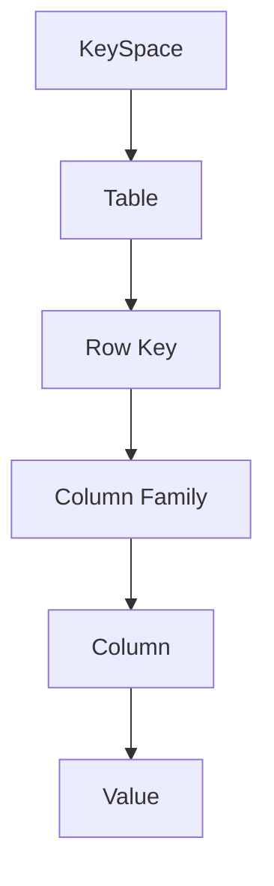
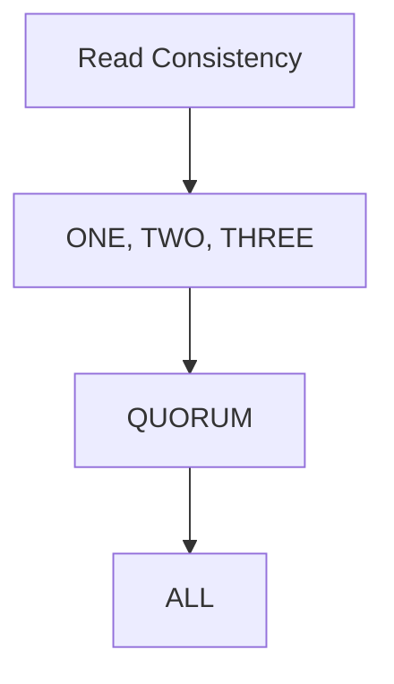
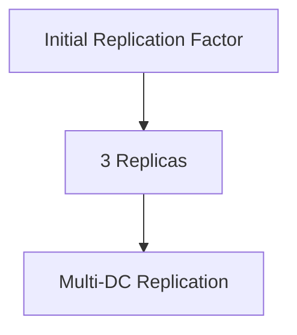
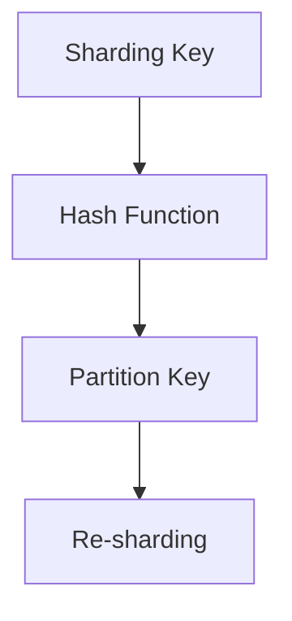

                 

关键词：Cassandra, 分布式数据库，NoSQL，一致性模型，数据复制，容错性，一致性级别，查询优化，性能调优，实例代码，架构设计

## 摘要

Cassandra是一个开源的分布式NoSQL数据库，以其强大的容错性、高性能和可伸缩性著称。本文将详细介绍Cassandra的核心原理，包括其数据模型、一致性模型、数据复制和分片策略。此外，本文还将通过代码实例，深入探讨Cassandra的实际应用和开发实践。

## 1. 背景介绍

### 1.1 Cassandra的起源

Cassandra起源于Google的Bigtable，由Amazon的Dynamo启发。它是Apache软件基金会的一个顶级项目，自2008年成立以来，已经得到了广泛的社区支持和商业化应用。

### 1.2 Cassandra的特点

- **高可用性**：无单点故障设计，能够在数据中心级别的故障中保持服务运行。
- **高性能**：通过分布式架构实现高效的数据读写操作，适合处理大量数据。
- **可伸缩性**：可以横向扩展，自动调整集群大小以应对数据增长和负载增加。
- **灵活的数据模型**：支持宽列族模型，能够存储复杂数据结构。
- **灵活的一致性**：提供多种一致性级别，可以根据应用场景进行选择。

### 1.3 Cassandra的应用场景

Cassandra适用于需要高可用性、高性能和可伸缩性的应用场景，如：

- **实时分析**：处理大量实时数据，如时间序列数据、日志数据等。
- **大规模数据存储**：处理数十PB甚至更多的数据存储需求。
- **数据缓存**：缓存频繁访问的数据，提高应用性能。
- **物联网（IoT）**：处理来自大量物联网设备的实时数据。

## 2. 核心概念与联系

下面将介绍Cassandra的一些核心概念，并使用Mermaid流程图展示其架构和数据流。

### 2.1 数据模型

Cassandra的数据模型基于键-值存储，但更接近于关系型数据库中的表。它由列族、行键、列和值组成。



### 2.2 一致性模型

Cassandra的一致性模型基于Paxos算法，提供多种一致性级别，包括：

- **QUORUM**：读取和写入操作需要在一定数量的副本上成功。
- **ONE**：只在一个副本上成功即可。
- **ALL**：所有副本都要成功。
- **ANY**：任何一个副本成功即可。



### 2.3 数据复制

Cassandra的数据复制是基于一致性策略的，可以在多个数据中心进行。默认情况下，每个数据分片的副本数量是3。



### 2.4 分片策略

Cassandra的分片策略基于列族和主键的哈希值，可以水平扩展数据。



## 3. 核心算法原理 & 具体操作步骤

### 3.1 算法原理概述

Cassandra使用了一套复杂的算法来保证数据的一致性和可靠性，包括Gossip协议、Paxos算法和Vector Clocks。

### 3.2 算法步骤详解

1. **Gossip协议**：Cassandra节点通过Gossip协议进行心跳交换，从而感知集群状态。
2. **Paxos算法**：节点使用Paxos算法进行一致性决策。
3. **Vector Clocks**：用于跟踪事件顺序和时间戳。

### 3.3 算法优缺点

- **优点**：高可用性、高性能、可伸缩性。
- **缺点**：配置复杂、不适合高一致性要求的应用。

### 3.4 算法应用领域

Cassandra适用于需要高可用性和可伸缩性的场景，如社交网络、实时分析、物联网等。

## 4. 数学模型和公式 & 详细讲解 & 举例说明

### 4.1 数学模型构建

Cassandra的数据模型基于关系型数据库的表模型，但更加灵活。其数学模型可以描述为：

\[ Data = \{ \text{KeySpace} \rightarrow \text{Table} \} \]

### 4.2 公式推导过程

Cassandra的一致性级别可以通过以下公式推导：

\[ Consistency = \{ \text{Read Quorum} \times \text{Write Quorum} \} \]

### 4.3 案例分析与讲解

假设一个Cassandra集群有3个副本，一致性级别为QUORUM(2)，那么：

\[ \text{Read Consistency} = 2/3 \]
\[ \text{Write Consistency} = 2/3 \]

## 5. 项目实践：代码实例和详细解释说明

### 5.1 开发环境搭建

首先，我们需要搭建Cassandra的开发环境。可以参考Cassandra官方文档进行安装。

### 5.2 源代码详细实现

以下是Cassandra的一个简单示例代码，用于创建表、插入数据、查询数据。

```java
// 创建表
String createTable = "CREATE TABLE example (id uuid PRIMARY KEY, name text, age int)";
cassandra.execute(createTable);

// 插入数据
String insert = "INSERT INTO example (id, name, age) VALUES (1, 'Alice', 30)";
cassandra.execute(insert);

// 查询数据
String select = "SELECT * FROM example WHERE id = 1";
ResultSet<Row> result = cassandra.execute(select);
Row row = result.one();
System.out.println("Name: " + row.getString("name") + ", Age: " + row.getInt("age"));
```

### 5.3 代码解读与分析

这段代码首先创建了一个名为`example`的表，然后插入了一行数据，最后查询了该行的数据。

### 5.4 运行结果展示

运行上述代码后，我们可以在控制台看到如下输出：

```
Name: Alice, Age: 30
```

## 6. 实际应用场景

Cassandra广泛应用于多个领域，如：

- **社交网络**：处理用户数据、日志数据等。
- **实时分析**：处理大规模实时数据流。
- **物联网**：存储和处理来自大量物联网设备的实时数据。
- **金融交易**：处理高频交易数据。

## 7. 工具和资源推荐

### 7.1 学习资源推荐

- **Cassandra官方文档**：https://cassandra.apache.org/doc/latest/
- **《Cassandra权威指南》**：一本全面的Cassandra教程书籍。

### 7.2 开发工具推荐

- **DataStax DevCenter**：一款集成开发环境，支持Cassandra的开发。
- **Cassandra运维工具**：如Cassandra Management Tool、Cassandra Studio等。

### 7.3 相关论文推荐

- **《The Google File System》**：介绍了Google的分布式文件系统GFS。
- **《Dynamo: Amazon’s Highly Available Key-value Store》**：介绍了Dynamo算法和架构。

## 8. 总结：未来发展趋势与挑战

### 8.1 研究成果总结

Cassandra在分布式数据库领域取得了显著的研究成果，但仍有改进空间。

### 8.2 未来发展趋势

- **混合存储**：结合内存和磁盘存储，提高性能。
- **多模型支持**：支持更多的数据模型，如文档、图形等。
- **云原生**：更好地适应云原生架构。

### 8.3 面临的挑战

- **配置管理**：复杂度高，需要简化。
- **监控与运维**：提高自动化程度。
- **性能优化**：持续提高查询性能。

### 8.4 研究展望

Cassandra将继续在分布式数据库领域发挥重要作用，不断改进和扩展其功能。

## 9. 附录：常见问题与解答

### 9.1 Cassandra与MongoDB的区别是什么？

Cassandra和MongoDB都是分布式NoSQL数据库，但Cassandra更强调高可用性和可伸缩性，而MongoDB则更注重灵活的数据模型和文档存储。

### 9.2 Cassandra如何保证数据一致性？

Cassandra通过一致性级别（如QUORUM）和Paxos算法来保证数据一致性。一致性级别决定了读取和写入操作需要在多少副本上成功。

## 参考文献

- Apache Cassandra: https://cassandra.apache.org/
- 《The Google File System》: Google Inc.
- 《Dynamo: Amazon’s Highly Available Key-value Store》: Lars George.

