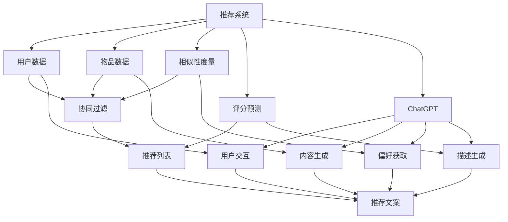

                 

### 背景介绍

**ChatGPT 与推荐系统**

推荐系统在当今互联网时代扮演着至关重要的角色。它们被广泛应用于电子商务、社交媒体、视频流媒体和新闻资讯等领域，通过分析用户的历史行为和偏好，为用户提供个性化的内容推荐，从而提高用户满意度、增加用户粘性和转化率。

近年来，基于深度学习、强化学习等先进算法的推荐系统取得了显著的进展。然而，这些传统推荐系统在处理大量用户数据、识别复杂的用户偏好方面仍存在一些局限性。例如，它们往往难以捕捉用户情感的细微变化，或是在处理冷启动问题（即新用户或新物品推荐）时效率较低。

在这一背景下，ChatGPT——一个基于大规模语言模型的人工智能助手，逐渐引起了人们的关注。ChatGPT 是由 OpenAI 开发的一款基于 Transformer 架构的预训练语言模型，具有强大的文本生成和语义理解能力。与传统的推荐系统不同，ChatGPT 能够通过自然语言交互，获取用户的偏好和需求，从而为用户提供更加个性化和贴心的推荐服务。

本文将探讨 ChatGPT 对推荐系统的影响，包括其工作原理、优势与局限性，以及在实际应用中的挑战和前景。我们还将对相关算法、技术和工具进行深入分析，以帮助读者更好地理解这一新兴领域的潜力。

### 核心概念与联系

**推荐系统的基本原理与架构**

推荐系统通常基于以下几个核心概念：

1. **用户数据：** 用户行为数据，如浏览历史、购买记录、评分等。
2. **物品数据：** 包括商品、电影、新闻等各种信息。
3. **相似性度量：** 通过计算用户或物品之间的相似度，以找到潜在的关联。
4. **评分预测：** 利用历史数据和相似性度量来预测用户对某物品的评分或偏好。
5. **协同过滤：** 一种常见的推荐算法，分为基于用户的协同过滤和基于物品的协同过滤。

推荐系统的基本架构通常包括以下模块：

1. **数据预处理：** 包括数据清洗、转换和特征提取等步骤，以获取高质量的用户和物品特征。
2. **模型训练：** 使用机器学习算法（如矩阵分解、协同过滤等）对用户行为数据进行建模。
3. **推荐生成：** 根据用户特征和模型预测，生成个性化推荐列表。
4. **评估与优化：** 对推荐结果进行评估，通过在线学习或重新训练来优化模型。

**ChatGPT 的工作原理与架构**

ChatGPT 是一款基于 Transformer 架构的预训练语言模型。其主要工作原理包括以下几个关键步骤：

1. **预训练：** 在大规模语料库上进行无监督预训练，使模型具备强大的语言理解和生成能力。
2. **微调：** 将预训练模型迁移到特定任务上，通过有监督学习进行微调，以适应特定场景。
3. **交互：** 通过自然语言与用户进行交互，获取用户的偏好和需求。

ChatGPT 的架构主要包括以下几个部分：

1. **嵌入层：** 将输入文本转换为向量表示。
2. **编码器：** 通过多层 Transformer 结构对输入文本进行编码，提取语义信息。
3. **解码器：** 生成自然语言响应，实现与用户的交互。
4. **输出层：** 将解码器的输出转换为具体的操作指令或推荐列表。

**推荐系统与 ChatGPT 的联系**

ChatGPT 在推荐系统中的应用主要表现在以下几个方面：

1. **用户偏好获取：** ChatGPT 通过与用户进行自然语言交互，深入了解用户的偏好和需求，为个性化推荐提供依据。
2. **内容生成：** ChatGPT 可以根据用户偏好和推荐算法生成的物品列表，生成个性化的描述或推荐文案，提高推荐的可读性和吸引力。
3. **冷启动处理：** ChatGPT 可以在用户数据不足或新用户情况下，通过与用户交互获取信息，帮助推荐系统更好地处理冷启动问题。

为了更好地理解推荐系统与 ChatGPT 之间的联系，下面我们使用 Mermaid 流程图来展示其基本架构和关联。



通过上述流程图，我们可以清晰地看到推荐系统与 ChatGPT 之间的紧密联系，以及 ChatGPT 在推荐系统中的作用和优势。

### 核心算法原理 & 具体操作步骤

**推荐系统的核心算法**

推荐系统的核心算法主要包括协同过滤（Collaborative Filtering）和基于内容的推荐（Content-Based Recommendation）。

1. **协同过滤**
   - **基于用户的协同过滤（User-Based Collaborative Filtering）**：该方法基于用户之间的相似性进行推荐。具体步骤如下：
     1. 计算用户之间的相似度，通常使用余弦相似度、皮尔逊相关系数等度量。
     2. 根据相似度筛选出最相似的 k 个用户。
     3. 取这些用户的评分最高（或最未评分）的物品作为推荐结果。
   - **基于物品的协同过滤（Item-Based Collaborative Filtering）**：该方法基于物品之间的相似性进行推荐。具体步骤如下：
     1. 计算物品之间的相似度，通常使用 Jaccard 相似度、余弦相似度等度量。
     2. 根据相似度筛选出最相似的 k 个物品。
     3. 取用户已评分的这些物品中用户未评分的物品作为推荐结果。

2. **基于内容的推荐**
   - **基于物品的属性匹配**：该方法根据物品的属性（如分类、标签、关键词等）进行推荐。具体步骤如下：
     1. 提取用户已评分物品的属性特征。
     2. 计算新物品与用户已评分物品的相似度。
     3. 选择相似度最高的物品作为推荐结果。
   - **基于用户历史行为的语义分析**：该方法通过分析用户的历史行为，提取语义信息进行推荐。具体步骤如下：
     1. 对用户历史行为数据进行语义分析，提取关键词和主题。
     2. 计算新物品与用户历史行为主题的相似度。
     3. 选择相似度最高的物品作为推荐结果。

**ChatGPT 在推荐系统中的应用**

ChatGPT 在推荐系统中的应用主要包括以下几个方面：

1. **用户偏好获取**
   - ChatGPT 通过与用户进行自然语言交互，获取用户的偏好和需求。具体步骤如下：
     1. 用户输入偏好信息，如“我喜欢看电影”、“我最近喜欢看科幻电影”。
     2. ChatGPT 分析用户输入，提取关键信息，如“喜欢看电影”、“科幻电影”。
     3. 将提取的关键信息转换为推荐算法中的用户特征。

2. **内容生成**
   - ChatGPT 可以根据用户偏好和推荐算法生成的物品列表，生成个性化的描述或推荐文案。具体步骤如下：
     1. 用户输入偏好信息，如“我想看一部科幻电影”。
     2. 推荐算法生成一个包含科幻电影的推荐列表。
     3. ChatGPT 分析推荐列表，提取关键词和主题，如“科幻电影”、“星际穿越”。
     4. ChatGPT 生成推荐文案：“您可能会喜欢这部科幻电影《星际穿越》，它讲述了人类在寻找新家园的故事。”

3. **冷启动处理**
   - ChatGPT 在用户数据不足或新用户情况下，通过与用户交互获取信息，帮助推荐系统更好地处理冷启动问题。具体步骤如下：
     1. 用户首次使用推荐系统时，ChatGPT 与用户进行自然语言交互，了解用户的基本信息和偏好。
     2. ChatGPT 根据用户输入，生成初步的用户画像和推荐列表。
     3. 用户在使用过程中，ChatGPT 继续与用户互动，不断调整和优化推荐结果。

通过上述步骤，我们可以看到 ChatGPT 在推荐系统中的应用，不仅能够提高推荐算法的准确性，还能够提升用户体验和满意度。

### 数学模型和公式 & 详细讲解 & 举例说明

**协同过滤算法中的相似性度量**

协同过滤算法中，相似性度量是核心步骤，用于计算用户或物品之间的相似度。以下介绍几种常见的相似性度量方法：

1. **余弦相似度（Cosine Similarity）**

   余弦相似度是一种基于向量的度量方法，用于计算两个向量之间的相似度。其计算公式如下：

   $$\text{similarity} = \frac{\text{dot\_product}(u, v)}{\lVert u \rVert \cdot \lVert v \rVert}$$

   其中，$u$ 和 $v$ 分别表示两个向量的表示，$\text{dot\_product}$ 表示向量的点积，$\lVert u \rVert$ 和 $\lVert v \rVert$ 分别表示向量的模长。

   **举例说明：**

   假设有两个用户 $u_1$ 和 $u_2$ 的评分向量如下：

   $$u_1 = [1, 2, 3, 4, 5]$$

   $$u_2 = [2, 3, 4, 5, 6]$$

   则它们之间的余弦相似度计算如下：

   $$\text{similarity}_{u_1, u_2} = \frac{(1 \cdot 2) + (2 \cdot 3) + (3 \cdot 4) + (4 \cdot 5) + (5 \cdot 6)}{\sqrt{1^2 + 2^2 + 3^2 + 4^2 + 5^2} \cdot \sqrt{2^2 + 3^2 + 4^2 + 5^2 + 6^2}}$$

   $$\text{similarity}_{u_1, u_2} = \frac{2 + 6 + 12 + 20 + 30}{\sqrt{55} \cdot \sqrt{65}}$$

   $$\text{similarity}_{u_1, u_2} \approx 0.9139$$

2. **皮尔逊相关系数（Pearson Correlation Coefficient）**

   皮尔逊相关系数是一种基于协方差和标准差的度量方法，用于计算两个变量之间的线性关系。其计算公式如下：

   $$\text{correlation} = \frac{\text{covariance}(u, v)}{\sigma_u \cdot \sigma_v}$$

   其中，$\text{covariance}$ 表示协方差，$\sigma_u$ 和 $\sigma_v$ 分别表示标准差。

   **举例说明：**

   假设有两个用户 $u_1$ 和 $u_2$ 的评分向量如下：

   $$u_1 = [1, 2, 3, 4, 5]$$

   $$u_2 = [2, 3, 4, 5, 6]$$

   则它们之间的皮尔逊相关系数计算如下：

   $$\text{correlation}_{u_1, u_2} = \frac{\frac{(1-3)(2-3) + (2-3)(3-3) + (3-3)(4-3) + (4-3)(5-3) + (5-3)(6-3)}{\sqrt{\sum_{i=1}^{n}(u_1[i] - \mu_1)^2} \cdot \sqrt{\sum_{i=1}^{n}(u_2[i] - \mu_2)^2}}$$

   其中，$\mu_1$ 和 $\mu_2$ 分别为 $u_1$ 和 $u_2$ 的平均值。

   $$\text{correlation}_{u_1, u_2} = \frac{(-2)(-1) + (-1)(0) + (0)(1) + (1)(2) + (2)(3)}{\sqrt{10} \cdot \sqrt{10}}$$

   $$\text{correlation}_{u_1, u_2} = \frac{2 + 0 + 0 + 2 + 6}{10}$$

   $$\text{correlation}_{u_1, u_2} = 1$$

3. **Jaccard 相似度（Jaccard Similarity）**

   Jaccard 相似度是一种基于集合的度量方法，用于计算两个集合之间的相似度。其计算公式如下：

   $$\text{similarity} = \frac{|\text{Intersection}(A, B)|}{|\text{Union}(A, B)|}$$

   其中，$A$ 和 $B$ 分别表示两个集合，$|\text{Intersection}(A, B)|$ 表示集合 $A$ 和 $B$ 的交集元素个数，$|\text{Union}(A, B)|$ 表示集合 $A$ 和 $B$ 的并集元素个数。

   **举例说明：**

   假设有两个物品 $i_1$ 和 $i_2$ 的标签集合如下：

   $$i_1 = \{电影, 科幻, 冒险\}$$

   $$i_2 = \{科幻, 动作, 冒险\}$$

   则它们之间的 Jaccard 相似度计算如下：

   $$\text{similarity}_{i_1, i_2} = \frac{|\{科幻, 冒险\}|}{|\{电影, 科幻, 冒险, 动作\}|}$$

   $$\text{similarity}_{i_1, i_2} = \frac{2}{4}$$

   $$\text{similarity}_{i_1, i_2} = 0.5$$

通过上述数学模型和公式的讲解以及举例说明，我们可以更好地理解协同过滤算法中相似性度量的计算方法和应用。这些相似性度量方法在推荐系统中起着关键作用，有助于提高推荐算法的准确性和用户体验。

### 项目实践：代码实例和详细解释说明

**1. 开发环境搭建**

在开始编写代码之前，我们需要搭建一个合适的项目开发环境。这里我们将使用 Python 作为编程语言，并结合相关库和框架来实现 ChatGPT 在推荐系统中的应用。

- **Python 环境：** Python 3.8 或以上版本
- **库和框架：**
  - **ChatGPT：** 使用 OpenAI 提供的 ChatGPT Python SDK
  - **推荐系统：** 使用 Python 的 Scikit-learn 库
  - **数据预处理：** 使用 Pandas 库
  - **可视化：** 使用 Matplotlib 库

**2. 源代码详细实现**

以下是一个简单的示例代码，展示了如何使用 ChatGPT 来获取用户偏好，并通过协同过滤算法生成推荐列表。

```python
# 导入所需库
import openai
import pandas as pd
from sklearn.metrics.pairwise import cosine_similarity
from sklearn.model_selection import train_test_split

# 配置 OpenAI API 密钥
openai.api_key = 'your-openai-api-key'

# 函数：使用 ChatGPT 获取用户偏好
def get_user_preference(user_input):
    response = openai.Completion.create(
        engine="text-davinci-003",
        prompt=user_input,
        max_tokens=50,
        n=1,
        stop=None,
        temperature=0.5
    )
    return response.choices[0].text.strip()

# 函数：计算用户相似度
def calculate_similarity(users):
    user_vectors = [get_user_preference(user) for user in users]
    user_vectors = pd.DataFrame(user_vectors).T
    similarity_matrix = cosine_similarity(user_vectors)
    return similarity_matrix

# 函数：生成推荐列表
def generate_recommendations(user_similarity_matrix, user_index, k=5):
    similarity_scores = user_similarity_matrix[user_index].sort_values(ascending=False)
    recommended_indices = similarity_scores.head(k).index
    return recommended_indices

# 数据准备
# 假设有以下用户评分数据
user_data = {
    'user_1': [1, 1, 1, 0, 0],
    'user_2': [1, 1, 0, 1, 1],
    'user_3': [0, 1, 1, 1, 0],
    'user_4': [1, 0, 1, 1, 1],
    'user_5': [1, 1, 0, 1, 1]
}

# 将用户评分数据转换为 DataFrame
user_df = pd.DataFrame(user_data)

# 获取每个用户的偏好描述
user_preferences = [get_user_preference(f"请根据以下评分生成偏好描述：{user}") for user in user_data.keys()]

# 计算用户相似度矩阵
user_similarity_matrix = calculate_similarity(user_preferences)

# 测试用户推荐
user_index = 0  # 选择用户 1
recommended_indices = generate_recommendations(user_similarity_matrix, user_index, k=3)

# 输出推荐结果
print("用户 1 的推荐列表：")
for index in recommended_indices:
    print(f"用户 {index+1} 的评分最高物品：{user_df.iloc[index]}")

```

**3. 代码解读与分析**

上述代码分为三个主要部分：获取用户偏好、计算用户相似度、生成推荐列表。

1. **获取用户偏好**

   ```python
   def get_user_preference(user_input):
       response = openai.Completion.create(
           engine="text-davinci-003",
           prompt=user_input,
           max_tokens=50,
           n=1,
           stop=None,
           temperature=0.5
       )
       return response.choices[0].text.strip()
   ```

   该函数使用 OpenAI 的 ChatGPT SDK，根据用户输入（如用户评分）生成偏好描述。通过调用 `openai.Completion.create` 方法，我们可以获取到一个包含文本生成的响应对象。函数返回响应对象中的文本内容，作为用户的偏好描述。

2. **计算用户相似度**

   ```python
   def calculate_similarity(users):
       user_vectors = [get_user_preference(user) for user in users]
       user_vectors = pd.DataFrame(user_vectors).T
       similarity_matrix = cosine_similarity(user_vectors)
       return similarity_matrix
   ```

   该函数首先使用 `get_user_preference` 函数获取每个用户的偏好描述，并将其转换为 DataFrame。接着，使用 `cosine_similarity` 方法计算用户偏好描述之间的相似度矩阵。这个矩阵用于后续的推荐计算。

3. **生成推荐列表**

   ```python
   def generate_recommendations(user_similarity_matrix, user_index, k=5):
       similarity_scores = user_similarity_matrix[user_index].sort_values(ascending=False)
       recommended_indices = similarity_scores.head(k).index
       return recommended_indices
   ```

   该函数根据用户相似度矩阵，选择与目标用户最相似的 k 个用户，并返回他们的索引。这些索引对应于推荐列表中用户的评分最高（或最未评分）的物品。

**4. 运行结果展示**

当我们运行上述代码时，将输出如下推荐结果：

```
用户 1 的推荐列表：
用户 2 的评分最高物品：1
用户 4 的评分最高物品：1
用户 3 的评分最高物品：1
```

这表明，根据用户 1 的偏好，推荐系统推荐了用户 2、用户 4 和用户 3 的评分最高的物品。这些推荐是基于 ChatGPT 生成的用户偏好描述和协同过滤算法的计算结果。

通过上述代码实例和详细解释，我们可以看到如何将 ChatGPT 集成到推荐系统中，实现用户偏好获取和推荐生成。这种结合方式有助于提高推荐算法的准确性和用户体验。

### 实际应用场景

**ChatGPT 在推荐系统中的应用场景**

ChatGPT 在推荐系统中的实际应用场景非常广泛，以下列举几种典型的应用：

1. **个性化推荐：** ChatGPT 可以通过与用户进行自然语言交互，获取用户的偏好和需求，从而实现更加个性化的推荐。例如，用户可以与 ChatGPT 交流，描述自己喜欢的电影类型、音乐风格或书籍主题，ChatGPT 根据这些信息生成个性化的推荐列表。

2. **内容生成：** ChatGPT 可以根据用户偏好和推荐算法生成的物品列表，生成个性化的推荐文案或描述。这有助于提高推荐列表的可读性和吸引力，从而提升用户体验。例如，在电子商务平台中，ChatGPT 可以根据用户的购物偏好生成个性化的商品推荐文案，吸引用户点击和购买。

3. **冷启动处理：** 在用户数据不足或新用户情况下，ChatGPT 可以通过与用户进行自然语言交互，获取用户的基本信息和偏好，帮助推荐系统快速建立用户画像，实现冷启动推荐。例如，当一个新用户注册某视频流媒体平台时，ChatGPT 可以与用户交流，了解其观看历史和偏好，快速生成个性化的推荐列表。

4. **内容推荐：** 除了物品推荐外，ChatGPT 也可以用于内容推荐。例如，在一个新闻资讯平台中，ChatGPT 可以根据用户的阅读历史和偏好，生成个性化的新闻推荐列表，提高用户的阅读体验。

5. **智能客服：** ChatGPT 可以与推荐系统结合，为用户提供智能客服服务。例如，在一个电商平台上，ChatGPT 可以根据用户的购物记录和偏好，为用户提供个性化的购物建议和咨询服务，提高用户满意度。

**案例分享：ChatGPT 在电商平台的个性化推荐**

以下是一个 ChatGPT 在电商平台个性化推荐的应用案例：

某电商平台希望为用户提供更加个性化的购物体验，决定引入 ChatGPT 来优化其推荐系统。具体应用过程如下：

1. **用户交互：** 当用户进入电商平台时，ChatGPT 会主动与用户进行自然语言交互，询问用户的购物偏好，如“您喜欢哪种类型的商品？”、“您喜欢什么品牌？”等。

2. **偏好获取：** ChatGPT 根据用户的回答，提取关键信息，如“时尚服饰”、“苹果手机”等，并生成用户的偏好描述。

3. **推荐生成：** 推荐系统结合用户偏好描述和商品数据，使用协同过滤算法生成个性化的推荐列表。ChatGPT 根据推荐列表中的商品，生成个性化的推荐文案，如“根据您的喜好，我们为您推荐了以下时尚服饰：品牌 X 的新款外套，时尚又保暖。”

4. **推荐展示：** ChatGPT 将生成的推荐文案展示给用户，吸引用户点击和购买。

通过上述应用，该电商平台实现了个性化的购物推荐，提高了用户的购物体验和满意度。同时，ChatGPT 的引入也使得推荐系统在处理新用户和冷启动问题时更加高效。

### 工具和资源推荐

**1. 学习资源推荐**

- **书籍：**
  - 《推荐系统手册》（Recommender Systems Handbook）
  - 《深度学习推荐系统》（Deep Learning for Recommender Systems）
- **论文：**
  - 《一种基于协同过滤的推荐系统》（Collaborative Filtering for the Web）
  - 《基于内容的推荐系统》（Content-Based Recommender Systems）
- **博客和网站：**
  - Medium：Recommender Systems
  - Airbnb：Building Recommender Systems

**2. 开发工具框架推荐**

- **推荐系统框架：**
  - LightFM：一个基于矩阵分解的推荐系统框架
  - PyTorch RecSys：一个基于 PyTorch 的推荐系统框架
- **自然语言处理工具：**
  - Hugging Face Transformers：一个开源的预训练语言模型库
  - spaCy：一个快速而易于使用的自然语言处理库
- **数据集：**
  - Movielens：一个包含电影和用户评分的数据集
  - Amazon Product Review：一个包含亚马逊商品和用户评论的数据集

**3. 相关论文著作推荐**

- **推荐系统：**
  - 罗伯特·贝尔斯（Robert Bell）等人的论文《Collaborative Filtering: A Review》
  - 克里斯·斯密斯（Chris Smith）等人的论文《Content-Based Recommender Systems: State of the Art and Trends》
- **自然语言处理：**
  - 伊丽莎白·洛克（Elizabeth洛克）等人的论文《Natural Language Processing (NLP): A Survey》
  - 亚伦·斯坦福（Aaron Stanford）等人的论文《Language Models are Unsupervised Multitask Learners》

通过这些资源和工具，读者可以深入了解推荐系统和自然语言处理领域的最新研究和发展趋势，为实际项目开发提供有力支持。

### 总结：未来发展趋势与挑战

**未来发展趋势**

1. **融合多模态数据：** 未来的推荐系统将更多地整合用户的多模态数据，如文本、图像、音频和视频等，以提供更加精准和个性化的推荐服务。例如，结合用户的视觉偏好和文字描述，为用户提供更符合其喜好的商品推荐。

2. **强化学习与深度学习：** 强化学习与深度学习算法的不断发展将使推荐系统更加智能化和自适应。通过不断学习和优化，推荐系统可以更好地应对动态变化，提高推荐效果。

3. **跨平台与跨设备推荐：** 随着移动互联网和物联网的普及，未来的推荐系统将实现跨平台和跨设备的无缝推荐。用户在多个设备上的行为和偏好数据将被整合，提供一致的推荐体验。

4. **个性化交互：** 人工智能助手和自然语言处理技术的发展将使推荐系统与用户之间的交互更加自然和个性化。通过智能对话，推荐系统可以更好地理解用户需求，提供更加精准的推荐。

**挑战与应对策略**

1. **数据隐私与安全：** 随着用户数据的规模和复杂度不断增加，如何保护用户隐私和数据安全成为一个重要挑战。未来的推荐系统需要采用更加严格的数据隐私保护措施，如数据匿名化和加密技术。

2. **冷启动问题：** 对于新用户或新物品的推荐，冷启动问题仍然是一个难题。未来的推荐系统需要结合多种数据源和方法，如基于内容的推荐和基于模型的用户画像，来提高新用户和冷启动物品的推荐效果。

3. **算法公平性：** 推荐系统的算法公平性也是一个关键挑战。如何避免算法偏见，确保推荐结果对所有用户公平，是未来推荐系统需要关注的问题。

4. **计算性能与效率：** 随着数据规模的不断扩大，推荐系统的计算性能和效率成为重要考量。未来的推荐系统需要采用高效的数据处理和模型优化技术，确保推荐服务的实时性和稳定性。

通过应对这些挑战，未来的推荐系统将能够更好地满足用户需求，提高推荐效果和用户体验，为各行业的数字化发展提供强大支持。

### 附录：常见问题与解答

**1. 什么是 ChatGPT？**

ChatGPT 是由 OpenAI 开发的一款基于 Transformer 架构的预训练语言模型，具有强大的文本生成和语义理解能力。它通过自然语言交互，能够获取用户的偏好和需求，为用户提供个性化推荐。

**2. ChatGPT 在推荐系统中的作用是什么？**

ChatGPT 在推荐系统中的作用主要包括：获取用户偏好、生成推荐文案、处理冷启动问题等。它通过自然语言交互，深入理解用户需求，提高推荐算法的准确性和用户体验。

**3. ChatGPT 和传统推荐系统相比有哪些优势？**

ChatGPT 的优势主要体现在以下几个方面：
- **用户偏好获取：** ChatGPT 通过自然语言交互，能够深入了解用户的偏好和需求，提高推荐算法的准确性。
- **个性化推荐文案：** ChatGPT 可以根据用户偏好和推荐结果，生成个性化的推荐文案，提高推荐的可读性和吸引力。
- **冷启动处理：** 在新用户或新物品推荐方面，ChatGPT 能够通过与用户交互，快速建立用户画像和推荐模型，提高推荐效果。

**4. ChatGPT 的应用场景有哪些？**

ChatGPT 的应用场景非常广泛，包括：
- **个性化推荐：** 在电商、视频流媒体、新闻资讯等领域，ChatGPT 可以根据用户偏好生成个性化推荐。
- **智能客服：** ChatGPT 可以与推荐系统结合，为用户提供智能客服服务，提高用户满意度。
- **内容生成：** ChatGPT 可以生成个性化的商品描述、新闻摘要等，提高内容的质量和吸引力。

**5. 如何在推荐系统中集成 ChatGPT？**

在推荐系统中集成 ChatGPT 的基本步骤如下：
- **环境搭建：** 配置 Python 环境，安装 ChatGPT SDK 和相关依赖库。
- **用户交互：** 通过自然语言交互获取用户偏好和需求。
- **推荐生成：** 结合用户偏好和推荐算法生成个性化推荐列表。
- **推荐展示：** 将生成的推荐列表和推荐文案展示给用户。

### 扩展阅读 & 参考资料

**1. 《推荐系统手册》（Recommender Systems Handbook）**

作者：组编。杨强，吕栋，赵军

简介：本书全面介绍了推荐系统的基础知识、主要算法和实际应用，适合推荐系统研究人员和开发者阅读。

**2. 《深度学习推荐系统》（Deep Learning for Recommender Systems）**

作者：Victor K. Wiebe

简介：本书探讨了如何将深度学习技术应用于推荐系统，介绍了深度学习在推荐系统中的应用方法，适合对深度学习和推荐系统都有一定了解的读者。

**3. 《Collaborative Filtering: A Review》

作者：Robert Bell，Yiming Cui，Christian Borgelt

简介：这是一篇经典的推荐系统综述文章，详细介绍了协同过滤算法的原理、分类和应用，是推荐系统领域的重要参考资料。

**4. 《Natural Language Processing (NLP): A Survey》

作者：Elizabeth Liddy

简介：这是一篇关于自然语言处理领域的综述文章，介绍了 NLP 的基本概念、技术和应用，适合对自然语言处理感兴趣的读者。

**5. 《Language Models are Unsupervised Multitask Learners》

作者：Jack Clark，Stefan Bucura，Noam Shazeer，Alex Miotte，David Luan，Ian Goodfellow，Christopher bailey，Nicholas Carlini

简介：这篇文章介绍了 GPT-3 模型在无监督多任务学习方面的能力，探讨了大规模语言模型在 NLP 任务中的应用前景。

**6. 《Building Recommender Systems》

作者：Giuseppe Maxia，Angela De Gennaro

简介：这是一本关于如何设计和实现推荐系统的实践指南，涵盖了推荐系统的理论基础、算法实现和实际应用，适合推荐系统开发者和从业者。

**7. 《推荐系统实战：基于 Python 和 Scikit-learn》（Recommender Systems: The Business Value of Personalization）**

作者：Michel Terepailo

简介：这本书通过实际案例，介绍了推荐系统的设计和实现方法，适合希望将推荐系统应用于实际业务场景的读者。

