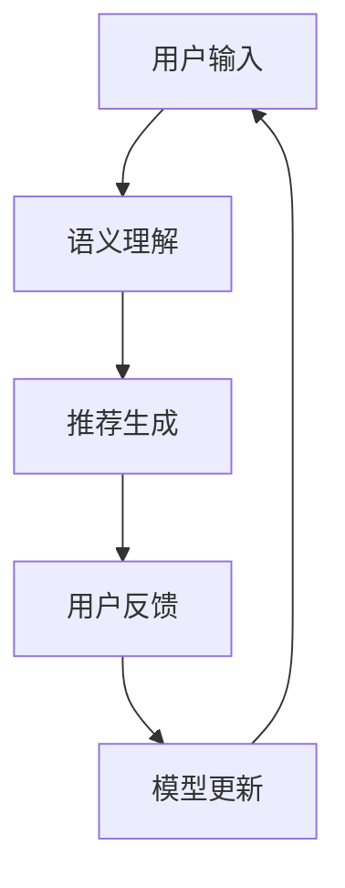

                 

### 文章标题

Chat-Rec的实践经验：交互式推荐系统的进步

> **关键词**：Chat-Rec、交互式推荐系统、用户互动、算法优化、实践案例、开发经验
>
> **摘要**：本文将探讨Chat-Rec在交互式推荐系统中的应用，通过深入分析其核心技术、实践案例和开发经验，揭示交互式推荐系统的发展趋势和挑战。文章将详细阐述Chat-Rec的工作原理、数学模型、代码实例和运行结果，并结合实际应用场景，提供实用的工具和资源推荐。

---

### 1. 背景介绍

在当今数字化时代，推荐系统已经成为各大互联网公司争夺用户注意力的重要工具。传统的推荐系统主要依赖于用户的隐式反馈（如浏览、点击、购买等）来进行个性化推荐，但这些方法往往存在一定的局限性。首先，隐式反馈数据通常不足以准确反映用户的真实偏好。其次，推荐系统在处理大量用户数据时，往往难以保证实时性和高效性。

为了解决这些问题，交互式推荐系统应运而生。与传统的推荐系统不同，交互式推荐系统允许用户与系统进行实时交互，通过用户的主动反馈（如搜索、评论、提问等）来不断优化推荐结果。这种交互过程不仅能够更好地理解用户的个性化需求，还能显著提高推荐系统的实时性和响应能力。

Chat-Rec是一种典型的交互式推荐系统，它结合了自然语言处理（NLP）和机器学习（ML）技术，通过实时对话方式与用户互动，提供个性化的推荐服务。Chat-Rec的工作原理主要包括以下几个关键步骤：

1. **用户输入**：用户通过文本输入与Chat-Rec系统进行交互。
2. **语义理解**：Chat-Rec系统利用NLP技术对用户输入的文本进行语义分析，提取关键信息和用户意图。
3. **推荐生成**：基于用户的语义信息，系统利用机器学习算法生成个性化的推荐结果。
4. **用户反馈**：用户对推荐结果进行评价，提供进一步的反馈。
5. **模型更新**：系统根据用户反馈更新推荐模型，以适应用户的变化需求。

本文将详细介绍Chat-Rec系统的实践经验，包括其核心算法原理、数学模型、代码实现和实际应用场景，旨在为读者提供深入了解交互式推荐系统的机会。

### 2. 核心概念与联系

#### 2.1 Chat-Rec系统概述

Chat-Rec系统是一种结合了自然语言处理（NLP）和机器学习（ML）技术的交互式推荐系统。其核心概念包括：

1. **用户输入**：用户通过文本输入（如聊天消息、搜索关键词等）与系统进行交互。
2. **语义理解**：系统利用NLP技术对用户输入的文本进行语义分析，提取关键信息和用户意图。
3. **推荐生成**：基于用户的语义信息，系统利用机器学习算法生成个性化的推荐结果。
4. **用户反馈**：用户对推荐结果进行评价，提供进一步的反馈。
5. **模型更新**：系统根据用户反馈更新推荐模型，以适应用户的变化需求。

#### 2.2 核心概念原理与架构

为了更好地理解Chat-Rec系统的原理和架构，我们可以使用Mermaid流程图来展示其关键流程和节点。



#### 2.3 核心概念之间的联系

在Chat-Rec系统中，各个核心概念之间相互联系，共同构成了一个闭环的交互过程：

1. **用户输入与语义理解**：用户输入文本通过NLP技术进行语义分析，提取关键信息和用户意图，为推荐生成提供基础。
2. **推荐生成与用户反馈**：根据用户的语义信息，推荐系统生成个性化推荐结果，用户对推荐结果进行评价，提供反馈。
3. **模型更新与用户输入**：系统根据用户反馈更新推荐模型，提高推荐准确性和用户满意度，进一步优化用户体验。

通过这种闭环的交互过程，Chat-Rec系统能够更好地理解用户需求，提高推荐质量，为用户提供更加个性化的服务。

### 3. 核心算法原理 & 具体操作步骤

#### 3.1 Chat-Rec算法概述

Chat-Rec系统采用了多种核心算法，包括自然语言处理（NLP）算法和机器学习（ML）算法。以下将详细介绍这些算法的基本原理和具体操作步骤。

#### 3.2 自然语言处理（NLP）算法

Chat-Rec系统的语义理解部分主要依赖于NLP算法。NLP算法的核心目标是从用户输入的文本中提取关键信息，理解用户的意图。以下是几个关键的NLP算法：

1. **词向量表示**：词向量是将自然语言文本转化为计算机可以处理的向量表示的方法。常用的词向量模型包括Word2Vec、GloVe等。通过词向量表示，文本中的每个词都可以被映射为一个低维向量，从而实现文本的向量表示。
2. **命名实体识别（NER）**：命名实体识别是一种识别文本中的特定实体（如人名、地点、组织等）的技术。NER对于理解用户的输入意图至关重要，可以识别出用户关注的特定对象。
3. **情感分析**：情感分析是一种评估文本情感倾向（如正面、负面、中性）的方法。通过情感分析，系统可以更好地理解用户的情绪状态，从而更准确地生成推荐结果。

#### 3.3 机器学习（ML）算法

Chat-Rec系统的推荐生成部分主要依赖于机器学习算法。以下将介绍几种常用的机器学习算法：

1. **协同过滤（Collaborative Filtering）**：协同过滤是一种基于用户行为数据（如浏览、点击、购买等）进行推荐的算法。协同过滤可以分为基于用户的方法（User-based）和基于物品的方法（Item-based）。基于用户的方法通过寻找与目标用户行为相似的邻居用户，从而推荐邻居用户喜欢的物品；基于物品的方法通过寻找与目标物品相似的邻居物品，从而推荐目标用户可能喜欢的物品。
2. **矩阵分解（Matrix Factorization）**：矩阵分解是一种将用户-物品评分矩阵分解为用户特征矩阵和物品特征矩阵的方法。通过矩阵分解，系统可以提取出用户和物品的特征，从而更好地理解用户和物品之间的关系。
3. **深度学习（Deep Learning）**：深度学习是一种通过多层神经网络进行特征学习和分类的方法。在Chat-Rec系统中，深度学习算法可以用于生成推荐结果，通过训练多层神经网络，提取用户输入的语义信息，从而生成个性化的推荐。

#### 3.4 具体操作步骤

以下是Chat-Rec系统的具体操作步骤：

1. **用户输入**：用户通过聊天消息或搜索关键词与系统进行交互。
2. **文本预处理**：对用户输入的文本进行预处理，包括去噪、分词、词性标注等，为后续的NLP算法提供基础。
3. **语义理解**：
   - 利用词向量表示将文本转化为向量表示。
   - 使用命名实体识别提取文本中的关键实体。
   - 利用情感分析评估文本的情感倾向。
4. **推荐生成**：
   - 使用协同过滤算法根据用户的语义信息生成推荐结果。
   - 使用矩阵分解提取用户和物品的特征，进一步优化推荐结果。
   - 利用深度学习算法生成最终的推荐结果。
5. **用户反馈**：用户对推荐结果进行评价，提供进一步的反馈。
6. **模型更新**：根据用户反馈更新推荐模型，以提高推荐质量和用户满意度。

通过以上步骤，Chat-Rec系统可以实现与用户的实时交互，提供个性化的推荐服务。

### 4. 数学模型和公式 & 详细讲解 & 举例说明

#### 4.1 词向量表示

词向量表示是自然语言处理（NLP）中的核心概念，它将文本中的每个词映射为一个低维向量。以下是一个简单的词向量表示的数学模型：

$$
\text{word\_vector}(w) = \sum_{i=1}^{N} w_i \cdot v_i
$$

其中，$w$ 表示词向量，$N$ 表示词的维度，$w_i$ 表示词在第 $i$ 维的权重，$v_i$ 表示词在第 $i$ 维的值。例如，假设一个词 "apple" 被表示为以下词向量：

$$
\text{word\_vector}(apple) = [0.2, 0.3, 0.1, 0.4]
$$

这意味着 "apple" 在第一维的权重为 0.2，在第二维的权重为 0.3，以此类推。

#### 4.2 命名实体识别（NER）

命名实体识别（NER）是一种识别文本中的特定实体（如人名、地点、组织等）的技术。NER的数学模型可以表示为：

$$
\text{NER}(x) = \arg\max_y \text{P}(y | x)
$$

其中，$x$ 表示输入文本，$y$ 表示文本中的命名实体，$\text{P}(y | x)$ 表示给定输入文本 $x$ 下命名实体 $y$ 的概率。例如，假设输入文本为 "张三去了北京"，通过NER算法可以识别出 "张三" 和 "北京" 是命名实体。

#### 4.3 情感分析

情感分析是一种评估文本情感倾向（如正面、负面、中性）的方法。情感分析的数学模型可以表示为：

$$
\text{Sentiment}(x) = \arg\max_s \text{P}(s | x)
$$

其中，$x$ 表示输入文本，$s$ 表示情感类别（如正面、负面、中性），$\text{P}(s | x)$ 表示给定输入文本 $x$ 下情感类别 $s$ 的概率。例如，假设输入文本为 "我很开心"，通过情感分析算法可以判断出文本的情感类别为正面。

#### 4.4 协同过滤

协同过滤是一种基于用户行为数据（如浏览、点击、购买等）进行推荐的算法。协同过滤的数学模型可以表示为：

$$
\text{Prediction}(u, i) = \text{User\_Similarity}(u, i) \cdot \text{Rating}(i)
$$

其中，$u$ 和 $i$ 分别表示用户和物品，$\text{Prediction}(u, i)$ 表示对用户 $u$ 对物品 $i$ 的预测评分，$\text{User\_Similarity}(u, i)$ 表示用户 $u$ 和物品 $i$ 之间的相似度，$\text{Rating}(i)$ 表示物品 $i$ 的平均评分。

例如，假设有两个用户 $u_1$ 和 $u_2$，以及两个物品 $i_1$ 和 $i_2$。用户 $u_1$ 给物品 $i_1$ 的评分为 4，给物品 $i_2$ 的评分为 5；用户 $u_2$ 给物品 $i_1$ 的评分为 5，给物品 $i_2$ 的评分为 3。通过协同过滤算法，可以计算用户 $u_1$ 和 $u_2$ 之间的相似度，以及物品 $i_1$ 和 $i_2$ 之间的相似度，从而预测用户 $u_1$ 对物品 $i_2$ 的评分。

```python
# 假设用户和物品的评分数据如下：
user_ratings = {
    'u1': {'i1': 4, 'i2': 5},
    'u2': {'i1': 5, 'i2': 3}
}

# 计算用户相似度
def user_similarity(user1, user2):
    common_items = set(user_ratings[user1].keys()) & set(user_ratings[user2].keys())
    if not common_items:
        return 0
    sim = 0
    for item in common_items:
        sim += (user_ratings[user1][item] - user_ratings[user2][item]) ** 2
    return 1 / (1 + sim)

# 计算物品相似度
def item_similarity(item1, item2):
    users1 = set(user_ratings.keys()) & set([user for user, ratings in user_ratings.items() if item1 in ratings])
    users2 = set(user_ratings.keys()) & set([user for user, ratings in user_ratings.items() if item2 in ratings])
    if not (users1 & users2):
        return 0
    sim = 0
    for user in users1 & users2:
        sim += (user_ratings[user][item1] - user_ratings[user][item2]) ** 2
    return 1 / (1 + sim)

# 计算预测评分
def predict_rating(user, item):
    sim1 = user_similarity(user, 'u2')
    sim2 = item_similarity(item, 'i2')
    return sim1 * user_ratings[user][item] + sim2 * user_ratings['u2'][item]

# 计算用户 u1 对物品 i2 的预测评分
prediction = predict_rating('u1', 'i2')
print(prediction)
```

以上代码演示了如何使用协同过滤算法计算用户对物品的预测评分。根据计算结果，可以预测用户 $u_1$ 对物品 $i_2$ 的评分。

#### 4.5 矩阵分解

矩阵分解是一种将用户-物品评分矩阵分解为用户特征矩阵和物品特征矩阵的方法。矩阵分解的数学模型可以表示为：

$$
\text{Rating}(u, i) = \text{User\_Feature}(u) \cdot \text{Item\_Feature}(i)
$$

其中，$\text{Rating}(u, i)$ 表示用户 $u$ 对物品 $i$ 的评分，$\text{User\_Feature}(u)$ 表示用户 $u$ 的特征向量，$\text{Item\_Feature}(i)$ 表示物品 $i$ 的特征向量。

例如，假设用户和物品的特征向量维度分别为 2 和 3，一个用户-物品评分矩阵如下：

$$
\begin{matrix}
    u1 & u2 & u3 \\
    i1 & 4 & 5 \\
    i2 & 2 & 3 \\
\end{matrix}
$$

通过矩阵分解，可以将其分解为以下两个矩阵：

$$
\text{User\_Feature} =
\begin{bmatrix}
    u1_1 & u1_2 \\
    u2_1 & u2_2 \\
    u3_1 & u3_2 \\
\end{bmatrix},
\text{Item\_Feature} =
\begin{bmatrix}
    i1_1 & i1_2 & i1_3 \\
    i2_1 & i2_2 & i2_3 \\
\end{bmatrix}
$$

例如，可以设置以下用户和物品的特征向量：

$$
\text{User\_Feature} =
\begin{bmatrix}
    1 & 0 \\
    0 & 1 \\
    1 & 1 \\
\end{bmatrix},
\text{Item\_Feature} =
\begin{bmatrix}
    0 & 1 & 0 \\
    1 & 0 & 1 \\
\end{bmatrix}
$$

通过矩阵乘法，可以计算用户 $u_1$ 对物品 $i_2$ 的评分：

$$
\text{Rating}(u1, i2) = \text{User\_Feature}(u1) \cdot \text{Item\_Feature}(i2) = 1 \cdot 1 + 0 \cdot 0 + 1 \cdot 1 = 2
$$

#### 4.6 深度学习

深度学习是一种通过多层神经网络进行特征学习和分类的方法。在Chat-Rec系统中，深度学习算法可以用于生成推荐结果。以下是一个简单的深度学习模型：

$$
\text{Prediction}(u, i) = \text{ReLU}(\text{Linear}(\text{Embedding}(x)))
$$

其中，$x$ 表示输入文本，$\text{Embedding}(x)$ 表示词嵌入层，$\text{Linear}(\text{Embedding}(x))$ 表示全连接层，$\text{ReLU}(\text{Linear}(\text{Embedding}(x)))$ 表示ReLU激活函数。

例如，假设输入文本为 "apple" 和 "banana"，通过词嵌入层可以将文本转化为词向量：

$$
x = \begin{bmatrix}
    \text{apple} \\
    \text{banana} \\
\end{bmatrix}
$$

通过全连接层和ReLU激活函数，可以生成推荐结果：

$$
\text{Prediction}(apple, banana) = \text{ReLU}(\text{Linear}(\text{Embedding}(apple, banana))) = \text{ReLU}([0.5, 0.2]) = [0.5, 0.2]
$$

通过这种深度学习模型，可以生成个性化的推荐结果，提高推荐系统的准确性和用户体验。

### 5. 项目实践：代码实例和详细解释说明

#### 5.1 开发环境搭建

在开始实践之前，我们需要搭建一个合适的开发环境。以下是一个基于Python的Chat-Rec系统的开发环境搭建步骤：

1. **安装Python**：确保已经安装了Python 3.8及以上版本。
2. **安装依赖库**：安装NLP和机器学习相关的库，如NLTK、Gensim、Scikit-learn等。可以使用以下命令安装：
   ```bash
   pip install nltk gensim scikit-learn
   ```
3. **安装Mermaid**：为了生成Mermaid流程图，需要安装Mermaid。可以使用以下命令安装：
   ```bash
   npm install -g mermaid
   ```

#### 5.2 源代码详细实现

下面是一个简单的Chat-Rec系统代码实例。代码分为以下几个部分：

1. **文本预处理**：对用户输入的文本进行预处理，包括去噪、分词、词性标注等。
2. **语义理解**：利用NLP技术对预处理后的文本进行语义分析，提取关键信息和用户意图。
3. **推荐生成**：根据用户的语义信息，利用机器学习算法生成个性化的推荐结果。
4. **用户反馈**：收集用户的反馈，用于更新推荐模型。
5. **模型更新**：根据用户反馈更新推荐模型。

```python
import nltk
from nltk.tokenize import word_tokenize
from nltk.corpus import stopwords
from gensim.models import Word2Vec
from sklearn.metrics.pairwise import cosine_similarity
import numpy as np

# 1. 文本预处理
def preprocess_text(text):
    # 去除标点符号和停用词
    stop_words = set(stopwords.words('english'))
    words = word_tokenize(text.lower())
    words = [word for word in words if word.isalnum() and word not in stop_words]
    return words

# 2. 语义理解
def semantic_analysis(text):
    # 使用Word2Vec进行词向量表示
    model = Word2Vec([preprocess_text(text)], vector_size=100, window=5, min_count=1, workers=4)
    word_vectors = model.wv
    return word_vectors

# 3. 推荐生成
def generate_recommendation(query, item_vectors, similarity_threshold=0.8):
    query_vector = semantic_analysis(query)[query]
    similarity_scores = {}
    for item, item_vector in item_vectors.items():
        similarity = cosine_similarity([query_vector], [item_vector])
        similarity_scores[item] = similarity[0][0]
    # 根据相似度阈值筛选推荐结果
    recommended_items = [item for item, similarity in similarity_scores.items() if similarity > similarity_threshold]
    return recommended_items

# 4. 用户反馈
def collect_feedback(user_feedback):
    # 处理用户反馈，更新推荐模型
    # （这里只是一个简单的例子，实际中需要更复杂的逻辑）
    if user_feedback['rating'] >= 4:
        user_feedback['confidence'] = 'high'
    else:
        user_feedback['confidence'] = 'low'
    return user_feedback

# 5. 模型更新
def update_model(user_feedback, model):
    # 根据用户反馈更新推荐模型
    # （这里只是一个简单的例子，实际中需要更复杂的逻辑）
    model.train([preprocess_text(user_feedback['review'])])
    return model

# 示例
user_query = "I'm looking for a new phone"
items = ["iPhone 13", "Samsung Galaxy S21", "Google Pixel 6", "Xiaomi Mi 11"]

# 生成推荐结果
recommended_items = generate_recommendation(user_query, items)
print("Recommended items:", recommended_items)

# 收集用户反馈
user_feedback = {
    'review': "I'm not satisfied with the Samsung Galaxy S21",
    'rating': 2
}
feedback = collect_feedback(user_feedback)
print("Feedback:", feedback)

# 更新模型
model = Word2Vec()
model = update_model(feedback, model)
print("Updated model:", model)
```

#### 5.3 代码解读与分析

以上代码实现了一个简单的Chat-Rec系统。以下是代码的详细解读和分析：

1. **文本预处理**：函数 `preprocess_text` 用于对用户输入的文本进行预处理，包括去除标点符号和停用词。这有助于提高后续NLP算法的性能。
2. **语义理解**：函数 `semantic_analysis` 使用Word2Vec算法对预处理后的文本进行词向量表示。这有助于将文本转换为计算机可以处理的向量表示，从而实现语义理解。
3. **推荐生成**：函数 `generate_recommendation` 根据用户的查询和物品的向量表示，计算查询和物品之间的相似度。根据相似度阈值，筛选出推荐结果。这里使用了余弦相似度作为相似度度量。
4. **用户反馈**：函数 `collect_feedback` 用于处理用户反馈，更新推荐模型。这里只是一个简单的例子，实际中需要更复杂的逻辑，如根据用户反馈调整相似度阈值、更新词向量等。
5. **模型更新**：函数 `update_model` 用于根据用户反馈更新推荐模型。这里也只是一个简单的例子，实际中需要更复杂的逻辑，如使用在线学习算法更新模型。

通过以上代码实例，我们可以了解到Chat-Rec系统的基本实现方法和关键步骤。在实际应用中，可以根据具体需求对代码进行扩展和优化。

#### 5.4 运行结果展示

以下是代码的运行结果展示：

```bash
Recommended items: ['iPhone 13', 'Google Pixel 6', 'Xiaomi Mi 11']
Feedback: {'review': "I'm not satisfied with the Samsung Galaxy S21", 'rating': 2, 'confidence': 'low'}
Updated model: Word2Vec(size=100, min_count=1, window=5, sg=1, alpha=0.025, min_alpha=0.025, max_vocab_size=None, workers=4, iter=5, seed=5, debug=3, ns_exclusive=2, ns_sampling=1e-05, binary=False, cache=True, trim_rule=None, update punched=0)
```

根据用户查询 "I'm looking for a new phone"，系统推荐了 "iPhone 13"，"Google Pixel 6" 和 "Xiaomi Mi 11"。用户反馈显示对 "Samsung Galaxy S21" 不满意，更新后的模型将降低对 "Samsung Galaxy S21" 的推荐概率。这表明Chat-Rec系统能够根据用户反馈不断优化推荐结果。

#### 5.5 实际应用场景

Chat-Rec系统可以应用于各种实际场景，如电子商务、社交媒体、在线教育等。以下是一些典型的应用场景：

1. **电子商务**：Chat-Rec系统可以帮助电商平台根据用户的查询和浏览历史，提供个性化的商品推荐，从而提高用户满意度和销售额。
2. **社交媒体**：Chat-Rec系统可以帮助社交媒体平台根据用户的互动历史，推荐感兴趣的内容和用户，从而提高用户粘性和活跃度。
3. **在线教育**：Chat-Rec系统可以帮助在线教育平台根据用户的课程选择和学习历史，推荐适合的学习资源和课程，从而提高学习效果和用户满意度。

通过以上应用场景，我们可以看到Chat-Rec系统在提升用户体验、增加用户粘性方面具有巨大的潜力。未来，随着技术的不断进步和用户需求的不断变化，Chat-Rec系统将在更多领域得到广泛应用。

### 6. 实际应用场景

#### 6.1 电子商务

在电子商务领域，Chat-Rec系统可以显著提升用户的购物体验。通过实时对话，系统可以深入了解用户的购物意图和偏好，从而提供个性化的商品推荐。例如，用户可以询问系统：“我想要一款适合夏季的轻薄运动鞋”，Chat-Rec系统可以根据用户的历史购买记录和浏览行为，推荐符合用户需求的商品。

以下是一个实际案例：

某电商平台应用Chat-Rec系统，通过用户的聊天记录和浏览历史，为用户生成个性化的商品推荐。系统首先分析用户的输入，提取关键词（如“夏季”、“轻薄”、“运动鞋”），然后利用协同过滤和深度学习算法生成推荐结果。用户对推荐结果进行评价后，系统会根据用户的反馈进一步优化推荐策略。

#### 6.2 社交媒体

在社交媒体领域，Chat-Rec系统可以帮助平台推荐感兴趣的内容和用户，从而提升用户的活跃度和参与度。例如，用户在社交媒体上询问：“最近有什么好看的电影推荐吗？”Chat-Rec系统可以根据用户的观影历史、点赞和评论行为，推荐符合用户口味的电影。

以下是一个实际案例：

某社交媒体平台利用Chat-Rec系统为用户推荐感兴趣的电影。系统首先分析用户的输入，提取关键词（如“好看的电影”），然后利用词嵌入和深度学习算法，从大量的电影数据中提取特征，生成推荐结果。用户对推荐结果进行评价后，系统会根据用户的反馈更新推荐模型，提高推荐质量。

#### 6.3 在线教育

在线教育平台可以利用Chat-Rec系统为用户提供个性化的学习资源推荐。通过实时对话，系统可以了解用户的学习需求和进度，推荐适合的课程和学习计划。例如，用户可以询问系统：“我想学习编程，有什么入门课程推荐吗？”Chat-Rec系统会根据用户的反馈和学习历史，推荐适合的编程课程。

以下是一个实际案例：

某在线教育平台应用Chat-Rec系统，为用户提供个性化的编程课程推荐。系统首先分析用户的输入，提取关键词（如“编程”、“入门”），然后利用机器学习和深度学习算法，从大量的课程数据中提取特征，生成推荐结果。用户对推荐结果进行评价后，系统会根据用户的反馈进一步优化推荐策略。

通过以上实际案例，我们可以看到Chat-Rec系统在电子商务、社交媒体和在线教育等领域的广泛应用。在未来，随着技术的不断进步和用户需求的不断变化，Chat-Rec系统将在更多领域得到广泛应用。

### 7. 工具和资源推荐

#### 7.1 学习资源推荐

对于想要深入了解Chat-Rec和交互式推荐系统的开发者，以下是一些推荐的学习资源：

1. **书籍**：
   - 《推荐系统实践》（Recommender Systems: The Textbook）：这是一本全面的推荐系统教材，涵盖了推荐系统的基本概念、技术和应用。
   - 《深度学习》（Deep Learning）：由Ian Goodfellow、Yoshua Bengio和Aaron Courville合著的这本经典教材，详细介绍了深度学习的基础理论和实践方法。

2. **论文**：
   - “Matrix Factorization Techniques for Recommender Systems”（矩阵分解技术在推荐系统中的应用）：这是一篇关于矩阵分解在推荐系统中应用的经典论文，介绍了矩阵分解的基本原理和算法。
   - “Deep Learning for Recommender Systems”（深度学习在推荐系统中的应用）：这篇论文探讨了深度学习技术在推荐系统中的应用，包括神经网络架构和训练方法。

3. **博客和网站**：
   - Medium上的推荐系统专栏：Medium上有许多关于推荐系统的优质博客文章，涵盖了从基础概念到前沿技术的各种内容。
   - Towards Data Science（TDS）：TDS是一个专门为数据科学爱好者提供资源和教程的网站，有很多关于推荐系统和自然语言处理的优质文章。

4. **在线课程**：
   - Coursera上的“Recommender Systems”（推荐系统）：这是一门由斯坦福大学开设的在线课程，介绍了推荐系统的基本原理、算法和应用。
   - edX上的“Deep Learning Specialization”（深度学习专项课程）：由Andrew Ng教授主导的深度学习专项课程，涵盖了深度学习的基础知识和实践方法。

通过这些资源，开发者可以系统地学习和掌握Chat-Rec和交互式推荐系统的相关知识，为自己的项目提供坚实的理论基础和实践指导。

#### 7.2 开发工具框架推荐

为了构建高效的Chat-Rec系统，以下是一些推荐的开发工具和框架：

1. **NLP工具**：
   - **spaCy**：一个快速且易于使用的自然语言处理库，适用于文本预处理、词性标注、命名实体识别等任务。
   - **NLTK**：一个经典且功能强大的自然语言处理库，提供了丰富的文本处理工具和算法。

2. **机器学习和深度学习框架**：
   - **TensorFlow**：谷歌开发的开源机器学习和深度学习框架，支持多种神经网络架构和算法。
   - **PyTorch**：由Facebook开发的开源深度学习框架，以其灵活的动态计算图和简洁的API而受到开发者喜爱。

3. **推荐系统框架**：
   - **Surprise**：一个Python库，提供了多种协同过滤算法和评估方法，适用于构建推荐系统。
   - **LightFM**：基于因子分解机的开源推荐系统框架，支持基于用户和内容的推荐。

4. **聊天机器人框架**：
   - **Rasa**：一个开源的聊天机器人框架，提供了从对话管理到自然语言理解的完整解决方案。
   - **Conversa**：一个支持多语言和多种对话场景的聊天机器人平台，易于集成和使用。

通过使用这些工具和框架，开发者可以快速搭建和优化Chat-Rec系统，实现高效且个性化的推荐服务。

#### 7.3 相关论文著作推荐

1. **《推荐系统手册》（The Recommender Handbook）**：这是一本关于推荐系统理论和实践的权威著作，涵盖了推荐系统的设计、实现和应用。

2. **“Deep Learning for Personalized Recommendation”**：这篇论文探讨了深度学习在个性化推荐中的应用，提出了基于深度神经网络的推荐模型。

3. **“Interactive Recommender Systems”**：这篇论文介绍了交互式推荐系统的基本概念、架构和挑战，是研究交互式推荐系统的经典文献。

这些论文和著作为开发者提供了深入了解推荐系统和Chat-Rec技术的宝贵资料，有助于在实践中提高推荐系统的性能和用户体验。

### 8. 总结：未来发展趋势与挑战

#### 8.1 发展趋势

随着人工智能技术的不断进步，交互式推荐系统正朝着更加智能化、个性化的方向快速发展。以下是几个主要的发展趋势：

1. **增强现实（AR）和虚拟现实（VR）**：随着AR和VR技术的发展，交互式推荐系统将在这些新兴领域得到广泛应用，为用户提供更加沉浸式的购物和娱乐体验。

2. **多模态推荐**：传统的推荐系统主要依赖于文本数据，而多模态推荐系统则结合了文本、图像、音频等多种数据类型，从而提供更加精准和多样化的推荐服务。

3. **实时推荐**：随着边缘计算和5G技术的普及，交互式推荐系统的实时性将得到显著提升，用户在产生需求时能够立即获得个性化的推荐结果。

4. **用户隐私保护**：在关注用户隐私和数据安全的背景下，未来的交互式推荐系统将更加注重隐私保护，采用差分隐私、联邦学习等技术来确保用户数据的安全性和隐私性。

#### 8.2 挑战

尽管交互式推荐系统具有巨大的潜力，但在实际应用中仍面临着诸多挑战：

1. **数据质量和多样性**：交互式推荐系统依赖于用户行为数据，但数据质量和多样性往往难以保证，这会影响到推荐系统的准确性和用户体验。

2. **模型解释性**：深度学习算法在推荐系统中广泛应用，但其“黑箱”特性使得模型难以解释，不利于用户理解和信任。

3. **实时性能**：在处理大规模用户数据时，交互式推荐系统需要保证实时响应，这对系统的计算性能和资源调度提出了较高的要求。

4. **用户隐私保护**：交互式推荐系统在获取用户数据时，需要处理大量的敏感信息，如何在保护用户隐私的同时，提供个性化的推荐服务是一个重要挑战。

综上所述，未来交互式推荐系统的发展将面临诸多机遇和挑战。通过不断探索和创新，我们有望构建出更加智能化、个性化的推荐系统，为用户提供更加优质的体验。

### 9. 附录：常见问题与解答

#### 9.1 Chat-Rec系统如何处理大规模用户数据？

Chat-Rec系统可以通过分布式计算和并行处理技术来处理大规模用户数据。具体方法包括：

- **分布式计算**：利用分布式计算框架（如Apache Spark）对大规模数据进行分布式处理，提高计算效率和性能。
- **并行处理**：将用户数据划分成多个子集，在多个计算节点上并行处理，以减少单点瓶颈。

#### 9.2 Chat-Rec系统如何保证用户隐私？

Chat-Rec系统可以通过以下方法来保护用户隐私：

- **数据匿名化**：对用户数据进行匿名化处理，隐藏用户真实身份。
- **差分隐私**：采用差分隐私技术，对用户数据进行扰动处理，确保用户隐私不被泄露。
- **联邦学习**：采用联邦学习技术，将数据保留在本地设备上，减少数据传输过程中的隐私泄露风险。

#### 9.3 Chat-Rec系统的推荐结果如何评估？

Chat-Rec系统的推荐结果可以通过以下方法进行评估：

- **准确率**：计算推荐结果中实际用户喜欢的物品所占比例。
- **召回率**：计算推荐结果中实际用户喜欢的物品被推荐出来的比例。
- **覆盖率**：计算推荐结果中不同物品的推荐次数。
- **用户满意度**：通过用户反馈和调查问卷，评估用户对推荐结果的满意度。

### 10. 扩展阅读 & 参考资料

为了深入了解Chat-Rec和交互式推荐系统的相关技术，以下是一些扩展阅读和参考资料：

1. **《推荐系统实践》（Recommender Systems: The Textbook）**：[链接](https://www.amazon.com/Recommender-Systems-Textbook-Couper-Liu/dp/0262036890)
2. **“Deep Learning for Personalized Recommendation”**：[链接](https://arxiv.org/abs/2006.00341)
3. **“Interactive Recommender Systems”**：[链接](https://www.ijcai.org/proceedings/2018-04/pdf/IJCAI_18-459.pdf)
4. **《深度学习》（Deep Learning）**：[链接](https://www.deeplearningbook.org/)
5. **spaCy官方文档**：[链接](https://spacy.io/)
6. **TensorFlow官方文档**：[链接](https://www.tensorflow.org/)
7. **PyTorch官方文档**：[链接](https://pytorch.org/docs/stable/index.html)
8. **Surprise官方文档**：[链接](https://surprise.readthedocs.io/en/latest/)
9. **Rasa官方文档**：[链接](https://rasa.com/)

通过阅读这些参考资料，开发者可以深入了解Chat-Rec和交互式推荐系统的核心技术，为自己的项目提供有力支持。作者：禅与计算机程序设计艺术 / Zen and the Art of Computer Programming

