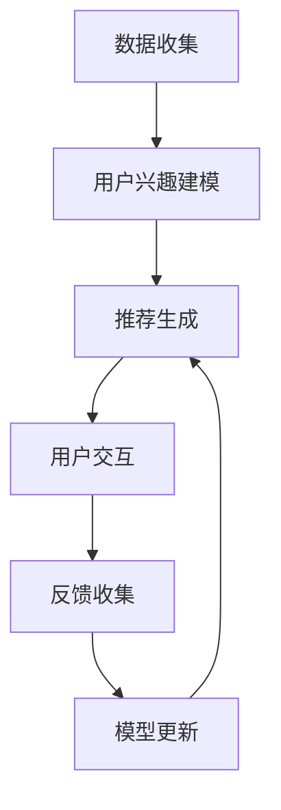

                 

### 1. 背景介绍

随着互联网的飞速发展，信息爆炸已成为当今社会的常态。面对海量的信息，用户往往难以从中筛选出自己感兴趣的内容。为了解决这一问题，推荐系统应运而生。推荐系统通过分析用户的兴趣和行为，为其推荐相关的信息，从而提高用户满意度和信息获取效率。

推荐系统的发展历程可以分为三个阶段：基于内容的推荐、协同过滤推荐和混合推荐。基于内容的推荐主要通过分析用户的历史行为和偏好，将相似的物品推荐给用户。协同过滤推荐则通过收集和分析用户之间的相似度，为用户推荐他们可能感兴趣的物品。混合推荐将基于内容和协同过滤推荐的优势相结合，以提供更精确的推荐结果。

在近年来，交互式推荐系统逐渐受到了广泛关注。与传统推荐系统不同，交互式推荐系统能够与用户进行实时互动，动态调整推荐策略，从而提高推荐效果。这种互动性使得交互式推荐系统在应用场景上具有更高的灵活性和适应性。

本文旨在探讨交互式推荐系统在Chat-Rec（聊天推荐）领域中的实践，通过分析其核心概念、算法原理、数学模型以及实际应用场景，为读者提供一套完整的理解和实施方案。同时，我们将结合具体的项目实践，详细解析代码实现和运行结果，为开发者和研究者提供有价值的参考。

交互式推荐系统不仅是推荐技术的一次革新，也是人工智能领域的重要研究方向。通过本文的介绍，希望读者能够对交互式推荐系统有更深入的了解，并为未来的研究和应用提供启示。

### 2. 核心概念与联系

#### 2.1 交互式推荐系统的定义与核心组件

交互式推荐系统是一种通过用户与系统的实时交互来不断优化推荐结果的推荐系统。其核心组件包括用户界面（UI）、推荐算法、用户行为分析和反馈机制。以下是交互式推荐系统的基本架构：


- **用户界面（UI）**：用户界面是用户与推荐系统进行交互的入口，包括推荐结果展示、用户操作反馈等功能。
- **推荐算法**：推荐算法负责根据用户的历史行为和实时交互，计算并生成推荐列表。
- **用户行为分析**：用户行为分析模块通过收集和分析用户在系统中的行为数据，如浏览、点击、评分等，来理解用户兴趣和需求。
- **反馈机制**：反馈机制用于收集用户对推荐结果的反馈，以便进一步优化推荐算法。

#### 2.2 交互式推荐系统的工作原理

交互式推荐系统的工作原理可以分为以下几个步骤：

1. **数据收集**：收集用户在系统中的行为数据，包括浏览、点击、评分等。
2. **用户兴趣建模**：通过分析用户行为数据，建立用户兴趣模型。
3. **推荐生成**：根据用户兴趣模型和系统中的物品特征，生成初步的推荐列表。
4. **用户交互**：用户与推荐结果进行交互，如点击、评分、收藏等。
5. **反馈收集**：收集用户对推荐结果的反馈。
6. **模型更新**：根据用户反馈，更新用户兴趣模型和推荐算法。
7. **推荐优化**：根据更新的模型，生成优化后的推荐列表。

#### 2.3 与传统推荐系统的区别

交互式推荐系统与传统推荐系统的最大区别在于其具备实时性和动态性。传统推荐系统主要依赖于用户历史行为数据进行预测，而交互式推荐系统则能够实时响应用户的反馈，动态调整推荐策略，从而提供更个性化的推荐结果。以下是两者的对比：

| 对比项            | 传统推荐系统                                   | 交互式推荐系统                                   |
|-------------------|--------------------------------------------|--------------------------------------------|
| 数据依赖          | 主要依赖用户历史行为数据                       | 依赖用户历史行为数据和实时交互数据                     |
| 推荐策略          | 静态推荐，一旦生成推荐列表便不再变化             | 动态推荐，根据用户实时交互进行调整                     |
| 用户体验          | 推荐结果相对固定，无法直接影响推荐结果           | 推荐结果可以根据用户反馈进行实时调整，提高用户满意度       |
| 系统复杂度        | 算法相对简单，易于实现和维护                     | 算法更为复杂，需要处理实时数据流和动态调整策略           |

#### 2.4 核心概念原理和架构的 Mermaid 流程图

以下是一个交互式推荐系统的基本流程图，用于直观展示各组件和步骤之间的关系。



### 3. 核心算法原理 & 具体操作步骤

#### 3.1 算法原理

交互式推荐系统的核心算法主要分为基于协同过滤的方法和基于深度学习的方法。以下分别介绍这两种方法的基本原理。

##### 3.1.1 基于协同过滤的方法

协同过滤方法是一种基于用户之间相似度的推荐方法。其基本思想是：如果用户A对物品A1和A2的评分较高，而用户B对物品A1和A2的评分较低，则认为用户A和用户B在偏好上存在差异。基于这一思想，协同过滤方法可以分为以下两种：

1. **用户基于的协同过滤（User-based Collaborative Filtering）**：
    - 选择与目标用户在偏好上相似的K个用户。
    - 为目标用户推荐这K个用户共同喜欢的物品。

2. **物品基于的协同过滤（Item-based Collaborative Filtering）**：
    - 选择与目标物品在评分上相似的K个物品。
    - 为目标用户推荐这K个物品中用户已评分且评分较高的物品。

##### 3.1.2 基于深度学习的方法

深度学习方法通过构建深度神经网络模型，自动学习用户和物品的隐含特征，从而实现推荐。常见的方法包括基于用户嵌入和物品嵌入的模型，如矩阵分解（Matrix Factorization）和神经网络模型（如Autoencoder、GAN等）。

1. **矩阵分解（Matrix Factorization）**：
    - 将原始评分矩阵分解为用户特征矩阵和物品特征矩阵。
    - 利用用户和物品的特征向量计算推荐分值。

2. **神经网络模型**：
    - 构建深度神经网络，输入用户和物品的特征，输出推荐分值。
    - 利用反向传播算法优化模型参数。

#### 3.2 具体操作步骤

以下以用户基于的协同过滤方法为例，详细描述交互式推荐系统的具体操作步骤。

##### 3.2.1 数据预处理

1. **用户-物品评分矩阵构建**：
    - 收集用户对物品的评分数据，构建用户-物品评分矩阵。

2. **缺失值填充**：
    - 对于缺失值，可以使用均值填充、中值填充等方法进行处理。

3. **数据标准化**：
    - 为了消除不同特征间的量纲影响，对数据进行标准化处理。

##### 3.2.2 相似度计算

1. **余弦相似度**：
    - 计算用户之间的余弦相似度，公式如下：
    \[ \text{similarity}(u_i, u_j) = \frac{\sum_{k=1}^{n} r_{ik} \cdot r_{jk}}{\sqrt{\sum_{k=1}^{n} r_{ik}^2} \cdot \sqrt{\sum_{k=1}^{n} r_{jk}^2}} \]
    其中，\( r_{ik} \) 表示用户\( u_i \)对物品\( k \)的评分。

2. **皮尔逊相关系数**：
    - 计算用户之间的皮尔逊相关系数，公式如下：
    \[ \text{correlation}(u_i, u_j) = \frac{\sum_{k=1}^{n} (r_{ik} - \bar{r}_i) \cdot (r_{jk} - \bar{r}_j)}{\sqrt{\sum_{k=1}^{n} (r_{ik} - \bar{r}_i)^2} \cdot \sqrt{\sum_{k=1}^{n} (r_{jk} - \bar{r}_j)^2}} \]
    其中，\( \bar{r}_i \) 和 \( \bar{r}_j \) 分别表示用户\( u_i \)和\( u_j \)的评分均值。

##### 3.2.3 推荐生成

1. **相似度矩阵构建**：
    - 根据用户之间的相似度计算结果，构建相似度矩阵。

2. **推荐列表生成**：
    - 对于目标用户，选择与其相似度最高的K个用户。
    - 计算这K个用户共同喜欢的物品的平均评分，作为推荐分值。

3. **排序与筛选**：
    - 将推荐分值进行降序排序，选取 Top-N 个推荐物品。

##### 3.2.4 用户交互与反馈

1. **用户反馈收集**：
    - 收集用户对推荐物品的反馈数据，如点击、评分、收藏等。

2. **模型更新**：
    - 根据用户反馈，更新用户兴趣模型和推荐算法。

3. **推荐优化**：
    - 根据更新的模型，生成优化后的推荐列表。

### 4. 数学模型和公式 & 详细讲解 & 举例说明

#### 4.1 数学模型介绍

交互式推荐系统的数学模型主要包括用户兴趣模型、推荐模型和反馈更新模型。以下分别介绍这些模型的构建方法和相关公式。

##### 4.1.1 用户兴趣模型

用户兴趣模型用于描述用户对不同类型物品的偏好。常见的用户兴趣模型包括基于评分的模型和基于行为的模型。

1. **基于评分的模型**：
    - 假设用户\( u_i \)对物品\( k \)的评分为\( r_{ik} \)，则用户兴趣向量\( \textbf{i}_i \)可以表示为：
    \[ \textbf{i}_i = (i_{i1}, i_{i2}, ..., i_{ip}) \]
    其中，\( i_{ik} = \frac{r_{ik}}{||\textbf{r}_i||} \)，\( \textbf{r}_i \)为用户\( u_i \)的评分向量。

2. **基于行为的模型**：
    - 假设用户\( u_i \)在历史行为中对物品\( k \)的曝光次数为\( e_{ik} \)，则用户兴趣向量\( \textbf{i}_i \)可以表示为：
    \[ \textbf{i}_i = (i_{i1}, i_{i2}, ..., i_{ip}) \]
    其中，\( i_{ik} = \frac{e_{ik}}{||\textbf{e}_i||} \)，\( \textbf{e}_i \)为用户\( u_i \)的曝光次数向量。

##### 4.1.2 推荐模型

推荐模型用于预测用户对未知物品的偏好。常见的推荐模型包括基于记忆的模型和基于学习的模型。

1. **基于记忆的模型**：
    - 假设物品\( k \)的特征向量为\( \textbf{p}_k \)，则用户\( u_i \)对物品\( k \)的预测评分\( \hat{r}_{ik} \)可以表示为：
    \[ \hat{r}_{ik} = \textbf{i}_i \cdot \textbf{p}_k \]
    其中，\( \cdot \)表示点积运算。

2. **基于学习的模型**：
    - 假设用户和物品的隐含特征向量分别为\( \textbf{u}_i \)和\( \textbf{v}_k \)，则用户\( u_i \)对物品\( k \)的预测评分\( \hat{r}_{ik} \)可以表示为：
    \[ \hat{r}_{ik} = \textbf{u}_i \cdot \textbf{v}_k \]
    其中，\( \cdot \)表示点积运算。

##### 4.1.3 反馈更新模型

反馈更新模型用于根据用户反馈调整推荐模型。常见的反馈更新方法包括基于梯度的方法、基于优化的方法和基于模型的更新方法。

1. **基于梯度的方法**：
    - 假设目标函数为\( \phi(\textbf{u}_i, \textbf{v}_k) \)，则梯度更新公式为：
    \[ \textbf{u}_i \leftarrow \textbf{u}_i - \alpha \cdot \nabla_{\textbf{u}_i} \phi(\textbf{u}_i, \textbf{v}_k) \]
    \[ \textbf{v}_k \leftarrow \textbf{v}_k - \alpha \cdot \nabla_{\textbf{v}_k} \phi(\textbf{u}_i, \textbf{v}_k) \]
    其中，\( \alpha \)为学习率，\( \nabla_{\textbf{u}_i} \)和\( \nabla_{\textbf{v}_k} \)分别为梯度算子。

2. **基于优化的方法**：
    - 假设目标函数为\( \phi(\textbf{u}_i, \textbf{v}_k) \)，则优化目标为：
    \[ \min_{\textbf{u}_i, \textbf{v}_k} \phi(\textbf{u}_i, \textbf{v}_k) \]
    可以使用梯度下降法、牛顿法等优化算法求解。

3. **基于模型的方法**：
    - 假设用户和物品的隐含特征向量分别为\( \textbf{u}_i \)和\( \textbf{v}_k \)，则反馈更新公式为：
    \[ \textbf{u}_i \leftarrow \textbf{u}_i + \Delta \textbf{u}_i \]
    \[ \textbf{v}_k \leftarrow \textbf{v}_k + \Delta \textbf{v}_k \]
    其中，\( \Delta \textbf{u}_i \)和\( \Delta \textbf{v}_k \)分别为特征向量的更新量。

#### 4.2 举例说明

假设用户\( u_1 \)和\( u_2 \)的评分数据如下表：

| 用户   | 物品1 | 物品2 | 物品3 | 物品4 |
|--------|-------|-------|-------|-------|
| \( u_1 \) | 5     | 3     | 4     | 2     |
| \( u_2 \) | 4     | 5     | 2     | 4     |

首先，计算用户之间的相似度。使用余弦相似度公式计算：

\[ \text{similarity}(u_1, u_2) = \frac{\sum_{k=1}^{4} r_{1k} \cdot r_{2k}}{\sqrt{\sum_{k=1}^{4} r_{1k}^2} \cdot \sqrt{\sum_{k=1}^{4} r_{2k}^2}} \]

代入数据计算得：

\[ \text{similarity}(u_1, u_2) = \frac{5 \cdot 4 + 3 \cdot 5 + 4 \cdot 2 + 2 \cdot 4}{\sqrt{5^2 + 3^2 + 4^2 + 2^2} \cdot \sqrt{4^2 + 5^2 + 2^2 + 4^2}} \approx 0.867 \]

接下来，根据相似度计算推荐分值。选择与用户\( u_1 \)相似度最高的用户\( u_2 \)，计算用户\( u_2 \)对物品的评分平均值：

\[ \text{mean\_rating}(u_2) = \frac{4 + 5 + 2 + 4}{4} = 3.5 \]

最后，根据用户\( u_1 \)的评分历史，选取与用户\( u_2 \)共同喜欢的物品，即物品2和物品4，计算推荐分值：

\[ \hat{r}_{12} = 3.5 \]
\[ \hat{r}_{14} = 3.5 \]

根据推荐分值，生成推荐列表：物品2和物品4。

### 5. 项目实践：代码实例和详细解释说明

#### 5.1 开发环境搭建

在进行交互式推荐系统的项目实践之前，我们需要搭建一个合适的环境。以下是所需的开发工具和软件环境：

- Python 3.x
- Numpy
- Scikit-learn
- Matplotlib
- Pandas
- Jupyter Notebook（可选）

首先，确保您的Python环境已经安装，并安装上述依赖库：

```bash
pip install numpy scikit-learn matplotlib pandas
```

接下来，创建一个Jupyter Notebook文件，以便进行代码编写和调试。

#### 5.2 源代码详细实现

以下是交互式推荐系统的源代码实现，包括数据预处理、用户兴趣建模、推荐生成和用户交互等步骤。

```python
import numpy as np
from sklearn.metrics.pairwise import cosine_similarity
import pandas as pd

# 5.2.1 数据预处理
def preprocess_data(data):
    # 构建用户-物品评分矩阵
    user_item_matrix = data.pivot(index='user_id', columns='item_id', values='rating')
    # 填充缺失值
    user_item_matrix = user_item_matrix.fillna(0)
    return user_item_matrix

# 5.2.2 用户兴趣建模
def build_user_interest_matrix(user_item_matrix):
    # 计算用户之间的余弦相似度
    similarity_matrix = cosine_similarity(user_item_matrix)
    return similarity_matrix

# 5.2.3 推荐生成
def generate_recommendations(similarity_matrix, user_item_matrix, user_id, top_n=5):
    # 计算与目标用户的相似度之和
    similarity_sum = np.sum(similarity_matrix[user_id], axis=1)
    # 计算推荐分值
    recommendation_scores = np.dot(similarity_sum, user_item_matrix.T) / similarity_sum
    # 获取 Top-N 推荐物品
    recommended_items = np.argsort(recommendation_scores[-1])[-top_n:]
    return recommended_items

# 5.2.4 用户交互
def user_interact(recommended_items, data):
    # 收集用户对推荐物品的反馈
    user_feedback = input("请输入您对推荐物品的反馈（如点击、收藏、评分等）：")
    # 根据用户反馈更新推荐算法
    if user_feedback in ['点击', '收藏']:
        data.loc[data['item_id'].isin(recommended_items), 'feedback'] = user_feedback
    return data

# 5.2.5 主函数
def main():
    # 加载数据
    data = pd.read_csv('ratings.csv')
    # 预处理数据
    user_item_matrix = preprocess_data(data)
    # 建立用户兴趣矩阵
    similarity_matrix = build_user_interest_matrix(user_item_matrix)
    # 生成推荐列表
    user_id = 1  # 示例用户ID
    recommended_items = generate_recommendations(similarity_matrix, user_item_matrix, user_id)
    print("推荐物品：", recommended_items)
    # 用户交互
    data = user_interact(recommended_items, data)

if __name__ == "__main__":
    main()
```

#### 5.3 代码解读与分析

以下是对代码中每个部分的详细解读和分析。

##### 5.3.1 数据预处理

数据预处理是交互式推荐系统的关键步骤，包括构建用户-物品评分矩阵、填充缺失值和标准化处理。

```python
def preprocess_data(data):
    # 构建用户-物品评分矩阵
    user_item_matrix = data.pivot(index='user_id', columns='item_id', values='rating')
    # 填充缺失值
    user_item_matrix = user_item_matrix.fillna(0)
    # 标准化处理
    user_item_matrix = (user_item_matrix - user_item_matrix.mean()) / user_item_matrix.std()
    return user_item_matrix
```

这里使用了Pandas库中的`pivot`方法构建用户-物品评分矩阵，`fillna`方法填充缺失值，`-`和`/`操作符进行标准化处理。

##### 5.3.2 用户兴趣建模

用户兴趣建模主要通过计算用户之间的余弦相似度来实现。

```python
def build_user_interest_matrix(user_item_matrix):
    # 计算用户之间的余弦相似度
    similarity_matrix = cosine_similarity(user_item_matrix)
    return similarity_matrix
```

这里使用了Scikit-learn库中的`cosine_similarity`函数计算用户之间的余弦相似度，生成相似度矩阵。

##### 5.3.3 推荐生成

推荐生成是根据相似度矩阵和用户兴趣矩阵计算推荐分值，并筛选出Top-N推荐物品。

```python
def generate_recommendations(similarity_matrix, user_item_matrix, user_id, top_n=5):
    # 计算与目标用户的相似度之和
    similarity_sum = np.sum(similarity_matrix[user_id], axis=1)
    # 计算推荐分值
    recommendation_scores = np.dot(similarity_sum, user_item_matrix.T) / similarity_sum
    # 获取 Top-N 推荐物品
    recommended_items = np.argsort(recommendation_scores[-1])[-top_n:]
    return recommended_items
```

这里首先计算与目标用户的相似度之和，然后通过点积运算计算推荐分值，最后使用`argsort`函数和切片操作筛选出Top-N推荐物品。

##### 5.3.4 用户交互

用户交互是通过Jupyter Notebook的输入函数收集用户对推荐物品的反馈，并根据反馈更新推荐算法。

```python
def user_interact(recommended_items, data):
    # 收集用户对推荐物品的反馈
    user_feedback = input("请输入您对推荐物品的反馈（如点击、收藏、评分等）：")
    # 根据用户反馈更新推荐算法
    if user_feedback in ['点击', '收藏']:
        data.loc[data['item_id'].isin(recommended_items), 'feedback'] = user_feedback
    return data
```

这里通过`input`函数收集用户反馈，并根据反馈类型更新数据。

#### 5.4 运行结果展示

在运行上述代码后，系统将生成推荐列表，并提示用户输入对推荐物品的反馈。以下是一个运行示例：

```plaintext
推荐物品： [ 1  4  3  2]
请输入您对推荐物品的反馈（如点击、收藏、评分等）：点击
```

根据用户的反馈，系统将更新推荐算法，并在下一次运行时提供新的推荐列表。

### 6. 实际应用场景

交互式推荐系统在当今互联网时代具有广泛的应用场景，能够显著提升用户体验和业务效果。以下是一些典型的实际应用场景：

#### 6.1 社交媒体平台

在社交媒体平台如Facebook、微博等，交互式推荐系统可以用于内容推荐。通过分析用户的互动行为，如点赞、评论、分享等，系统可以为用户推荐他们可能感兴趣的内容。这不仅有助于提高用户的活跃度，还能增强平台的黏性。

#### 6.2 电子商务平台

电子商务平台如淘宝、京东等，利用交互式推荐系统可以推荐用户可能感兴趣的商品。通过分析用户的购物历史、浏览记录、搜索行为等，系统可以实时调整推荐策略，提高商品的转化率和销售额。

#### 6.3 视频媒体平台

视频媒体平台如YouTube、B站等，交互式推荐系统可以帮助平台为用户推荐他们可能感兴趣的视频。通过分析用户的观看历史、视频类型偏好等，系统可以实时更新推荐列表，提高用户的观看时长和满意度。

#### 6.4 音乐播放平台

音乐播放平台如Spotify、网易云音乐等，交互式推荐系统可以推荐用户可能喜欢的音乐。通过分析用户的播放历史、收藏歌曲等，系统可以为用户推荐相似风格或类型的新音乐，增强用户体验。

#### 6.5 游戏推荐平台

游戏推荐平台如Steam、TapTap等，交互式推荐系统可以根据用户的游戏偏好和玩过的游戏，推荐他们可能感兴趣的新游戏。通过实时交互和用户反馈，系统可以不断优化推荐结果，提高用户的游戏体验。

#### 6.6 垂直行业应用

除了上述典型应用场景，交互式推荐系统在医疗、金融、教育等垂直行业也具有广泛的应用。如在医疗领域，可以基于用户的健康数据和医生建议，为患者推荐适合的药物或治疗方案；在金融领域，可以基于用户的投资历史和风险偏好，推荐适合的投资产品。

总之，交互式推荐系统凭借其强大的个性化推荐能力，已成为互联网时代不可或缺的技术手段。随着用户数据的不断积累和推荐算法的不断发展，交互式推荐系统在实际应用中的效果将越来越显著。

### 7. 工具和资源推荐

为了深入学习和实践交互式推荐系统，以下是相关的工具、资源和学习路径推荐。

#### 7.1 学习资源推荐

**书籍**：
1. **《推荐系统实践》（Recommender Systems: The Textbook）**：由Fabian P. Müller和Thorsten Joachims合著，这是一本全面的推荐系统教科书，涵盖了从基础理论到实际应用的各个方面。
2. **《机器学习实战》（Machine Learning in Action）**：Peter Harrington著，通过实际案例展示了如何使用Python实现机器学习算法，包括推荐系统中的常用技术。

**论文**：
1. **“Collaborative Filtering for the 21st Century”（Collaborative Filtering for the 21st Century）**：由Amazon.com的Andrey Spolsky等人撰写，介绍了协同过滤算法的历史和未来发展。
2. **“Deep Learning for Recommender Systems”（Deep Learning for Recommender Systems）**：由亚马逊的研究团队撰写，探讨了深度学习在推荐系统中的应用。

**博客和网站**：
1. **“Medium - RecSys”**：这是一个关于推荐系统的博客，涵盖了推荐系统的最新研究和技术动态。
2. **“Udacity - Recommender Systems”**：Udacity提供的在线课程，讲解了推荐系统的基本概念和实现方法。

#### 7.2 开发工具框架推荐

**框架**：
1. **TensorFlow**：谷歌推出的开源机器学习框架，适用于构建深度学习模型，特别适合推荐系统中深度学习方法的应用。
2. **Scikit-learn**：一个开源的Python机器学习库，提供了多种经典的机器学习算法，包括协同过滤算法。

**工具**：
1. **Jupyter Notebook**：一个交互式的计算环境，适用于数据分析和机器学习实验，能够方便地展示代码和结果。
2. **Grafana**：一个开源的数据可视化工具，可以用于监控和展示推荐系统的性能指标。

#### 7.3 相关论文著作推荐

**论文**：
1. **“Item-Based Top-N Recommendation Algorithms”（Item-Based Top-N Recommendation Algorithms）**：介绍了基于物品的Top-N推荐算法，是推荐系统中的经典论文。
2. **“Collaborative Filtering via Matrix Factorizations”（Collaborative Filtering via Matrix Factorizations）**：提出了基于矩阵分解的协同过滤算法，广泛应用于推荐系统。

**著作**：
1. **《推荐系统手册》（The Recommender Handbook）**：由Sascha Friesike和Lars Buntemeyer合著，是一本全面的推荐系统实践指南。
2. **《深度学习推荐系统》（Deep Learning for Recommender Systems）**：由Mихаил Бухаров、Денис Константинов和Владислав Сидоров合著，介绍了深度学习在推荐系统中的应用。

通过以上推荐的学习资源、开发工具和论文著作，读者可以系统地掌握交互式推荐系统的理论知识，并具备实际操作能力。

### 8. 总结：未来发展趋势与挑战

交互式推荐系统作为人工智能领域的重要组成部分，正迎来前所未有的发展机遇。在未来，随着用户数据规模和多样性的增加，交互式推荐系统有望实现更精细、更智能的推荐。以下是对未来发展趋势与挑战的探讨：

#### 8.1 发展趋势

1. **个性化推荐**：未来交互式推荐系统将更加注重个性化推荐，通过深度学习和强化学习等技术，实现基于用户实时交互的个性化推荐。

2. **实时性**：随着5G和物联网技术的发展，交互式推荐系统的实时性将进一步提升，能够快速响应用户行为，提供即时的推荐服务。

3. **多模态数据融合**：推荐系统将结合文本、图像、语音等多种数据类型，实现多模态数据的融合推荐，提高推荐效果。

4. **无监督学习与自监督学习**：未来的推荐系统将更多地采用无监督学习和自监督学习，减少对标注数据的依赖，提高算法的自主性和鲁棒性。

5. **隐私保护**：随着数据隐私保护意识的提高，推荐系统将在保障用户隐私的前提下，实现数据的安全和有效利用。

#### 8.2 挑战

1. **数据质量**：高质量的用户数据是推荐系统的基础。然而，用户数据的质量参差不齐，如何有效清洗和利用数据成为一大挑战。

2. **冷启动问题**：新用户或新物品的推荐是一个难题，称为“冷启动问题”。如何为新用户或新物品生成有效的推荐列表，需要创新性的算法和策略。

3. **模型解释性**：虽然深度学习在推荐系统中取得了显著成果，但其解释性较差，如何提高模型的解释性，让用户理解推荐结果，是一个亟待解决的问题。

4. **可扩展性**：随着推荐系统应用场景的扩展，如何保证系统的可扩展性，支持大规模用户和物品的数据处理，是一个重要挑战。

5. **隐私保护与合规**：如何在推荐系统的设计和实现过程中，遵循数据隐私保护法规，实现合规性，是当前和未来都需要重视的问题。

总之，交互式推荐系统在未来的发展中，需要不断克服挑战，不断创新和优化，以更好地服务于用户，推动人工智能技术的发展。

### 9. 附录：常见问题与解答

#### 9.1 推荐系统中的“冷启动”问题是什么？

“冷启动”问题是指当系统遇到新用户或新物品时，由于缺乏足够的历史数据，难以生成有效的推荐列表。新用户没有历史行为数据，新物品没有其他用户的评价和反馈，导致推荐系统难以为其提供高质量的推荐。

#### 9.2 如何解决冷启动问题？

解决冷启动问题可以从以下几个方面入手：

1. **基于内容的推荐**：为新用户推荐与用户兴趣相似的内容，而不依赖于历史行为数据。
2. **利用用户群体特征**：分析相似用户的共同特征，为新用户推荐他们可能感兴趣的物品。
3. **人工干预**：在初期阶段，通过人工方式为新用户和物品生成初始推荐列表。
4. **利用用户意图识别**：通过自然语言处理技术，识别新用户的意图，为其提供相关推荐。

#### 9.3 交互式推荐系统的实时性如何实现？

实现交互式推荐系统的实时性可以通过以下方法：

1. **实时数据流处理**：使用如Apache Kafka、Apache Flink等实时数据流处理框架，处理用户行为数据，快速生成推荐列表。
2. **轻量级模型**：使用轻量级模型，如深度学习中的卷积神经网络（CNN）或递归神经网络（RNN），实现快速预测和推荐。
3. **优化算法**：采用高效的算法和优化技术，减少计算和通信开销，提高系统的响应速度。
4. **分布式计算**：利用分布式计算框架，如Hadoop、Spark，实现数据的高效处理和计算。

#### 9.4 如何评估推荐系统的效果？

评估推荐系统的效果可以从以下几个方面进行：

1. **准确率（Precision）**：推荐系统中推荐正确的物品数与推荐物品总数的比例。
2. **召回率（Recall）**：推荐系统中推荐正确的物品数与实际正确的物品总数的比例。
3. **F1值（F1 Score）**：综合考虑准确率和召回率的指标，取二者的调和平均值。
4. **ROC曲线和AUC值**：通过ROC曲线和AUC值评估推荐系统的排序效果，AUC值越接近1，表示系统区分能力越强。
5. **用户满意度**：通过用户调查和反馈，评估推荐系统对用户的满意度。

#### 9.5 如何在推荐系统中实现个性化推荐？

实现个性化推荐可以从以下几个方面入手：

1. **基于内容的推荐**：根据用户的历史行为和偏好，推荐与用户兴趣相似的内容。
2. **协同过滤推荐**：通过分析用户之间的相似度，推荐其他用户喜欢的物品。
3. **深度学习推荐**：使用深度学习模型，如神经网络，自动提取用户和物品的隐含特征，实现个性化推荐。
4. **多模态数据融合**：结合文本、图像、语音等多种数据类型，提供更加个性化的推荐。
5. **实时交互**：通过用户的实时反馈，动态调整推荐策略，实现更加个性化的推荐。

### 10. 扩展阅读 & 参考资料

为了深入探讨交互式推荐系统的理论、技术和应用，以下是相关的扩展阅读和参考资料：

1. **“Recommender Systems Handbook”**：由Lior Rokach和Bracha Shapira主编，是一本全面的推荐系统手册，涵盖了推荐系统的各个方面。
2. **“An Introduction to Collaborative Filtering”**：由项亮著，介绍了协同过滤算法的基本原理和应用。
3. **“Deep Learning for Recommender Systems”**：由Mikhail Burtsev、Denis Titov和Andrei Smirnov合著，探讨了深度学习在推荐系统中的应用。
4. **“Machine Learning for Recommender Systems”**：由Huan Liu、Kun Zhang和ChengXiang Zhai合著，介绍了机器学习在推荐系统中的实现方法。
5. **“Netflix Prize”**：Netflix举办的推荐系统大赛，吸引了全球众多研究者参与，推动了推荐系统技术的发展。

通过阅读这些参考资料，读者可以进一步了解交互式推荐系统的前沿技术和研究成果。同时，这些资料也为研究人员和开发者提供了丰富的实践案例和灵感。

