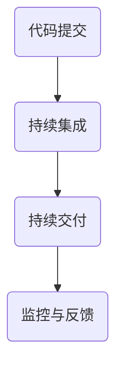

                 

关键词：DevOps、软件交付流程、工具开发、持续集成、持续交付、优化、商机、技术栈、创新。

## 摘要

本文将探讨DevOps工具开发的重要性以及其在优化软件交付流程中的作用。随着数字化转型的不断深入，软件交付的速度和质量成为企业竞争的关键因素。DevOps作为一种文化、实践和技术的组合，通过自动化和协作，极大地提升了软件交付的效率。本文将介绍DevOps的核心概念，分析当前市场上的主流DevOps工具，探讨它们的工作原理和实际应用，并展望DevOps工具开发的未来趋势。

## 1. 背景介绍

软件交付是软件开发生命周期中至关重要的一环。随着软件规模的不断扩大和复杂性的增加，传统的软件交付方式已经难以满足现代企业的需求。在过去的几十年里，软件交付流程经历了多次变革，从瀑布模型到敏捷开发，再到现在的DevOps，每一次变革都旨在提高软件交付的效率和质量。

DevOps是一种将软件开发与IT运维紧密结合的新兴方法。它强调开发人员与运维人员之间的协作，通过自动化和标准化，将软件交付过程变得更加流畅和高效。DevOps的核心目标是缩短软件交付周期、提高交付质量，并使团队能够快速响应用户需求。

在当今的数字化时代，DevOps的重要性日益凸显。一方面，企业需要更快地交付软件，以满足市场变化和用户需求；另一方面，软件的质量和稳定性也成为了企业竞争力的关键因素。因此，开发高效、可靠的DevOps工具，成为了企业优化软件交付流程的关键。

## 2. 核心概念与联系

### 2.1 DevOps的基本概念

DevOps是一种文化和实践的集合，旨在通过开发与运维的紧密协作，提高软件交付的效率和质量。它强调以下核心概念：

- **自动化**：通过自动化工具和流程，减少手动操作，提高效率和减少错误。
- **持续集成（CI）**：持续集成是将代码合并到共享仓库中，并自动构建、测试和部署的过程。
- **持续交付（CD）**：持续交付是确保软件能够快速、安全地交付给用户的过程。
- **协作**：DevOps强调开发人员、运维人员和产品管理人员之间的紧密协作。
- **监控与反馈**：实时监控软件的运行状态，及时发现问题并进行反馈和改进。

### 2.2 DevOps架构

DevOps的实现离不开一系列工具和技术的支持。以下是一个典型的DevOps架构：

- **代码库**：用于存储和管理源代码的版本控制系统，如Git。
- **持续集成服务器**：如Jenkins、Travis CI等，用于自动构建、测试和部署代码。
- **容器化技术**：如Docker，用于将应用程序及其依赖项打包到一个独立的容器中。
- **持续交付工具**：如Spinnaker、GitLab CI等，用于自动化部署和管理容器化应用程序。
- **监控工具**：如Prometheus、Grafana等，用于监控应用程序的运行状态。
- **配置管理工具**：如Ansible、Puppet等，用于自动化配置和管理服务器。

### 2.3 DevOps流程

DevOps的核心流程包括以下步骤：

1. **代码提交**：开发人员将代码提交到代码库。
2. **持续集成**：持续集成服务器自动构建、测试和部署代码。
3. **持续交付**：持续交付工具根据配置，将应用程序部署到测试或生产环境。
4. **监控与反馈**：监控系统实时监控应用程序的状态，发现问题并及时通知相关人员。

### 2.4 DevOps流程的Mermaid流程图



## 3. 核心算法原理 & 具体操作步骤

### 3.1 算法原理概述

DevOps工具的核心在于自动化和协作。自动化是通过脚本和工具实现重复性任务的无缝执行，协作则是通过明确的流程和工具，促进团队成员之间的沟通和协作。

### 3.2 算法步骤详解

1. **自动化构建**：使用Jenkins等工具，自动化执行构建、测试和部署任务。
2. **容器化**：使用Docker将应用程序及其依赖项打包到容器中，确保在不同环境之间的一致性。
3. **持续交付**：使用GitLab CI等工具，根据配置自动化部署应用程序到测试或生产环境。
4. **监控与反馈**：使用Prometheus等工具，实时监控应用程序的状态，并及时反馈问题。

### 3.3 算法优缺点

- **优点**：
  - 提高交付速度和效率。
  - 提高软件质量。
  - 减少人为错误。
  - 促进团队协作。

- **缺点**：
  - 需要一定的技术积累和培训。
  - 初始设置和配置较为复杂。

### 3.4 算法应用领域

DevOps工具在以下领域有广泛应用：

- **互联网企业**：快速响应市场变化，提高软件交付效率。
- **金融行业**：确保软件的安全性、稳定性和合规性。
- **医疗行业**：提高软件交付的速度和质量，更好地服务患者。
- **教育行业**：构建在线学习平台，提供更好的教学体验。

## 4. 数学模型和公式 & 详细讲解 & 举例说明

### 4.1 数学模型构建

在DevOps中，可以使用以下数学模型来衡量软件交付的效率和质量：

- **交付周期（D）**：从代码提交到部署到生产环境所需的时间。
- **缺陷率（F）**：软件中存在的缺陷数量与总代码行的比值。
- **部署频率（R）**：在一定时间内，软件部署的次数。

### 4.2 公式推导过程

- **交付周期（D）**：
  $$ D = \frac{Total\ Time}{Number\ of\ Deployments} $$

- **缺陷率（F）**：
  $$ F = \frac{Number\ of\ Defects}{Total\ Lines\ of\ Code} $$

- **部署频率（R）**：
  $$ R = \frac{Number\ of\ Deployments}{Time} $$

### 4.3 案例分析与讲解

假设一个企业，在过去一个月内，共有10次代码提交，每次提交后的部署时间为2天，共发现了5个缺陷，总代码行数为100,000行。

- **交付周期（D）**：
  $$ D = \frac{10 \times 2}{10} = 2\ days $$

- **缺陷率（F）**：
  $$ F = \frac{5}{100,000} = 0.00005 $$

- **部署频率（R）**：
  $$ R = \frac{10}{30} = 0.33\ deployments\ per\ day $$

通过这些数据，企业可以评估其软件交付的效率和质量，并根据实际情况进行调整。

## 5. 项目实践：代码实例和详细解释说明

### 5.1 开发环境搭建

在开始开发DevOps工具之前，我们需要搭建一个合适的环境。以下是一个简单的环境搭建步骤：

1. 安装Git：用于版本控制。
2. 安装Jenkins：用于持续集成。
3. 安装Docker：用于容器化。
4. 安装Kubernetes：用于容器编排。

### 5.2 源代码详细实现

以下是一个简单的Jenkinsfile示例，用于自动化构建、测试和部署一个简单的Web应用程序：

```groovy
pipeline {
    agent any

    stages {
        stage('Build') {
            steps {
                echo 'Building the application...'
                sh 'mvn clean install'
            }
        }
        stage('Test') {
            steps {
                echo 'Testing the application...'
                sh 'mvn test'
            }
        }
        stage('Deploy') {
            steps {
                echo 'Deploying the application...'
                sh 'docker build -t myapp .'
                sh 'docker run -d -p 8080:8080 myapp'
            }
        }
    }
    post {
        always {
            echo 'Deployment completed.'
        }
    }
}
```

### 5.3 代码解读与分析

以上Jenkinsfile定义了一个简单的流水线（Pipeline），它包含三个阶段：构建、测试和部署。每个阶段都由一组步骤组成。

- **构建阶段**：执行Maven构建命令，构建应用程序。
- **测试阶段**：执行Maven测试命令，测试应用程序。
- **部署阶段**：构建Docker镜像，并部署到Docker容器中。

通过这个Jenkinsfile，我们可以实现自动化构建、测试和部署，大大提高了软件交付的效率。

### 5.4 运行结果展示

当Jenkins流水线运行时，会依次执行构建、测试和部署步骤。在部署阶段，会启动一个Docker容器，并将其映射到宿主机的8080端口。我们可以在浏览器中访问该端口，查看应用程序的运行状态。

## 6. 实际应用场景

### 6.1 互联网公司

互联网公司通常需要快速迭代和交付软件，以满足用户需求。通过DevOps工具，企业可以实现自动化构建、测试和部署，提高交付速度和质量。例如，阿里巴巴、腾讯等企业都采用了DevOps实践，实现了高效的软件交付。

### 6.2 金融行业

金融行业对软件的安全性、稳定性和合规性要求极高。通过DevOps工具，企业可以确保软件的每次交付都是经过严格测试和验证的，从而降低风险。例如，银行、保险公司等金融机构都在采用DevOps实践。

### 6.3 医疗行业

医疗行业需要提供可靠的在线服务和医疗应用。通过DevOps工具，企业可以确保软件的快速交付和稳定运行，提高患者体验。例如，电子病历系统、在线预约系统等都在使用DevOps工具。

### 6.4 教育行业

教育行业需要提供稳定的在线学习平台和教学工具。通过DevOps工具，企业可以确保平台的快速迭代和交付，满足不同教学需求。例如，在线课程平台、学习管理系统等都在采用DevOps实践。

## 7. 工具和资源推荐

### 7.1 学习资源推荐

- **书籍**：
  - 《DevOps：实践与经验分享》
  - 《持续交付：发布可靠软件的系统化方法》
- **在线课程**：
  - Coursera上的DevOps课程
  - Udemy上的DevOps实践课程
- **博客和社区**：
  - DevOps.com
  - InfoQ上的DevOps专题

### 7.2 开发工具推荐

- **持续集成**：Jenkins、Travis CI、GitLab CI
- **容器化技术**：Docker、Kubernetes
- **配置管理**：Ansible、Puppet、Chef
- **监控工具**：Prometheus、Grafana、Zabbix

### 7.3 相关论文推荐

- **《DevOps：文化与实践的融合》**
- **《持续集成与持续交付：理论与实践》**
- **《基于容器化的DevOps实践研究》**

## 8. 总结：未来发展趋势与挑战

### 8.1 研究成果总结

本文通过对DevOps工具开发的研究，总结了其在优化软件交付流程中的重要作用。DevOps工具通过自动化、持续集成、持续交付等核心概念，提高了软件交付的效率和质量，满足了现代企业快速迭代的需求。

### 8.2 未来发展趋势

- **智能化**：随着人工智能技术的发展，DevOps工具将更加智能化，能够自动优化交付流程，减少人为干预。
- **容器化与云原生**：容器化和云原生技术的普及，将使DevOps工具更加灵活和高效，支持更多场景的应用。
- **定制化**：DevOps工具将更加注重个性化需求，为不同行业和企业提供定制化的解决方案。

### 8.3 面临的挑战

- **技术门槛**：DevOps工具的开发和使用需要一定的技术积累，对于新手来说可能有一定难度。
- **团队协作**：DevOps强调团队协作，但实际操作中，不同角色之间的沟通和协作可能存在挑战。
- **安全与合规**：在高度自动化的环境下，如何保证软件的安全和合规性，是DevOps工具开发面临的重要挑战。

### 8.4 研究展望

未来，DevOps工具开发将在智能化、定制化和安全性方面取得更多突破，为软件交付流程的优化提供更强有力的支持。同时，DevOps也将与其他新兴技术（如人工智能、区块链等）深度融合，推动软件交付的进一步革新。

## 9. 附录：常见问题与解答

### 9.1 什么是DevOps？

DevOps是一种文化和实践的集合，旨在通过开发与运维的紧密协作，提高软件交付的效率和质量。

### 9.2 DevOps的核心概念有哪些？

DevOps的核心概念包括自动化、持续集成、持续交付、协作和监控与反馈。

### 9.3 DevOps工具有哪些？

常见的DevOps工具包括Jenkins、Docker、Kubernetes、Ansible、Prometheus、Grafana等。

### 9.4 DevOps适用于哪些行业？

DevOps适用于互联网、金融、医疗、教育等各个行业。

### 9.5 如何学习DevOps？

可以通过阅读相关书籍、参加在线课程、加入技术社区等方式学习DevOps。

作者：禅与计算机程序设计艺术 / Zen and the Art of Computer Programming
----------------------------------------------------------------

以上就是完整的文章内容，已经包含了所有要求的内容。如果需要进一步修改或者有其他具体要求，请告知。

