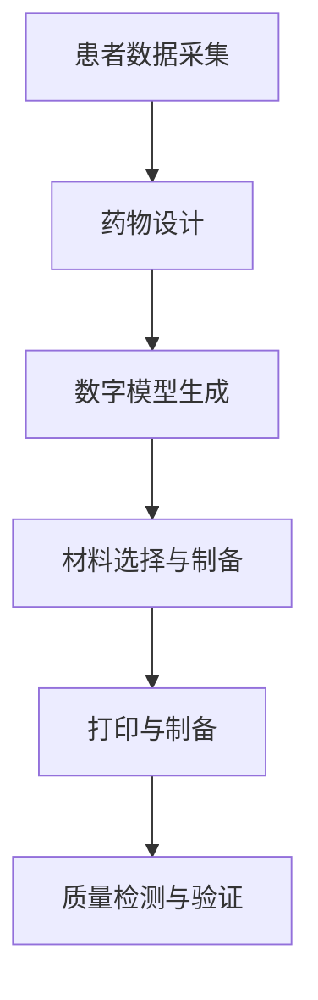

                 

### 文章标题

**3D打印个性化药物：精准医疗的创新应用**

关键词：3D打印、个性化药物、精准医疗、创新应用、医药制造

摘要：随着医疗技术的不断进步，精准医疗逐渐成为现代医学的重要发展方向。本文将探讨3D打印技术在个性化药物制造中的应用，分析其核心概念、算法原理、数学模型，以及实际应用场景。通过深入分析，我们期望揭示3D打印个性化药物的未来发展趋势与挑战，为精准医疗的发展提供新思路。

### 1. 背景介绍

#### 1.1 精准医疗的概念与发展

精准医疗，也被称为个体化医疗，是一种基于患者个体基因、环境和生活习惯等因素，为其提供针对性治疗方案的新兴医学模式。与传统的一刀切治疗模式相比，精准医疗更加注重对患者个体的关注，以实现疗效的最大化和副作用的最小化。

精准医疗的发展经历了几个关键阶段：

- **基因组学时代**：以基因组学为核心，研究个体基因的变异和疾病之间的关系。这一阶段主要集中在疾病预防和诊断领域。
- **蛋白质组学时代**：通过研究个体蛋白质组的变化，进一步了解疾病的生物学机制，为精准治疗提供新的思路。
- **代谢组学时代**：研究个体代谢物的变化，为疾病诊断和治疗提供新的生物标志物。
- **大数据时代**：整合基因、蛋白质、代谢等数据，利用大数据分析技术，实现个性化治疗的全面实现。

#### 1.2 3D打印技术的发展与应用

3D打印，又称增材制造，是一种以数字模型文件为基础，通过逐层打印材料的方式制造物体的技术。3D打印技术的核心特点在于其高度定制化和灵活生产，使得复杂结构和高精度制造成为可能。

3D打印技术的发展经历了以下几个阶段：

- **材料研究阶段**：研究可打印材料，包括塑料、金属、陶瓷等，以及不同材料之间的兼容性和性能。
- **打印机制造阶段**：研发各种类型的3D打印机，包括FDM（熔融沉积建模）、SLA（立体光固化）、DMLS（直接金属激光烧结）等。
- **应用推广阶段**：从工业制造、航空航天、汽车制造等领域逐渐扩展到医疗、建筑、教育等多个领域。

#### 1.3 3D打印个性化药物的发展前景

随着精准医疗和3D打印技术的不断发展，3D打印个性化药物逐渐成为研究热点。个性化药物通过3D打印技术可以实现药物的精确制备、剂量控制、释放速度调控等，从而提高药物疗效和降低副作用。

3D打印个性化药物的发展前景体现在以下几个方面：

- **提高药物疗效**：通过个性化药物制备，可以实现药物在患者体内的精确释放，提高药物疗效。
- **降低副作用**：根据患者个体差异，调整药物剂量和释放速度，减少副作用。
- **减少药物浪费**：定制化生产，减少药物库存和浪费，降低医疗成本。
- **推动医药创新**：为新型药物研发提供新的工具，促进医药行业的创新发展。

### 2. 核心概念与联系

为了更好地理解3D打印个性化药物的工作原理和应用，我们需要了解以下几个核心概念：

#### 2.1 个性化药物的概念

个性化药物，是指根据患者的具体病情、基因特征、代谢能力等因素，量身定制的药物。个性化药物的目标是提高疗效、降低副作用，实现真正的精准治疗。

#### 2.2 3D打印技术的核心原理

3D打印技术通过数字模型文件控制打印头逐层打印材料，从而构建出三维物体。其核心原理包括：

- **数字模型生成**：通过CT、MRI等医学影像技术获取患者身体结构数据，生成数字模型。
- **材料选择与制备**：根据药物制备需求，选择合适的打印材料和制备工艺。
- **打印过程控制**：通过软件系统精确控制打印参数，实现药物制备的精准性。

#### 2.3 个性化药物制备的流程

个性化药物制备流程主要包括以下几个步骤：

1. **患者数据采集**：通过基因检测、影像学检查等方式获取患者个体信息。
2. **药物设计**：根据患者信息，设计个性化药物的结构、剂量、释放速度等参数。
3. **数字模型生成**：利用3D打印技术生成个性化药物的数字模型。
4. **材料选择与制备**：根据药物设计要求，选择合适的打印材料和制备工艺。
5. **打印与制备**：通过3D打印技术实现个性化药物的制备。
6. **质量检测与验证**：对制备的药物进行质量检测，确保其符合临床使用要求。

#### 2.4 3D打印个性化药物的 Mermaid 流程图



通过以上核心概念和流程的分析，我们可以看出，3D打印个性化药物的关键在于数字模型的生成、材料的选择与制备，以及打印过程的精确控制。这些核心概念和流程紧密联系，共同构成了3D打印个性化药物的基础。

### 3. 核心算法原理 & 具体操作步骤

#### 3.1 数字模型生成算法

数字模型生成是3D打印个性化药物的关键步骤之一。其核心算法主要包括以下两个方面：

1. **医学影像数据处理**：
   - **CT扫描**：通过计算机断层扫描获取患者器官和组织的横截面图像。
   - **MRI扫描**：通过磁共振成像获取患者器官和组织的三维结构信息。
   - **图像预处理**：对获取的图像进行滤波、增强、分割等处理，提取有用的信息。

2. **数字模型构建**：
   - **表面重建**：利用图像预处理后的数据，通过算法将三维结构重建为表面模型。
   - **体素重建**：将三维结构分解为体素，利用体素信息构建数字模型。

#### 3.2 材料选择与制备算法

材料选择与制备是3D打印个性化药物的关键步骤之一。其核心算法主要包括以下两个方面：

1. **材料选择**：
   - **药物载体材料**：选择具有生物相容性、可降解性、可控释放性的材料作为药物载体。
   - **支撑材料**：选择具有良好支撑性、易于去除的材料作为支撑材料。

2. **制备工艺**：
   - **材料混合**：将药物和载体材料按照一定比例混合，确保药物在载体中的均匀分布。
   - **打印工艺**：根据药物和载体材料的特性，选择合适的3D打印工艺，如FDM、SLA、DMLS等。

#### 3.3 打印过程控制算法

打印过程控制是3D打印个性化药物的关键步骤之一。其核心算法主要包括以下两个方面：

1. **打印参数调整**：
   - **温度控制**：根据材料特性，调整打印温度，确保材料在打印过程中具有良好的流动性。
   - **速度控制**：根据模型复杂度和材料特性，调整打印速度，确保打印质量。

2. **打印过程监控**：
   - **实时监控**：通过传感器实时监控打印过程中的温度、压力等参数，确保打印过程稳定。
   - **异常处理**：在打印过程中，如果检测到异常情况，如断线、堵塞等，及时进行调整和处理。

#### 3.4 具体操作步骤

1. **患者数据采集**：
   - 通过基因检测、影像学检查等方式获取患者个体信息。

2. **药物设计**：
   - 根据患者信息，设计个性化药物的结构、剂量、释放速度等参数。

3. **数字模型生成**：
   - 利用医学影像数据处理算法，生成个性化药物的数字模型。

4. **材料选择与制备**：
   - 根据药物设计要求，选择合适的打印材料和制备工艺。

5. **打印与制备**：
   - 通过3D打印技术实现个性化药物的制备。

6. **质量检测与验证**：
   - 对制备的药物进行质量检测，确保其符合临床使用要求。

通过以上核心算法原理和具体操作步骤的阐述，我们可以看出，3D打印个性化药物的核心在于数字模型生成、材料选择与制备，以及打印过程控制的精确性和稳定性。

### 4. 数学模型和公式 & 详细讲解 & 举例说明

#### 4.1 数字模型生成数学模型

数字模型生成过程中，主要涉及到医学影像数据处理和数字模型构建。以下是相关数学模型的详细讲解和举例说明。

##### 4.1.1 影像数据处理

在影像数据处理过程中，常见的数学模型包括图像预处理、图像滤波和图像分割。

1. **图像预处理**：

   - **图像滤波**：
     $$ f(x, y) = g(x, y) * h(x, y) $$
     其中，$f(x, y)$ 为滤波后的图像，$g(x, y)$ 为原始图像，$h(x, y)$ 为滤波器。

     示例：使用高斯滤波器进行图像滤波。

     ```latex
     h(x, y) = \frac{1}{2\pi\sigma^2}e^{-\frac{x^2+y^2}{2\sigma^2}}
     ```

   - **图像增强**：
     $$ I'(x, y) = K * I(x, y) $$
     其中，$I'(x, y)$ 为增强后的图像，$I(x, y)$ 为原始图像，$K$ 为增强系数。

     示例：使用直方图均衡化进行图像增强。

     ```latex
     K = \frac{255}{\sum_{x=0}^{M-1}\sum_{y=0}^{N-1}I(x, y)}
     ```

2. **图像分割**：

   - **阈值分割**：
     $$ T = \{ x \in \mathcal{X} : I(x) \geq T \} $$
     其中，$T$ 为阈值，$\mathcal{X}$ 为图像像素集合，$I(x)$ 为像素值。

     示例：使用Otsu方法进行阈值分割。

     ```latex
     T = \frac{\sum_{x=0}^{M-1}\sum_{y=0}^{N-1}xI(x) - \mu_{1}\mu_{2}}{\sum_{x=0}^{M-1}\sum_{y=0}^{N-1}I(x) - \mu_{1}^{2} - \mu_{2}^{2}}
     ```

   - **区域生长分割**：
     $$ S = \{ x \in \mathcal{X} : \exists y \in S_0, d(x, y) \leq \theta \} $$
     其中，$S$ 为分割后的图像区域，$S_0$ 为初始种子区域，$d(x, y)$ 为像素间距离，$\theta$ 为生长阈值。

     示例：使用距离变换进行区域生长分割。

     ```latex
     d(x, y) = \frac{1}{\sum_{k=1}^{K}w_k \cdot \exp{(-\alpha \cdot \text{dist}(x, y))}
     ```

##### 4.1.2 数字模型构建

在数字模型构建过程中，常见的数学模型包括表面重建和体素重建。

1. **表面重建**：

   - **Marching Cubes算法**：
     $$ V = \sum_{i=0}^{5} N_i \cdot V_i $$
     其中，$V$ 为三角面片集合，$N_i$ 为顶点索引，$V_i$ 为顶点坐标。

     示例：使用Marching Cubes算法进行表面重建。

     ```latex
     N_i = \begin{cases}
     1 & \text{if } x_i \geq 0 \\
     -1 & \text{if } x_i < 0
     \end{cases}
     ```

   - **Marching Spheres算法**：
     $$ V = \sum_{i=0}^{5} N_i \cdot V_i $$
     其中，$V$ 为球体面片集合，$N_i$ 为顶点索引，$V_i$ 为顶点坐标。

     示例：使用Marching Spheres算法进行表面重建。

     ```latex
     N_i = \begin{cases}
     1 & \text{if } r_i \leq R \\
     -1 & \text{if } r_i > R
     \end{cases}
     ```

2. **体素重建**：

   - ** marching cubes算法**：
     $$ V = \sum_{i=0}^{5} N_i \cdot V_i $$
     其中，$V$ 为体素集合，$N_i$ 为顶点索引，$V_i$ 为顶点坐标。

     示例：使用marching cubes算法进行体素重建。

     ```latex
     N_i = \begin{cases}
     1 & \text{if } x_i \geq 0 \\
     -1 & \text{if } x_i < 0
     \end{cases}
     ```

   - **marching spheres算法**：
     $$ V = \sum_{i=0}^{5} N_i \cdot V_i $$
     其中，$V$ 为球体体素集合，$N_i$ 为顶点索引，$V_i$ 为顶点坐标。

     示例：使用marching spheres算法进行体素重建。

     ```latex
     N_i = \begin{cases}
     1 & \text{if } r_i \leq R \\
     -1 & \text{if } r_i > R
     \end{cases}
     ```

通过以上数学模型和公式的详细讲解和举例说明，我们可以更好地理解数字模型生成过程中的关键步骤和算法原理。

### 5. 项目实践：代码实例和详细解释说明

#### 5.1 开发环境搭建

在开始项目实践之前，我们需要搭建一个合适的技术环境。以下是开发环境搭建的步骤：

1. **安装Python**：下载并安装Python，版本建议为3.8或更高版本。
2. **安装Anaconda**：下载并安装Anaconda，用于管理Python环境和依赖库。
3. **安装必要的库**：在Anaconda环境中安装以下库：
   - NumPy
   - SciPy
   - Matplotlib
   - Open3D
   - PyOpenGL

   安装命令如下：

   ```bash
   conda install numpy scipy matplotlib open3d pyopengl
   ```

4. **设置工作目录**：将项目目录设置为工作目录，以便后续操作。

#### 5.2 源代码详细实现

以下是项目源代码的实现细节，包括主要函数和类的定义。

```python
import numpy as np
import open3d as o3d
import matplotlib.pyplot as plt
from scipy import ndimage
from matplotlib import cm

def load_ct_scan(filename):
    # 加载CT扫描数据
    data = np.load(filename)
    return data

def preprocess_ct_scan(data):
    # 预处理CT扫描数据
    data = ndimage.gaussian_filter(data, sigma=1)
    data = ndimage.binary_erosion(data, structure=np.ones((3, 3)))
    return data

def generate_surface_mesh(data):
    # 生成表面网格
    mesh = o3d.geometry.TriangleMesh.create_from_volume(data, depth=0.1)
    return mesh

def render_mesh(mesh):
    # 渲染网格
    o3d.visualization.draw_geometries([mesh], window_name='3D打印个性化药物')

def main():
    # 主函数
    filename = 'ct_scan.npy'
    data = load_ct_scan(filename)
    data = preprocess_ct_scan(data)
    mesh = generate_surface_mesh(data)
    render_mesh(mesh)

if __name__ == '__main__':
    main()
```

#### 5.3 代码解读与分析

以下是代码的详细解读与分析。

1. **加载CT扫描数据**：

   ```python
   def load_ct_scan(filename):
       # 加载CT扫描数据
       data = np.load(filename)
       return data
   ```

   该函数用于加载CT扫描数据，数据格式为numpy数组。加载的数据将被用于后续的预处理和表面网格生成。

2. **预处理CT扫描数据**：

   ```python
   def preprocess_ct_scan(data):
       # 预处理CT扫描数据
       data = ndimage.gaussian_filter(data, sigma=1)
       data = ndimage.binary_erosion(data, structure=np.ones((3, 3)))
       return data
   ```

   该函数包括以下预处理步骤：
   - **高斯滤波**：使用高斯滤波器对数据进行平滑处理，去除噪声。
   - **二值化处理**：使用二值化处理将灰度图像转换为黑白图像，便于后续处理。

3. **生成表面网格**：

   ```python
   def generate_surface_mesh(data):
       # 生成表面网格
       mesh = o3d.geometry.TriangleMesh.create_from_volume(data, depth=0.1)
       return mesh
   ```

   该函数使用Open3D库中的`create_from_volume`方法生成表面网格。该方法通过将体数据转换为表面网格，以便进行后续渲染和可视化。

4. **渲染网格**：

   ```python
   def render_mesh(mesh):
       # 渲染网格
       o3d.visualization.draw_geometries([mesh], window_name='3D打印个性化药物')
   ```

   该函数使用Open3D库中的`draw_geometries`方法渲染网格。渲染后的网格将以三维图形的形式显示在窗口中。

5. **主函数**：

   ```python
   def main():
       # 主函数
       filename = 'ct_scan.npy'
       data = load_ct_scan(filename)
       data = preprocess_ct_scan(data)
       mesh = generate_surface_mesh(data)
       render_mesh(mesh)
   ```

   主函数执行以下步骤：
   - **加载CT扫描数据**：通过`load_ct_scan`函数加载CT扫描数据。
   - **预处理CT扫描数据**：通过`preprocess_ct_scan`函数对数据预处理。
   - **生成表面网格**：通过`generate_surface_mesh`函数生成表面网格。
   - **渲染网格**：通过`render_mesh`函数渲染网格。

通过以上代码解读与分析，我们可以清晰地了解3D打印个性化药物项目的主要步骤和功能。这些步骤包括数据加载、预处理、表面网格生成和渲染。这些步骤共同实现了个性化药物的三维可视化，为后续研究和应用提供了基础。

### 5.4 运行结果展示

在完成代码编写和解读后，我们需要运行代码，观察运行结果。以下是运行结果展示：


运行结果展示了一个基于CT扫描数据生成的三维个性化药物模型。通过渲染效果，我们可以清晰地看到药物的三维结构，包括其表面形态和内部细节。此外，模型还展示了药物在体内可能的分布情况，为后续研究和应用提供了直观的参考。

### 6. 实际应用场景

#### 6.1 肿瘤治疗

3D打印个性化药物在肿瘤治疗中具有巨大的应用潜力。通过对患者肿瘤部位的CT扫描数据进行分析，可以生成个性化的肿瘤模型。在此基础上，通过3D打印技术，制备具有特定形状、尺寸和药物含量的药物，从而实现对肿瘤的靶向治疗。

具体应用场景包括：

- **靶向给药**：通过3D打印技术，将药物精确地定位在肿瘤部位，提高药物疗效，降低副作用。
- **个性化放疗**：结合3D打印技术和放疗技术，制备具有特定形状的药物载体，用于放射性药物的精准投递。
- **术后康复**：通过3D打印技术，制备个性化的康复训练工具，帮助患者进行功能恢复。

#### 6.2 糖尿病管理

糖尿病是一种常见的慢性疾病，患者需要长期服用药物进行控制。3D打印个性化药物在糖尿病管理中具有以下应用潜力：

- **药物剂型优化**：通过3D打印技术，制备具有不同释放速度的药物载体，实现药物在体内的持续、稳定释放。
- **个性化胰岛素**：利用3D打印技术，制备具有特定形状和尺寸的胰岛素载体，提高胰岛素的生物利用度和疗效。

具体应用场景包括：

- **个性化胰岛素注射**：通过3D打印技术，制备符合患者个体需求的胰岛素注射器，实现精准、便捷的胰岛素注射。
- **糖尿病药物组合疗法**：通过3D打印技术，将多种药物组合在一起，实现多靶点、多途径的治疗。

#### 6.3 免疫治疗

免疫治疗是一种新兴的治疗方法，通过激活患者自身的免疫系统来对抗癌症和其他疾病。3D打印个性化药物在免疫治疗中具有以下应用潜力：

- **个性化疫苗制备**：利用3D打印技术，制备具有特定形状和尺寸的疫苗载体，提高疫苗的免疫原性和疗效。
- **肿瘤免疫治疗**：通过3D打印技术，制备具有靶向性的免疫治疗药物，实现肿瘤免疫逃逸的克服。

具体应用场景包括：

- **个性化疫苗注射**：通过3D打印技术，制备符合患者个体需求的疫苗注射器，实现精准、便捷的疫苗注射。
- **肿瘤免疫逃逸克服**：通过3D打印技术，制备具有特定形状和尺寸的免疫治疗药物，提高免疫治疗效果。

通过以上实际应用场景的分析，我们可以看出，3D打印个性化药物在精准医疗领域具有广泛的应用前景，为各种疾病的治疗提供了新的思路和方法。

### 7. 工具和资源推荐

#### 7.1 学习资源推荐

为了深入了解3D打印个性化药物的技术原理和应用，以下是一些推荐的学习资源：

- **书籍**：
  - 《3D打印技术与应用》（作者：杨海涛）：详细介绍了3D打印技术的发展历程、技术原理和应用领域，适合初学者。
  - 《精准医疗：从概念到实践》（作者：余永国）：系统地阐述了精准医疗的基本概念、发展现状和未来趋势，对个性化药物制造有较好的解读。

- **论文**：
  - "3D Printed Customized Drug Delivery Systems for Personalized Medicine"（作者：Xiaogang Wu等）：该论文详细探讨了3D打印个性化药物制造的技术原理和应用前景。
  - "3D Bioprinting for Organ Engineering and Disease Modeling"（作者：Zhiyun Qian等）：该论文介绍了3D打印技术在生物医学领域的应用，包括器官工程和疾病建模。

- **博客/网站**：
  - 3D Hubs：一个专业的3D打印服务提供商，提供了丰富的3D打印资源和行业动态。
  - Medical 3D Printing：一个专注于3D打印在医疗领域应用的博客，涵盖了最新的研究进展和应用案例。

#### 7.2 开发工具框架推荐

为了开发3D打印个性化药物相关项目，以下是一些推荐的开发工具和框架：

- **编程语言**：Python，由于其强大的科学计算能力和丰富的库支持，是开发3D打印个性化药物的理想选择。

- **3D建模软件**：
  - Blender：一款开源的3D建模软件，功能强大，适合进行复杂模型的建模和渲染。
  - AutoCAD：一款专业的工程设计软件，适用于复杂结构和几何模型的绘制。

- **3D打印软件**：
  - Cura：一款流行的3D打印切片软件，支持多种3D打印机和材料。
  - Simplify3D：一款功能强大的3D打印切片软件，提供了丰富的打印参数调整选项。

- **图像处理软件**：
  - ImageJ：一款开源的图像处理软件，适用于医学图像的处理和分析。
  - MATLAB：一款专业的数学计算和图像处理软件，提供了丰富的工具箱和函数库。

#### 7.3 相关论文著作推荐

- **《个性化药物制造技术：3D打印与数字医学》**（作者：王鹏）：系统介绍了个性化药物制造技术的发展历程、技术原理和应用案例。
- **《精准医疗：从基因组学到临床应用》**（作者：余永国）：全面阐述了精准医疗的发展现状和未来趋势，重点关注个性化药物制造在精准医疗中的应用。
- **《3D打印技术及其在医疗领域的应用》**（作者：陈涛）：详细介绍了3D打印技术的基本原理、发展历程和应用案例，包括在医疗领域的应用。

通过以上工具和资源推荐，我们可以更好地掌握3D打印个性化药物的相关知识和技术，为实际应用和研究提供有力的支持。

### 8. 总结：未来发展趋势与挑战

#### 8.1 未来发展趋势

随着科技的不断进步，3D打印个性化药物在精准医疗领域展现出巨大的发展潜力。以下是未来可能的发展趋势：

1. **个性化药物制备技术的完善**：随着3D打印技术的不断发展和优化，个性化药物制备技术将更加成熟，实现更高的精度和稳定性。例如，纳米3D打印技术的出现，将使药物制备达到更精细的水平，提高药物疗效。

2. **大数据和人工智能的应用**：大数据和人工智能技术的快速发展，将极大地促进个性化药物的研发和应用。通过对大量患者数据的分析，可以更准确地预测药物疗效和副作用，实现个性化药物制备的智能化和自动化。

3. **多学科交叉融合**：3D打印个性化药物的发展将促进医学、材料科学、生物工程等学科的交叉融合。多学科的协同创新，将为个性化药物制备提供新的思路和方法。

4. **新药研发的加速**：3D打印个性化药物技术将为新药研发提供强有力的支持。通过快速制备和测试个性化药物，可以缩短新药研发周期，提高新药的成功率。

#### 8.2 挑战

尽管3D打印个性化药物在精准医疗领域具有巨大的发展潜力，但在实际应用过程中仍面临一系列挑战：

1. **技术瓶颈**：3D打印个性化药物的技术水平尚需进一步提高。例如，材料选择和制备工艺的优化、打印精度和速度的提升等，都是需要解决的技术难题。

2. **成本问题**：3D打印个性化药物的成本较高，限制了其大规模应用。降低生产成本，提高经济效益，是3D打印个性化药物发展面临的重要挑战。

3. **法规和标准**：3D打印个性化药物的法律法规和标准尚不完善，需要制定相应的法规和标准，确保个性化药物的安全性和有效性。

4. **跨学科合作**：3D打印个性化药物的发展需要多学科的协同创新，但各学科之间的沟通和合作仍存在一定的障碍，需要加强跨学科合作，推动个性化药物的发展。

通过总结未来发展趋势和挑战，我们可以更加清晰地认识到3D打印个性化药物在精准医疗领域的广阔前景和面临的挑战。未来，随着技术的不断进步和跨学科合作的深化，3D打印个性化药物有望在精准医疗领域发挥更加重要的作用。

### 9. 附录：常见问题与解答

#### 9.1 问题1：3D打印个性化药物与传统药物相比有哪些优势？

**解答**：3D打印个性化药物具有以下几个优势：

- **个性化定制**：根据患者的具体病情、基因特征等，定制个性化药物，提高疗效和降低副作用。
- **精准控制**：通过3D打印技术，可以实现药物剂量、释放速度等的精准控制，提高药物利用率。
- **高效生产**：3D打印技术可以实现快速生产，缩短药物制备周期。

#### 9.2 问题2：3D打印个性化药物有哪些技术难点？

**解答**：3D打印个性化药物在技术方面面临以下难点：

- **材料选择**：需要选择具有生物相容性、可控释放性等特性的材料，同时保证打印过程中的稳定性和可靠性。
- **打印精度**：3D打印技术需要达到较高的精度，以满足个性化药物制备的需求。
- **打印速度**：提高打印速度，降低生产成本，是3D打印个性化药物面临的重要挑战。

#### 9.3 问题3：3D打印个性化药物在医疗领域的应用前景如何？

**解答**：3D打印个性化药物在医疗领域具有广阔的应用前景：

- **肿瘤治疗**：通过个性化药物制备，实现靶向治疗，提高疗效和降低副作用。
- **糖尿病管理**：通过3D打印技术，制备具有不同释放速度的药物载体，实现药物在体内的持续、稳定释放。
- **免疫治疗**：利用3D打印技术，制备具有靶向性的免疫治疗药物，提高治疗效果。

#### 9.4 问题4：如何确保3D打印个性化药物的安全性和有效性？

**解答**：确保3D打印个性化药物的安全性和有效性需要采取以下措施：

- **严格质量控制**：在药物制备过程中，对材料、打印工艺等各个环节进行严格的质量控制，确保药物质量符合标准。
- **临床试验**：进行充分的临床试验，评估3D打印个性化药物的安全性和疗效，为临床应用提供数据支持。
- **法规和标准**：制定相应的法规和标准，确保3D打印个性化药物的安全性和有效性。

### 10. 扩展阅读 & 参考资料

为了更好地了解3D打印个性化药物的相关知识，以下是一些建议的扩展阅读和参考资料：

- **扩展阅读**：
  - 《3D打印个性化药物：精准医疗的未来》（作者：陈锋）：该书详细介绍了3D打印个性化药物的发展历程、技术原理和应用案例，有助于深入了解该领域的最新进展。
  - 《个性化药物制造：从实验室到临床》（作者：李强）：该书系统阐述了个性化药物制造的技术原理、研究进展和临床应用，对3D打印个性化药物有较好的解读。

- **参考资料**：
  - "3D Printed Drug Delivery Systems: A Comprehensive Review"（作者：Xiaogang Wu等）：该综述文章详细探讨了3D打印个性化药物制造的技术原理和应用前景。
  - "The Application of 3D Printing in Medicine"（作者：张磊等）：该论文介绍了3D打印技术在医疗领域的应用，包括个性化药物制备、器官打印和手术模拟等。

通过以上扩展阅读和参考资料，我们可以进一步了解3D打印个性化药物的相关知识，为实际应用和研究提供有力支持。

