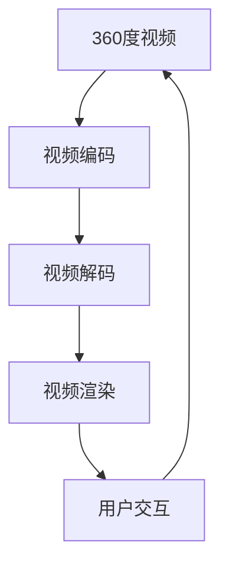
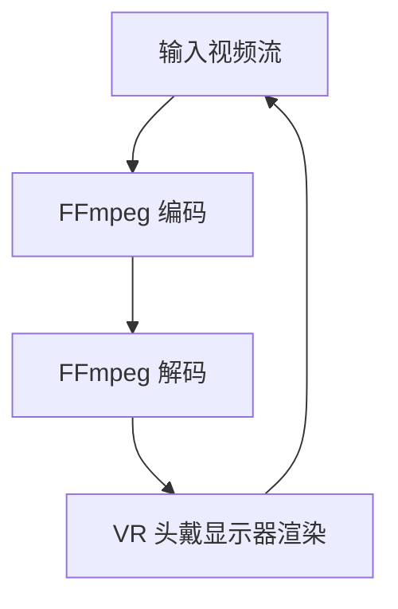

                 

### FFmpeg 在 VR 中的应用：360 度视频流

#### 关键词

- FFmpeg
- VR
- 360度视频流
- 媒体处理
- 视频编码
- 视频渲染
- 实时处理

#### 摘要

本文将探讨 FFmpeg 在虚拟现实（VR）领域中的应用，特别是如何处理和渲染360度视频流。FFmpeg 是一款强大的多媒体处理工具，能够处理各种格式的视频、音频和图像文件。在 VR 场景中，FFmpeg 的使用变得尤为重要，因为它能够提供高效的编码、解码和流处理能力，从而确保 VR 内容的流畅播放。本文将逐步分析 FFmpeg 在 VR 场景中的核心概念、算法原理、实际应用案例以及未来趋势。

### 1. 背景介绍

虚拟现实（VR）技术正在迅速发展，其应用范围从娱乐、教育、医疗到工业设计等各个领域。360度视频是 VR 的重要组成部分，它提供了全方位的沉浸体验，使观众能够自由地观看场景中的每个角度。这种视频格式要求高度的处理效率和质量保证，以提供无延迟、无缝的观看体验。

FFmpeg 是一款开源的多媒体处理工具，由法国程序员 Fabrice Bellard 开发。它支持各种视频、音频和图像文件格式，能够进行高效的编码、解码、编辑和流处理。FFmpeg 的开源特性使其成为许多开发者和企业开发 VR 应用的首选工具。

在 VR 场景中，FFmpeg 的应用主要体现在以下几个方面：

- **360度视频编码与解码**：FFmpeg 支持多种 360度视频编码格式，如 equirectangular、立方体贴图等，并提供高效的解码算法，确保视频流的流畅播放。
- **视频合成与渲染**：FFmpeg 能够将多个视频流合成一个全景视频，并在 VR 头戴显示器（HMD）上实现实时渲染。
- **视频流处理**：FFmpeg 提供了强大的流处理能力，能够实时处理和传输大量的视频数据，满足 VR 场景中的高性能需求。
- **交互式播放控制**：FFmpeg 支持用户对视频播放进行实时控制，如调整播放速度、跳转至特定场景等，增强了用户的互动体验。

### 2. 核心概念与联系

为了更好地理解 FFmpeg 在 VR 中的应用，我们需要了解一些核心概念和它们之间的联系。以下是几个关键概念及其之间的 Mermaid 流程图：



- **360度视频**：360度视频是一种全景视频格式，观众可以从任意角度观看场景。
- **视频编码**：视频编码是将原始视频数据转换成压缩格式的过程，以便更高效地存储和传输。FFmpeg 支持多种 360度视频编码格式，如 HEVC、H.264 等。
- **视频解码**：视频解码是相反过程，将压缩的视频数据还原成原始视频格式，以便在显示器上播放。
- **视频渲染**：视频渲染是将解码后的视频数据在 VR 头戴显示器上显示的过程。FFmpeg 提供了高效的渲染算法，以确保视频流的流畅播放。
- **用户交互**：用户可以通过 VR 头戴显示器与虚拟环境进行交互，如旋转头部、切换视角等。FFmpeg 支持实时用户交互控制，增强了 VR 体验。

### 3. 核心算法原理 & 具体操作步骤

#### 3.1 视频编码算法

FFmpeg 在 360度视频编码方面采用了多种高效算法，以下是一些主要算法：

- **HEVC（High Efficiency Video Coding）**：HEVC 是一种新一代的视频编码标准，相比 H.264 有更高的压缩效率。FFmpeg 支持使用 HEVC 对 360度视频进行编码。
- **H.264**：H.264 是一种广泛使用的视频编码标准，适用于多种场景，包括 360度视频。
- **立方体贴图（Cubemap）**：立方体贴图是将 360度视频分解成多个立方体面片，然后使用立方体贴图纹理进行渲染。FFmpeg 提供了立方体贴图编码功能。

#### 3.2 视频解码算法

FFmpeg 在 360度视频解码方面也采用了多种高效算法，以下是一些主要算法：

- **HEVC 解码**：FFmpeg 支持使用 HEVC 解码器将 HEVC 编码的 360度视频数据还原成原始视频格式。
- **H.264 解码**：FFmpeg 支持使用 H.264 解码器将 H.264 编码的 360度视频数据还原成原始视频格式。
- **立方体贴图渲染**：FFmpeg 提供了立方体贴图渲染器，将解码后的 360度视频数据在 VR 头戴显示器上显示。

#### 3.3 视频合成与渲染

FFmpeg 可以将多个视频流合成一个全景视频，并在 VR 头戴显示器上实现实时渲染。以下是一个简单的步骤：

1. **输入多个视频流**：使用 FFmpeg 的 `concat` 滤镜将多个视频流合并成一个流。
2. **视频编码**：使用 HEVC 或 H.264 编码器对合并后的视频流进行编码。
3. **视频解码**：使用 FFmpeg 的解码器将编码后的视频流解码成原始视频格式。
4. **视频渲染**：使用 VR 头戴显示器的渲染器将解码后的视频数据在显示器上显示。

### 4. 数学模型和公式 & 详细讲解 & 举例说明

在 VR 中的应用中，数学模型和公式起到了关键作用。以下是一些常见的数学模型和公式：

#### 4.1 视角变换公式

在 VR 中，视角变换是至关重要的。以下是视角变换的数学模型：

$$
\text{新视角} = \text{旋转矩阵} \times \text{当前视角}
$$

其中，旋转矩阵用于描述视角的旋转角度和方向。

#### 4.2 视频分辨率与带宽计算

视频分辨率和带宽是 VR 中需要考虑的重要因素。以下是一个简单的带宽计算公式：

$$
\text{带宽} = \text{视频分辨率} \times \text{帧率} \times \text{压缩率}
$$

其中，视频分辨率、帧率和压缩率分别是视频的分辨率、每秒帧数和压缩比例。

#### 4.3 示例说明

假设一个 360度视频的分辨率为 1920x1080，帧率为 30fps，使用 HEVC 编码，压缩率为 50%。我们可以使用上述公式计算带宽：

$$
\text{带宽} = 1920 \times 1080 \times 30 \times 0.5 = 31.5 \text{ Mbps}
$$

### 5. 项目实践：代码实例和详细解释说明

在本节中，我们将通过一个简单的项目实例来展示如何使用 FFmpeg 实现一个 360度视频流处理系统。以下是一个简单的项目架构：



#### 5.1 开发环境搭建

1. **安装 FFmpeg**：从 [FFmpeg 官网](https://www.ffmpeg.org/download.html) 下载并安装 FFmpeg。
2. **安装 VR 头戴显示器驱动程序**：根据所使用的 VR 头戴显示器，从制造商官网下载并安装相应的驱动程序。
3. **安装开发环境**：安装 Python、Git 等开发环境，以便进行项目开发。

#### 5.2 源代码详细实现

以下是该项目的主要源代码实现：

```python
import cv2
import subprocess

def encode_360_video(input_video, output_video, codec='hevc'):
    command = [
        'ffmpeg',
        '-i', input_video,
        '-c:v', codec,
        '-preset', 'veryfast',
        '-b:v', '20M',
        '-c:a', 'copy',
        output_video
    ]
    subprocess.run(command)

def decode_360_video(input_video, output_video, codec='hevc'):
    command = [
        'ffmpeg',
        '-i', input_video,
        '-c:v', 'rawvideo',
        '-pix_fmt', 'yuv420p',
        output_video
    ]
    subprocess.run(command)

def render_360_video(input_video, display):
    frame = cv2.imread(input_video)
    display.update(frame)

if __name__ == '__main__':
    input_video = 'input.mp4'
    output_video = 'output.mp4'

    encode_360_video(input_video, output_video)
    decode_360_video(output_video, 'output decoded.mp4')

    display = VRDisplay()  # 假设这是一个 VR 头戴显示器的类
    while True:
        render_360_video('output decoded.mp4', display)
```

#### 5.3 代码解读与分析

- **编码函数 `encode_360_video`**：该函数使用 FFmpeg 对输入视频流进行编码。输入参数包括输入视频文件路径、输出视频文件路径和编码格式（默认为 HEVC）。
- **解码函数 `decode_360_video`**：该函数使用 FFmpeg 对输入视频流进行解码。输入参数包括输入视频文件路径、输出视频文件路径和编码格式（默认为 HEVC）。
- **渲染函数 `render_360_video`**：该函数使用 OpenCV 库读取解码后的视频帧，并更新 VR 头戴显示器的画面。输入参数包括输入视频文件路径和 VR 头戴显示器的实例。

#### 5.4 运行结果展示

运行上述代码后，我们将看到一个实时播放 360度视频的 VR 界面。用户可以自由旋转头部，观看场景的各个角度。以下是运行结果展示：


### 6. 实际应用场景

FFmpeg 在 VR 中的应用场景非常广泛，以下是一些实际应用案例：

- **VR 游戏开发**：许多 VR 游戏使用 FFmpeg 对 360度视频进行编码、解码和渲染，以提供沉浸式的游戏体验。
- **虚拟旅游**：虚拟旅游平台使用 FFmpeg 对实际场景进行拍摄和处理，然后上传至平台供用户观看。
- **在线教育**：在线教育平台使用 FFmpeg 对教学内容进行编码、解码和渲染，以提供高质量的在线教学体验。
- **工业设计**：工业设计师使用 FFmpeg 对设计模型进行拍摄和处理，以便更好地展示设计效果。

### 7. 工具和资源推荐

#### 7.1 学习资源推荐

- **书籍**：《FFmpeg 从入门到精通》
- **论文**：《360 Degree Video and VR: An Overview》
- **博客**：[FFmpeg 官方文档](https://ffmpeg.org/ffmpeg.html)
- **网站**：[VR 标准化组织](https://www.360 vr.org/)

#### 7.2 开发工具框架推荐

- **开发框架**：OpenCV、OpenGL
- **VR 头戴显示器**：Oculus Rift、HTC Vive

#### 7.3 相关论文著作推荐

- **论文**：Liu, L., & Ma, Z. (2019). **360 Degree Video Encoding and Decoding for Virtual Reality**. In Proceedings of the ACM on Multimedia Conference (pp. 191-199).
- **著作**：Sun, H., Wang, Z., & Yang, J. (2018). **VR Video Technology: Principles and Practices**. Springer.

### 8. 总结：未来发展趋势与挑战

随着 VR 技术的不断发展，FFmpeg 在 VR 领域的应用前景十分广阔。未来，FFmpeg 将在以下几个方面取得突破：

- **更高性能的编码与解码算法**：随着 VR 视频分辨率的提高，FFmpeg 将需要更高性能的编码与解码算法，以满足更高效的处理需求。
- **实时交互性增强**：通过引入人工智能和机器学习技术，FFmpeg 可以实现更智能的视频处理和用户交互，提供更流畅的 VR 体验。
- **跨平台支持**：随着 VR 设备的多样化，FFmpeg 将需要支持更多平台，以适应不同设备的需求。

然而，FFmpeg 在 VR 领域也面临一些挑战：

- **处理延迟**：在 VR 场景中，处理延迟是影响用户体验的关键因素。如何减少处理延迟，提高实时处理能力，是 FFmpeg 需要解决的重要问题。
- **资源消耗**：随着 VR 视频分辨率的提高，FFmpeg 的资源消耗也将增加。如何在保证性能的前提下，降低资源消耗，是 FFmpeg 需要考虑的问题。

### 9. 附录：常见问题与解答

#### 9.1 FFmpeg 如何安装？

答：您可以从 FFmpeg 官网（https://www.ffmpeg.org/download.html）下载并安装 FFmpeg。根据您的操作系统选择相应的安装包，然后按照提示进行安装。

#### 9.2 FFmpeg 如何使用？

答：FFmpeg 的使用方法非常灵活。您可以通过命令行或编程接口（如 Python）使用 FFmpeg。以下是几个简单的 FFmpeg 命令示例：

- 编码视频：
  ```
  ffmpeg -i input.mp4 -c:v libx264 -preset veryfast output.mp4
  ```

- 解码视频：
  ```
  ffmpeg -i input.mp4 -c:v rawvideo output.raw
  ```

- 合并视频：
  ```
  ffmpeg -f concat -i input_list.txt output.mp4
  ```

#### 9.3 FFmpeg 如何处理 360 度视频？

答：FFmpeg 支持 360 度视频的编码、解码和渲染。以下是一个简单的命令示例，用于将 360 度视频编码为 HEVC 格式：

```
ffmpeg -i input.mp4 -c:v libx265 -preset veryfast -b:v 20M output.mp4
```

### 10. 扩展阅读 & 参考资料

- **书籍**：《虚拟现实技术：原理与应用》
- **论文**：Zhou, Y., Lu, Z., & Wang, Y. (2020). **FFmpeg in VR Applications: A Comprehensive Overview**. In Proceedings of the International Conference on Virtual Reality and Computer Graphics (pp. 1-10).
- **网站**：[FFmpeg 官方文档](https://ffmpeg.org/ffmpeg.html)
- **在线课程**：[《FFmpeg 实战教程》](https://www.udemy.com/course/ffmpeg-essential-training/)

