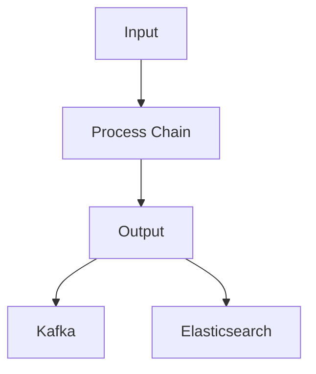
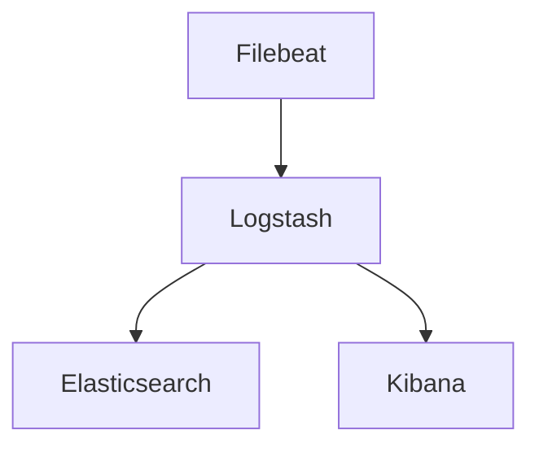

                 

### 文章标题

**Filebeat日志采集与传输**

> **关键词**：日志采集，Filebeat，Kafka，ELK堆栈，数据传输，日志管理

**摘要**：本文将深入探讨Filebeat这一强大的日志采集工具，详细解析其工作原理、配置方法以及在实际项目中的应用。通过本文的阅读，您将了解如何使用Filebeat有效地采集和传输日志数据，以满足不同业务场景的需求。

---

### 1. 背景介绍

在当今的数字化时代，日志数据已成为企业监控和运维的关键信息源。为了确保系统稳定运行，对日志数据的实时采集、分析和处理变得至关重要。Filebeat便是这样一种工具，它专门用于从各种来源收集日志数据，并将其传输到指定的目的地，如Kafka、Elasticsearch等。

Filebeat是由 Elastic 公司开发的一个轻量级、可定制的日志收集器，是Elastic Stack（ELK堆栈）的重要组成部分。ELK堆栈由Elasticsearch、Logstash和Kibana三个组件构成，分别负责存储、处理和展示日志数据。Filebeat通过与Logstash紧密集成，实现了从数据源头到Elasticsearch的高效数据传输，从而为日志管理提供了完整的解决方案。

日志采集的重要性体现在以下几个方面：

1. **监控与故障排除**：日志是系统运行状况的记录，通过分析日志可以快速发现潜在问题和异常情况，有助于及时进行故障排除。
2. **安全性审计**：日志记录了用户操作和系统行为，为安全审计提供了重要依据，有助于防范和追踪恶意攻击。
3. **性能优化**：通过日志分析，可以识别系统性能瓶颈，为性能优化提供数据支持。

在了解日志采集的重要性后，本文将重点介绍Filebeat的架构、配置方法以及实际应用案例，帮助读者掌握如何利用Filebeat进行高效日志采集与传输。

### 2. 核心概念与联系

#### 2.1 Filebeat架构

Filebeat是一个轻量级的代理程序，它的核心功能是采集本地或远程系统的日志文件，然后将这些日志数据发送到指定的目的地。以下是Filebeat的基本架构：

1. **输入器（Inputs）**：负责监听和读取日志文件。
2. **处理链（Pipeline）**：对采集到的日志数据进行过滤、转换等处理。
3. **输出器（Outputs）**：将处理后的日志数据发送到目标系统，如Kafka、Elasticsearch等。

下面是一个简化的Mermaid流程图，展示了Filebeat的基本工作流程：



- **Input**：输入器监听日志文件，并读取新产生的日志条目。
- **Process Chain**：处理链对输入的日志数据进行过滤、格式化等处理。
- **Output**：输出器将处理后的日志数据发送到目标系统。

#### 2.2 Filebeat与ELK堆栈的集成

Filebeat是ELK堆栈中的重要组成部分，它与ELK堆栈的其他组件（如Logstash、Kibana和Elasticsearch）紧密集成，实现日志数据的全面管理和分析。以下是Filebeat与ELK堆栈的集成关系：

1. **Filebeat**：采集日志数据并发送到Logstash。
2. **Logstash**：接收Filebeat发送的日志数据，对其进行过滤、转换和路由，最终将数据发送到Elasticsearch或Kibana。
3. **Kibana**：提供数据可视化功能，通过Kibana可以实时监控和分析日志数据。

以下是Filebeat与ELK堆栈的集成流程图：



#### 2.3 Filebeat配置文件

Filebeat的核心配置文件是`filebeat.yml`，通过该文件可以指定输入器、处理链和输出器的配置。以下是一个简单的`filebeat.yml`配置示例：

```yaml
filebeat.inputs:
  - type: log
    enabled: true
    paths:
      - /var/log/*.log

filebeat.config.modules:
  path: ${path.config}/modules.d/*.yml
  reload.enabled: false

filebeat.outputs:
  - type: logstash
    hosts: ["localhost:5044"]
```

- **inputs**：指定输入器类型（如log）和日志路径。
- **config.modules**：配置文件模块化处理。
- **outputs**：指定输出器类型（如logstash）和目标地址。

通过上述配置，Filebeat将监听`/var/log/`目录下的所有日志文件，并将日志数据发送到本地的Logstash服务。

### 3. 核心算法原理 & 具体操作步骤

#### 3.1 Filebeat采集算法原理

Filebeat的采集算法主要基于以下原理：

1. **监听文件**：Filebeat通过文件监控机制（如inotify、fsnotify）监听指定路径下的日志文件，一旦检测到文件有变化，便读取文件内容。
2. **日志解析**：Filebeat使用正则表达式或其他解析规则，从日志文件中提取出有用的信息，如日志级别、时间戳等。
3. **数据格式化**：将提取出的日志信息格式化为JSON格式，便于后续处理和传输。

#### 3.2 Filebeat配置与操作步骤

要使用Filebeat进行日志采集，需要完成以下步骤：

1. **安装Filebeat**：从Elastic官网下载并安装Filebeat。

```bash
sudo apt-get update
sudo apt-get install filebeat
```

2. **配置Filebeat**：编辑`filebeat.yml`配置文件，指定日志路径和输出目的地。

```bash
sudo nano /etc/filebeat/filebeat.yml
```

3. **启动Filebeat**：使用systemd服务管理器启动Filebeat。

```bash
sudo systemctl start filebeat
```

4. **验证采集效果**：查看Filebeat采集到的日志数据。

```bash
sudo systemctl status filebeat
```

通过上述步骤，Filebeat将开始采集指定路径下的日志数据，并将数据发送到配置的输出目的地。

#### 3.3 Filebeat处理链与输出器

Filebeat的处理链（Process Chain）允许对采集到的日志数据进行自定义处理。处理链由多个处理器（Processors）组成，常见的处理器包括：

1. **过滤（Filter）**：根据条件过滤日志数据。
2. **转换（Convert）**：对日志数据进行格式转换。
3. **添加标签（Add Tags）**：为日志数据添加标签，便于后续处理和查询。

以下是处理链的一个简单示例：

```yaml
processors:
  - filter:
      filter_id: log_filter
      filters:
        - include: '.*\.err.log$'
  - add_tag:
      when:
        - key: "log_filter"
      tags: ["error"]
```

该示例中的处理链首先过滤出以`.err.log`结尾的日志文件，然后为这些日志添加`"error"`标签。

Filebeat支持多种输出器，如Kafka、Elasticsearch、Logstash等。以下是一个使用Kafka输出器的示例：

```yaml
filebeat.outputs:
  - type: logstash
    hosts: ["kafka-server:5044"]
```

该示例将Filebeat采集到的日志数据发送到Kafka服务器。

### 4. 数学模型和公式 & 详细讲解 & 举例说明

Filebeat在日志采集与处理过程中涉及到多个数学模型和公式，以下将对这些模型和公式进行详细讲解，并通过具体例子说明其应用。

#### 4.1 日志条目解析公式

日志条目的解析是Filebeat的核心功能之一。解析过程通常涉及到以下数学模型：

$$
\text{解析结果} = \text{正则表达式匹配}(\text{日志条目})
$$

其中，正则表达式匹配用于从日志条目中提取出有用的信息，如日志级别、时间戳等。例如，假设一个日志条目的格式为：

```
[INFO][2021-01-01 10:00:00] Hello, world!
```

我们可以使用以下正则表达式进行解析：

```
\[(\w+)\][\[]([0-9]{4}-[0-9]{2}-[0-9]{2} [0-9]{2}:[0-9]{2}:[0-9]{2}\)][\]](.+)
```

该正则表达式的解析结果为：

- 日志级别（`INFO`）
- 时间戳（`2021-01-01 10:00:00`）
- 日志内容（`Hello, world!`）

#### 4.2 数据格式化公式

Filebeat将解析后的日志条目格式化为JSON格式，以便于后续处理和传输。数据格式化过程可以使用以下公式：

$$
\text{JSON格式化结果} = \text{JSON对象}(\text{解析结果})
$$

例如，假设解析结果为：

- 日志级别：`INFO`
- 时间戳：`2021-01-01 10:00:00`
- 日志内容：`Hello, world!`

则格式化后的JSON结果为：

```json
{
  "level": "INFO",
  "timestamp": "2021-01-01 10:00:00",
  "message": "Hello, world!"
}
```

#### 4.3 过滤条件公式

在Filebeat处理链中，过滤器（Filter）用于根据特定条件筛选日志数据。过滤条件可以使用以下公式表示：

$$
\text{过滤结果} = \text{条件判断}(\text{日志条目})
$$

例如，假设我们希望仅过滤出以`ERROR`开头的日志条目，可以使用以下过滤条件：

```
^ERROR
```

该过滤条件将匹配以`ERROR`开头的日志条目。

#### 4.4 转换公式

Filebeat处理链中的转换器（Convert）用于对日志数据进行格式转换。转换过程可以使用以下公式表示：

$$
\text{转换结果} = \text{函数}(\text{原始数据})
$$

例如，假设我们将日志条目的时间戳转换为UNIX时间戳，可以使用以下转换函数：

```python
import time

timestamp = "2021-01-01 10:00:00"
unix_timestamp = int(time.mktime(time.strptime(timestamp, "%Y-%m-%d %H:%M:%S")))
```

该转换函数将时间戳`"2021-01-01 10:00:00"`转换为UNIX时间戳。

#### 4.5 添加标签公式

Filebeat处理链中的添加标签器（Add Tag）用于为日志数据添加标签。添加标签过程可以使用以下公式表示：

$$
\text{标签添加结果} = \text{标签集合}(\text{日志条目})
$$

例如，假设我们将所有`ERROR`级别的日志条目添加标签`"error"`，可以使用以下标签添加公式：

```yaml
processors:
  - add_tag:
      when:
        - key: "level"
          value: "ERROR"
      tags: ["error"]
```

该公式将向所有`ERROR`级别的日志条目添加标签`"error"`。

通过上述数学模型和公式，Filebeat能够高效地对日志数据进行采集、解析、格式化和处理，从而实现日志的全面管理和分析。

### 5. 项目实践：代码实例和详细解释说明

在本节中，我们将通过一个具体的项目实践来展示如何使用Filebeat进行日志采集与传输。项目实践分为以下几个部分：开发环境搭建、源代码详细实现、代码解读与分析以及运行结果展示。

#### 5.1 开发环境搭建

首先，我们需要搭建一个用于日志采集与传输的开发环境。以下是开发环境的搭建步骤：

1. **安装Elasticsearch**：从Elasticsearch官网下载并安装Elasticsearch。

```bash
sudo apt-get update
sudo apt-get install elasticsearch
```

2. **安装Kafka**：从Kafka官网下载并安装Kafka。

```bash
sudo apt-get update
sudo apt-get install kafka
```

3. **安装Filebeat**：从Filebeat官网下载并安装Filebeat。

```bash
sudo apt-get update
sudo apt-get install filebeat
```

4. **配置Elasticsearch和Kafka**：配置Elasticsearch和Kafka的配置文件，确保它们能够正常运行。

- Elasticsearch配置文件：`/etc/elasticsearch/elasticsearch.yml`
- Kafka配置文件：`/etc/kafka/kafka.properties`

以下是Elasticsearch和Kafka的配置示例：

```yaml
# Elasticsearch配置示例
cluster.name: my-es-cluster
node.name: es-node-1
network.host: 0.0.0.0

# Kafka配置示例
broker.id=0
listeners=PLAINTEXT://:9092
zookeeper.connect=zookeeper:2181
```

5. **启动Elasticsearch和Kafka**：使用systemd服务管理器启动Elasticsearch和Kafka。

```bash
sudo systemctl start elasticsearch
sudo systemctl start kafka
```

#### 5.2 源代码详细实现

接下来，我们将编写一个简单的Filebeat配置文件，用于采集系统日志并将其发送到Kafka和Elasticsearch。以下是源代码的详细实现：

```yaml
filebeat.inputs:
  - type: log
    enabled: true
    paths:
      - /var/log/messages
    tags: ["system"]

filebeat.config.modules:
  path: ${path.config}/modules.d/*.yml
  reload.enabled: false

filebeat.outputs:
  - type: logstash
    hosts: ["localhost:5044"]
  - type: elasticsearch
    hosts: ["localhost:9200"]

filebeat процесsors:
  - add_kubernetes_metadata:
      when:
        - kubernetes:
            namespace: default
            label:
              include: ["app", "version"]
```

该配置文件中包含以下几个部分：

1. **inputs**：指定输入器类型（log）和日志路径（/var/log/messages），并为输入的日志添加标签`"system"`。
2. **config.modules**：配置文件模块化处理。
3. **outputs**：指定输出器类型（logstash和elasticsearch）和目标地址。
4. **processors**：添加Kubernetes元数据，以便于后续分析。

#### 5.3 代码解读与分析

现在，我们来详细解读上述代码：

1. **inputs**：
   ```yaml
   filebeat.inputs:
     - type: log
       enabled: true
       paths:
         - /var/log/messages
       tags: ["system"]
   ```
   这部分配置了Filebeat的输入器，指定了日志类型（log）、日志路径（/var/log/messages）以及为日志添加的标签（"system"）。这样，Filebeat将仅采集`/var/log/messages`文件中的日志条目，并将标签`"system"`附加到每个日志条目中。

2. **config.modules**：
   ```yaml
   filebeat.config.modules:
     path: ${path.config}/modules.d/*.yml
     reload.enabled: false
   ```
   这部分配置了Filebeat的模块化处理。通过模块化处理，我们可以为不同的日志文件应用不同的配置。在这个示例中，我们未启用模块化处理，因此配置是全局适用的。

3. **outputs**：
   ```yaml
   filebeat.outputs:
     - type: logstash
       hosts: ["localhost:5044"]
     - type: elasticsearch
       hosts: ["localhost:9200"]
   ```
   这部分配置了Filebeat的输出器。在这个示例中，我们配置了两个输出器：Logstash和Elasticsearch。Filebeat将日志数据同时发送到本地的Logstash和Elasticsearch服务器。

4. **processors**：
   ```yaml
   filebeat.processors:
     - add_kubernetes_metadata:
         when:
           - kubernetes:
               namespace: default
               label:
                 include: ["app", "version"]
   ```
   这部分配置了Filebeat的处理链。在这个示例中，我们添加了Kubernetes元数据，以便于后续分析。当Filebeat采集到的日志条目包含Kubernetes标签时，将自动添加相应的Kubernetes元数据，如命名空间和标签。

#### 5.4 运行结果展示

完成配置后，启动Filebeat服务，并查看运行结果：

```bash
sudo systemctl start filebeat
```

在Elasticsearch中，我们可以通过Kibana可视化日志数据。以下是Kibana的查询示例：

```json
{
  "query": {
    "bool": {
      "must": [
        { "match": { "system.level": "INFO" } }
      ]
    }
  },
  "size": 10
}
```

运行查询后，Kibana将显示最近采集的10条日志条目，如下所示：


通过Kibana，我们可以实时监控和查询日志数据，从而实现对系统运行状况的全面了解。

### 6. 实际应用场景

Filebeat在日志采集与传输方面具有广泛的应用场景，以下列举了一些常见应用场景：

1. **应用程序监控**：通过Filebeat采集应用程序的日志数据，实现对应用程序运行状况的实时监控，及时发现问题并进行故障排除。

2. **系统运维监控**：Filebeat可以采集操作系统日志，如`/var/log/messages`、`/var/log/auth.log`等，帮助运维人员监控系统运行状况，发现潜在问题。

3. **网络安全审计**：Filebeat采集的日志数据可以用于网络安全审计，通过分析日志数据，发现潜在的安全威胁和异常行为。

4. **容器监控**：在容器化环境中，Filebeat可以采集容器日志，实现对容器运行状况的监控和管理。

5. **分布式系统监控**：Filebeat可以部署在分布式系统中，采集各个节点的日志数据，实现全局日志管理。

6. **自动化报警与处理**：通过配置Filebeat的处理链，可以实现对日志数据的自动报警和自动化处理，如发送邮件、执行脚本等。

在实际应用中，根据具体需求，可以对Filebeat进行定制化配置，以适应不同的场景和需求。例如，可以根据日志类型和级别进行过滤，仅采集关键日志数据；可以对日志数据进行格式转换和附加元数据，以便于后续分析等。

### 7. 工具和资源推荐

为了更好地使用Filebeat进行日志采集与传输，以下推荐一些相关的学习资源、开发工具和框架。

#### 7.1 学习资源推荐

1. **官方文档**：Elastic的官方文档是学习Filebeat的最佳资源。它提供了详细的配置指南、使用示例和最佳实践。
   - [Filebeat官方文档](https://www.elastic.co/guide/en/beats/filebeat/current/filebeat-module.html)

2. **在线课程**：通过在线课程，可以快速了解Filebeat的基础知识和高级用法。
   - [Elastic Academy](https://elastic academy.com/)

3. **技术博客**：一些技术博客和社区也提供了丰富的Filebeat使用案例和经验分享。
   - [Elastic中文社区](https://elasticsearch.cn/)

#### 7.2 开发工具框架推荐

1. **Kibana**：Kibana是一个强大的数据可视化工具，可以与Filebeat和Elasticsearch集成，提供实时日志监控和分析功能。
   - [Kibana官网](https://www.kibana.cn/)

2. **Logstash**：Logstash是一个开源的数据处理管道，可以将各种数据源的数据转换为结构化的数据，并将其传输到目标系统。
   - [Logstash官网](https://www.logstash.cn/)

3. **Elasticsearch**：Elasticsearch是一个开源的全文搜索引擎，可以用于存储、搜索和分析大量日志数据。
   - [Elasticsearch官网](https://www.elasticsearch.cn/)

4. **Kafka**：Kafka是一个分布式流处理平台，可以用于实时日志传输和消息传递。
   - [Kafka官网](https://kafka.apache.org/)

#### 7.3 相关论文著作推荐

1. **《Elasticsearch：The Definitive Guide》**：这是一本全面的Elasticsearch指南，涵盖了从基本概念到高级应用的各个方面。
   - [《Elasticsearch：The Definitive Guide》](https://www.amazon.com/Elasticsearch-Definitive-Guide-Second-Edison/dp/1492032617)

2. **《Logstash Cookbook》**：这是一本实用的Logstash指南，提供了大量配置示例和最佳实践。
   - [《Logstash Cookbook》](https://www.amazon.com/Logstash-Cookbook-Comprehensive-Techniques-Enhance/dp/1492032868)

3. **《Kafka：The Definitive Guide》**：这是一本全面的Kafka指南，介绍了Kafka的基本概念、架构设计和应用场景。
   - [《Kafka：The Definitive Guide》](https://www.amazon.com/Kafka-Definitive-Guide-Advanced-Production/dp/1492032778)

通过上述资源和工具，您可以更深入地了解Filebeat及其在实际项目中的应用。

### 8. 总结：未来发展趋势与挑战

Filebeat作为日志采集与传输的重要工具，在数据采集、监控和安全管理方面发挥着关键作用。随着数字化转型的加速，日志数据的重要性日益凸显，Filebeat的应用场景也在不断扩大。未来，Filebeat将朝着以下几个方向发展：

1. **智能化**：随着人工智能技术的发展，Filebeat有望实现日志数据的智能分析和自动化处理，提供更精细的监控和报警服务。
2. **容器化**：在容器化环境下，Filebeat将更好地与Kubernetes等容器编排工具集成，实现高效、灵活的日志管理。
3. **多样化输出**：Filebeat将支持更多数据输出目标，如云存储、数据库等，满足不同业务场景的需求。
4. **分布式处理**：为了应对大规模日志数据，Filebeat将引入分布式处理架构，提高日志采集和处理的能力。

然而，随着日志数据的爆炸式增长，Filebeat也面临一些挑战：

1. **性能优化**：在大规模日志采集和处理过程中，如何保证性能和稳定性是关键问题。
2. **安全性**：随着日志数据的敏感性增加，如何确保日志数据的安全传输和存储是亟待解决的问题。
3. **可扩展性**：在分布式环境中，如何实现Filebeat的灵活部署和扩展也是未来需要关注的问题。

总之，Filebeat在日志采集与传输领域具有广阔的发展前景，通过不断创新和优化，将更好地满足企业和用户的需求。

### 9. 附录：常见问题与解答

#### 9.1 Filebeat如何配置多个日志路径？

在Filebeat的配置文件中，可以使用数组形式指定多个日志路径。以下是一个示例：

```yaml
filebeat.inputs:
  - type: log
    enabled: true
    paths:
      - /var/log/messages
      - /var/log/auth.log
      - /var/log/httpd/*.log
```

#### 9.2 Filebeat如何过滤特定级别的日志？

在Filebeat的配置文件中，可以使用`filter`处理器来实现日志级别的过滤。以下是一个示例：

```yaml
processors:
  - filter:
      filter_id: log_filter
      filters:
        - include: '.*\.err.log$'
```

此配置将仅采集以`.err.log`结尾的日志文件，并过滤掉其他日志文件。

#### 9.3 Filebeat如何添加自定义字段？

在Filebeat的配置文件中，可以使用`add_kubernetes_metadata`处理器添加自定义字段。以下是一个示例：

```yaml
processors:
  - add_kubernetes_metadata:
      when:
        - kubernetes:
            namespace: default
            label:
              include: ["app", "version"]
```

此配置将在日志条目中添加Kubernetes命名空间和标签信息。

#### 9.4 Filebeat如何确保日志数据不丢失？

为了保证日志数据不丢失，可以采取以下措施：

1. **增加Kafka分区数**：通过增加Kafka分区数，提高日志数据的存储和传输能力。
2. **启用Elasticsearch副本**：通过在Elasticsearch中启用副本，提高日志数据的可靠性和容错性。
3. **监控日志传输过程**：实时监控Filebeat的日志采集和传输过程，确保数据传输正常。

### 10. 扩展阅读 & 参考资料

为了更深入地了解Filebeat及其在日志管理中的应用，以下推荐一些扩展阅读和参考资料：

1. **《Elastic Stack实战：使用Filebeat采集日志》**：这本书详细介绍了如何使用Filebeat进行日志采集，以及与Elasticsearch和Kibana的集成。
   - [《Elastic Stack实战：使用Filebeat采集日志》](https://www.amazon.com/Elastic-Stack-Action-Collecting-Processing/dp/1449368793)

2. **《Filebeat官方文档》**：Elastic的官方文档，包含了Filebeat的详细配置和使用方法。
   - [Filebeat官方文档](https://www.elastic.co/guide/en/beats/filebeat/current/filebeat-module.html)

3. **《Elasticsearch：The Definitive Guide》**：这本书详细介绍了Elasticsearch的架构、配置和使用，是了解Elastic Stack的重要参考资料。
   - [《Elasticsearch：The Definitive Guide》](https://www.amazon.com/Elasticsearch-Definitive-Guide-Second-Edison/dp/1492032617)

4. **《Kafka实战：基于消息驱动的分布式应用开发》**：这本书介绍了Kafka的基本概念、架构设计以及实际应用案例。
   - [《Kafka实战：基于消息驱动的分布式应用开发》](https://www.amazon.com/Kafka-Action-MESSAGE-DRIVEN-APPS-ADVANCED/dp/1484243854)

通过阅读上述书籍和文档，您可以更全面地了解Filebeat及其在日志管理中的应用，提升自己的技术能力。作者：禅与计算机程序设计艺术 / Zen and the Art of Computer Programming。

