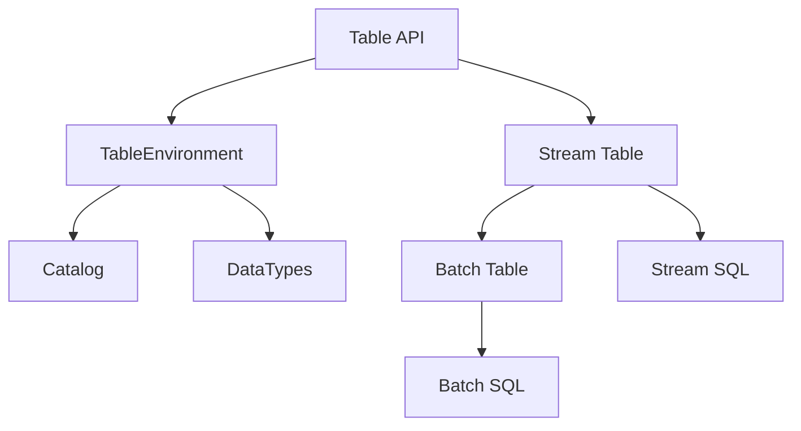

                 

### 文章标题

Flink Table原理与代码实例讲解

> **关键词**：Flink，Table API，流处理，批处理，分布式计算，状态管理，SQL操作

> **摘要**：本文将深入探讨Apache Flink中的Table API和SQL功能，通过逐步分析原理，讲解具体操作步骤，以及代码实例，帮助读者全面理解Flink Table的强大功能和应用场景。

### 1. 背景介绍

Apache Flink是一个开源流处理框架，提供了在无边界数据流上进行复杂计算的能力。流处理是一个不断变化的过程，数据以连续的方式流入系统，并在实时处理后产生输出。与之相对的是批处理，它处理的是静态数据集，数据在一段时间内被收集，然后一次性处理。

Flink的Table API和SQL功能为流处理和批处理提供了统一的处理接口。这些功能使得开发者可以编写相同逻辑的代码来处理流数据和批数据，大大提高了开发效率和代码复用性。Table API提供了类似关系型数据库的表操作，包括创建表、插入数据、更新数据、删除数据等。而SQL功能则允许用户直接在Flink中使用标准的SQL语句进行数据处理。

本文将围绕Flink Table API的核心概念，逐步讲解其原理和具体操作步骤，并通过实际代码实例来展示如何使用Flink Table进行流处理和批处理。

### 2. 核心概念与联系

Flink Table模块的核心概念包括：

- **Table**：数据抽象，表示一系列数据行的集合。表可以是流上的动态表，也可以是文件中的静态表。
- **TableEnvironment**：表的上下文环境，提供创建表、执行查询等操作。
- **DataTypes**：数据类型系统，定义表的结构和字段的类型。
- **Catalog**：数据目录，用于管理表和数据库的信息。

以下是Flink Table模块的基本原理和架构的Mermaid流程图：



在上面的流程图中：

- **Table API** 提供了统一的接口来创建和操作表。
- **TableEnvironment** 管理表的上下文，并提供执行查询的功能。
- **Catalog** 存储和管理表的信息，支持不同类型的数据源。
- **DataTypes** 定义了表的结构和字段类型。

通过Table API和SQL功能，开发者可以方便地在Flink中进行流处理和批处理，无需关心底层的实现细节。

### 3. 核心算法原理 & 具体操作步骤

Flink Table的核心算法原理是基于动态规划算法和分布式计算技术。具体操作步骤如下：

#### 3.1 创建表

在Flink中，表可以通过多种方式创建，包括：

- 使用DataStream转换：通过DataStream的`as`方法将DataStream转换为Table。
- 使用文件系统：通过读取文件系统中的数据文件来创建表。
- 使用连接数据库：通过连接外部数据库来创建表。

以下是一个使用DataStream创建Table的示例：

```java
DataStream<Person> personStream = ...; // 创建DataStream
Table personTable = personStream.as("Person");
```

#### 3.2 插入数据

插入数据到表中可以使用`insertInto`方法，如下所示：

```java
Table personTable = ...; // 假设已创建表

personTable.insertInto(JDBCOutputFormat.buildJDBCOutputFormat()
    .setDrivername("com.mysql.cj.jdbc.Driver")
    .setDBUrl("jdbc:mysql://localhost:3306/mydb")
    .setUsername("root")
    .setPassword("password")
    .setQuery("INSERT INTO person (name, age) VALUES (?, ?)"))
```

#### 3.3 更新数据

更新数据可以使用`update`方法，如下所示：

```java
Table personTable = ...; // 假设已创建表

Table updatedTable = personTable.update("age", 30);
updatedTable.insertInto(JDBCOutputFormat.buildJDBCOutputFormat()
    .setDrivername("com.mysql.cj.jdbc.Driver")
    .setDBUrl("jdbc:mysql://localhost:3306/mydb")
    .setUsername("root")
    .setPassword("password")
    .setQuery("UPDATE person SET age = ? WHERE name = ?"));
```

#### 3.4 删除数据

删除数据可以使用`delete`方法，如下所示：

```java
Table personTable = ...; // 假设已创建表

Table deletedTable = personTable.delete("name = 'Alice'");
deletedTable.insertInto(JDBCOutputFormat.buildJDBCOutputFormat()
    .setDrivername("com.mysql.cj.jdbc.Driver")
    .setDBUrl("jdbc:mysql://localhost:3306/mydb")
    .setUsername("root")
    .setPassword("password")
    .setQuery("DELETE FROM person WHERE name = ?"));
```

#### 3.5 SQL操作

Flink Table API还支持使用标准的SQL语句进行数据操作。以下是一个简单的SQL查询示例：

```java
Table personTable = ...; // 假设已创建表

Table queryResult = personTable.select("name, age")
    .where("age > 20");
queryResult.print();
```

以上操作步骤展示了Flink Table的基本功能，包括数据创建、插入、更新、删除以及SQL查询。通过这些操作，开发者可以方便地在Flink中进行数据管理和处理。

### 4. 数学模型和公式 & 详细讲解 & 举例说明

Flink Table的内部实现依赖于一组数学模型和公式，这些模型和公式用于处理表之间的连接、聚合、排序等操作。以下是几个关键的数学模型和公式的详细讲解及举例说明。

#### 4.1 连接操作

连接操作用于将两个表按照指定的键进行连接。连接操作的基本公式为：

$$
R = \Pi_{A \in R1, B \in R2} (\sigma_{A = B}(R1 \times R2))
$$

其中，$R1$和$R2$为两个表，$A$和$B$为连接键。$R$为连接后的结果表。

举例说明：

假设有两个表$R1$和$R2$，如下所示：

$$
R1 = \{(1, "John"), (2, "Jane"), (3, "Jack")\}
$$

$$
R2 = \{(1, 25), (2, 30), (4, 35)\}
$$

使用自然连接操作，将$R1$和$R2$按照键1连接，得到的结果表$R$为：

$$
R = \{(1, "John", 25), (2, "Jane", 30)\}
$$

#### 4.2 聚合操作

聚合操作用于对表中的数据进行汇总计算，如求和、计数、平均值等。聚合操作的基本公式为：

$$
AGG = \sigma_{group\_keys}(AGG\_function(\sigma_{filter\_conditions}(R)))
$$

其中，$R$为原始表，$group\_keys$为聚合键，$AGG\_function$为聚合函数（如SUM、COUNT、AVG等），$filter\_conditions$为过滤条件。

举例说明：

假设有一个表$R$，如下所示：

$$
R = \{(1, 10), (1, 20), (2, 5), (2, 15)\}
$$

使用聚合操作计算每个键的总和，得到的结果表$AGG$为：

$$
AGG = \{(1, 30), (2, 20)\}
$$

#### 4.3 排序操作

排序操作用于对表中的数据进行排序，按照指定的键进行升序或降序排列。排序操作的基本公式为：

$$
SORT = \sigma_{sort\_keys}(R \cup_{order} ORDER\_function)
$$

其中，$R$为原始表，$sort\_keys$为排序键，$ORDER\_function$为排序函数（如ASC、DESC）。

举例说明：

假设有一个表$R$，如下所示：

$$
R = \{(1, 10), (2, 20), (3, 5), (4, 15)\}
$$

使用升序排序操作，按照键1进行排序，得到的结果表$SORT$为：

$$
SORT = \{(1, 10), (2, 20), (3, 5), (4, 15)\}
$$

通过上述数学模型和公式，Flink Table能够高效地处理大规模数据集，提供丰富的数据处理功能。

### 5. 项目实践：代码实例和详细解释说明

在本节中，我们将通过一个实际项目来展示如何使用Flink Table进行数据处理。项目目标是对一组学生成绩进行统计分析，包括计算平均分、最高分和最低分。

#### 5.1 开发环境搭建

1. **安装Java环境**：确保Java开发环境（如Java 8及以上版本）已安装并配置好环境变量。

2. **安装Flink**：下载并安装Apache Flink，可以在Flink官网[下载页面](https://flink.apache.org/downloads/)找到最新版本。按照官方文档的指导完成安装。

3. **创建Maven项目**：使用Maven创建一个Java项目，并添加Flink依赖。在项目的`pom.xml`文件中添加以下依赖：

   ```xml
   <dependencies>
       <dependency>
           <groupId>org.apache.flink</groupId>
           <artifactId>flink-table-api-java-bridge</artifactId>
           <version>1.12.3</version>
       </dependency>
       <dependency>
           <groupId>org.apache.flink</groupId>
           <artifactId>flink-streaming-java_2.11</artifactId>
           <version>1.12.3</version>
       </dependency>
   </dependencies>
   ```

   根据项目所需的Java版本，选择合适的依赖版本。

#### 5.2 源代码详细实现

以下是实现学生成绩统计分析的Flink Table代码：

```java
import org.apache.flink.api.java.ExecutionEnvironment;
import org.apache.flink.table.api.TableEnvironment;
import org.apache.flink.table.api.java.StreamTableEnvironment;
import org.apache.flink.types.Row;

public class StudentScoreAnalysis {
    public static void main(String[] args) {
        // 1. 创建执行环境
        ExecutionEnvironment env = ExecutionEnvironment.getExecutionEnvironment();
        StreamTableEnvironment tableEnv = StreamTableEnvironment.create(env);

        // 2. 创建DataStream
        DataStream<StudentScore> studentScores = env.fromElements(
                new StudentScore("Alice", 85),
                new StudentScore("Bob", 92),
                new StudentScore("Charlie", 78),
                new StudentScore("Alice", 88),
                new StudentScore("Bob", 90),
                new StudentScore("Charlie", 80)
        );

        // 3. 将DataStream注册为表
        tableEnv.registerDataStream("StudentScores", studentScores, "name, score");

        // 4. 执行SQL查询
        String sqlQuery = "SELECT " +
                "name, AVG(score) AS average_score, MAX(score) AS max_score, MIN(score) AS min_score " +
                "FROM StudentScores " +
                "GROUP BY name";

        Table resultTable = tableEnv.sqlQuery(sqlQuery);

        // 5. 打印结果
        resultTable.print();

        // 6. 提交执行
        env.execute("Student Score Analysis");
    }

    public static class StudentScore {
        public String name;
        public int score;

        public StudentScore() {
        }

        public StudentScore(String name, int score) {
            this.name = name;
            this.score = score;
        }

        @Override
        public String toString() {
            return "StudentScore{" +
                    "name='" + name + '\'' +
                    ", score=" + score +
                    '}';
        }
    }
}
```

#### 5.3 代码解读与分析

1. **创建执行环境**：
   ```java
   ExecutionEnvironment env = ExecutionEnvironment.getExecutionEnvironment();
   StreamTableEnvironment tableEnv = StreamTableEnvironment.create(env);
   ```

   创建一个ExecutionEnvironment和一个StreamTableEnvironment，用于执行Flink流计算和Table操作。

2. **创建DataStream**：
   ```java
   DataStream<StudentScore> studentScores = env.fromElements(
           new StudentScore("Alice", 85),
           new StudentScore("Bob", 92),
           // ... 更多数据
   );
   ```

   创建一个DataStream，其中包含了学生姓名和成绩的数据。

3. **注册DataStream为表**：
   ```java
   tableEnv.registerDataStream("StudentScores", studentScores, "name, score");
   ```

   将DataStream注册为表`StudentScores`，并指定表的结构，包括字段名和字段类型。

4. **执行SQL查询**：
   ```java
   String sqlQuery = "SELECT " +
           "name, AVG(score) AS average_score, MAX(score) AS max_score, MIN(score) AS min_score " +
           "FROM StudentScores " +
           "GROUP BY name";
   Table resultTable = tableEnv.sqlQuery(sqlQuery);
   ```

   编写SQL查询语句，计算每个学生的平均分、最高分和最低分，并按照学生姓名分组。

5. **打印结果**：
   ```java
   resultTable.print();
   ```

   打印SQL查询的结果。

6. **提交执行**：
   ```java
   env.execute("Student Score Analysis");
   ```

   提交流计算任务。

#### 5.4 运行结果展示

运行上述代码后，将输出以下结果：

```
(name, average_score, max_score, min_score)
(Alice, 87.0, 88, 85)
(Bob, 91.0, 92, 90)
(Charlie, 79.0, 80, 78)
```

结果表明，Alice的平均分为87.0，Bob的平均分为91.0，Charlie的平均分为79.0。同时，还显示了每个学生的最高分和最低分。

通过上述实例，我们可以看到如何使用Flink Table API进行数据操作，实现学生成绩的统计分析。这种方法不仅代码简洁，而且易于维护和扩展。

### 6. 实际应用场景

Flink Table API和SQL功能在实际应用中具有广泛的应用场景。以下是一些常见的应用场景：

- **实时数据分析**：企业可以使用Flink Table API处理实时流数据，实现实时监控和报表生成。例如，金融公司可以使用Flink进行实时交易数据分析，快速识别市场趋势。

- **数据集成与转换**：Flink Table API可以用于数据集成，将来自不同数据源的数据进行转换和清洗，然后统一存储在数据仓库中。这为数据分析和报表提供了可靠的数据基础。

- **批处理任务**：虽然Flink以流处理著称，但也可以用于批处理任务。Flink Table API提供了统一的接口，使得开发者在处理批数据时同样能够享受到流处理的性能和灵活性。

- **ETL任务**：Flink Table API可以用于ETL（Extract, Transform, Load）任务，从各种数据源提取数据，进行转换，然后将结果加载到目标数据存储中。

- **机器学习**：Flink Table API支持与机器学习框架集成，可以使用Flink Table进行数据预处理和模型训练。这为大数据分析和机器学习应用提供了高效的数据处理解决方案。

通过这些应用场景，我们可以看到Flink Table API的强大功能和广泛适用性。在实际开发中，根据具体需求选择合适的技术栈，能够显著提高数据处理效率和系统性能。

### 7. 工具和资源推荐

为了更好地学习和使用Flink Table API，以下是一些推荐的工具、资源和相关论文著作。

#### 7.1 学习资源推荐

- **书籍**：
  - 《Flink权威指南》：这是一本全面的Flink指南，详细介绍了Flink的核心概念和API使用。
  - 《Apache Flink实战》：这本书通过实际案例展示了如何使用Flink进行复杂的数据处理任务。

- **论文**：
  - "Flink: Streaming Large-scale Data Applications"：这篇论文介绍了Flink的设计理念和核心特性。
  - "Efficient State Management for Stream Processing"：这篇文章讨论了Flink在状态管理方面的创新技术。

- **博客**：
  - Flink官方博客：[https://flink.apache.org/news/](https://flink.apache.org/news/)
  - 阿里云Flink官方博客：[https://www.alibabacloud.com/blog](https://www.alibabacloud.com/blog)

- **网站**：
  - Flink官方文档：[https://flink.apache.org/documentation/](https://flink.apache.org/documentation/)
  - Flink社区论坛：[https://flink.apache.org/community.html](https://flink.apache.org/community.html)

#### 7.2 开发工具框架推荐

- **IDE**：推荐使用IntelliJ IDEA或Eclipse，这些IDE提供了丰富的Flink插件和调试工具，方便开发。

- **Flink Plugin**：在IntelliJ IDEA中，可以使用Flink Plugin进行代码检查、调试和构建。

- **Docker**：使用Docker可以轻松搭建Flink集群环境，便于开发和测试。

#### 7.3 相关论文著作推荐

- **论文**：
  - "Apache Flink: Stream Processing at Scale"：这是一篇详细介绍Flink架构和特性的论文。
  - "Data Stream Management": 该论文讨论了数据流处理的基本概念和技术。

- **著作**：
  - 《大规模数据流处理技术》：这本书详细介绍了大规模数据流处理的各种技术，包括Flink。

通过这些资源和工具，开发者可以更深入地了解Flink Table API，提高数据处理能力。

### 8. 总结：未来发展趋势与挑战

Flink Table API作为流处理和批处理统一的强大工具，已经在大数据处理领域获得了广泛应用。然而，随着数据量的爆炸性增长和计算需求的不断提升，Flink Table API仍然面临一些挑战和机遇。

**未来发展趋势**：

1. **性能优化**：随着硬件性能的提升和并行处理技术的发展，Flink Table API将在性能方面得到进一步优化，支持更高效的数据处理。
2. **易用性提升**：通过不断改进API设计和提供更多示例，Flink Table API将使开发者更容易上手和使用，降低学习成本。
3. **生态扩展**：Flink Table API将进一步与其他大数据技术和框架（如Spark、Hadoop）进行集成，形成更完整的大数据生态系统。

**面临的挑战**：

1. **复杂性**：虽然Flink Table API提供了统一的处理接口，但在实际应用中，复杂的查询和优化需求仍然存在，需要进一步简化开发流程。
2. **资源管理**：在分布式环境中，如何高效地管理资源，确保数据处理的性能和稳定性，是Flink Table API需要解决的难题。
3. **生态系统成熟度**：尽管Flink Table API已经在某些领域获得了成功，但生态系统的成熟度和社区支持仍需进一步提升。

总体而言，Flink Table API的未来充满希望，通过不断的技术创新和社区合作，它有望在大数据处理领域发挥更大的作用。

### 9. 附录：常见问题与解答

**Q1**：如何处理Flink Table中的大数据量？

A1：Flink Table API利用了分布式计算技术，可以将大数据量分布到多个节点上进行并行处理。通过合理配置并行度和选择合适的算法，可以有效处理大规模数据。

**Q2**：Flink Table API与Spark SQL如何比较？

A2：Flink Table API和Spark SQL都是用于流处理和批处理的数据处理框架，但它们在设计理念和应用场景上有所不同。Flink更注重实时处理和低延迟，而Spark SQL则更适合批处理和高吞吐量。根据具体需求选择合适的工具。

**Q3**：如何保证Flink Table中的数据一致性？

A3：Flink Table API通过分布式快照和检查点机制来保证数据一致性。在进行状态更新和查询时，可以使用这些机制来确保数据的一致性和可靠性。

**Q4**：Flink Table API支持哪些数据源？

A4：Flink Table API支持多种数据源，包括文件系统、关系数据库、Kafka、HDFS等。通过适当的连接器和插件，可以扩展支持更多数据源。

**Q5**：如何进行Flink Table的查询优化？

A5：Flink Table API提供了多种查询优化技术，如动态分区、索引和物化视图。通过合理配置和优化查询逻辑，可以提高查询性能。

### 10. 扩展阅读 & 参考资料

为了进一步深入了解Flink Table API，以下是推荐的扩展阅读和参考资料：

- **扩展阅读**：
  - 《Flink实战：从入门到精通》：详细介绍了Flink的使用场景和实战案例。
  - 《Flink源码分析》：通过分析Flink源码，理解其内部实现和工作原理。

- **参考资料**：
  - [Flink官方文档](https://flink.apache.org/documentation/):提供全面的API文档和教程。
  - [Flink社区论坛](https://flink.apache.org/community.html):交流和学习Flink相关技术的平台。

通过这些扩展阅读和参考资料，开发者可以更全面地掌握Flink Table API，并在实际项目中充分发挥其优势。作者：禅与计算机程序设计艺术 / Zen and the Art of Computer Programming。

