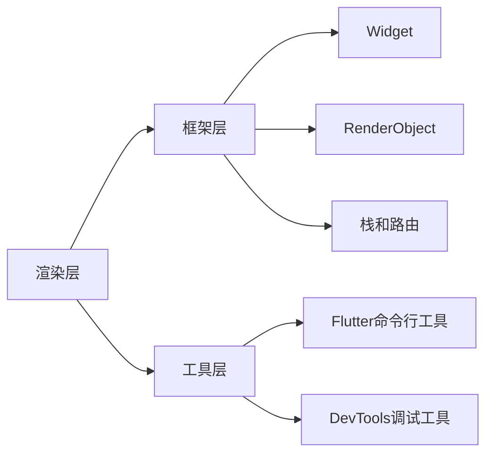

                 

关键词：Flutter、跨平台开发、原生应用、UI设计、开发效率、性能优化

## 摘要

随着移动设备的普及，跨平台开发的需求日益增长。Flutter作为一款由Google推出的开源UI框架，以其高性能、易于上手和高度可定制的特性，成为了众多开发者和企业的首选。本文将深入探讨Flutter的跨平台开发优势，详细解读其核心概念与原理，并分享实际项目中的实践经验。通过这篇文章，读者将能够全面了解Flutter的开发流程，掌握构建漂亮原生应用的技巧。

## 1. 背景介绍

在移动应用开发领域，跨平台开发已经成为主流趋势。传统的原生开发需要分别针对iOS和Android平台进行开发，这不仅增加了开发成本和时间，而且也限制了开发者的灵活性。为了解决这一问题，跨平台框架应运而生。Flutter作为其中的一员，凭借其独特的优势迅速获得了广泛的关注和认可。

Flutter最初在2017年Google I/O大会上发布，它基于Dart语言，提供了丰富的UI组件和强大的开发工具，使得开发者能够使用一套代码库同时开发iOS和Android应用。Flutter的应用范围非常广泛，从简单的信息展示应用，到复杂的高性能游戏，Flutter都能够胜任。

本文将围绕Flutter的核心概念、开发流程、性能优化和实际应用场景展开讨论，旨在帮助开发者快速掌握Flutter的开发技巧，高效构建漂亮的跨平台原生应用。

## 2. 核心概念与联系

### 2.1 Flutter架构概述

Flutter的架构设计采用了分层结构，每一层都有其特定的功能和目的。以下是Flutter架构的主要层次：

- **渲染层**：Flutter使用自己的渲染引擎Skia，实现了高性能的2D图形渲染。这使得Flutter应用在界面交互和动画效果方面具有极强的表现力。
  
- **框架层**：提供了一系列核心功能，包括事件处理、布局管理、样式定义等。框架层使得开发者可以轻松实现各种UI组件和交互效果。

- **Dart语言**：作为Flutter的开发语言，Dart具有简洁的语法和强大的功能。Dart不仅支持面向对象编程，还支持函数式编程，这使得Flutter应用具有很高的灵活性和可维护性。

- **工具层**：包括Flutter命令行工具、DevTools调试工具等。这些工具大大提高了开发效率，帮助开发者快速定位和解决问题。

### 2.2 Flutter核心概念原理

#### 2.2.1 Widget

Widget是Flutter的核心概念之一。它代表了应用程序中的一个可视元素，可以是文本、按钮、图片等。Flutter使用声明式编程模型，通过定义一系列Widget来构建UI界面。每个Widget都包含了一组属性和方法，用于定义其外观和行为。

#### 2.2.2 RenderObject

RenderObject是Flutter中的渲染对象，负责实际绘制UI组件。每个Widget都对应一个RenderObject，Flutter框架会根据Widget的属性和状态来创建和更新RenderObject。RenderObject负责计算和布局，最终将绘制结果输出到屏幕上。

#### 2.2.3 栈和路由

Flutter使用栈（Stack）和路由（Route）来管理应用中的页面切换和导航。栈用于实现页面的后退和前进操作，路由则用于定义页面之间的跳转逻辑。开发者可以通过定义路由规则来控制应用中的页面导航。

### 2.3 Flutter架构的Mermaid流程图

以下是Flutter架构的Mermaid流程图：



通过这个流程图，我们可以清晰地看到Flutter各个层次之间的关系和功能。

## 3. 核心算法原理 & 具体操作步骤

### 3.1 算法原理概述

Flutter的核心算法主要涉及两个方面：UI渲染和布局管理。

#### 3.1.1 UI渲染算法

Flutter的UI渲染算法基于Skia图形库，它采用层渲染（Layer Rendering）技术，将UI组件分解为多个层，然后逐层进行绘制。这种渲染方式具有以下优点：

- **高性能**：层渲染可以将复杂的UI拆分成多个独立的部分，从而减少渲染复杂度和资源占用，提高渲染性能。

- **可并行化**：由于层渲染是独立的，因此可以将渲染任务并行化，提高渲染效率。

- **动态性**：Flutter支持动态修改UI组件的属性，例如颜色、位置和大小等，这些修改可以实时反映在渲染结果中。

#### 3.1.2 布局管理算法

Flutter的布局管理基于约束布局（Constraint Layout）模型。约束布局通过设置一系列约束条件来定义UI组件的布局关系，Flutter引擎会根据这些约束条件计算组件的最终位置和大小。约束布局具有以下特点：

- **灵活性**：约束布局可以轻松实现各种复杂的布局效果，例如线性布局、网格布局和相对布局等。

- **响应式**：Flutter支持响应式布局，可以根据屏幕尺寸和方向的变化自动调整UI组件的布局。

### 3.2 算法步骤详解

#### 3.2.1 UI渲染步骤

1. **构建Widget树**：开发者通过定义一系列Widget来构建UI界面，Flutter框架会根据Widget的属性和状态构建Widget树。

2. **创建RenderObject**：Flutter框架会为每个Widget创建一个对应的RenderObject，用于实际绘制UI组件。

3. **布局计算**：RenderObject根据约束条件计算UI组件的最终位置和大小。

4. **绘制渲染**：RenderObject将绘制结果输出到屏幕上。

#### 3.2.2 布局管理步骤

1. **设置约束条件**：开发者通过设置约束条件来定义UI组件的布局关系。

2. **布局计算**：Flutter引擎根据约束条件计算UI组件的最终位置和大小。

3. **绘制渲染**：布局计算完成后，UI组件被绘制到屏幕上。

### 3.3 算法优缺点

#### 优点

- **高性能**：Flutter采用层渲染技术，具有高性能的渲染能力。
  
- **灵活性**：Flutter支持响应式布局，可以轻松实现复杂的布局效果。

- **易于上手**：Flutter使用Dart语言，语法简洁，易于学习和使用。

#### 缺点

- **学习曲线**：对于初学者来说，Flutter的学习曲线可能相对较陡峭。
  
- **生态系统**：相较于原生开发框架，Flutter的生态系统还不够完善，某些功能可能需要开发者自行实现。

### 3.4 算法应用领域

Flutter的应用领域非常广泛，包括但不限于以下几个方面：

- **移动应用开发**：Flutter可以用于开发iOS和Android平台的原生移动应用。

- **Web应用开发**：Flutter支持Web平台，可以用于开发跨平台的Web应用。

- **桌面应用开发**：Flutter支持桌面平台，可以用于开发Windows、macOS和Linux平台的桌面应用。

- **游戏开发**：Flutter适用于游戏开发，特别是在2D游戏领域。

## 4. 数学模型和公式 & 详细讲解 & 举例说明

### 4.1 数学模型构建

Flutter的UI渲染和布局管理算法涉及多个数学模型，其中最核心的是约束布局模型。以下是约束布局模型的数学表达：

#### 约束方程

设UI组件的位置和大小分别为 \(x, y, w, h\)，则约束方程为：

$$
\begin{cases}
x + w \leq \text{容器宽度} \\
y + h \leq \text{容器高度}
\end{cases}
$$

#### 目标函数

目标函数用于优化UI组件的布局，常见的目标函数有：

$$
\min \sum_{i=1}^n (x_i - x)^2 + (y_i - y)^2
$$

其中，\(x_i, y_i\) 为 UI 组件的期望位置。

### 4.2 公式推导过程

#### 约束方程推导

约束方程是通过对UI组件的位置和大小进行线性约束得到的。假设UI组件的位置和大小分别为 \(x, y, w, h\)，则线性约束为：

$$
x + w \leq \text{容器宽度} \\
y + h \leq \text{容器高度}
$$

通过移项，可以得到约束方程：

$$
\begin{cases}
x + w \leq \text{容器宽度} \\
y + h \leq \text{容器高度}
\end{cases}
$$

#### 目标函数推导

目标函数是通过对UI组件的期望位置进行二次优化得到的。假设UI组件的期望位置为 \((x_0, y_0)\)，则二次优化函数为：

$$
\min \sum_{i=1}^n (x_i - x_0)^2 + (y_i - y_0)^2
$$

其中，\(x_i, y_i\) 为 UI 组件的实际位置。

### 4.3 案例分析与讲解

#### 案例一：线性布局

假设有一个宽度为400像素、高度为300像素的容器，需要放置两个文本组件，要求文本组件的宽度分别为100像素和200像素，高度分别为50像素和100像素，且文本组件之间间距为20像素。

**约束方程：**

$$
\begin{cases}
x_1 + 100 + 20 + 200 \leq 400 \\
y_1 + 50 + 20 + 100 \leq 300
\end{cases}
$$

**目标函数：**

$$
\min (x_1 - x_0)^2 + (y_1 - y_0)^2 + (x_2 - x_0)^2 + (y_2 - y_0)^2
$$

其中，\((x_0, y_0)\) 为容器的期望位置。

**求解过程：**

通过求解约束方程和目标函数，可以得到文本组件的最终位置。具体求解过程可以使用线性规划或约束优化算法。

#### 案例二：网格布局

假设有一个宽度为400像素、高度为300像素的容器，需要放置多个文本组件，要求文本组件呈网格状分布，每个文本组件的宽度为100像素，高度为50像素。

**约束方程：**

$$
\begin{cases}
x_i + 100 \leq \text{容器宽度} \\
y_i + 50 \leq \text{容器高度}
\end{cases}
$$

**目标函数：**

$$
\min \sum_{i=1}^n (x_i - x_0)^2 + (y_i - y_0)^2
$$

其中，\((x_0, y_0)\) 为容器的期望位置。

**求解过程：**

通过求解约束方程和目标函数，可以得到文本组件的最终位置。具体求解过程可以使用网格布局算法或约束优化算法。

## 5. 项目实践：代码实例和详细解释说明

### 5.1 开发环境搭建

要在本地电脑上搭建Flutter开发环境，请按照以下步骤操作：

1. **安装Dart SDK**：从官网下载并安装Dart SDK。Dart SDK包含了Dart语言编译器和命令行工具。

2. **安装Flutter SDK**：使用命令行安装Flutter SDK。打开终端，执行以下命令：

   ```bash
   flutter install
   ```

3. **设置环境变量**：将Flutter和Dart的路径添加到系统环境变量中，以便在命令行中直接使用Flutter命令。

4. **验证安装**：执行以下命令，验证Flutter环境是否搭建成功：

   ```bash
   flutter doctor
   ```

   如果出现绿色标志，说明环境搭建成功。

### 5.2 源代码详细实现

以下是一个简单的Flutter应用程序，用于展示文本和按钮：

```dart
import 'package:flutter/material.dart';

void main() {
  runApp(MyApp());
}

class MyApp extends StatelessWidget {
  @override
  Widget build(BuildContext context) {
    return MaterialApp(
      title: 'Flutter Demo',
      theme: ThemeData(
        primarySwatch: Colors.blue,
      ),
      home: MyHomePage(),
    );
  }
}

class MyHomePage extends StatelessWidget {
  @override
  Widget build(BuildContext context) {
    return Scaffold(
      appBar: AppBar(
        title: Text('Flutter Demo'),
      ),
      body: Center(
        child: Column(
          mainAxisAlignment: MainAxisAlignment.center,
          children: [
            Text('Hello, Flutter!'),
            ElevatedButton(
              onPressed: () {
                print('Button clicked!');
              },
              child: Text('Click Me'),
            ),
          ],
        ),
      ),
    );
  }
}
```

### 5.3 代码解读与分析

- **main函数**：程序的入口点，创建了一个`MyApp`对象并调用其`runApp`方法启动Flutter应用程序。

- **MyApp类**：`StatelessWidget`，定义了应用程序的顶级组件。在此示例中，它仅包含一个`MaterialApp`组件。

- **MaterialApp类**：定义了应用程序的基本布局和主题。在此示例中，它包含了一个`MyHomePage`组件作为首页。

- **MyHomePage类**：`StatelessWidget`，定义了应用程序的首页组件。它包含了一个`Scaffold`组件，用于构建应用程序的基本结构，以及一个`Center`组件用于使文本和按钮居中显示。

- **Scaffold类**：提供了一套标准的应用程序布局结构，包括导航栏、标题和浮动操作按钮等。

- **AppBar类**：导航栏组件，用于显示页面的标题和操作按钮。

- **Text类**：文本组件，用于显示文本内容。

- **ElevatedButton类**：按钮组件，用于响应用户点击事件。

### 5.4 运行结果展示

在命令行中执行以下命令：

```bash
flutter run
```

应用程序将在模拟器或真实设备上运行。界面将显示一个带有标题的页面，标题下方有一个文本和按钮。点击按钮会在控制台输出 "Button clicked!"。

## 6. 实际应用场景

Flutter在多个实际应用场景中表现出色，以下是一些典型的应用案例：

### 6.1 社交应用

Flutter的快速开发能力和丰富的UI组件，使其成为开发社交应用（如微信、微博）的理想选择。通过Flutter，开发者可以轻松实现复杂的界面效果和动画效果，提高用户体验。

### 6.2 金融应用

金融应用对性能和安全性有较高要求。Flutter的高性能渲染能力和出色的开发效率，使得开发者能够快速构建稳定、可靠的金融应用，如股票交易应用、理财应用等。

### 6.3 娱乐应用

Flutter在游戏开发领域也具有优势，特别是在2D游戏和轻度游戏开发中。通过Flutter，开发者可以快速创建丰富的游戏场景和动画效果，同时保持高性能。

### 6.4 企业应用

Flutter适用于构建企业级应用，如客户关系管理系统（CRM）、人力资源管理系统（HRMS）等。Flutter的跨平台特性降低了开发和维护成本，提高了开发效率。

### 6.5 教育应用

Flutter在教育领域也有广泛应用，如在线学习平台、教育游戏等。通过Flutter，开发者可以创建丰富多样的教学资源和互动体验，提高学习效果。

## 6.4 未来应用展望

随着技术的不断进步，Flutter在未来的应用前景将更加广阔。以下是Flutter未来可能的发展趋势：

### 6.4.1 新特性与功能

Flutter团队将持续推出新的特性和功能，以增强开发者的开发体验。例如，更丰富的UI组件库、更强大的动画和图形处理能力、更好的性能优化工具等。

### 6.4.2 开发者生态

Flutter的生态系统将进一步完善，包括更多的第三方库和工具，更多的开发文档和教程，以及更活跃的社区支持。这将有助于吸引更多的开发者加入Flutter阵营。

### 6.4.3 新平台支持

Flutter可能会扩展到更多的新平台，如Windows、Linux等。这将使得Flutter的应用范围更加广泛，开发者可以在更广泛的平台上构建跨平台应用。

### 6.4.4 性能优化

Flutter的性能将持续优化，以适应更复杂的应用场景。例如，通过引入更多的高级渲染技术、优化内存使用和减少垃圾回收等。

## 7. 工具和资源推荐

### 7.1 学习资源推荐

- **官方文档**：Flutter的官方文档是学习Flutter的最佳资源，涵盖了从入门到高级的各个方面。

- **在线教程**：有很多在线平台提供了Flutter教程，如Flutter By Example、Udemy等。

- **书籍**：《Flutter实战》和《Flutter高级编程》是两本非常受欢迎的Flutter书籍。

### 7.2 开发工具推荐

- **Visual Studio Code**：VS Code是一款功能强大的代码编辑器，支持Flutter插件和扩展。

- **Android Studio**：Android Studio是Android开发的首选IDE，它也提供了对Flutter的支持。

- **Flutter DevTools**：Flutter DevTools是一款强大的调试工具，可以帮助开发者诊断和优化Flutter应用。

### 7.3 相关论文推荐

- **"Flutter: Flexible UI Software Development Kit"**：这篇论文详细介绍了Flutter的设计原理和架构。

- **"Dart Programming Language Specification"**：Dart语言的官方规范，有助于深入了解Dart语言。

## 8. 总结：未来发展趋势与挑战

Flutter作为一种新兴的跨平台开发框架，已经在移动应用开发领域取得了显著的成果。未来，Flutter将继续在多个方面发展：

### 8.1 研究成果总结

- Flutter的核心概念和原理已经得到广泛认可，并在多个实际应用场景中表现出色。
  
- Flutter的生态系统不断完善，为开发者提供了丰富的工具和资源。

- Flutter的性能持续优化，为开发者提供了更好的开发体验。

### 8.2 未来发展趋势

- Flutter将扩展到更多的新平台，如Windows、Linux等，进一步扩大其应用范围。

- Flutter的生态系统将更加完善，为开发者提供更全面的支持。

- Flutter的性能将持续提升，以满足更复杂的应用需求。

### 8.3 面临的挑战

- Flutter的学习曲线相对较陡，需要更多新手开发者投入时间和精力来学习和掌握。

- Flutter的生态系统虽然不断完善，但与原生开发框架相比仍有一定差距。

- Flutter在性能优化方面需要进一步提升，特别是在复杂场景下。

### 8.4 研究展望

未来，Flutter将在多个方面进行深入研究和优化，包括：

- 引入更多先进的技术，如机器学习和人工智能，提升Flutter应用的智能化水平。

- 进一步优化性能，特别是在内存管理和垃圾回收方面。

- 持续完善生态系统，提高开发者的开发效率和体验。

## 9. 附录：常见问题与解答

### 9.1 Flutter性能优化策略

**Q：如何优化Flutter应用的性能？**

A：以下是一些Flutter性能优化的策略：

- **减少绘制次数**：避免不必要的重绘和布局重算。
  
- **使用异步编程**：使用异步编程来避免主线程阻塞。

- **减少内存使用**：合理管理内存，减少内存泄漏。

- **优化网络请求**：减少网络请求次数，优化数据加载速度。

- **使用缓存**：使用缓存来减少重复操作。

### 9.2 Flutter如何处理多平台兼容性问题

**Q：在Flutter开发中如何处理多平台兼容性问题？**

A：以下是一些处理多平台兼容性问题的策略：

- **使用平台特定代码**：在需要处理平台差异的地方，使用`Platform-specific code`来处理。

- **使用条件语句**：使用条件语句（如`if-else`）来根据平台执行不同的代码。

- **使用平台抽象类**：定义平台抽象类，在需要处理平台差异的地方使用。

- **使用第三方库**：使用专门处理平台兼容性的第三方库，如`package:device_info`等。

### 9.3 Flutter在Web和桌面应用开发中的优势

**Q：Flutter在Web和桌面应用开发中有哪些优势？**

A：以下是Flutter在Web和桌面应用开发中的主要优势：

- **跨平台**：使用同一套代码库可以开发Web、Android和iOS应用，降低了开发和维护成本。

- **高性能**：Flutter采用自己的渲染引擎，实现了高性能的UI渲染。

- **丰富的UI组件**：Flutter提供了丰富的UI组件和样式库，可以轻松实现各种复杂的效果。

- **响应式布局**：Flutter支持响应式布局，可以适应不同屏幕尺寸和方向。

- **强大的社区支持**：Flutter拥有强大的社区支持，提供了丰富的教程和文档。

## 文章结束

本文全面介绍了Flutter跨平台开发的优势、核心概念与原理、开发流程、性能优化策略和实际应用场景。通过本文的阅读，读者可以深入了解Flutter的开发技巧，掌握构建漂亮的原生应用的技能。希望本文能够对Flutter开发者有所帮助，也期待Flutter在未来的发展中能够不断突破，为开发者带来更多的价值。

### 作者署名

作者：禅与计算机程序设计艺术 / Zen and the Art of Computer Programming

[完]

