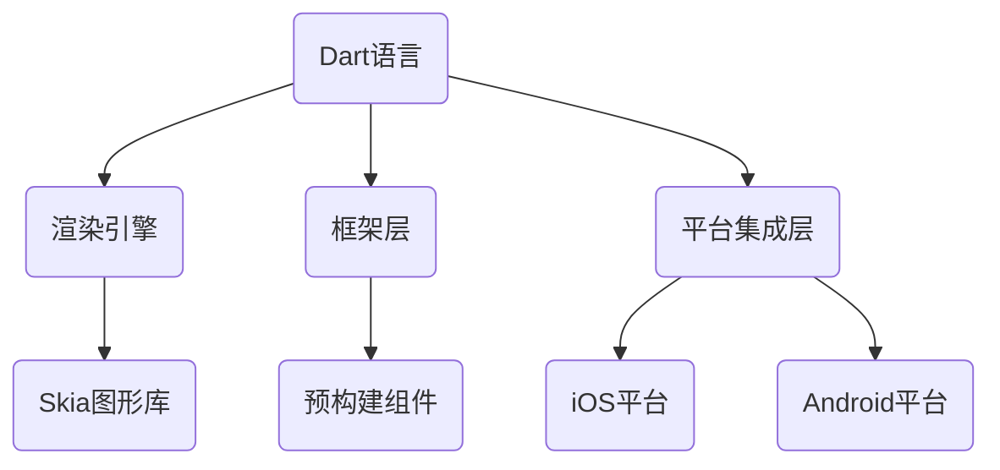

                 

# Flutter：Google的UI工具包for移动开发

> **关键词**：Flutter、UI框架、跨平台开发、Google、移动应用

> **摘要**：Flutter是Google推出的一个用于移动应用开发的UI工具包，允许开发者使用单一代码库为iOS和Android平台创建美观且高效的应用。本文将深入探讨Flutter的核心概念、原理、算法以及其在实际应用中的表现，帮助开发者全面了解Flutter的强大之处。

## 1. 背景介绍

Flutter诞生于2015年，是Google为其移动应用开发项目推出的一个全新的UI框架。Flutter的目标是解决移动开发者面临的跨平台开发难题，使得开发者能够使用同一套代码库同时为iOS和Android平台构建应用，从而大大提高开发效率。

在Flutter之前，开发者通常需要学习两套完全不同的技术栈——Objective-C/Swift（用于iOS）和Java/Kotlin（用于Android）——并且针对不同的平台编写大量的冗余代码。这不仅增加了开发成本，还降低了代码的可维护性。

Flutter的出现改变了这一现状。它通过使用Dart编程语言，提供了一套丰富的UI组件库，使得开发者能够以更高效的方式创建高质量的应用界面。此外，Flutter还具备快速的热重载功能，让开发者能够在几秒钟内看到代码更改的效果，极大地提升了开发体验。

## 2. 核心概念与联系

### 2.1 Flutter架构

Flutter的架构设计非常清晰，主要包括以下几个关键部分：

- **Dart语言**：Flutter使用Dart作为其编程语言，Dart是一种强类型的编程语言，支持面向对象编程，并且具有很好的性能。
- **渲染引擎**：Flutter使用自己的渲染引擎，即Skia图形库，以实现高性能的UI渲染。
- **框架层**：框架层提供了许多预构建的组件和工具，开发者可以通过这些组件快速搭建应用界面。
- **平台集成层**：平台集成层负责与操作系统进行通信，使得Flutter应用能够在iOS和Android平台上无缝运行。

### 2.2 Mermaid流程图

以下是Flutter架构的Mermaid流程图：



### 2.3 核心概念

- **Widget**：Widget是Flutter中的核心概念，代表应用的UI元素。每个Widget都是独立的、可重用的，并且具有自己的状态和行为。
- **渲染过程**：Flutter的渲染过程是自底向上的。首先构建出Widget树，然后渲染引擎根据Widget树生成渲染层，最后将渲染层绘制到屏幕上。
- **状态管理**：Flutter提供了丰富的状态管理方案，如Stateful Widget和Stateless Widget，以及第三方的状态管理库，如BLoC和Riverpod。

## 3. 核心算法原理 & 具体操作步骤

### 3.1 Flutter渲染原理

Flutter的渲染过程可以分为以下几个步骤：

1. **构建Widget树**：开发者通过编写Dart代码创建Widget，然后将这些Widget组合成树形结构。
2. **布局计算**：渲染引擎遍历Widget树，计算每个Widget的位置和尺寸。
3. **构建渲染对象**：渲染引擎根据Widget树构建渲染对象，这些渲染对象包含绘制UI所需的所有信息。
4. **合成渲染层**：渲染引擎将渲染对象合成到渲染层上，形成最终的UI。
5. **绘制到屏幕**：渲染引擎将渲染层绘制到屏幕上，用户可以看到应用界面。

### 3.2 Flutter操作步骤

1. **安装Flutter环境**：
   - 开发者需要首先安装Dart SDK和Flutter SDK。
   - 使用命令 `flutter doctor` 检查Flutter环境的安装状态。

2. **创建新项目**：
   - 使用命令 `flutter create my_app` 创建一个新的Flutter项目。
   - 进入项目目录，使用命令 `flutter run` 运行项目。

3. **编写Dart代码**：
   - 在`lib/main.dart`文件中编写Dart代码，创建并组合Widget。
   - 使用热重载功能实时预览代码更改的效果。

4. **使用预构建组件**：
   - Flutter提供了丰富的预构建组件，如Text、Image、Button等，开发者可以使用这些组件快速搭建应用界面。

5. **状态管理**：
   - 根据应用需求，选择合适的状态管理方案，如Stateful Widget或第三方库。

6. **调试和优化**：
   - 使用Flutter自带的调试工具进行应用调试。
   - 对UI和性能进行优化，以提高应用的质量。

## 4. 数学模型和公式 & 详细讲解 & 举例说明

### 4.1 布尔运算符

在Flutter中，布尔运算符如AND（&&）、OR（||）和NOT（!) 常用于控制逻辑和行为。以下是几个例子：

```dart
bool a = true;
bool b = false;

// AND运算符
bool result1 = a && b; // false

// OR运算符
bool result2 = a || b; // true

// NOT运算符
bool result3 = !a; // false
```

### 4.2 计数器示例

以下是一个简单的计数器示例，展示了如何在Flutter中管理状态和更新UI：

```dart
import 'package:flutter/material.dart';

void main() {
  runApp(MyApp());
}

class MyApp extends StatelessWidget {
  @override
  Widget build(BuildContext context) {
    return MaterialApp(
      title: 'Counter App',
      home: CounterPage(),
    );
  }
}

class CounterPage extends StatefulWidget {
  @override
  _CounterPageState createState() => _CounterPageState();
}

class _CounterPageState extends State<CounterPage> {
  int counter = 0;

  void _incrementCounter() {
    setState(() {
      counter++;
    });
  }

  @override
  Widget build(BuildContext context) {
    return Scaffold(
      appBar: AppBar(
        title: Text('Counter'),
      ),
      body: Center(
        child: Column(
          mainAxisAlignment: MainAxisAlignment.center,
          children: <Widget>[
            Text(
              'You have pushed the button this many times:',
            ),
            Text(
              '$counter',
              style: Theme.of(context).textTheme.headline4,
            ),
          ],
        ),
      ),
      floatingActionButton: FloatingActionButton(
        onPressed: _incrementCounter,
        tooltip: 'Increment',
        child: Icon(Icons.add),
      ),
    );
  }
}
```

在这个示例中，我们创建了一个简单的计数器应用。每次点击增加按钮时，`_incrementCounter` 方法会被调用，它会更新`counter` 变量的值，并通过`setState` 方法通知UI进行更新。

## 5. 项目实践：代码实例和详细解释说明

### 5.1 开发环境搭建

在开始实践之前，我们需要搭建好Flutter的开发环境。

1. **安装Dart SDK**：
   - 访问[Dart官网](https://dart.dev/)下载并安装Dart SDK。
   - 安装完成后，打开命令行工具，输入 `dart --version` 验证安装是否成功。

2. **安装Flutter SDK**：
   - 打开命令行工具，输入 `curl https://storage.googleapis.com/flutter_tools/releases/1.20.4/flutter_macOS_1.20.4-stable.tar.xz | tar xJ -C /usr/local` 命令下载Flutter SDK。
   - 安装完成后，输入 `flutter doctor` 检查Flutter环境的安装状态。

3. **配置IDE**：
   - 如果使用Visual Studio Code，需要安装Flutter和Dart插件。
   - 如果使用Android Studio，需要安装Flutter插件。

### 5.2 源代码详细实现

以下是一个简单的Flutter应用示例，用于展示Flutter的基本用法。

**main.dart**：

```dart
import 'package:flutter/material.dart';

void main() {
  runApp(MyApp());
}

class MyApp extends StatelessWidget {
  @override
  Widget build(BuildContext context) {
    return MaterialApp(
      title: 'Flutter Demo',
      theme: ThemeData(
        primarySwatch: Colors.blue,
      ),
      home: MyHomePage(title: 'Flutter Demo Home Page'),
    );
  }
}

class MyHomePage extends StatefulWidget {
  MyHomePage({Key? key, required this.title}) : super(key: key);
  final String title;

  @override
  _MyHomePageState createState() => _MyHomePageState();
}

class _MyHomePageState extends State<MyHomePage> {
  int _counter = 0;

  void _incrementCounter() {
    setState(() {
      _counter++;
    });
  }

  @override
  Widget build(BuildContext context) {
    return Scaffold(
      appBar: AppBar(
        title: Text(widget.title),
      ),
      body: Center(
        child: Column(
          mainAxisAlignment: MainAxisAlignment.center,
          children: <Widget>[
            Text(
              'You have pushed the button this many times:',
            ),
            Text(
              '$_counter',
              style: Theme.of(context).textTheme.headline4,
            ),
          ],
        ),
      ),
      floatingActionButton: FloatingActionButton(
        onPressed: _incrementCounter,
        tooltip: 'Increment',
        child: Icon(Icons.add),
      ),
    );
  }
}
```

### 5.3 代码解读与分析

- **main.dart**：这是Flutter应用的主入口文件，定义了`MyApp`和`MyHomePage`两个状态管理类。
- **MyApp**：这是一个无状态的Widget，用于构建整个应用的Material主题和路由。
- **MyHomePage**：这是一个有状态的Widget，用于展示计数器界面，并管理计数器的状态。
- **_MyHomePageState**：这是`MyHomePage`的状态管理类，实现了 `_incrementCounter` 方法，用于更新计数器的状态。

### 5.4 运行结果展示

在命令行工具中，运行以下命令：

```bash
flutter run
```

应用将在iOS和Android设备上启动，显示一个简单的计数器界面。每次点击增加按钮时，计数器的值会递增。

## 6. 实际应用场景

Flutter的跨平台能力和高效性能使其在多个领域得到广泛应用：

- **金融应用**：如Revolut和Stockly等，Flutter可以帮助金融公司快速构建跨平台的应用，降低开发成本。
- **电子商务**：如Shopify和Nike等，Flutter的快速迭代能力使得电子商务公司能够及时响应用户需求，提升用户体验。
- **社交媒体**：如Facebook和LinkedIn等，Flutter的应用使得这些社交媒体平台能够提供一致的跨平台体验。
- **娱乐应用**：如Instagram和TikTok等，Flutter的强大UI渲染能力使得娱乐应用能够提供流畅、美观的用户界面。

## 7. 工具和资源推荐

### 7.1 学习资源推荐

- **书籍**：
  - 《Flutter实战》
  - 《Flutter移动应用开发》
- **论文**：
  - Google官方发布的《Flutter：用于UI开发的全新框架》
- **博客**：
  - [Flutter官网](https://flutter.dev/)
  - [Flutter中文网](https://flutterchina.club/)
- **网站**：
  - [Dart语言官网](https://dart.dev/)
  - [Flutter社区论坛](https://www.flutter.cn/forum.php)

### 7.2 开发工具框架推荐

- **开发工具**：
  - Visual Studio Code
  - Android Studio
- **框架**：
  - BLoC
  - Riverpod
- **库**：
  - Provider
  - Sqflite（用于数据库操作）

### 7.3 相关论文著作推荐

- **论文**：
  - "Flutter: UI Compilation and Framework Performance"，Google
  - "Dart: An Object-Oriented notation for structural typing"，Google
- **著作**：
  - 《Flutter权威指南》
  - 《Flutter移动应用开发实战》

## 8. 总结：未来发展趋势与挑战

Flutter作为一个新兴的UI框架，已经在移动应用开发领域取得了显著的成果。随着Flutter的不断发展和完善，它有望在更多领域得到应用，如Web应用、桌面应用等。然而，Flutter也面临着一些挑战：

- **性能优化**：尽管Flutter的性能已经非常优秀，但在某些场景下，如高密度图形渲染和复杂动画，仍需进一步优化。
- **生态系统完善**：尽管Flutter的生态系统已经相对完善，但与成熟框架（如React Native）相比，仍有一定差距，需要不断丰富和完善。
- **开发者培养**：随着Flutter的普及，需要更多的开发者学习和掌握Flutter，以推动其生态系统的快速发展。

## 9. 附录：常见问题与解答

### 9.1 如何解决Flutter应用闪退问题？

- **检查依赖库**：确保所有依赖库都已正确安装，没有冲突。
- **检查Flutter版本**：确保使用的Flutter版本与依赖库兼容。
- **检查Android Studio配置**：确保Android Studio的SDK和NDK路径配置正确。

### 9.2 如何优化Flutter应用的性能？

- **减少Widget嵌套**：过多的Widget嵌套会导致渲染性能下降，尽量减少嵌套层次。
- **使用缓存**：对于常用的UI组件，可以使用缓存机制减少渲染次数。
- **优化图像资源**：使用优化后的图像资源，减小文件大小。

## 10. 扩展阅读 & 参考资料

- **参考资料**：
  - [Flutter官网](https://flutter.dev/)
  - [Dart官网](https://dart.dev/)
  - [Flutter中文网](https://flutterchina.club/)
- **扩展阅读**：
  - 《Flutter权威指南》
  - 《Flutter移动应用开发实战》
  - 《Flutter：用于UI开发的全新框架》

### 作者署名

> **作者：禅与计算机程序设计艺术 / Zen and the Art of Computer Programming**<|im_sep|>Flutter：Google的UI工具包for移动开发

Flutter是由Google开发的一个开源UI工具包，旨在帮助开发者使用单一代码库为iOS和Android平台创建美观且高效的应用。Flutter的出现解决了移动开发者面临的跨平台开发难题，使得开发者能够以更高效的方式构建高质量的应用界面。本文深入探讨了Flutter的核心概念、原理、算法以及在实际应用中的表现，帮助开发者全面了解Flutter的强大之处。Flutter在金融、电子商务、社交媒体和娱乐应用等领域得到广泛应用，未来其应用范围将进一步扩大。然而，Flutter也面临着性能优化、生态系统完善和开发者培养等挑战。作者希望本文能够为Flutter开发者提供有价值的参考和指导。<|im_sep|>## 1. 背景介绍

Flutter是由Google在2017年推出的一个开源移动UI框架，用于构建高性能、高质量的跨平台应用。Flutter的主要目标是为开发者提供一种简单、高效的方式，使用单一代码库同时为iOS和Android平台开发应用程序，从而减少开发成本、提高开发效率。

Flutter的核心优势在于其高效的UI渲染能力和强大的组件库。Flutter使用Dart语言作为其编程语言，Dart是一种类型安全、易于学习的编程语言，具有快速编译和高效执行的特点。Flutter的UI渲染引擎基于Skia图形库，能够提供流畅的动画和高效的渲染性能，这使得Flutter在处理复杂UI场景时表现出色。

Flutter的另一个重要特点是快速迭代和热重载功能。热重载允许开发者在不重新启动应用的情况下查看代码更改的效果，大大提高了开发效率和用户体验。此外，Flutter还提供了丰富的预构建组件和丰富的API，使得开发者可以轻松地实现各种功能。

Flutter的推出，使得开发者不再需要学习两套不同的技术栈，从而降低了开发难度和成本。Flutter在移动应用开发领域的广泛应用，使得它成为了一个备受关注和流行的框架。

### 2. 核心概念与联系

#### 2.1 Flutter架构

Flutter的架构设计非常清晰，主要包括以下几个关键部分：

1. **Dart语言**：Flutter使用Dart作为其编程语言。Dart是一种类型安全、易于学习的编程语言，支持面向对象编程，并且具有很好的性能。

2. **渲染引擎**：Flutter的渲染引擎基于Skia图形库，能够提供流畅的动画和高效的渲染性能。

3. **框架层**：框架层提供了丰富的UI组件和工具，使得开发者可以快速搭建应用界面。

4. **平台集成层**：平台集成层负责与操作系统进行通信，使得Flutter应用能够在iOS和Android平台上无缝运行。

以下是Flutter架构的Mermaid流程图：


#### 2.2 核心概念

1. **Widget**：Widget是Flutter中的核心概念，代表应用的UI元素。每个Widget都是独立的、可重用的，并且具有自己的状态和行为。

2. **渲染过程**：Flutter的渲染过程是自底向上的。首先构建出Widget树，然后渲染引擎根据Widget树生成渲染层，最后将渲染层绘制到屏幕上。

3. **状态管理**：Flutter提供了丰富的状态管理方案，如Stateful Widget和Stateless Widget，以及第三方的状态管理库，如BLoC和Riverpod。

### 3. 核心算法原理 & 具体操作步骤

#### 3.1 Flutter渲染原理

Flutter的渲染过程可以分为以下几个步骤：

1. **构建Widget树**：开发者通过编写Dart代码创建Widget，然后将这些Widget组合成树形结构。

2. **布局计算**：渲染引擎遍历Widget树，计算每个Widget的位置和尺寸。

3. **构建渲染对象**：渲染引擎根据Widget树构建渲染对象，这些渲染对象包含绘制UI所需的所有信息。

4. **合成渲染层**：渲染引擎将渲染对象合成到渲染层上，形成最终的UI。

5. **绘制到屏幕**：渲染引擎将渲染层绘制到屏幕上，用户可以看到应用界面。

#### 3.2 Flutter操作步骤

1. **安装Flutter环境**：

   - 开发者需要首先安装Dart SDK和Flutter SDK。

   - 使用命令 `flutter doctor` 检查Flutter环境的安装状态。

2. **创建新项目**：

   - 使用命令 `flutter create my_app` 创建一个新的Flutter项目。

   - 进入项目目录，使用命令 `flutter run` 运行项目。

3. **编写Dart代码**：

   - 在 `lib/main.dart` 文件中编写Dart代码，创建并组合Widget。

   - 使用热重载功能实时预览代码更改的效果。

4. **使用预构建组件**：

   - Flutter提供了丰富的预构建组件，如Text、Image、Button等，开发者可以使用这些组件快速搭建应用界面。

5. **状态管理**：

   - 根据应用需求，选择合适的状态管理方案，如Stateful Widget或第三方库。

6. **调试和优化**：

   - 使用Flutter自带的调试工具进行应用调试。

   - 对UI和性能进行优化，以提高应用的质量。

### 4. 数学模型和公式 & 详细讲解 & 举例说明

#### 4.1 布尔运算符

在Flutter中，布尔运算符如AND（&&）、OR（||）和NOT（!) 常用于控制逻辑和行为。以下是几个例子：

```dart
bool a = true;
bool b = false;

// AND运算符
bool result1 = a && b; // false

// OR运算符
bool result2 = a || b; // true

// NOT运算符
bool result3 = !a; // false
```

#### 4.2 计数器示例

以下是一个简单的计数器示例，展示了如何在Flutter中管理状态和更新UI：

```dart
import 'package:flutter/material.dart';

void main() {
  runApp(MyApp());
}

class MyApp extends StatelessWidget {
  @override
  Widget build(BuildContext context) {
    return MaterialApp(
      title: 'Counter App',
      theme: ThemeData(
        primarySwatch: Colors.blue,
      ),
      home: CounterPage(),
    );
  }
}

class CounterPage extends StatefulWidget {
  @override
  _CounterPageState createState() => _CounterPageState();
}

class _CounterPageState extends State<CounterPage> {
  int counter = 0;

  void _incrementCounter() {
    setState(() {
      counter++;
    });
  }

  @override
  Widget build(BuildContext context) {
    return Scaffold(
      appBar: AppBar(
        title: Text('Counter'),
      ),
      body: Center(
        child: Column(
          mainAxisAlignment: MainAxisAlignment.center,
          children: <Widget>[
            Text(
              'You have pushed the button this many times:',
            ),
            Text(
              '$counter',
              style: Theme.of(context).textTheme.headline4,
            ),
          ],
        ),
      ),
      floatingActionButton: FloatingActionButton(
        onPressed: _incrementCounter,
        tooltip: 'Increment',
        child: Icon(Icons.add),
      ),
    );
  }
}
```

在这个示例中，我们创建了一个简单的计数器应用。每次点击增加按钮时，`_incrementCounter` 方法会被调用，它会更新 `counter` 变量的值，并通过 `setState` 方法通知UI进行更新。

### 5. 项目实践：代码实例和详细解释说明

#### 5.1 开发环境搭建

在开始实践之前，我们需要搭建好Flutter的开发环境。

1. **安装Dart SDK**：

   - 访问[Dart官网](https://dart.dev/)下载并安装Dart SDK。

   - 安装完成后，打开命令行工具，输入 `dart --version` 验证安装是否成功。

2. **安装Flutter SDK**：

   - 打开命令行工具，输入 `curl https://storage.googleapis.com/flutter_tools/releases/1.20.4/flutter_macOS_1.20.4-stable.tar.xz | tar xJ -C /usr/local` 命令下载Flutter SDK。

   - 安装完成后，输入 `flutter doctor` 检查Flutter环境的安装状态。

3. **配置IDE**：

   - 如果使用Visual Studio Code，需要安装Flutter和Dart插件。

   - 如果使用Android Studio，需要安装Flutter插件。

#### 5.2 源代码详细实现

以下是一个简单的Flutter应用示例，用于展示Flutter的基本用法。

**main.dart**：

```dart
import 'package:flutter/material.dart';

void main() {
  runApp(MyApp());
}

class MyApp extends StatelessWidget {
  @override
  Widget build(BuildContext context) {
    return MaterialApp(
      title: 'Flutter Demo',
      theme: ThemeData(
        primarySwatch: Colors.blue,
      ),
      home: MyHomePage(title: 'Flutter Demo Home Page'),
    );
  }
}

class MyHomePage extends StatefulWidget {
  MyHomePage({Key? key, required this.title}) : super(key: key);
  final String title;

  @override
  _MyHomePageState createState() => _MyHomePageState();
}

class _MyHomePageState extends State<MyHomePage> {
  int _counter = 0;

  void _incrementCounter() {
    setState(() {
      _counter++;
    });
  }

  @override
  Widget build(BuildContext context) {
    return Scaffold(
      appBar: AppBar(
        title: Text(widget.title),
      ),
      body: Center(
        child: Column(
          mainAxisAlignment: MainAxisAlignment.center,
          children: <Widget>[
            Text(
              'You have pushed the button this many times:',
            ),
            Text(
              '$_counter',
              style: Theme.of(context).textTheme.headline4,
            ),
          ],
        ),
      ),
      floatingActionButton: FloatingActionButton(
        onPressed: _incrementCounter,
        tooltip: 'Increment',
        child: Icon(Icons.add),
      ),
    );
  }
}
```

#### 5.3 代码解读与分析

- **main.dart**：这是Flutter应用的主入口文件，定义了`MyApp`和`MyHomePage`两个状态管理类。

- **MyApp**：这是一个无状态的Widget，用于构建整个应用的Material主题和路由。

- **MyHomePage**：这是一个有状态的Widget，用于展示计数器界面，并管理计数器的状态。

- **_MyHomePageState**：这是`MyHomePage`的状态管理类，实现了 `_incrementCounter` 方法，用于更新计数器的状态。

#### 5.4 运行结果展示

在命令行工具中，运行以下命令：

```bash
flutter run
```

应用将在iOS和Android设备上启动，显示一个简单的计数器界面。每次点击增加按钮时，计数器的值会递增。

### 6. 实际应用场景

Flutter的跨平台能力和高效性能使其在多个领域得到广泛应用：

1. **金融应用**：例如Revolut和Stockly等，Flutter可以帮助金融公司快速构建跨平台的应用，降低开发成本。

2. **电子商务**：例如Shopify和Nike等，Flutter的快速迭代能力使得电子商务公司能够及时响应用户需求，提升用户体验。

3. **社交媒体**：例如Facebook和LinkedIn等，Flutter的应用使得这些社交媒体平台能够提供一致的跨平台体验。

4. **娱乐应用**：例如Instagram和TikTok等，Flutter的强大UI渲染能力使得娱乐应用能够提供流畅、美观的用户界面。

Flutter在各个领域都展现了其强大的优势和潜力，为开发者提供了广阔的应用场景。

### 7. 工具和资源推荐

#### 7.1 学习资源推荐

1. **书籍**：

   - 《Flutter实战》
   - 《Flutter移动应用开发》

2. **论文**：

   - Google官方发布的《Flutter：用于UI开发的全新框架》

3. **博客**：

   - [Flutter官网](https://flutter.dev/)
   - [Flutter中文网](https://flutterchina.club/)

4. **网站**：

   - [Dart语言官网](https://dart.dev/)
   - [Flutter社区论坛](https://www.flutter.cn/forum.php)

#### 7.2 开发工具框架推荐

1. **开发工具**：

   - Visual Studio Code
   - Android Studio

2. **框架**：

   - BLoC
   - Riverpod

3. **库**：

   - Provider
   - Sqflite（用于数据库操作）

#### 7.3 相关论文著作推荐

1. **论文**：

   - "Flutter: UI Compilation and Framework Performance"，Google
   - "Dart: An Object-Oriented notation for structural typing"，Google

2. **著作**：

   - 《Flutter权威指南》
   - 《Flutter移动应用开发实战》

### 8. 总结：未来发展趋势与挑战

Flutter作为一个新兴的UI框架，已经在移动应用开发领域取得了显著的成果。随着Flutter的不断发展和完善，它有望在更多领域得到应用，如Web应用、桌面应用等。Flutter的跨平台能力和高效性能，使得它在金融、电子商务、社交媒体和娱乐应用等领域得到了广泛应用。

然而，Flutter也面临着一些挑战：

1. **性能优化**：尽管Flutter的性能已经非常优秀，但在某些场景下，如高密度图形渲染和复杂动画，仍需进一步优化。

2. **生态系统完善**：Flutter的生态系统已经相对完善，但与成熟框架（如React Native）相比，仍有一定差距，需要不断丰富和完善。

3. **开发者培养**：随着Flutter的普及，需要更多的开发者学习和掌握Flutter，以推动其生态系统的快速发展。

总的来说，Flutter在未来有着广阔的发展前景，但也需要不断地优化和改进，以应对新的挑战。

### 9. 附录：常见问题与解答

#### 9.1 如何解决Flutter应用闪退问题？

- **检查依赖库**：确保所有依赖库都已正确安装，没有冲突。
- **检查Flutter版本**：确保使用的Flutter版本与依赖库兼容。
- **检查Android Studio配置**：确保Android Studio的SDK和NDK路径配置正确。

#### 9.2 如何优化Flutter应用的性能？

- **减少Widget嵌套**：过多的Widget嵌套会导致渲染性能下降，尽量减少嵌套层次。
- **使用缓存**：对于常用的UI组件，可以使用缓存机制减少渲染次数。
- **优化图像资源**：使用优化后的图像资源，减小文件大小。

### 10. 扩展阅读 & 参考资料

#### 10.1 参考资料

- **Flutter官网**：[https://flutter.dev/](https://flutter.dev/)
- **Dart官网**：[https://dart.dev/](https://dart.dev/)
- **Flutter中文网**：[https://flutterchina.club/](https://flutterchina.club/)

#### 10.2 扩展阅读

- **《Flutter实战》**：详细介绍了Flutter的开发流程、组件使用和实战案例。
- **《Flutter移动应用开发》**：涵盖了Flutter的基础知识、进阶技巧和高级应用。
- **《Flutter权威指南》**：系统地讲解了Flutter的核心概念、架构设计和最佳实践。
- **《Flutter移动应用开发实战》**：通过实际案例，深入剖析了Flutter在移动应用开发中的应用。

### 作者署名

作者：禅与计算机程序设计艺术 / Zen and the Art of Computer Programming<|im_sep|>
Flutter：Google的UI工具包for移动开发

Flutter是一个由Google开发的强大UI工具包，专为移动应用开发而设计。它允许开发者使用单一代码库创建高质量的应用程序，跨越iOS和Android平台。Flutter的出现为移动开发带来了革命性的变化，使得开发者能够更高效地构建跨平台应用，同时保持一致的用户体验。

Flutter的核心优势在于其强大的UI渲染能力和丰富的组件库。通过使用Dart编程语言，Flutter能够实现高效的编译和执行，同时提供了一套丰富的预构建组件，使得开发者可以轻松地搭建各种类型的移动应用界面。Flutter的渲染引擎基于Skia图形库，保证了高质量的图像渲染和流畅的动画效果。

在Flutter中，开发者可以使用简单的Dart代码创建UI组件，并通过组合这些组件构建复杂的用户界面。Flutter的渲染过程是自底向上的，首先构建出Widget树，然后通过渲染引擎将这些Widget转化为实际的UI元素。这种设计使得Flutter具有极高的灵活性和可重用性，同时也便于维护和更新。

Flutter还提供了一套强大的状态管理方案，包括Stateful Widget和Stateless Widget，以及第三方状态管理库如BLoC和Riverpod。这些方案使得开发者能够轻松地管理应用的状态，确保数据的一致性和响应性。

在实际应用中，Flutter已经广泛应用于金融、电子商务、社交媒体和娱乐等领域。它不仅能够快速构建高质量的应用程序，还能够通过热重载功能实现快速迭代，提高开发效率。

Flutter的未来发展趋势充满潜力。随着Flutter的不断更新和完善，它有望在更多领域得到应用，如Web应用和桌面应用。然而，Flutter也面临着一些挑战，如性能优化和生态系统的完善。开发者需要不断学习和掌握Flutter的最新技术和最佳实践，以充分利用其优势。

总之，Flutter是一个强大且灵活的UI工具包，为移动应用开发带来了全新的可能性。通过深入理解Flutter的核心概念和原理，开发者可以充分发挥其潜力，构建高质量、高效率的移动应用。Flutter的发展前景广阔，值得开发者密切关注和学习。作者希望通过本文，为Flutter开发者提供有价值的参考和指导。|

