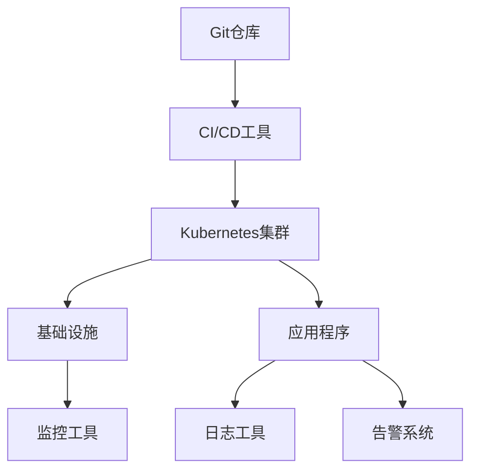

                 

### 文章标题

**GitOps工作流：持续部署的最佳实践**

> **关键词：**GitOps、持续部署、DevOps、自动化、容器化、Kubernetes

**摘要：**本文将深入探讨GitOps工作流的核心概念、实现原理和最佳实践。通过剖析GitOps在容器化环境下的应用，结合实际项目经验，揭示其在持续交付和自动化部署中的优势，为读者提供一套可行的GitOps实践指南。

### 1. 背景介绍

随着云计算和容器技术的迅猛发展，传统的软件开发和运维模式已难以满足现代应用的需求。DevOps文化的兴起，推动了持续集成（CI）和持续部署（CD）的普及，然而，在实际操作中，许多团队仍面临着部署过程复杂、环境不一致、版本控制混乱等问题。

GitOps作为一种新兴的工作流模式，旨在通过Git作为单一来源的版本控制，实现应用的自动化部署、回滚和监控。其核心理念是利用基础设施即代码（IaC）和声明式配置，将基础设施、应用程序和配置变化以代码的形式进行管理和跟踪。这种模式不仅提高了部署的透明度和可追溯性，还极大地简化了运维流程，提升了团队的协作效率。

本文将详细探讨GitOps工作流的原理、实现步骤和最佳实践，帮助读者理解和掌握这一先进的持续部署模式。

### 2. 核心概念与联系

#### 2.1 GitOps的定义

GitOps是一种基于Git的工作流模式，将应用程序的配置、部署和监控活动与版本控制系统（通常是Git）集成在一起。通过GitOps，所有基础设施、应用程序配置和应用部署的变更都以Git提交的形式进行管理。

#### 2.2 GitOps与DevOps的关系

GitOps是DevOps的一种扩展，它通过将Git作为中央神经系统，实现了DevOps中的持续集成、持续交付和自动化运维。GitOps强调使用Git来管理整个应用生命周期，从开发、测试到部署和监控，从而实现零配置错误、自动化的故障恢复和统一的管理视角。

#### 2.3 GitOps的关键组成部分

- **基础设施即代码（IaC）：**使用代码来管理基础设施，确保环境的一致性和可复现性。
- **容器化和Kubernetes：**容器化确保应用程序的轻量和可移植性，Kubernetes作为容器编排平台，提供自动化的部署、扩展和管理。
- **声明式配置：**通过YAML文件等声明式配置，定义应用的预期状态，与实际状态进行对比，实现自动化部署和回滚。
- **监控和日志：**使用Prometheus、ELK Stack等工具，实现对应用和基础设施的全面监控和日志收集，确保系统的健康和稳定性。

#### 2.4 GitOps的架构图



在上面的架构图中，Git仓库作为GitOps的核心，通过CI/CD工具与Kubernetes集群进行交互，确保应用程序的持续集成和交付。基础设施以IaC的形式进行管理，监控和日志工具用于收集和展示系统的运行状态，告警系统则在发生异常时及时通知相关人员。

### 3. 核心算法原理 & 具体操作步骤

#### 3.1 GitOps的核心算法原理

GitOps的核心在于将应用程序的配置和状态以代码的形式进行管理。具体来说，主要包括以下步骤：

1. **配置管理：**将应用程序和基础设施的配置以YAML文件的形式存储在Git仓库中。
2. **自动化部署：**通过CI/CD工具，将配置文件推送到Kubernetes集群，实现自动化部署。
3. **状态跟踪：**使用Kubernetes的声明式配置，通过对比实际状态和预期状态，确保应用程序的正确运行。
4. **监控和告警：**通过监控工具和日志系统，实时跟踪系统的运行状态，并在发生异常时触发告警。

#### 3.2 具体操作步骤

1. **初始化GitOps环境：**
   - 创建一个Git仓库，用于存储应用程序和基础设施的配置文件。
   - 安装CI/CD工具，如Jenkins、GitLab CI/CD等。
   - 配置Kubernetes集群，确保其能够与Git仓库和CI/CD工具进行交互。

2. **编写配置文件：**
   - 编写Kubernetes的YAML配置文件，定义应用程序和基础设施的预期状态。
   - 将配置文件推送到Git仓库，进行版本控制。

3. **自动化部署流程：**
   - 配置CI/CD工具，使其在Git仓库中的配置文件发生变化时，自动触发部署流程。
   - CI/CD工具将新的配置文件推送到Kubernetes集群，实现自动化部署。

4. **状态跟踪与监控：**
   - 使用Kubernetes的声明式配置，通过kubectl命令行工具，实时跟踪应用程序的状态。
   - 配置监控工具，如Prometheus、Grafana等，收集和展示系统的运行状态。
   - 配置日志收集和存储工具，如ELK Stack、Fluentd等，确保日志的完整性和可追溯性。

5. **告警和故障恢复：**
   - 配置告警系统，如PagerDuty、OpsGenie等，在系统发生异常时及时通知相关人员。
   - 制定故障恢复策略，通过Kubernetes的滚动更新、回滚等操作，快速恢复系统的正常运行。

### 4. 数学模型和公式 & 详细讲解 & 举例说明

在GitOps中，数学模型和公式主要用于描述应用程序和基础设施的状态变化，以及监控数据的处理。以下是一些关键的数学模型和公式：

#### 4.1 应用程序状态模型

$$
\text{状态} = f(\text{配置}, \text{环境变量}, \text{依赖})
$$

其中，状态是应用程序在某一时刻的运行状态，由配置、环境变量和依赖关系共同决定。

**例子：**假设一个Web应用程序的配置文件定义了数据库的URL，环境变量设置了数据库的用户名和密码，依赖关系包括Web服务器和数据库。如果配置文件和环境变量发生变化，应用程序的状态也会相应更新。

#### 4.2 监控数据模型

$$
\text{监控数据} = \{ \text{指标}, \text{时间戳}, \text{阈值} \}
$$

其中，监控数据是一个包含指标、时间戳和阈值的字典。指标描述了系统的某一特性，如响应时间、CPU使用率等；时间戳记录了指标观测的时间；阈值用于设定异常告警的界限。

**例子：**一个监控系统的响应时间指标为100ms，时间戳为2023-04-01 10:00:00，阈值设置为500ms。如果某时刻系统的响应时间超过500ms，监控工具会触发告警。

#### 4.3 故障恢复模型

$$
\text{恢复策略} = f(\text{故障类型}, \text{历史数据}, \text{配置})
$$

其中，恢复策略是根据故障类型、历史数据和当前配置决定的。故障类型包括服务宕机、数据库连接失败等；历史数据用于分析故障的根源；配置用于决定恢复操作的具体步骤。

**例子：**如果一个Web服务器的数据库连接失败，系统会根据历史数据和配置文件，决定是进行数据库重启、Web服务器重启，还是回滚到之前的稳定版本。

### 5. 项目实践：代码实例和详细解释说明

#### 5.1 开发环境搭建

为了演示GitOps工作流，我们需要搭建一个基本的开发环境。以下是所需的步骤：

1. **安装Git：**在本地计算机上安装Git客户端，以便进行版本控制。
2. **创建Git仓库：**创建一个名为`gitops-example`的Git仓库，用于存储应用程序和基础设施的配置文件。
3. **安装Kubernetes集群：**在本地或云环境中安装Kubernetes集群，用于部署和运行应用程序。
4. **安装CI/CD工具：**选择一个CI/CD工具，如Jenkins，并按照其文档进行安装和配置。

#### 5.2 源代码详细实现

在本节中，我们将实现一个简单的Web应用程序，并将其部署到Kubernetes集群。以下是具体的实现步骤：

1. **创建Dockerfile：**编写一个Dockerfile，用于构建应用程序的容器镜像。

```Dockerfile
FROM node:14-alpine
WORKDIR /app
COPY package.json ./
RUN npm install
COPY . .
EXPOSE 8080
CMD ["npm", "start"]
```

2. **编写Kubernetes配置文件：**创建一个名为`deployment.yaml`的Kubernetes配置文件，用于部署应用程序。

```yaml
apiVersion: apps/v1
kind: Deployment
metadata:
  name: web-app
spec:
  replicas: 3
  selector:
    matchLabels:
      app: web-app
  template:
    metadata:
      labels:
        app: web-app
    spec:
      containers:
      - name: web-app
        image: web-app:latest
        ports:
        - containerPort: 8080
```

3. **初始化GitOps环境：**在本地计算机上安装Kubernetes命令行工具（kubectl），并将其配置为连接到Kubernetes集群。确保Git仓库与Kubernetes集群之间的网络连接正常。

4. **推送配置文件到Git仓库：**将`Dockerfile`和`deployment.yaml`文件推送到Git仓库，进行版本控制。

5. **配置CI/CD工具：**在CI/CD工具中配置一个Pipeline，使其在Git仓库中的配置文件发生变化时，自动触发构建和部署流程。

#### 5.3 代码解读与分析

在本节中，我们将对源代码进行解读和分析，解释其实现原理和功能。

1. **Dockerfile解析：**
   - `FROM node:14-alpine`：指定基于Node.js 14版本的Alpine Linux镜像。
   - `WORKDIR /app`：设置工作目录为`/app`。
   - `COPY package.json ./`：将`package.json`文件复制到工作目录。
   - `RUN npm install`：执行npm安装命令，安装项目依赖。
   - `COPY . .`：将当前目录下的所有文件复制到容器中。
   - `EXPOSE 8080`：暴露8080端口，用于接收HTTP请求。
   - `CMD ["npm", "start"]`：启动应用程序。

2. **deployment.yaml解析：**
   - `apiVersion: apps/v1`：指定API版本。
   - `kind: Deployment`：定义部署对象。
   - `metadata`：定义部署的元数据，如名称。
   - `spec`：定义部署的规格，如副本数量、选择器等。
   - `template`：定义部署的模板，如容器配置、端口映射等。

#### 5.4 运行结果展示

1. **构建和部署：**在CI/CD工具中触发Pipeline，执行构建和部署流程。构建成功后，应用程序会被部署到Kubernetes集群。
2. **访问应用程序：**使用Kubernetes的Service发现机制，获取应用程序的访问地址。在本例中，可以使用以下命令获取负载均衡器的地址：

```shell
kubectl get svc web-app -o jsonpath='{.spec.clusterIP}'
```

3. **访问测试：**在浏览器中输入负载均衡器的地址，应能成功访问Web应用程序。

### 6. 实际应用场景

#### 6.1 容器化应用程序的自动化部署

GitOps在容器化应用程序的自动化部署中具有显著优势。通过将应用程序的配置和部署过程以代码的形式进行管理，可以实现快速、可靠的部署。以下是一些实际应用场景：

- **持续交付：**通过GitOps，开发人员可以在提交代码后立即触发部署流程，确保新功能快速上线。
- **环境一致性：**使用IaC技术，可以确保开发、测试和生产环境的一致性，减少配置错误。
- **快速回滚：**在发生部署问题或应用程序故障时，GitOps可以快速回滚到之前的稳定版本，减少业务中断时间。

#### 6.2 微服务架构的部署与管理

微服务架构是一种将应用程序拆分为多个独立服务的方法，每个服务都可以独立部署和管理。GitOps适用于微服务架构，可以提供以下优势：

- **服务自治：**每个微服务都可以独立部署和更新，减少了服务之间的依赖性。
- **故障隔离：**在某个微服务发生故障时，其他服务可以继续正常运行，提高了系统的可用性。
- **快速扩展：**通过GitOps，可以轻松实现微服务的水平扩展，以满足不断增长的业务需求。

#### 6.3 DevOps团队的协作与效率提升

GitOps通过将部署过程自动化，减少了人工干预，提高了DevOps团队的协作效率。以下是一些具体的应用场景：

- **简化运维：**自动化部署和监控减少了运维人员的日常工作量，使他们能够专注于更高价值的任务。
- **透明度提升：**通过Git仓库记录所有的部署和变更，提高了团队之间的透明度和信任度。
- **持续反馈：**通过监控和告警系统，团队可以实时了解系统的运行状态，快速响应问题。

### 7. 工具和资源推荐

#### 7.1 学习资源推荐

- **书籍：**
  - "Git Pro"：详细介绍了Git的使用方法和工作原理。
  - "Kubernetes Up & Running"：涵盖了Kubernetes的安装、配置和应用部署。
  - "Container Network Interface (CNI) Handbook"：深入讲解了容器网络的实现和优化。

- **论文：**
  - "A Container Orchestration System with High-Throughput and Low Latency"：介绍了Kubernetes的设计原理和优化策略。
  - "GitOps: A New Approach to Operations"：首次提出了GitOps的概念和实现方法。

- **博客和网站：**
  - Kubernetes官方文档：提供最全面和权威的Kubernetes教程和指南。
  - Docker官方文档：涵盖Docker的基本概念、使用方法和最佳实践。
  - The DevOps Handbook：介绍DevOps文化、实践和工作流。

#### 7.2 开发工具框架推荐

- **CI/CD工具：**
  - Jenkins：功能强大、插件丰富，适合大规模团队的持续集成和持续交付。
  - GitLab CI/CD：集成在GitLab中，支持GitOps模式，方便团队协作。

- **Kubernetes集群管理工具：**
  - Kubeadm：用于快速搭建Kubernetes集群。
  - Kops：用于创建和管理Kubernetes集群。

- **监控和日志工具：**
  - Prometheus：开源的监控解决方案，适用于大规模系统监控。
  - Grafana：用于可视化Prometheus的监控数据。
  - ELK Stack：包括Elasticsearch、Logstash和Kibana，提供完整的日志收集、存储和展示功能。

#### 7.3 相关论文著作推荐

- **"The Design of the UNIX Operating System"**：介绍了Unix操作系统设计原则，对理解系统架构和运维有重要参考价值。
- **"The Art of System Performance Analysis"**：讲解了系统性能分析的方法和技巧，有助于优化系统性能。
- **"The Practice of System and Network Administration"**：提供了实际操作经验和最佳实践，适用于系统管理员和运维人员。

### 8. 总结：未来发展趋势与挑战

GitOps作为一种先进的工作流模式，正在逐渐得到企业和开发团队的认可。然而，在未来的发展中，GitOps仍面临一些挑战：

1. **学习曲线：**GitOps涉及多个领域的技术，包括Git、Kubernetes、CI/CD等，对于初学者来说有一定难度。
2. **工具整合：**随着技术的发展，新的工具和平台不断涌现，如何整合这些工具，实现高效的GitOps工作流，是一个重要课题。
3. **安全性：**GitOps工作流依赖于Git仓库和CI/CD工具，如何确保系统的安全，防止恶意操作和数据泄露，是亟待解决的问题。

未来，GitOps将在以下几个方面继续发展：

1. **自动化程度提高：**通过引入更先进的自动化技术，实现从代码提交到生产环境部署的全自动化。
2. **跨平台支持：**随着容器技术的普及，GitOps将逐步支持更多类型的平台，如Serverless、Function as a Service（FaaS）等。
3. **社区和生态系统：**随着GitOps的普及，将涌现更多的开源工具和框架，形成完善的GitOps生态系统。

### 9. 附录：常见问题与解答

#### 9.1 GitOps与传统DevOps的区别是什么？

GitOps是DevOps的一种扩展，它将Git作为中央神经系统，实现持续集成、持续交付和自动化运维。与传统DevOps相比，GitOps强调使用Git进行版本控制，提高了部署的透明度和可追溯性。

#### 9.2 GitOps需要哪些基础设施和工具？

GitOps需要以下基础设施和工具：
- Git仓库：用于存储应用程序和基础设施的配置文件。
- CI/CD工具：用于自动化部署流程。
- Kubernetes集群：用于部署和运行应用程序。
- 监控和日志工具：用于收集和展示系统的运行状态。

#### 9.3 如何确保GitOps的安全性？

确保GitOps的安全性需要采取以下措施：
- 使用安全的网络连接：确保Git仓库和CI/CD工具之间的连接使用HTTPS等安全协议。
- 限制访问权限：确保只有授权的用户可以访问Git仓库和CI/CD工具。
- 审计和日志记录：记录所有部署和变更操作，以便在发生问题时进行追踪和审计。

### 10. 扩展阅读 & 参考资料

为了进一步了解GitOps和持续部署的最佳实践，以下是扩展阅读和参考资料：

- **书籍：**
  - "GitOps: A New Approach to Operations" by Weaveworks
  - "The DevOps Handbook" by Jez Humble, David Farley
  - "Kubernetes: Up and Running" by Kelsey Hightower, Brendan Burns, and Joe Beda

- **在线课程：**
  - "GitOps Fundamentals" on Pluralsight
  - "Kubernetes Fundamentals" on Coursera
  - "DevOps for Dummies" on Dummies

- **博客和网站：**
  - Weaveworks官方博客：[weaveworks.com/blog/](https://weaveworks.com/blog/)
  - Kubernetes官方博客：[kubernetes.io/blog/](https://kubernetes.io/blog/)
  - DevOps.com：[devops.com/](https://devops.com/)

- **GitHub项目：**
  - GitOps Cookbook：[github.com/weaveworks/flux2](https://github.com/weaveworks/flux2)
  - GitLab CI/CD：[github.com/gitlab/gitlab-ci-yml](https://github.com/gitlab/gitlab-ci-yml)

通过以上资源，您可以深入了解GitOps的原理和实践，提升持续部署和运维能力。希望本文对您有所帮助！作者：禅与计算机程序设计艺术 / Zen and the Art of Computer Programming。

