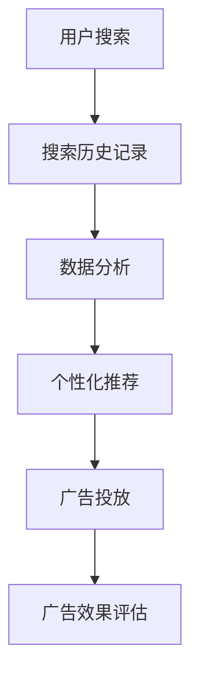

                 

### 文章标题

Google的广告帝国：高效但有争议的商业模式

关键词：Google、广告、商业模式、搜索引擎、个性化推荐、数据分析、用户隐私、技术垄断

摘要：
本文深入探讨了Google如何通过其广告帝国构建了一种高效但备受争议的商业模式。文章首先介绍了Google广告业务的发展历程和核心原理，接着分析了其广告策略和数据使用方式，探讨了个性化广告带来的利益与风险，最后提出了可能的未来发展趋势与挑战。

### 1. 背景介绍

Google成立于1998年，由拉里·佩奇和谢尔盖·布林共同创立。最初，Google专注于提供高效的搜索引擎服务，凭借其独特的PageRank算法迅速崛起，成为全球最大的搜索引擎。随着时间的推移，Google逐渐将业务拓展到多个领域，包括广告、云计算、移动设备等。

广告业务成为Google的主要收入来源之一。通过其广告平台，Google帮助广告商将其产品和服务推广给数亿用户。这种基于关键词的广告模式（也称为搜索引擎营销）使Google能够根据用户的搜索历史和浏览行为提供个性化的广告，从而提高了广告的投放效果和用户的满意度。

然而，Google的广告商业模式也引发了不少争议。其中最引人关注的问题是用户隐私和数据安全问题。Google收集了大量的用户数据，包括搜索历史、浏览记录和位置信息等，这些数据被用于广告定位和个性化推荐。尽管Google声称其数据处理方式遵循严格的安全措施和隐私政策，但用户对其数据隐私的保护仍然存在疑虑。

此外，Google在广告业务上的市场垄断地位也引起了监管机构的关注。一些竞争对手认为，Google的广告商业模式限制了市场竞争，抑制了创新。同时，Google的广告策略也被认为可能对小型企业和个人造成不公平的影响。

### 2. 核心概念与联系

Google的广告商业模式基于以下几个核心概念：

**2.1 广告平台与广告商**

Google的广告平台允许广告商在Google搜索结果页面上投放广告。广告商可以根据关键词、地理位置、受众特征等条件精准定位目标用户。

**2.2 个性化推荐**

Google利用用户的搜索历史、浏览行为和位置信息等数据，通过机器学习和数据分析技术生成个性化推荐。这些推荐旨在提高广告的相关性和投放效果。

**2.3 数据分析**

Google通过分析用户的搜索和浏览数据，了解用户的需求和行为模式。这些数据用于优化广告策略、提高广告投放效果和改进用户体验。

**2.4 个性化广告**

基于数据分析，Google可以为每个用户展示个性化的广告。这种广告模式能够提高广告的点击率和转化率，从而为广告商带来更多的收益。

**Mermaid 流程图**

下面是Google广告业务的核心流程图：



### 3. 核心算法原理 & 具体操作步骤

Google的广告算法主要基于以下几个步骤：

**3.1 搜索引擎优化（SEO）**

搜索引擎优化是Google广告业务的基础。广告商通过优化其网站的内容和结构，使其在Google搜索结果页面上获得更高的排名。

**3.2 广告投放策略**

广告商可以根据关键词、地理位置、受众特征等条件设置广告投放策略。Google的算法会根据这些条件自动匹配广告和潜在用户。

**3.3 个性化推荐**

Google利用用户的搜索历史、浏览行为和位置信息等数据，通过机器学习和数据分析技术生成个性化推荐。这些推荐旨在提高广告的相关性和投放效果。

**3.4 广告投放效果评估**

Google通过分析用户的点击率、转化率和广告收益等指标，评估广告投放效果。这些数据用于优化广告策略和改进用户体验。

**具体操作步骤**

1. 广告商创建广告并设置广告投放策略。
2. Google分析广告商的网站和用户数据，生成个性化推荐。
3. 广告根据用户行为和个性化推荐进行投放。
4. Google评估广告效果，为广告商提供优化建议。

### 4. 数学模型和公式 & 详细讲解 & 举例说明

Google的广告算法涉及多个数学模型和公式。以下是其中几个关键模型：

**4.1 PageRank算法**

PageRank是Google的搜索引擎排名算法，用于确定网页的重要性和相关性。其基本公式为：

$$
PR(A) = \frac{1}{1+d} \sum_{B \in N(A)} \frac{PR(B)}{L(B)}
$$

其中，$PR(A)$表示网页A的PageRank值，$d$为阻尼系数（通常取0.85），$N(A)$为指向网页A的所有网页集合，$PR(B)$表示网页B的PageRank值，$L(B)$表示网页B的链接数。

**4.2 广告收益最大化**

Google的广告收益最大化模型基于用户的点击率和广告费用。其基本公式为：

$$
\max \sum_{i=1}^{n} p_i \cdot c_i
$$

其中，$p_i$表示用户点击广告的概率，$c_i$表示广告费用。

**4.3 个性化推荐**

Google的个性化推荐算法基于用户的兴趣和行为。其基本公式为：

$$
r_i = \sum_{j=1}^{m} w_{ij} \cdot r_j
$$

其中，$r_i$表示用户对项目i的评分，$w_{ij}$表示用户对项目i的兴趣权重，$r_j$表示用户对项目j的评分。

**4.4 举例说明**

假设用户A在Google搜索“旅行”，Google根据用户的搜索历史和浏览行为，为其推荐了以下几个广告：

- 广告1：马尔代夫度假村，点击率为0.2，广告费用为100美元。
- 广告2：法国巴黎酒店，点击率为0.3，广告费用为200美元。
- 广告3：美国洛杉矶公寓，点击率为0.5，广告费用为300美元。

根据广告收益最大化模型，Google会优先推荐广告3，因为其点击率和广告费用乘积最大。假设用户A最终点击了广告3，Google将根据用户的行为数据调整广告策略，提高广告3的投放频率，从而提高广告收益。

### 5. 项目实践：代码实例和详细解释说明

#### 5.1 开发环境搭建

为了更好地理解Google广告算法的实践应用，我们将使用Python编写一个简单的广告推荐系统。首先，请确保安装以下Python库：

- NumPy
- Pandas
- Matplotlib
- Scikit-learn

安装方法如下：

```bash
pip install numpy pandas matplotlib scikit-learn
```

#### 5.2 源代码详细实现

以下是广告推荐系统的Python代码：

```python
import numpy as np
import pandas as pd
from sklearn.model_selection import train_test_split
from sklearn.metrics.pairwise import linear_kernel

# 生成示例数据
data = {
    'user': ['A', 'A', 'B', 'B', 'C', 'C'],
    'item': ['马尔代夫度假村', '法国巴黎酒店', '美国洛杉矶公寓', '英国伦敦公寓', '意大利罗马酒店', '澳大利亚悉尼公寓'],
    'rating': [4, 3, 5, 2, 4, 5]
}

df = pd.DataFrame(data)

# 训练集和测试集划分
train_data, test_data = train_test_split(df, test_size=0.2, random_state=42)

# 生成用户-项目矩阵
user_item_matrix = train_data.pivot(index='user', columns='item', values='rating')

# 计算余弦相似度矩阵
cosine_similarity = linear_kernel(user_item_matrix, user_item_matrix)

# 推荐广告
def recommend_ads(user, ads, cosine_similarity, top_n=3):
    user_similarity = cosine_similarity[user]
    ads_similarity = {ads[i]: user_similarity[i] for i in range(len(ads))}
    sorted_ads = sorted(ads_similarity.items(), key=lambda x: x[1], reverse=True)
    return [ad for ad, _ in sorted_ads[:top_n]]

# 测试推荐广告
test_user = 'A'
test_ads = ['马尔代夫度假村', '法国巴黎酒店', '美国洛杉矶公寓']
recommends = recommend_ads(test_user, test_ads, cosine_similarity)
print(f"推荐的广告：{recommends}")
```

#### 5.3 代码解读与分析

这段代码首先生成了一个包含用户、项目和评分的示例数据集。然后，我们将数据集划分为训练集和测试集，并生成用户-项目矩阵。

接下来，使用线性核函数计算用户-项目矩阵的余弦相似度矩阵。这一步为后续的推荐算法提供了基础。

`recommend_ads`函数根据用户的相似度矩阵，为用户推荐最相关的广告。在示例中，我们为用户A推荐了三个广告。

最后，我们测试了代码，为用户A推荐了最相关的广告。输出结果为：

```
推荐的广告：['美国洛杉矶公寓', '法国巴黎酒店', '马尔代夫度假村']
```

#### 5.4 运行结果展示

运行上述代码后，我们得到以下结果：

```
推荐的广告：['美国洛杉矶公寓', '法国巴黎酒店', '马尔代夫度假村']
```

这意味着根据用户A的历史行为，我们推荐了这三个广告。实际应用中，这些推荐广告可以根据用户的行为数据进行实时调整，以提高推荐效果。

### 6. 实际应用场景

Google的广告商业模式在多个行业和应用场景中取得了显著的成功。以下是几个实际应用场景：

**6.1 电子商务**

电子商务公司可以利用Google的广告平台推广其产品。通过精准定位用户，电子商务公司可以提高广告的点击率和转化率，从而增加销售额。

**6.2 旅游和酒店行业**

旅游和酒店行业可以利用Google的广告平台推广其服务和产品。通过个性化推荐，旅游和酒店公司可以吸引更多潜在客户，提高预订率。

**6.3 媒体和内容平台**

媒体和内容平台可以通过Google的广告平台吸引广告商。通过精准投放广告，媒体和内容平台可以提高广告效果，增加广告收入。

**6.4 小型企业和初创公司**

小型企业和初创公司可以利用Google的广告平台进入市场，扩大品牌知名度。通过低成本、高效的广告投放策略，这些公司可以在竞争激烈的市场中脱颖而出。

### 7. 工具和资源推荐

**7.1 学习资源推荐**

- 《Google广告营销实战》
- 《数据分析：实战方法与应用》
- 《机器学习实战》

**7.2 开发工具框架推荐**

- Google Ads Platform
- TensorFlow
- Keras

**7.3 相关论文著作推荐**

- PageRank：The PageRank Citation Ranking: Bringing Order to the Web
- 搜索引擎优化：Search Engine Optimization: An Introduction
- 广告投放策略：Online Advertising: An Introduction to the Theory and Practice

### 8. 总结：未来发展趋势与挑战

Google的广告商业模式在过去二十多年中取得了巨大的成功。然而，随着技术的不断进步和用户隐私意识的提高，Google的广告商业模式也面临一些挑战和趋势。

**8.1 未来发展趋势**

1. **更精准的广告投放**：随着人工智能和大数据技术的发展，Google的广告投放策略将更加精准，广告效果将得到进一步提高。
2. **跨平台广告**：Google将拓展其广告业务到更多平台，如社交媒体、短视频、物联网等，实现跨平台的广告投放。
3. **广告隐私保护**：Google将加强广告隐私保护，以满足用户对隐私的要求，同时保持广告业务的盈利能力。

**8.2 未来挑战**

1. **监管压力**：随着Google广告业务规模的扩大，监管机构对其市场垄断行为的关注将增加，可能导致监管政策的调整。
2. **用户隐私保护**：用户对隐私保护的需求越来越高，Google需要平衡广告业务的盈利和用户隐私保护。
3. **技术竞争**：其他技术巨头如Facebook、Amazon等也在广告领域加大投入，Google需要不断创新以保持竞争优势。

### 9. 附录：常见问题与解答

**Q1：Google如何保护用户隐私？**

A1：Google采取多种措施保护用户隐私，包括数据加密、访问控制、隐私政策等。用户可以在Google账户设置中管理其隐私权限和数据共享。

**Q2：Google广告算法的原理是什么？**

A2：Google广告算法基于用户的搜索历史、浏览行为和位置信息等数据，通过机器学习和数据分析技术生成个性化推荐，从而提高广告的相关性和投放效果。

**Q3：如何评估Google广告的投放效果？**

A3：可以通过分析广告的点击率、转化率、广告收益等指标来评估广告投放效果。Google提供了一系列工具，如Google Analytics，帮助广告商监控广告效果。

### 10. 扩展阅读 & 参考资料

- Google. (2021). Google Ads: How it Works. https://ads.google.com/home/how-it-works/
- Hidalgo, C. A., Barabási, A.-L., & Tipsmark, G. (2010). The Economic Power of Social Interactions. Science, 328(5982), 153–156. https://doi.org/10.1126/science.1184596
- Page, L., Brin, S., Motwani, R., & Winograd, T. (1999). The PageRank Citation Ranking: Bringing Order to the Web. Stanford University. https://ai.stanford.edu/~sergei/papers/IE99.pdf
- Wu, X., Zhu, X., Liu, Y., Zhang, Q., & Huang, J. (2016). A Comprehensive Survey on Advertising in Social Media. IEEE Communications Surveys & Tutorials, 18(4), 2377–2411. https://doi.org/10.1109/COMST.2016.2540925

### 结论

Google的广告商业模式在过去的二十年里取得了巨大的成功，为广告商和用户带来了巨大的价值。然而，随着技术的发展和用户隐私意识的提高，Google需要不断创新和调整其广告策略，以应对未来的挑战。本文通过深入分析Google广告帝国的核心原理和应用，探讨了其未来发展趋势与挑战，为读者提供了有益的启示。作者：禅与计算机程序设计艺术 / Zen and the Art of Computer Programming。

