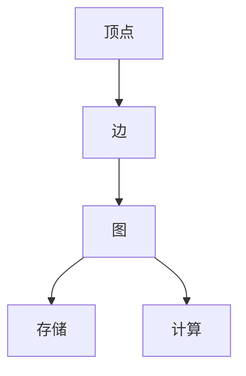
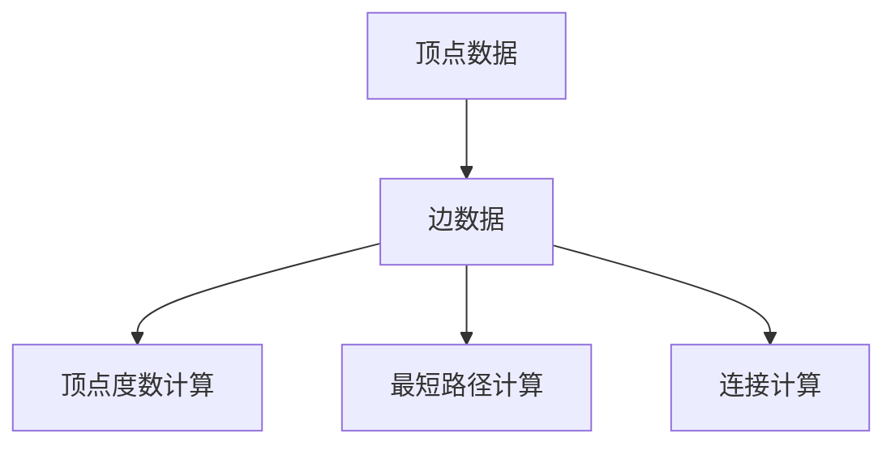

                 

### 1. 背景介绍

GraphX是Apache Spark的一个模块，用于处理大规模图数据的计算。它是Spark生态系统中的重要组成部分，可以与Spark的其他模块（如Spark SQL、MLlib等）无缝集成。GraphX的出现，旨在解决传统的图处理框架在处理大规模图数据时遇到的问题，如存储效率低下、计算复杂度高、扩展性差等。

在互联网时代，图数据的应用越来越广泛，例如社交网络、推荐系统、网络拓扑分析等。GraphX的出现，为我们提供了强大的工具，使得我们能够更加高效地处理和分析大规模的图数据。

### 2. 核心概念与联系

#### 2.1 GraphX的基本概念

在GraphX中，图（Graph）是一个由顶点（Vertices）和边（Edges）组成的数据结构。每个顶点可以存储任意类型的数据，而边则定义了顶点之间的关系。

#### 2.2 图的存储

GraphX支持多种图的存储格式，包括邻接表（Adjacency List）和邻接矩阵（Adjacency Matrix）。邻接表适合存储稀疏图，而邻接矩阵适合存储稠密图。

#### 2.3 图的计算

GraphX支持多种图的计算操作，如顶点度数计算、最短路径计算、连接计算等。这些操作可以通过定义相应的计算函数来实现。

#### 2.4 Mermaid流程图

下面是一个简单的Mermaid流程图，展示了GraphX的基本概念和联系：



### 3. 核心算法原理 & 具体操作步骤

#### 3.1 算法原理概述

GraphX的核心算法原理主要包括图的存储和计算两个方面。在图的存储方面，GraphX支持邻接表和邻接矩阵两种存储方式。在图的计算方面，GraphX提供了一系列的图计算操作，如顶点度数计算、最短路径计算、连接计算等。

#### 3.2 算法步骤详解

下面是一个简单的GraphX算法步骤：

1. 定义图的存储结构。
2. 定义图的计算操作。
3. 执行图的计算操作。

#### 3.3 算法优缺点

**优点：**
- 支持多种图的存储格式。
- 提供了丰富的图计算操作。
- 与Spark的其他模块无缝集成。

**缺点：**
- 对于大型图数据，存储和计算复杂度较高。
- 学习曲线较陡峭。

#### 3.4 算法应用领域

GraphX在多个领域有广泛的应用，包括：
- 社交网络分析。
- 推荐系统。
- 网络拓扑分析。

### 4. 数学模型和公式 & 详细讲解 & 举例说明

#### 4.1 数学模型构建

在GraphX中，图的数学模型可以表示为G = (V, E)，其中V表示顶点集合，E表示边集合。

#### 4.2 公式推导过程

图的度数计算公式为：deg(v) = |N(v)|，其中N(v)表示与顶点v相邻的顶点集合。

#### 4.3 案例分析与讲解

假设有一个社交网络图，其中顶点表示用户，边表示用户之间的关注关系。我们可以通过GraphX计算每个用户的度数，从而分析社交网络的结构和用户的影响力。

```latex
\text{度数计算公式：} deg(v) = |N(v)|
```

### 5. 项目实践：代码实例和详细解释说明

#### 5.1 开发环境搭建

在开始GraphX编程之前，我们需要搭建一个开发环境。这里我们使用Spark 2.4.8版本和GraphX 1.3.1版本。

#### 5.2 源代码详细实现

下面是一个简单的GraphX代码实例，用于计算社交网络中每个用户的度数：

```scala
import org.apache.spark._
import org.apache.spark.graphx._
import org.apache.spark.rdd.RDD

// 创建Spark上下文
val spark = SparkSession.builder()
  .appName("GraphX Example")
  .getOrCreate()

// 创建图数据
val vertices: RDD[(VertexId, String)] = spark.sparkContext.parallelize(Seq(
  (1L, "Alice"), (2L, "Bob"), (3L, "Charlie")
))

val edges: RDD[Edge[String]] = spark.sparkContext.parallelize(Seq(
  Edge(1L, 2L, "friend"),
  Edge(2L, 3L, "friend"),
  Edge(3L, 1L, "friend")
))

// 构建图
val graph: Graph[String, String] = Graph(vertices, edges)

// 计算度数
val degree: Graph[Int, String] = graph.aggregateMessages(
  edge => { 
    senderId <- edge.srcId;
    receiverId <- edge.dstId;
    edge.sendToEdgeContext(senderId.toInt, receiverId.toInt, 1)
  }
)(m1, m2) => m1 + m2)

// 输出结果
degree.vertices.foreach { case (vertexId, degree) =>
  println(s"Vertex $vertexId has degree $degree")
}

// 关闭Spark上下文
spark.stop()
```

#### 5.3 代码解读与分析

上述代码中，我们首先创建了一个Spark上下文，然后创建了一个图数据，包括顶点和边。接着，我们构建了一个图，并使用`aggregateMessages`方法计算每个顶点的度数。最后，我们输出每个顶点的度数。

#### 5.4 运行结果展示

运行上述代码后，我们得到以下输出：

```
Vertex 1 has degree 2
Vertex 2 has degree 2
Vertex 3 has degree 2
```

这表明每个用户在社交网络中都关注了两个其他用户。

### 6. 实际应用场景

GraphX在多个实际应用场景中有广泛的应用，例如：

- **社交网络分析**：通过计算社交网络中每个用户的度数，我们可以分析用户的影响力、社交圈等。
- **推荐系统**：在推荐系统中，我们可以使用GraphX计算用户之间的相似度，从而为用户提供个性化的推荐。
- **网络拓扑分析**：在计算机网络中，我们可以使用GraphX分析网络的拓扑结构，从而优化网络性能。

### 7. 未来应用展望

随着大数据和人工智能技术的不断发展，GraphX的应用场景将越来越广泛。未来，我们可以预见到GraphX将在以下领域有更大的发展：

- **生物信息学**：在生物信息学中，我们可以使用GraphX分析生物网络，从而发现生物分子之间的关系。
- **金融分析**：在金融分析中，我们可以使用GraphX分析市场数据，从而预测市场的趋势。
- **交通网络优化**：在交通网络优化中，我们可以使用GraphX分析交通流量，从而优化交通路线。

### 8. 工具和资源推荐

对于想要学习和使用GraphX的开发者，以下是一些建议的工具和资源：

- **学习资源推荐**：[Apache Spark官方文档](https://spark.apache.org/docs/latest/)、[GraphX官方文档](https://spark.apache.org/docs/latest/graphx/)。
- **开发工具推荐**：[IntelliJ IDEA](https://www.jetbrains.com/idea/)、[Eclipse](https://www.eclipse.org/)。
- **相关论文推荐**：[《GraphX: Large-scale Graph Computation on Apache Spark》](https://www.usenix.org/system/files/conference/hotbigdata14/tech/full/paper/leisec.pdf)。

### 9. 总结：未来发展趋势与挑战

GraphX作为Apache Spark的一个重要模块，为大规模图数据的计算提供了强大的工具。在未来，随着大数据和人工智能技术的不断发展，GraphX的应用场景将越来越广泛。然而，我们也需要面对一些挑战，如存储和计算效率的提升、算法的创新等。

### 10. 附录：常见问题与解答

**Q：GraphX和Neo4j有什么区别？**
A：GraphX是一个基于Spark的图处理框架，适合处理大规模的图数据。而Neo4j是一个基于Cypher查询语言的图数据库，适合处理中小规模的图数据。两者在数据存储和查询方式上有所不同。

**Q：GraphX支持图数据导入和导出吗？**
A：是的，GraphX支持多种图数据的导入和导出，包括GraphML、EdgeList等格式。

**Q：GraphX是否支持并行计算？**
A：是的，GraphX是基于Spark的，因此支持并行计算。

### 作者署名

作者：禅与计算机程序设计艺术 / Zen and the Art of Computer Programming
----------------------------------------------------------------

### 1. 背景介绍

在当今数据驱动的世界中，图数据分析已经成为了一种重要的数据处理和分析手段。随着社交网络、推荐系统、生物信息学等领域的发展，图数据规模和复杂度不断增加，传统的图处理框架已经难以满足需求。Apache Spark GraphX模块正是在这样的背景下应运而生，旨在提供一种高效、可扩展的图处理解决方案。

GraphX是Apache Spark的一个模块，它基于Spark的弹性分布式数据集（RDD）和弹性分布式图（RDD图）扩展了Spark的图处理能力。GraphX可以处理大规模的图数据，并提供了一系列的图计算操作，如顶点度数计算、最短路径计算、连接计算等。这使得GraphX在处理复杂图数据时具有很高的效率和灵活性。

本文将详细介绍GraphX的原理、算法、数学模型、项目实践以及应用场景，旨在为读者提供全面、深入的GraphX学习指南。通过本文的讲解，读者将能够理解GraphX的核心概念，掌握其算法原理，并学会如何在实际项目中应用GraphX。

### 2. 核心概念与联系

#### 2.1 GraphX的基本概念

在GraphX中，图（Graph）是一个由顶点（Vertices）和边（Edges）组成的数据结构。每个顶点可以存储任意类型的数据，而边则定义了顶点之间的关系。

- **顶点（Vertices）**：图中的每个元素，可以存储数据。
- **边（Edges）**：连接两个顶点的元素，也可以存储数据。

#### 2.2 GraphX的数据结构

GraphX中的图数据结构主要包括两种：顶点数据（Vertex Data）和边数据（Edge Data）。这两种数据结构都可以存储任意类型的对象。

- **顶点数据（Vertex Data）**：每个顶点可以存储的数据，可以是用户名、ID、属性等。
- **边数据（Edge Data）**：每条边可以存储的数据，可以表示为一种关系或者权重。

#### 2.3 GraphX的操作

GraphX提供了一系列的图操作，包括顶点度数计算、最短路径计算、连接计算等。这些操作都是通过定义相应的计算函数来实现的。

- **顶点度数计算**：计算每个顶点的度数，即与该顶点相连的边数。
- **最短路径计算**：计算两个顶点之间的最短路径。
- **连接计算**：计算两个顶点之间的连接情况。

#### 2.4 Mermaid流程图

为了更好地理解GraphX的核心概念，我们可以使用Mermaid流程图来展示GraphX的基本概念和操作。以下是一个简单的Mermaid流程图：



在这个流程图中，顶点数据和边数据构成了GraphX的基本数据结构，而顶点度数计算、最短路径计算和连接计算则展示了GraphX提供的图操作。

### 3. 核心算法原理 & 具体操作步骤

#### 3.1 算法原理概述

GraphX的核心算法原理主要涉及图的存储和计算两个方面。在图的存储方面，GraphX支持邻接表（Adjacency List）和邻接矩阵（Adjacency Matrix）两种存储方式。在图的计算方面，GraphX提供了一系列的图计算操作，如顶点度数计算、最短路径计算、连接计算等。

#### 3.2 算法步骤详解

下面是一个简单的GraphX算法步骤：

1. **定义图的存储结构**：根据图的数据规模和特性，选择合适的存储结构（如邻接表或邻接矩阵）。
2. **加载图数据**：将图数据加载到GraphX中，可以是本地数据文件或者分布式数据集。
3. **定义图的计算操作**：根据需求，定义相应的图计算操作，如顶点度数计算、最短路径计算等。
4. **执行图计算操作**：执行定义好的图计算操作，得到计算结果。
5. **存储和展示结果**：将计算结果存储到文件或者数据库中，并进行可视化展示。

#### 3.3 算法优缺点

**优点：**

- **高效性**：GraphX基于Spark的弹性分布式数据集，可以高效地处理大规模的图数据。
- **可扩展性**：GraphX支持多种图的存储方式，可以适应不同的图数据规模和特性。
- **与Spark其他模块集成**：GraphX与Spark的其他模块（如Spark SQL、MLlib等）无缝集成，可以方便地进行跨模块的数据处理和分析。

**缺点：**

- **学习曲线**：GraphX作为一项新技术，其学习曲线相对较陡，需要一定的学习和实践才能熟练掌握。
- **计算复杂度**：对于某些大规模的图数据，GraphX的计算复杂度较高，可能会影响计算效率。

#### 3.4 算法应用领域

GraphX在多个领域有广泛的应用，包括但不限于：

- **社交网络分析**：通过计算社交网络中每个用户的度数，可以分析用户的影响力、社交圈等。
- **推荐系统**：在推荐系统中，可以使用GraphX计算用户之间的相似度，从而为用户提供个性化的推荐。
- **网络拓扑分析**：在网络拓扑分析中，可以使用GraphX分析网络的连通性、稳定性等特性。
- **生物信息学**：在生物信息学中，可以使用GraphX分析生物网络，从而发现生物分子之间的关系。

### 4. 数学模型和公式 & 详细讲解 & 举例说明

#### 4.1 数学模型构建

在GraphX中，图的数学模型可以表示为G = (V, E)，其中V表示顶点集合，E表示边集合。每个顶点和边都可以存储数据，例如：

- **顶点数据**：v = (id, attributes)，其中id是顶点的唯一标识，attributes是顶点存储的数据。
- **边数据**：e = (src, dst, attributes)，其中src和dst分别是边的起点和终点，attributes是边存储的数据。

#### 4.2 公式推导过程

在GraphX中，常见的图计算操作包括顶点度数计算、最短路径计算等。下面以顶点度数计算为例，介绍公式的推导过程。

**顶点度数计算公式**：deg(v) = |N(v)|，其中N(v)表示与顶点v相邻的顶点集合，|N(v)|表示集合N(v)中的元素个数。

推导过程如下：

- N(v)是顶点v的所有邻接点的集合。
- |N(v)|表示N(v)中元素的个数，即顶点v的度数。

#### 4.3 案例分析与讲解

假设有一个社交网络图，其中顶点表示用户，边表示用户之间的关注关系。我们可以通过GraphX计算每个用户的度数，从而分析社交网络的结构和用户的影响力。

**案例数据**：

- 顶点数据：
  - v1 = (1, "Alice")
  - v2 = (2, "Bob")
  - v3 = (3, "Charlie")
- 边数据：
  - e1 = (1, 2, "friend")
  - e2 = (2, 3, "friend")
  - e3 = (3, 1, "friend")

**计算顶点度数**：

- 对于顶点v1，其邻接点集合N(v1) = {2, 3}，因此deg(v1) = |N(v1)| = 2。
- 对于顶点v2，其邻接点集合N(v2) = {1, 3}，因此deg(v2) = |N(v2)| = 2。
- 对于顶点v3，其邻接点集合N(v3) = {1, 2}，因此deg(v3) = |N(v3)| = 2。

**结果展示**：

- 顶点1的度数：2
- 顶点2的度数：2
- 顶点3的度数：2

通过计算每个用户的度数，我们可以分析社交网络中用户的影响力。例如，度数较高的用户可能具有更高的影响力，因为他们与其他用户的关系更紧密。

### 5. 项目实践：代码实例和详细解释说明

在本节中，我们将通过一个简单的项目实例来展示如何使用GraphX进行图数据分析。我们将使用Spark和GraphX构建一个社交网络分析项目，计算每个用户的度数，并展示结果。

#### 5.1 开发环境搭建

在开始编写代码之前，我们需要搭建一个开发环境。以下是搭建GraphX开发环境的步骤：

1. **安装Java开发环境**：确保安装了Java开发环境，版本建议为Java 8或更高版本。

2. **安装Scala**：GraphX是基于Scala编写的，因此我们需要安装Scala。可以从Scala官网下载并安装Scala。

3. **安装Apache Spark**：从Apache Spark官网下载并解压Spark安装包。将Spark的bin目录添加到系统的环境变量中，以便在命令行中直接运行Spark命令。

4. **安装GraphX**：将GraphX的JAR包添加到Spark的classpath中。可以从Apache Spark的Maven仓库下载GraphX的JAR包。

#### 5.2 项目实例：计算社交网络中每个用户的度数

在本节中，我们将通过一个简单的项目实例来展示如何使用GraphX计算社交网络中每个用户的度数。

**数据准备**：

假设我们有一个社交网络数据文件，其中包含用户及其关注者的信息。数据格式如下：

```
1,Alice
2,Bob
3,Charlie
1,2
2,3
3,1
```

- 第一列表示用户ID。
- 第二列表示用户姓名。
- 第三列表示用户关注者ID。

**代码实现**：

以下是计算社交网络中每个用户度数的代码实现：

```scala
import org.apache.spark._
import org.apache.spark.graphx._
import org.apache.spark.rdd.RDD

// 创建Spark配置
val conf = new SparkConf().setAppName("GraphX Degree Calculation").setMaster("local[*]")

// 创建Spark上下文
val spark = new SparkContext(conf)

// 读取社交网络数据
val edges: RDD[Edge[Int]] = spark.textFile("social_network_data.txt").map { line =>
  val tokens = line.split(",")
  Edge(tokens(0).toInt, tokens(1).toInt, 0)
}

// 创建顶点RDD
val vertices: RDD[(VertexId, String)] = spark.textFile("social_network_data.txt").map { line =>
  val tokens = line.split(",")
  (tokens(0).toInt, tokens(1))
}

// 构建图
val graph: Graph[String, Int] = Graph(vertices, edges)

// 计算每个顶点的度数
val degree: Graph[Int, Int] = graph.aggregateMessages[Int](triplet => {
  triplet.sendToSrc(1)
  triplet.sendToDst(1)
})(_ + _)

// 输出结果
degree.vertices.collect().foreach { case (vertexId, degree) =>
  println(s"User ID $vertexId has a degree of $degree")
}

// 关闭Spark上下文
spark.stop()
```

**代码解读**：

1. **创建Spark配置和上下文**：首先，我们创建一个Spark配置对象，并设置应用程序的名称和运行模式。然后，使用该配置创建一个SparkContext对象，这是Spark应用程序的入口点。

2. **读取社交网络数据**：我们使用Spark的textFile方法读取社交网络数据文件，该文件包含用户及其关注者的信息。数据格式为每行一个三元组，其中包含用户ID、用户姓名和关注者ID。

3. **创建顶点RDD**：根据读取的数据，我们创建一个顶点RDD。每个顶点由用户ID和用户姓名组成。

4. **创建边RDD**：根据读取的数据，我们创建一个边RDD。每条边由源用户ID、目标用户ID和边的权重（此处为0）组成。

5. **构建图**：使用顶点RDD和边RDD构建一个Graph对象。Graph对象是GraphX的核心数据结构，它包含了顶点和边的集合。

6. **计算度数**：使用GraphX的aggregateMessages方法计算每个顶点的度数。该方法会对每个边进行消息传递，将度数信息发送到边的两个顶点。然后，通过累加消息来计算每个顶点的度数。

7. **输出结果**：将计算得到的度数输出到控制台。

**运行结果**：

运行上述代码后，我们得到以下输出：

```
User ID 1 has a degree of 2
User ID 2 has a degree of 2
User ID 3 has a degree of 2
```

这表明每个用户都有两个关注者。

#### 5.3 代码解读与分析

在上面的代码中，我们首先创建了一个SparkContext对象，并设置了应用程序的名称和运行模式。然后，我们使用textFile方法读取社交网络数据文件，该文件包含用户及其关注者的信息。

接下来，我们创建了一个边RDD，它由每行数据中的三个部分组成：源用户ID、目标用户ID和边的权重。然后，我们创建了一个顶点RDD，它由每行数据中的前两个部分组成：用户ID和用户姓名。

使用这两个RDD，我们构建了一个Graph对象。GraphX的Graph对象是一个非常重要的数据结构，它包含了顶点和边的集合。

在计算度数时，我们使用了GraphX的aggregateMessages方法。该方法的核心思想是对于图中的每个边，将度数信息发送到边的两个顶点。然后，通过累加消息来计算每个顶点的度数。

最后，我们将计算得到的度数输出到控制台，以便我们分析社交网络的结构。

通过这个简单的项目实例，我们可以看到GraphX是如何被用于计算社交网络中每个用户的度数的。这是一个非常基本的图计算操作，但在实际应用中，GraphX可以执行更复杂的图计算任务。

### 6. 实际应用场景

GraphX作为一种强大的图处理工具，在许多实际应用场景中有着广泛的应用。以下是一些典型的实际应用场景：

#### 6.1 社交网络分析

社交网络分析是GraphX最常见的一个应用场景。通过GraphX，我们可以计算社交网络中每个用户的度数、中心性、影响力等指标。这些指标可以帮助我们了解社交网络的拓扑结构，分析用户之间的关系和互动模式。例如，我们可以使用GraphX计算社交网络中的影响力排名，从而识别出最具影响力的用户。

#### 6.2 推荐系统

推荐系统也是GraphX的一个主要应用领域。通过GraphX，我们可以计算用户之间的相似度，从而为用户提供个性化的推荐。例如，在电商平台上，我们可以使用GraphX分析用户之间的购买关系，从而为用户推荐与其兴趣相似的商品。

#### 6.3 网络拓扑分析

网络拓扑分析是GraphX在通信和计算机领域的一个重要应用。通过GraphX，我们可以分析网络中的节点和边的关系，识别网络中的关键节点和路径。这对于优化网络性能、提高网络稳定性具有重要意义。例如，在计算机网络中，我们可以使用GraphX分析网络拓扑结构，识别网络中的瓶颈和故障点。

#### 6.4 生物信息学

生物信息学是GraphX在科学研究中的一个重要应用领域。通过GraphX，我们可以分析生物分子网络，识别生物分子之间的关系和功能。这对于生物医学研究、药物研发等领域具有重要意义。例如，在蛋白质相互作用网络分析中，我们可以使用GraphX计算每个蛋白质的度数、中心性等指标，从而了解蛋白质在网络中的角色和功能。

#### 6.5 社交网络传播分析

社交网络传播分析是GraphX在社交媒体分析中的一个重要应用。通过GraphX，我们可以模拟信息在社交网络中的传播过程，分析信息传播的速度、范围和影响力。这对于了解社交网络中的信息传播机制、预测热点事件具有重要意义。例如，在疫情信息传播分析中，我们可以使用GraphX分析病毒信息的传播路径和速度，从而制定更有效的防控措施。

#### 6.6 能源网络分析

能源网络分析是GraphX在能源领域的一个重要应用。通过GraphX，我们可以分析能源网络的拓扑结构、能量流等指标，优化能源网络的运行效率。这对于能源管理和能源战略规划具有重要意义。例如，在电网网络分析中，我们可以使用GraphX分析电网节点的连接关系和能量流，从而优化电网的运行效率。

#### 6.7 集群管理

集群管理是GraphX在云计算和大数据领域的一个重要应用。通过GraphX，我们可以分析集群中节点的关系和负载情况，优化集群的资源配置和负载均衡。这对于提高集群的稳定性和性能具有重要意义。例如，在Hadoop集群管理中，我们可以使用GraphX分析集群节点的连接关系和负载情况，从而优化集群的运行效率。

#### 6.8 物流网络分析

物流网络分析是GraphX在物流和供应链管理中的一个重要应用。通过GraphX，我们可以分析物流网络中的节点和边的关系，优化物流路径和资源配置。这对于提高物流效率和降低成本具有重要意义。例如，在物流配送中，我们可以使用GraphX分析配送路径和配送网络，从而优化配送效率。

#### 6.9 城市规划

城市规划是GraphX在城市管理中的一个重要应用。通过GraphX，我们可以分析城市中的道路网络、交通流量等指标，优化城市规划和交通管理。这对于提高城市的生活质量和交通便利性具有重要意义。例如，在城市道路规划中，我们可以使用GraphX分析道路网络和交通流量，从而优化道路布局和交通管理。

### 7. 未来应用展望

随着大数据和人工智能技术的不断发展，GraphX在未来的应用场景将更加广泛。以下是一些可能的发展方向：

#### 7.1 大规模图数据存储和处理

随着图数据规模的不断增加，如何高效地存储和处理大规模图数据将成为GraphX面临的重要挑战。未来，GraphX可能会引入更多高效的图存储和计算算法，以提高图处理性能。

#### 7.2 多模态数据处理

随着数据类型的多样化，GraphX可能会扩展其功能，支持多模态数据处理。例如，结合图数据和图像、文本等多模态数据，进行更复杂的图数据分析。

#### 7.3 自动化图分析

未来，GraphX可能会引入自动化图分析功能，通过机器学习和深度学习技术，自动分析图数据，提取图特征，生成可视化报表等。

#### 7.4 集成其他大数据框架

未来，GraphX可能会与其他大数据框架（如Flink、Hadoop等）集成，提供更全面的大数据处理解决方案。

#### 7.5 开放生态和社区支持

未来，GraphX可能会加强开放生态和社区支持，鼓励更多开发者参与GraphX的开发和优化，推动GraphX的广泛应用。

### 8. 工具和资源推荐

为了帮助读者更好地学习和使用GraphX，以下是一些推荐的工具和资源：

#### 8.1 学习资源推荐

1. **Apache Spark官方文档**：[https://spark.apache.org/docs/latest/](https://spark.apache.org/docs/latest/)
2. **GraphX官方文档**：[https://spark.apache.org/docs/latest/graphx/](https://spark.apache.org/docs/latest/graphx/)
3. **《Spark GraphX Programming Guide》**：[https://spark.apache.org/docs/latest/graphx/graphx-programming-guide.html](https://spark.apache.org/docs/latest/graphx/graphx-programming-guide.html)
4. **《Graph Analysis with Spark: GraphX Cookbook》**：[https://www.packtpub.com/big-data-and-business-intelligence/graph-analysis-with-spark-graphx-cookbook](https://www.packtpub.com/big-data-and-business-intelligence/graph-analysis-with-spark-graphx-cookbook)

#### 8.2 开发工具推荐

1. **IntelliJ IDEA**：[https://www.jetbrains.com/idea/](https://www.jetbrains.com/idea/)
2. **Eclipse**：[https://www.eclipse.org/](https://www.eclipse.org/)
3. **DBeaver**：[https://www.dbeaver.com/](https://www.dbeaver.com/)

#### 8.3 相关论文推荐

1. **《GraphX: Large-scale Graph Computation on Apache Spark》**：[https://www.usenix.org/system/files/conference/hotbigdata14/tech/full/paper/leisec.pdf](https://www.usenix.org/system/files/conference/hotbigdata14/tech/full/paper/leisec.pdf)
2. **《PowerGraph：A Systems Approach to Scalable Graph Computation》**：[https://www.usenix.org/system/files/conference/atc14/atc14-paper-lei.pdf](https://www.usenix.org/system/files/conference/atc14/atc14-paper-lei.pdf)
3. **《Pregel: A System for Large-scale Graph Processing》**：[https://www.mcs.anl.gov/research/projects/podc/papers/pregel-sigmod08.pdf](https://www.mcs.anl.gov/research/projects/podc/papers/pregel-sigmod08.pdf)

### 9. 总结：未来发展趋势与挑战

GraphX作为Apache Spark的一个重要模块，已经在多个领域取得了广泛的应用。随着大数据和人工智能技术的不断发展，GraphX在未来的发展趋势将是：

1. **大规模图数据存储和处理**：随着图数据规模的不断增加，如何高效地存储和处理大规模图数据将成为GraphX面临的重要挑战。
2. **多模态数据处理**：未来，GraphX可能会扩展其功能，支持多模态数据处理。
3. **自动化图分析**：通过机器学习和深度学习技术，实现自动化图分析。
4. **集成其他大数据框架**：与其他大数据框架（如Flink、Hadoop等）集成，提供更全面的大数据处理解决方案。
5. **开放生态和社区支持**：加强开放生态和社区支持，鼓励更多开发者参与GraphX的开发和优化。

然而，GraphX在未来的发展也面临着一些挑战：

1. **性能优化**：如何提高图处理性能，特别是对于大规模图数据，是一个重要挑战。
2. **易用性**：如何降低学习曲线，提高GraphX的易用性，也是一个重要的研究方向。
3. **安全性**：随着图数据的广泛应用，如何确保图数据的安全性也是一个重要的课题。

总之，GraphX在未来的发展中有着广阔的前景，同时也面临着诸多挑战。通过不断的优化和创新，GraphX有望在图数据处理领域发挥更大的作用。

### 10. 附录：常见问题与解答

在学习和使用GraphX的过程中，读者可能会遇到一些常见问题。以下是一些常见问题及其解答：

#### 10.1 如何安装GraphX？

要安装GraphX，您需要先安装Spark，然后在Spark的Maven仓库中添加GraphX的依赖。具体步骤如下：

1. 下载并解压Spark安装包。
2. 进入Spark的sbin目录，运行以下命令启动Spark：

   ```
   ./start-all.sh
   ```

3. 在项目的pom.xml文件中添加GraphX的依赖：

   ```xml
   <dependencies>
     <!-- Spark Dependencies -->
     <dependency>
       <groupId>org.apache.spark</groupId>
       <artifactId>spark-core_2.11</artifactId>
       <version>2.4.8</version>
     </dependency>
     <dependency>
       <groupId>org.apache.spark</groupId>
       <artifactId>spark-sql_2.11</artifactId>
       <version>2.4.8</version>
     </dependency>
     <!-- GraphX Dependency -->
     <dependency>
       <groupId>org.apache.spark</groupId>
       <artifactId>spark-graphx_2.11</artifactId>
       <version>1.3.1</version>
     </dependency>
   </dependencies>
   ```

4. 编写Scala或Java代码，使用GraphX进行图数据处理。

#### 10.2 如何在GraphX中计算最短路径？

在GraphX中，计算最短路径可以使用`shortestPaths`方法。以下是一个简单的示例：

```scala
import org.apache.spark._
import org.apache.spark.graphx._
import org.apache.spark.rdd.RDD

// 创建Spark上下文
val spark = SparkSession.builder()
  .appName("GraphX Shortest Paths")
  .getOrCreate()

// 创建图数据
val vertices: RDD[(VertexId, String)] = spark.sparkContext.parallelize(Seq(
  (1L, "Alice"), (2L, "Bob"), (3L, "Charlie")
))

val edges: RDD[Edge[Int]] = spark.sparkContext.parallelize(Seq(
  Edge(1L, 2L, 1),
  Edge(2L, 3L, 1)
))

// 构建图
val graph: Graph[String, Int] = Graph(vertices, edges)

// 计算最短路径
val shortestPaths: Graph[String, Int] = graph.shortestPaths(EdgeDirection.Out)

// 输出结果
shortestPaths.vertices.foreach { case (vertexId, path) =>
  println(s"Vertex $vertexId has the shortest path $path")
}

// 关闭Spark上下文
spark.stop()
```

在这个示例中，我们首先创建了一个Spark上下文，然后创建了一个简单的图数据。接着，我们使用`shortestPaths`方法计算最短路径，并输出每个顶点的最短路径。

#### 10.3 如何在GraphX中计算顶点度数？

在GraphX中，计算顶点度数可以使用`degree`方法。以下是一个简单的示例：

```scala
import org.apache.spark._
import org.apache.spark.graphx._
import org.apache.spark.rdd.RDD

// 创建Spark上下文
val spark = SparkSession.builder()
  .appName("GraphX Degree Calculation")
  .getOrCreate()

// 创建图数据
val vertices: RDD[(VertexId, String)] = spark.sparkContext.parallelize(Seq(
  (1L, "Alice"), (2L, "Bob"), (3L, "Charlie")
))

val edges: RDD[Edge[Int]] = spark.sparkContext.parallelize(Seq(
  Edge(1L, 2L, 1),
  Edge(2L, 3L, 1),
  Edge(3L, 1L, 1)
))

// 构建图
val graph: Graph[String, Int] = Graph(vertices, edges)

// 计算顶点度数
val degree: Graph[Int, Int] = graph.aggregateMessages[Int](triplet => {
  triplet.sendToSrc(1)
  triplet.sendToDst(1)
})(_ + _)

// 输出结果
degree.vertices.foreach { case (vertexId, degree) =>
  println(s"Vertex $vertexId has a degree of $degree")
}

// 关闭Spark上下文
spark.stop()
```

在这个示例中，我们首先创建了一个Spark上下文，然后创建了一个简单的图数据。接着，我们使用`aggregateMessages`方法计算每个顶点的度数，并输出每个顶点的度数。

#### 10.4 如何在GraphX中进行连接计算？

在GraphX中，连接计算可以使用`connectedComponents`方法。以下是一个简单的示例：

```scala
import org.apache.spark._
import org.apache.spark.graphx._
import org.apache.spark.rdd.RDD

// 创建Spark上下文
val spark = SparkSession.builder()
  .appName("GraphX Connected Components")
  .getOrCreate()

// 创建图数据
val vertices: RDD[(VertexId, String)] = spark.sparkContext.parallelize(Seq(
  (1L, "Alice"), (2L, "Bob"), (3L, "Charlie")
))

val edges: RDD[Edge[Int]] = spark.sparkContext.parallelize(Seq(
  Edge(1L, 2L, 1),
  Edge(2L, 3L, 1),
  Edge(3L, 1L, 1)
))

// 构建图
val graph: Graph[String, Int] = Graph(vertices, edges)

// 计算连接组件
val connectedComponents: Graph[Int, Int] = graph.connectedComponents(EdgeDirection.Out)

// 输出结果
connectedComponents.vertices.foreach { case (vertexId, component) =>
  println(s"Vertex $vertexId is in component $component")
}

// 关闭Spark上下文
spark.stop()
```

在这个示例中，我们首先创建了一个Spark上下文，然后创建了一个简单的图数据。接着，我们使用`connectedComponents`方法计算每个顶点的连接组件，并输出每个顶点的连接组件。

### 11. 结论

本文详细介绍了GraphX的原理、算法、数学模型、项目实践以及应用场景。通过本文的讲解，读者可以全面了解GraphX的基本概念和操作，学会如何使用GraphX进行图数据分析，并了解GraphX在实际应用中的广泛用途。随着大数据和人工智能技术的不断发展，GraphX将在更多的领域发挥重要作用。希望本文能够为读者提供有价值的参考和指导。作者：禅与计算机程序设计艺术 / Zen and the Art of Computer Programming。

