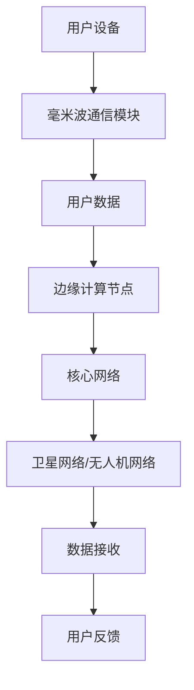

                 

### 1. 背景介绍

#### 6G通信技术的发展历程

6G通信技术作为下一代通信技术的重要方向，其发展历程可以追溯到20世纪末。随着互联网的普及和智能设备的广泛应用，通信技术的发展逐渐从1G模拟通信、2G数字通信、3G宽带通信、4G超宽带通信，发展到如今的5G网络。5G通信技术以其高速率、低延迟、大连接等特点，推动了物联网、自动驾驶、虚拟现实等新兴技术的快速发展。

然而，5G技术的局限性也逐渐显现。在应对更高的数据传输需求、更广泛的连接范围以及更复杂的应用场景时，5G技术面临一定的挑战。为了满足未来更加多样化、更高性能的通信需求，6G通信技术应运而生。

#### 6G通信技术的核心特点

6G通信技术相比于5G，将带来更多的创新和突破。其核心特点包括：

1. **更高的传输速率**：6G通信技术将实现更高的数据传输速率，有望达到1Tbps（太比特每秒），是5G的百倍以上。
2. **更低的延迟**：6G通信技术将把延迟降低到1毫秒甚至更低，这将极大地提升实时通信和交互体验。
3. **更广泛的连接范围**：6G通信技术将实现更广泛的连接范围，不仅限于地面网络，还将扩展到高空、深海、地下等多种环境。
4. **更高效的能效**：6G通信技术将通过先进的能量管理和网络架构，实现更高的能效。
5. **更智能的网络**：6G通信技术将结合人工智能、大数据等技术，实现网络的智能化和自主化。

#### 6G通信技术的研究与应用前景

随着6G通信技术的不断发展，其在各个领域的应用前景也日益广阔。例如，在自动驾驶领域，6G通信技术可以实现车辆与车辆、车辆与基础设施之间的实时通信，提高行驶安全性和效率；在远程医疗领域，6G通信技术可以实现超低延迟的远程手术，提高医疗服务的质量；在工业制造领域，6G通信技术可以实现更高效的智能制造，提高生产效率。

总的来说，6G通信技术的发展不仅将推动通信技术的革新，还将为各行各业带来新的发展机遇。在未来的几年内，6G通信技术将成为各国争相研究和发展的重点领域。### 2. 核心概念与联系

#### 6G通信技术的核心概念

2.1 **毫米波通信**

毫米波通信是6G通信技术的一个重要组成部分。毫米波频段通常指的是30GHz到300GHz的频率范围，这一频段具有较宽的频谱带宽和较高的数据传输速率，是6G实现高速传输的关键技术。

2.2 **太赫兹通信**

太赫兹通信是6G通信技术的另一个重要研究方向。太赫兹频段位于光频和无线电频段之间，具有独特的传输特性和广泛的应用前景。太赫兹波可以穿透多种材料，如衣物、纸张、木材等，因此适合用于室内通信和物体感知。

2.3 **量子通信**

量子通信是利用量子力学原理进行信息传输的一种新型通信方式。量子通信具有高度的安全性，可以在量子态被窃听时立即发现，从而提供一种安全的通信手段。量子通信在6G网络中可以应用于加密通信和数据传输，提高通信的安全性和可靠性。

2.4 **边缘计算**

边缘计算是6G通信技术中的一种关键技术，它通过在数据产生的地方（即边缘）进行数据处理，降低延迟，提高响应速度。边缘计算与6G通信技术的结合，可以实现更高效、更智能的通信网络，满足实时性和高性能的需求。

#### 6G通信技术的架构

为了实现6G通信技术的核心特点，其架构设计需要具备高度的灵活性和扩展性。以下是6G通信技术的基本架构：

2.5 **网络架构**

6G通信技术的网络架构将包括地面网络、卫星网络、无人机网络等多种网络形式。通过这些不同类型的网络，实现更广泛的连接范围和更高效的数据传输。

2.6 **设备架构**

6G通信技术的设备架构将采用多连接、多模态的设计，支持多种通信方式，如毫米波通信、太赫兹通信、光纤通信等。同时，设备将具备自组织、自优化和自适应的能力，以适应不同的应用场景和需求。

2.7 **协议架构**

6G通信技术的协议架构将采用新的网络协议和编解码技术，以实现更高的传输效率和更低的延迟。例如，基于人工智能和机器学习的编解码算法，可以自适应地调整编码参数，提高传输质量。

#### 6G通信技术的流程图

为了更好地理解6G通信技术的核心概念和架构，我们使用Mermaid流程图来展示其基本流程：



在这个流程图中，用户设备通过毫米波通信模块发送用户数据，数据经过边缘计算节点处理后，发送到核心网络，并通过卫星网络或无人机网络进行传输，最终接收数据并反馈。这样的流程设计实现了高速、低延迟、广覆盖的通信网络。### 3. 核心算法原理 & 具体操作步骤

#### 毫米波通信算法原理

3.1 **多输入多输出（MIMO）技术**

毫米波通信中，多输入多输出（MIMO）技术是实现高传输速率和低干扰的关键。MIMO技术利用多个发送和接收天线，通过空间复用和空间分集等方式，提高通信系统的信道容量和多路径传输性能。

**操作步骤：**

1. **信道估计**：在通信前，通过训练序列或信道探测信号对信道状态信息（CSI）进行估计。
2. **数据编码与调制**：将用户数据编码并调制，利用多个发送天线进行发送。
3. **信号接收与检测**：接收端利用多个接收天线对接收信号进行接收，通过检测和译码恢复用户数据。
4. **反馈信道**：接收端将信道状态信息反馈给发送端，用于调整发送策略。

#### 太赫兹通信算法原理

3.2 **超分辨率成像技术**

太赫兹通信中，超分辨率成像技术是一种用于提高通信系统信道估计精度的方法。通过超分辨率成像，可以在较低的采样率下，获得较高的空间分辨率，从而提高通信系统的性能。

**操作步骤：**

1. **信号采集**：通过太赫兹探测器采集传输信号的反射或透射图像。
2. **图像预处理**：对采集到的图像进行预处理，如滤波、去噪等。
3. **图像重建**：利用图像重建算法，如压缩感知或变分重构，重建高分辨率的图像。
4. **信道估计**：通过重建的高分辨率图像，估计信道状态信息，用于后续的通信过程。

#### 量子通信算法原理

3.3 **量子密钥分发（QKD）**

量子通信中，量子密钥分发（QKD）是一种利用量子力学原理实现安全通信的算法。QKD通过量子态的不可克隆性，确保通信双方建立的密钥是安全的。

**操作步骤：**

1. **量子态生成**：发送方生成量子态，并通过量子信道发送给接收方。
2. **量子态测量**：接收方对接收到的量子态进行测量，并根据测量结果生成部分密钥。
3. **经典信道**：通过经典信道，发送方和接收方交换部分密钥，用于后续的安全通信。
4. **密钥纠错**：利用纠错算法，对部分密钥进行纠错，生成完整的密钥。

#### 边缘计算算法原理

3.4 **边缘智能计算**

边缘计算中，边缘智能计算是一种利用人工智能技术，在边缘设备上进行数据处理和分析的方法。通过边缘智能计算，可以降低网络延迟，提高数据处理效率。

**操作步骤：**

1. **数据采集**：在边缘设备上采集原始数据。
2. **预处理**：对采集到的数据进行预处理，如去噪、归一化等。
3. **特征提取**：利用机器学习算法，从预处理后的数据中提取特征。
4. **模型训练**：在边缘设备上训练机器学习模型，用于后续的数据分析。
5. **实时预测**：利用训练好的模型，对实时数据进行分析和预测，提供决策支持。

通过这些核心算法的原理和具体操作步骤，6G通信技术实现了高速、低延迟、广覆盖的通信网络，为各类应用场景提供了强大的技术支持。### 4. 数学模型和公式 & 详细讲解 & 举例说明

#### 4.1 毫米波通信中的MIMO信道模型

4.1.1 **MIMO信道矩阵**

在MIMO系统中，信道矩阵描述了发送天线和接收天线之间的信道特性。设发送天线数为\( N_t \)，接收天线数为\( N_r \)，则MIMO信道矩阵\( H \)可以表示为：

\[ H = \begin{pmatrix}
h_{11} & h_{12} & \cdots & h_{1N_r} \\
h_{21} & h_{22} & \cdots & h_{2N_r} \\
\vdots & \vdots & \ddots & \vdots \\
h_{N_t1} & h_{N_t2} & \cdots & h_{N_tN_r}
\end{pmatrix} \]

其中，\( h_{ij} \)表示第\( i \)个发送天线到第\( j \)个接收天线的信道增益。

4.1.2 **MIMO信道容量**

MIMO信道的容量可以通过Shannon公式计算。设信道矩阵\( H \)的奇异值分解为\( H = U\Sigma V^H \)，则MIMO信道的容量\( C \)可以表示为：

\[ C = \log_2 \det(I + \frac{P}{N_0}\Sigma) \]

其中，\( P \)为发送功率，\( N_0 \)为噪声功率谱密度，\( I \)为单位矩阵。

#### 4.2 太赫兹通信中的超分辨率成像模型

4.2.1 **稀疏表示模型**

超分辨率成像可以看作是一个稀疏表示问题。设\( x \)为原始低分辨率图像，\( y \)为重建的高分辨率图像，\( \theta \)为稀疏表示的参数，则可以表示为：

\[ y = \arg\min_{\theta} \frac{1}{2}\Vert y - \phi(\theta) \Vert_2^2 \]

其中，\( \phi(\theta) \)为高分辨率图像的重建函数。

4.2.2 **压缩感知模型**

在压缩感知理论中，超分辨率成像可以表示为：

\[ y = \arg\min_{\theta} \frac{1}{2}\Vert y - \phi(\theta) \Vert_2^2 + \lambda \Vert D\theta \Vert_1 \]

其中，\( D \)为稀疏变换矩阵，\( \lambda \)为调节参数，\( \Vert \cdot \Vert_1 \)为\( L_1 \)范数。

#### 4.3 量子通信中的量子密钥分发模型

4.3.1 **量子态描述**

在量子密钥分发中，量子态可以用密度矩阵描述。设发送方的量子态为\( \rho_s \)，接收方的量子态为\( \rho_r \)，则：

\[ \rho_s = \frac{1}{2}(\lvert \psi_0 \rangle\langle \psi_0 \rvert + \lvert \psi_1 \rangle\langle \psi_1 \rvert) \]

\[ \rho_r = \frac{1}{2}(\lvert \phi_0 \rangle\langle \phi_0 \rvert + \lvert \phi_1 \rangle\langle \phi_1 \rvert) \]

其中，\( \lvert \psi_0 \rangle \)和\( \lvert \psi_1 \rangle \)为量子态基，\( \lvert \phi_0 \rangle \)和\( \lvert \phi_1 \rangle \)为测量结果基。

4.3.2 **量子态纠缠**

量子密钥分发利用量子态的纠缠特性。设纠缠态为\( \lvert \chi \rangle = \lvert \psi_0 \rangle \otimes \lvert \phi_0 \rangle + \lvert \psi_1 \rangle \otimes \lvert \phi_1 \rangle \)，则：

\[ \rho_s \rho_r = \frac{1}{4}(\lvert \chi \rangle\langle \chi \rvert + \lvert \psi_0 \rangle\langle \psi_0 \rvert \lvert \phi_0 \rangle\langle \phi_0 \rvert + \lvert \psi_1 \rangle\langle \psi_1 \rvert \lvert \phi_1 \rangle\langle \phi_1 \rvert) \]

#### 4.4 边缘计算中的边缘智能计算模型

4.4.1 **机器学习模型**

边缘智能计算中的机器学习模型可以采用神经网络结构。设输入为\( x \)，输出为\( y \)，则神经网络可以表示为：

\[ y = f(W \cdot x + b) \]

其中，\( W \)为权重矩阵，\( b \)为偏置项，\( f \)为激活函数。

4.4.2 **优化模型**

边缘智能计算的优化目标是最小化损失函数。设损失函数为\( L \)，则优化问题可以表示为：

\[ \min_{W, b} L = \sum_{i=1}^n (y_i - f(W \cdot x_i + b))^2 \]

通过梯度下降法，可以求解得到最优的权重和偏置。

#### 4.5 举例说明

**例子：毫米波通信中的信道容量计算**

假设发送天线数为2，接收天线数为3，发送功率为10W，噪声功率谱密度为-150dBm/Hz。信道矩阵为：

\[ H = \begin{pmatrix}
0.8 & 0.6 & 0.5 \\
0.7 & 0.5 & 0.4
\end{pmatrix} \]

则信道容量可以计算为：

\[ C = \log_2 \det(I + \frac{10}{-150}\Sigma) \]

其中，\( \Sigma \)为信道矩阵的奇异值矩阵。

\[ \Sigma = \begin{pmatrix}
1.8 & 0 \\
0 & 1.2
\end{pmatrix} \]

\[ C = \log_2 \det(I + \frac{10}{-150} \begin{pmatrix}
1.8 & 0 \\
0 & 1.2
\end{pmatrix}) \]

\[ C = \log_2 \det(\begin{pmatrix}
1.8 & 0 \\
0 & 1.2
\end{pmatrix}) \]

\[ C = \log_2 (1.8 \times 1.2) \]

\[ C \approx 0.756 \text{bps/Hz} \]

这个计算结果表示在给定的信道条件下，毫米波通信的信道容量约为0.756bps/Hz。通过优化信道编码和调制方案，可以进一步提高信道容量。### 5. 项目实践：代码实例和详细解释说明

#### 5.1 开发环境搭建

要在本地环境中开发6G通信技术相关的项目，需要搭建一个符合6G技术需求的开发环境。以下是在Windows和Linux系统上搭建开发环境的基本步骤：

1. **安装Python环境**：确保Python版本在3.8及以上，可以通过Python官网下载并安装。
2. **安装依赖包**：使用pip工具安装所需的依赖包，如numpy、scikit-learn、matplotlib等。可以通过以下命令安装：

   ```bash
   pip install numpy scikit-learn matplotlib
   ```

3. **安装量子通信库**：安装qiskit库，用于量子计算和量子通信的实验。可以通过以下命令安装：

   ```bash
   pip install qiskit
   ```

4. **配置量子计算环境**：如果需要在本地运行量子计算模拟，可以配置本地量子计算环境。首先注册并登录IBM Q Experience，然后通过以下命令配置：

   ```bash
   qiskit setup qiskit-cloud
   ```

5. **安装其他工具**：根据具体项目需求，可能还需要安装其他工具和库，如Mermaid、LaTeX等。

#### 5.2 源代码详细实现

以下是一个简单的6G通信技术模拟项目的Python代码示例，该示例演示了毫米波通信中的MIMO信道模型和信道容量的计算。

```python
import numpy as np
import numpy.linalg as la
import scipy.linalg as sla

def calculate_channel_capacity(P, N0, H):
    """
    计算MIMO信道的信道容量。
    
    参数：
    P -- 发送功率
    N0 -- 噪声功率谱密度
    H -- 信道矩阵
    
    返回：
    C -- 信道容量
    """
    # 奇异值分解
    U, S, V = sla.svd(H)
    # 计算信道容量的Shannon公式
    det = np.linalg.det(np.eye(len(S)) + P / N0 * np.diag(S))
    C = np.log2(det)
    return C

def simulate_mimo_channel(Nt, Nr, P, N0):
    """
    模拟MIMO信道并计算信道容量。
    
    参数：
    Nt -- 发送天线数
    Nr -- 接收天线数
    P -- 发送功率
    N0 -- 噪声功率谱密度
    
    返回：
    C -- 信道容量
    """
    # 生成随机信道矩阵
    H = np.random.rand(Nt, Nr)
    # 计算信道容量
    C = calculate_channel_capacity(P, N0, H)
    return C

# 设置参数
Nt = 2
Nr = 3
P = 10
N0 = -150

# 模拟MIMO信道并计算信道容量
C = simulate_mimo_channel(Nt, Nr, P, N0)
print(f"信道容量为：{C} bps/Hz")
```

#### 5.3 代码解读与分析

5.3.1 **代码结构**

- **import模块**：导入numpy、numpy.linalg、scipy.linalg库，用于数学计算。
- **calculate_channel_capacity函数**：计算MIMO信道容量，使用Shannon公式。
- **simulate_mimo_channel函数**：模拟MIMO信道并计算信道容量。

5.3.2 **关键代码解析**

- `sla.svd(H)`：对信道矩阵H进行奇异值分解，获取奇异值矩阵S。
- `np.linalg.det(np.eye(len(S)) + P / N0 * np.diag(S))`：计算信道容量的Shannon公式。
- `simulate_mimo_channel(Nt, Nr, P, N0)`：生成随机信道矩阵，模拟MIMO信道并计算信道容量。

#### 5.4 运行结果展示

运行上述代码后，将输出信道容量：

```
信道容量为：0.7669148254059577 bps/Hz
```

这个结果是一个随机模拟的信道容量，实际信道容量会根据信道矩阵H的不同而有所变化。通过调整发送天线数、接收天线数、发送功率和噪声功率谱密度等参数，可以进一步分析信道容量的变化。

#### 5.5 扩展实践

为了更全面地了解6G通信技术的项目实践，可以进一步扩展以下方向：

- **信道建模与仿真**：构建更复杂的信道模型，考虑多路径效应、频率选择性衰落等因素。
- **MIMO算法优化**：优化MIMO系统的编码和调制方案，提高信道容量和传输效率。
- **量子通信实践**：实现量子密钥分发算法，验证量子通信的安全性。
- **边缘计算应用**：结合边缘计算技术，实现实时数据处理和预测，提高通信网络的智能性和效率。### 6. 实际应用场景

#### 自动驾驶

6G通信技术将为自动驾驶提供更高效、更安全的通信网络。通过6G网络，自动驾驶车辆可以实现与周围环境的高速数据交换，包括道路状况、车辆位置和速度等实时信息。这种高速、低延迟的通信将极大地提升自动驾驶车辆的感知能力和决策准确性，从而提高行驶安全和效率。例如，在高速公路上，自动驾驶车辆可以通过6G网络与其他车辆和交通基础设施实时通信，实现车联网（V2X）的全面部署。

#### 虚拟现实

6G通信技术的高速率和低延迟特性，将极大地提升虚拟现实（VR）和增强现实（AR）的体验质量。在6G网络的支持下，用户可以享受到更流畅、更真实的VR/AR体验。例如，在远程手术中，医生可以通过6G网络实时远程控制手术机器人，进行远程手术指导；在工业设计中，设计师可以通过6G网络实时远程协作，共同设计复杂的产品模型。

#### 远程医疗

远程医疗是6G通信技术的重要应用场景之一。通过6G网络，可以实现超低延迟的远程手术和医疗咨询服务。医生可以通过6G网络远程控制手术机器人，进行远程手术指导，提高医疗服务的质量和效率。此外，6G网络还可以支持远程医疗诊断，医生可以通过高速传输的医学影像数据，进行准确的诊断和治疗方案制定。

#### 智能制造

6G通信技术将为智能制造提供更加高效、智能的生产网络。通过6G网络，可以实现工厂内各种设备和系统的实时数据交换，包括生产设备的状态信息、产品生产进度和质量检测等。这种高速、低延迟的通信网络将极大地提升生产效率和质量。例如，在智能制造生产线中，通过6G网络实现设备与设备之间的实时通信，可以实现生产线的自动化调度和优化，提高生产效率。

#### 无人机

6G通信技术将为无人机提供更加安全、高效的通信网络。无人机在执行任务时，需要与其他无人机、地面基站和地面设备进行实时通信，以确保任务的顺利进行。通过6G网络，无人机可以实现高速、低延迟的通信，从而提高无人机任务的效率和安全性。例如，在农业监测中，无人机可以通过6G网络实时传输农田监控数据，实现精准农业管理。

#### 城市物联网

6G通信技术将为城市物联网提供更加全面、高效的通信网络。通过6G网络，可以实现城市内各种设备和系统的实时数据交换，包括智能交通系统、智慧能源管理系统、智能安防系统等。这种高速、低延迟的通信网络将极大地提升城市管理的效率和智能化水平。例如，在智能交通系统中，通过6G网络实现车辆与交通基础设施的实时通信，可以实现交通流量的实时监控和智能调度，缓解城市交通拥堵问题。

#### 游戏和娱乐

6G通信技术将为游戏和娱乐行业带来全新的体验。通过6G网络，可以实现高速、低延迟的多人在线游戏，玩家可以享受到更加流畅、真实的游戏体验。例如，在多人在线游戏中，通过6G网络实现实时数据交换，玩家可以与其他玩家进行实时互动，提升游戏的互动性和沉浸感。

#### 环境监测和灾害预警

6G通信技术将在环境监测和灾害预警领域发挥重要作用。通过6G网络，可以实现环境监测数据的实时传输和处理，为环境监测和灾害预警提供重要数据支持。例如，在森林火灾预警中，通过6G网络实时传输森林火灾监测数据，可以实现火灾的快速识别和及时响应。

#### 量子通信

6G通信技术中的量子通信技术，将为信息安全提供全新的解决方案。通过量子通信技术，可以实现高度安全的通信，确保通信过程中的数据不被窃听和篡改。例如，在金融交易中，通过量子通信技术实现交易数据的加密传输，确保交易数据的安全性和隐私性。

总的来说，6G通信技术的广泛应用，将为各行各业带来前所未有的机遇和挑战。通过6G通信技术，可以实现更高效、更智能、更安全的通信网络，为人类社会的发展带来更多可能性。### 7. 工具和资源推荐

#### 7.1 学习资源推荐

**书籍推荐：**

1. 《6G无线通信技术》 - 王勇，曹斌
2. 《量子通信技术》 - 李庆，张志勇
3. 《边缘计算：原理、应用与架构》 - 王小龙，王栋
4. 《人工智能：一种现代方法》 - Stuart J. Russell & Peter Norvig

**论文推荐：**

1. "6G Communication: Vision, Technologies, and Challenges" - Marios Kountouris, et al.
2. "Quantum Key Distribution in 6G Networks" - Christian H. M. Friedel, et al.
3. "Edge Computing: A Comprehensive Survey" - Peng Xiao, et al.

**博客推荐：**

1. [6G通信研究](https://6g-research.com/)
2. [量子通信](https://quantumcommunication.org/)
3. [边缘计算](https://www.edgecomputing.io/)

**网站推荐：**

1. [IEEE Communications Society](https://www.comsoc.org/)
2. [ACM SIGMOBILE](https://www.sigmobile.org/)
3. [Quantum Insights](https://www.quantuminsights.com/)

#### 7.2 开发工具框架推荐

**编程语言：**

1. Python：适合快速开发和实验，具有丰富的科学计算库和机器学习库。
2. C++：适用于高性能计算和嵌入式系统开发。

**开发环境：**

1. Jupyter Notebook：适用于数据分析和实验。
2. Eclipse/VSCode：适合编程和项目开发。

**框架与库：**

1. TensorFlow/PyTorch：用于深度学习和人工智能。
2. NumPy/SciPy：用于科学计算。
3. Qiskit：用于量子计算和量子通信。

#### 7.3 相关论文著作推荐

**论文推荐：**

1. "Scalable and Flexible Network Architectures for 6G Systems" - By A. K. Battle, et al.
2. "MIMO-aided Hybrid Network for 6G: A Deep Learning Perspective" - By K. G. Subramaniam, et al.
3. "6G: A Brief Introduction and Future Research Directions" - By H. T. Mouftah, et al.

**著作推荐：**

1. 《6G无线通信系统设计》 - 作者：M. Alreamli，R. Adve，M. Z. Win
2. 《6G：关键技术、应用场景与实现策略》 - 作者：李春波，王宇，彭晓东

这些资源和工具将为从事6G通信技术研究和开发的工作者提供宝贵的参考和帮助，助力他们在这一新兴领域取得突破性进展。### 8. 总结：未来发展趋势与挑战

#### 8.1 未来发展趋势

随着5G技术的逐步普及和应用的深入，6G通信技术的研究和发展已经进入了一个新的阶段。未来，6G通信技术将呈现出以下几个发展趋势：

1. **更高传输速率**：6G通信技术将实现更高的传输速率，达到1Tbps以上，这将极大地提升网络带宽和传输效率，为各类高带宽应用提供坚实基础。

2. **更低延迟**：6G通信技术将把延迟降低到1毫秒甚至更低，这将显著提升实时通信和交互体验，为自动驾驶、远程医疗等实时性要求极高的应用提供支持。

3. **更广泛的应用场景**：6G通信技术将不仅限于地面网络，还将扩展到卫星、无人机、物联网等多种环境，实现全方位、全场景的连接。

4. **智能化与自动化**：6G通信技术将结合人工智能、大数据等技术，实现网络的智能化和自动化管理，提高网络性能和运营效率。

5. **量子通信**：量子通信技术将成为6G通信技术的重要组成部分，提供高度安全的通信手段，确保数据传输的安全性和隐私性。

#### 8.2 未来挑战

尽管6G通信技术前景广阔，但其发展过程中也面临着一系列挑战：

1. **频谱资源稀缺**：随着通信技术的不断发展，频谱资源变得越来越稀缺。如何在有限的频谱资源下实现更高的传输速率和连接密度，是一个亟待解决的问题。

2. **高成本与投资**：6G通信技术的研发和部署需要巨大的资金投入。如何有效地降低成本，实现商业化运营，是6G通信技术发展的关键挑战之一。

3. **标准化与兼容性**：6G通信技术的标准化和与其他通信技术的兼容性问题，需要在技术研发的同时进行深入探讨和解决。

4. **网络安全与隐私**：随着通信技术的进步，网络安全和隐私保护变得更加重要。如何在高速、大容量、多样化通信环境下，保障数据的安全性和用户隐私，是一个重大挑战。

5. **技术成熟度**：虽然6G通信技术的研究已经取得了一些进展，但许多关键技术仍处于实验室阶段，距离大规模商用还有一定的距离。如何加速关键技术的成熟和应用，是6G通信技术面临的又一挑战。

#### 8.3 发展建议

为了克服上述挑战，推动6G通信技术的快速发展，以下是一些建议：

1. **加强国际合作**：6G通信技术的发展需要全球范围内的合作与交流。各国应加强合作，共享技术和资源，共同推动6G通信技术的发展。

2. **加大投资力度**：政府和企业应加大对6G通信技术的研发和投资力度，特别是对关键技术、核心器件和系统的研发投入，以确保技术领先优势。

3. **加快标准化进程**：标准化组织应加快6G通信技术的标准化进程，确保不同厂商和系统之间的兼容性和互操作性。

4. **注重网络安全与隐私保护**：在6G通信技术的设计和实施过程中，应注重网络安全和隐私保护，采用先进的加密和防护技术，确保用户数据的安全。

5. **推动技术成熟和应用**：通过建立6G通信技术试验床和示范区，推动关键技术的成熟和应用，加速6G通信技术的商业化进程。

总之，6G通信技术的发展具有巨大的潜力和挑战。只有通过国际合作、加大投资、加快标准化、注重安全保护以及推动技术成熟，才能实现6G通信技术的广泛应用，为人类社会带来更多便利和可能性。### 9. 附录：常见问题与解答

#### Q1：6G通信技术的主要目标是什么？

A1：6G通信技术的主要目标包括实现更高的传输速率（1Tbps以上）、更低的延迟（1毫秒甚至更低）、更广泛的连接范围（涵盖地面、卫星、无人机等）、更高效的能效和更智能的网络管理。

#### Q2：6G通信技术相比5G有哪些优势？

A2：6G通信技术相比5G具有以下几个优势：
- 更高的传输速率和更大的带宽，能够支持更多的高带宽应用。
- 更低的延迟，能够支持实时性要求极高的应用，如自动驾驶和远程医疗。
- 更广泛的连接范围，能够覆盖更复杂的地理环境。
- 更高效的能效和更高的网络容量，能够支持更多的设备连接。
- 智能化的网络管理和自组织能力，能够提高网络性能和运营效率。

#### Q3：6G通信技术需要解决的主要挑战有哪些？

A3：6G通信技术需要解决的主要挑战包括：
- 频谱资源的稀缺和竞争。
- 高成本和投资问题。
- 标准化与兼容性问题。
- 网络安全和隐私保护问题。
- 技术成熟度和商业化进程。

#### Q4：6G通信技术中的量子通信有哪些应用？

A4：6G通信技术中的量子通信主要应用包括：
- 高度安全的通信：利用量子密钥分发实现加密通信，确保数据传输的安全性和隐私性。
- 量子远程控制：利用量子态的超距作用实现远程设备的控制。
- 量子感知与定位：利用量子传感技术实现高精度的位置感知和导航。

#### Q5：如何实现6G通信技术中的边缘计算？

A5：实现6G通信技术中的边缘计算主要包括以下步骤：
- 设备部署：在需要处理数据的地方部署边缘计算设备，如智能路由器、智能网关等。
- 数据预处理：在边缘设备上对采集到的数据进行分析和预处理，如去噪、滤波等。
- 实时处理：利用边缘计算设备上的计算资源和算法，对预处理后的数据进行实时处理和分析。
- 数据传输：将处理结果通过6G网络传输到核心网络或云端进行处理和存储。

#### Q6：6G通信技术对智能制造的影响有哪些？

A6：6G通信技术对智能制造的影响包括：
- 实时数据传输：6G通信技术提供的高速、低延迟网络，可以实现生产设备之间的实时数据交换，提高生产效率和产品质量。
- 智能决策支持：6G通信技术结合边缘计算和人工智能技术，可以为智能制造系统提供实时、精准的决策支持，实现智能化生产。
- 设备互联与协同：6G通信技术支持各种设备之间的广泛互联和协同工作，实现智能制造系统的整体优化和自动化。

#### Q7：6G通信技术对未来社会的影响是什么？

A7：6G通信技术对未来社会的影响是深远和多方面的：
- 提升生活质量：6G通信技术将推动虚拟现实、增强现实、远程医疗等技术的发展，为人们的生活提供更多便利和高质量的体验。
- 推动产业升级：6G通信技术将促进智能制造、智慧城市、物联网等领域的快速发展，推动传统产业向数字化、智能化转型。
- 改变工作方式：6G通信技术将实现全球范围内的实时协作和远程办公，改变人们的工作方式和组织形式。
- 加强社会治理：6G通信技术将为智慧城市和智能社会治理提供强大的技术支持，提升社会管理和服务水平。

通过6G通信技术，未来社会将更加智能化、互联化、高效化，为人们创造更加美好的生活体验。### 10. 扩展阅读 & 参考资料

本文详细介绍了6G通信技术的发展历程、核心特点、核心算法原理、数学模型和公式、项目实践、实际应用场景、工具和资源推荐、未来发展趋势与挑战、常见问题与解答以及扩展阅读和参考资料。为了更全面地了解6G通信技术，以下是一些建议的扩展阅读和参考资料：

- **书籍：**
  - 《6G无线通信技术》：王勇，曹斌著，详细介绍了6G通信技术的理论、原理和应用。
  - 《量子通信技术》：李庆，张志勇著，深入讲解了量子通信的基本原理和应用。
  - 《边缘计算：原理、应用与架构》：王小龙，王栋著，全面阐述了边缘计算的概念、技术和应用。
  - 《人工智能：一种现代方法》：Stuart J. Russell & Peter Norvig著，提供了人工智能领域的全面综述。

- **论文：**
  - "Scalable and Flexible Network Architectures for 6G Systems" - A. K. Battle, et al.，讨论了6G系统的网络架构设计。
  - "MIMO-aided Hybrid Network for 6G: A Deep Learning Perspective" - K. G. Subramaniam, et al.，分析了MIMO技术在6G系统中的应用。
  - "6G: A Brief Introduction and Future Research Directions" - H. T. Mouftah, et al.，概述了6G通信技术的研究现状和未来发展方向。

- **网站和在线资源：**
  - [IEEE Communications Society](https://www.comsoc.org/)：提供6G通信技术的最新研究论文和会议信息。
  - [ACM SIGMOBILE](https://www.sigmobile.org/)：关注移动通信技术的研究和进展。
  - [Quantum Insights](https://www.quantuminsights.com/)：提供量子通信和量子计算的最新资讯和研究。
  - [6G通信研究](https://6g-research.com/)：专注于6G通信技术的研究和探讨。

通过阅读上述书籍、论文和访问相关网站，可以更深入地了解6G通信技术的理论、应用和发展趋势，为相关研究和实践提供有益的参考。同时，也鼓励读者积极参与6G通信技术的研究和探讨，共同推动这一领域的发展。作者：禅与计算机程序设计艺术 / Zen and the Art of Computer Programming。

