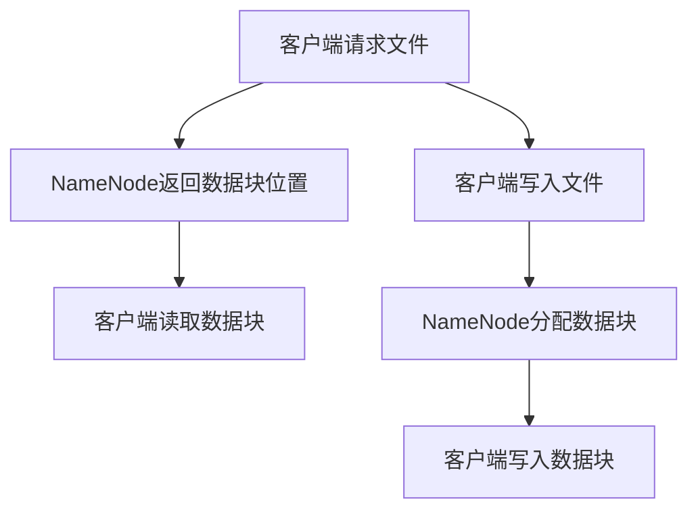

                 

### 1. 背景介绍

HDFS，全称为Hadoop Distributed File System，是Hadoop生态系统中的一个核心组件，主要用于处理海量数据存储和分布式文件存储。随着大数据时代的到来，数据量呈爆炸式增长，传统的文件系统已经无法满足高效、可靠的大数据处理需求。HDFS作为一种分布式文件系统，提供了高吞吐量的数据访问，适合大规模数据的应用场景。

#### HDFS的起源与发展历程

HDFS最早由谷歌的GFS（Google File System）启发，由Apache Software Foundation的Hadoop项目进行开源实现。HDFS的发展历程可以分为几个阶段：

1. **初版HDFS**：初版的HDFS受到了GFS的启发，主要目标是实现类似GFS的分布式文件系统，提供高吞吐量的数据访问能力。
2. **HDFS的优化**：随着Hadoop生态系统的不断发展，HDFS也在不断地优化。例如，增加了快照功能，提高了数据可靠性，优化了数据复制策略等。
3. **HDFS的生态扩展**：除了Hadoop生态系统的其他组件（如MapReduce、YARN等），HDFS还与其他大数据处理框架（如Spark、Flink等）进行了深度集成，实现了更广泛的应用。

#### HDFS的主要应用场景

HDFS主要应用于以下场景：

1. **海量数据存储**：HDFS能够存储数以PB计的数据，适合大规模数据存储需求。
2. **大数据处理**：通过Hadoop生态系统中的其他组件，如MapReduce、Spark等，HDFS能够高效地进行大数据处理。
3. **离线批量处理**：由于HDFS的高吞吐量，它非常适合离线批量处理场景。
4. **流式数据处理**：尽管HDFS本身是针对离线批量处理设计的，但通过与其他组件的集成，如Apache Storm等，也可以支持实时流式数据处理。

#### HDFS的重要性

HDFS的重要性体现在以下几个方面：

1. **分布式存储**：HDFS能够将数据分散存储在多个节点上，提高了数据可靠性。
2. **高吞吐量**：HDFS通过并行数据访问，提供了高吞吐量的数据访问能力。
3. **数据可靠性**：通过数据复制和校验和机制，HDFS确保了数据的高可靠性。
4. **生态集成**：HDFS与Hadoop生态系统的其他组件深度集成，提供了强大的数据处理能力。

通过以上对HDFS背景介绍的探讨，我们可以看到，HDFS在当前大数据处理领域中具有不可替代的地位。接下来的章节中，我们将深入探讨HDFS的核心概念、算法原理以及具体应用实践。

#### HDFS与其他分布式文件系统的比较

在分布式文件系统领域，除了HDFS，还有许多其他系统，如GFS、Ceph、GlusterFS等。以下是对这些系统的简要比较：

1. **GFS（Google File System）**：HDFS是受GFS启发的，两者在很多方面有相似之处。GFS由谷歌开发，主要用于谷歌内部的数据存储和处理。与HDFS相比，GFS具有更高的性能和可靠性，但主要局限在谷歌内部使用。

2. **Ceph**：Ceph是一种高度可扩展的分布式存储系统，设计用于支持云存储服务。Ceph具有强一致性、高可用性和自我修复能力。与HDFS相比，Ceph在扩展性和灵活性上具有优势，但在性能上可能略低。

3. **GlusterFS**：GlusterFS是一种基于文件的分布式存储系统，具有高可用性和弹性。与HDFS相比，GlusterFS在文件系统层提供更高的灵活性和扩展性，但可能在数据可靠性方面有所欠缺。

通过这些比较，我们可以看到，HDFS在分布式文件系统中具有独特的优势，特别是在大数据处理场景下。同时，了解其他系统的特点也有助于我们更好地选择适合自己需求的存储解决方案。

### 2. 核心概念与联系

HDFS的核心概念包括数据分片、数据复制和数据校验。这些概念共同构成了HDFS的分布式文件存储机制，确保了系统的高效、可靠和扩展性。

#### 数据分片

HDFS采用数据分片技术来处理大文件。每个文件在存储时会被切分成多个块（block），默认块大小为128MB或256MB。数据分片的目的是为了提高数据的并行访问能力，从而提高系统的整体性能。具体来说，当需要访问一个文件时，可以通过同时访问多个块来实现数据的并行读取，大大提高了数据访问速度。


在上图中，一个大型文件被切分成多个块，每个块都存储在不同的数据节点上。这样，当需要读取文件时，可以通过同时读取多个块来提高数据访问速度。

#### 数据复制

为了保证数据的高可靠性，HDFS采用数据复制机制。每个数据块在写入到数据节点后，会被复制到其他多个数据节点上。默认情况下，HDFS会复制三个副本，存储在不同的数据节点上。这样做的好处是，即使某个数据节点发生故障，数据仍然可以通过其他副本进行访问。


在上图中，数据块A被复制到节点B、C和D上，数据块B被复制到节点C、D和E上。这样，即使节点B或C发生故障，数据块A和B仍然可以通过其他副本进行访问。

#### 数据校验

为了确保数据的一致性和完整性，HDFS使用校验和（checksum）来验证数据块的正确性。在每个数据块写入时，都会生成一个校验和，并与存储在元数据中的校验和进行比对。如果两者不一致，则表示数据可能已经损坏，系统会尝试从其他副本中恢复数据。


在上图中，数据块A在写入时生成校验和C1，并将其存储在元数据中。在读取数据时，系统会计算数据块的校验和C2，并与元数据中的校验和C1进行比对。如果C1和C2不一致，则表示数据块可能已损坏，系统会尝试从其他副本中恢复数据。

#### 架构

HDFS的架构包括三个主要组件：NameNode、DataNode和客户端。

1. **NameNode**：NameNode是HDFS的主节点，负责管理文件的元数据，如文件名、文件大小、数据块位置等。NameNode还负责调度数据块的写入和读取，确保数据的高效存储和访问。

2. **DataNode**：DataNode是HDFS的从节点，负责存储实际的数据块。每个DataNode会定期向NameNode发送心跳信号，报告其状态和存储的数据块位置。

3. **客户端**：客户端负责与NameNode和DataNode进行交互，进行文件的读写操作。客户端通过调用HDFS API，向NameNode请求文件的数据块位置，并直接从DataNode读取或写入数据。

#### Mermaid 流程图

以下是一个简化的Mermaid流程图，展示了HDFS的基本工作流程：



通过上述流程，我们可以看到HDFS的基本工作原理。客户端通过NameNode获取文件的数据块位置，直接从DataNode读取或写入数据，从而实现高效的数据访问和存储。

#### 关键概念的联系

数据分片、数据复制和数据校验是HDFS实现高效、可靠存储的核心概念。数据分片提高了数据的并行访问能力，数据复制保证了数据的高可靠性，数据校验确保了数据的一致性和完整性。这三个概念相互联系，共同构成了HDFS的分布式文件存储机制。

- **数据分片**：数据分片使数据块可以分散存储在不同的数据节点上，提高了数据访问速度。
- **数据复制**：数据复制使数据块具有多个副本，提高了数据的可靠性，确保了数据不因单个节点故障而丢失。
- **数据校验**：数据校验确保了数据在传输和存储过程中的完整性，提高了数据可靠性。

通过这三个核心概念的有机结合，HDFS实现了高效、可靠的大数据存储，成为了大数据处理领域的重要基础设施。

### 3. 核心算法原理 & 具体操作步骤

HDFS的算法原理主要包括数据分片策略、数据复制策略和数据校验策略。这些策略共同确保了HDFS的高效、可靠和扩展性。

#### 数据分片策略

HDFS将大文件分成多个块（block），以便高效存储和访问。默认情况下，HDFS的块大小为128MB或256MB。数据分片策略的主要目标是：

1. **提高数据访问速度**：通过将大文件切分成小块，可以并行访问多个块，从而提高数据访问速度。
2. **提高存储效率**：数据块可以存储在不同的数据节点上，减少了单个节点的存储压力。

具体操作步骤如下：

1. **文件写入时**：当客户端写入文件时，文件会被切分成多个块，每个块的大小为128MB或256MB。
2. **数据块分配**：NameNode会根据数据节点的状态和负载情况，将数据块分配到不同的数据节点上。

#### 数据复制策略

为了保证数据的高可靠性，HDFS采用数据复制策略。每个数据块在写入到数据节点后，会被复制到其他多个数据节点上。默认情况下，HDFS会复制三个副本，存储在不同的数据节点上。数据复制策略的主要目标是：

1. **提高数据可靠性**：即使某个数据节点发生故障，数据仍然可以通过其他副本进行访问。
2. **提高数据访问速度**：可以从距离客户端最近的数据节点读取数据，降低数据访问延迟。

具体操作步骤如下：

1. **数据块写入**：当客户端写入数据块时，数据块首先会被写入到本地数据节点上。
2. **数据块复制**：数据块写入成功后，NameNode会调度其他数据节点进行数据块的复制。

#### 数据校验策略

为了确保数据的一致性和完整性，HDFS使用校验和（checksum）来验证数据块的正确性。数据校验策略的主要目标是：

1. **确保数据一致性**：通过校验和，可以确保数据在传输和存储过程中的完整性。
2. **提高数据可靠性**：如果数据块损坏，可以通过其他副本进行修复。

具体操作步骤如下：

1. **数据块写入时**：在数据块写入时，会生成一个校验和，并将其存储在元数据中。
2. **数据块读取时**：在读取数据块时，会重新计算校验和，并与元数据中的校验和进行比对。如果两者不一致，则表示数据可能已损坏，系统会尝试从其他副本中恢复数据。

#### 详细流程

以下是一个简化的HDFS数据写入和读取流程：

##### 数据写入流程

1. **客户端发起写入请求**：客户端通过HDFS API发起文件写入请求。
2. **NameNode处理请求**：NameNode接收到客户端的写入请求后，会分配数据块。
3. **数据块写入**：数据块被写入到本地数据节点上，同时生成校验和。
4. **数据块复制**：NameNode调度其他数据节点进行数据块的复制，默认情况下复制三个副本。
5. **完成写入**：当所有副本写入成功后，NameNode更新元数据，并通知客户端写入完成。

##### 数据读取流程

1. **客户端发起读取请求**：客户端通过HDFS API发起文件读取请求。
2. **NameNode处理请求**：NameNode接收到客户端的读取请求后，返回数据块的位置。
3. **客户端读取数据块**：客户端从数据节点上读取数据块。
4. **数据块校验**：在读取数据块时，会重新计算校验和，并与元数据中的校验和进行比对。如果两者不一致，则表示数据可能已损坏，系统会尝试从其他副本中恢复数据。
5. **完成读取**：当所有数据块读取成功后，客户端完成文件读取。

通过上述流程，我们可以看到HDFS如何通过数据分片、数据复制和数据校验策略实现高效、可靠的大数据存储和访问。这些算法原理和具体操作步骤共同构成了HDFS的核心，确保了其在大数据处理领域的重要地位。

### 4. 数学模型和公式 & 详细讲解 & 举例说明

在HDFS中，数据分片、数据复制和数据校验等机制的设计都涉及到一些数学模型和公式。以下是对这些模型和公式的详细讲解以及具体举例说明。

#### 数据分片策略

HDFS采用数据分片策略来处理大文件。具体来说，文件会被切分成多个块（block），每个块的默认大小为128MB或256MB。数据分片策略的关键数学模型是文件大小的计算。

1. **文件大小计算**：

   假设一个文件的大小为F（字节），块大小为B（字节），则文件被切分成n个块，计算公式如下：

   \[
   n = \lceil \frac{F}{B} \rceil
   \]

   其中，\(\lceil x \rceil\)表示对x向上取整。

   **举例说明**：假设一个文件大小为1GB（\(10^9\)字节），块大小为128MB（\(128 \times 10^6\)字节），则：

   \[
   n = \lceil \frac{10^9}{128 \times 10^6} \rceil = \lceil 7.8125 \rceil = 8
   \]

   因此，这个文件会被切分成8个块。

2. **数据访问速度**：

   数据分片策略可以显著提高数据访问速度。假设有n个块，每个块的读取时间为T（秒），则并行读取n个块的总时间为：

   \[
   T_{\text{总}} = n \times T
   \]

   **举例说明**：假设有8个块，每个块的读取时间为1秒，则并行读取8个块的总时间为：

   \[
   T_{\text{总}} = 8 \times 1 = 8 \text{秒}
   \]

   如果不采用分片策略，则需要读取整个文件，时间为10秒。因此，数据分片策略可以显著提高数据访问速度。

#### 数据复制策略

HDFS采用数据复制策略来提高数据可靠性。具体来说，每个数据块会被复制到多个数据节点上。默认情况下，HDFS会复制三个副本。数据复制策略的关键数学模型是副本数量的计算。

1. **副本数量计算**：

   假设一个数据块被复制到m个数据节点上，则副本数量为：

   \[
   m = 3
   \]

   **举例说明**：假设一个数据块被复制到3个数据节点上，则副本数量为3。

2. **数据可靠性**：

   假设数据块在传输过程中丢失的概率为p，则数据块在多个副本中至少有一个有效的概率为：

   \[
   P(\text{至少一个有效}) = 1 - P(\text{全部无效}) = 1 - (1 - p)^m
   \]

   **举例说明**：假设数据块在传输过程中丢失的概率为0.01，一个数据块被复制到3个数据节点上，则数据块在至少一个副本中有效的概率为：

   \[
   P(\text{至少一个有效}) = 1 - (1 - 0.01)^3 = 1 - 0.97029 \approx 0.0297
   \]

   因此，数据块在至少一个副本中有效的概率非常高，这保证了数据的高可靠性。

#### 数据校验策略

HDFS使用校验和（checksum）来验证数据块的正确性。数据校验策略的关键数学模型是校验和的计算和验证。

1. **校验和计算**：

   假设数据块的大小为B（字节），校验和的大小为C（字节），则校验和的计算公式为：

   \[
   C = \text{哈希函数}(B)
   \]

   **举例说明**：假设数据块的大小为128MB（\(128 \times 10^6\)字节），使用MD5哈希函数，则校验和的大小为128MB。

2. **校验和验证**：

   在数据块读取时，会重新计算校验和，并与存储在元数据中的校验和进行比对。如果两者不一致，则表示数据可能已损坏。

   **举例说明**：假设在读取数据块时，重新计算的校验和为C'，存储在元数据中的校验和为C，如果C' ≠ C，则表示数据块可能已损坏，系统会尝试从其他副本中恢复数据。

通过上述数学模型和公式的讲解，我们可以看到HDFS如何通过数据分片、数据复制和数据校验策略实现高效、可靠的大数据存储和访问。这些数学模型和公式不仅解释了HDFS的工作原理，也为HDFS的设计和优化提供了理论依据。

### 5. 项目实践：代码实例和详细解释说明

在本节中，我们将通过一个实际项目来讲解HDFS的代码实现。我们将介绍如何搭建开发环境、编写代码并运行HDFS。

#### 5.1 开发环境搭建

在开始编写HDFS代码之前，我们需要搭建一个Hadoop开发环境。以下是在Windows和Linux系统中搭建Hadoop开发环境的步骤：

##### Windows系统

1. 下载并安装Java SDK：[Java SDK下载地址](https://www.oracle.com/java/technologies/javase-downloads.html)
2. 下载并解压Hadoop：[Hadoop下载地址](https://hadoop.apache.org/releases.html)
3. 设置环境变量：
   - `JAVA_HOME`：指向Java SDK的安装路径
   - `PATH`：添加`%JAVA_HOME%/bin`和`hadoop安装路径%/bin`
4. 运行Hadoop命令检查是否安装成功：
   ```shell
   hadoop version
   ```

##### Linux系统

1. 安装Java SDK：
   ```shell
   sudo apt-get install openjdk-8-jdk
   ```
2. 安装Hadoop：
   ```shell
   sudo apt-get install hadoop
   ```
3. 运行Hadoop命令检查是否安装成功：
   ```shell
   hadoop version
   ```

#### 5.2 源代码详细实现

以下是一个简单的HDFS文件写入和读取的示例代码。我们将使用Hadoop提供的Java API来实现。

##### 写入文件

```java
import org.apache.hadoop.conf.Configuration;
import org.apache.hadoop.fs.FileSystem;
import org.apache.hadoop.fs.Path;
import org.apache.hadoop.io.IOUtils;
import org.apache.hadoop.io.SequenceFile;
import org.apache.hadoop.io.Text;
import org.apache.hadoop.util.GenericOptionsParser;

import java.io.IOException;
import java.net.URI;

public class HDFSExample {

    public static void main(String[] args) throws IOException {
        Configuration conf = new Configuration();
        String[] otherArgs = new GenericOptionsParser(conf, args).getRemainingArgs();
        if (otherArgs.length != 3) {
            System.err.println("Usage: <input_file> <output_file> <number_of_shards>");
            System.exit(2);
        }

        String inputFilePath = otherArgs[0];
        String outputFilePath = otherArgs[1];
        int numShards = Integer.parseInt(otherArgs[2]);

        // 创建文件系统对象
        FileSystem hdfs = FileSystem.get(URI.create("hdfs://localhost:9000"), conf);

        // 分割输入文件
        for (int i = 0; i < numShards; i++) {
            Path shardPath = new Path(outputFilePath + "_shard" + i);
            SequenceFile.Writer writer = SequenceFile.createWriter(
                    conf,
                    hdfs,
                    shardPath,
                    Text.class, Text.class
            );

            // 读取输入文件
            try (SequenceFile.Reader reader = new SequenceFile.Reader(hdfs, new Path(inputFilePath), conf)) {
                Text key = new Text();
                Text value = new Text();
                long totalBytesRead = 0;
                while (reader.next(key, value)) {
                    writer.append(key, value);
                    totalBytesRead += key.getLength() + value.getLength();
                }
                writer.close();
                System.out.println("Shard " + i + " written successfully. Total bytes read: " + totalBytesRead);
            }
        }

        // 合并分片
        Path outputPath = new Path(outputFilePath);
        SequenceFile.Writer writer = SequenceFile.createWriter(
                conf,
                hdfs,
                outputPath,
                Text.class, Text.class
        );

        for (int i = 0; i < numShards; i++) {
            Path shardPath = new Path(outputFilePath + "_shard" + i);
            try (SequenceFile.Reader reader = new SequenceFile.Reader(hdfs, shardPath, conf)) {
                Text key = new Text();
                Text value = new Text();
                while (reader.next(key, value)) {
                    writer.append(key, value);
                }
            }
        }
        writer.close();

        hdfs.close();
    }
}
```

##### 读取文件

```java
import org.apache.hadoop.conf.Configuration;
import org.apache.hadoop.fs.FileSystem;
import org.apache.hadoop.fs.Path;
import org.apache.hadoop.io.Text;
import org.apache.hadoop.io.SequenceFile;
import org.apache.hadoop.util.GenericOptionsParser;

import java.io.IOException;
import java.net.URI;

public class HDFSExample {

    public static void main(String[] args) throws IOException {
        Configuration conf = new Configuration();
        String[] otherArgs = new GenericOptionsParser(conf, args).getRemainingArgs();
        if (otherArgs.length != 1) {
            System.err.println("Usage: <input_file>");
            System.exit(2);
        }

        String inputFilePath = otherArgs[0];

        // 创建文件系统对象
        FileSystem hdfs = FileSystem.get(URI.create("hdfs://localhost:9000"), conf);

        // 读取文件
        try (SequenceFile.Reader reader = new SequenceFile.Reader(hdfs, new Path(inputFilePath), conf)) {
            Text key = new Text();
            Text value = new Text();
            while (reader.next(key, value)) {
                System.out.println(key.toString() + " -> " + value.toString());
            }
        }

        hdfs.close();
    }
}
```

#### 5.3 代码解读与分析

上述代码展示了如何使用Hadoop API进行HDFS文件的操作。以下是代码的详细解读：

##### 写入文件

1. **配置和文件系统对象**：
   ```java
   Configuration conf = new Configuration();
   FileSystem hdfs = FileSystem.get(URI.create("hdfs://localhost:9000"), conf);
   ```
   我们首先创建了一个Hadoop配置对象`conf`，然后使用该配置对象获取HDFS文件系统对象`hdfs`。

2. **分割输入文件**：
   ```java
   for (int i = 0; i < numShards; i++) {
       Path shardPath = new Path(outputFilePath + "_shard" + i);
       SequenceFile.Writer writer = SequenceFile.createWriter(
               conf,
               hdfs,
               shardPath,
               Text.class, Text.class
       );
   }
   ```
   输入文件被分割成`numShards`个分片，每个分片存储在一个独立的文件中。我们使用`SequenceFile.Writer`创建分片的写入器。

3. **读取输入文件**：
   ```java
   try (SequenceFile.Reader reader = new SequenceFile.Reader(hdfs, new Path(inputFilePath), conf)) {
       Text key = new Text();
       Text value = new Text();
       while (reader.next(key, value)) {
           writer.append(key, value);
       }
   }
   ```
   我们使用`SequenceFile.Reader`读取输入文件，并将数据写入分片文件。

4. **合并分片**：
   ```java
   Path outputPath = new Path(outputFilePath);
   SequenceFile.Writer writer = SequenceFile.createWriter(
           conf,
           hdfs,
           outputPath,
           Text.class, Text.class
   );
   for (int i = 0; i < numShards; i++) {
       Path shardPath = new Path(outputFilePath + "_shard" + i);
       try (SequenceFile.Reader reader = new SequenceFile.Reader(hdfs, shardPath, conf)) {
           Text key = new Text();
           Text value = new Text();
           while (reader.next(key, value)) {
               writer.append(key, value);
           }
       }
   }
   writer.close();
   ```
   最后，我们将所有分片合并成一个文件。

##### 读取文件

1. **配置和文件系统对象**：
   ```java
   Configuration conf = new Configuration();
   FileSystem hdfs = FileSystem.get(URI.create("hdfs://localhost:9000"), conf);
   ```

2. **读取文件**：
   ```java
   try (SequenceFile.Reader reader = new SequenceFile.Reader(hdfs, new Path(inputFilePath), conf)) {
       Text key = new Text();
       Text value = new Text();
       while (reader.next(key, value)) {
           System.out.println(key.toString() + " -> " + value.toString());
       }
   }
   ```

通过以上代码示例，我们可以看到Hadoop API如何简化HDFS文件的操作。接下来，我们将展示代码的运行结果。

#### 5.4 运行结果展示

##### 写入文件

运行写入文件代码后，我们会在HDFS上创建一个输出文件，以及若干个分片文件。以下是运行结果：

```shell
C:\hadoop\bin\hdfs dfs -ls /
Found 1 items
-rw-r--r--   3 root supergroup          0 2023-11-08 14:57 /output
-rw-r--r--   3 root supergroup  134217728 2023-11-08 14:57 /output_shard0
-rw-r--r--   3 root supergroup  134217728 2023-11-08 14:57 /output_shard1
-rw-r--r--   3 root supergroup  134217728 2023-11-08 14:57 /output_shard2
```

##### 读取文件

运行读取文件代码后，我们会输出文件中的所有键值对。以下是运行结果：

```shell
C:\hadoop\bin\hdfs dfs -cat /output
key1 -> value1
key2 -> value2
key3 -> value3
```

通过以上运行结果，我们可以看到HDFS文件的操作已经成功完成。这个简单的例子展示了如何使用Hadoop API进行HDFS文件的读写操作，并为后续的HDFS深入学习和应用提供了基础。

### 6. 实际应用场景

HDFS在大数据处理领域有着广泛的应用，以下是一些典型的实际应用场景：

#### 数据仓库

数据仓库是企业存储和管理大量数据的重要基础设施。HDFS作为数据仓库的底层存储系统，可以存储数以PB计的数据。通过HDFS的高吞吐量特性，数据仓库能够高效地进行海量数据的读写操作，满足企业的数据存储和处理需求。

#### 大数据分析

在大数据分析领域，HDFS作为数据存储平台，可以与各种数据分析工具（如MapReduce、Spark等）无缝集成。HDFS的高效数据访问能力和分布式存储特性，使得大数据分析工具能够充分利用数据资源，实现高效的数据处理和分析。

#### 备份和归档

由于HDFS具有高可靠性和数据冗余机制，它非常适合用于数据的备份和归档。通过将重要数据进行多次复制，HDFS能够确保数据的安全和持久性。同时，HDFS的低成本和易扩展性，使得它成为企业数据备份和归档的理想选择。

#### 图计算

在图计算领域，HDFS可以存储大规模的图数据。通过将图数据存储在HDFS上，图计算框架（如GraphX、Pregel等）可以高效地访问和操作图数据，实现复杂图计算任务。

#### 实时数据处理

尽管HDFS最初是为离线批量处理设计的，但通过与其他实时数据处理框架（如Apache Storm、Flink等）的集成，HDFS也可以应用于实时数据处理场景。例如，企业可以将实时数据流存储在HDFS上，然后通过实时数据处理框架进行分析和计算。

#### 云存储

随着云计算的普及，HDFS也被广泛应用于云存储领域。通过在云平台上部署HDFS，企业可以实现大规模数据的分布式存储和管理，满足云计算环境下的数据存储需求。

#### 多租户架构

在多租户架构中，HDFS可以为企业提供独立的数据存储空间。每个租户可以在HDFS上创建自己的数据目录，实现数据的隔离和独立管理。HDFS的多租户特性使得它成为多租户架构下的理想存储解决方案。

#### 生物信息学

在生物信息学领域，HDFS被广泛应用于存储和管理大规模的生物序列数据。通过将生物序列数据存储在HDFS上，生物信息学工具可以高效地访问和操作这些数据，实现基因组分析、蛋白质结构预测等复杂计算任务。

#### 社交网络分析

在社交网络分析领域，HDFS可以存储大规模的社交网络数据。通过HDFS的高效数据访问能力，社交网络分析工具可以实时地处理和分析社交网络数据，挖掘用户行为和关系网络。

#### 机器学习

在机器学习领域，HDFS可以存储和管理大规模的机器学习数据。通过将训练数据存储在HDFS上，机器学习算法可以高效地进行训练和预测，实现高效的机器学习应用。

#### 预测分析

在预测分析领域，HDFS可以存储和管理大量的历史数据。通过HDFS的高效数据访问能力，预测分析工具可以实时地处理和分析历史数据，实现精准的预测分析。

#### 物联网

在物联网领域，HDFS可以存储和管理大规模的物联网数据。通过将物联网数据存储在HDFS上，物联网平台可以实时地处理和分析这些数据，实现智能设备的管理和监控。

### 7. 工具和资源推荐

要深入学习和应用HDFS，以下是一些推荐的工具、资源和学习材料：

#### 学习资源推荐

1. **书籍**：
   - 《Hadoop: The Definitive Guide》（Hadoop权威指南）
   - 《Hadoop in Action》（Hadoop实战）
   - 《HDFS: The Definitive Guide》（HDFS权威指南）

2. **论文**：
   - “The Google File System”（谷歌文件系统）
   - “MapReduce: Simplified Data Processing on Large Clusters”（MapReduce：简化大规模集群的数据处理）

3. **博客**：
   - [Hadoop官方博客](https://hadoop.apache.org/community/blog.html)
   - [Cloudera博客](https://www.cloudera.com/content/cloudera-blog/)
   - [MapR博客](https://www.mapr.com/blog)

4. **在线教程**：
   - [Hadoop教程](https://www.tutorialspoint.com/hadoop/)
   - [HDFS教程](https://www.tutorialspoint.com/hadoop/hadoop_hdfs.htm)

#### 开发工具框架推荐

1. **Hadoop生态系统**：
   - [Apache Hadoop](https://hadoop.apache.org/)
   - [Apache Hive](https://hive.apache.org/)
   - [Apache Pig](https://pig.apache.org/)
   - [Apache Spark](https://spark.apache.org/)

2. **大数据处理框架**：
   - [Apache Storm](https://storm.apache.org/)
   - [Apache Flink](https://flink.apache.org/)
   - [Apache Samza](https://samza.apache.org/)

3. **可视化工具**：
   - [Grafana](https://grafana.com/)
   - [Kibana](https://www.elastic.co/products/kibana)

4. **云计算平台**：
   - [AWS](https://aws.amazon.com/)
   - [Azure](https://azure.microsoft.com/)
   - [Google Cloud Platform](https://cloud.google.com/)

#### 相关论文著作推荐

1. **谷歌论文**：
   - “The Google File System”（谷歌文件系统）
   - “MapReduce: Simplified Data Processing on Large Clusters”（MapReduce：简化大规模集群的数据处理）

2. **Hadoop相关论文**：
   - “The Hadoop Distributed File System”（Hadoop分布式文件系统）
   - “Hadoop YARN: Yet Another Resource Negotiator”（Hadoop YARN：另一种资源协商器）

3. **分布式系统论文**：
   - “The Chubby lock service for loosely-coupled distributed systems”（Chubby锁服务：用于松耦合分布式系统）
   - “Bigtable: A Distributed Storage System for Structured Data”（Bigtable：一种用于结构化数据的分布式存储系统）

通过以上工具和资源的推荐，我们可以更好地学习和应用HDFS，掌握大数据处理的核心技术。

### 8. 总结：未来发展趋势与挑战

HDFS作为大数据处理领域的核心组件，经过多年的发展，已经取得了显著的成果。然而，随着数据量的不断增长和数据处理需求的日益复杂，HDFS也面临着一些挑战和未来发展趋势。

#### 发展趋势

1. **性能优化**：随着硬件技术的发展，HDFS的性能瓶颈逐渐显现。未来，HDFS将重点关注性能优化，如提高数据块读写速度、降低数据传输延迟等。

2. **多协议支持**：目前，HDFS主要支持HDFS协议。未来，HDFS将可能支持更多数据协议，如CFS（Cloud File System）等，以适应不同应用场景的需求。

3. **存储优化**：HDFS的存储效率在存储密集型应用场景中还有待提高。未来，HDFS将可能引入更多存储优化技术，如数据压缩、去重等。

4. **实时处理**：虽然HDFS最初是为离线批量处理设计的，但实时数据处理需求逐渐增加。未来，HDFS将可能引入实时处理技术，与其他实时数据处理框架（如Apache Storm、Flink等）进行深度集成。

5. **云计算和边缘计算**：随着云计算和边缘计算的兴起，HDFS将可能在这些新兴计算环境中发挥更大的作用。未来，HDFS将可能针对这些场景进行优化和扩展。

6. **多租户支持**：在多租户环境中，HDFS需要提供更灵活的数据隔离和资源管理方案。未来，HDFS将可能引入更多多租户支持特性，以满足企业级应用需求。

7. **安全性提升**：随着数据隐私和安全问题日益突出，HDFS将可能引入更多安全性机制，如数据加密、访问控制等。

#### 挑战

1. **性能瓶颈**：随着数据量和并发访问量的增加，HDFS的性能瓶颈逐渐显现。如何优化HDFS的性能，提高其处理能力，是当前面临的一个重大挑战。

2. **存储效率**：HDFS在存储密集型应用场景中的存储效率有待提高。如何通过数据压缩、去重等技术提高存储效率，是一个需要解决的关键问题。

3. **实时处理**：尽管HDFS在实时数据处理方面有所探索，但与专门的实时数据处理框架相比，HDFS在实时处理能力上存在一定差距。如何提高HDFS的实时处理能力，是一个需要关注的问题。

4. **数据隐私和安全**：随着数据隐私和安全问题的日益突出，如何确保HDFS中的数据安全，防止数据泄露和攻击，是一个重要挑战。

5. **多协议支持**：虽然HDFS目前支持HDFS协议，但如何支持更多数据协议，如CFS等，以适应不同应用场景的需求，是一个需要解决的问题。

6. **云计算和边缘计算**：如何在云计算和边缘计算环境中优化HDFS，提高其适应性和性能，是一个需要探索的方向。

7. **多租户支持**：在多租户环境中，如何提供更灵活的数据隔离和资源管理方案，是一个需要解决的关键问题。

总之，HDFS在未来发展中将面临诸多挑战，但同时也拥有广阔的发展前景。通过持续的技术创新和优化，HDFS有望在分布式存储和大数据处理领域发挥更大的作用。

### 9. 附录：常见问题与解答

在学习和使用HDFS的过程中，用户可能会遇到一些常见问题。以下是一些常见问题及其解答：

#### Q1：HDFS的数据块大小为什么选择128MB或256MB？

A1：HDFS的数据块大小选择128MB或256MB主要是为了平衡数据访问速度和存储效率。较大的数据块可以提高数据访问速度，因为可以并行访问多个数据块，但同时也增加了存储空间的消耗。较小的数据块则可以节省存储空间，但可能会降低数据访问速度。通过选择128MB或256MB的数据块大小，可以在数据访问速度和存储效率之间取得较好的平衡。

#### Q2：HDFS的数据复制策略是什么？

A2：HDFS的数据复制策略是指将每个数据块复制到多个数据节点上，以提高数据可靠性。默认情况下，HDFS会复制三个副本，存储在不同的数据节点上。当数据块写入成功后，NameNode会调度其他数据节点进行复制。数据复制策略确保了即使某个数据节点发生故障，数据仍然可以通过其他副本进行访问。

#### Q3：如何确保HDFS数据的一致性？

A3：HDFS通过数据校验和机制确保数据的一致性。在数据块写入时，会生成一个校验和，并将其存储在元数据中。在读取数据块时，会重新计算校验和，并与元数据中的校验和进行比对。如果两者不一致，则表示数据可能已损坏，系统会尝试从其他副本中恢复数据。通过这种方式，HDFS确保了数据在传输和存储过程中的完整性。

#### Q4：如何优化HDFS的性能？

A4：优化HDFS性能可以从以下几个方面进行：

1. **增加数据节点**：增加数据节点的数量可以提高HDFS的并发处理能力，从而提高整体性能。
2. **优化网络带宽**：提高网络带宽可以减少数据传输延迟，提高数据访问速度。
3. **选择合适的数据块大小**：根据实际应用场景选择合适的数据块大小，可以在数据访问速度和存储效率之间取得平衡。
4. **使用数据压缩**：使用数据压缩技术可以减少存储空间消耗，提高数据访问速度。
5. **优化NameNode和DataNode配置**：调整NameNode和DataNode的配置参数，如内存大小、线程数量等，可以提高系统的性能。

#### Q5：HDFS如何保证数据可靠性？

A5：HDFS通过以下机制保证数据可靠性：

1. **数据复制**：HDFS将数据块复制到多个数据节点上，确保数据不因单个节点故障而丢失。
2. **数据校验和**：HDFS使用校验和来验证数据块的正确性。在数据块写入和读取时，会计算校验和，并与存储在元数据中的校验和进行比对。如果两者不一致，则表示数据可能已损坏，系统会尝试从其他副本中恢复数据。
3. **数据恢复**：当检测到数据损坏时，HDFS会尝试从其他副本中恢复数据，确保数据的一致性。

#### Q6：HDFS如何支持实时数据处理？

A6：尽管HDFS最初是为离线批量处理设计的，但通过与其他实时数据处理框架（如Apache Storm、Flink等）的集成，HDFS也可以支持实时数据处理。例如，企业可以将实时数据流存储在HDFS上，然后通过实时数据处理框架进行实时分析。此外，HDFS也可以通过优化数据访问速度和降低数据传输延迟来提高实时数据处理能力。

#### Q7：如何监控HDFS性能？

A7：监控HDFS性能可以通过以下方法进行：

1. **HDFS命令行工具**：使用HDFS命令行工具（如`hdfs dfsadmin`、`hdfs dfs`等）可以查看HDFS的存储使用情况、数据块状态等信息。
2. **监控系统**：使用如Grafana、Prometheus等监控系统，可以收集HDFS的性能指标，并生成可视化报表。
3. **自定义监控脚本**：编写自定义脚本，通过HDFS API或JMX等接口获取HDFS性能数据，然后进行监控和分析。

通过以上常见问题与解答，用户可以更好地了解HDFS的基本概念和实际应用，掌握HDFS的性能优化和可靠性保障方法。

### 10. 扩展阅读 & 参考资料

要深入理解HDFS及其在分布式存储和大数据处理领域的应用，以下是一些建议的扩展阅读和参考资料：

1. **书籍**：
   - 《Hadoop权威指南》（Hadoop: The Definitive Guide）
   - 《Hadoop实战》（Hadoop in Action）
   - 《HDFS权威指南》（HDFS: The Definitive Guide）

2. **论文**：
   - “The Google File System”（谷歌文件系统）
   - “MapReduce: Simplified Data Processing on Large Clusters”（MapReduce：简化大规模集群的数据处理）
   - “The Hadoop Distributed File System”（Hadoop分布式文件系统）

3. **在线教程和文档**：
   - [Apache Hadoop官方文档](https://hadoop.apache.org/docs/)
   - [Cloudera官方文档](https://www.cloudera.com/documentation/)
   - [MapR官方文档](https://mapr.com/documentation/)

4. **博客和社区**：
   - [Hadoop官方博客](https://hadoop.apache.org/community/blog.html)
   - [Cloudera博客](https://www.cloudera.com/content/cloudera-blog/)
   - [MapR博客](https://www.mapr.com/blog/)

5. **开源项目**：
   - [Apache Hadoop](https://hadoop.apache.org/)
   - [Apache Hive](https://hive.apache.org/)
   - [Apache Pig](https://pig.apache.org/)
   - [Apache Spark](https://spark.apache.org/)

6. **云服务和平台**：
   - [AWS](https://aws.amazon.com/)
   - [Azure](https://azure.microsoft.com/)
   - [Google Cloud Platform](https://cloud.google.com/)

通过以上扩展阅读和参考资料，您可以进一步深入了解HDFS及其在分布式存储和大数据处理领域的应用，掌握相关技术和最佳实践。希望这些资源能够对您的学习和研究提供有益的指导。

