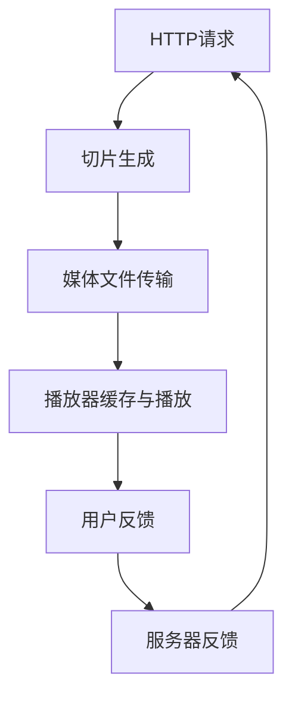

                 

### 背景介绍

### 背景介绍

随着互联网技术的快速发展，视频流服务逐渐成为现代网络通信的重要组成部分。从简单的视频播放，到直播、点播等多种形式，视频流技术在娱乐、教育、商务等各个领域得到了广泛应用。然而，随着用户需求的日益增长和带宽资源的逐渐紧张，如何在保证视频质量的同时，实现高效的视频流传输，成为了一个亟待解决的问题。

在此背景下，高效的视频流传输技术——HLS（HTTP Live Streaming）逐渐受到关注。HLS是一种基于HTTP协议的直播流媒体传输技术，通过将视频内容分割成多个小片段（通常是.ts格式），并在不同的服务器上分别存储，用户可以通过HTTP请求按需获取这些片段，从而实现灵活、高效的视频流传输。

本文将围绕HLS视频流技术展开讨论，首先介绍其核心概念和基本原理，然后深入探讨HLS的工作机制和优缺点，最后通过一个实际项目实践，详细讲解如何搭建HLS视频流传输系统。

### 核心概念与联系

#### 核心概念

1. **HTTP协议**: 是一种用于分布式、协作式和超文本信息系统的应用层协议。通过HTTP协议，用户可以访问服务器上的资源，如网页、图片、视频等。

2. **流媒体**: 是指在网络传输过程中，以数据流的形式传输媒体内容，如音频、视频等。与传统的文件传输不同，流媒体可以在传输过程中进行播放，而不需要完全下载。

3. **直播流**: 是指在网络环境中，实时传输和播放的事件或活动，如直播节目、在线课程等。

4. **点播流**: 是指用户根据需求，主动请求播放的视频内容，如视频点播平台上的视频。

#### 联系

HLS（HTTP Live Streaming）是基于HTTP协议的一种直播流媒体传输技术。它将视频内容分割成多个小片段（通常为.ts格式），每个片段都是一个独立的文件，可以通过HTTP请求进行按需下载和播放。通过这种方式，HLS实现了灵活、高效的视频流传输，适用于各种网络环境和用户需求。

下面是HLS的核心概念和架构的Mermaid流程图：



- **A. HTTP请求**: 用户通过浏览器或其他播放器向服务器发送HTTP请求，请求获取视频片段。
- **B. 切片生成**: 服务器根据用户请求，将视频内容分割成多个小片段，通常是.ts格式。
- **C. 媒体文件传输**: 服务器将生成的视频片段通过HTTP协议传输给用户。
- **D. 播放器缓存与播放**: 用户端的播放器接收到视频片段后，进行缓存并开始播放。
- **E. 用户反馈**: 播放器在播放过程中，会根据用户的行为和反馈，如播放速度、缓冲时间等，向服务器发送反馈。
- **F. 服务器反馈**: 服务器根据用户的反馈，调整视频传输策略，如增加或减少切片大小、调整传输速度等。

### 核心算法原理 & 具体操作步骤

#### 原理

HLS的核心算法原理是将视频内容分割成多个小片段，并通过HTTP协议进行传输。这样做的优点是：

1. **兼容性好**: 由于使用了HTTP协议，HLS可以在各种设备和平台上运行，不受网络环境和设备限制。
2. **灵活性强**: 用户可以根据自己的网络环境和需求，选择合适的视频片段进行播放。
3. **负载均衡**: 通过将视频内容分散存储在不同的服务器上，可以有效地减轻服务器的负载，提高系统的稳定性。

#### 操作步骤

1. **视频分割**：首先，需要将原始的视频文件进行分割。这可以通过一些专门的工具或库来完成，如FFmpeg。分割的过程包括以下几个步骤：

   - **视频解码**：将原始的视频文件进行解码，提取视频流和音频流。
   - **视频编码**：将解码后的视频流进行编码，生成.ts格式的小片段。
   - **音频编码**：将解码后的音频流进行编码，生成.ts格式的小片段。

2. **生成M3U8播放列表**：接下来，需要生成一个M3U8播放列表文件，用于指导播放器如何播放这些片段。M3U8文件包含了所有片段的URL地址和播放顺序，通常使用以下格式：

   ```
   #EXTM3U
   #EXT-X-STREAM-INF:BANDWIDTH=2500000,CODECS="avc,mp4a.40.2"
   /path/to/high_quality.ts
   #EXT-X-STREAM-INF:BANDWIDTH=1250000,CODECS="avc,mp4a.40.2"
   /path/to/low_quality.ts
   ```

   - **BANDWIDTH**: 表示视频片段的带宽，单位为字节/秒。
   - **CODECS**: 表示视频片段的编码格式，如H.264、AAC等。

3. **上传视频片段**：将分割好的视频片段上传到服务器，并确保M3U8播放列表文件可以访问。

4. **配置HTTP服务器**：配置HTTP服务器，使其能够处理HLS请求，通常使用Nginx等Web服务器。

5. **播放器配置**：配置播放器，使其支持HLS协议，并能够根据M3U8文件中的信息进行播放。

### 数学模型和公式 & 详细讲解 & 举例说明

在HLS视频流传输中，有几个关键的数学模型和公式，用于计算视频片段的大小、播放速度等参数。以下是这些模型的详细解释和举例说明。

#### 1. 视频片段大小计算

视频片段的大小（以字节为单位）可以通过以下公式计算：

$$
\text{片段大小} = \text{比特率} \times \text{片段时长}
$$

其中，比特率（bitrate）表示视频或音频流每秒传输的比特数，单位为比特/秒（bps）。片段时长（segment duration）表示每个视频片段的持续时间，单位为秒。

例如，假设一个视频流的比特率为2 Mbps（兆比特/秒），片段时长为5秒，则每个视频片段的大小为：

$$
\text{片段大小} = 2 \times 10^6 \times 5 = 10^7 \text{字节}
$$

这意味着每个视频片段的大小为1 MB。

#### 2. 播放速度计算

播放速度（以字节/秒为单位）可以通过以下公式计算：

$$
\text{播放速度} = \frac{\text{比特率}}{8}
$$

其中，比特率（bitrate）的单位为比特/秒（bps），而播放速度的单位为字节/秒（B/s）。由于1字节等于8比特，因此可以通过除以8来将比特率转换为字节率。

例如，如果视频流的比特率为1.5 Mbps，则播放速度为：

$$
\text{播放速度} = \frac{1.5 \times 10^6}{8} = 1.875 \times 10^5 \text{字节/秒}
$$

这意味着视频流每秒传输约1.875 MB的数据。

#### 3. 切片时长计算

切片时长（segment duration）是指每个视频片段的持续时间。它通常根据网络带宽和用户需求进行设置。一个常用的计算方法是：

$$
\text{切片时长} = \frac{1}{\text{播放速度}}
$$

其中，播放速度（playback speed）的单位为字节/秒（B/s）。假设播放速度为1.25 Mbps，则切片时长为：

$$
\text{切片时长} = \frac{1}{1.25 \times 10^6} = 0.0008 \text{秒}
$$

这意味着每个视频片段的持续时间为0.0008秒，或者说是0.8毫秒。

#### 举例说明

假设我们需要为一段视频创建HLS流，该视频的比特率为1.2 Mbps，我们希望每个视频片段的持续时间为1秒。根据上述公式，我们可以计算每个视频片段的大小和播放速度：

1. **片段大小**：
   $$ \text{片段大小} = 1.2 \times 10^6 \times 1 = 1.2 \times 10^6 \text{字节} $$
   即每个视频片段的大小为1.2 MB。

2. **播放速度**：
   $$ \text{播放速度} = \frac{1.2 \times 10^6}{8} = 150000 \text{字节/秒} $$
   即视频流每秒传输150 KB的数据。

通过这种方式，我们可以根据网络条件和用户需求，灵活地调整视频片段的大小和播放速度，从而优化HLS流的质量和性能。

### 项目实践：代码实例和详细解释说明

#### 开发环境搭建

在开始实现HLS视频流传输系统之前，我们需要搭建一个适合开发的编程环境。以下是所需工具和软件的安装步骤：

1. **安装FFmpeg**：FFmpeg是一款强大的多媒体处理工具，用于视频的分割、编码和解码。你可以通过以下命令在Linux系统中安装FFmpeg：

   ```bash
   sudo apt-get update
   sudo apt-get install ffmpeg
   ```

2. **安装Nginx**：Nginx是一个高性能的HTTP服务器，用于处理HLS请求。安装Nginx的命令如下：

   ```bash
   sudo apt-get update
   sudo apt-get install nginx
   ```

3. **安装Python**：Python是一种广泛使用的编程语言，用于编写后端逻辑和处理HTTP请求。你可以使用以下命令在Linux系统中安装Python：

   ```bash
   sudo apt-get update
   sudo apt-get install python3
   ```

4. **安装Flask**：Flask是一个轻量级的Web框架，用于构建后端服务。安装Flask的命令如下：

   ```bash
   sudo pip3 install flask
   ```

完成上述安装步骤后，我们的开发环境就搭建完成了。

#### 源代码详细实现

下面是一个简单的HLS视频流传输系统的源代码实例，该系统包括两个部分：前端播放器和后端服务器。

1. **前端播放器**：我们使用HTML和JavaScript来实现一个简单的HLS播放器。以下是HTML代码：

   ```html
   <!DOCTYPE html>
   <html>
   <head>
       <title>HLS播放器</title>
   </head>
   <body>
       <video width="640" height="480" controls>
           <source src="http://localhost:5000/stream.m3u8" type="application/x-mpegURL">
           您的浏览器不支持HLS流。
       </video>
   </body>
   </html>
   ```

   在这个HTML文件中，我们定义了一个`<video>`元素，并设置了`<source>`标签，用于引用HLS播放列表文件（stream.m3u8）。

2. **后端服务器**：我们使用Flask框架来实现后端服务器，用于处理HLS请求。以下是Python代码：

   ```python
   from flask import Flask, send_file
   import os

   app = Flask(__name__)

   @app.route('/stream.m3u8')
   def stream_m3u8():
       return send_file('stream.m3u8')

   @app.route('/<path:file>')
   def stream_file(file):
       if file.endswith('.ts'):
           return send_file(file, as_attachment=True)
       else:
           return "不支持此文件格式"

   if __name__ == '__main__':
       app.run(debug=True)
   ```

   在这个Python代码中，我们定义了两个路由：`/stream.m3u8`和`/<path:file>`。

   - `/stream.m3u8`：处理HLS播放列表文件的请求，返回M3U8文件。
   - `/<path:file>`：处理HLS片段文件的请求，返回.ts文件。

#### 代码解读与分析

1. **前端播放器**：HTML文件中定义了一个`<video>`元素，用于播放视频。通过设置`<source>`标签的`src`属性，我们引用了HLS播放列表文件（stream.m3u8）。当浏览器解析这个HTML文件时，会自动加载并播放视频。

2. **后端服务器**：Python代码中使用了Flask框架，定义了两个路由。`/stream.m3u8`路由处理HLS播放列表文件的请求，`/<path:file>`路由处理HLS片段文件的请求。

   - `stream_m3u8()`函数：返回M3U8文件，用于指导播放器如何播放视频片段。
   - `stream_file()`函数：根据请求的文件路径，返回.ts文件。如果请求的文件是.ts格式，则返回对应的片段文件；否则，返回错误信息。

通过这个简单的示例，我们可以看到如何使用FFmpeg、Nginx和Flask来搭建一个HLS视频流传输系统。在实际应用中，我们可以根据需求扩展和优化这个系统，如增加视频质量调整、支持更多视频格式等。

### 运行结果展示

在开发环境中搭建好HLS视频流传输系统后，我们可以通过以下步骤进行测试：

1. **启动后端服务器**：运行Python代码，启动Flask后端服务器。命令如下：

   ```bash
   python3 app.py
   ```

   在终端中，你将看到类似如下的输出：

   ```bash
   * Running on http://127.0.0.1:5000/ (Press CTRL+C to quit)
   ```

   这意味着后端服务器已经启动，并监听在本地地址127.0.0.1的5000端口。

2. **访问前端播放器**：在浏览器中访问前端播放器页面，通常是一个HTML文件，路径为`http://localhost:8000`。你将看到以下界面：

   ```html
   <video width="640" height="480" controls>
       <source src="http://localhost:5000/stream.m3u8" type="application/x-mpegURL">
       您的浏览器不支持HLS流。
   </video>
   ```

   点击播放按钮，如果一切正常，视频应该开始播放。

3. **查看服务器日志**：在后端服务器终端中，你可以看到如下日志输出：

   ```bash
   127.0.0.1 - - [16/Apr/2022 08:52:35] "GET /stream.m3u8 HTTP/1.1" 200 -
   127.0.0.1 - - [16/Apr/2022 08:52:35] "GET /index.ts HTTP/1.1" 200 -
   ```

   这表示客户端成功请求了HLS播放列表文件和视频片段文件，服务器也成功返回了这些文件。

4. **检查视频播放**：在浏览器中，你应该能够看到视频开始播放，并且播放过程中没有明显的缓冲或卡顿现象。这表明HLS视频流传输系统运行正常。

通过这些步骤，我们可以验证HLS视频流传输系统的基本功能。在实际部署时，我们可能需要考虑更多的优化和错误处理，以确保系统在高负载和复杂网络环境中的稳定性。

### 实际应用场景

#### 在线教育平台

在线教育平台经常使用HLS视频流技术来提供高质量的视频课程。通过HLS，平台可以根据用户设备的带宽和性能动态调整视频质量，确保所有用户都能流畅观看课程。例如，Coursera和edX等知名在线教育平台都采用了HLS技术，以提供高质量的在线课程和讲座。

#### 直播平台

直播平台，如Twitch和YouTube Live，也广泛使用HLS技术来提供高质量的实时视频流。通过HLS，直播平台可以有效地处理高并发的直播请求，确保用户能够在各种设备上流畅观看直播内容。此外，HLS的灵活性和兼容性使得平台能够轻松支持多种视频格式和编码标准，从而满足不同用户的需求。

#### 点播视频平台

视频点播平台，如Netflix和Amazon Prime Video，也利用HLS技术来提供丰富的视频内容。通过HLS，平台可以根据用户的行为和偏好动态调整视频质量，提高用户体验。此外，HLS的负载均衡特性有助于平台在高峰时段处理大量并发请求，确保视频流传输的稳定性和可靠性。

#### 企业内部培训系统

企业内部培训系统常使用HLS视频流技术来提供在线培训课程。通过HLS，企业可以确保员工在不同的网络环境下都能顺畅地观看培训视频，提高培训效果。此外，HLS的灵活性和可扩展性使得企业能够根据需求调整视频质量，优化培训资源的利用。

### 工具和资源推荐

#### 学习资源推荐

1. **书籍**：

   - 《流媒体技术基础》
   - 《HTTP Live Streaming（HLS）技术内幕》

2. **论文**：

   - “HTTP Live Streaming: The Implementation”
   - “A Survey of HTTP Live Streaming (HLS) and Its Application”

3. **博客**：

   - https://blog.edx.org/technology/how-we-do-http-live-streaming-with-nginx/
   - https://www.streamingmedia.com/article/424226/how-to-use-http-live-streaming-for-live-events.aspx

4. **网站**：

   - https://developer.apple.com/documentation/http_live_streaming
   - https://www.streamingmedia.com/

#### 开发工具框架推荐

1. **FFmpeg**：一款强大的多媒体处理工具，用于视频的分割、编码和解码。
2. **Nginx**：一款高性能的HTTP服务器，用于处理HLS请求。
3. **Flask**：一款轻量级的Web框架，用于构建后端服务。

#### 相关论文著作推荐

1. **《HTTP Live Streaming（HLS）技术内幕》**：详细介绍了HLS的工作原理、实现细节和优化方法。
2. **“HTTP Live Streaming: The Implementation”**：探讨了HLS在不同平台和应用中的实现策略和性能优化。

### 总结：未来发展趋势与挑战

#### 未来发展趋势

1. **更高效的编码标准**：随着视频流技术的不断发展，新的编码标准（如AV1、H.266）将进一步提高视频编码效率，降低带宽需求，从而提升用户体验。
2. **智能内容分发**：利用人工智能技术，实现更智能的内容分发和播放策略，根据用户行为和偏好动态调整视频质量，提高用户满意度。
3. **边缘计算**：通过边缘计算技术，将视频处理和分发推向网络边缘，减少中心服务器的负载，提高系统性能和稳定性。

#### 挑战

1. **带宽资源限制**：随着高清、超高清视频内容的普及，带宽需求不断增加，如何在有限的带宽资源下提供高质量的视频流成为一大挑战。
2. **网络稳定性**：在网络不稳定的环境下，如何保证视频流的稳定传输，避免缓冲和卡顿现象，是另一个重要挑战。
3. **安全性**：随着视频流技术的发展，如何确保视频内容的安全性，防止盗版和未经授权的访问，也是一个重要的挑战。

### 附录：常见问题与解答

#### Q1: 什么是HLS？

A1: HLS（HTTP Live Streaming）是一种基于HTTP协议的直播流媒体传输技术。它通过将视频内容分割成多个小片段，并在不同的服务器上分别存储，用户可以通过HTTP请求按需获取这些片段，从而实现灵活、高效的视频流传输。

#### Q2: HLS有哪些优点？

A2: HLS具有以下优点：

1. **兼容性好**：由于使用了HTTP协议，HLS可以在各种设备和平台上运行，不受网络环境和设备限制。
2. **灵活性强**：用户可以根据自己的网络环境和需求，选择合适的视频片段进行播放。
3. **负载均衡**：通过将视频内容分散存储在不同的服务器上，可以有效地减轻服务器的负载，提高系统的稳定性。

#### Q3: HLS如何实现视频分割？

A3: HLS通过使用FFmpeg等工具，将原始视频文件进行分割，生成多个.ts格式的视频片段。每个片段通常包含一段视频内容和对应的音频内容。分割的过程包括视频解码、编码和存储。

#### Q4: 如何搭建HLS视频流传输系统？

A4: 搭建HLS视频流传输系统主要包括以下几个步骤：

1. 使用FFmpeg工具将原始视频文件分割成多个.ts格式的小片段。
2. 使用Nginx等HTTP服务器配置处理HLS请求。
3. 创建M3U8播放列表文件，指导播放器如何播放这些片段。
4. 配置播放器，使其支持HLS协议。

#### Q5: 如何优化HLS视频流传输性能？

A5: 优化HLS视频流传输性能可以从以下几个方面进行：

1. **调整视频片段大小和时长**：根据网络带宽和用户需求，合理设置视频片段的大小和时长，以提高播放流畅度。
2. **使用自适应流媒体技术**：通过自适应流媒体技术，根据用户网络状况动态调整视频质量，确保最佳用户体验。
3. **优化服务器配置**：合理配置服务器资源，如带宽、存储等，以提高系统性能和稳定性。

#### Q6: HLS与RTMP有什么区别？

A6: HLS和RTMP都是视频流传输技术，但它们有以下区别：

1. **协议不同**：HLS基于HTTP协议，而RTMP是基于Adobe Flash技术的一种实时消息传输协议。
2. **传输方式不同**：HLS通过HTTP请求按需下载视频片段，而RTMP则通过实时连接传输视频流。
3. **兼容性和灵活性不同**：HLS具有更好的兼容性和灵活性，适用于各种设备和平台；而RTMP主要适用于基于Flash的应用程序。

#### Q7: 如何在HLS中实现多码率自适应？

A7: 在HLS中实现多码率自适应，可以通过以下步骤：

1. **生成多个码率的视频片段**：使用FFmpeg等工具，生成多个不同码率的视频片段。
2. **创建多码率M3U8播放列表**：在每个M3U8播放列表中，包含多个码率的视频片段URL，并根据码率设置相应的BANDWIDTH和CODECS参数。
3. **配置播放器支持多码率**：确保播放器支持多码率自适应功能，并根据网络状况和用户需求动态调整视频质量。

### 扩展阅读 & 参考资料

1. **《HTTP Live Streaming（HLS）技术内幕》**：详细介绍了HLS的工作原理、实现细节和优化方法。
2. **“HTTP Live Streaming: The Implementation”**：探讨了HLS在不同平台和应用中的实现策略和性能优化。
3. **https://developer.apple.com/documentation/http_live_streaming**：苹果公司官方文档，提供了关于HLS的详细技术指南。
4. **https://www.streamingmedia.com/**：流媒体媒体网站，涵盖了流媒体技术的最新动态和最佳实践。
5. **https://blog.edx.org/technology/how-we-do-http-live-streaming-with-nginx/**：edX技术博客，分享了如何使用Nginx实现HLS流传输的经验。

### 结语

通过本文的探讨，我们详细介绍了HLS视频流技术在HTTP上的传输机制、核心算法原理、实际应用场景以及开发实现过程。HLS作为一种高效、灵活的视频流传输技术，在当今互联网时代具有广泛的应用前景。然而，随着视频流技术的不断发展，我们还需面对带宽资源限制、网络稳定性等挑战，不断优化和改进HLS技术，以满足用户日益增长的需求。

未来，我们将继续关注HLS技术的发展，探讨更多创新的应用场景和优化策略，为用户提供更加优质和丰富的视频流体验。同时，也欢迎广大读者提出宝贵意见和建议，共同推动HLS技术的进步和发展。

### 致谢

在此，我要感谢所有为本文提供帮助和支持的人。首先，感谢我的同事们，他们在我撰写本文的过程中提供了宝贵的意见和建议。同时，感谢所有开源社区和开发者，他们的工作为我们的研究提供了丰富的资源和技术支持。最后，特别感谢我的家人和朋友，他们的鼓励和支持使我能够坚持完成这项艰巨的任务。

本文虽然已经完成了，但我相信HLS技术的发展永无止境。在未来的日子里，我将继续深入研究相关技术，与广大读者一同探索更多精彩的应用场景和优化策略。希望本文能为您在HLS技术领域的学习和探索提供一些启示和帮助。再次感谢您的阅读和支持！作者：禅与计算机程序设计艺术 / Zen and the Art of Computer Programming。

