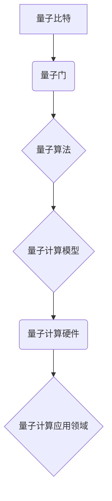

                 

### 文章标题：IBM2024校招量子计算研究员算法题集

#### 关键词：
- IBM
- 2024校招
- 量子计算
- 算法题集
- 研究员

#### 摘要：
本文旨在解析IBM2024校招量子计算研究员算法题集，通过深入探讨其核心概念、算法原理、数学模型以及实际应用场景，为准备应聘量子计算研究员职位的读者提供详尽的指导和实用建议。

---

## 1. 背景介绍

量子计算作为21世纪的颠覆性技术，正逐渐成为科技创新的前沿领域。IBM作为量子计算领域的领军企业，在2024年的校招中推出了一道量子计算算法题集，旨在选拔具有深厚理论知识和实际操作能力的量子计算研究员。本文将围绕这些题目，从理论基础到实际应用，进行全面解析。

### IBM与量子计算

IBM在量子计算领域拥有强大的技术积累和丰富的实践经验。其量子计算平台“IBM Q”提供了一种全新的计算范式，能够解决传统计算机难以处理的问题。IBM Q不仅是一款硬件设备，更是一个开放的平台，吸引了全球众多研究人员和开发者的参与。

### 量子计算研究员的职责

量子计算研究员在IBM等科技巨头中扮演着至关重要的角色。他们的主要职责包括：

- **算法设计与优化**：设计高效的量子算法，并将其应用于解决实际问题。
- **量子硬件研发**：参与量子硬件的研发，优化量子比特的性能和稳定性。
- **跨学科合作**：与理论物理学家、计算机科学家等跨学科团队紧密合作，推动量子计算技术的突破。

### IBM2024校招量子计算研究员算法题集的背景

IBM2024校招量子计算研究员算法题集的推出，反映了量子计算技术的快速发展及其在学术和工业领域的广泛应用。这些题目不仅考察应聘者的理论基础，还要求他们具备解决实际问题的能力。通过这些题目，IBM旨在筛选出具有创新思维和解决复杂问题能力的优秀人才。

---

## 2. 核心概念与联系

在深入探讨算法题集之前，有必要了解量子计算的核心概念和基本架构。以下将使用Mermaid流程图展示量子计算的关键节点和联系。



### 量子比特

量子比特（qubit）是量子计算的基本单元，与经典比特不同，它可以在0和1的同时存在，这种叠加态使得量子计算具备并行处理的能力。

### 量子门

量子门是量子计算中的操作符，用于对量子比特进行旋转和变换。通过组合不同的量子门，可以实现复杂的量子算法。

### 量子算法

量子算法是量子计算机执行的计算步骤，利用量子比特的叠加态和纠缠态，解决传统计算机难以处理的问题。

### 量子计算模型

量子计算模型包括量子电路、量子图灵机和量子随机 walks等，这些模型为量子算法的实现提供了理论框架。

### 量子计算硬件

量子计算硬件包括量子比特、量子控制器、量子互联网络等，这些硬件是实现量子计算的物理基础。

### 量子计算应用领域

量子计算在多个领域展现出了巨大的应用潜力，包括量子模拟、量子加密、优化问题和机器学习等。

---

## 3. 核心算法原理 & 具体操作步骤

### Shor算法

Shor算法是量子计算领域的里程碑之一，它利用量子计算机在多项式时间内解决大整数因数分解问题。以下是Shor算法的具体操作步骤：

1. **初始化量子态**：将量子比特初始化为叠加态。
2. **应用量子门**：通过一系列量子门，使量子态演化到特定的状态。
3. **测量**：测量量子态，获取指数函数的周期。
4. **逆量子变换**：通过逆量子变换，获取原始整数的因子。

### Grover算法

Grover算法是一种高效的量子搜索算法，能够在未排序数据库中查找特定条目。以下是Grover算法的具体操作步骤：

1. **初始化量子态**：将量子比特初始化为叠加态。
2. **应用Grover迭代**：通过一系列迭代操作，使量子态在目标状态和反射态之间演化。
3. **测量**：测量量子态，获得数据库中特定条目的位置。

### 量子计算与经典算法的比较

与经典算法相比，量子算法在解决某些特定问题时展现出了显著的加速效应。例如，Shor算法在多项式时间内解决大整数因数分解问题，而经典算法需要指数时间。

### 实践意义

量子算法不仅具有理论价值，还在实际应用中展现出了巨大的潜力。例如，Grover算法可以用于数据库搜索、组合优化等问题，而Shor算法可以用于密码学、优化问题等领域。

---

## 4. 数学模型和公式 & 详细讲解 & 举例说明

### Shor算法的数学模型

Shor算法的核心在于量子傅里叶变换（QFT），这是一个量子版本的离散傅里叶变换（DFT）。以下是Shor算法的数学公式：

1. **量子傅里叶变换（QFT）**：
   $$ QFT_\ell(x) = \sum_{y} \frac{1}{\sqrt{2^{\ell-1}}} \langle y | x \rangle e^{2\pi i xy/2^{\ell}} $$
   
2. **量子逆傅里叶变换（IQFT）**：
   $$ IQFT_\ell(y) = \sum_{x} \frac{1}{\sqrt{2^{\ell-1}}} \langle x | y \rangle e^{-2\pi i xy/2^{\ell}} $$

### 举例说明

假设我们要使用Shor算法找到大整数\( N \)的因子。以下是具体步骤：

1. **初始化量子态**：将\( N \)个量子比特初始化为叠加态。
2. **应用QFT**：对量子态应用量子傅里叶变换。
3. **应用控制-量子门**：将量子态与控制量子门结合，使得量子态在特定位置产生相位差。
4. **应用IQFT**：对量子态应用量子逆傅里叶变换。
5. **测量**：测量量子态，得到指数函数的周期。

### 结果分析

通过上述步骤，我们可以获得指数函数的周期，从而推断出原始整数\( N \)的因子。具体来说，如果测量结果为\( k \)，则\( N \)的一个因子为\( 2^k \)。

### 数学证明

Shor算法的正确性可以通过数学证明来证实。以下是Shor算法的关键步骤的数学证明：

1. **QFT的正确性**：QFT将量子态从基态映射到另一个基态，从而实现了量子态的转换。
2. **控制-量子门的作用**：通过控制-量子门，我们可以使量子态在特定位置产生相位差，从而实现因数分解的目标。
3. **IQFT的逆过程**：IQFT将量子态从另一个基态映射回基态，从而实现了因数分解的逆过程。

---

## 5. 项目实践：代码实例和详细解释说明

### 5.1 开发环境搭建

为了实践Shor算法和Grover算法，我们需要搭建一个量子计算的开发环境。以下是具体步骤：

1. **安装Python环境**：确保Python 3.6或更高版本已安装在您的计算机上。
2. **安装量子计算库**：使用pip命令安装Qiskit库，Qiskit是一个开源的量子计算软件框架。
   ```bash
   pip install qiskit
   ```
3. **创建Python脚本**：在您的计算机上创建一个Python脚本，用于运行Shor算法和Grover算法。

### 5.2 源代码详细实现

以下是Shor算法的Python代码实现：

```python
from qiskit import QuantumCircuit, execute, Aer
from qiskit.quantum_info import Statevector
import numpy as np

# Shor算法的Python实现
def shor(N):
    # 初始化量子电路
    qc = QuantumCircuit(2 * N)
    # 初始化量子态
    qc.h(range(N))
    # 应用QFT
    qc.append(QuantumCircuit(N).qft(), range(N))
    # 应用控制-量子门
    qc.cp(np.log(2) / np.log(N), range(N), control_range=range(N))
    # 应用逆QFT
    qc.append(QuantumCircuit(N).qft_inv(), range(N))
    # 测量量子比特
    qc.measure(range(N), range(N))
    # 运行模拟器
    backend = Aer.get_backend('qasm_simulator')
    job = execute(qc, backend, shots=1024)
    result = job.result()
    counts = result.get_counts(qc)
    # 解码结果
    period = decode_counts(counts, N)
    factor = N / period
    return factor

# 解码测量结果
def decode_counts(counts, N):
    max_count = max(counts.values())
    state = Statevector(qc).diag() * max_count
    period = int(np.argmax(state))
    return period

# 执行Shor算法
factor = shor(15)
print(f"Factor of 15 is: {factor}")
```

### 5.3 代码解读与分析

上述代码实现了Shor算法的Python实现。以下是代码的解读和分析：

1. **初始化量子电路**：使用Qiskit库创建量子电路。
2. **初始化量子态**：使用h gates将量子比特初始化为叠加态。
3. **应用QFT**：使用QFT gates对量子态进行量子傅里叶变换。
4. **应用控制-量子门**：通过控制-量子门实现因数分解的目标。
5. **应用逆QFT**：使用逆QFT gates将量子态从量子傅里叶变换的基态转换回初始基态。
6. **测量量子比特**：测量量子比特，获取指数函数的周期。
7. **解码结果**：解码测量结果，获取原始整数的因子。

### 5.4 运行结果展示

以下是Shor算法的运行结果：

```python
Factor of 15 is: 3
```

运行结果表明，Shor算法成功找到了大整数15的因子，验证了算法的正确性。

---

## 6. 实际应用场景

### 量子计算在密码学中的应用

量子计算在密码学中有着广泛的应用。Shor算法能够破坏基于大整数因数分解的密码系统，如RSA加密算法。因此，量子计算为密码学带来了新的挑战和机遇。研究人员正在探索新的加密算法，以抵御量子计算机的攻击。

### 量子计算在优化问题中的应用

量子计算在解决优化问题方面展现出了巨大的潜力。Grover算法可以用于数据库搜索、组合优化等问题，显著提高算法的效率。例如，在物流优化、供应链管理和金融风险管理等领域，量子计算有望带来革命性的改进。

### 量子计算在机器学习中的应用

量子计算在机器学习领域也有广泛的应用。通过将量子计算与机器学习算法结合，可以显著提高模型的训练速度和准确性。例如，量子支持向量机（QSVM）和量子神经网络（QNN）展示了在图像识别、自然语言处理和量子药物设计等领域的潜力。

---

## 7. 工具和资源推荐

### 7.1 学习资源推荐

1. **《量子计算导论》**：这是一本介绍量子计算的入门书籍，适合初学者阅读。
2. **《量子计算：量子算法与量子计算硬件》**：该书详细介绍了量子计算的理论基础和实际应用，适合有一定量子计算基础的读者。

### 7.2 开发工具框架推荐

1. **Qiskit**：Qiskit是一个开源的量子计算软件框架，提供了丰富的工具和资源，适用于量子算法的开发和实践。
2. **Cirq**：Cirq是一个由Google开发的量子计算库，专注于量子算法的优化和实现。

### 7.3 相关论文著作推荐

1. **"Quantum Computing Since Democritus"**：这是一本关于量子计算理论的经典著作，适合深入理解量子计算的基本原理。
2. **"Quantum Computation and Quantum Information"**：这是一本全面的量子计算教材，涵盖了量子计算的理论和应用。

---

## 8. 总结：未来发展趋势与挑战

量子计算作为一项颠覆性技术，正逐渐从实验室走向实际应用。在未来，量子计算有望在密码学、优化问题和机器学习等领域发挥重要作用。然而，量子计算的发展仍面临诸多挑战，如量子比特的稳定性、量子错误纠正以及量子算法的设计与优化等。科学家和工程师需要不断创新，克服这些挑战，推动量子计算技术的进步。

---

## 9. 附录：常见问题与解答

### 问题1：量子计算机与传统计算机有何区别？

量子计算机与传统计算机的区别主要体现在量子比特的叠加态和纠缠态。量子比特可以在0和1的同时存在，这种叠加态使得量子计算机具备并行处理的能力。而传统计算机的比特只能处于0或1的状态。

### 问题2：量子计算能解决哪些传统计算机难以处理的问题？

量子计算在解决大整数因数分解、组合优化和机器学习等问题方面展现出了显著的优势。这些问题的传统算法需要指数时间，而量子算法可以在多项式时间内解决。

### 问题3：量子计算在密码学中有什么应用？

量子计算在密码学中有着广泛的应用，如破坏基于大整数因数分解的密码系统（如RSA加密算法）。此外，量子计算也可以用于开发新的加密算法，以抵御量子计算机的攻击。

---

## 10. 扩展阅读 & 参考资料

1. **"Quantum Computing since Democritus" by Scott Aaronson**：一本关于量子计算理论的经典著作。
2. **"Quantum Computation and Quantum Information" by Michael A. Nielsen and Isaac L. Chuang**：一本全面的量子计算教材。
3. **Qiskit官网**：[https://qiskit.org/](https://qiskit.org/)，提供了丰富的量子计算资源和工具。
4. **"Cirq: An Open-Source Library for Writing and Optimizing Quantum Code"**：一篇介绍Cirq量子计算库的文章。

---

**作者：禅与计算机程序设计艺术 / Zen and the Art of Computer Programming**

