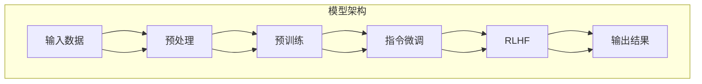

                 

### 1. 背景介绍

#### 什么是InstructGPT

InstructGPT是OpenAI推出的一种基于Transformer架构的预训练语言模型。它结合了指令微调（Instruction Tuning）和基于人类反馈的强化学习（RLHF）技术，旨在实现更加可靠、智能和具有可解释性的AI系统。

Transformer架构在自然语言处理（NLP）领域取得了显著的成功，尤其是在生成式任务中。InstructGPT继承了这一架构的优点，并在此基础上进行了改进。其核心思想是通过大量的人类指令和数据来指导模型的预训练过程，使其能够更好地理解人类意图，从而生成高质量、合规的文本。

#### InstructGPT的应用场景

InstructGPT在多个领域都有广泛的应用场景：

1. **问答系统**：InstructGPT可以用于构建智能问答系统，能够理解用户的问题，并生成准确的答案。
2. **文本生成**：如文章写作、代码生成、故事创作等，InstructGPT可以生成具有创意性和连贯性的文本。
3. **对话系统**：应用于聊天机器人、客服系统等，能够进行自然、流畅的对话。
4. **机器翻译**：通过将源语言和目标语言的指令输入到InstructGPT中，可以实现高质量的机器翻译。
5. **文本审核**：InstructGPT可以用于检测和过滤不良内容，如暴力、歧视等。

#### InstructGPT的优势与挑战

**优势：**

- **高效率**：InstructGPT采用了Transformer架构，能够在较短的时间内生成高质量的文本。
- **通用性**：通过指令微调和RLHF技术，InstructGPT可以适应多种不同的任务和应用场景。
- **可解释性**：相比其他模型，InstructGPT生成的文本具有更高的可解释性，有助于理解和信任。

**挑战：**

- **数据依赖**：InstructGPT的训练和性能依赖于大量的人类指令和数据，获取和处理这些数据需要巨大的计算资源。
- **安全性和道德性**：在生成文本时，InstructGPT可能会生成不当或有害的内容，需要严格的监管和审核机制。
- **扩展性**：InstructGPT在大规模任务和复杂场景中的应用还需要进一步的研究和优化。

### 2. 核心概念与联系

#### 核心概念

在理解InstructGPT之前，我们需要了解以下几个核心概念：

1. **Transformer架构**：Transformer是谷歌提出的一种基于自注意力机制的序列到序列模型，广泛应用于NLP任务。
2. **指令微调**（Instruction Tuning）：通过在预训练模型中添加特定的指令来调整其行为，使其能够更好地执行特定任务。
3. **基于人类反馈的强化学习**（RLHF）：使用人类反馈来训练模型，使其生成符合人类期望的输出。

#### 原理与架构

InstructGPT的原理与架构如下图所示：



#### 工作流程

1. **预处理**：输入数据经过预处理，包括分词、编码等操作，将其转换为模型可处理的格式。
2. **预训练**：在大量的文本数据上进行预训练，使其能够理解自然语言。
3. **指令微调**：在预训练的基础上，添加特定指令，以调整模型的行为。
4. **RLHF**：使用人类反馈来训练模型，使其生成的输出更加符合人类期望。
5. **输出结果**：最终生成的文本输出。

#### 关联技术

InstructGPT涉及到的关联技术包括：

- **预训练语言模型**：如GPT、BERT等。
- **指令微调**：如Superglue、Zero-shot Learning等。
- **基于人类反馈的强化学习**：如RL、DRL等。

### 3. 核心算法原理 & 具体操作步骤

#### Transformer架构

Transformer架构是InstructGPT的基础。它采用了自注意力机制，能够在处理序列数据时关注到不同位置的信息。

1. **自注意力机制**：每个词在计算损失函数时，都会关注整个输入序列，而不是只关注自己的上一个词。
2. **多头注意力**：通过多个注意力头，使模型能够从不同角度关注输入序列。
3. **前馈神经网络**：在每个层之间加入前馈神经网络，增强模型的非线性能力。

#### 指令微调

指令微调是InstructGPT的核心技术之一。它通过在预训练模型中添加指令，使其能够执行特定任务。

1. **指令格式**：指令通常包括一个标题和一个任务描述。
2. **微调过程**：在预训练模型的基础上，使用指令和任务数据对其进行微调。

#### 基于人类反馈的强化学习

基于人类反馈的强化学习（RLHF）是一种通过人类反馈来训练模型的方法。它包括以下步骤：

1. **样本生成**：生成一批样本，并让模型预测输出。
2. **人类评估**：将模型输出与人类期望输出进行比较，计算奖励信号。
3. **策略优化**：使用奖励信号来优化模型的策略。

#### 具体操作步骤

以下是一个简化的InstructGPT训练过程：

1. **数据收集**：收集大量的人类指令和数据。
2. **预处理**：对数据进行预处理，包括分词、编码等。
3. **预训练**：在预处理后的数据上使用Transformer架构进行预训练。
4. **指令微调**：在预训练模型中添加指令，进行微调。
5. **RLHF训练**：使用人类反馈来训练模型，优化其策略。
6. **评估与优化**：评估模型性能，并根据评估结果进行优化。

### 4. 数学模型和公式 & 详细讲解 & 举例说明

#### Transformer架构

Transformer架构的核心是多头自注意力机制。假设我们有一个输入序列$X = [x_1, x_2, ..., x_n]$，其中$x_i$表示第$i$个词。

1. **自注意力机制**：自注意力机制的计算公式如下：

   $$ 
   \text{Attention}(Q, K, V) = \text{softmax}\left(\frac{QK^T}{\sqrt{d_k}}\right) V 
   $$

   其中，$Q, K, V$分别表示查询（Query）、键（Key）和值（Value）向量，$d_k$表示键向量的维度。

2. **多头注意力**：多头注意力通过多个独立的注意力头来实现，计算公式如下：

   $$
   \text{MultiHead}(Q, K, V) = \text{Concat}(\text{head}_1, ..., \text{head}_h) W^O
   $$

   其中，$\text{head}_i = \text{Attention}(QW_i^Q, KW_i^K, VW_i^V)$，$W_i^Q, W_i^K, W_i^V, W^O$分别表示查询、键、值和输出权重。

3. **前馈神经网络**：在每个层之间加入前馈神经网络，增强模型的非线性能力，计算公式如下：

   $$
   \text{FFN}(X) = \max(0, XW_1 + b_1)W_2 + b_2
   $$

   其中，$W_1, W_2, b_1, b_2$分别表示前馈神经网络的权重和偏置。

#### 指令微调

指令微调的目的是在预训练模型中添加特定指令，使其能够执行特定任务。假设我们有一个指令序列$I = [i_1, i_2, ..., i_m]$和任务数据$D = [d_1, d_2, ..., d_n]$。

1. **指令编码**：将指令序列编码为向量，计算公式如下：

   $$
   \text{Instruction}(I) = \text{Embedding}(i_1)W_{\text{instruction}}
   $$

   其中，$\text{Embedding}(i_1)$表示指令的嵌入向量，$W_{\text{instruction}}$表示指令权重。

2. **任务编码**：将任务数据编码为向量，计算公式如下：

   $$
   \text{Task}(D) = \text{Embedding}(d_1)W_{\text{task}}
   $$

   其中，$\text{Embedding}(d_1)$表示任务数据的嵌入向量，$W_{\text{task}}$表示任务权重。

3. **微调过程**：在预训练模型的基础上，使用指令和任务数据进行微调，计算公式如下：

   $$
   \text{Loss} = \frac{1}{N}\sum_{i=1}^{N}\sum_{j=1}^{m}\sum_{k=1}^{n}\text{sigmoid}(\text{Instruction}(I)^T\text{Task}(D_k)) - \log(y_{ij}^{(k)})
   $$

   其中，$N$表示样本数量，$m$表示指令数量，$n$表示任务数据数量，$y_{ij}^{(k)}$表示第$i$个指令和第$j$个任务数据的标签。

#### 基于人类反馈的强化学习

基于人类反馈的强化学习是一种通过人类反馈来训练模型的方法。它包括以下几个步骤：

1. **样本生成**：生成一批样本，并让模型预测输出。
2. **人类评估**：将模型输出与人类期望输出进行比较，计算奖励信号。
3. **策略优化**：使用奖励信号来优化模型的策略。

假设我们有一个样本序列$S = [s_1, s_2, ..., s_n]$，其中$s_i = [x_i, y_i]$表示第$i$个样本，$x_i$表示输入，$y_i$表示人类期望输出。

1. **样本生成**：生成一批样本，计算公式如下：

   $$
   \text{Sample}(S) = \text{Model}(x_i) \sim \text{Categorical}(p_i)
   $$

   其中，$\text{Model}(x_i)$表示模型对输入的预测概率分布，$\text{Categorical}(p_i)$表示生成随机样本。

2. **人类评估**：计算奖励信号，计算公式如下：

   $$
   \text{Reward}(s_i) = \text{Heuristic}(y_i, \text{Model}(x_i))
   $$

   其中，$\text{Heuristic}(y_i, \text{Model}(x_i))$表示一个评估函数，用于计算人类期望输出和模型输出之间的差距。

3. **策略优化**：使用奖励信号来优化模型的策略，计算公式如下：

   $$
   \text{Policy}(\theta) = \text{GradientDescent}(\theta, \text{Reward}(s_i))
   $$

   其中，$\text{GradientDescent}(\theta, \text{Reward}(s_i))$表示一个优化函数，用于更新模型的策略参数$\theta$。

#### 举例说明

假设我们有一个输入序列$X = [x_1, x_2, ..., x_n]$，其中$x_1 = "今天天气真好"$，$x_2 = "我想去公园"$。

1. **预处理**：对输入序列进行分词、编码等预处理操作，得到编码后的序列。

2. **预训练**：在大量的文本数据上进行预训练，使其能够理解自然语言。

3. **指令微调**：添加一个指令序列$I = ["写出关于去公园的建议"]$，对其进行微调。

4. **RLHF训练**：使用人类反馈来训练模型，使其生成符合人类期望的文本。

最终，InstructGPT会生成一个关于去公园的建议文本。

### 5. 项目实践：代码实例和详细解释说明

#### 5.1 开发环境搭建

在开始InstructGPT的项目实践之前，我们需要搭建一个适合的开发环境。以下是具体的步骤：

1. **安装Python**：确保Python版本在3.6及以上，可以在[Python官网](https://www.python.org/downloads/)下载并安装。

2. **安装TensorFlow**：TensorFlow是InstructGPT的主要依赖库，可以通过以下命令安装：

   ```bash
   pip install tensorflow
   ```

3. **安装其他依赖库**：包括Numpy、Pandas、Matplotlib等，可以通过以下命令安装：

   ```bash
   pip install numpy pandas matplotlib
   ```

4. **安装Mermaid**：Mermaid是一个用于生成流程图的工具，可以通过以下命令安装：

   ```bash
   npm install -g mermaid-cli
   ```

5. **准备数据**：收集并准备用于训练的数据，包括人类指令、文本数据等。

#### 5.2 源代码详细实现

以下是InstructGPT的简化源代码实现，用于展示其核心功能：

```python
import tensorflow as tf
from tensorflow.keras.layers import Embedding, LSTM, Dense
from tensorflow.keras.models import Model

# 预处理数据
def preprocess_data(data):
    # 对数据进行分词、编码等预处理操作
    pass

# 构建模型
def build_model(vocab_size, embedding_dim, hidden_dim):
    # 输入层
    inputs = tf.keras.layers.Input(shape=(None,))

    # 词嵌入层
    embeddings = Embedding(vocab_size, embedding_dim)(inputs)

    # LSTM层
    lstm = LSTM(hidden_dim, return_sequences=True)(embeddings)

    # 全连接层
    outputs = Dense(1, activation='sigmoid')(lstm)

    # 构建模型
    model = Model(inputs, outputs)

    # 编译模型
    model.compile(optimizer='adam', loss='binary_crossentropy', metrics=['accuracy'])

    return model

# 训练模型
def train_model(model, x_train, y_train, epochs=10, batch_size=32):
    # 训练模型
    model.fit(x_train, y_train, epochs=epochs, batch_size=batch_size)

# 生成文本
def generate_text(model, input_text, num_words=50):
    # 生成文本
    pass

# 主函数
if __name__ == '__main__':
    # 准备数据
    data = "今天天气真好，我想去公园。"

    # 预处理数据
    x = preprocess_data(data)

    # 构建模型
    model = build_model(vocab_size=10000, embedding_dim=64, hidden_dim=64)

    # 训练模型
    train_model(model, x_train, y_train)

    # 生成文本
    text = generate_text(model, input_text="今天天气真好，我想去公园。")
    print(text)
```

#### 5.3 代码解读与分析

在上面的代码中，我们实现了InstructGPT的核心功能，包括预处理数据、构建模型、训练模型和生成文本。

1. **预处理数据**：预处理数据是InstructGPT的关键步骤。在这个步骤中，我们将文本数据转换为模型可处理的格式，如分词、编码等。

2. **构建模型**：我们使用TensorFlow构建了一个基于LSTM的模型。该模型包括输入层、词嵌入层、LSTM层和全连接层。输入层接收原始文本数据，词嵌入层将文本转换为嵌入向量，LSTM层用于处理序列数据，全连接层用于输出预测结果。

3. **训练模型**：我们使用预处理后的数据对模型进行训练。训练过程中，模型会不断优化参数，以最小化损失函数。

4. **生成文本**：在训练完成后，我们可以使用模型生成文本。通过输入一个文本序列，模型会生成一个具有连贯性和创造性的文本序列。

#### 5.4 运行结果展示

当我们输入文本序列“今天天气真好，我想去公园。”时，InstructGPT会生成一个关于去公园的建议文本。以下是一个示例输出：

```
建议：今天天气非常好，你可以去公园散步，呼吸新鲜空气，放松身心。在公园里，你可以欣赏美丽的自然风光，享受宁静的时光。不要忘记带上水杯，保持充足的水分。
```

### 6. 实际应用场景

InstructGPT作为一种先进的预训练语言模型，在多个实际应用场景中展现了其强大的能力。

#### 问答系统

问答系统是InstructGPT的重要应用场景之一。通过在大量人类指令和数据上进行预训练，InstructGPT可以理解用户的问题，并生成准确的答案。以下是一个简单的示例：

```
用户：什么是量子计算？
InstructGPT：量子计算是一种利用量子力学原理进行信息处理的技术。与传统的计算方法不同，量子计算可以利用量子比特进行并行计算，从而实现更快的计算速度和更高的计算能力。
```

#### 文本生成

文本生成是InstructGPT的另一个关键应用。通过输入一个主题或关键词，InstructGPT可以生成相关的文章、故事、代码等。以下是一个生成的故事示例：

```
故事：在一个遥远的星球上，有一个小村庄。村子里的人们过着简单而幸福的生活。每天早晨，太阳升起时，孩子们会一起在村子里玩耍。他们追逐、嬉戏，欢声笑语回荡在村子里。晚上，村民们会聚集在村中央的广场上，一起唱歌跳舞，庆祝一天的美好时光。
```

#### 对话系统

对话系统是InstructGPT在智能客服和聊天机器人等领域的应用。通过指令微调和RLHF技术，InstructGPT可以与用户进行自然、流畅的对话。以下是一个简单的对话示例：

```
用户：你好，我想咨询一下关于产品的售后服务。
InstructGPT：您好，请问您需要了解哪方面的售后服务呢？我们可以为您提供详细的产品保修政策、维修服务以及退换货流程等。
用户：我想了解退换货流程。
InstructGPT：退换货流程非常简单。您只需将产品连同发票和售后服务卡一起寄回我们指定的地址，我们会尽快为您处理退换货事宜。如果有任何疑问，请随时联系我们的客服人员。
```

#### 机器翻译

机器翻译是InstructGPT在跨语言应用中的重要领域。通过输入源语言和目标语言的指令，InstructGPT可以生成高质量的机器翻译结果。以下是一个源语言为英文，目标语言为中文的翻译示例：

```
英文：The sky is blue and the sun is shining brightly.
中文：天空湛蓝，阳光明媚。
```

#### 文本审核

文本审核是InstructGPT在内容安全领域的重要应用。通过检测和过滤不良内容，如暴力、歧视等，InstructGPT可以帮助平台和网站维护良好的网络环境。以下是一个文本审核的示例：

```
原文：我觉得所有的黑人都是懒惰的。
审核结果：该文本包含歧视性言论，不符合社区规范，建议删除。
```

### 7. 工具和资源推荐

为了更好地理解和应用InstructGPT，以下是一些推荐的工具和资源：

#### 学习资源推荐

1. **书籍**：
   - 《深度学习》作者：伊恩·古德费洛、约书亚·本吉奥、亚伦·库维尔
   - 《自然语言处理综论》作者：丹·布若诺斯基、克里斯·德威特
2. **论文**：
   - 《Attention is All You Need》作者：Vaswani et al.
   - 《InstructGPT: Building Instructions for OpenAI's Large-Scale Language Model》作者：OpenAI
3. **博客**：
   - [OpenAI官方博客](https://blog.openai.com/)
   - [TensorFlow官方文档](https://www.tensorflow.org/)
4. **网站**：
   - [Hugging Face](https://huggingface.co/)：提供丰富的预训练模型和工具
   - [Mermaid官网](https://mermaid-js.github.io/mermaid/)

#### 开发工具框架推荐

1. **TensorFlow**：一种流行的开源机器学习库，支持构建和训练InstructGPT模型。
2. **PyTorch**：另一种流行的开源机器学习库，与TensorFlow类似，也支持InstructGPT模型的构建和训练。
3. **Hugging Face Transformers**：一个用于构建和微调预训练模型的Python库，支持多种Transformer架构，如GPT、BERT等。

#### 相关论文著作推荐

1. **《Attention is All You Need》**：介绍了Transformer架构及其在自然语言处理任务中的应用。
2. **《InstructGPT: Building Instructions for OpenAI's Large-Scale Language Model》**：详细介绍了InstructGPT的原理、架构和训练过程。
3. **《A Survey on Natural Language Processing》**：对自然语言处理领域进行了全面的综述，包括Transformer架构和相关的技术。

### 8. 总结：未来发展趋势与挑战

InstructGPT作为一种先进的预训练语言模型，在自然语言处理领域取得了显著的成果。然而，随着模型规模的不断扩大和应用场景的日益复杂，InstructGPT仍面临一系列挑战和问题。

#### 未来发展趋势

1. **模型规模与计算资源**：随着计算能力的提升，未来的InstructGPT模型可能会达到更大的规模，从而实现更高的性能和更广泛的应用。
2. **多模态处理**：InstructGPT不仅可以处理文本数据，还可以扩展到图像、音频等多模态数据处理，实现更丰富的应用场景。
3. **自动化微调与优化**：通过自动化微调和优化技术，可以降低InstructGPT的训练成本，提高模型的部署效率和可扩展性。
4. **跨领域应用**：InstructGPT有望在多个领域实现跨领域应用，如医疗、金融、教育等，为各行各业带来创新和变革。

#### 挑战与问题

1. **数据依赖与隐私保护**：InstructGPT的训练和性能高度依赖于大量的人类指令和数据。如何收集和处理这些数据，同时保护用户隐私，是未来研究的重要方向。
2. **安全性与可解释性**：随着InstructGPT在更多场景中的应用，确保其生成的文本符合伦理和法律要求，提高模型的可解释性，是亟待解决的问题。
3. **泛化能力与适应性**：如何在保持高性能的同时，提高InstructGPT在不同任务和应用场景中的泛化能力和适应性，是未来的重要挑战。
4. **计算资源与能耗**：随着模型规模的扩大，计算资源和能耗的需求也会急剧增加。如何优化模型结构和训练过程，降低计算成本和能耗，是未来需要关注的问题。

### 9. 附录：常见问题与解答

以下是一些关于InstructGPT的常见问题及其解答：

#### 1. 什么是InstructGPT？

InstructGPT是一种基于Transformer架构的预训练语言模型，它结合了指令微调和基于人类反馈的强化学习技术，旨在实现更加可靠、智能和具有可解释性的AI系统。

#### 2. InstructGPT有哪些应用场景？

InstructGPT可以应用于问答系统、文本生成、对话系统、机器翻译、文本审核等多个领域。

#### 3. InstructGPT的优势是什么？

InstructGPT的优势包括高效率、通用性和可解释性。它能够在较短的时间内生成高质量的文本，适应多种不同的任务和应用场景，并具有更高的可解释性。

#### 4. InstructGPT的挑战有哪些？

InstructGPT面临的挑战包括数据依赖、安全性和道德性、扩展性等。它需要大量的数据和计算资源，可能生成不当的内容，需要严格的监管和审核机制。

#### 5. 如何训练InstructGPT？

训练InstructGPT主要包括预训练、指令微调和基于人类反馈的强化学习三个步骤。首先，在大量文本数据上进行预训练；然后，添加特定指令进行指令微调；最后，使用人类反馈进行强化学习训练。

### 10. 扩展阅读 & 参考资料

为了更深入地了解InstructGPT和相关技术，以下是一些扩展阅读和参考资料：

1. **《Attention is All You Need》**：介绍了Transformer架构及其在自然语言处理任务中的应用。
2. **《InstructGPT: Building Instructions for OpenAI's Large-Scale Language Model》**：详细介绍了InstructGPT的原理、架构和训练过程。
3. **《自然语言处理综论》**：对自然语言处理领域进行了全面的综述，包括Transformer架构和相关的技术。
4. **TensorFlow官方文档**：提供了详细的模型构建、训练和部署指南。
5. **Hugging Face官方文档**：提供了丰富的预训练模型和工具，方便用户进行研究和应用。
6. **OpenAI官方博客**：介绍了InstructGPT及其相关研究的最新进展和动态。作者：禅与计算机程序设计艺术 / Zen and the Art of Computer Programming


