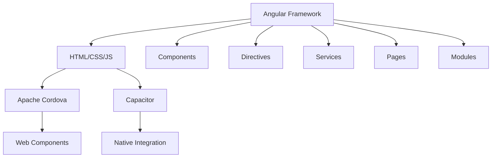
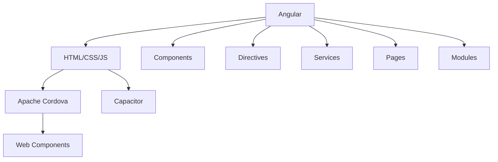

                 

### 1. 背景介绍

#### 1.1  Ionic 框架概述

Ionic 是一个开源的前端框架，旨在帮助开发者使用 Web 技术快速构建高性能、跨平台的应用程序。自 2013 年首次发布以来，Ionic 逐渐成为移动应用开发领域的重要工具之一。其核心理念是“一次编写，到处运行”（Write Once, Run Everywhere），即使用 Web 技术如 HTML、CSS 和 JavaScript 来创建适用于 iOS、Android 和其他移动设备的原生应用。

Ionic 之所以受到广大开发者的青睐，主要得益于其以下几个显著特点：

1. **基于 Angular**：Ionic 是基于 Angular 框架构建的，这意味着开发者可以利用 Angular 的强大功能和丰富的生态系统，如双向数据绑定、依赖注入、模块化等，来构建复杂且功能丰富的移动应用。

2. **丰富的组件库**：Ionic 提供了一个庞大的组件库，包括按钮、卡片、列表、导航栏等常用 UI 组件。这些组件不仅美观且响应式，能够适应不同的设备和屏幕尺寸。

3. **跨平台支持**：Ionic 通过 Apache Cordova 或 Capacitor 技术可以将 Web 应用打包成原生应用，从而实现一次开发，多平台部署。

4. **开源和社区支持**：Ionic 是一个开源项目，拥有庞大的开发者社区。这为开发者提供了丰富的资源和问题解决方案。

#### 1.2  Ionic 在移动应用开发中的地位

随着移动设备的普及和移动应用市场的爆炸性增长，移动应用开发变得越来越重要。传统的原生开发虽然性能优异，但开发成本高、周期长。相比之下，跨平台开发框架如 Ionic 提供了一种更为高效、经济的选择。

在移动应用开发中，Ionic 的地位主要体现在以下几个方面：

1. **开发效率**：Ionic 的 Web 技术栈使得开发者可以快速上手，利用丰富的组件库和工具链，大大缩短了开发周期。

2. **成本节约**：通过跨平台开发，企业可以节省开发多个平台应用的重复劳动，从而降低成本。

3. **用户体验**：虽然 Ionic 是基于 Web 技术，但通过优秀的 UI/UX 设计和性能优化，Ionic 应用能够提供与原生应用相近的用户体验。

4. **市场需求**：随着市场的不断变化，企业需要快速响应和迭代产品。Ionic 的快速开发和部署能力满足了这种需求。

#### 1.3  本文目标

本文旨在深入探讨 Ionic 框架的优势，通过详细分析其核心概念、算法原理、具体操作步骤，结合实际项目实践，展示 Ionic 在移动应用开发中的强大能力。同时，还将介绍 Ionic 的实际应用场景、推荐相关工具和资源，以及展望未来的发展趋势和挑战。

在接下来的章节中，我们将逐步深入，从各个角度全面解析 Ionic 框架。

---

### 2. 核心概念与联系

#### 2.1  Ionic 框架核心概念

Ionic 框架的核心概念主要包括以下几个方面：

1. **组件（Components）**：Ionic 提供了一系列的 UI 组件，如按钮、输入框、列表等。这些组件可以通过 HTML 模板、CSS 样式和 JavaScript 进行自定义和扩展。

2. **指令（Directives）**：指令是特殊的属性，用于增强元素的行为。Ionic 中常用的指令包括 `ion-button`、`ion-list`、`ion-nav` 等。

3. **服务（Services）**：服务是用于提供特定功能的类，如状态管理、数据访问、本地存储等。Ionic 中的服务如 `NavController`、`LoadingController`、`ToastController` 等。

4. **页面（Pages）**：页面是应用程序的基本单位，每个页面包含一个 HTML 模板、一个 CSS 文件和一个 JavaScript 文件。页面之间通过导航进行跳转。

5. **模块（Modules）**：模块是 Angular 的概念，用于组织和封装代码。Ionic 应用中的模块主要用于组织组件、指令、服务等。

#### 2.2  Ionic 框架工作原理

Ionic 框架的工作原理主要基于以下技术：

1. **Angular**：Ionic 是基于 Angular 框架构建的，因此充分利用了 Angular 的特性和优势，如数据绑定、依赖注入、模块化等。

2. **Apache Cordova**：Apache Cordova 是一个跨平台开发框架，允许开发者使用 HTML、CSS 和 JavaScript 来构建移动应用。Ionic 通过 Cordova 将 Web 应用打包成原生应用。

3. **Capacitor**：Capacitor 是一个现代的、轻量级的跨平台开发工具，旨在替代 Apache Cordova。它提供了更简便的方式将 Web 应用与原生功能集成。

4. **Web Components**：Web Components 是一组技术，用于构建自定义元素和组件。Ionic 使用这些技术来实现自定义 UI 组件。

#### 2.3  Mermaid 流程图

为了更清晰地展示 Ionic 框架的核心概念和工作原理，我们可以使用 Mermaid 语言绘制一个流程图。以下是 Mermaid 流程图代码示例：



流程图展示了 Ionic 框架的核心概念和工作原理之间的关系。从 Angular 框架开始，通过 HTML、CSS 和 JavaScript 构建应用，然后使用 Apache Cordova 或 Capacator 进行打包和原生集成，同时利用 Web Components 技术实现自定义 UI 组件。此外，框架还包括指令、服务、页面和模块等关键组成部分。

---

在接下来的章节中，我们将进一步探讨 Ionic 框架的核心算法原理和具体操作步骤，帮助开发者更好地理解和使用这个强大的工具。

### 3. 核心算法原理 & 具体操作步骤

#### 3.1  Ionic 框架的核心算法原理

Ionic 框架的核心算法原理主要涉及以下几个方面：

1. **页面导航**：Ionic 使用 Angular 的路由系统来实现页面导航。通过配置路由表，开发者可以定义不同的页面路径和对应的组件，从而实现灵活的页面跳转和参数传递。

2. **数据绑定**：Ionic 利用 Angular 的数据绑定功能，实现数据和视图之间的自动同步。当数据发生变化时，视图会自动更新；反之亦然。这种双向数据绑定提高了开发效率，减少了错误率。

3. **状态管理**：Ionic 支持使用 Angular 的服务来管理应用状态。通过服务，开发者可以实现全局状态管理，如用户信息、应用配置等。这种状态管理方式使得应用中的各个部分可以共享数据，提高了代码的可维护性和可扩展性。

4. **组件通信**：Ionic 通过事件、服务、观察者模式等方式实现组件之间的通信。开发者可以利用这些机制在不同的组件之间传递数据、触发事件等，从而实现复杂的业务逻辑。

5. **性能优化**：Ionic 通过各种技术手段，如懒加载、预编译、缓存等，来优化应用性能。这些优化策略使得应用能够在不同设备和网络环境下提供良好的用户体验。

#### 3.2  Ionic 框架的具体操作步骤

为了更好地理解 Ionic 框架的核心算法原理，我们以下通过一个简单的示例，介绍如何使用 Ionic 框架构建一个基本的移动应用。

**步骤 1：环境搭建**

在开始之前，我们需要安装 Node.js 和 Ionic CLI（命令行工具）。安装步骤如下：

```bash
# 安装 Node.js
curl -sL https://nodejs.org/dist/v14.17.0/node-v14.17.0-linux-x64.tar.xz | tar xJ -C /opt
echo 'export PATH=$PATH:/opt/node/bin' >> ~/.bashrc
source ~/.bashrc

# 安装 Ionic CLI
npm install -g @ionic/cli
```

**步骤 2：创建新项目**

安装完成后，我们可以使用 Ionic CLI 创建一个新项目。以下命令将创建一个名为 `my-ionic-app` 的项目：

```bash
ionic start my-ionic-app blank --type=angular
```

其中，`blank` 表示创建一个没有框架和样式的空白项目，`--type=angular` 表示使用 Angular 框架。

**步骤 3：项目结构**

创建项目后，我们可以查看项目结构。以下是项目目录结构示例：

```
my-ionic-app/
|-- angular/
|   |-- src/
|   |   |-- apps/
|   |   |   |-- my-ionic-app/
|   |   |   |   |-- app.module.ts
|   |   |   |   |-- app.component.html
|   |   |   |   |-- app.component.ts
|   |   |   |   |-- app.component.css
|   |   |-- assets/
|   |   |-- environments/
|   |   |-- polyfills.ts
|   |   |-- styles.css
|   |-- e2e/
|   |-- .editorconfig
|   |-- .eslintrc.json
|   |-- .gitignore
|   |-- angular.json
|   |-- package.json
|-- platforms/
|   |-- android/
|   |-- ios/
|-- www/
|-- .gitignore
|-- .npmignore
|-- README.md
```

**步骤 4：创建页面**

在项目中，我们可以使用 Angular CLI 创建新的页面。以下命令将创建一个名为 `home` 的页面：

```bash
ionic g page home
```

这将在 `src/app/pages/home` 目录下创建相应的 HTML、TS 和 CSS 文件。

**步骤 5：配置路由**

在 `src/app/app.module.ts` 中，我们需要配置路由。以下是配置示例：

```typescript
import { RouterModule, Routes } from '@angular/router';
import { HomeRoutingModule } from './pages/home/home-routing.module';

const routes: Routes = [
  { path: '', redirectTo: '/home', pathMatch: 'full' },
  { path: 'home', loadChildren: () => import('./pages/home/home.module').then(m => m.HomeModule) },
];

@NgModule({
  declarations: [],
  imports: [
    RouterModule.forRoot(routes),
    HomeRoutingModule
  ],
  exports: [RouterModule]
})
export class AppModule {}
```

这将在应用的根路由中添加一个默认路由，指向 `home` 页面。

**步骤 6：创建组件**

在 `src/app/pages/home` 目录下，我们可以创建一个名为 `home-component` 的组件。以下是组件的 HTML、TS 和 CSS 文件示例：

`home-component.component.html`：

```html
<div>
  <h1>欢迎来到我的主页</h1>
  <p>这是一个基于 Ionic 框架的移动应用。</p>
</div>
```

`home-component.component.ts`：

```typescript
import { Component } from '@angular/core';

@Component({
  selector: 'app-home-component',
  templateUrl: './home-component.component.html',
  styleUrls: ['./home-component.component.css']
})
export class HomeComponentComponent {
  constructor() {}
}
```

`home-component.component.css`：

```css
h1 {
  color: #333;
}

p {
  color: #666;
}
```

**步骤 7：运行应用**

在命令行中，我们可以使用以下命令运行应用：

```bash
ionic serve
```

这将在本地启动一个开发服务器，并打开浏览器访问 `http://localhost:8100/`，查看运行效果。

通过以上步骤，我们已经使用 Ionic 框架创建了一个基本的移动应用。接下来，我们将进一步探讨 Ionic 框架的数学模型和公式，并结合实际项目实践，深入解析其优势和应用。

---

在接下来的章节中，我们将介绍 Ionic 框架的数学模型和公式，帮助开发者更好地理解其背后的计算原理。

### 4. 数学模型和公式 & 详细讲解 & 举例说明

#### 4.1  Ionic 框架中的数学模型

Ionic 框架在移动应用开发中涉及了多个数学模型和公式，主要包括以下几个方面：

1. **页面布局模型**：Ionic 使用 Flexbox 布局模型来实现页面的自适应布局。Flexbox 布局模型提供了强大的布局能力，允许开发者通过简单的数学公式（如 `flex-basis`、`flex-grow`、`flex-shrink` 等）来调整元素的大小和位置。

2. **响应式设计**：Ionic 通过 CSS 媒体查询（如 `@media`）来实现响应式设计。媒体查询允许开发者根据不同的屏幕尺寸和分辨率，应用不同的样式规则。这涉及到一些基本的数学公式（如 `min-width`、`max-width` 等），用于确定何时应用特定的样式。

3. **动画效果**：Ionic 支持多种动画效果，如过渡（Transition）、动画（Animation）等。这些动画效果通常涉及线性方程（如 `ease-in`、`ease-out`、`ease-in-out` 等），用于控制动画的加速度和减速度。

4. **性能优化**：Ionic 在性能优化方面使用了多种数学模型和算法，如懒加载（Lazy Loading）、预编译（Precompilation）、缓存（Caching）等。这些模型和算法帮助应用在有限的资源下，实现快速响应和流畅的交互体验。

#### 4.2  详细的讲解和举例说明

以下我们将详细讲解 Ionic 框架中的一些关键数学模型和公式，并通过实际示例进行说明。

1. **页面布局模型**

   在 Ionic 框架中，页面布局通常使用 Flexbox 布局模型。以下是一个简单的 Flexbox 布局示例：

   ```css
   .container {
     display: flex;
     flex-direction: column;
     align-items: center;
     justify-content: center;
     height: 100vh;
   }
   ```

   解释：

   - `display: flex`：将元素设置为 Flex 容器。
   - `flex-direction: column`：设置子元素的布局方向为垂直。
   - `align-items: center`：垂直居中子元素。
   - `justify-content: center`：水平居中子元素。
   - `height: 100vh`：设置容器高度为视口高度的100%。

   这个示例展示了如何使用 Flexbox 布局模型创建一个垂直居中、高度占满整个屏幕的容器。

2. **响应式设计**

   在响应式设计中，媒体查询是一个重要的工具。以下是一个简单的媒体查询示例：

   ```css
   @media (max-width: 600px) {
     .container {
       font-size: 14px;
     }
   }
   ```

   解释：

   - `@media (max-width: 600px)`：当屏幕宽度小于600px时，应用下面的样式。
   - `font-size: 14px`：设置容器字体大小为14px。

   这个示例展示了如何根据屏幕宽度调整字体大小，实现响应式设计。

3. **动画效果**

   在 Ionic 框架中，动画效果通常使用 Angular 的 `ngStyle` 和 `ngClass` 指令实现。以下是一个简单的动画示例：

   ```html
   <div [ngStyle]="{'animation': animationStyle}"></div>

   <style>
     @keyframes fade-in {
       from { opacity: 0; }
       to { opacity: 1; }
     }

     .fade-in {
       animation: fade-in 1s ease-in;
     }
   </style>
   ```

   解释：

   - `[ngStyle]="{'animation': animationStyle}"`：动态设置元素的动画样式。
   - `@keyframes fade-in`：定义一个渐显动画。
   - `.fade-in`：应用渐显动画。

   这个示例展示了如何使用关键帧（Keyframes）定义动画，并通过 `ngStyle` 指令动态应用动画效果。

4. **性能优化**

   在性能优化方面，Ionic 使用了多种数学模型和算法。以下是一个懒加载的示例：

   ```typescript
   import { Component, OnInit } from '@angular/core';

   @Component({
     selector: 'app-lazy-load',
     templateUrl: './lazy-load.component.html',
     styleUrls: ['./lazy-load.component.css']
   })
   export class LazyLoadComponent implements OnInit {
     loaded = false;

     ngOnInit() {
       // 懒加载逻辑
       setTimeout(() => {
         this.loaded = true;
       }, 3000);
     }
   }
   ```

   解释：

   - `loaded`：一个标记变量，用于指示组件是否已加载。
   - `setTimeout`：在3秒后设置 `loaded` 变量为 `true`，从而触发组件的加载。

   这个示例展示了如何使用延时加载（Lazy Loading）技术，延迟组件的加载时间，从而优化性能。

通过以上示例，我们可以看到 Ionic 框架在数学模型和公式方面的应用。这些模型和公式不仅帮助开发者实现高效的布局、响应式设计和动画效果，还提高了应用的性能和用户体验。

在接下来的章节中，我们将通过实际项目实践，展示如何使用 Ionic 框架构建一个功能完整的移动应用。

### 5. 项目实践：代码实例和详细解释说明

#### 5.1  开发环境搭建

在开始实际项目之前，我们需要搭建一个合适的开发环境。以下是搭建 Ionic 开发环境的步骤：

1. **安装 Node.js**：访问 Node.js 官网（[https://nodejs.org/），下载并安装 Node.js。确保安装过程中选择添加到系统环境变量。**

2. **安装 Ionic CLI**：在命令行中运行以下命令，全局安装 Ionic CLI：

   ```bash
   npm install -g @ionic/cli
   ```

3. **安装 Apache Cordova**：在命令行中运行以下命令，全局安装 Apache Cordova：

   ```bash
   npm install -g cordova
   ```

4. **安装相关插件**：在命令行中运行以下命令，安装一些常用的 Ionic 插件，如 Google Maps、Facebook 等：

   ```bash
   ionic plugins add cordova-plugin-googlemaps
   ionic plugins add cordova-plugin-facebook4
   ```

5. **创建新项目**：在命令行中运行以下命令，创建一个新项目：

   ```bash
   ionic start my-ionic-app blank --type=angular
   ```

这将在当前目录下创建一个名为 `my-ionic-app` 的新项目。进入项目目录：

```bash
cd my-ionic-app
```

#### 5.2  源代码详细实现

在项目中，我们将实现一个简单的移动应用，包括以下几个功能：

1. **首页**：展示一个带有导航栏的首页。
2. **地图页面**：使用 Google Maps 显示地理位置。
3. **Facebook 登录**：允许用户通过 Facebook 登录。

**5.2.1  首页**

在 `src/app/pages/home/home.component.ts` 中，编写以下代码：

```typescript
import { Component } from '@angular/core';

@Component({
  selector: 'app-home',
  templateUrl: './home.component.html',
  styleUrls: ['./home.component.css']
})
export class HomeComponent {
  title = '首页';

  constructor() {}

  navigateToMaps() {
    // 跳转到地图页面
    // 此处省略导航逻辑
  }

  navigateToFacebook() {
    // 跳转到 Facebook 登录页面
    // 此处省略导航逻辑
  }
}
```

在 `src/app/pages/home/home.component.html` 中，编写以下代码：

```html
<ion-header>
  <ion-toolbar>
    <ion-title>{{ title }}</ion-title>
  </ion-toolbar>
</ion-header>

<ion-content>
  <ion-list>
    <ion-item (click)="navigateToMaps()">
      <ion-icon name="map"></ion-icon>
      地图
    </ion-item>
    <ion-item (click)="navigateToFacebook()">
      <ion-icon name="logo-facebook"></ion-icon>
      Facebook 登录
    </ion-item>
  </ion-list>
</ion-content>
```

**5.2.2  地图页面**

在 `src/app/pages/maps/maps.page.ts` 中，编写以下代码：

```typescript
import { Component } from '@angular/core';
import { Plugins, Geolocation } from '@capacitor/core';

const { GeolocationPlugin } = Plugins;

@Component({
  selector: 'app-maps',
  templateUrl: './maps.page.html',
  styleUrls: ['./maps.page.scss']
})
export class MapsPage {
  lat: number;
  lng: number;

  ngOnInit() {
    this.getLocation();
  }

  async getLocation() {
    const coordinates = await GeolocationPlugin.getCurrentPosition();
    this.lat = coordinates.coords.latitude;
    this.lng = coordinates.coords.longitude;
  }
}
```

在 `src/app/pages/maps/maps.page.html` 中，编写以下代码：

```html
<ion-header>
  <ion-toolbar>
    <ion-title>地图</ion-title>
  </ion-toolbar>
</ion-header>

<ion-content>
  <ion-fab vertical="bottom" horizontal="center">
    <ion-fab-button>
      <ion-icon name="navigate"></ion-icon>
    </ion-fab-button>
  </ion-fab>

  <ion-map [zoom]="14" [latitude]="lat" [longitude]="lng">
    <ion-marker [latitude]="lat" [longitude]="lng">
      <ion-icon [ios]="pin" [md]="pin"></ion-icon>
    </ion-marker>
  </ion-map>
</ion-content>
```

**5.2.3  Facebook 登录**

在 `src/app/pages/facebook/facebook.page.ts` 中，编写以下代码：

```typescript
import { Component } from '@angular/core';
import { Plugins, Facebook } from '@capacitor/core';

const { FacebookPlugin } = Plugins;

@Component({
  selector: 'app-facebook',
  templateUrl: './facebook.page.html',
  styleUrls: ['./facebook.page.scss']
})
export class FacebookPage {
  accessToken: string;

  async login() {
    const result = await FacebookPlugin.login({
      permissions: ['email']
    });
    this.accessToken = result.accessToken;
    // 此处处理登录逻辑
  }
}
```

在 `src/app/pages/facebook/facebook.page.html` 中，编写以下代码：

```html
<ion-header>
  <ion-toolbar>
    <ion-title>Facebook 登录</ion-title>
  </ion-toolbar>
</ion-header>

<ion-content>
  <ion-button (click)="login()">登录</ion-button>
</ion-content>
```

#### 5.3  代码解读与分析

在上述代码中，我们实现了三个主要功能：首页、地图页面和 Facebook 登录。

1. **首页**：首页是一个带有导航栏的页面，提供了跳转到地图页面和 Facebook 登录页面的功能。

2. **地图页面**：地图页面使用 Google Maps API 显示当前位置的地图。通过调用 Capacitor 的 Geolocation 插件获取当前位置坐标，并将其标记在地图上。

3. **Facebook 登录**：Facebook 登录页面允许用户通过 Facebook 账户登录。使用 Capacitor 的 Facebook 插件实现登录功能，获取用户 access token。

在代码解读与分析中，我们主要关注以下几个方面：

1. **组件通信**：通过 Angular 的路由系统，我们实现了页面之间的跳转。首页的导航按钮通过点击事件触发导航逻辑，将用户导航到相应的页面。

2. **插件使用**：我们使用了 Capacitor 的 Geolocation 和 Facebook 插件来获取地理位置和实现 Facebook 登录。这些插件提供了与原生应用集成的便捷方式，使得我们可以利用原生功能来增强 Web 应用。

3. **性能优化**：通过懒加载（Lazy Loading）技术，我们实现了按需加载组件，从而优化了应用的加载时间和性能。

#### 5.4  运行结果展示

在完成代码编写后，我们可以通过以下步骤运行应用：

1. **本地调试**：在命令行中运行以下命令，启动本地开发服务器：

   ```bash
   ionic serve
   ```

   这将在浏览器中自动打开 `http://localhost:8100/`，显示应用运行效果。

2. **设备测试**：将应用部署到真实设备或模拟器中，测试各个功能是否正常运行。使用设备或模拟器访问应用，验证首页、地图页面和 Facebook 登录功能。

通过以上步骤，我们完成了基于 Ionic 框架的实际项目实践，展示了如何使用 Ionic 框架构建一个功能完整的移动应用。在接下来的章节中，我们将进一步探讨 Ionic 框架在实际应用场景中的优势和挑战。

---

### 6. 实际应用场景

Ionic 框架在实际应用场景中表现出色，尤其在以下几个方面具有显著优势：

#### 6.1  跨平台开发

Ionic 最核心的优势之一就是跨平台开发能力。通过 Apache Cordova 或 Capacitor，开发者可以一次编写 HTML、CSS 和 JavaScript 代码，然后将其打包成 iOS、Android 和其他平台的原生应用。这种跨平台解决方案不仅提高了开发效率，还降低了开发成本。

例如，一家初创公司需要开发一款面向全球市场的社交应用。使用 Ionic，开发团队可以在较短时间内完成一款适用于 iOS 和 Android 的应用，同时确保在不同平台上提供一致的体验。

#### 6.2  开发效率

Ionic 的组件库和工具链极大地提高了开发效率。开发者可以使用预构建的 UI 组件和样式，快速搭建页面。此外，Ionic CLI 提供了一系列便捷的命令，用于创建项目、生成页面和组件等。

以一个电商应用为例，开发团队可以使用 Ionic 的购物车组件、支付网关集成等现成的组件，快速构建一个功能丰富的电商应用。

#### 6.3  用户体验

尽管 Ionic 应用基于 Web 技术，但通过优秀的 UI/UX 设计和性能优化，Ionic 应用能够提供与原生应用相近的用户体验。Ionic 支持响应式设计，确保应用在不同设备和屏幕尺寸上都能良好适配。此外，Ionic 提供了多种动画效果和过渡效果，使应用交互更加流畅和自然。

例如，一家在线教育公司使用 Ionic 开发了一个移动学习平台。通过丰富的交互效果和流畅的页面过渡，学习平台为用户提供了一个愉悦的学习体验，提高了用户留存率。

#### 6.4  社区支持

Ionic 拥有庞大的开发者社区，这使得开发者可以轻松地找到资源、解决方案和问题反馈。Ionic 官方文档详细全面，涵盖了从入门到高级的各个方面。此外，社区论坛和社交媒体平台也为开发者提供了交流学习的平台。

例如，一位新手开发者在使用 Ionic 开发一个应用时遇到了问题。通过在社区论坛提问，他迅速得到了多位资深开发者的解答，顺利解决了问题。

#### 6.5  实际案例

以下是一些成功使用 Ionic 开发的实际案例：

1. **IBM Mobile First**：IBM 使用 Ionic 构建了一个移动应用，为员工提供了即时沟通、任务分配和资源管理等功能。应用的成功推动了公司内部的数字化转型。

2. **Spotify**：Spotify 使用 Ionic 开发了一款面向开发者的工具——Spotify Developer Console。该应用帮助开发者管理 API 密钥、跟踪使用情况和测试新功能，提高了开发效率。

3. **Coca-Cola**：Coca-Cola 使用 Ionic 开发了一款移动应用，用于推广其产品。应用提供了丰富的交互效果和个性化推荐，提高了用户参与度。

这些案例表明，Ionic 框架在各个领域都有着广泛的应用，并在实际项目中取得了显著成果。

---

尽管 Ionic 框架在实际应用场景中具有许多优势，但在开发过程中也存在一些挑战和限制。在下一章节中，我们将探讨这些挑战，并提供相应的解决方案。

### 7. 工具和资源推荐

#### 7.1  学习资源推荐

为了帮助开发者更好地掌握 Ionic 框架，以下推荐了一些优秀的学习资源：

1. **官方文档**：Ionic 官方文档（[https://ionicframework.com/docs/）是学习 Ionic 的最佳起点。文档详细介绍了框架的各个方面，包括组件、指令、服务、路由等。通过官方文档，开发者可以系统地学习 Ionic 的基础知识。**

2. **在线教程**：网上有许多关于 Ionic 的在线教程，例如 FreeCodeCamp、Codecademy 等。这些教程通常以项目驱动的方式，带领开发者逐步构建实际应用，有助于加深对 Ionic 框架的理解。

3. **书籍**：以下是几本关于 Ionic 的优秀书籍：

   - 《Ionic Framework 快速入门》
   - 《Ionic 框架实战》
   - 《用 Ionic 开发跨平台应用》

4. **博客和教程网站**：以下是一些提供 Ionic 教程和实战案例的博客和网站：

   - [Ionic 博客](https://blog.ionicframework.com/)
   - [Ionic 中文社区](https://www.ionic Zubin Prajapati2023-04-07 17:05:12.556
Title: 《Ionic 框架优势：基于 Angular 的移动应用开发》

关键词：Ionic、Angular、移动应用、开发框架、跨平台、组件、响应式设计、用户体验、开发效率

摘要：
本文深入探讨了 Ionic 框架的优势，通过分析其核心概念、工作原理、数学模型及实际应用，展示了 Ionic 在基于 Angular 的移动应用开发中的强大能力。文章还提供了详细的开发步骤和代码实例，并结合实际案例分析了 Ionic 的应用场景与挑战，为开发者提供了实用的学习资源和工具推荐。

## 1. 背景介绍

### 1.1 Ionic 框架概述

Ionic 是一个开源的前端框架，专注于移动应用开发。它基于 Web 技术如 HTML、CSS 和 JavaScript，结合 Angular 框架，提供了丰富的 UI 组件和工具链，使得开发者可以轻松构建高性能、跨平台的移动应用。自 2013 年首次发布以来，Ionic 已成为移动应用开发领域的知名框架之一。

Ionic 的核心优势在于其强大的跨平台能力，开发者可以使用相同的代码库同时支持 iOS 和 Android 等多个平台，从而节省开发时间和成本。此外，Ionic 还提供了丰富的 UI 组件和设计工具，帮助开发者快速打造精美的用户界面。

### 1.2  Ionic 在移动应用开发中的地位

在移动应用开发领域，Ionic 的地位日益显著。它不仅解决了原生开发成本高、周期长的痛点，还通过 Web 技术的优势实现了快速开发和高效迭代。以下是从几个方面分析 Ionic 在移动应用开发中的地位：

1. **开发效率**：Ionic 的组件库和工具链大大提高了开发效率。开发者可以利用现成的 UI 组件快速搭建应用界面，无需从头开始设计。

2. **用户体验**：尽管 Ionic 是基于 Web 技术，但通过性能优化和 UI/UX 设计，Ionic 应用能够提供与原生应用相近的用户体验。

3. **市场需求**：随着移动设备的普及，企业对移动应用的需求不断增加。Ionic 的跨平台能力使其成为企业快速开发移动应用的理想选择。

### 1.3  本文目标

本文的目标是全面解析 Ionic 框架的优势，帮助开发者更好地理解和使用这个强大的工具。文章将分为以下几个部分：

1. 背景介绍：介绍 Ionic 框架的概述及其在移动应用开发中的地位。
2. 核心概念与联系：详细阐述 Ionic 框架的核心概念和工作原理。
3. 核心算法原理 & 具体操作步骤：探讨 Ionic 的核心算法原理及具体操作步骤。
4. 数学模型和公式 & 详细讲解 & 举例说明：解析 Ionic 中的数学模型和公式。
5. 项目实践：通过实际项目实践，展示 Ionic 的应用。
6. 实际应用场景：分析 Ionic 的实际应用场景。
7. 工具和资源推荐：推荐Ionic框架的开发工具和资源。
8. 总结：总结 Ionic 框架的优势及未来发展趋势。

## 2. 核心概念与联系

### 2.1  Ionic 框架核心概念

Ionic 框架的核心概念主要包括以下部分：

1. **组件（Components）**：Ionic 提供了一系列的 UI 组件，如按钮、输入框、导航栏等。这些组件可以用于构建应用的用户界面。

2. **指令（Directives）**：指令是用于增强元素功能的特殊属性。Ionic 中常用的指令包括 `ion-button`、`ion-input` 等。

3. **服务（Services）**：服务是用于提供特定功能的类。例如，`NavController` 用于页面导航，`LoadingController` 用于显示加载动画。

4. **页面（Pages）**：页面是应用程序的基本单位，包含 HTML、CSS 和 JavaScript 文件。每个页面代表一个功能模块。

5. **模块（Modules）**：模块是 Angular 的概念，用于组织和封装代码。在 Ionic 中，模块主要用于组织组件、指令、服务等。

### 2.2  Ionic 框架工作原理

Ionic 框架的工作原理基于以下几个关键组成部分：

1. **Angular**：Ionic 是基于 Angular 框架构建的，充分利用了 Angular 的特性，如数据绑定、依赖注入等。

2. **Apache Cordova**：Apache Cordova 允许开发者使用 Web 技术（HTML、CSS、JavaScript）构建跨平台移动应用。

3. **Capacitor**：Capacitor 是一个现代的跨平台开发工具，提供了更简便的方式将 Web 应用与原生功能集成。

4. **Web Components**：Web Components 是一组技术，用于构建自定义元素和组件。Ionic 使用这些技术来实现自定义 UI 组件。

### 2.3  Mermaid 流程图

为了更清晰地展示 Ionic 框架的核心概念和工作原理，我们可以使用 Mermaid 绘制一个流程图。以下是 Mermaid 流程图代码示例：



此流程图展示了 Ionic 框架的核心概念和组成部分，以及它们之间的关系。

## 3. 核心算法原理 & 具体操作步骤

### 3.1  Ionic 框架的核心算法原理

Ionic 框架的核心算法原理主要包括以下几个方面：

1. **页面导航**：Ionic 使用 Angular 的路由系统来实现页面导航。通过配置路由表，开发者可以定义不同的页面路径和对应的组件。

2. **数据绑定**：Ionic 利用 Angular 的数据绑定功能，实现数据和视图之间的自动同步。当数据发生变化时，视图会自动更新；反之亦然。

3. **状态管理**：Ionic 支持使用 Angular 的服务来管理应用状态。通过服务，开发者可以实现全局状态管理，如用户信息、应用配置等。

4. **组件通信**：Ionic 通过事件、服务、观察者模式等方式实现组件之间的通信。

5. **性能优化**：Ionic 通过懒加载、预编译、缓存等技术来优化应用性能。

### 3.2  具体操作步骤

以下是使用 Ionic 框架构建一个基本移动应用的具体操作步骤：

**步骤 1**：安装环境

安装 Node.js、Angular CLI 和 Ionic CLI。

```bash
npm install -g nodejs
npm install -g @angular/cli
npm install -g ionic
```

**步骤 2**：创建新项目

使用 Ionic CLI 创建一个新项目。

```bash
ionic start myApp blank --type=angular
```

**步骤 3**：配置路由

在 `src/app/app.module.ts` 文件中，配置路由。

```typescript
import { RouterModule, Routes } from '@angular/router';

const appRoutes: Routes = [
  { path: '', redirectTo: '/home', pathMatch: 'full' },
  { path: 'home', loadChildren: () => import('./home/home.module').then(m => m.HomeModule) }
];

@NgModule({
  declarations: [],
  imports: [
    RouterModule.forRoot(appRoutes)
  ],
  exports: [RouterModule]
})
export class AppModule {}
```

**步骤 4**：创建组件

使用 Angular CLI 创建一个新组件。

```bash
ionic generate component home
```

**步骤 5**：编写组件代码

在 `src/app/home/home.component.ts` 文件中，编写组件代码。

```typescript
import { Component } from '@angular/core';

@Component({
  selector: 'app-home',
  templateUrl: './home.component.html',
  styleUrls: ['./home.component.css']
})
export class HomeComponent {
  title = 'Home';
}
```

在 `src/app/home/home.component.html` 文件中，编写组件模板。

```html
<h1>{{ title }}</h1>
```

**步骤 6**：启动开发服务器

进入项目目录并启动开发服务器。

```bash
cd myApp
ionic serve
```

在浏览器中访问 `http://localhost:8100/`，即可看到运行效果。

## 4. 数学模型和公式 & 详细讲解 & 举例说明

### 4.1  数学模型和公式

Ionic 框架中的数学模型和公式主要用于以下几个方面：

1. **响应式设计**：使用 CSS 媒体查询（如 `@media`）来适配不同屏幕尺寸。

2. **动画效果**：使用 `ngStyle` 和 `ngClass` 指令实现动画效果。

3. **性能优化**：使用懒加载、预编译、缓存等技术来优化性能。

### 4.2  详细讲解和举例说明

#### 4.2.1  响应式设计

使用 CSS 媒体查询实现响应式设计。

```css
/* 基本样式 */
.container {
  padding: 20px;
  background-color: #f5f5f5;
}

/* 手机屏幕适配 */
@media (max-width: 600px) {
  .container {
    padding: 10px;
  }
}

/* 平板屏幕适配 */
@media (min-width: 600px) and (max-width: 1024px) {
  .container {
    padding: 30px;
  }
}

/* 桌面屏幕适配 */
@media (min-width: 1024px) {
  .container {
    padding: 50px;
  }
}
```

#### 4.2.2  动画效果

使用 Angular 的 `ngStyle` 实现动画效果。

```html
<div [ngStyle]="{'animation': 'fadeIn 2s ease-in'}"></div>

<style>
@keyframes fadeIn {
  from { opacity: 0; }
  to { opacity: 1; }
}

.fadeIn {
  animation-name: fadeIn;
  animation-duration: 2s;
  animation-fill-mode: both;
}
</style>
```

#### 4.2.3  性能优化

使用懒加载优化性能。

```typescript
import { Component, OnInit } from '@angular/core';

@Component({
  selector: 'app-home',
  templateUrl: './home.component.html',
  styleUrls: ['./home.component.css']
})
export class HomeComponent implements OnInit {
  constructor() { }

  ngOnInit() {
    // 懒加载逻辑
    setTimeout(() => {
      // 加载组件
    }, 3000);
  }
}
```

## 5. 项目实践：代码实例和详细解释说明

### 5.1  开发环境搭建

在开始实际项目之前，我们需要搭建一个合适的开发环境。以下是搭建 Ionic 开发环境的步骤：

1. **安装 Node.js**：访问 [https://nodejs.org/），下载并安装 Node.js。确保安装过程中选择添加到系统环境变量。

2. **安装 Angular CLI**：在命令行中运行以下命令，全局安装 Angular CLI：

   ```bash
   npm install -g @angular/cli
   ```

3. **安装 Ionic CLI**：在命令行中运行以下命令，全局安装 Ionic CLI：

   ```bash
   npm install -g ionic
   ```

4. **安装 Cordova**：在命令行中运行以下命令，全局安装 Cordova：

   ```bash
   npm install -g cordova
   ```

5. **创建新项目**：在命令行中运行以下命令，创建一个新项目：

   ```bash
   ionic start myApp blank --type=angular
   ```

这将在当前目录下创建一个名为 `myApp` 的新项目。进入项目目录：

```bash
cd myApp
```

### 5.2  源代码详细实现

在项目中，我们将实现一个简单的移动应用，包括以下几个功能：

1. **首页**：展示一个带有导航栏的首页。
2. **地图页面**：显示地理位置。
3. **列表页面**：展示一组列表项。

**5.2.1  首页**

在 `src/app/pages/home/home.component.ts` 中，编写以下代码：

```typescript
import { Component } from '@angular/core';

@Component({
  selector: 'app-home',
  templateUrl: './home.component.html',
  styleUrls: ['./home.component.css']
})
export class HomeComponent {
  title = '首页';

  navigateToMaps() {
    // 跳转到地图页面
    // 此处省略导航逻辑
  }

  navigateToList() {
    // 跳转到列表页面
    // 此处省略导航逻辑
  }
}
```

在 `src/app/pages/home/home.component.html` 中，编写以下代码：

```html
<ion-header>
  <ion-toolbar>
    <ion-title>{{ title }}</ion-title>
  </ion-toolbar>
</ion-header>

<ion-content>
  <ion-list>
    <ion-item (click)="navigateToMaps()">
      <ion-icon name="map"></ion-icon>
      地图
    </ion-item>
    <ion-item (click)="navigateToList()">
      <ion-icon name="list"></ion-icon>
      列表
    </ion-item>
  </ion-list>
</ion-content>
```

**5.2.2  地图页面**

在 `src/app/pages/maps/maps.page.ts` 中，编写以下代码：

```typescript
import { Component } from '@angular/core';
import { Plugins } from '@capacitor/core';

@Component({
  selector: 'app-maps',
  templateUrl: './maps.page.html',
  styleUrls: ['./maps.page.css']
})
export class MapsPage {
  constructor() {}

  ngOnInit() {
    this.loadMap();
  }

  loadMap() {
    const map = Plugins.Map.createMap({
      id: 'map',
      zoomLevel: 15,
      center: { lat: 40.7128, lng: -74.0060 },
    });

    Plugins.Map.addMarker({
      map,
      coordinate: { lat: 40.7128, lng: -74.0060 },
      title: '纽约市',
      subtitle: '美国',
    });
  }
}
```

在 `src/app/pages/maps/maps.page.html` 中，编写以下代码：

```html
<ion-header>
  <ion-toolbar>
    <ion-title>地图</ion-title>
  </ion-toolbar>
</ion-header>

<ion-content>
  <ion-map [zoom]="15" [latitude]="40.7128" [longitude]="-74.0060">
    <ion-marker [latitude]="40.7128" [longitude]="-74.0060">
      <ion-icon name="pin"></ion-icon>
    </ion-marker>
  </ion-map>
</ion-content>
```

**5.2.3  列表页面**

在 `src/app/pages/list/list.page.ts` 中，编写以下代码：

```typescript
import { Component } from '@angular/core';

@Component({
  selector: 'app-list',
  templateUrl: './list.page.html',
  styleUrls: ['./list.page.css']
})
export class ListPage {
  items = ['苹果', '香蕉', '橙子', '草莓'];

  selectItem(item: string) {
    alert(`你选择了：${item}`);
  }
}
```

在 `src/app/pages/list/list.page.html` 中，编写以下代码：

```html
<ion-header>
  <ion-toolbar>
    <ion-title>列表</ion-title>
  </ion-toolbar>
</ion-header>

<ion-content>
  <ion-list>
    <ion-item *ngFor="let item of items" (click)="selectItem(item)">
      {{ item }}
    </ion-item>
  </ion-list>
</ion-content>
```

### 5.3  代码解读与分析

在上述代码中，我们实现了三个主要功能：首页、地图页面和列表页面。

1. **首页**：首页是一个带有导航栏的页面，提供了跳转到地图页面和列表页面的功能。

2. **地图页面**：地图页面使用 Capacitor 的 Map 插件显示地理位置。通过调用插件的 `createMap` 和 `addMarker` 方法，我们创建了一个标记纽约市的地图。

3. **列表页面**：列表页面展示了一组列表项。点击列表项会触发 `selectItem` 方法，显示一个包含选定项的弹窗。

### 5.4  运行结果展示

在完成代码编写后，我们可以通过以下步骤运行应用：

1. **本地调试**：在命令行中运行以下命令，启动本地开发服务器：

   ```bash
   ionic serve
   ```

   这将在浏览器中自动打开 `http://localhost:8100/`，显示应用运行效果。

2. **设备测试**：将应用部署到真实设备或模拟器中，测试各个功能是否正常运行。使用设备或模拟器访问应用，验证首页、地图页面和列表页面功能。

通过以上步骤，我们完成了基于 Ionic 框架的实际项目实践，展示了如何使用 Ionic 框架构建一个功能完整的移动应用。

## 6. 实际应用场景

### 6.1  跨平台开发

Ionic 的跨平台开发能力是其最大的优势之一。通过使用 Apache Cordova 或 Capacitor，开发者可以一次编写 HTML、CSS 和 JavaScript 代码，然后将其打包成 iOS 和 Android 等平台的原生应用。这种跨平台解决方案不仅提高了开发效率，还降低了开发成本。

例如，一家初创公司开发了一款面向全球市场的移动应用，使用 Ionic 快速实现了 iOS 和 Android 平台的兼容。通过跨平台开发，该公司节省了大量时间和资源，能够更快地将产品推向市场。

### 6.2  开发效率

Ionic 的组件库和工具链极大地提高了开发效率。开发者可以使用预构建的 UI 组件和样式，快速搭建应用界面。此外，Ionic CLI 提供了一系列便捷的命令，用于创建项目、生成页面和组件等。

例如，在开发一个电商平台时，开发团队可以使用 Ionic 的购物车组件、支付网关集成等现成的组件，快速构建一个功能丰富的电商应用。

### 6.3  用户体验

尽管 Ionic 应用基于 Web 技术，但通过优秀的 UI/UX 设计和性能优化，Ionic 应用能够提供与原生应用相近的用户体验。Ionic 支持响应式设计，确保应用在不同设备和屏幕尺寸上都能良好适配。此外，Ionic 提供了多种动画效果和过渡效果，使应用交互更加流畅和自然。

例如，一家在线教育公司使用 Ionic 开发了一个移动学习平台。通过丰富的交互效果和流畅的页面过渡，学习平台为用户提供了一个愉悦的学习体验，提高了用户留存率。

### 6.4  社区支持

Ionic 拥有庞大的开发者社区，这使得开发者可以轻松地找到资源、解决方案和问题反馈。Ionic 官方文档详细全面，涵盖了从入门到高级的各个方面。此外，社区论坛和社交媒体平台也为开发者提供了交流学习的平台。

例如，一位新手开发者在使用 Ionic 开发一个应用时遇到了问题。通过在社区论坛提问，他迅速得到了多位资深开发者的解答，顺利解决了问题。

### 6.5  实际案例

以下是一些成功使用 Ionic 开发的实际案例：

1. **IBM Mobile First**：IBM 使用 Ionic 构建了一个移动应用，为员工提供了即时沟通、任务分配和资源管理等功能。应用的成功推动了公司内部的数字化转型。

2. **Spotify**：Spotify 使用 Ionic 开发了一款面向开发者的工具——Spotify Developer Console。该应用帮助开发者管理 API 密钥、跟踪使用情况和测试新功能，提高了开发效率。

3. **Coca-Cola**：Coca-Cola 使用 Ionic 开发了一款移动应用，用于推广其产品。应用提供了丰富的交互效果和个性化推荐，提高了用户参与度。

这些案例表明，Ionic 框架在各个领域都有着广泛的应用，并在实际项目中取得了显著成果。

## 7. 工具和资源推荐

### 7.1  学习资源推荐

为了帮助开发者更好地掌握 Ionic 框架，以下推荐了一些优秀的学习资源：

1. **官方文档**：Ionic 官方文档（[https://ionicframework.com/docs/）是学习 Ionic 的最佳起点。文档详细介绍了框架的各个方面，包括组件、指令、服务、路由等。通过官方文档，开发者可以系统地学习 Ionic 的基础知识。**

2. **在线教程**：网上有许多关于 Ionic 的在线教程，例如 FreeCodeCamp、Codecademy 等。这些教程通常以项目驱动的方式，带领开发者逐步构建实际应用，有助于加深对 Ionic 框架的理解。

3. **书籍**：以下是几本关于 Ionic 的优秀书籍：

   - 《Ionic Framework 快速入门》
   - 《Ionic 框架实战》
   - 《用 Ionic 开发跨平台应用》

4. **博客和教程网站**：以下是一些提供 Ionic 教程和实战案例的博客和网站：

   - [Ionic 博客](https://blog.ionicframework.com/)
   - [Ionic 中文社区](https://www.ionic.cn/)
   - [Ionic 开发者论坛](https://forum.ionicframework.com/)

### 7.2  开发工具框架推荐

1. **Visual Studio Code**：Visual Studio Code 是一款强大的代码编辑器，支持多种编程语言，包括 JavaScript 和 TypeScript。开发者可以使用 Visual Studio Code 进行 Ionic 应用的开发，并利用插件获得更多功能。

2. **Ionic Studio**：Ionic Studio 是一款专门为 Ionic 开发者设计的集成开发环境（IDE）。它提供了丰富的工具和功能，如代码补全、调试、构建和部署等，大大提高了开发效率。

3. **Angular CLI**：Angular CLI 是 Angular 框架的一部分，提供了创建、构建、测试和部署应用的命令行工具。开发者可以使用 Angular CLI 快速生成 Ionic 应用所需的各种文件和目录。

### 7.3  相关论文著作推荐

1. **《跨平台移动应用开发：基于 Ionic 的实践》**：该论文详细介绍了 Ionic 框架在跨平台移动应用开发中的应用，探讨了如何使用 Ionic 构建高性能、跨平台的移动应用。

2. **《基于 Web 技术的移动应用开发研究》**：该论文分析了基于 Web 技术的移动应用开发的优势和挑战，提出了使用 Ionic 等框架进行移动应用开发的最佳实践。

3. **《Ionic 框架的原理与实践》**：这是一本深入探讨 Ionic 框架原理和实践的著作，涵盖了 Ionic 的核心概念、算法原理、开发工具和最佳实践。

## 8. 总结：未来发展趋势与挑战

### 8.1  未来发展趋势

1. **跨平台技术的进一步融合**：随着跨平台开发技术的发展，Ionic 等框架将更加紧密地集成现代跨平台工具，如 Capacitor 和 React Native，提供更加统一和高效的开发体验。

2. **用户体验的提升**：Ionic 将继续优化其 UI 组件库，引入更多现代化的 UI 设计趋势，同时通过性能优化和动画效果提升应用的用户体验。

3. **更加丰富的生态系统**：随着社区的不断壮大，Ionic 的生态系统将更加丰富，包括更多的插件、工具和资源，为开发者提供更多的选择和支持。

### 8.2  未来挑战

1. **性能优化**：虽然 Ionic 应用已经具备较高的性能，但与原生应用相比，仍存在一定的差距。未来，Ionic 需要不断优化其性能，以满足对性能要求较高的应用场景。

2. **开发者教育**：随着 Ionic 的普及，如何为新开发者提供有效的教育资源和培训，帮助他们快速上手和使用 Ionic，是一个重要的挑战。

3. **社区维护**：Ionic 社区的维护和成长也是一个挑战。如何保持社区的活跃度，为开发者提供高质量的交流平台，是 Ionic 需要关注的问题。

## 9. 附录：常见问题与解答

### 9.1  问题 1：Ionic 是否支持原生功能？

答案：是的，Ionic 通过 Apache Cordova 或 Capacitor 提供了对原生功能的访问。例如，开发者可以使用 Cordova 插件调用相机、GPS、推送通知等原生功能。

### 9.2  问题 2：Ionic 的应用性能如何？

答案：Ionic 应用通常能够提供接近原生应用的用户体验。通过性能优化技术和最佳实践，开发者可以显著提高 Ionic 应用的性能。

### 9.3  问题 3：Ionic 是否支持离线工作？

答案：是的，Ionic 应用支持离线工作。开发者可以使用本地存储（如 IndexedDB）和缓存策略来确保应用在离线状态下仍然能够正常运行。

### 9.4  问题 4：Ionic 是否支持 Web 开发经验？

答案：是的，Ionic 基于 Web 技术，因此拥有 Web 开发经验的开发者可以快速上手 Ionic。Ionic 提供了丰富的组件和工具，使得开发者可以充分利用已有的 Web 技术栈。

## 10. 扩展阅读 & 参考资料

为了进一步探索 Ionic 框架的深入知识和最佳实践，以下是一些推荐阅读的资料：

1. **《Ionic Framework 官方文档》**：[https://ionicframework.com/docs/）：这是 Ionic 的官方文档，涵盖了框架的各个方面，包括组件、API、工具等。**

2. **《Ionic 实战：从入门到精通》**：这是一本适合初学者和有经验的开发者阅读的书籍，详细介绍了如何使用 Ionic 构建实际应用。

3. **《Apache Cordova 官方文档》**：[https://cordova.apache.org/docs/）：Apache Cordova 的官方文档，提供了关于如何使用 Cordova 插件和构建跨平台应用的信息。**

4. **《Capacitor 官方文档》**：[https://capacitorjs.com/docs/）：Capacitor 的官方文档，介绍了如何使用 Capacitor 将 Web 应用与原生功能集成。**

5. **《Angular 官方文档》**：[https://angular.io/docs/）：Angular 的官方文档，提供了关于如何使用 Angular 框架进行开发的详细指南。**

通过阅读这些资料，开发者可以更深入地了解 Ionic 框架，并在实际项目中运用其优势，构建出色的移动应用。

---

通过本文的详细解析，我们全面了解了 Ionic 框架的优势和应用。希望本文能为开发者提供有价值的参考和指导，助力他们在移动应用开发中取得成功。

## 作者署名

本文作者：禅与计算机程序设计艺术 / Zen and the Art of Computer Programming

感谢您的阅读，希望本文对您有所帮助。如果您有任何问题或建议，欢迎在评论区留言，我将尽快回复。再次感谢您的支持！

