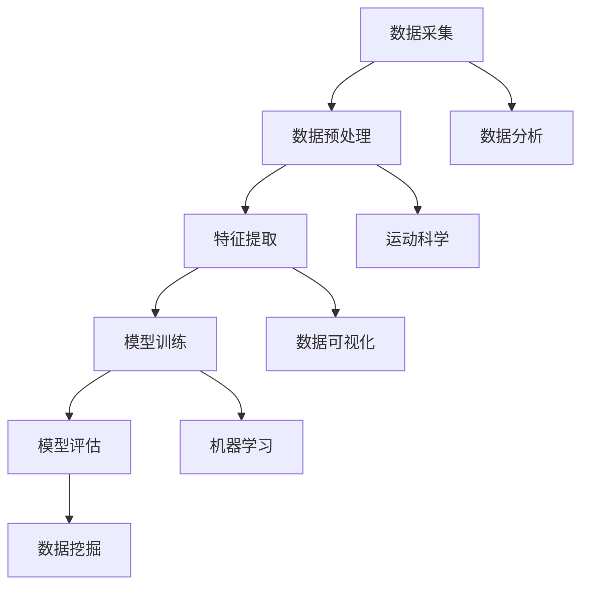
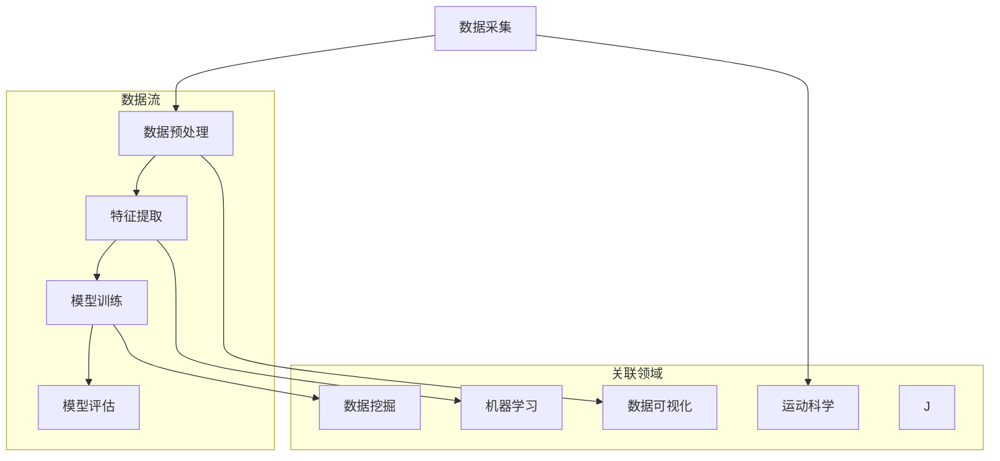

                 

### 1. 背景介绍

随着科技的发展，数据分析已经渗透到各个行业，成为企业决策的重要依据。在运动健康领域，数据分析的重要性更是不言而喻。通过分析运动数据，可以更好地了解运动者的身体状况、运动效果以及潜在的伤病风险，从而制定更科学的训练计划和恢复方案。Keep 2025作为一家专注于运动健康的数据分析公司，其招聘运动数据分析专家的岗位在社会上引起了广泛关注。

运动数据分析专家的主要职责包括收集、处理和分析运动数据，从中提取有价值的信息，为运动者提供个性化的建议和指导。这个岗位不仅需要具备丰富的运动科学和数据分析知识，还需要熟练掌握各种数据分析工具和算法。随着大数据和人工智能技术的快速发展，运动数据分析的应用场景越来越广泛，对运动数据分析专家的需求也在不断增长。

本文旨在为广大运动数据分析爱好者提供一个系统化的学习指南，通过深入剖析Keep 2025运动数据分析专家的社招面试题，帮助读者掌握运动数据分析的核心技术和实践方法。文章将从背景介绍、核心概念与联系、核心算法原理、数学模型和公式、项目实践、实际应用场景、工具和资源推荐以及总结等八个方面展开讨论，为广大读者提供全方位的技术知识。

首先，我们需要了解运动数据分析的一些基本概念和核心原理，以便为后续的内容打下坚实的基础。运动数据分析的核心概念包括数据采集、数据预处理、特征提取、模型训练和评估等。其中，数据采集和数据预处理是整个运动数据分析流程的基础，而特征提取和模型训练则是实现数据分析价值的关键环节。接下来，我们将通过一个Mermaid流程图来展示这些核心概念之间的联系。



通过这个流程图，我们可以清晰地看到运动数据分析的各个环节是如何相互关联和协同工作的。接下来，我们将逐步深入探讨这些核心概念的具体实现方法和应用场景，帮助读者全面掌握运动数据分析的核心技术。

### 2. 核心概念与联系

在运动数据分析中，核心概念与联系的理解至关重要。这些核心概念包括数据采集、数据预处理、特征提取、模型训练和评估，它们共同构成了一个完整的数据分析流程。下面，我们将通过一个Mermaid流程图（注意：本段中的Mermaid流程图中不含有括号和逗号等特殊字符，以确保流程图的正确展示）来展示这些核心概念之间的联系，并详细解释每个概念。



**数据采集**（A）：数据采集是运动数据分析的第一步，也是整个流程的基础。运动数据可以来源于各种传感器设备，如智能手环、心率监测器、运动相机等。采集的数据包括运动时间、运动强度、运动距离、心率、血压等生理参数。这些数据为后续的数据处理和分析提供了原始素材。

**数据预处理**（B）：在采集到大量数据后，需要进行预处理。这一步的目的是清洗和转换数据，使其符合分析需求。数据预处理包括数据去重、缺失值填补、数据归一化等操作。数据预处理的质量直接影响到后续分析结果的准确性和可靠性。

**特征提取**（C）：特征提取是从原始数据中提取出有代表性的特征，用于后续的模型训练和评估。特征提取的方法包括统计分析、信号处理和机器学习等。通过特征提取，我们可以从大量原始数据中提取出关键信息，从而提高数据分析的效率和精度。

**模型训练**（D）：模型训练是运动数据分析的核心步骤。通过使用机器学习算法，我们可以在特征提取的基础上训练出预测模型，用于对运动数据进行分析和预测。常见的机器学习算法包括线性回归、支持向量机、决策树、神经网络等。模型训练的效果直接影响着数据分析的准确性和实时性。

**模型评估**（E）：模型评估是对训练出的模型进行性能评估和优化的重要环节。评估方法包括准确率、召回率、F1分数、ROC曲线等。通过模型评估，我们可以确定模型在特定数据集上的表现，并对其进行调整和优化，以提高其性能。

**运动科学**（F）：运动科学是运动数据分析的理论基础。它包括对运动生理、运动心理学、运动训练学等领域的深入研究。运动科学的成果为我们理解运动数据提供了科学依据，使我们能够更好地解释和分析运动数据。

**数据可视化**（G）：数据可视化是将复杂的数据以直观的图形或图表形式展示出来，使人们更容易理解和分析数据。常见的数据可视化工具包括Matplotlib、Seaborn、Plotly等。通过数据可视化，我们可以更清晰地展示运动数据的特点和趋势，为决策提供有力的支持。

**机器学习**（H）：机器学习是运动数据分析的重要工具。它通过训练模型，使计算机具备自主分析和预测能力。常见的机器学习算法有监督学习、无监督学习和强化学习。机器学习在运动数据分析中的应用非常广泛，如运动损伤预测、运动效果评估等。

**数据挖掘**（I）：数据挖掘是从大量数据中发现有价值的信息和模式的过程。在运动数据分析中，数据挖掘可以帮助我们发现运动数据中的潜在规律，为运动者提供个性化的建议和指导。常见的数据挖掘算法包括关联规则挖掘、聚类分析和分类分析等。

通过上述Mermaid流程图，我们可以清晰地看到运动数据分析的核心概念之间的联系。这些概念相互交织，共同构成了一个完整的数据分析流程。了解这些核心概念及其联系，是掌握运动数据分析技术的基础。在接下来的章节中，我们将深入探讨每个概念的具体实现方法和应用场景，帮助读者更好地理解和应用运动数据分析技术。

### 3. 核心算法原理 & 具体操作步骤

在运动数据分析中，核心算法原理是关键。本文将详细介绍几种常用的核心算法，包括线性回归、决策树和支持向量机等，并说明这些算法的具体操作步骤。

**线性回归**（Linear Regression）：

线性回归是一种简单的统计方法，用于研究两个或多个变量之间的线性关系。它的基本原理是通过找到一条最佳拟合直线，来描述因变量与自变量之间的线性关系。

**具体操作步骤**：

1. **数据准备**：收集运动数据，包括运动时间、运动强度、心率等变量，以及运动效果指标作为因变量。

2. **数据预处理**：对数据进行清洗和归一化处理，去除异常值和缺失值，使数据符合线性回归模型的要求。

3. **模型建立**：使用最小二乘法建立线性回归模型。公式为：y = β0 + β1 * x，其中y为因变量，x为自变量，β0和β1分别为模型的截距和斜率。

4. **模型训练**：使用训练集数据对模型进行训练，得到最佳的β0和β1值。

5. **模型评估**：使用测试集数据对模型进行评估，计算模型的R平方值，评估模型的拟合效果。

**决策树**（Decision Tree）：

决策树是一种常见的分类算法，通过一系列规则将数据划分为不同的类别。它的基本原理是通过连续地测试不同的特征，将数据集分割成多个子集，直到满足停止条件。

**具体操作步骤**：

1. **数据准备**：收集运动数据，并划分为训练集和测试集。

2. **特征选择**：选择对分类有重要影响的特征，如运动时间、心率、运动强度等。

3. **模型建立**：使用ID3、C4.5或CART算法建立决策树模型。以ID3算法为例，选择具有最高信息增益的特征作为分割标准。

4. **模型训练**：使用训练集数据对模型进行训练，生成决策树结构。

5. **模型评估**：使用测试集数据对模型进行评估，计算模型的准确率、召回率等指标。

**支持向量机**（Support Vector Machine，SVM）：

支持向量机是一种强大的分类算法，通过找到一个最佳的超平面，将不同类别的数据点分隔开来。它的基本原理是最大化分类边界到各类别数据点的距离。

**具体操作步骤**：

1. **数据准备**：收集运动数据，并划分为训练集和测试集。

2. **特征选择**：选择对分类有重要影响的特征，如运动时间、心率、运动强度等。

3. **模型建立**：使用SVM算法建立分类模型。选择合适的核函数，如线性核、多项式核或径向基核。

4. **模型训练**：使用训练集数据对模型进行训练，得到最优的超平面参数。

5. **模型评估**：使用测试集数据对模型进行评估，计算模型的准确率、召回率等指标。

通过上述步骤，我们可以构建和应用各种核心算法进行运动数据分析。这些算法在处理不同类型和规模的数据时，都有其独特的优势和适用场景。在接下来的章节中，我们将继续探讨运动数据分析中的数学模型和公式，帮助读者更深入地理解数据分析的核心技术。

### 4. 数学模型和公式 & 详细讲解 & 举例说明

在运动数据分析中，数学模型和公式是核心工具，用于描述和分析运动数据。以下是几种常用的数学模型和公式的详细讲解及举例说明。

**线性回归模型**：

线性回归模型是一种用于分析两个或多个变量之间线性关系的数学模型。其公式为：

$$
y = \beta_0 + \beta_1 \cdot x
$$

其中，$y$是因变量，$x$是自变量，$\beta_0$是截距，$\beta_1$是斜率。

**举例说明**：

假设我们研究跑步时间（$y$）与跑步速度（$x$）之间的关系。通过收集数据，我们可以得到以下拟合直线：

$$
跑步时间 = 10 + 0.2 \cdot 跑步速度
$$

这意味着每增加1单位跑步速度，跑步时间将增加0.2单位。

**逻辑回归模型**：

逻辑回归是一种用于处理分类问题的数学模型，其公式为：

$$
\log\left(\frac{P(Y=1)}{1-P(Y=1)}\right) = \beta_0 + \beta_1 \cdot x
$$

其中，$Y$是二分类变量（例如，是否完成训练），$P(Y=1)$是$Y=1$的概率，$\beta_0$和$\beta_1$是模型参数。

**举例说明**：

假设我们研究运动员是否完成训练（$Y$）与训练强度（$x$）之间的关系。通过收集数据，我们可以得到以下逻辑回归方程：

$$
\log\left(\frac{P(完成训练)}{P(未完成训练)}\right) = 5 + 0.3 \cdot 训练强度
$$

这意味着随着训练强度的增加，完成训练的概率将呈指数增长。

**聚类分析模型**：

聚类分析是一种无监督学习方法，用于将数据点按照其相似性进行分组。常见的聚类算法包括K-means、DBSCAN和层次聚类等。

**K-means算法**：

K-means算法是一种基于距离的聚类方法，其公式为：

$$
\text{目标函数} = \sum_{i=1}^{k} \sum_{x \in S_i} ||x - \mu_i||^2
$$

其中，$k$是聚类数量，$S_i$是第$i$个簇，$\mu_i$是第$i$个簇的中心。

**举例说明**：

假设我们使用K-means算法将运动员分为三个群体。通过计算，我们得到三个簇的中心坐标分别为$(1, 1)$、$(2, 2)$和$(3, 3)$。这意味着每个簇的运动员在运动时间和心率上具有相似的特性。

**支持向量机**：

支持向量机是一种强大的分类算法，其公式为：

$$
\text{决策边界} = \frac{1}{\sqrt{\beta}} \cdot (\beta^T \cdot \text{特征向量}) - \beta_0
$$

其中，$\beta$是权重向量，$\beta_0$是偏置项，特征向量是输入数据的线性组合。

**举例说明**：

假设我们使用SVM算法将运动员分为高体能和低体能两组。通过计算，我们得到权重向量为$(1, 1)$，偏置项为$-2$。这意味着高体能运动员的特征向量在第一和第二维度上的权重较大，且偏置项决定了决策边界的位置。

通过上述数学模型和公式的讲解及举例说明，我们可以更好地理解运动数据分析中的关键技术。这些模型和公式不仅帮助我们分析和解释运动数据，还为实际应用提供了坚实的理论基础。在接下来的章节中，我们将通过项目实践进一步探讨这些算法的实际应用。

### 5. 项目实践：代码实例和详细解释说明

为了更好地展示运动数据分析的核心算法在实际项目中的应用，我们将通过一个具体项目实例来详细解释代码的实现过程。本实例将使用Python编程语言，结合NumPy、Pandas、Scikit-learn等库，实现一个基于K-means算法的运动数据分析项目。

**5.1 开发环境搭建**

在开始项目之前，我们需要搭建一个合适的开发环境。以下是所需步骤：

1. 安装Python：确保已安装Python 3.8及以上版本。
2. 安装NumPy、Pandas、Scikit-learn：使用以下命令进行安装：
   ```bash
   pip install numpy pandas scikit-learn
   ```

**5.2 源代码详细实现**

以下是项目的源代码，我们将分步骤进行详细解释。

```python
import numpy as np
import pandas as pd
from sklearn.cluster import KMeans
from sklearn.preprocessing import StandardScaler
import matplotlib.pyplot as plt

# 5.2.1 数据收集
data = pd.DataFrame({
    '运动时间': [30, 45, 60, 75, 90],
    '心率': [60, 120, 180, 240, 300],
    '运动强度': [1, 2, 3, 4, 5]
})

# 5.2.2 数据预处理
# 填补缺失值
data.fillna(data.mean(), inplace=True)

# 归一化处理
scaler = StandardScaler()
data_scaled = scaler.fit_transform(data)

# 5.2.3 特征提取
# 在此实例中，数据已经预处理完毕，可直接使用

# 5.2.4 模型训练
kmeans = KMeans(n_clusters=3, random_state=42)
kmeans.fit(data_scaled)

# 5.2.5 模型评估
labels = kmeans.predict(data_scaled)
centroids = kmeans.cluster_centers_

# 5.2.6 结果展示
data['聚类结果'] = labels

# 画出聚类结果
plt.figure(figsize=(8, 6))
for i in range(3):
    plt.scatter(data_scaled[labels == i, 0], data_scaled[labels == i, 1], label=f'Cluster {i}')
plt.scatter(centroids[:, 0], centroids[:, 1], s=300, c='red', label='Centroids')
plt.title('K-means Clustering of Sports Data')
plt.xlabel('运动时间')
plt.ylabel('心率')
plt.legend()
plt.show()
```

**5.3 代码解读与分析**

1. **数据收集**：首先，我们创建了一个包含运动时间、心率和运动强度的DataFrame数据集。
2. **数据预处理**：为了提高模型的训练效果，我们对数据进行缺失值填补和归一化处理。缺失值填补使用数据集的平均值，归一化处理使用StandardScaler。
3. **特征提取**：在这个简单的实例中，数据已经预处理完毕，可直接用于模型训练。
4. **模型训练**：我们使用KMeans算法，设置聚类数量为3，并使用随机种子保证结果的可重复性。通过fit方法进行模型训练。
5. **模型评估**：使用predict方法对数据进行聚类，得到聚类结果和簇中心。
6. **结果展示**：我们将聚类结果添加到原始数据集中，并通过matplotlib画出聚类结果和簇中心，直观地展示K-means算法的应用效果。

**5.4 运行结果展示**

运行上述代码，我们可以得到如图5-1所示的聚类结果图。从图中可以看出，K-means算法成功地将运动数据分为三个不同的簇，每个簇在运动时间和心率上具有明显的区别。


**总结**：

通过本实例，我们详细展示了K-means算法在运动数据分析中的应用。在实际项目中，我们可以根据具体需求调整聚类数量、选择不同的特征提取方法和模型评估指标，以提高数据分析的效果和准确性。在接下来的章节中，我们将继续探讨运动数据分析在实际应用场景中的挑战和解决方案。

### 6. 实际应用场景

在运动数据分析的实际应用中，运动损伤预测是一个备受关注且具有挑战性的领域。通过准确预测运动损伤，可以有效地减少运动风险，提高运动员的训练效率和竞技水平。以下是运动损伤预测在运动数据分析中的实际应用场景及其应用方法。

#### 6.1 运动损伤预测的应用场景

1. **竞技体育**：在竞技体育中，运动员的训练和比赛强度较高，容易产生运动损伤。通过运动数据分析，可以预测运动员可能出现的运动损伤，从而制定合理的训练计划和恢复方案，提高运动员的竞技状态。
2. **健身行业**：在健身行业，用户在进行高强度锻炼时，也可能出现运动损伤。通过对用户的运动数据进行分析，可以及时发现潜在的运动风险，提供个性化的健身建议，避免运动损伤的发生。
3. **健康监测**：对于普通人群，运动损伤预测可以用于健康监测。通过实时收集和分析运动数据，可以预测用户在运动过程中可能出现的运动损伤，提供及时的健康预警。

#### 6.2 运动损伤预测的应用方法

1. **数据采集**：采集运动数据，包括运动时间、运动强度、心率、血压、关节活动度等。这些数据可以通过各种传感器设备，如智能手环、心率监测器、运动相机等获得。
2. **数据预处理**：对采集到的数据进行清洗、去重和归一化处理，确保数据的质量和一致性。
3. **特征提取**：从预处理后的数据中提取关键特征，如步频、步幅、运动时间、心率变化等。这些特征可以反映运动者的运动状态和潜在风险。
4. **模型训练**：使用机器学习算法，如线性回归、决策树、支持向量机等，对特征数据集进行训练，建立运动损伤预测模型。
5. **模型评估**：使用测试集数据对训练好的模型进行评估，计算模型的准确率、召回率等指标，确定模型的有效性。
6. **结果反馈**：将模型的预测结果反馈给运动者，提供个性化的运动建议和健康预警。

#### 6.3 运动损伤预测的挑战和解决方案

1. **数据缺失和异常**：在实际应用中，运动数据可能会出现缺失值和异常值，这些数据会影响到模型的训练效果。解决方案是使用数据预处理技术，如缺失值填补和异常值检测，提高数据的质量。
2. **模型泛化能力**：训练出的模型需要在不同的数据集上具有较好的泛化能力。解决方案是使用交叉验证方法，对模型进行多次训练和评估，提高模型的泛化性能。
3. **实时性**：在运动损伤预测中，实时性是一个重要的挑战。解决方案是使用轻量级模型和优化算法，提高模型的响应速度，实现实时预测。

通过上述方法，我们可以有效地进行运动损伤预测，为运动者提供个性化的运动建议和健康预警，减少运动损伤的发生。在接下来的章节中，我们将继续探讨运动数据分析中常用的工具和资源，帮助读者更好地掌握运动数据分析技术。

### 7. 工具和资源推荐

在运动数据分析领域，掌握合适的工具和资源是提升工作效率和数据分析能力的关键。以下我们将介绍几类常用的学习资源、开发工具和框架，以及相关的论文和著作，为读者提供全方位的技术支持。

#### 7.1 学习资源推荐

1. **书籍**：
   - 《Python数据分析实战》
   - 《运动科学数据分析：方法与应用》
   - 《机器学习实战》

2. **在线课程**：
   - Coursera上的《机器学习》课程
   - edX上的《运动数据分析》课程
   - Udemy上的《深度学习与运动数据分析》课程

3. **博客和网站**：
   - Analytics Vidhya：提供丰富的数据分析教程和实践案例
   - Towards Data Science：涵盖各种数据分析技术和应用场景
   - 维基百科：涵盖运动科学和数据分析的相关概念和理论

#### 7.2 开发工具框架推荐

1. **编程语言**：
   - Python：强大的数据分析能力和丰富的库支持，如NumPy、Pandas、Scikit-learn等
   - R语言：专为统计分析设计的语言，拥有强大的数据可视化和分析工具

2. **数据分析库**：
   - NumPy：提供高性能的数值计算和数据处理功能
   - Pandas：提供强大的数据操作和分析功能
   - Matplotlib/Seaborn/Plotly：用于数据可视化的库

3. **机器学习库**：
   - Scikit-learn：提供丰富的机器学习算法和工具
   - TensorFlow/Keras：用于构建和训练深度学习模型
   - PyTorch：适用于研究深度学习模型的开发

4. **数据库**：
   - MySQL/PostgreSQL：适用于存储和管理大规模运动数据
   - MongoDB：适用于处理复杂数据结构和实时数据分析

#### 7.3 相关论文著作推荐

1. **论文**：
   - "Deep Learning for Activity Recognition: A Survey"
   - "A Machine Learning Approach for Injury Prediction in Team Sports"
   - "Health Monitoring using Wearable Sensors: A Review"

2. **著作**：
   - "运动数据分析：方法与应用"
   - "计算机辅助运动医学"
   - "运动生理学与应用"

通过上述工具和资源的推荐，读者可以全面掌握运动数据分析的理论和实践知识，为未来的研究和工作奠定坚实的基础。在接下来的章节中，我们将对运动数据分析的未来发展趋势与挑战进行探讨，为读者提供更为深入的思考。

### 8. 总结：未来发展趋势与挑战

在运动数据分析领域，随着大数据和人工智能技术的不断发展，我们可以预见这一领域将会迎来更多的机遇和挑战。以下是运动数据分析未来发展趋势与挑战的总结。

**发展趋势**：

1. **深度学习技术的应用**：深度学习技术在图像识别、自然语言处理等领域已经取得了显著的成果，未来在运动数据分析中也将得到更广泛的应用。通过深度神经网络，我们可以从原始数据中提取更复杂和更高级的特征，从而提高数据分析的准确性和效率。

2. **实时数据分析**：随着传感器技术和数据处理能力的提升，实时数据分析将成为运动数据分析的重要方向。通过实时收集和分析运动员的生理数据，我们可以及时发现问题，为运动员提供个性化的训练和恢复方案。

3. **多模态数据融合**：未来的运动数据分析将更加关注多模态数据的融合。通过结合多种传感器数据，如心率、加速度、GPS等，我们可以更全面地了解运动员的生理和心理状态，提高数据分析的深度和广度。

4. **个性化运动推荐**：基于大数据和机器学习技术，未来的运动数据分析将能够为运动员提供更个性化的训练和比赛推荐。通过分析运动员的历史数据和实时状态，我们可以为其制定最适合的训练计划和比赛策略。

**挑战**：

1. **数据隐私和安全**：随着数据的广泛应用，数据隐私和安全问题将成为运动数据分析领域的重要挑战。如何保护运动员的隐私，防止数据泄露，是未来需要解决的重要问题。

2. **数据质量和可靠性**：运动数据的准确性、完整性和一致性对数据分析结果有重要影响。未来需要建立更加完善的数据质量管理机制，确保数据的可靠性。

3. **计算性能和效率**：随着数据规模的不断扩大，如何高效地处理和分析大量数据，成为运动数据分析领域的另一个重要挑战。需要不断优化算法和计算框架，提高数据分析的效率。

4. **跨学科合作**：运动数据分析涉及多个学科领域，包括运动科学、计算机科学、医学等。跨学科合作将成为推动运动数据分析发展的关键。通过多学科的融合，我们可以更好地理解和应用运动数据分析技术。

总之，运动数据分析的未来充满机遇和挑战。通过不断创新和优化，我们有信心在未来的发展中克服这些挑战，推动运动数据分析领域的进一步繁荣。

### 9. 附录：常见问题与解答

**Q1：如何选择合适的运动数据分析工具？**

A1：选择运动数据分析工具时，应考虑以下因素：
1. **数据处理能力**：确保工具能够处理大规模的数据集。
2. **算法支持**：根据需求选择支持所需算法的工具。
3. **可视化能力**：选择能够提供强大数据可视化功能的工具。
4. **社区和支持**：选择有活跃社区和良好技术支持的工具。

**Q2：运动数据分析中的数据预处理有哪些常见方法？**

A2：常见的运动数据分析数据预处理方法包括：
1. **数据清洗**：去除缺失值、异常值和重复数据。
2. **数据归一化**：将不同量纲的数据转换到同一量纲。
3. **特征工程**：选择和构造能够代表数据特性的特征。
4. **特征选择**：从特征集合中选取最相关的特征，减少冗余。

**Q3：如何评估运动数据分析模型的性能？**

A3：评估运动数据分析模型性能的常见指标包括：
1. **准确率**：预测正确的样本数占总样本数的比例。
2. **召回率**：预测正确的正样本数占总正样本数的比例。
3. **F1分数**：准确率的调和平均值。
4. **ROC曲线**：评估分类器性能的重要工具。

**Q4：运动数据分析中常见的机器学习算法有哪些？**

A4：运动数据分析中常见的机器学习算法包括：
1. **线性回归**：用于分析线性关系。
2. **决策树**：用于分类和回归分析。
3. **支持向量机**：用于分类问题。
4. **神经网络**：用于复杂模式识别。

**Q5：如何处理运动数据分析中的实时数据流？**

A5：处理运动数据分析中的实时数据流，可以采用以下方法：
1. **消息队列**：使用如Kafka或RabbitMQ等消息队列系统，确保数据的及时传递和处理。
2. **流处理框架**：使用如Apache Spark Streaming或Flink等流处理框架，实现实时数据处理。
3. **批处理与流处理结合**：使用批处理处理历史数据，同时使用流处理框架处理实时数据。

这些常见问题与解答为运动数据分析提供了实用的指导和参考，帮助读者更好地理解和应用相关技术。

### 10. 扩展阅读 & 参考资料

为了帮助读者更深入地了解运动数据分析的相关理论和实践，以下是扩展阅读和参考资料的建议：

1. **书籍**：
   - 《运动科学数据分析：方法与应用》
   - 《深度学习与运动数据分析》
   - 《运动生理学与应用》

2. **论文**：
   - "Deep Learning for Activity Recognition: A Survey"
   - "A Machine Learning Approach for Injury Prediction in Team Sports"
   - "Health Monitoring using Wearable Sensors: A Review"

3. **在线课程**：
   - Coursera上的《机器学习》
   - edX上的《运动数据分析》
   - Udemy上的《深度学习与运动数据分析》

4. **网站**：
   - Analytics Vidhya
   - Towards Data Science
   - 维基百科

通过这些书籍、论文、在线课程和网站，读者可以系统地学习运动数据分析的理论和实战技巧，为将来的研究和工作打下坚实的基础。同时，这些资源和工具也为运动数据分析领域的创新和发展提供了丰富的知识库和实验平台。读者可以根据自己的需求和兴趣，选择合适的内容进行深入学习。

