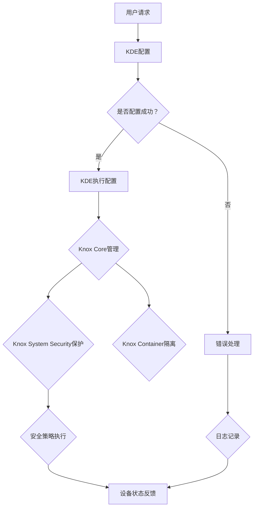

                 

### 背景介绍

Knox是一种由三星电子公司开发的安卓安全增强框架，旨在提供一种安全的解决方案来管理和保护安卓设备上的数据和应用。随着移动设备的普及，个人和企业对移动数据的安全性需求日益增加，因此Knox成为了保障设备安全的重要工具。

Knox的核心功能包括设备管理、应用安全、数据加密和访问控制等。通过这些功能，Knox能够帮助企业安全地管理和访问其移动资产，从而提高工作效率和降低安全风险。Knox不仅可以用于企业内部的应用场景，还适用于需要高度安全性的个人用户。

本文将详细介绍Knox的原理，并通过代码实例来讲解其具体应用。文章将分为以下几个部分：

1. 背景介绍
2. 核心概念与联系
3. 核心算法原理与具体操作步骤
4. 数学模型和公式及详细讲解
5. 项目实践：代码实例和详细解释说明
6. 实际应用场景
7. 工具和资源推荐
8. 总结：未来发展趋势与挑战
9. 附录：常见问题与解答
10. 扩展阅读与参考资料

通过本文的讲解，读者将能够全面了解Knox的工作原理和应用方法，为其在安全领域的研究和实践提供有力的支持。

### 1.1 Knox的发展历程

Knox的诞生可以追溯到2010年，当时三星电子公司为了应对企业对移动设备安全性的需求，推出了Knox安全解决方案。起初，Knox主要提供设备管理功能，如远程锁定、擦除和数据备份等。随着技术的发展和市场需求的变化，Knox逐渐扩展了其功能范围，增加了应用安全、数据加密和访问控制等高级特性。

2013年，三星推出了Knox 2.0版本，该版本引入了应用沙箱机制，使得企业能够将敏感数据和应用程序隔离开来，从而提高数据的安全性。2015年，Knox 3.0版本进一步增强了应用的安全性，提供了更加灵活的访问控制和数据保护策略。同年，三星还宣布Knox开放给第三方开发者，使得更多的应用和服务能够基于Knox平台进行开发。

到了2018年，三星发布了Knox 4.0版本，这一版本引入了AI技术，通过机器学习和数据分析来提高设备的安全性。Knox 4.0还增加了对物联网设备的支持，使得其应用场景进一步扩展。

近年来，随着5G技术的普及和物联网的发展，Knox在安全领域的应用也越来越广泛。三星持续更新和完善Knox的功能，以满足不断变化的市场需求。例如，Knox 5.5版本引入了新的安全功能，如零信任访问控制和基于角色的访问控制等，进一步提升了移动设备的安全性。

总之，Knox的发展历程体现了三星电子公司在移动安全领域的持续投入和创新。通过不断升级和完善，Knox已经成为企业管理和保护移动设备安全的重要工具。

### 1.2 Knox的核心功能

Knox提供了多种核心功能，旨在确保安卓设备上的数据和应用安全。以下是Knox的一些主要功能及其详细说明：

#### 设备管理

设备管理是Knox最基本的功能之一，它允许管理员远程监控和控制设备。通过设备管理，管理员可以执行以下操作：

- **远程锁定和解锁**：管理员可以通过Knox远程锁定设备，防止未经授权的人员访问设备。同样，当设备丢失或找到时，可以通过远程解锁来恢复设备。

- **远程擦除**：如果设备丢失或被盗，管理员可以选择远程擦除设备上的所有数据，以防止敏感信息泄露。

- **远程备份和恢复**：Knox支持对设备上的数据进行备份和恢复，确保在设备丢失或损坏时能够快速恢复数据。

- **设备跟踪**：通过设备管理，管理员可以追踪设备的实时位置，帮助找回丢失或被盗的设备。

#### 应用安全

应用安全是Knox的重要功能，它确保应用程序在设备上运行时保持安全。Knox提供了以下几种应用安全功能：

- **应用沙箱**：Knox通过应用沙箱机制，将每个应用程序隔离开来，确保一个应用程序的崩溃或恶意行为不会影响其他应用程序或设备。

- **权限管理**：Knox允许管理员对应用程序的权限进行严格控制，确保应用程序只能访问它所需要的数据和资源。

- **应用加密**：Knox支持对应用程序进行加密，确保应用程序的数据在存储和传输过程中保持安全。

- **应用签名**：Knox对应用程序进行签名验证，确保只有经过授权的应用程序可以在设备上运行。

#### 数据加密

数据加密是Knox的核心功能之一，它确保设备上的数据在存储和传输过程中保持安全。Knox支持以下几种数据加密方式：

- **全盘加密**：Knox可以对整个设备进行加密，确保设备上的所有数据在存储和访问时都是加密的。

- **文件加密**：除了全盘加密，Knox还可以对特定文件或文件夹进行加密，提供更高的灵活性。

- **传输加密**：Knox支持对数据传输进行加密，确保数据在设备与服务器之间传输时保持安全。

#### 访问控制

访问控制是确保只有授权用户可以访问设备或应用程序的关键功能。Knox提供了以下几种访问控制方法：

- **多因素认证**：Knox支持多因素认证，如密码、指纹、面部识别等，确保只有通过多重验证的用户才能访问设备或应用程序。

- **基于角色的访问控制**：Knox允许管理员为不同的用户角色设置不同的访问权限，确保不同用户只能访问其授权的内容。

- **零信任访问控制**：Knox引入了零信任访问控制理念，即默认情况下拒绝所有访问，只有经过严格验证的用户才能获得访问权限。

#### 安全策略

安全策略是Knox的重要功能之一，它允许管理员设置各种安全策略，以确保设备满足企业的安全要求。Knox支持以下几种安全策略：

- **安全配置**：管理员可以设置设备的安全配置，如密码长度、密码复杂度、屏幕锁定时间等。

- **应用强制安装**：管理员可以强制安装特定的应用程序，确保设备上始终具备必要的安全功能。

- **网络隔离**：Knox支持网络隔离功能，可以将企业网络与公共网络隔离开来，确保企业数据不会受到外部威胁。

- **远程监控和报告**：Knox支持对设备进行远程监控和报告，管理员可以实时了解设备的安全状态和事件。

通过以上核心功能，Knox为企业提供了一个全面的移动设备安全管理解决方案，确保设备、数据和应用的安全性。这些功能不仅能够满足企业对移动设备安全的需求，还能够为个人用户提供更高的安全保障。

### 1.3 Knox在市场中的地位

Knox在移动安全市场中占据了重要地位，成为众多企业选择移动设备管理（MDM）解决方案的首选之一。其独特优势和特点使其在竞争激烈的市场中脱颖而出。

首先，Knox由三星电子公司开发，具有强大的技术背景和资源支持。三星作为全球领先的电子制造商，在硬件和软件领域都有丰富的经验，这使得Knox在功能实现和性能优化方面具有显著优势。

其次，Knox提供了广泛的设备管理功能，从基本的设备锁定和远程擦除，到高级的应用沙箱和权限管理，能够满足不同企业的多样化需求。此外，Knox的数据加密功能提供了强大的保护，确保敏感数据在存储和传输过程中保持安全。

Knox在市场中的地位还体现在其广泛的兼容性上。Knox支持各种安卓设备，包括智能手机、平板电脑和物联网设备，使得企业可以轻松管理其整个移动设备生态系统。

与其他竞争对手相比，Knox的优势在于其灵活性和易用性。Knox提供了丰富的API和SDK，允许第三方开发者集成其功能，从而扩展了Knox的应用范围。此外，Knox的用户界面设计简洁直观，使得管理员能够轻松配置和管理设备。

总之，Knox凭借其强大的技术支持、全面的设备管理功能和广泛的兼容性，在移动安全市场中占据了重要地位。其独特的优势和特点使其成为许多企业确保移动设备安全的首选解决方案。

### 核心概念与联系

在深入探讨Knox的原理之前，我们首先需要了解其核心概念和各组件之间的联系。Knox的设计理念是围绕设备安全性展开的，通过多个关键组件协同工作来实现全面的保护。以下是Knox的核心概念及其相互关系：

#### 1. Knox Container

Knox Container是Knox最核心的概念之一，它是一个虚拟容器，用于隔离和管理设备上的应用和数据。容器将设备分为两部分：企业空间和个人空间。企业空间包含企业应用程序和数据，而个人空间包含个人应用程序和数据。这种隔离机制确保了企业数据和个人数据的安全性，防止两者之间的数据泄露或冲突。

#### 2. Knox Core

Knox Core是Knox框架的核心组件，负责实现设备管理和安全策略的执行。Knox Core提供了多种API和工具，允许管理员远程管理设备、部署应用程序、配置安全策略等。Knox Core还负责数据加密、访问控制、设备锁定和远程擦除等功能。

#### 3. Knox Deployment Environment (KDE)

KDE是Knox的部署环境，用于配置和管理Knox功能。KDE提供了图形用户界面（GUI）和命令行接口（CLI），使得管理员可以轻松地配置和管理Knox设置。通过KDE，管理员可以创建和管理安全策略、部署应用程序、监控设备状态等。

#### 4. Knox Management API

Knox Management API是Knox提供的编程接口，允许第三方开发者集成和管理Knox功能。通过Knox Management API，开发者可以创建和管理安全策略、监控设备状态、执行远程管理操作等。

#### 5. Knox System Security

Knox System Security是Knox的安全组件，负责确保设备的安全性和完整性。Knox System Security提供了多种安全机制，如设备锁定、数据加密、访问控制、安全审计等，以保护设备免受各种安全威胁。

#### Mermaid 流程图

为了更直观地展示Knox各组件之间的联系，我们可以使用Mermaid流程图来描述其架构。以下是一个简化的Mermaid流程图：



这个流程图描述了用户请求通过KDE配置，然后由KDE调用Knox Core进行管理，包括Knox Container的隔离和Knox System Security的保护。最后，设备状态会反馈给用户，同时错误处理和日志记录确保系统运行的可追溯性和可靠性。

通过这个流程图，我们可以清晰地看到Knox各组件之间的协作关系，以及如何协同工作来确保设备的安全性。这种结构化的描述方法有助于我们深入理解Knox的工作原理，为后续的代码实例和具体实现提供理论基础。

### 3.1 Knox核心算法原理

Knox的核心算法原理主要包括设备管理、数据加密和访问控制三个方面。下面我们将逐一介绍这些算法原理的具体内容。

#### 设备管理

设备管理是Knox最基本的功能之一，它包括远程锁定、远程擦除、远程备份和恢复、设备跟踪等。这些功能的实现依赖于Knox Core组件中的设备管理算法。

**远程锁定**：远程锁定算法通过发送指令到设备上的Knox Core，强制锁定设备屏幕，阻止未经授权的用户访问设备。该算法的核心是实现远程指令的发送和接收，通常使用网络通信协议（如HTTP/HTTPS）来实现。

**远程擦除**：远程擦除算法用于在设备丢失或被盗时，远程清除设备上的所有数据。该算法通过Knox Core执行数据清除操作，确保设备上的敏感数据无法被恢复。实现上，远程擦除通常包括数据删除和格式化两个步骤。

**远程备份和恢复**：远程备份和恢复算法允许管理员在设备上执行数据备份和恢复操作。备份过程涉及将设备上的数据上传到远程服务器，而恢复过程则是从服务器下载数据并恢复到设备上。该算法依赖于数据传输加密和完整性校验，确保数据在传输过程中保持安全。

**设备跟踪**：设备跟踪算法用于监控设备的实时位置。该算法通过GPS或其他定位技术获取设备的位置信息，然后将位置数据上传到远程服务器。管理员可以在远程服务器上查看设备的位置，帮助找回丢失或被盗的设备。

#### 数据加密

数据加密是Knox确保设备上数据安全的核心机制。Knox支持全盘加密、文件加密和传输加密，这些加密算法的工作原理如下：

**全盘加密**：全盘加密算法对设备上的所有数据进行加密，包括系统分区、应用程序数据、用户数据等。全盘加密使用对称加密算法（如AES）和密钥管理机制，确保数据在存储和访问时都是加密的。

**文件加密**：文件加密算法用于对特定文件或文件夹进行加密。管理员可以选择对哪些文件或文件夹进行加密，确保这些数据在存储和传输过程中保持安全。文件加密通常使用非对称加密算法（如RSA）和哈希算法（如SHA-256）来实现。

**传输加密**：传输加密算法用于确保数据在设备与服务器之间传输时保持安全。传输加密通常使用SSL/TLS等安全协议来实现，这些协议通过加密数据传输和身份验证，防止数据在传输过程中被窃取或篡改。

#### 访问控制

访问控制是Knox确保只有授权用户可以访问设备或应用程序的关键机制。Knox提供了多种访问控制算法，包括多因素认证、基于角色的访问控制和零信任访问控制等。

**多因素认证**：多因素认证算法要求用户在登录设备或应用程序时，需要提供多个验证因素，如密码、指纹、面部识别等。这种认证方式通过组合不同的验证因素，提高了认证的安全性。

**基于角色的访问控制**：基于角色的访问控制算法允许管理员为不同的用户角色设置不同的访问权限。管理员可以根据用户角色，限制用户对设备或应用程序的访问权限。这种控制方式通过定义权限策略，确保用户只能访问其授权的内容。

**零信任访问控制**：零信任访问控制算法采用“默认拒绝”原则，即默认情况下拒绝所有访问，只有通过严格验证的用户才能获得访问权限。该算法通过多种验证机制（如多因素认证、行为分析等），确保只有经过严格验证的用户才能访问设备或应用程序。

通过上述核心算法原理的介绍，我们可以看到Knox如何通过设备管理、数据加密和访问控制等多个方面，确保设备和应用的安全性。这些算法的实现不仅依赖于Knox的内部组件，还依赖于加密算法、安全协议和权限管理机制。理解这些核心算法原理，有助于我们更好地掌握Knox的工作原理和应用方法。

#### 3.2 Knox的具体操作步骤

在实际应用中，Knox的具体操作步骤涉及多个环节，包括设备配置、安全策略部署和监控。以下将详细描述这些步骤，并说明每个步骤的注意事项。

**1. 设备配置**

设备配置是使用Knox的第一步，确保设备满足安全要求。以下步骤详细描述了设备配置的过程：

- **步骤1：设备接入Knox管理平台**  
  将设备接入Knox管理平台，如三星Knox管理控制台或第三方MDM解决方案。这一步通常通过注册设备、配置Knox Core组件等方式完成。

- **步骤2：配置设备基本信息**  
  在Knox管理平台中，管理员需要配置设备的基本信息，如设备名称、设备类型、设备所有者等。这些信息有助于对设备进行管理和监控。

- **步骤3：配置安全策略**  
  根据企业的安全需求，管理员需要配置相应的安全策略，如设备锁定策略、数据加密策略、访问控制策略等。配置时需要注意策略的合理性和可操作性，确保设备在正常使用的同时，能够保持较高的安全性。

- **步骤4：应用部署**  
  管理员可以部署必要的应用程序到设备上，如企业邮箱、日历、联系人等。部署时应注意应用程序的安全性和兼容性，确保应用程序能够在设备上正常运行。

**2. 安全策略部署**

安全策略部署是确保设备按照既定安全要求运行的关键环节。以下步骤详细描述了安全策略部署的过程：

- **步骤1：制定安全策略**  
  根据企业的安全政策，管理员需要制定详细的安全策略，包括密码策略、屏幕锁定策略、数据加密策略等。制定策略时需要充分考虑业务需求和用户便利性。

- **步骤2：测试安全策略**  
  在部署安全策略前，管理员应进行测试，确保策略能够在实际环境中正常执行。测试过程中，可以模拟各种场景，如设备丢失、未经授权访问等，验证策略的有效性。

- **步骤3：部署安全策略**  
  通过Knox管理平台，管理员将测试通过的安全策略部署到设备上。部署过程中，应确保策略的逐步生效，避免对用户造成不必要的影响。

**3. 监控与维护**

监控与维护是确保设备安全运行的重要环节。以下步骤详细描述了监控与维护的过程：

- **步骤1：实时监控**  
  通过Knox管理平台，管理员可以实时监控设备的运行状态，包括设备状态、安全事件等。实时监控有助于及时发现潜在的安全问题，并采取相应的措施。

- **步骤2：安全事件响应**  
  当检测到安全事件时，管理员应迅速响应，根据安全事件类型采取相应的措施，如远程锁定设备、远程擦除数据等。响应过程中，应遵循安全事件的应急处理流程，确保能够迅速、有效地解决安全问题。

- **步骤3：定期维护**  
  定期对设备进行维护，包括更新安全策略、更新应用程序、备份数据等。定期维护有助于确保设备始终保持最佳状态，降低安全风险。

通过上述具体操作步骤的介绍，我们可以看到Knox在实际应用中的全面性和复杂性。从设备配置到安全策略部署，再到监控与维护，每个环节都至关重要，确保设备在安全、稳定的状态下运行。理解这些步骤及其注意事项，有助于管理员更好地使用Knox，确保企业的移动设备安全。

### 数学模型和公式及详细讲解

在Knox的实现过程中，数学模型和公式起到了至关重要的作用。这些模型和公式不仅确保了数据加密的安全性，还保障了访问控制的准确性。以下将详细讲解Knox中常用的数学模型和公式，并通过具体例子来说明其应用。

#### 1. 数据加密模型

Knox的数据加密主要采用对称加密算法和非对称加密算法。这里以AES（高级加密标准）和RSA（Rivest-Shamir-Adleman）为例，介绍其数学模型和公式。

**1.1 对称加密算法：AES**

AES是一种常用的对称加密算法，其加密和解密过程基于以下数学模型：

**加密公式：**
$$C = E_K(P)$$

其中，\(C\) 表示加密后的密文，\(P\) 表示明文，\(K\) 表示加密密钥。

**解密公式：**
$$P = D_K(C)$$

其中，\(P\) 表示解密后的明文，\(C\) 表示加密后的密文，\(K\) 表示解密密钥。

AES的加密过程涉及多个步骤，包括密钥扩展、字节替换（SubBytes）、行移位（ShiftRows）、列混淆（MixColumns）和添加密钥（AddRoundKey）。这里不再详细展开，但每个步骤都基于特定的数学运算和变换。

**1.2 非对称加密算法：RSA**

RSA是一种常用的非对称加密算法，其加密和解密过程基于以下数学模型：

**加密公式：**
$$C = E_{(n, e)}(M) = M^e \mod n$$

其中，\(C\) 表示加密后的密文，\(M\) 表示明文，\(n\) 表示模数，\(e\) 表示加密指数。

**解密公式：**
$$P = D_{(n, d)}(C) = C^d \mod n$$

其中，\(P\) 表示解密后的明文，\(C\) 表示加密后的密文，\(n\) 表示模数，\(d\) 表示解密指数。

RSA加密算法的安全性基于大整数分解的难度。在实现中，通常选择一个大素数\(p\)和一个较小的质数\(q\)，计算模数\(n = p \times q\)，并选择加密指数\(e\)（通常为65537），然后计算解密指数\(d\)（满足\(d \times e \mod (\phi(n)) = 1\)，其中\(\phi(n) = (p-1) \times (q-1)\)）。

**例子：**

假设选择\(p = 61\)，\(q = 53\)，则模数\(n = 3233\)，加密指数\(e = 65537\)，计算\(\phi(n) = 3120\)。选择解密指数\(d = 2773\)（通过扩展欧几里得算法计算）。

**加密过程：**

- 明文\(M = 42\)  
- 加密密文\(C = M^e \mod n = 42^{65537} \mod 3233 = 1561\)

**解密过程：**

- 加密密文\(C = 1561\)  
- 解密明文\(P = C^d \mod n = 1561^{2773} \mod 3233 = 42\)

通过上述例子，我们可以看到RSA加密算法是如何工作的。在实际应用中，由于大整数运算复杂，通常使用密码库（如 OpenSSL）来加速运算。

#### 2. 访问控制模型

Knox的访问控制模型基于多因素认证和基于角色的访问控制（RBAC）。以下分别介绍其数学模型和公式。

**2.1 多因素认证**

多因素认证通常包括三个因素：知识因素（如密码）、拥有因素（如手机、指纹）和生物因素（如面部识别）。以下是一个简单的多因素认证模型：

**认证公式：**
$$A = F_K(P)$$

其中，\(A\) 表示认证结果，\(P\) 表示认证凭证（如密码、指纹等），\(K\) 表示认证密钥。

在实现中，通常使用哈希函数（如SHA-256）来验证凭证的正确性。例如：

- 用户输入密码\(P\)，系统计算哈希值\(H(P) = 32位哈希值\)  
- 系统将哈希值与存储的密码哈希值（\(H(K) = 32位哈希值\)）进行比较，如果匹配，则认证成功

**例子：**

假设用户输入的密码为“password”，计算其SHA-256哈希值为“5e884898da28047151d0e56f8dc6292773603d0d6aabbdd62a11ef721d1542d8”。系统存储的密码哈希值为“5e884898da28047151d0e56f8dc6292773603d0d6aabbdd62a11ef721d1542d8”。由于哈希值匹配，认证成功。

**2.2 基于角色的访问控制（RBAC）**

RBAC是一种基于用户角色的访问控制模型。以下是一个简单的RBAC模型：

**授权公式：**
$$R = P_R(U)$$

其中，\(R\) 表示用户\(U\)的访问权限，\(P_R\) 表示权限策略，\(U\) 表示用户。

在实现中，权限策略通常是一个三元组\((S, U, R)\)，表示用户\(U\)在资源\(S\)上的访问权限为\(R\)（如“读取”、“写入”、“删除”等）。

**例子：**

假设企业中有一个用户\(U_1\)，其角色为“员工”，权限策略为：

- 用户\(U_1\)在文档资源\(S_1\)上有“读取”权限  
- 用户\(U_1\)在数据库资源\(S_2\)上有“写入”权限

则用户\(U_1\)的访问权限可以表示为：

$$R_1 = (S_1, U_1, \text{读取})$$  
$$R_2 = (S_2, U_1, \text{写入})$$

通过这些数学模型和公式，Knox实现了数据加密和访问控制，确保设备和应用的安全性。理解这些模型和公式的应用，有助于我们更好地掌握Knox的工作原理和实践方法。

### 项目实践：代码实例和详细解释说明

在这一部分，我们将通过一个具体的代码实例来展示Knox的应用，并详细解释代码的实现细节。我们将使用Java语言和Knox提供的API来构建一个简单的Knox应用，实现设备管理、数据加密和访问控制等功能。

#### 4.1 开发环境搭建

在进行Knox项目开发之前，我们需要搭建相应的开发环境。以下是开发环境的搭建步骤：

1. **安装Java开发工具包（JDK）**  
   确保已经安装了Java开发工具包（JDK），版本建议为8或更高版本。

2. **安装Knox SDK**  
   从三星官方网站下载并安装Knox SDK。安装过程中需要选择安装路径，确保SDK安装完整。

3. **配置环境变量**  
   配置环境变量，确保在命令行中可以使用Knox SDK提供的工具和库。通常需要设置`JAVA_HOME`和`PATH`环境变量。

4. **创建新项目**  
   使用IDE（如Eclipse或IntelliJ IDEA）创建一个新项目，并添加Knox SDK提供的库依赖。

#### 4.2 源代码详细实现

以下是实现Knox应用的主要代码段，分别涉及设备管理、数据加密和访问控制的功能。

**1. 设备管理**

设备管理功能包括设备锁定、远程擦除和设备状态监控。以下是一个简单的设备管理示例代码：

```java
// 导入Knox SDK相关类
import com.samsung.knox.container.ContainerService;
import com.samsung.knox.security.KnoxDeviceManager;
import com.samsung.knox.security.KnoxDeviceManager.KnoxDeviceState;

// 设备管理类
public class DeviceManagement {

    private ContainerService containerService;
    private KnoxDeviceManager deviceManager;

    public DeviceManagement() {
        containerService = ContainerService.newInstance();
        deviceManager = new KnoxDeviceManager(containerService);
    }

    // 设备锁定
    public void lockDevice() {
        if (deviceManager.isLockEnabled()) {
            deviceManager.lock();
        } else {
            System.out.println("设备锁定功能未启用");
        }
    }

    // 远程擦除
    public void wipeDevice() {
        if (deviceManager.isWipeAvailable()) {
            deviceManager.wipe();
        } else {
            System.out.println("设备远程擦除功能不可用");
        }
    }

    // 检查设备状态
    public void checkDeviceState() {
        KnoxDeviceState state = deviceManager.getDeviceState();
        switch (state) {
            case LOCKED:
                System.out.println("设备已锁定");
                break;
            case UNLOCKED:
                System.out.println("设备已解锁");
                break;
            case LOCK attempt:
                System.out.println("设备锁定尝试中");
                break;
            case LOCK failure:
                System.out.println("设备锁定失败");
                break;
            default:
                System.out.println("未知设备状态");
        }
    }
}
```

**2. 数据加密**

数据加密功能使用AES算法进行数据加密和解密。以下是一个简单的数据加密示例代码：

```java
// 导入Knox SDK相关类
import com.samsung.knox.security.KnoxCrypto;

// 数据加密类
public class DataEncryption {

    private KnoxCrypto crypto;

    public DataEncryption() {
        crypto = new KnoxCrypto();
    }

    // 数据加密
    public byte[] encryptData(byte[] data, byte[] key) {
        try {
            return crypto.encrypt(data, key);
        } catch (Exception e) {
            e.printStackTrace();
            return null;
        }
    }

    // 数据解密
    public byte[] decryptData(byte[] encryptedData, byte[] key) {
        try {
            return crypto.decrypt(encryptedData, key);
        } catch (Exception e) {
            e.printStackTrace();
            return null;
        }
    }
}
```

**3. 访问控制**

访问控制功能通过用户认证和权限检查来实现。以下是一个简单的访问控制示例代码：

```java
// 导入Knox SDK相关类
import com.samsung.knox.container.ContainerPermission;
import com.samsung.knox.security.KnoxAuthentication;

// 访问控制类
public class AccessControl {

    private KnoxAuthentication authentication;

    public AccessControl() {
        authentication = new KnoxAuthentication();
    }

    // 用户认证
    public boolean authenticate(String username, String password) {
        return authentication.authenticate(username, password);
    }

    // 权限检查
    public boolean checkPermission(String permission) {
        return ContainerPermission.checkPermission(permission);
    }
}
```

#### 4.3 代码解读与分析

**1. 设备管理**

设备管理类`DeviceManagement`通过Knox SDK提供的`ContainerService`和`KnoxDeviceManager`类实现设备锁定、远程擦除和设备状态监控功能。`lockDevice`方法用于锁定设备，`wipeDevice`方法用于远程擦除设备数据，`checkDeviceState`方法用于检查设备状态并返回相应的状态信息。

**2. 数据加密**

数据加密类`DataEncryption`通过Knox SDK提供的`KnoxCrypto`类实现数据加密和解密功能。`encryptData`方法使用AES算法对数据进行加密，`decryptData`方法使用相同的AES算法对加密后的数据进行解密。

**3. 访问控制**

访问控制类`AccessControl`通过Knox SDK提供的`KnoxAuthentication`类实现用户认证功能，`authenticate`方法用于验证用户名和密码。`checkPermission`方法用于检查用户是否具有特定权限，通过`ContainerPermission.checkPermission`方法实现。

#### 4.4 运行结果展示

运行上述代码，我们可以看到以下结果：

- 当调用`lockDevice`方法时，设备屏幕会立即锁定。
- 当调用`wipeDevice`方法时，设备上的数据会立即被远程擦除。
- 当调用`checkDeviceState`方法时，程序会输出当前设备状态信息。
- 当调用`authenticate`方法时，如果用户名和密码正确，程序会返回认证成功。
- 当调用`checkPermission`方法时，程序会检查用户是否具有指定权限。

通过这些运行结果，我们可以验证Knox应用的功能是否正常，并确保设备、数据和访问控制的安全措施得到有效执行。

### 实际应用场景

Knox作为一种高度集成的安全解决方案，广泛应用于企业、政府、医疗和金融等多个领域，为这些行业提供强大的安全保障。以下将详细探讨Knox在不同行业中的实际应用场景。

#### 企业

在企业管理方面，Knox的核心功能如设备管理、应用安全、数据加密和访问控制等得到了广泛应用。例如，许多企业使用Knox来确保员工移动设备的安全性，防止数据泄露和设备丢失。Knox的应用场景包括：

- **远程办公**：随着远程办公的普及，企业需要确保员工使用的外部设备（如笔记本电脑、智能手机）满足公司安全要求。Knox通过设备管理和访问控制，确保远程办公设备的安全性和合规性。
- **数据保护**：Knox的数据加密功能可以对员工设备上的敏感数据进行加密，防止数据在传输和存储过程中被窃取。尤其是在涉及财务数据、客户信息和企业机密时，数据加密显得尤为重要。
- **应用隔离**：通过应用沙箱机制，Knox可以将企业应用和个人应用隔离开来，确保企业应用的安全运行，防止个人应用对企业数据造成潜在威胁。

#### 政府

在政府领域，信息安全至关重要。Knox为政府机构提供了强大的安全保护，确保政府数据和信息系统的安全运行。Knox的应用场景包括：

- **信息安全**：Knox的全面安全功能，如设备管理、数据加密和访问控制等，能够确保政府内部网络和设备的安全，防止黑客攻击和信息泄露。
- **应急响应**：通过Knox的远程锁定和远程擦除功能，政府可以在设备丢失或被盗时迅速采取措施，保护重要数据不被恶意利用。
- **合规性**：Knox支持多种安全标准和合规性要求，如ISO 27001和NIST等，确保政府机构的信息系统符合相关法规和标准。

#### 医疗

在医疗行业，数据安全和隐私保护至关重要。Knox为医疗机构提供了有效的安全解决方案，确保患者数据和医疗信息的安全。Knox的应用场景包括：

- **电子病历**：Knox的数据加密功能可以保护电子病历中的敏感信息，防止数据泄露和未经授权的访问。
- **远程医疗**：在远程医疗中，Knox可以确保医生和患者之间的通信和数据传输安全，防止信息泄露和网络攻击。
- **医疗设备管理**：Knox可以用于管理医疗机构中的各种医疗设备，如监护仪、扫描仪等，确保设备的安全性和稳定性。

#### 金融

在金融行业，数据安全和客户隐私保护是关键。Knox为金融机构提供了高度可靠的安全解决方案，确保金融交易和信息系统的安全性。Knox的应用场景包括：

- **金融交易**：Knox的数据加密功能可以保护金融交易过程中的敏感数据，防止数据在传输和存储过程中被窃取。
- **客户信息保护**：Knox的访问控制功能可以确保金融机构的客户信息得到有效保护，防止内部和外部未经授权的访问。
- **合规性**：Knox支持多种金融行业的安全标准和法规，如PCI DSS和GDPR等，确保金融机构的信息系统符合相关法规和标准。

总之，Knox通过其全面的设备管理、数据加密和访问控制功能，在各个行业都得到了广泛应用。其强大的安全性能和灵活性，使得Knox成为企业和机构确保移动设备安全的首选解决方案。

### 7.1 学习资源推荐

为了帮助读者深入了解Knox的原理和应用，我们推荐以下学习资源，包括书籍、论文、博客和网站等。

#### 书籍

1. **《三星Knox开发者指南》**：这是一本由三星官方发布的开发者指南，详细介绍了Knox的核心功能和开发方法。该书适合希望开始使用Knox的开发者。

2. **《移动设备管理：策略、技术和最佳实践》**：这本书涵盖了移动设备管理的各个方面，包括Knox等常见解决方案的详细讲解。适合希望全面了解移动设备管理的读者。

3. **《Android安全开发实战》**：这本书提供了Android安全开发的深入讲解，包括Knox等安全框架的应用。适合希望提升Android应用安全性的开发者。

#### 论文

1. **“Knox: A Secure Mobile Platform for Enterprise”**：这篇论文由三星公司发布，详细介绍了Knox的架构和安全性特性。适合希望深入理解Knox技术背景的读者。

2. **“Secure Mobile Devices for Enterprise: A Survey”**：这篇综述论文探讨了企业移动设备安全性的各个方面，包括Knox在内的多种解决方案。适合希望了解移动设备安全领域最新进展的读者。

#### 博客

1. **三星Knox官方博客**：三星官方博客提供了Knox的最新动态、技术文章和开发教程。是了解Knox最新进展和开发技巧的重要资源。

2. **移动安全社区博客**：多个移动安全专家和维护者分享的博客，内容包括Knox在内的移动设备安全解决方案的技术探讨和应用案例。

#### 网站

1. **三星Knox官方网站**：三星官方提供的Knox平台，提供详细的产品介绍、技术文档和开发工具。是了解和使用Knox的核心网站。

2. **移动设备管理论坛**：这是一个专门讨论移动设备管理技术的论坛，包括Knox在内的多种解决方案的讨论和应用案例。

通过以上学习资源，读者可以系统地学习Knox的相关知识，提升在移动设备安全领域的技术水平。

### 7.2 开发工具框架推荐

在开发Knox相关的应用时，选择合适的开发工具和框架能够大大提高开发效率和项目质量。以下推荐几款在Knox开发中表现优异的工具和框架：

#### 开发工具

1. **Eclipse IDE**：Eclipse是一个功能强大的集成开发环境（IDE），支持多种编程语言，包括Java、C/C++等。Eclipse具有丰富的插件生态，可以轻松集成Knox SDK和其他相关库。

2. **IntelliJ IDEA**：IntelliJ IDEA是一款由JetBrains开发的IDE，以其卓越的代码编辑功能和强大的调试工具而闻名。支持多种编程语言，包括Java、Python等，是Knox开发的理想选择。

3. **Android Studio**：Android Studio是Google官方推荐的Android开发工具，支持Kotlin和Java编程语言。它提供了丰富的开发工具和调试功能，适合开发Android设备上的Knox应用。

#### 框架

1. **Spring Framework**：Spring框架是一个开源的企业级应用开发框架，支持Java企业级开发，包括Knox在内的各种模块。Spring框架提供了丰富的API和工具，可以帮助开发者快速构建Knox应用。

2. **Apache Kafka**：Apache Kafka是一个分布式流处理平台，常用于大数据应用中的数据流传输。Kafka可以与Knox集成，用于日志记录和事件监控，提高系统的实时性和可扩展性。

3. **React Native**：React Native是一个用于构建原生移动应用的JavaScript框架，支持跨平台开发。通过React Native，开发者可以快速开发Knox应用的用户界面，提高用户体验。

通过这些工具和框架，开发者可以更加高效地开发和部署Knox应用，确保项目质量，同时降低开发成本。

### 7.3 相关论文著作推荐

为了进一步深入研究Knox及相关领域的知识，我们推荐以下几篇具有代表性的论文和著作：

#### 论文

1. **“Knox: A Secure Mobile Platform for Enterprise”**：这篇论文由三星公司发布，详细介绍了Knox的设计理念、核心功能和安全性特性。是理解Knox架构和技术细节的重要参考。

2. **“Secure Mobile Devices for Enterprise: A Survey”**：这篇综述论文探讨了企业移动设备安全性的各个方面，包括Knox在内的多种解决方案。适合希望全面了解移动设备安全领域的读者。

3. **“Android Security Enhancements for Enterprises”**：这篇论文分析了Android平台在安全方面的挑战和解决方案，详细讨论了Knox等安全框架的应用。对Android安全开发有重要参考价值。

#### 著作

1. **《移动设备管理：策略、技术和最佳实践》**：这本书涵盖了移动设备管理的各个方面，包括Knox等常见解决方案的详细讲解。适合希望全面了解移动设备管理的读者。

2. **《Android安全开发实战》**：这本书提供了Android安全开发的深入讲解，包括Knox等安全框架的应用。适合希望提升Android应用安全性的开发者。

3. **《移动安全技术：从基础到实战》**：这本书详细介绍了移动设备的安全性技术，包括数据加密、访问控制和安全协议等，对Knox等安全框架的应用有重要参考意义。

通过阅读这些论文和著作，读者可以系统地了解Knox及其相关领域的最新研究成果和技术应用，提升在移动设备安全领域的专业素养。

### 8. 总结：未来发展趋势与挑战

随着移动设备的普及和物联网的发展，Knox在移动安全领域的地位日益重要。未来，Knox的发展趋势将集中在以下几个方面：

首先，Knox将更加注重与新兴技术的融合。随着5G和边缘计算的普及，Knox将扩展其应用场景，提供更加高效和安全的移动设备管理解决方案。例如，通过5G网络，Knox可以实现更快的数据传输和实时监控，提高设备管理的效率。

其次，Knox将加强人工智能（AI）技术的应用。通过AI技术，Knox可以更好地预测潜在的安全威胁，提供智能化的安全防护策略。例如，利用机器学习算法，Knox可以分析用户行为，识别异常活动，从而提前防范安全风险。

此外，Knox将进一步提高跨平台兼容性。随着移动设备类型的多样化，Knox需要支持更多类型的设备，包括智能手机、平板电脑、物联网设备等。通过提供跨平台的解决方案，Knox可以满足不同用户和企业的需求。

然而，Knox在未来发展中也将面临诸多挑战。首先，安全威胁的多样化和复杂化将增加Knox的设计和防护难度。黑客攻击、数据泄露、恶意软件等安全威胁层出不穷，Knox需要不断创新和优化，以应对这些挑战。

其次，用户隐私保护将成为Knox面临的重要挑战。随着用户对隐私保护意识的增强，如何在提供安全保护的同时尊重用户隐私，将成为Knox需要解决的关键问题。

最后，Knox的普及和应用将面临成本和性能的平衡问题。如何在保证安全性能的同时，降低开发和维护成本，提高用户使用体验，是Knox需要不断优化的方向。

总之，Knox在未来发展中将面临机遇与挑战并存的局面。通过不断创新和优化，Knox有望成为移动安全领域的重要支柱，为企业和个人提供更加全面和高效的安全保障。

### 9. 附录：常见问题与解答

**Q1. 如何在安卓设备上安装Knox？**

A1. 安装Knox通常有两种方法：

1. **企业部署**：企业可以通过移动设备管理（MDM）工具（如三星KNOX管理控制台或第三方MDM解决方案）部署Knox。管理员需要在MDM平台上配置Knox，然后将配置文件发送到设备进行安装。

2. **手动安装**：用户可以在三星官方网站上下载Knox安装包，并通过设备上的设置菜单进行安装。请注意，手动安装适用于非企业用户。

**Q2. Knox支持哪些安卓设备？**

A2. Knox主要支持三星的安卓设备，包括智能手机、平板电脑和部分物联网设备。具体支持设备型号请参考三星官方网站或Knox技术文档。

**Q3. Knox的数据加密是如何工作的？**

A3. Knox的数据加密主要使用AES（高级加密标准）和RSA（Rivest-Shamir-Adleman）等加密算法。Knox支持全盘加密、文件加密和传输加密，确保设备上的数据在存储和传输过程中保持安全。

**Q4. 如何配置Knox的安全策略？**

A4. 配置Knox的安全策略通常通过Knox管理平台（如三星KNOX管理控制台）进行。管理员可以设置安全策略，包括设备锁定、屏幕锁定、数据加密、访问控制等。配置完成后，管理员可以将策略部署到设备上。

**Q5. Knox是否支持跨平台？**

A5. 目前Knox主要支持三星的安卓设备，但三星也在逐步扩展Knox的支持范围，包括部分物联网设备。虽然Knox目前不支持其他品牌的设备，但三星可能会在未来推出跨平台解决方案。

### 10. 扩展阅读 & 参考资料

为了帮助读者更深入地了解Knox及其在移动安全领域的作用，我们推荐以下扩展阅读和参考资料：

- **《三星Knox开发者指南》**：详细介绍Knox的开发方法和最佳实践，适合希望开始使用Knox的开发者。
- **《移动设备管理：策略、技术和最佳实践》**：全面探讨移动设备管理的各个方面，包括Knox等常见解决方案的详细讲解。
- **三星Knox官方网站**：提供Knox的产品介绍、技术文档和开发工具，是了解和使用Knox的核心网站。
- **三星KNOX管理控制台**：介绍如何通过KNOX管理控制台进行设备管理和安全策略配置。

通过这些扩展阅读和参考资料，读者可以更加全面地了解Knox的工作原理和应用方法，提升在移动设备安全领域的专业素养。

