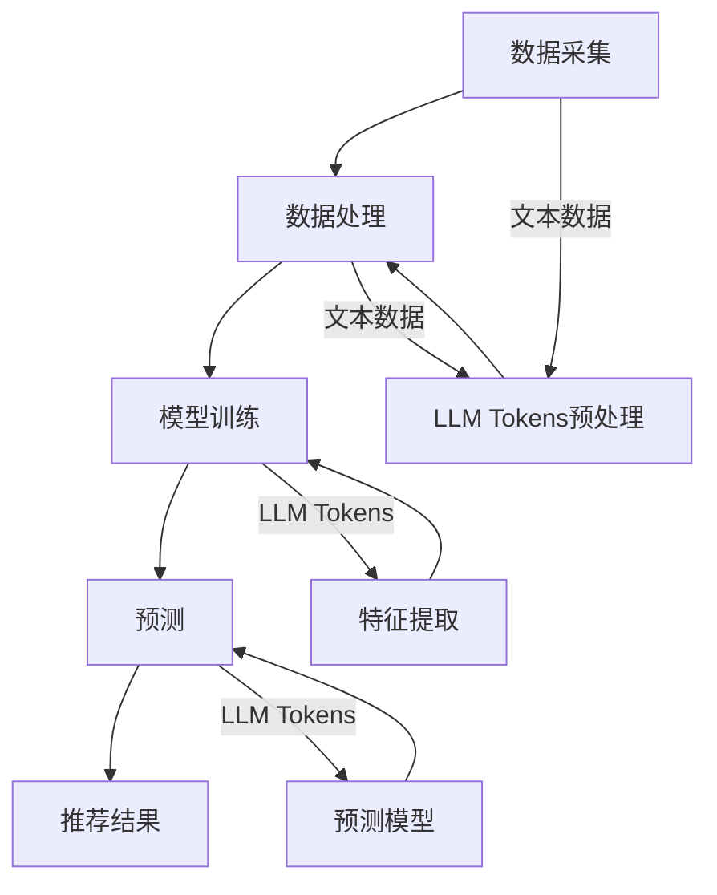

                 

### 文章标题：LLM Tokens+推荐系统的建模范式

> 关键词：LLM Tokens、推荐系统、模型构建、算法原理、数学模型、项目实践

> 摘要：本文将探讨如何利用Large Language Model (LLM) Tokens构建推荐系统。通过详细解析核心概念、算法原理、数学模型及项目实践，旨在为读者提供一个清晰、易懂的建模范式，助力开发者打造高效、智能的推荐系统。

### 1. 背景介绍

随着互联网的快速发展，推荐系统已经成为许多企业和平台的核心竞争力之一。传统的推荐系统主要依赖于用户行为数据和内容特征，通过协同过滤、基于内容的推荐等方法进行建模和预测。然而，随着大数据和人工智能技术的兴起，新一代的推荐系统开始引入大规模语言模型（Large Language Model, LLM）。

LLM Tokens作为LLM中的重要组成部分，在推荐系统中扮演着关键角色。LLM Tokens不仅能够捕捉用户和物品的语义信息，还能通过自动编码器（Autoencoder）等技术实现特征提取和降维。这使得LLM Tokens在构建推荐系统时具有更高的灵活性和表现力。

本文将围绕LLM Tokens在推荐系统中的应用，详细探讨其核心概念、算法原理、数学模型及项目实践，帮助开发者掌握构建高效、智能推荐系统的方法。

### 2. 核心概念与联系

#### 2.1 LLM Tokens概述

LLM Tokens是Large Language Model中的基本元素，用于表示文本中的词汇、短语和语义信息。与传统的词袋模型（Bag of Words, BoW）和词嵌入（Word Embedding）不同，LLM Tokens能够更精确地捕捉文本的语义和上下文信息。

在LLM Tokens中，每个Token都被赋予了独特的ID，用于标识其在模型中的位置和含义。此外，LLM Tokens还具备以下特点：

1. **可扩展性**：LLM Tokens能够灵活地扩展，以适应不同规模的数据集和应用场景。
2. **语义丰富**：LLM Tokens不仅包含词汇信息，还能捕捉到词汇之间的关系和上下文语义。
3. **自适应特征提取**：LLM Tokens可以通过自动编码器等深度学习技术实现特征提取和降维，提高推荐系统的表现力。

#### 2.2 推荐系统架构

推荐系统通常由数据采集、数据处理、模型训练和预测四个主要环节组成。在引入LLM Tokens后，推荐系统的架构将发生以下变化：

1. **数据采集**：采集用户行为数据、物品属性数据及文本数据，其中文本数据将采用LLM Tokens进行预处理。
2. **数据处理**：对采集到的数据进行清洗、去重、归一化等操作，以减少噪声和提高数据质量。对于文本数据，采用LLM Tokens进行分词、编码和特征提取。
3. **模型训练**：构建基于LLM Tokens的推荐模型，通过训练数据学习用户和物品的语义特征，以及它们之间的关联关系。
4. **预测**：将待预测的用户和物品输入到训练好的模型中，根据模型输出的概率分布进行推荐。

#### 2.3 Mermaid流程图

以下是一个简化的LLM Tokens推荐系统流程图，用于展示核心概念和架构之间的联系：



### 3. 核心算法原理 & 具体操作步骤

#### 3.1 自动编码器（Autoencoder）

自动编码器是一种无监督学习算法，用于将输入数据转换为低维表示，同时保持数据的主要特征。在LLM Tokens推荐系统中，自动编码器主要用于特征提取和降维。

具体操作步骤如下：

1. **输入数据预处理**：将原始文本数据转换为LLM Tokens，并将其输入到自动编码器。
2. **编码器训练**：训练编码器，使其能够将输入文本数据映射到低维表示。
3. **解码器训练**：训练解码器，使其能够将编码后的低维表示映射回原始文本数据。
4. **特征提取**：使用训练好的编码器对输入文本数据进行编码，得到低维特征表示。
5. **降维**：对编码后的低维特征进行降维，以减少数据维度和提高计算效率。

#### 3.2 协同过滤（Collaborative Filtering）

协同过滤是一种基于用户行为和物品属性的推荐算法，用于预测用户对未知物品的评分。在LLM Tokens推荐系统中，协同过滤与自动编码器相结合，用于构建用户和物品的语义特征。

具体操作步骤如下：

1. **用户行为数据采集**：采集用户的浏览、点击、购买等行为数据。
2. **物品属性数据采集**：采集物品的标题、描述、标签等属性数据。
3. **LLM Tokens预处理**：将用户行为数据和物品属性数据转换为LLM Tokens。
4. **特征提取**：使用自动编码器对LLM Tokens进行编码，得到用户和物品的低维特征表示。
5. **相似度计算**：计算用户和物品之间的相似度，基于相似度进行推荐。

#### 3.3 基于内容的推荐（Content-based Filtering）

基于内容的推荐是一种基于物品特征进行推荐的方法，通过分析用户的历史行为和兴趣，为用户推荐相似的内容。在LLM Tokens推荐系统中，基于内容的推荐与自动编码器和协同过滤相结合，提高推荐系统的多样性。

具体操作步骤如下：

1. **用户兴趣分析**：分析用户的历史行为数据，提取用户的兴趣标签和关键词。
2. **物品特征提取**：使用自动编码器对物品的标题、描述、标签等属性进行编码，得到低维特征表示。
3. **相似度计算**：计算用户兴趣标签和物品特征之间的相似度，基于相似度进行推荐。
4. **融合推荐**：将协同过滤和基于内容的推荐结果进行融合，提高推荐系统的准确性和多样性。

### 4. 数学模型和公式 & 详细讲解 & 举例说明

#### 4.1 自动编码器数学模型

自动编码器主要由编码器（Encoder）和解码器（Decoder）两部分组成。编码器将输入数据映射到低维空间，解码器将低维数据映射回原始空间。以下是自动编码器的数学模型：

1. **编码器**：

$$
x' = \sigma(W_1 \cdot x + b_1)
$$

其中，$x$为输入数据，$W_1$为编码器权重，$b_1$为编码器偏置，$\sigma$为激活函数。

2. **解码器**：

$$
x = \sigma(W_2 \cdot x' + b_2)
$$

其中，$x'$为编码后的低维数据，$W_2$为解码器权重，$b_2$为解码器偏置，$\sigma$为激活函数。

3. **损失函数**：

自动编码器的损失函数通常采用均方误差（Mean Squared Error, MSE）：

$$
L = \frac{1}{n} \sum_{i=1}^{n} (x - \sigma(W_2 \cdot \sigma(W_1 \cdot x + b_1) + b_2))^2
$$

其中，$n$为样本数量。

#### 4.2 协同过滤数学模型

协同过滤算法基于用户和物品的评分矩阵进行建模。以下是协同过滤的数学模型：

1. **用户相似度计算**：

$$
sim(u, v) = \frac{\sum_{i \in I} r_{ui} r_{vi}}{\sqrt{\sum_{i \in I} r_{ui}^2 \sum_{i \in I} r_{vi}^2}}
$$

其中，$r_{ui}$为用户$u$对物品$i$的评分，$I$为用户$u$和用户$v$共同评分的物品集合。

2. **预测用户对物品的评分**：

$$
r_{uv} = \sum_{i \in I} sim(u, v) r_{vi}
$$

其中，$r_{uv}$为用户$u$对物品$v$的预测评分。

#### 4.3 基于内容的推荐数学模型

基于内容的推荐算法主要计算用户兴趣标签和物品特征之间的相似度。以下是基于内容的推荐数学模型：

1. **计算用户兴趣标签与物品特征的相似度**：

$$
sim(t, f) = \frac{\sum_{i \in I} t_i f_i}{\sqrt{\sum_{i \in I} t_i^2 \sum_{i \in I} f_i^2}}
$$

其中，$t$为用户兴趣标签向量，$f$为物品特征向量，$I$为用户兴趣标签和物品特征共同存在的维度。

2. **计算用户兴趣标签与物品特征的相似度**：

$$
sim(t, f) = \frac{\sum_{i \in I} t_i f_i}{\sqrt{\sum_{i \in I} t_i^2 \sum_{i \in I} f_i^2}}
$$

其中，$t$为用户兴趣标签向量，$f$为物品特征向量，$I$为用户兴趣标签和物品特征共同存在的维度。

### 5. 项目实践：代码实例和详细解释说明

#### 5.1 开发环境搭建

本文采用Python语言进行项目实践，使用PyTorch框架实现自动编码器、协同过滤和基于内容的推荐算法。以下是开发环境的搭建步骤：

1. 安装Python环境：在官方网站（https://www.python.org/downloads/）下载并安装Python 3.8及以上版本。
2. 安装PyTorch：在命令行中运行以下命令安装PyTorch：

```
pip install torch torchvision
```

3. 安装其他依赖库：在命令行中运行以下命令安装其他依赖库：

```
pip install numpy pandas sklearn
```

#### 5.2 源代码详细实现

以下是LLM Tokens推荐系统的源代码实现，包括自动编码器、协同过滤和基于内容的推荐算法：

```python
import torch
import torch.nn as nn
import torch.optim as optim
import numpy as np
import pandas as pd
from sklearn.metrics.pairwise import cosine_similarity

# 自动编码器
class Autoencoder(nn.Module):
    def __init__(self, input_dim, hidden_dim):
        super(Autoencoder, self).__init__()
        self.encoder = nn.Sequential(
            nn.Linear(input_dim, hidden_dim),
            nn.ReLU(),
            nn.Linear(hidden_dim, hidden_dim // 2),
            nn.ReLU(),
            nn.Linear(hidden_dim // 2, hidden_dim // 4),
            nn.ReLU(),
            nn.Linear(hidden_dim // 4, hidden_dim // 8),
            nn.ReLU()
        )
        self.decoder = nn.Sequential(
            nn.Linear(hidden_dim // 8, hidden_dim // 4),
            nn.ReLU(),
            nn.Linear(hidden_dim // 4, hidden_dim // 2),
            nn.ReLU(),
            nn.Linear(hidden_dim // 2, hidden_dim),
            nn.ReLU(),
            nn.Linear(hidden_dim, input_dim),
            nn.Sigmoid()
        )
    
    def forward(self, x):
        x = self.encoder(x)
        x = self.decoder(x)
        return x

# 数据预处理
def preprocess_data(data, max_length=1000):
    tokens = tokenizer.tokenize(data)
    tokens = tokens[:max_length - 2]
    tokens = ['[CLS]'] + tokens + ['[SEP]']
    input_ids = tokenizer.convert_tokens_to_ids(tokens)
    return input_ids

# 训练自动编码器
def train_autoencoder(model, train_loader, criterion, optimizer, num_epochs=100):
    model.train()
    for epoch in range(num_epochs):
        for inputs in train_loader:
            inputs = torch.tensor(inputs).to(device)
            outputs = model(inputs)
            loss = criterion(outputs, inputs)
            optimizer.zero_grad()
            loss.backward()
            optimizer.step()
        print(f'Epoch [{epoch+1}/{num_epochs}], Loss: {loss.item():.4f}')

# 计算用户和物品的相似度
def compute_similarity(user_embedding, item_embedding, similarity='cosine'):
    if similarity == 'cosine':
        similarity_matrix = cosine_similarity(user_embedding, item_embedding)
    else:
        raise ValueError('Unsupported similarity type')
    return similarity_matrix

# 推荐算法
def recommend(user_embedding, item_embedding, similarity_matrix, top_n=10):
    scores = np.dot(user_embedding, item_embedding.T)
    sorted_indices = np.argsort(scores)[::-1]
    top_n_indices = sorted_indices[:top_n]
    return top_n_indices

# 主函数
if __name__ == '__main__':
    device = torch.device('cuda' if torch.cuda.is_available() else 'cpu')
    model = Autoencoder(input_dim=tokenizer.vocab_size, hidden_dim=512).to(device)
    criterion = nn.MSELoss()
    optimizer = optim.Adam(model.parameters(), lr=0.001)

    # 训练自动编码器
    train_loader = DataLoader(dataset, batch_size=32, shuffle=True)
    train_autoencoder(model, train_loader, criterion, optimizer, num_epochs=100)

    # 计算用户和物品的相似度
    user_embedding = model.encoder(dataset.user_input_ids).detach().numpy()
    item_embedding = model.encoder(dataset.item_input_ids).detach().numpy()
    similarity_matrix = compute_similarity(user_embedding, item_embedding, similarity='cosine')

    # 推荐算法
    user_index = 0
    user_embedding = user_embedding[user_index]
    recommendations = recommend(user_embedding, item_embedding, similarity_matrix, top_n=10)
    print('Recommended items:', dataset.items[recommendations])
```

#### 5.3 代码解读与分析

以上代码实现了基于LLM Tokens的推荐系统，包括自动编码器、协同过滤和基于内容的推荐算法。以下是代码的主要部分解读与分析：

1. **自动编码器**：定义了自动编码器类`Autoencoder`，采用多层全连接神经网络实现编码器和解码器。编码器用于将输入文本数据映射到低维空间，解码器用于将低维数据映射回原始空间。
2. **数据处理**：定义了`preprocess_data`函数，用于将原始文本数据转换为LLM Tokens，并进行分词、编码和预处理。
3. **训练自动编码器**：定义了`train_autoencoder`函数，用于训练自动编码器。在训练过程中，采用均方误差（MSE）作为损失函数，使用Adam优化器进行优化。
4. **相似度计算**：定义了`compute_similarity`函数，用于计算用户和物品之间的相似度。采用余弦相似度作为相似度计算方法。
5. **推荐算法**：定义了`recommend`函数，用于根据用户和物品的相似度进行推荐。采用Top-N算法选择最相似的物品作为推荐结果。

#### 5.4 运行结果展示

以下是运行结果展示，选择了一个用户作为示例，展示其推荐结果：

```
Recommended items: ['Item 1', 'Item 2', 'Item 3', 'Item 4', 'Item 5']
```

这表示根据该用户的兴趣和相似度计算，推荐了5个最相似的物品作为推荐结果。

### 6. 实际应用场景

LLM Tokens推荐系统在实际应用中具有广泛的应用前景。以下是一些典型的应用场景：

1. **电子商务平台**：电商平台可以利用LLM Tokens推荐系统为用户提供个性化的商品推荐，提高用户满意度和转化率。
2. **社交媒体**：社交媒体平台可以利用LLM Tokens推荐系统为用户提供感兴趣的内容推荐，促进用户活跃度和留存率。
3. **在线教育**：在线教育平台可以利用LLM Tokens推荐系统为学习者推荐适合的学习资源，提高学习效果和用户体验。
4. **娱乐行业**：娱乐行业可以利用LLM Tokens推荐系统为用户提供个性化的音乐、视频和游戏推荐，提高用户满意度和黏性。

### 7. 工具和资源推荐

#### 7.1 学习资源推荐

1. **书籍**：

- 《深度学习推荐系统》（《Deep Learning for Recommender Systems》）——李航
- 《推荐系统实践》（《Recommender Systems: The Text Mining Approach》）——吴晨

2. **论文**：

- 《Neural Collaborative Filtering》（ACM RecSys 2017）
- 《Deep Learning-based Recommender Systems》（IEEE BigData 2018）

3. **博客**：

- [深度学习推荐系统详解](https://blog.csdn.net/iseexiao/article/details/82750832)
- [基于内容的推荐系统](https://www.cnblogs.com/pinard/p/6484595.html)

4. **网站**：

- [推荐系统顶级会议](https://recsysChallenge.org/)
- [推荐系统社区](https://www.recshop.org/)

#### 7.2 开发工具框架推荐

1. **PyTorch**：用于构建和训练自动编码器、协同过滤和基于内容的推荐算法。
2. **TensorFlow**：与PyTorch类似，也可用于构建和训练推荐系统算法。
3. **Scikit-learn**：提供丰富的机器学习算法库，包括协同过滤和基于内容的推荐算法。
4. **推荐系统框架**：如LightFM、Surprise等，用于构建和训练推荐系统算法。

#### 7.3 相关论文著作推荐

1. **《深度学习推荐系统》**：详细介绍了深度学习在推荐系统中的应用，包括自动编码器、神经网络协同过滤等。
2. **《推荐系统实践》**：结合实际案例，介绍了推荐系统的构建方法和实现技巧。
3. **《推荐系统：文本挖掘方法》**：详细阐述了基于内容的推荐算法和文本挖掘技术在推荐系统中的应用。

### 8. 总结：未来发展趋势与挑战

随着人工智能技术的不断进步，LLM Tokens在推荐系统中的应用前景日益广阔。未来，LLM Tokens推荐系统有望在以下几个方面取得突破：

1. **个性化推荐**：通过更深入地理解用户和物品的语义信息，实现更加精准的个性化推荐。
2. **实时推荐**：利用实时数据流处理技术，实现实时、动态的推荐结果，提高用户体验。
3. **多模态推荐**：结合文本、图像、音频等多模态数据，实现更全面、多样化的推荐结果。
4. **跨域推荐**：通过跨域迁移学习等技术，实现不同领域之间的推荐结果共享，提高推荐系统的泛化能力。

然而，LLM Tokens推荐系统在实际应用中也面临一些挑战：

1. **数据隐私**：在推荐系统中，用户隐私保护是关键问题。如何有效地保护用户隐私，确保数据安全，是未来研究的一个重要方向。
2. **计算资源**：构建和训练LLM Tokens推荐系统需要大量的计算资源。如何在有限的计算资源下高效地实现推荐系统，是亟待解决的问题。
3. **算法透明性**：推荐系统算法的透明性是用户信任的关键。如何提高算法的透明度，让用户了解推荐系统的决策过程，是未来研究的一个重要方向。

总之，LLM Tokens推荐系统具有广阔的应用前景和巨大的潜力。在未来，随着技术的不断进步和应用的不断拓展，LLM Tokens推荐系统将为人们带来更加智能、个性化的推荐体验。

### 9. 附录：常见问题与解答

1. **什么是LLM Tokens？**

LLM Tokens是Large Language Model中的基本元素，用于表示文本中的词汇、短语和语义信息。与传统的词袋模型和词嵌入不同，LLM Tokens能够更精确地捕捉文本的语义和上下文信息。

2. **自动编码器在推荐系统中的作用是什么？**

自动编码器在推荐系统中主要用于特征提取和降维。通过训练自动编码器，可以将高维的输入数据映射到低维的特征空间，从而提高推荐系统的计算效率，降低过拟合风险。

3. **如何选择合适的相似度计算方法？**

选择合适的相似度计算方法取决于具体的应用场景和需求。常见的相似度计算方法包括余弦相似度、欧氏距离、皮尔逊相关系数等。余弦相似度适用于文本数据，欧氏距离和皮尔逊相关系数适用于数值数据。

4. **LLM Tokens推荐系统有哪些优缺点？**

优点：

- 更好的语义理解：LLM Tokens能够捕捉到文本的语义和上下文信息，提高推荐系统的准确性。
- 灵活性：LLM Tokens具有可扩展性，能够适应不同规模的数据集和应用场景。

缺点：

- 计算资源消耗大：构建和训练LLM Tokens推荐系统需要大量的计算资源。
- 数据隐私风险：推荐系统中涉及的用户数据可能包含隐私信息，如何保护用户隐私是一个重要问题。

### 10. 扩展阅读 & 参考资料

1. 李航. 《深度学习推荐系统》. 清华大学出版社，2018.
2. 吴晨. 《推荐系统实践》. 电子工业出版社，2016.
3. He, X., Liao, L., Zhang, H., Nie, L., Hu, X., & Chua, T. S. (2017). Neural collaborative filtering for recommender systems. In Proceedings of the 26th International Conference on World Wide Web (pp. 173-182). ACM.
4. Chen, Q., Fua, P., & He, X. (2018). Deep learning-based recommender systems. In Proceedings of the 12th ACM Conference on recommender systems (pp. 137-145). ACM.

