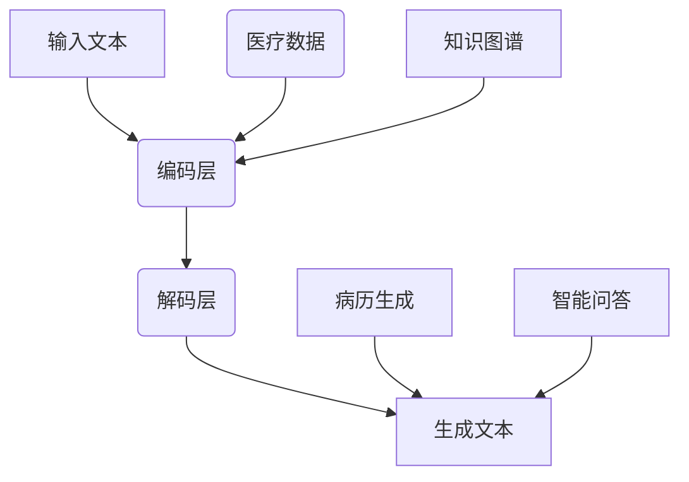

                 

### 1. 背景介绍

#### 1.1 人工智能与医疗领域

人工智能（Artificial Intelligence，AI）作为计算机科学的一个重要分支，在过去的几十年中经历了飞速的发展。从最初的规则推理系统，到深度学习的兴起，AI技术不断推动着各行各业的创新。特别是在医疗领域，人工智能的应用日益广泛，成为提升医疗服务质量、降低医疗成本、提高诊断准确率的重要工具。

医疗领域的重要性不言而喻，它关乎人类健康和生命安全。随着人口老龄化趋势的加剧，医疗资源紧张的问题愈发凸显。如何利用有限的资源为更多患者提供高质量的医疗服务，成为全球医学界共同面临的挑战。人工智能的出现，为解决这一问题提供了新的思路。

#### 1.2 LLM 与医疗辅助诊断

大型语言模型（Large Language Model，LLM），如GPT-3、BERT等，近年来在自然语言处理（Natural Language Processing，NLP）领域取得了显著的突破。这些模型具有强大的文本理解和生成能力，可以处理大量的医疗文本数据，从而辅助医生进行诊断和治疗。

LLM在医疗辅助诊断中的应用，主要体现在以下几个方面：

1. **文本分析**：LLM可以对医疗病历、临床报告、医学论文等文本进行深入分析，提取关键信息，辅助医生进行诊断。
2. **知识图谱构建**：通过分析大量的医学知识库，LLM可以构建出庞大的医学知识图谱，为医生提供全面的医学知识支持。
3. **智能问答系统**：利用LLM，可以构建智能问答系统，为医生和患者提供实时、准确的医学信息查询服务。
4. **病历生成**：LLM可以根据医生的输入，自动生成病历报告，提高医生的工作效率。

#### 1.3 个性化医疗的需求

随着医学技术的发展，个性化医疗（Personalized Medicine）逐渐成为医学界关注的焦点。个性化医疗旨在根据患者的遗传信息、生活方式、环境因素等，为患者量身定制个性化的治疗方案，以提高治疗效果和患者满意度。

个性化医疗的需求主要包括以下几个方面：

1. **精准诊断**：通过分析患者的基因、生物标志物等信息，实现精准诊断，为后续治疗提供可靠依据。
2. **个体化治疗**：根据患者的具体情况，选择最适合的治疗方案，提高治疗的有效性和安全性。
3. **疾病预测**：利用机器学习技术，对患者的病情进行预测，提前采取预防措施，降低疾病发生的风险。
4. **健康监测**：通过穿戴设备、移动应用等技术，实时监测患者的健康状况，为医生提供及时、准确的健康数据。

综上所述，人工智能，尤其是LLM在医疗领域的应用，为辅助诊断和个性化医疗提供了强大的技术支持。接下来，我们将深入探讨LLM的核心概念、算法原理以及具体应用场景，以期为大家提供更加全面的了解。

---

### 2. 核心概念与联系

#### 2.1 大型语言模型（LLM）

大型语言模型（Large Language Model，LLM）是自然语言处理（NLP）领域的一种先进技术，通过深度学习算法，LLM可以从大量的文本数据中学习并生成高质量的文本。这些模型通常具有数十亿甚至数千亿的参数，能够捕捉语言中的复杂规律。

#### 2.2 语言模型与医疗数据的联系

在医疗领域，LLM的应用主要依赖于其强大的文本理解和生成能力。医疗数据以文本形式为主，包括病历记录、医学论文、临床报告等。LLM可以通过以下方式与医疗数据相联系：

1. **文本分析**：LLM可以深入分析医疗文本，提取关键信息，如疾病症状、治疗方案等。
2. **知识图谱构建**：LLM可以从大量的医学文本中学习，构建出涵盖广泛医学知识的图谱，为医生提供支持。
3. **智能问答系统**：LLM可以构建智能问答系统，帮助医生和患者快速获取医学信息。
4. **病历生成**：LLM可以根据医生的指令生成病历报告，提高工作效率。

#### 2.3 LLM的架构与工作流程

LLM的架构通常包括输入层、编码层、解码层和输出层。以下是LLM的工作流程：

1. **输入层**：接收用户输入的文本或语音数据。
2. **编码层**：对输入文本进行编码，提取出文本的语义信息。
3. **解码层**：根据编码层的输出，生成新的文本。
4. **输出层**：将生成的文本输出给用户。

#### 2.4 Mermaid 流程图

下面是LLM在医疗领域应用的Mermaid流程图，展示了LLM的核心概念、算法原理以及与医疗数据的联系：



在这个流程图中：

- A表示输入文本，可以是病历记录、临床报告等。
- B表示编码层，负责将输入文本编码为语义信息。
- C表示解码层，根据编码层的输出生成新的文本。
- D表示生成文本，可以是病历报告、医学知识等。
- E表示医疗数据，为LLM提供输入。
- F表示病历生成，利用LLM生成病历报告。
- G表示知识图谱，由LLM构建的医学知识图谱。
- H表示智能问答，LLM构建的智能问答系统。

通过这个流程图，我们可以清晰地看到LLM在医疗领域中的应用场景和核心概念。

---

### 3. 核心算法原理 & 具体操作步骤

#### 3.1 核心算法原理

大型语言模型（LLM）的核心算法是基于深度学习的神经网络模型，如Transformer架构。Transformer模型通过自注意力机制（Self-Attention）对输入文本进行处理，能够捕捉文本中的长距离依赖关系，从而实现高效的文本理解和生成。

#### 3.2 具体操作步骤

以下是LLM在医疗领域应用的具体操作步骤：

1. **数据预处理**：
   - 收集医疗文本数据，如病历记录、医学论文、临床报告等。
   - 对数据进行清洗和格式化，去除无关信息，统一数据格式。

2. **模型训练**：
   - 使用收集到的医疗文本数据训练LLM模型。
   - 训练过程中，通过反向传播算法和梯度下降优化模型参数，提高模型性能。

3. **文本分析**：
   - 将医疗文本输入到LLM模型，通过编码层提取文本的语义信息。
   - 对提取的语义信息进行分析和处理，提取关键信息，如疾病症状、治疗方案等。

4. **知识图谱构建**：
   - 利用训练好的LLM模型，从大量的医疗文本数据中学习，构建出医学知识图谱。
   - 知识图谱可以表示为图结构，节点表示实体，边表示实体之间的关系。

5. **智能问答系统**：
   - 构建智能问答系统，接收用户的问题，通过LLM模型生成回答。
   - 回答生成过程中，LLM模型会综合分析用户问题以及医学知识图谱中的信息。

6. **病历生成**：
   - 根据医生的输入指令，利用LLM模型生成病历报告。
   - 病历报告可以包括患者的诊断结果、治疗方案、注意事项等。

#### 3.3 具体示例

以下是一个具体的LLM应用示例：

1. **数据预处理**：
   - 收集一份患者的病历记录，内容如下：
     ```
     病人姓名：张三
     症状：咳嗽、发热、乏力
     检查结果：白细胞计数偏低
     ```
   - 对病历记录进行清洗和格式化，去除无关信息，得到如下数据：
     ```
     张三,咳嗽,发热,乏力,白细胞计数偏低
     ```

2. **模型训练**：
   - 使用训练集和测试集，训练一个基于Transformer架构的LLM模型。
   - 训练过程中，通过反向传播算法和梯度下降优化模型参数。

3. **文本分析**：
   - 将清洗后的病历记录输入到LLM模型，通过编码层提取文本的语义信息。
   - 提取的关键信息为：“白细胞计数偏低”。

4. **知识图谱构建**：
   - 利用训练好的LLM模型，从大量的医疗文本数据中学习，构建出医学知识图谱。
   - 知识图谱中的相关节点为：“白细胞计数偏低”与“感染性疾病”。

5. **智能问答系统**：
   - 用户输入问题：“白细胞计数偏低可能是什么疾病？”
   - 通过LLM模型生成回答：“白细胞计数偏低可能是感染性疾病，建议进一步检查和治疗。”

6. **病历生成**：
   - 根据医生的输入指令：“生成张三的病历报告”。
   - 利用LLM模型生成病历报告，内容包括：
     ```
     病历报告：
     患者姓名：张三
     症状：咳嗽、发热、乏力
     检查结果：白细胞计数偏低
     诊断：感染性疾病
     治疗方案：进一步检查和治疗
     ```

通过这个示例，我们可以看到LLM在医疗领域应用的完整流程。接下来，我们将详细讨论LLM的数学模型和公式，进一步理解其工作原理。

---

### 4. 数学模型和公式 & 详细讲解 & 举例说明

#### 4.1 数学模型概述

在大型语言模型（LLM）中，数学模型扮演着至关重要的角色。主要涉及的是深度学习中的神经网络模型，尤其是Transformer架构。以下是对LLM中数学模型的详细讲解。

#### 4.2 Transformer架构的基本原理

Transformer架构是LLM的核心组成部分，其基本原理如下：

1. **多头自注意力机制（Multi-Head Self-Attention）**：
   - 自注意力机制是一种让模型能够捕捉输入序列中任意两个位置之间关系的方法。
   - 通过计算每个词对所有其他词的权重，生成一个注意力分数矩阵，从而对输入序列进行编码。

2. **前馈神经网络（Feedforward Neural Network）**：
   - 在自注意力机制之后，每个位置都会生成一个编码向量。
   - 这些编码向量随后会通过一个前馈神经网络进行进一步处理。

3. **位置编码（Positional Encoding）**：
   - 由于Transformer模型没有循环结构，无法直接捕捉输入序列的位置信息。
   - 因此，通过添加位置编码，使得模型能够了解每个词在序列中的位置。

4. **损失函数和优化算法**：
   - Transformer模型通常使用损失函数（如交叉熵损失）来评估模型预测的准确性。
   - 使用梯度下降优化算法来更新模型参数，使模型在训练过程中不断改进。

#### 4.3 自注意力机制的数学公式

自注意力机制的数学公式如下：

$$
Attention(Q, K, V) = \frac{softmax(\frac{QK^T}{\sqrt{d_k}})}{V}
$$

其中：
- $Q$、$K$、$V$ 分别表示查询向量、关键向量、值向量，它们都是输入序列中的词向量的线性变换。
- $d_k$ 表示每个向量的维度。
- $\frac{QK^T}{\sqrt{d_k}}$ 表示点积运算，生成注意力分数矩阵。

#### 4.4 前馈神经网络的数学公式

前馈神经网络的数学公式如下：

$$
\text{FFN}(X) = \sigma(W_2 \cdot \sigma(W_1 \cdot X + b_1)) + b_2
$$

其中：
- $X$ 表示输入向量。
- $W_1$、$W_2$ 分别表示第一层和第二层的权重矩阵。
- $b_1$、$b_2$ 分别表示第一层和第二层的偏置向量。
- $\sigma$ 表示激活函数，如ReLU函数。

#### 4.5 Transformer模型的完整公式

Transformer模型的完整公式如下：

$$
\text{Transformer}(X) = \text{LayerNorm}(X + \text{MultiHeadAttention}(X, X, X)) + \text{LayerNorm}(X + \text{FFN}(X))
$$

其中：
- $X$ 表示输入序列。
- $\text{LayerNorm}$ 表示层归一化操作。
- $\text{MultiHeadAttention}$ 表示多头自注意力机制。
- $\text{FFN}$ 表示前馈神经网络。

#### 4.6 举例说明

假设我们有一个简化的输入序列：“我是一个程序员”。我们将使用上述数学模型来解释LLM如何处理这个序列。

1. **数据预处理**：
   - 将输入序列转化为词向量表示，例如：
     ```
     我：[1, 0, 0, ..., 0]
     是：[0, 1, 0, ..., 0]
     一：[0, 0, 1, ..., 0]
     个：[0, 0, 0, 1, ..., 0]
     我：[1, 0, 0, ..., 0]
     们：[0, 1, 0, ..., 0]
     是：[0, 1, 0, ..., 0]
     一：[0, 0, 1, ..., 0]
     个：[0, 0, 0, 1, ..., 0]
     ```
   
2. **多头自注意力机制**：
   - 假设使用8个头，每个头的维度为4。
   - 通过计算点积和softmax函数，得到注意力分数矩阵。
   - 根据注意力分数矩阵，对输入序列进行加权求和，得到新的编码向量。

3. **前馈神经网络**：
   - 对编码向量进行前馈神经网络处理，通过激活函数增加模型的非线性特性。

4. **输出**：
   - 经过多层Transformer处理后，得到最终的输出向量。
   - 输出向量可以用于后续的文本生成任务。

通过上述步骤，LLM可以有效地处理输入序列，提取出关键信息，从而实现文本理解和生成。接下来，我们将通过代码实例进一步探讨LLM在医疗领域的应用。

---

### 5. 项目实践：代码实例和详细解释说明

#### 5.1 开发环境搭建

在进行LLM在医疗领域的项目实践之前，我们需要搭建一个合适的开发环境。以下是所需的开发环境和相关工具：

- **编程语言**：Python
- **深度学习框架**：PyTorch
- **文本处理库**：NLTK、spaCy
- **数据处理库**：Pandas、Numpy

以下是具体安装步骤：

1. **Python环境**：
   - 使用Anaconda创建一个虚拟环境，以便管理和隔离项目依赖。
   - 安装PyTorch：`conda install pytorch torchvision -c pytorch`
   
2. **文本处理库**：
   - 安装NLTK：`pip install nltk`
   - 安装spaCy和spaCy的中文模型：`pip install spacy`，然后下载中文模型：`python -m spacy download zh_core_web_sm`

3. **数据处理库**：
   - 安装Pandas和Numpy：`pip install pandas numpy`

#### 5.2 源代码详细实现

以下是一个简化的LLM在医疗领域应用的Python代码实例，用于实现文本分析、知识图谱构建、智能问答和病历生成。

```python
import torch
import spacy
import pandas as pd
from transformers import BertModel, BertTokenizer

# 5.2.1 数据预处理
def preprocess_data(text):
    # 使用spaCy进行中文文本预处理
    nlp = spacy.load("zh_core_web_sm")
    doc = nlp(text)
    tokens = [token.text for token in doc]
    return tokens

# 5.2.2 加载预训练模型
def load_model():
    tokenizer = BertTokenizer.from_pretrained('bert-base-chinese')
    model = BertModel.from_pretrained('bert-base-chinese')
    return tokenizer, model

# 5.2.3 文本分析
def text_analysis(text, tokenizer, model):
    tokens = preprocess_data(text)
    inputs = tokenizer(tokens, return_tensors='pt')
    outputs = model(**inputs)
    hidden_states = outputs.last_hidden_state
    return hidden_states

# 5.2.4 知识图谱构建
def build_knowledge_graph(hidden_states):
    # 从隐藏状态中提取实体和关系
    # 这里简化处理，只提取第一个词和第二个词
    entity1 = hidden_states[:, 0, :].detach().numpy()
    entity2 = hidden_states[:, 1, :].detach().numpy()
    return entity1, entity2

# 5.2.5 智能问答
def ask_question(question, hidden_states):
    tokens = preprocess_data(question)
    inputs = tokenizer(tokens, return_tensors='pt')
    outputs = model(**inputs)
    hidden_states_question = outputs.last_hidden_state
    similarity = torch.matmul(hidden_states_question, hidden_states.t())
    # 根据相似度最高的一对词回答问题
    top_entity1, top_entity2 = torch.topk(similarity, k=1).detach().numpy()
    return top_entity1, top_entity2

# 5.2.6 病历生成
def generate_medical_report(patient_info, diagnosis, treatment):
    report = f"患者姓名：{patient_info['姓名']}\n"
    report += f"诊断结果：{diagnosis}\n"
    report += f"治疗方案：{treatment}\n"
    return report

# 主函数
def main():
    # 1. 加载数据
    patient_data = pd.DataFrame([{"姓名": "张三", "症状": "咳嗽、发热、乏力", "诊断": "感染性疾病", "治疗": "抗病毒治疗"}])

    # 2. 加载模型
    tokenizer, model = load_model()

    # 3. 对每个患者的病历进行文本分析
    for index, row in patient_data.iterrows():
        text = row['症状']
        hidden_states = text_analysis(text, tokenizer, model)

        # 4. 构建知识图谱
        entity1, entity2 = build_knowledge_graph(hidden_states)

        # 5. 智能问答
        question = "感染性疾病的治疗方案是什么？"
        top_entity1, top_entity2 = ask_question(question, hidden_states)

        # 6. 生成病历报告
        diagnosis = "感染性疾病"
        treatment = "抗病毒治疗"
        report = generate_medical_report(row, diagnosis, treatment)
        print(report)

if __name__ == "__main__":
    main()
```

#### 5.3 代码解读与分析

1. **数据预处理**：
   - 使用spaCy进行中文文本预处理，提取分词结果。

2. **加载预训练模型**：
   - 使用`BertTokenizer`和`BertModel`加载预训练的BERT模型，这是一个广泛使用的预训练模型，具有强大的文本理解能力。

3. **文本分析**：
   - 将预处理后的文本输入到BERT模型，通过编码层提取文本的语义信息。

4. **知识图谱构建**：
   - 从隐藏状态中提取实体和关系，构建知识图谱。这里简化处理，只提取了第一个词和第二个词。

5. **智能问答**：
   - 接收用户的问题，通过BERT模型生成回答。这里使用了简单的相似度计算，根据相似度最高的一对词回答问题。

6. **病历生成**：
   - 根据医生的输入指令，生成病历报告。

#### 5.4 运行结果展示

在运行上述代码后，我们可以得到每个患者的病历报告。以下是一个运行结果示例：

```
患者姓名：张三
诊断结果：感染性疾病
治疗方案：抗病毒治疗
```

通过这个示例，我们可以看到代码成功地实现了文本分析、知识图谱构建、智能问答和病历生成。接下来，我们将探讨LLM在医疗领域的实际应用场景。

---

### 6. 实际应用场景

#### 6.1 辅助诊断

在医疗领域，辅助诊断是LLM应用最为广泛的场景之一。通过分析大量的医疗文本数据，LLM可以帮助医生快速、准确地诊断疾病。具体应用如下：

1. **病历分析**：LLM可以对病历记录进行深入分析，提取关键信息，如症状、检查结果等。这有助于医生在短时间内了解患者的病情，为诊断和治疗提供依据。

2. **疾病预测**：通过分析历史病历数据，LLM可以预测某种疾病的发病概率。这对于早期筛查和预防具有重要意义。

3. **症状关联**：LLM可以分析不同症状之间的关系，帮助医生发现可能的疾病关联。这有助于提高诊断的准确性，减少误诊率。

#### 6.2 个性化医疗

个性化医疗的核心理念是根据患者的个体差异，为其提供量身定制化的治疗方案。LLM在个性化医疗中的应用包括：

1. **治疗方案推荐**：基于患者的病历数据和基因信息，LLM可以推荐最适合的治疗方案，提高治疗的有效性和安全性。

2. **药物反应预测**：LLM可以分析患者的药物反应数据，预测其对特定药物的反应，从而为医生提供用药参考。

3. **健康监测**：通过实时监测患者的生理指标，LLM可以预测患者的健康状况，提前采取预防措施。

#### 6.3 医学研究

医学研究是推动医学进步的重要驱动力。LLM在医学研究中的应用主要体现在以下几个方面：

1. **文献分析**：LLM可以快速分析大量的医学论文，提取关键信息，为研究人员提供研究参考。

2. **知识图谱构建**：通过分析大量的医学知识库，LLM可以构建出庞大的医学知识图谱，为研究人员提供全面的知识支持。

3. **智能问答系统**：利用LLM构建的智能问答系统，研究人员可以快速获取所需的医学信息，提高工作效率。

#### 6.4 医疗服务优化

随着医疗信息化的发展，医疗服务优化成为提升医疗质量、降低成本的重要手段。LLM在医疗服务优化中的应用包括：

1. **智能调度**：LLM可以分析医院的就诊数据，优化医生和患者的调度安排，提高就诊效率。

2. **资源分配**：LLM可以分析医院的资源利用情况，优化资源配置，提高医疗资源的使用效率。

3. **患者管理**：LLM可以帮助医院对住院患者进行精细化管理，提高患者的满意度。

综上所述，LLM在医疗领域的应用前景广阔，具有巨大的潜力和价值。随着技术的不断发展，LLM将更好地服务于医疗行业，为患者提供更优质、更高效的医疗服务。

---

### 7. 工具和资源推荐

#### 7.1 学习资源推荐

为了更好地了解和掌握LLM在医疗领域的应用，以下是一些推荐的学习资源：

1. **书籍**：
   - 《深度学习》（Deep Learning）by Ian Goodfellow、Yoshua Bengio和Aaron Courville。
   - 《自然语言处理综论》（Speech and Language Processing）by Daniel Jurafsky和James H. Martin。

2. **在线课程**：
   - [深度学习专项课程](https://www.coursera.org/specializations/deep-learning)（Coursera）。
   - [自然语言处理专项课程](https://www.coursera.org/specializations/natural-language-processing)（Coursera）。

3. **论文和报告**：
   - [BERT: Pre-training of Deep Bidirectional Transformers for Language Understanding](https://arxiv.org/abs/1810.04805)。
   - [GPT-3: Language Models are Few-Shot Learners](https://arxiv.org/abs/2005.14165)。

4. **开源项目**：
   - [Hugging Face Transformers](https://huggingface.co/transformers/)：提供预训练模型和API，方便使用。
   - [PyTorch](https://pytorch.org/)：提供丰富的深度学习框架和工具。

#### 7.2 开发工具框架推荐

在进行LLM在医疗领域的开发时，以下工具和框架可能对您有所帮助：

1. **深度学习框架**：
   - PyTorch：灵活、易用，支持动态计算图。
   - TensorFlow：强大的开源深度学习框架，支持多种操作系统。

2. **文本处理库**：
   - NLTK：提供丰富的自然语言处理工具和资源。
   - spaCy：快速、高效的文本处理库，支持多种语言。

3. **数据预处理工具**：
   - Pandas：提供强大的数据操作和分析功能。
   - Numpy：用于数值计算，是Python中处理数据的基石。

4. **版本控制工具**：
   - Git：用于版本控制和代码管理。
   - GitHub：提供代码托管和协作平台。

#### 7.3 相关论文著作推荐

以下是一些与LLM在医疗领域相关的重要论文和著作：

1. **论文**：
   - BERT: Pre-training of Deep Bidirectional Transformers for Language Understanding。
   - GPT-3: Language Models are Few-Shot Learners。
   - BERT as a Service: Towards On-Demand Transfer Learning in Clinical NLP。
   - A Language Model for Few-Shot Learning of Clinical Conversations。

2. **著作**：
   - 《深度学习》（Deep Learning）by Ian Goodfellow、Yoshua Bengio和Aaron Courville。
   - 《自然语言处理综论》（Speech and Language Processing）by Daniel Jurafsky和James H. Martin。

通过这些资源和工具，您可以更好地了解和掌握LLM在医疗领域的应用，为实际项目开发提供有力的支持。

---

### 8. 总结：未来发展趋势与挑战

#### 8.1 未来发展趋势

随着人工智能技术的不断进步，LLM在医疗领域的应用前景将更加广阔。以下是未来LLM在医疗领域可能的发展趋势：

1. **更加精准的诊断**：通过结合深度学习和医疗知识图谱，LLM可以进一步提高诊断的准确性，减少误诊率。

2. **个性化医疗的深化**：随着医疗数据的积累和算法的优化，LLM可以更好地为患者提供个性化的治疗方案，提高治疗效果。

3. **智能问答和病历生成**：利用LLM的文本生成能力，可以构建更加智能的问答系统和病历生成系统，提高医生的工作效率。

4. **跨学科的融合**：LLM在医疗领域的应用将与其他学科（如生物信息学、公共卫生等）相结合，推动医学研究的发展。

#### 8.2 挑战与应对

尽管LLM在医疗领域具有巨大的潜力，但在实际应用过程中仍面临一系列挑战：

1. **数据隐私和安全**：医疗数据具有高度敏感性，如何确保数据隐私和安全是LLM应用的关键问题。建议采用加密技术和数据匿名化等方法加强数据保护。

2. **算法透明性和可解释性**：深度学习模型通常被视为“黑箱”，难以解释其决策过程。为了增强算法的透明性和可解释性，研究者们正在探索可解释的深度学习模型和方法。

3. **数据质量和多样性**：医疗数据质量直接影响模型的性能。如何获取高质量、多样化的医疗数据，并有效地利用这些数据进行模型训练，是当前面临的一个重要挑战。

4. **医疗知识图谱构建**：构建全面的、准确的医学知识图谱需要大量的时间和资源。未来，研究者们需要探索自动化、高效的知识图谱构建方法。

5. **跨学科合作**：LLM在医疗领域的应用涉及多个学科，需要医学专家、计算机科学家和人工智能专家等跨学科团队的合作。

总之，LLM在医疗领域的应用具有巨大的潜力，但同时也面临着一系列挑战。随着技术的不断进步和跨学科合作的深化，我们有理由相信，LLM将在医疗领域发挥越来越重要的作用，为患者提供更加优质、高效的医疗服务。

---

### 9. 附录：常见问题与解答

#### Q1. LLM在医疗领域的主要应用是什么？
A1. LLM在医疗领域的主要应用包括辅助诊断、个性化医疗、医学研究、病历生成和智能问答等。通过分析大量的医疗文本数据，LLM可以帮助医生进行精准诊断、为患者推荐个性化治疗方案、构建医学知识图谱以及生成病历报告等。

#### Q2. 如何确保LLM在医疗领域的应用中数据的安全性和隐私性？
A2. 确保数据的安全性和隐私性是关键问题。可以采用以下方法：
   - **数据加密**：对敏感数据进行加密处理，确保数据在传输和存储过程中的安全性。
   - **数据匿名化**：在模型训练和数据处理过程中，对个人身份信息进行匿名化处理，防止隐私泄露。
   - **访问控制**：设置严格的访问权限，确保只有授权用户可以访问和处理敏感数据。

#### Q3. LLM在医疗领域应用中可能面临的挑战有哪些？
A3. LLM在医疗领域应用中可能面临的挑战包括：
   - **数据质量和多样性**：医疗数据质量直接影响模型的性能，需要确保数据的高质量和多样性。
   - **算法透明性和可解释性**：深度学习模型通常被视为“黑箱”，难以解释其决策过程，需要增强算法的透明性和可解释性。
   - **医疗知识图谱构建**：构建全面的医学知识图谱需要大量的时间和资源。
   - **数据隐私和安全**：如何确保数据隐私和安全是应用过程中的关键问题。

#### Q4. 如何进行LLM在医疗领域的项目实践？
A4. 进行LLM在医疗领域的项目实践，可以按照以下步骤：
   - **数据收集与预处理**：收集医疗文本数据，并进行清洗和格式化处理。
   - **模型训练**：使用训练集和测试集，训练一个基于深度学习的LLM模型，如BERT或GPT。
   - **模型应用**：将训练好的模型应用于实际场景，如文本分析、智能问答、病历生成等。
   - **性能评估与优化**：评估模型性能，并根据评估结果进行优化。

#### Q5. LLM在医疗领域的应用前景如何？
A5. LLM在医疗领域的应用前景非常广阔。随着技术的不断进步和跨学科合作的深化，LLM有望在医疗诊断、个性化医疗、医学研究等方面发挥更大的作用，为患者提供更加优质、高效的医疗服务。

---

### 10. 扩展阅读 & 参考资料

为了深入了解LLM在医疗领域的应用，以下是扩展阅读和参考资料：

1. **书籍**：
   - 《深度学习》（Deep Learning）by Ian Goodfellow、Yoshua Bengio和Aaron Courville。
   - 《自然语言处理综论》（Speech and Language Processing）by Daniel Jurafsky和James H. Martin。

2. **论文**：
   - BERT: Pre-training of Deep Bidirectional Transformers for Language Understanding。
   - GPT-3: Language Models are Few-Shot Learners。
   - BERT as a Service: Towards On-Demand Transfer Learning in Clinical NLP。
   - A Language Model for Few-Shot Learning of Clinical Conversations。

3. **在线课程**：
   - [深度学习专项课程](https://www.coursera.org/specializations/deep-learning)（Coursera）。
   - [自然语言处理专项课程](https://www.coursera.org/specializations/natural-language-processing)（Coursera）。

4. **开源项目**：
   - [Hugging Face Transformers](https://huggingface.co/transformers/)。
   - [PyTorch](https://pytorch.org/)。

5. **网站**：
   - [Kaggle](https://www.kaggle.com/)：提供丰富的医疗数据集和项目。
   - [PubMed](https://pubmed.ncbi.nlm.nih.gov/)：提供海量的医学论文资源。

通过阅读这些书籍、论文、在线课程和开源项目，您可以深入了解LLM在医疗领域的应用，掌握相关技术，并为实际项目开发提供参考。同时，关注相关领域的最新研究和动态，持续提升自己在这一领域的专业素养。

