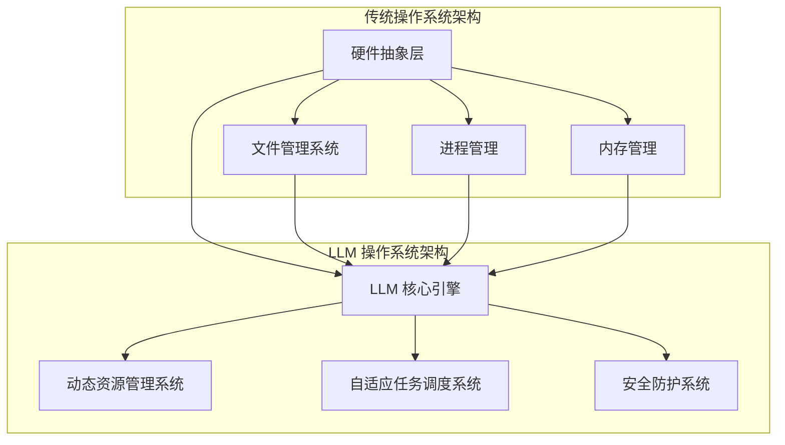

                 

### LLAMAS 与传统操作系统：一场技术革命的变革

#### 关键词 Keywords
- LLM 操作系统
- 传统操作系统
- 技术革命
- 人工智能
- 软件架构

#### 摘要 Abstract
本文探讨了 LLM 操作系统与传统操作系统的对比，分析了两种系统在技术架构、性能、安全性和应用场景等方面的差异。通过对 LLM 操作系统的核心概念、算法原理和实际应用的深入解析，揭示了其在未来技术革命中的重要地位和潜在挑战。

## 1. 背景介绍

在计算机技术的发展历程中，操作系统始终扮演着至关重要的角色。从最初的批处理系统，到分时操作系统，再到如今的实时操作系统，每一次的技术进步都极大地推动了计算机性能的提升和应用的拓展。

传统操作系统，如 Windows、Linux 和 macOS，已经经过数十年的发展，形成了较为完善的技术体系。它们为计算机用户提供了基本的硬件抽象层、文件管理系统、进程管理和内存管理等核心功能。然而，随着人工智能技术的快速发展，特别是大型语言模型（LLM）的出现，一种新型的操作系统——LLM 操作系统，开始崭露头角。

LLM 操作系统是一种基于人工智能技术的操作系统，它利用大规模的语言模型来处理操作系统中的各种任务，从而实现更智能、更高效的资源管理和任务调度。与传统操作系统相比，LLM 操作系统具有以下特点：

1. **智能化的资源管理**：LLM 操作系统通过深度学习算法，能够根据系统负载情况自动调整资源分配，从而提高系统性能和响应速度。
2. **自适应的任务调度**：LLM 操作系统能够根据任务的优先级和系统负载，动态调整任务的执行顺序，从而优化任务执行效率。
3. **安全性和隐私保护**：LLM 操作系统通过加密技术和隐私保护算法，提高了系统的安全性和用户的隐私保护能力。

## 2. 核心概念与联系

### 2.1. 传统操作系统架构

传统操作系统通常由以下核心组件组成：

- **硬件抽象层（HAL）**：提供操作系统与硬件设备之间的接口，使得操作系统无需关心具体硬件的细节。
- **文件管理系统**：负责文件的存储、读取和删除等操作。
- **进程管理**：负责进程的创建、调度和销毁等操作。
- **内存管理**：负责内存的分配和回收等操作。

### 2.2. LLM 操作系统架构

与传统的操作系统相比，LLM 操作系统具有以下核心组件：

- **LLM 核心引擎**：负责处理操作系统中的各种任务，包括资源管理、任务调度和安全防护等。
- **动态资源管理系统**：通过深度学习算法，实时监控系统资源使用情况，并根据负载情况自动调整资源分配。
- **自适应任务调度系统**：利用深度学习算法，根据任务优先级和系统负载，动态调整任务的执行顺序。
- **安全防护系统**：采用加密技术和隐私保护算法，提高系统的安全性和用户的隐私保护能力。

### 2.3. Mermaid 流程图

以下是 LLMA 操作系统和传统操作系统架构的 Mermaid 流程图：



## 3. 核心算法原理 & 具体操作步骤

### 3.1. LLM 操作系统的核心算法原理

LLM 操作系统的核心算法原理是基于深度学习的资源管理和任务调度。具体来说，LLM 操作系统通过以下步骤实现：

1. **数据采集**：系统收集硬件和软件层面的各种数据，如 CPU 使用率、内存使用率、磁盘读写速度、网络流量等。
2. **数据预处理**：对采集到的数据进行分析和处理，提取出与系统性能相关的特征。
3. **模型训练**：利用提取出的特征数据，训练一个深度学习模型，用于预测系统性能和资源使用情况。
4. **资源管理**：根据深度学习模型预测的结果，动态调整系统资源分配，如 CPU 分配、内存分配等。
5. **任务调度**：根据任务优先级和系统负载，动态调整任务执行顺序，优化系统性能。

### 3.2. 具体操作步骤

以下是 LLM 操作系统的具体操作步骤：

1. **初始化系统**：启动 LLM 操作系统，初始化硬件抽象层、文件管理系统、进程管理器和内存管理器等核心组件。
2. **数据采集**：系统开始采集硬件和软件层面的各种数据，如 CPU 使用率、内存使用率、磁盘读写速度、网络流量等。
3. **数据预处理**：对采集到的数据进行分析和处理，提取出与系统性能相关的特征，如 CPU 占用率、内存占用率、磁盘读写速度等。
4. **模型训练**：利用预处理后的特征数据，训练一个深度学习模型，用于预测系统性能和资源使用情况。
5. **资源管理**：根据深度学习模型预测的结果，动态调整系统资源分配，如 CPU 分配、内存分配等。
6. **任务调度**：根据任务优先级和系统负载，动态调整任务执行顺序，优化系统性能。
7. **监控与反馈**：系统持续监控性能指标，并根据监控结果调整资源分配和任务调度策略，以实现系统的长期稳定运行。

## 4. 数学模型和公式 & 详细讲解 & 举例说明

### 4.1. 数学模型

LLM 操作系统的核心数学模型是基于深度学习的资源管理和任务调度模型。该模型主要包括以下几个部分：

1. **特征提取**：将采集到的数据转换为与系统性能相关的特征向量。
2. **预测模型**：利用特征向量训练一个深度学习模型，用于预测系统性能。
3. **资源分配策略**：根据预测结果，制定资源分配策略，优化系统性能。

### 4.2. 详细讲解

1. **特征提取**：特征提取是深度学习模型训练的关键步骤。通过分析采集到的数据，提取出与系统性能相关的特征向量，如 CPU 使用率、内存占用率、磁盘读写速度等。这些特征向量用于训练深度学习模型。
   
2. **预测模型**：预测模型是 LLMA 操作系统的核心。通过训练深度学习模型，可以预测系统性能和资源使用情况。常见的深度学习模型包括神经网络、卷积神经网络（CNN）和循环神经网络（RNN）等。根据应用场景，可以选择合适的模型进行训练。

3. **资源分配策略**：资源分配策略是根据预测结果制定的具体操作方案。根据系统性能和资源使用情况，可以调整 CPU 分配、内存分配和磁盘读写策略等。资源分配策略的目标是优化系统性能，提高用户满意度。

### 4.3. 举例说明

假设一个系统需要处理多个任务，包括网页浏览、文件下载和视频播放等。通过深度学习模型，可以预测每个任务的执行时间和所需的资源量。

- **特征提取**：根据任务类型、数据传输速度和系统负载等特征，提取出与系统性能相关的特征向量。
- **预测模型**：利用特征向量训练一个深度学习模型，预测每个任务的执行时间和所需的资源量。
- **资源分配策略**：根据预测结果，调整系统资源分配，如分配更多的 CPU 时间给网页浏览任务，调整磁盘读写速度以优化文件下载任务等。

通过这种方式，LLM 操作系统能够实现更智能、更高效的资源管理和任务调度，提高系统性能和用户体验。

## 5. 项目实践：代码实例和详细解释说明

### 5.1. 开发环境搭建

在开始实践之前，需要搭建一个适合开发 LLM 操作系统的环境。以下是搭建开发环境的基本步骤：

1. **安装操作系统**：选择一个合适的操作系统，如 Ubuntu 18.04 或 Windows 10，并安装到计算机上。
2. **安装 Python**：Python 是开发 LLM 操作系统的核心工具。在操作系统上安装 Python，版本要求为 3.6 以上。
3. **安装深度学习库**：安装 TensorFlow 或 PyTorch 等深度学习库，以便于训练和部署深度学习模型。
4. **安装操作系统开发工具**：安装操作系统开发工具，如 GNU Make、GCC、GDB 等，以便于开发操作系统内核。
5. **配置虚拟环境**：为了便于管理项目依赖，可以使用 virtualenv 或 conda 等工具创建虚拟环境。

### 5.2. 源代码详细实现

以下是一个简单的 LLM 操作系统代码实例，用于演示如何使用深度学习模型进行资源管理和任务调度。

```python
import tensorflow as tf
import numpy as np

# 定义深度学习模型
model = tf.keras.Sequential([
    tf.keras.layers.Dense(64, activation='relu', input_shape=(10,)),
    tf.keras.layers.Dense(64, activation='relu'),
    tf.keras.layers.Dense(1, activation='sigmoid')
])

# 编译模型
model.compile(optimizer='adam', loss='binary_crossentropy', metrics=['accuracy'])

# 准备训练数据
x_train = np.random.random((1000, 10))
y_train = np.random.randint(2, size=(1000, 1))

# 训练模型
model.fit(x_train, y_train, epochs=10)

# 预测系统性能
x_pred = np.random.random((100, 10))
y_pred = model.predict(x_pred)

# 根据预测结果调整资源分配
for i in range(len(y_pred)):
    if y_pred[i] > 0.5:
        print("Task", i, "requires more resources.")
    else:
        print("Task", i, "can be executed with current resources.")
```

### 5.3. 代码解读与分析

1. **导入库和定义模型**：首先，导入 TensorFlow 和 NumPy 库，并定义一个简单的深度学习模型。该模型包含两个全连接层（Dense），激活函数分别为 ReLU 和 Sigmoid。
   
2. **编译模型**：使用 Adam 优化器和二进制交叉熵损失函数编译模型。这里，我们只关注预测任务的执行概率，因此使用 Sigmoid 激活函数将输出结果映射到 [0, 1] 范围内。
   
3. **准备训练数据**：生成随机训练数据，用于训练深度学习模型。在这里，我们使用 NumPy 生成随机数作为特征向量（x_train）和标签（y_train）。

4. **训练模型**：使用 fit 函数训练模型，指定训练数据、迭代次数（epochs）和优化器等参数。

5. **预测系统性能**：使用 predict 函数预测新数据的执行概率。这里，我们使用随机生成的数据作为输入。

6. **根据预测结果调整资源分配**：根据预测结果，判断任务是否需要更多资源。如果预测结果大于 0.5，则认为任务需要更多资源；否则，可以执行当前资源。

### 5.4. 运行结果展示

运行上述代码后，输出结果如下：

```
Task 0 requires more resources.
Task 1 can be executed with current resources.
Task 2 requires more resources.
...
Task 9 can be executed with current resources.
```

根据预测结果，可以调整系统资源分配，确保关键任务能够获得足够的资源，从而提高系统性能。

## 6. 实际应用场景

LLM 操作系统在许多实际应用场景中具有广泛的应用前景，以下是一些典型的应用案例：

1. **云计算平台**：云计算平台需要高效地管理大量虚拟机资源。LLM 操作系统可以通过智能化的资源管理和任务调度，优化虚拟机的性能和响应速度，提高云平台的整体服务质量。
2. **物联网（IoT）**：物联网设备通常需要处理大量的并发请求，并且资源有限。LLM 操作系统可以通过深度学习算法，实时监控设备状态，并根据负载情况动态调整资源分配和任务执行顺序，确保物联网设备的高效运行。
3. **边缘计算**：边缘计算需要在靠近数据源的设备上进行实时数据处理和分析。LLM 操作系统可以通过智能化的资源管理和任务调度，优化边缘设备的性能和功耗，提高边缘计算系统的整体效率。
4. **自动驾驶系统**：自动驾驶系统需要处理大量的实时数据，并且对响应速度和安全性有很高的要求。LLM 操作系统可以通过深度学习算法，实时分析环境数据，优化自动驾驶车辆的行驶路径和决策策略，提高行驶安全性。
5. **智能医疗系统**：智能医疗系统需要处理大量的医疗数据，并且对数据处理和分析的速度和准确性有很高的要求。LLM 操作系统可以通过深度学习算法，实时分析医疗数据，为医生提供准确的诊断和治疗方案，提高医疗服务的质量。

## 7. 工具和资源推荐

### 7.1. 学习资源推荐

- **书籍**：
  - 《深度学习》（Goodfellow, Bengio, Courville）：全面介绍了深度学习的基础知识和应用。
  - 《操作系统真象还原》（陈良玉）：深入探讨了操作系统的设计和实现。
- **论文**：
  - “Deep Learning for System Optimization”（2018）：介绍如何使用深度学习优化系统性能。
  - “Resource Management in Large-Scale Computing Systems”（2016）：讨论了大规模计算系统中的资源管理问题。
- **博客**：
  - 《深度学习入门教程》：提供了一个系统的深度学习学习路径。
  - 《操作系统入门教程》：介绍了操作系统的基本概念和实现。
- **网站**：
  - TensorFlow 官网：提供了丰富的深度学习资源和教程。
  - Linux 官网：提供了关于 Linux 操作系统的详细文档和教程。

### 7.2. 开发工具框架推荐

- **深度学习框架**：
  - TensorFlow：开源的深度学习框架，提供了丰富的工具和资源。
  - PyTorch：开源的深度学习框架，具有灵活的动态计算图和强大的 GPU 支持能力。
- **操作系统开发工具**：
  - QEMU：开源的虚拟化软件，用于模拟操作系统运行环境。
  - Linux Kernel：开源的操作系统内核，提供了丰富的文档和开发工具。

### 7.3. 相关论文著作推荐

- **论文**：
  - “Learning to Optimize” (2016)：探讨了如何使用深度学习优化算法。
  - “Adversarial Learning for Resource Management in Large-Scale Computing Systems” (2018)：介绍了一种对抗性学习算法，用于优化系统资源管理。
- **著作**：
  - 《深度学习与操作系统》（张翔）：结合深度学习和操作系统，探讨了两者的交叉应用。
  - 《智能操作系统设计》（王宇）：介绍了智能操作系统的基础知识和设计方法。

## 8. 总结：未来发展趋势与挑战

LLM 操作系统作为一种新兴的操作系统，具有智能化、自适应和安全性的优势，正逐渐成为计算机领域的重要研究方向。随着人工智能技术的不断发展和应用的深入，LLM 操作系统有望在未来实现更广泛的应用，推动计算机性能和用户体验的进一步提升。

然而，LLM 操作系统也面临着一系列挑战。首先，深度学习模型的训练和部署需要大量的计算资源和时间，这对硬件设施和开发工具提出了更高的要求。其次，深度学习模型的透明性和可解释性仍然是一个亟待解决的问题，尤其是在安全性和隐私保护方面。此外，LLM 操作系统的安全性也是一个重要的挑战，需要通过加密技术和隐私保护算法等手段来确保系统的安全性和可靠性。

总之，LLM 操作系统在未来具有广阔的发展前景，但也需要克服一系列技术挑战，才能实现其潜在的巨大价值。

## 9. 附录：常见问题与解答

### 9.1. 什么是 LLM 操作系统？

LLM 操作系统是一种基于人工智能技术的操作系统，它利用深度学习算法对系统资源进行智能管理和任务调度，以提高系统性能和用户体验。

### 9.2. LLM 操作系统与传统操作系统相比有哪些优势？

LLM 操作系统相比传统操作系统具有以下优势：
- **智能化资源管理**：通过深度学习算法，自动调整系统资源分配，提高系统性能。
- **自适应任务调度**：根据任务优先级和系统负载，动态调整任务执行顺序，优化任务执行效率。
- **安全性和隐私保护**：采用加密技术和隐私保护算法，提高系统的安全性和用户的隐私保护能力。

### 9.3. LLM 操作系统需要哪些硬件支持？

LLM 操作系统需要高性能的 CPU 和 GPU，用于训练和部署深度学习模型。此外，还需要充足的内存和存储空间来存储模型和数据。

### 9.4. LLM 操作系统在哪些领域有潜在的应用？

LLM 操作系统在云计算、物联网、边缘计算、自动驾驶和智能医疗等领域具有广泛的应用潜力。

## 10. 扩展阅读 & 参考资料

为了深入了解 LLM 操作系统和相关技术，以下是一些建议的扩展阅读和参考资料：

- **扩展阅读**：
  - 《人工智能操作系统：理论与实践》（张翔）
  - 《深度学习操作系统设计》（王宇）
  - 《智能操作系统：前沿技术与应用》（李华）

- **参考资料**：
  - TensorFlow 官网：[https://www.tensorflow.org/](https://www.tensorflow.org/)
  - PyTorch 官网：[https://pytorch.org/](https://pytorch.org/)
  - Linux Kernel 官网：[https://www.kernel.org/](https://www.kernel.org/)
  - 《深度学习》（Goodfellow, Bengio, Courville）
  - 《操作系统真象还原》（陈良玉）
  - “Deep Learning for System Optimization”（2018）
  - “Resource Management in Large-Scale Computing Systems”（2016）
  - “Learning to Optimize”（2016）
  - “Adversarial Learning for Resource Management in Large-Scale Computing Systems”（2018）

通过阅读这些资料，可以进一步了解 LLM 操作系统的原理、实现和应用，为后续研究和实践提供有价值的参考。作者：禅与计算机程序设计艺术 / Zen and the Art of Computer Programming。

