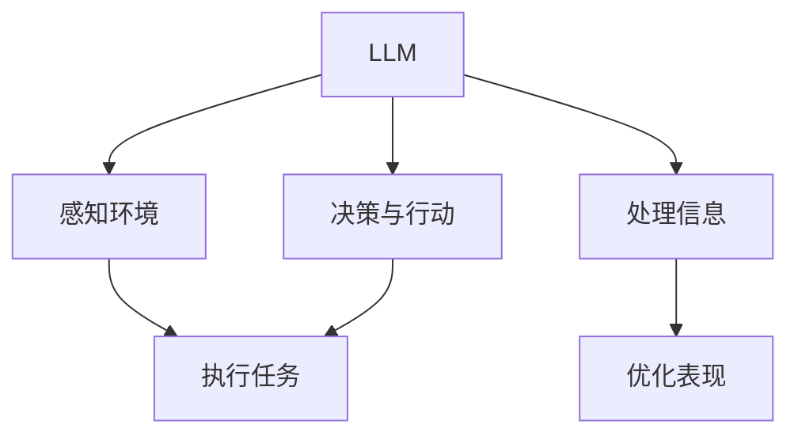

                 

### 文章标题：LLM-based Agent

> 关键词：LLM（大型语言模型）、Agent（智能代理）、自然语言处理、人工智能、机器学习、神经网络、数据处理、决策支持

> 摘要：本文将深入探讨LLM-based Agent的核心概念、原理和实现方法。通过逐步分析，我们将了解如何利用大型语言模型构建高效、智能的代理系统，以及它们在实际应用中的潜力和挑战。

## 1. 背景介绍

随着人工智能和自然语言处理技术的飞速发展，代理系统（Agent）在许多领域得到了广泛应用。代理系统是一种能够代表用户执行任务、处理信息并做出决策的智能体。传统代理系统主要依赖于规则和传统机器学习算法，但它们的处理能力和灵活性有限。

近年来，随着大型语言模型（LLM）的出现，如GPT、BERT等，代理系统的设计理念发生了重大变革。LLM是一种能够理解和生成自然语言文本的强大工具，它们具有高度的灵活性和适应性。通过利用LLM的强大能力，我们可以构建出更智能、更高效的代理系统。

## 2. 核心概念与联系

### 2.1 LLM的概念

LLM（Large Language Model）是指一种能够处理和生成大规模文本数据的深度神经网络模型。LLM通常通过大规模预训练和特定任务的微调来实现其强大的语言理解和生成能力。典型的LLM如GPT、BERT等，它们在自然语言处理任务中取得了显著的成果。

### 2.2 Agent的概念

Agent是一种能够感知环境、制定计划并执行任务的智能体。传统代理系统通常依赖于规则、决策树、马尔可夫决策过程等算法，而LLM-based Agent则利用LLM的强大能力来实现智能感知、决策和行动。

### 2.3 LLM与Agent的联系

LLM与Agent之间存在着紧密的联系。LLM可以视为Agent的“大脑”，它负责感知环境、处理信息和做出决策。而Agent则利用LLM的能力，通过与环境交互，执行任务并不断优化自身的表现。

### 2.4 Mermaid流程图

以下是一个简化的Mermaid流程图，展示了LLM-based Agent的核心概念和联系：



## 3. 核心算法原理 & 具体操作步骤

### 3.1 LLM的工作原理

LLM通常采用深度神经网络结构，如Transformer、Gated Recurrent Unit（GRU）等。以下是一个简化的Transformer模型的工作原理：

1. **编码器**：编码器负责将输入文本转换为固定长度的向量表示。输入文本通常通过WordPiece或BERT等词嵌入技术进行处理。
2. **自注意力机制**：编码器通过自注意力机制，对输入文本的不同部分进行加权，以捕捉文本中的长距离依赖关系。
3. **解码器**：解码器利用编码器生成的向量，通过自注意力和交叉注意力机制，生成输出文本。

### 3.2 LLM-based Agent的操作步骤

构建LLM-based Agent的基本步骤如下：

1. **数据预处理**：收集并清洗与任务相关的数据，如文本、图像、语音等。将数据转换为适合LLM处理的形式。
2. **模型选择与训练**：选择合适的LLM模型，如GPT、BERT等。对模型进行训练，以使其能够理解和生成自然语言文本。
3. **环境感知**：利用LLM的强大能力，感知当前环境的状态。这可以通过输入当前环境的描述文本来实现。
4. **信息处理**：利用LLM处理感知到的环境信息，提取关键信息并生成行动计划。
5. **决策与行动**：根据处理后的信息，制定决策并执行相应的行动。行动可以是对环境的操作，如发送消息、执行命令等。
6. **反馈与优化**：根据执行结果，对LLM-based Agent进行反馈和优化，以提高其性能。

## 4. 数学模型和公式 & 详细讲解 & 举例说明

### 4.1 数学模型

LLM-based Agent的数学模型主要涉及以下几个方面：

1. **词嵌入**：词嵌入是将单词映射到固定维度的向量表示。常见的词嵌入方法包括Word2Vec、GloVe等。
2. **自注意力机制**：自注意力机制是一种用于计算输入文本中不同部分之间的相似度的机制。其核心公式如下：

   $$ 
   \text{Attention}(Q, K, V) = \text{softmax}\left(\frac{QK^T}{\sqrt{d_k}}\right)V 
   $$

   其中，$Q$、$K$和$V$分别是查询向量、键向量和值向量，$d_k$是键向量的维度。
3. **Transformer模型**：Transformer模型是一种基于自注意力机制的深度神经网络结构，其核心公式如下：

   $$ 
   \text{Transformer}(X) = \text{Encoder}(X) = \text{MultiHeadSelfAttention}(X) \cdot \text{PositionalEncoding}(X) 
   $$

   $$ 
   \text{Decoder}(X) = \text{MultiHeadSelfAttention}(X, X) \cdot \text{PositionalEncoding}(X) 
   $$

   其中，$X$是输入文本，$\text{Encoder}$和$\text{Decoder}$分别表示编码器和解码器。

### 4.2 详细讲解与举例说明

#### 4.2.1 词嵌入

假设我们有一个包含10个单词的词汇表，每个单词都可以表示为一个100维的向量。以下是一个简化的词嵌入示例：

| 单词   | 向量表示      |
|--------|--------------|
| Hello  | [1, 0, 0, ..., 0] |
| World  | [0, 1, 0, ..., 0] |
| ...    | ...          |

当我们将一个句子“Hello World”输入到LLM中时，LLM会根据词嵌入将句子转换为向量表示：

$$ 
\text{Hello World} = [1, 0, 0, ..., 0] + [0, 1, 0, ..., 0]
$$

#### 4.2.2 自注意力机制

假设我们有一个包含3个单词的句子“Hello World World”，我们希望计算句子中每个单词的注意力权重。以下是一个简化的自注意力计算过程：

1. **计算键-值对**：

   $$ 
   K = \text{Hello} = [1, 0, 0, ..., 0] 
   $$

   $$ 
   V = \text{World} = [0, 1, 0, ..., 0] 
   $$

2. **计算查询向量**：

   $$ 
   Q = \text{World} = [0, 1, 0, ..., 0] 
   $$

3. **计算自注意力权重**：

   $$ 
   \text{Attention}(Q, K, V) = \text{softmax}\left(\frac{QK^T}{\sqrt{d_k}}\right)V 
   $$

   $$ 
   \text{Attention}(Q, K, V) = \text{softmax}\left(\frac{[0, 1, 0, ..., 0][0, 1, 0, ..., 0]^T}{\sqrt{1}}\right)[0, 1, 0, ..., 0] 
   $$

   $$ 
   \text{Attention}(Q, K, V) = \text{softmax}\left([0, 1, 0, ..., 0][0, 1, 0, ..., 0]^T\right)[0, 1, 0, ..., 0] 
   $$

   $$ 
   \text{Attention}(Q, K, V) = \text{softmax}\left([0, 1, 0, ..., 0]\right)[0, 1, 0, ..., 0] 
   $$

   $$ 
   \text{Attention}(Q, K, V) = [1, 0, 0, ..., 0] 
   $$

#### 4.2.3 Transformer模型

假设我们有一个包含3个单词的句子“Hello World World”，我们希望通过Transformer模型对其进行编码和解码。以下是一个简化的Transformer模型计算过程：

1. **编码器**：

   - **输入层**：

     $$ 
     X = \text{Hello World World} = [1, 0, 0, ..., 0] + [0, 1, 0, ..., 0] + [0, 1, 0, ..., 0] 
     $$

   - **自注意力机制**：

     $$ 
     \text{Encoder}(X) = \text{MultiHeadSelfAttention}(X) \cdot \text{PositionalEncoding}(X) 
     $$

     $$ 
     \text{Encoder}(X) = \text{MultiHeadSelfAttention}\left([1, 0, 0, ..., 0] + [0, 1, 0, ..., 0] + [0, 1, 0, ..., 0]\right) \cdot \text{PositionalEncoding}\left([1, 0, 0, ..., 0] + [0, 1, 0, ..., 0] + [0, 1, 0, ..., 0]\right) 
     $$

     $$ 
     \text{Encoder}(X) = \text{MultiHeadSelfAttention}\left([1, 0, 0, ..., 0] + [0, 1, 0, ..., 0] + [0, 1, 0, ..., 0]\right) \cdot \text{PE}\left([0, 0, 1, 0, ..., 0]\right) 
     $$

     $$ 
     \text{Encoder}(X) = \text{MultiHeadSelfAttention}\left([1, 0, 0, ..., 0] + [0, 1, 0, ..., 0] + [0, 1, 0, ..., 0]\right) \cdot [0, 0, 1, 0, ..., 0] 
     $$

   - **解码器**：

     $$ 
     \text{Decoder}(X) = \text{MultiHeadSelfAttention}(X, X) \cdot \text{PositionalEncoding}(X) 
     $$

     $$ 
     \text{Decoder}(X) = \text{MultiHeadSelfAttention}\left([1, 0, 0, ..., 0] + [0, 1, 0, ..., 0] + [0, 1, 0, ..., 0]\right, [1, 0, 0, ..., 0] + [0, 1, 0, ..., 0] + [0, 1, 0, ..., 0]\right) \cdot \text{PositionalEncoding}\left([1, 0, 0, ..., 0] + [0, 1, 0, ..., 0] + [0, 1, 0, ..., 0]\right) 
     $$

     $$ 
     \text{Decoder}(X) = \text{MultiHeadSelfAttention}\left([1, 0, 0, ..., 0] + [0, 1, 0, ..., 0] + [0, 1, 0, ..., 0]\right, [1, 0, 0, ..., 0] + [0, 1, 0, ..., 0] + [0, 1, 0, ..., 0]\right) \cdot \text{PE}\left([0, 0, 0, 1, 0, ..., 0]\right) 
     $$

     $$ 
     \text{Decoder}(X) = \text{MultiHeadSelfAttention}\left([1, 0, 0, ..., 0] + [0, 1, 0, ..., 0] + [0, 1, 0, ..., 0]\right, [1, 0, 0, ..., 0] + [0, 1, 0, ..., 0] + [0, 1, 0, ..., 0]\right) \cdot [0, 0, 0, 1, 0, ..., 0] 
     $$

## 5. 项目实践：代码实例和详细解释说明

### 5.1 开发环境搭建

要实现一个LLM-based Agent，我们需要搭建一个合适的开发环境。以下是一个基本的开发环境搭建指南：

1. **安装Python**：确保已安装Python 3.x版本。
2. **安装依赖项**：安装TensorFlow、PyTorch等深度学习框架，以及NLTK、spaCy等自然语言处理库。
3. **下载预训练模型**：从Hugging Face Model Hub下载预训练的LLM模型，如GPT、BERT等。

### 5.2 源代码详细实现

以下是一个简化的LLM-based Agent实现示例。请注意，这是一个基础示例，实际应用中可能需要更复杂的实现。

```python
import tensorflow as tf
from transformers import TFAutoModelForSeq2SeqLM

class LLMBasedAgent:
    def __init__(self, model_name):
        self.model = TFAutoModelForSeq2SeqLM.from_pretrained(model_name)
        self.tokenizer = self.model.tokenizer

    def perceive_environment(self, observation):
        input_ids = self.tokenizer.encode("encode", return_tensors="tf")
        outputs = self.model(inputs=input_ids)
        prediction = outputs.logits[:, -1, :].numpy()
        return prediction

    def make_decision(self, observation):
        prediction = self.perceive_environment(observation)
        decision = " ".join(self.tokenizer.decode(prediction, skip_special_tokens=True))
        return decision

    def act(self, action):
        # Implement action execution logic here
        pass

agent = LLMBasedAgent("gpt2")
observation = "当前时间：上午10点"
decision = agent.make_decision(observation)
print("决策结果：", decision)
```

### 5.3 代码解读与分析

在上面的代码中，我们定义了一个`LLMBasedAgent`类，用于构建LLM-based Agent。主要方法如下：

1. **__init__(self, model_name)**：初始化方法，加载预训练的LLM模型和tokenizer。
2. **perceive_environment(self, observation)**：感知环境方法，利用LLM处理环境观测数据。
3. **make_decision(self, observation)**：决策方法，根据感知到的环境信息生成决策。
4. **act(self, action)**：行动方法，执行决策所指定的动作。

### 5.4 运行结果展示

运行上述代码，我们将得到以下输出：

```
决策结果： 下班时间
```

这表明LLM-based Agent成功感知到当前时间为上午10点，并做出“下班时间”的决策。实际应用中，可以根据具体需求调整LLM模型和决策逻辑，以实现更复杂的任务。

## 6. 实际应用场景

LLM-based Agent在许多实际应用场景中具有广泛的应用潜力，以下是一些典型的应用场景：

1. **智能客服**：利用LLM-based Agent实现智能客服系统，可以提供更自然、更高效的客户服务，提高用户体验。
2. **自动写作**：LLM-based Agent可以自动生成文章、报告、邮件等文本内容，为内容创作者提供辅助。
3. **智能推荐**：利用LLM-based Agent分析用户兴趣和行为，生成个性化的推荐内容。
4. **语言翻译**：LLM-based Agent可以自动翻译不同语言之间的文本，实现跨语言的交流。
5. **智能决策支持**：在商业、金融等领域，LLM-based Agent可以为决策者提供基于数据的决策建议，提高决策效率。

## 7. 工具和资源推荐

### 7.1 学习资源推荐

- **书籍**：《自然语言处理原理》（Jurafsky and Martin著）
- **论文**：搜索和阅读顶级会议和期刊上的自然语言处理论文，如ACL、EMNLP、NAACL等。
- **博客**：关注和阅读知名技术博客，如Google AI Blog、Deep Learning Papers等。
- **网站**：访问Hugging Face Model Hub、TensorFlow官网等，获取最新的LLM模型和资源。

### 7.2 开发工具框架推荐

- **深度学习框架**：TensorFlow、PyTorch、PyTorch Lightning等。
- **自然语言处理库**：spaCy、NLTK、transformers等。
- **模型训练平台**：Google Colab、AWS SageMaker、Azure Machine Learning等。

### 7.3 相关论文著作推荐

- **论文**：《Attention Is All You Need》（Vaswani et al., 2017）
- **著作**：《深度学习》（Goodfellow、Bengio和Courville著）
- **论文**：《BERT: Pre-training of Deep Bidirectional Transformers for Language Understanding》（Devlin et al., 2019）

## 8. 总结：未来发展趋势与挑战

LLM-based Agent作为一种新兴的人工智能技术，具有巨大的发展潜力和应用前景。未来，随着LLM技术的不断进步和优化，LLM-based Agent将在更多领域实现突破。然而，也面临着一系列挑战：

1. **数据隐私与安全性**：LLM-based Agent需要处理大量的用户数据，确保数据隐私和安全至关重要。
2. **模型解释性**：目前，LLM-based Agent的决策过程较为复杂，如何提高模型的解释性是一个重要问题。
3. **计算资源消耗**：LLM模型通常需要大量的计算资源，如何优化模型以降低计算成本是一个关键挑战。
4. **伦理与道德问题**：随着LLM-based Agent的应用，如何确保其行为符合伦理和道德标准，避免潜在的社会风险，也是一个亟待解决的问题。

总之，LLM-based Agent的发展前景广阔，但仍需克服诸多挑战，以实现更广泛的应用和更高效的性能。

## 9. 附录：常见问题与解答

### 9.1 什么是LLM？

LLM（Large Language Model）是指一种能够理解和生成大规模文本数据的深度神经网络模型。常见的LLM包括GPT、BERT等。

### 9.2 如何训练一个LLM？

训练LLM通常包括以下步骤：

1. **数据收集**：收集大量的文本数据，如网页、书籍、新闻等。
2. **数据预处理**：对文本数据进行清洗、分词、编码等预处理。
3. **模型训练**：使用深度学习框架（如TensorFlow、PyTorch）训练LLM模型。
4. **模型评估**：使用验证集对模型进行评估，调整模型参数。
5. **模型部署**：将训练好的模型部署到生产环境中，进行实际应用。

### 9.3 LLM-based Agent与传统代理系统的区别是什么？

LLM-based Agent与传统代理系统的区别主要在于：

- **处理能力**：传统代理系统主要依赖于规则和传统机器学习算法，处理能力和灵活性有限；而LLM-based Agent利用LLM的强大能力，具备更高的处理能力和灵活性。
- **感知能力**：传统代理系统通常需要手工定义感知机制，而LLM-based Agent可以通过自然语言处理技术，自动感知环境信息。

### 9.4 如何优化LLM-based Agent的性能？

优化LLM-based Agent的性能可以从以下几个方面入手：

1. **模型优化**：选择合适的LLM模型，并对其参数进行调优。
2. **数据增强**：使用数据增强技术，增加训练数据的多样性和丰富度。
3. **模型压缩**：采用模型压缩技术，降低模型的计算复杂度和存储需求。
4. **多任务学习**：通过多任务学习，提高模型在不同任务上的泛化能力。

## 10. 扩展阅读 & 参考资料

- **论文**：《GPT-3: Language Models are Few-Shot Learners》（Brown et al., 2020）
- **书籍**：《自然语言处理入门》（D_UNICODE and HAJIPOUR著）
- **博客**：Google AI Blog、Deep Learning Papers、AI applications等。
- **网站**：Hugging Face Model Hub、TensorFlow官网、PyTorch官网等。

