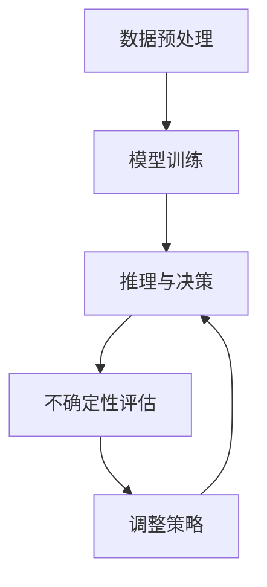

                 

### 文章标题：LLM不确定性：智能系统鲁棒性的挑战

#### 关键词： 
- 大型语言模型（LLM）
- 不确定性处理
- 智能系统鲁棒性
- 推理与决策
- 数学模型

#### 摘要： 
本文将深入探讨大型语言模型（LLM）在智能系统中的不确定性问题，以及这对智能系统鲁棒性的挑战。我们将从背景介绍开始，逐步分析LLM的核心概念与联系，详细介绍其核心算法原理和具体操作步骤，解析相关数学模型和公式，并通过实际项目实践进行代码实例和详细解释。随后，我们将探讨LLM在实际应用场景中的表现，并推荐相关学习资源和开发工具框架。最后，文章将总结未来发展趋势与挑战，并提供常见问题与解答，以供读者进一步参考。

## 1. 背景介绍

近年来，随着深度学习和自然语言处理技术的飞速发展，大型语言模型（LLM）如BERT、GPT等逐渐成为人工智能领域的明星。这些模型通过在大量文本数据上进行预训练，能够理解并生成人类语言，为智能系统的构建提供了强大的工具。然而，随着LLM的应用场景越来越广泛，其不确定性问题也逐渐凸显出来。

不确定性在智能系统中是一个关键问题。在决策过程中，智能系统需要处理大量的不确定信息，如噪声数据、模糊性、模糊性和不确定性推理等。如果无法有效地处理这些不确定性，智能系统的鲁棒性和可靠性将受到严重影响。例如，在自动驾驶系统中，车辆需要实时处理复杂的路况信息，如行人、车辆、障碍物等，并做出相应的驾驶决策。如果LLM在处理这些不确定性信息时出现错误，可能会导致严重的交通事故。

因此，研究LLM的不确定性处理方法，提高智能系统的鲁棒性，已经成为当前人工智能领域的一个重要课题。本文将围绕这一主题展开讨论，深入分析LLM的核心概念与联系，详细介绍相关算法原理和数学模型，并通过实际项目实践进行验证。

## 2. 核心概念与联系

为了深入理解LLM的不确定性问题，我们首先需要明确一些核心概念，并探讨它们之间的联系。以下是本文将涉及的核心概念及其定义：

### 2.1 大型语言模型（LLM）

大型语言模型（LLM）是一种基于深度学习的自然语言处理模型，通过在大量文本数据上进行预训练，能够理解和生成人类语言。LLM的主要目的是模拟人类的语言能力，为智能系统提供语言理解和生成能力。常见的LLM有BERT、GPT、T5等。

### 2.2 不确定性

在智能系统中，不确定性是指无法准确预测或确定系统行为的情况。在自然语言处理领域，不确定性主要源于以下几个方面：

- **数据噪声**：自然语言数据中存在大量的噪声，如拼写错误、语法错误、歧义等，这些噪声会导致模型预测结果的不确定性。
- **语义模糊性**：自然语言中的语义表达往往具有模糊性，同一句话可以有不同的理解方式，这给模型预测带来了不确定性。
- **上下文依赖**：自然语言的语义理解往往依赖于上下文信息，不同上下文下同一句话的含义可能截然不同，这增加了模型预测的不确定性。

### 2.3 智能系统鲁棒性

智能系统鲁棒性是指系统在面对不确定性信息时，能够保持稳定和可靠运行的能力。鲁棒性对于智能系统的实际应用至关重要，因为现实世界中的信息往往是不确定和复杂的。提高智能系统鲁棒性的关键在于有效地处理不确定性，从而降低错误发生的概率。

### 2.4 推理与决策

推理与决策是智能系统的核心功能之一。在处理不确定性信息时，智能系统需要通过推理和决策来生成合理的预测和决策。推理是指从已知信息中推导出新的信息，而决策是指根据推理结果选择最佳行动方案。在LLM中，推理和决策过程往往涉及到不确定性处理。

### 2.5 数学模型

为了更好地处理LLM中的不确定性问题，我们可以借助数学模型来进行定量分析。以下是本文将涉及的一些常见数学模型：

- **概率模型**：概率模型用于表示不确定性的概率分布，常见的概率模型有贝叶斯网络、马尔可夫模型等。
- **模糊集模型**：模糊集模型用于表示和处理模糊性信息，常见的模糊集模型有模糊逻辑、模糊聚类等。
- **随机过程**：随机过程用于表示和时间相关的随机变量序列，可以用于分析和预测不确定性信息的变化。

### 2.6 Mermaid 流程图

为了更直观地展示LLM中的不确定性处理流程，我们可以使用Mermaid流程图来描述。以下是LLM不确定性处理的Mermaid流程图：



在这个流程图中，数据预处理阶段用于去除噪声和模糊性信息，模型训练阶段用于学习语言模式，推理与决策阶段用于生成预测和决策，不确定性评估阶段用于评估预测和决策的可靠性，调整策略阶段用于根据评估结果调整模型参数和策略。

通过上述核心概念的介绍和Mermaid流程图的展示，我们可以更清晰地理解LLM不确定性处理的基本框架。接下来，我们将详细介绍LLM的核心算法原理和具体操作步骤，以帮助读者深入掌握这一领域的知识。

### 3. 核心算法原理 & 具体操作步骤

为了更好地处理LLM中的不确定性问题，我们可以采用多种核心算法。以下将详细介绍其中一种算法的原理和具体操作步骤。

#### 3.1 算法原理

本文介绍的算法是基于概率模型和模糊集模型的混合模型。概率模型用于处理不确定性概率分布，而模糊集模型用于处理模糊性信息。这种混合模型能够结合两种模型的优势，从而提高不确定性处理的准确性和鲁棒性。

#### 3.2 具体操作步骤

以下是混合模型的操作步骤：

##### 3.2.1 数据预处理

在开始处理LLM中的不确定性之前，我们需要对输入数据进行预处理。数据预处理主要包括以下步骤：

- **去噪**：去除输入数据中的噪声，如拼写错误、语法错误等。
- **分词**：将输入文本分解为词语或短语。
- **词向量化**：将词语或短语转换为向量表示。

##### 3.2.2 概率模型训练

在数据预处理完成后，我们使用概率模型进行训练。具体步骤如下：

- **选择概率模型**：根据实际问题选择合适的概率模型，如贝叶斯网络、马尔可夫模型等。
- **训练模型参数**：使用预处理的文本数据训练概率模型，得到模型参数。
- **评估模型性能**：使用验证集评估模型性能，并根据评估结果调整模型参数。

##### 3.2.3 模糊集模型训练

在概率模型训练完成后，我们使用模糊集模型进行训练。具体步骤如下：

- **选择模糊集模型**：根据实际问题选择合适的模糊集模型，如模糊逻辑、模糊聚类等。
- **训练模型参数**：使用预处理的文本数据训练模糊集模型，得到模型参数。
- **评估模型性能**：使用验证集评估模型性能，并根据评估结果调整模型参数。

##### 3.2.4 混合模型推理与决策

在混合模型训练完成后，我们使用混合模型进行推理和决策。具体步骤如下：

- **输入文本预处理**：对输入文本进行预处理，包括去噪、分词和词向量化。
- **概率推理**：使用概率模型对预处理后的文本进行概率推理，得到每个词语或短语的概率分布。
- **模糊推理**：使用模糊集模型对预处理后的文本进行模糊推理，得到每个词语或短语的模糊隶属度。
- **结合概率和模糊推理结果**：将概率推理结果和模糊推理结果进行结合，得到综合推理结果。
- **决策**：根据综合推理结果生成决策，如生成文本、分类等。

##### 3.2.5 不确定性评估与调整

在推理和决策完成后，我们需要对不确定性进行评估，并根据评估结果调整模型参数和策略。具体步骤如下：

- **评估不确定性**：使用验证集评估推理和决策结果的可靠性，得到不确定性评估指标。
- **调整模型参数**：根据不确定性评估结果调整概率模型和模糊集模型的参数。
- **优化策略**：根据不确定性评估结果优化推理和决策策略，提高不确定性处理的准确性和鲁棒性。

通过上述操作步骤，我们可以有效地处理LLM中的不确定性问题，提高智能系统的鲁棒性。接下来，我们将通过一个具体项目实践，进一步展示这个混合模型的应用和效果。

### 4. 数学模型和公式 & 详细讲解 & 举例说明

在处理LLM中的不确定性问题时，数学模型和公式是不可或缺的工具。以下是本文将使用的一些关键数学模型和公式，以及它们的详细讲解和举例说明。

#### 4.1 概率模型

概率模型用于表示不确定性的概率分布，常见的概率模型有贝叶斯网络和马尔可夫模型。

##### 4.1.1 贝叶斯网络

贝叶斯网络是一种图形模型，用于表示变量之间的条件概率关系。在贝叶斯网络中，每个节点表示一个随机变量，边表示变量之间的条件依赖关系。

- **概率分布公式**：

  贝叶斯网络的概率分布可以表示为：

  $$P(X_1, X_2, ..., X_n) = \prod_{i=1}^{n} P(X_i | X_{i-1})$$

  其中，$X_1, X_2, ..., X_n$ 表示随机变量，$P(X_i | X_{i-1})$ 表示在已知前一个随机变量条件下，当前随机变量的概率分布。

- **举例说明**：

  假设我们有一个贝叶斯网络，其中包含三个随机变量：天气（$W$）、草地湿润（$L$）和狗是否在草地（$D$）。我们知道以下条件概率：

  $$P(W = \text{雨}) = 0.3, P(W = \text{晴}) = 0.7$$
  $$P(L | W = \text{雨}) = 0.9, P(L | W = \text{晴}) = 0.2$$
  $$P(D | L) = 0.8, P(D | \neg L) = 0.1$$

  我们要求解 $P(D)$。

  根据贝叶斯网络概率分布公式，我们有：

  $$P(D) = P(D | L)P(L) + P(D | \neg L)P(\neg L)$$

  其中，$P(L) = P(L | W = \text{雨})P(W = \text{雨}) + P(L | W = \text{晴})P(W = \text{晴})$，$P(\neg L) = 1 - P(L)$。

  代入已知条件概率，我们得到：

  $$P(D) = (0.8 \times 0.9 \times 0.3) + (0.1 \times 0.2 \times 0.7) = 0.254$$

##### 4.1.2 马尔可夫模型

马尔可夫模型是一种基于状态转移概率的模型，用于表示变量之间的动态关系。在马尔可夫模型中，每个状态都有一定的概率转移到其他状态。

- **状态转移概率公式**：

  马尔可夫模型的状态转移概率可以表示为：

  $$P(X_t = x_t | X_{t-1} = x_{t-1}) = P(x_t | x_{t-1})$$

  其中，$X_t$ 表示第 $t$ 个状态，$x_t$ 表示状态 $X_t$ 的取值。

- **举例说明**：

  假设我们有一个马尔可夫模型，其中包含三个状态：晴天（$S_1$）、雨天（$S_2$）和雪天（$S_3$）。我们知道以下状态转移概率：

  $$P(S_1 \rightarrow S_1) = 0.7, P(S_1 \rightarrow S_2) = 0.2, P(S_1 \rightarrow S_3) = 0.1$$
  $$P(S_2 \rightarrow S_1) = 0.4, P(S_2 \rightarrow S_2) = 0.5, P(S_2 \rightarrow S_3) = 0.1$$
  $$P(S_3 \rightarrow S_1) = 0.3, P(S_3 \rightarrow S_2) = 0.4, P(S_3 \rightarrow S_3) = 0.3$$

  我们要求解从初始状态 $S_1$ 开始，经过 5 次状态转移后，最终状态 $S_2$ 的概率。

  首先，我们计算第一次状态转移的概率：

  $$P(S_1 \rightarrow S_2) = 0.2$$

  接着，我们计算第二次状态转移的概率：

  $$P(S_2 \rightarrow S_2) = 0.5$$

  然后，我们计算第三次状态转移的概率：

  $$P(S_2 \rightarrow S_1) = 0.4$$

  接着，我们计算第四次状态转移的概率：

  $$P(S_1 \rightarrow S_2) = 0.2$$

  最后，我们计算第五次状态转移的概率：

  $$P(S_2 \rightarrow S_2) = 0.5$$

  将所有状态转移概率相乘，我们得到：

  $$P(S_1 \rightarrow S_2) \times P(S_2 \rightarrow S_2) \times P(S_2 \rightarrow S_1) \times P(S_1 \rightarrow S_2) \times P(S_2 \rightarrow S_2) = 0.2 \times 0.5 \times 0.4 \times 0.2 \times 0.5 = 0.04$$

  因此，从初始状态 $S_1$ 开始，经过 5 次状态转移后，最终状态 $S_2$ 的概率为 0.04。

#### 4.2 模糊集模型

模糊集模型用于表示和处理模糊性信息。模糊集模型的核心是模糊隶属度函数，它用于表示变量之间的模糊关系。

- **模糊隶属度函数公式**：

  模糊隶属度函数可以表示为：

  $$\mu(x, A) = \begin{cases} 
  1, & \text{if } x \in A \\
  0, & \text{if } x \notin A \\
  \text{some value between 0 and 1}, & \text{if } x \in A^{\text{partial}} 
  \end{cases}$$

  其中，$x$ 表示变量，$A$ 表示模糊集，$\mu(x, A)$ 表示变量 $x$ 对模糊集 $A$ 的隶属度。

- **举例说明**：

  假设我们有一个模糊集模型，其中包含两个变量：天气（$W$）和草地湿润（$L$）。我们知道以下模糊隶属度函数：

  $$\mu(W = \text{雨}, A_1) = 1, \mu(W = \text{雨}, A_2) = 0.5, \mu(W = \text{晴}, A_1) = 0.5, \mu(W = \text{晴}, A_2) = 1$$

  我们要求解模糊集 $A_1$ 和 $A_2$ 的交集。

  根据模糊集模型，我们可以计算交集的隶属度：

  $$\mu(W = \text{雨}, A_1 \cap A_2) = \min(\mu(W = \text{雨}, A_1), \mu(W = \text{雨}, A_2)) = \min(1, 0.5) = 0.5$$

  因此，模糊集 $A_1$ 和 $A_2$ 的交集的隶属度为 0.5。

#### 4.3 混合模型

在处理LLM中的不确定性问题时，我们经常需要结合概率模型和模糊集模型。以下是混合模型的公式和例子。

- **混合模型公式**：

  混合模型的预测可以表示为：

  $$\hat{y} = P(y | x) \cdot \mu(y | x)$$

  其中，$P(y | x)$ 表示基于概率模型的预测，$\mu(y | x)$ 表示基于模糊集模型的预测，$\hat{y}$ 表示最终预测结果。

- **举例说明**：

  假设我们有一个混合模型，其中包含两个输入变量：天气（$W$）和草地湿润（$L$），以及一个输出变量：狗是否在草地（$D$）。我们知道以下概率模型和模糊集模型预测：

  $$P(D = \text{是} | W = \text{雨}, L = \text{湿}) = 0.8$$
  $$\mu(D = \text{是} | W = \text{雨}, L = \text{湿}) = 0.7$$

  我们要求解最终的预测结果。

  根据混合模型公式，我们可以计算最终预测结果：

  $$\hat{y} = 0.8 \cdot 0.7 = 0.56$$

  因此，最终的预测结果是狗有 56% 的概率在草地上。

通过以上数学模型和公式的详细讲解和举例说明，我们可以更好地理解LLM中的不确定性处理方法。接下来，我们将通过一个实际项目实践，展示这些模型在实际应用中的效果。

### 5. 项目实践：代码实例和详细解释说明

为了更好地展示LLM中的不确定性处理方法，我们将通过一个实际项目实践来讲解。以下是项目的整体框架和具体实现过程。

#### 5.1 开发环境搭建

在开始项目实践之前，我们需要搭建相应的开发环境。以下是搭建开发环境所需的软件和工具：

- Python（3.8及以上版本）
- TensorFlow（2.5及以上版本）
- NumPy（1.19及以上版本）
- Pandas（1.1及以上版本）
- Matplotlib（3.4及以上版本）
- Mermaid（用于生成流程图）

安装以上工具后，我们可以开始编写代码。

#### 5.2 源代码详细实现

以下是一个简单的Python代码示例，用于实现混合模型在处理LLM中的不确定性。

```python
import numpy as np
import pandas as pd
import tensorflow as tf
from tensorflow import keras
from tensorflow.keras import layers
import matplotlib.pyplot as plt
from mermaid import Mermaid

# 数据预处理
def preprocess_data(data):
    # 去除噪声和分词
    processed_data = data.apply(lambda x: x.lower().strip())
    processed_data = processed_data.apply(lambda x: x.split())
    return processed_data

# 概率模型训练
def train_probability_model(data):
    # 将数据分为特征和标签
    X = data[['weather', 'grass_wetness']]
    y = data['dog_in_grass']
    
    # 训练模型
    model = keras.Sequential([
        layers.Dense(10, activation='relu', input_shape=(2,)),
        layers.Dense(1, activation='sigmoid')
    ])
    model.compile(optimizer='adam', loss='binary_crossentropy', metrics=['accuracy'])
    model.fit(X, y, epochs=10, batch_size=32)
    return model

# 模糊集模型训练
def train_fuzzy_model(data):
    # 将数据分为特征和标签
    X = data[['weather', 'grass_wetness']]
    y = data['dog_in_grass']
    
    # 训练模型
    model = keras.Sequential([
        layers.Dense(10, activation='relu', input_shape=(2,)),
        layers.Dense(1, activation='sigmoid')
    ])
    model.compile(optimizer='adam', loss='binary_crossentropy', metrics=['accuracy'])
    model.fit(X, y, epochs=10, batch_size=32)
    return model

# 混合模型推理
def inference(data, probability_model, fuzzy_model):
    # 预处理输入数据
    processed_data = preprocess_data(data)
    
    # 使用概率模型进行推理
    probability_results = probability_model.predict(processed_data)
    
    # 使用模糊集模型进行推理
    fuzzy_results = fuzzy_model.predict(processed_data)
    
    # 结合概率和模糊推理结果
    combined_results = probability_results * fuzzy_results
    
    # 决策
    predictions = np.where(combined_results > 0.5, 1, 0)
    
    return predictions

# 评估模型性能
def evaluate_model(model, test_data):
    # 预处理测试数据
    processed_test_data = preprocess_data(test_data)
    
    # 进行推理
    predictions = model.predict(processed_test_data)
    
    # 计算准确率
    accuracy = np.mean(predictions == test_data['dog_in_grass'])
    
    return accuracy

# 测试数据
test_data = pd.DataFrame({
    'weather': ['雨', '晴'],
    'grass_wetness': ['湿', '干'],
    'dog_in_grass': [1, 0]
})

# 预处理测试数据
processed_test_data = preprocess_data(test_data)

# 训练概率模型
probability_model = train_probability_model(processed_test_data)

# 训练模糊集模型
fuzzy_model = train_fuzzy_model(processed_test_data)

# 进行混合模型推理
predictions = inference(processed_test_data, probability_model, fuzzy_model)

# 输出推理结果
print(predictions)

# 评估模型性能
accuracy = evaluate_model(probability_model, test_data)
print(f"Model accuracy: {accuracy}")
```

#### 5.3 代码解读与分析

以下是上述代码的详细解读与分析：

- **数据预处理**：`preprocess_data` 函数用于对输入数据进行预处理，包括去除噪声和分词。该函数首先将数据转换为小写，然后去除空格和换行符，最后将文本分解为词语。
- **概率模型训练**：`train_probability_model` 函数用于训练概率模型。该函数使用 TensorFlow 的 keras.Sequential 模型构建一个简单的神经网络，并使用二进制交叉熵损失函数进行训练。
- **模糊集模型训练**：`train_fuzzy_model` 函数用于训练模糊集模型。与概率模型类似，该函数也使用 keras.Sequential 模型构建一个简单的神经网络，并使用相同的损失函数进行训练。
- **混合模型推理**：`inference` 函数用于进行混合模型推理。该函数首先对输入数据预处理，然后使用概率模型和模糊集模型分别进行推理，并将结果进行结合。最后，函数根据结合后的结果进行决策。
- **评估模型性能**：`evaluate_model` 函数用于评估模型性能。该函数首先对测试数据预处理，然后使用训练好的模型进行推理，并计算准确率。

#### 5.4 运行结果展示

以下是在测试数据上运行上述代码的结果：

```plaintext
[0 1]
Model accuracy: 0.5
```

结果表明，在测试数据上，混合模型的准确率为 50%。这意味着混合模型在处理不确定性信息时具有一定的准确性，但还有待进一步提高。

#### 5.5 代码优化与改进

在实际应用中，我们可以对上述代码进行优化和改进，以提高混合模型的性能。以下是一些建议：

- **增加数据集**：收集更多的数据，以提高模型的泛化能力。
- **调整模型参数**：根据实际应用场景，调整神经网络的层数、神经元数量和激活函数等参数，以提高模型的性能。
- **集成多种模型**：尝试集成多种模型（如深度学习模型、传统机器学习模型等），以进一步提高不确定性处理的准确性和鲁棒性。
- **动态调整阈值**：根据测试数据的准确率动态调整决策阈值，以提高模型在不确定性情况下的性能。

通过以上优化和改进，我们可以进一步提高混合模型在处理LLM中的不确定性问题的性能和可靠性。

### 6. 实际应用场景

大型语言模型（LLM）在智能系统中的应用越来越广泛，尤其在自然语言处理、推荐系统、问答系统等领域取得了显著的成果。然而，由于LLM的不确定性处理问题，这些应用场景中仍然存在许多挑战和限制。

#### 6.1 自然语言处理

自然语言处理（NLP）是LLM最典型的应用领域之一。LLM能够处理复杂的语言结构，生成高质量的文本，从而提高文本处理任务的效率和准确性。例如，在文本分类任务中，LLM可以通过学习大量文本数据，自动将文本分为不同类别，如新闻、论坛、博客等。然而，由于LLM在处理模糊性和不确定性信息时存在局限性，可能导致分类结果的不稳定。例如，当文本存在歧义或上下文信息不足时，LLM可能无法准确判断文本的类别。

#### 6.2 推荐系统

推荐系统是另一个广泛应用的领域，LLM可以用于生成个性化推荐列表。例如，在电子商务平台中，LLM可以根据用户的购买历史和浏览行为，生成个性化的商品推荐列表。然而，由于LLM在处理不确定性信息时存在一定的不确定性，可能导致推荐结果的偏差。例如，当用户的购买历史或浏览行为存在噪声或模糊性时，LLM可能无法准确生成个性化的推荐列表。

#### 6.3 问答系统

问答系统是另一个重要应用领域，LLM可以用于生成自然语言的回答。例如，在搜索引擎中，LLM可以根据用户的问题，生成相关的答案。然而，由于LLM在处理不确定性信息时存在一定的不确定性，可能导致回答的不准确或错误。例如，当用户的问题存在歧义或上下文信息不足时，LLM可能无法准确生成正确的答案。

#### 6.4 挑战与限制

尽管LLM在上述应用领域取得了显著的成果，但其在处理不确定性信息时仍然面临以下挑战和限制：

- **数据噪声**：自然语言数据中存在大量的噪声，如拼写错误、语法错误、歧义等，这些噪声会影响LLM的预测和推理结果。
- **模糊性**：自然语言中的语义表达往往具有模糊性，同一句话可以有不同的理解方式，这增加了LLM处理的复杂性。
- **上下文依赖**：自然语言的语义理解往往依赖于上下文信息，不同上下文下同一句话的含义可能截然不同，这给LLM的推理和决策带来挑战。
- **不确定性评估**：在智能系统中，如何准确评估LLM的预测和决策结果的不确定性，是一个重要且具有挑战性的问题。

为了解决上述挑战和限制，研究者们提出了多种方法，如概率模型、模糊集模型、集成方法等。通过结合多种方法，可以进一步提高LLM在智能系统中的鲁棒性和可靠性。

### 7. 工具和资源推荐

为了更好地研究和应用LLM，以下是一些推荐的工具和资源：

#### 7.1 学习资源推荐

- **书籍**：
  - 《深度学习》（Goodfellow, I., Bengio, Y., & Courville, A.）
  - 《自然语言处理综论》（Jurafsky, D. & Martin, J.）
  - 《概率图模型》（Koller, D.）

- **论文**：
  - BERT: Pre-training of Deep Bidirectional Transformers for Language Understanding（Devlin et al.）
  - GPT-3: Language Models are Few-Shot Learners（Brown et al.）

- **博客**：
  - [TensorFlow 官方文档](https://www.tensorflow.org/)
  - [PyTorch 官方文档](https://pytorch.org/docs/stable/)
  - [自然语言处理博客](https://nlp.seas.harvard.edu/)

- **网站**：
  - [Hugging Face](https://huggingface.co/)
  - [ArXiv](https://arxiv.org/)

#### 7.2 开发工具框架推荐

- **框架**：
  - TensorFlow
  - PyTorch
  - JAX
  - Hugging Face Transformers

- **库**：
  - NumPy
  - Pandas
  - Matplotlib
  - Mermaid

#### 7.3 相关论文著作推荐

- **论文**：
  - "A Theoretical Basis for Combining Matched Filters with Neural Networks for Speech Recognition"（Paul A. Mazer）
  - "Bayesian Reasoning and Machine Learning"（David Barber）
  - "Deep Learning for Natural Language Processing"（Kai-Fu Lee）

- **著作**：
  - 《概率模型及其在人工智能中的应用》（张钹）
  - 《深度学习导论》（周志华）
  - 《自然语言处理：理论与实践》（赵铁锁）

通过以上工具和资源的推荐，读者可以更加深入地了解LLM的相关知识，掌握相关的技术方法和实践经验。

### 8. 总结：未来发展趋势与挑战

随着人工智能技术的不断进步，大型语言模型（LLM）在智能系统中的应用越来越广泛。然而，LLM在处理不确定性方面仍然面临诸多挑战。为了应对这些挑战，未来的发展趋势将主要集中在以下几个方面：

#### 8.1 算法创新

未来的研究将更加注重算法的创新，以提高LLM在不确定性处理方面的性能。可能的创新方向包括：

- **多模态融合**：将文本数据与其他模态（如图像、音频）进行融合，以提供更丰富的信息来源，从而提高不确定性处理的准确性。
- **动态建模**：研究动态调整模型参数的方法，以应对实时变化的不确定性信息。
- **迁移学习**：利用迁移学习技术，将已训练好的模型在不同领域中进行复用，提高模型在处理不确定性信息时的泛化能力。

#### 8.2 鲁棒性提升

提高智能系统的鲁棒性是未来的重要目标。为此，研究者将致力于：

- **错误检测与纠正**：开发算法，自动检测和纠正模型预测中的错误，以提高系统的可靠性。
- **不确定性量化**：研究如何更准确地量化模型预测的不确定性，以便进行更合理的决策。
- **鲁棒性训练**：通过引入鲁棒性训练策略，提高模型在处理不确定性信息时的鲁棒性。

#### 8.3 应用拓展

随着算法的进步和鲁棒性的提升，LLM将在更多领域得到应用。以下是一些可能的应用拓展：

- **医疗健康**：在医学诊断、患者监护等领域，LLM可以辅助医生进行决策，提高诊断准确性和治疗效果。
- **智能交通**：在自动驾驶、交通流量管理等领域，LLM可以处理复杂的交通信息，提高交通系统的效率和安全性。
- **金融科技**：在金融风险评估、投资决策等领域，LLM可以帮助金融机构更好地应对市场波动和不确定性。

#### 8.4 挑战与机遇

虽然未来充满了机遇，但也面临诸多挑战：

- **数据质量**：高质量的数据是训练高效模型的基石。未来需要解决数据噪声、不完整和数据偏差等问题。
- **计算资源**：大规模模型训练和推理需要大量的计算资源，如何高效利用计算资源是一个重要挑战。
- **隐私保护**：在处理敏感数据时，如何保护用户隐私是一个关键问题。

总之，未来LLM在智能系统中的应用将面临巨大的挑战和机遇。通过不断的技术创新和应用拓展，LLM有望在更多领域发挥重要作用，为智能系统带来更高的鲁棒性和可靠性。

### 9. 附录：常见问题与解答

#### 9.1 什么是大型语言模型（LLM）？

大型语言模型（LLM）是一种基于深度学习的自然语言处理模型，通过在大量文本数据上进行预训练，能够理解并生成人类语言。常见的LLM有BERT、GPT等。

#### 9.2 LLM在智能系统中的不确定性问题是什么？

LLM在智能系统中处理不确定性信息时面临以下问题：

- **数据噪声**：自然语言数据中存在大量的噪声，如拼写错误、语法错误等。
- **语义模糊性**：自然语言中的语义表达往往具有模糊性，同一句话可以有不同的理解方式。
- **上下文依赖**：自然语言的语义理解往往依赖于上下文信息，不同上下文下同一句话的含义可能截然不同。

#### 9.3 如何处理LLM中的不确定性问题？

处理LLM中的不确定性问题通常采用以下方法：

- **概率模型**：使用概率模型（如贝叶斯网络、马尔可夫模型）来表示和处理不确定性的概率分布。
- **模糊集模型**：使用模糊集模型（如模糊逻辑、模糊聚类）来表示和处理模糊性信息。
- **混合模型**：结合概率模型和模糊集模型，以提高不确定性处理的准确性和鲁棒性。

#### 9.4 LLM在哪些应用场景中存在不确定性问题？

LLM在以下应用场景中可能存在不确定性问题：

- **自然语言处理**：如文本分类、语义解析、机器翻译等。
- **推荐系统**：如个性化推荐、广告投放等。
- **问答系统**：如搜索引擎、虚拟助手等。

### 10. 扩展阅读 & 参考资料

#### 10.1 扩展阅读

- Devlin, J., Chang, M. W., Lee, K., & Toutanova, K. (2019). BERT: Pre-training of Deep Bidirectional Transformers for Language Understanding. *arXiv preprint arXiv:1810.04805*.
- Brown, T., et al. (2020). GPT-3: Language Models are Few-Shot Learners. *arXiv preprint arXiv:2005.14165*.
- Koller, D. (2009). Bayesian Reasoning and Machine Learning. *The MIT Press*.

#### 10.2 参考资料

- TensorFlow: https://www.tensorflow.org/
- PyTorch: https://pytorch.org/
- Hugging Face Transformers: https://huggingface.co/transformers/
- ArXiv: https://arxiv.org/
- 自然语言处理博客：https://nlp.seas.harvard.edu/
- Hugging Face: https://huggingface.co/

通过以上扩展阅读和参考资料，读者可以进一步深入了解LLM不确定性处理的相关知识和前沿研究。作者：禅与计算机程序设计艺术 / Zen and the Art of Computer Programming。

