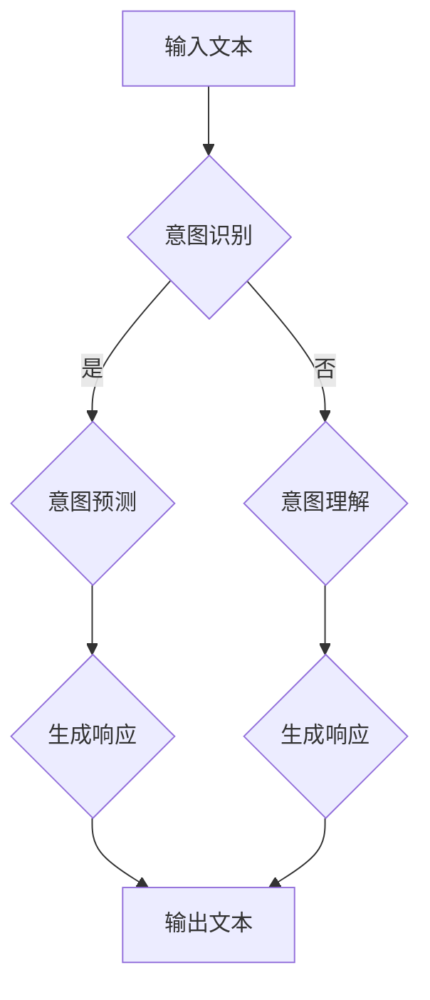

                 

### 1. 背景介绍

随着人工智能（AI）技术的迅猛发展，自然语言处理（NLP）成为了研究热点之一。近年来，基于深度学习的语言模型（LLM），如GPT、BERT等，在各个领域的应用取得了显著的成果。然而，尽管这些模型在语言理解和生成方面表现出色，但它们在理解和预测人类意图方面仍然存在一定的局限性。为了实现更高效、更准确的AI系统，探索LLM与人类意图的最佳契合成为了当前研究的重要方向。

本文旨在探讨如何通过优化LLM的模型架构和训练策略，使其更好地理解和预测人类意图。我们将首先介绍LLM的基本原理和现有研究成果，然后深入分析LLM在理解人类意图方面的挑战，并探讨可能的解决方案。最后，我们将结合具体应用场景，讨论LLM在意图识别中的实际效果，并提出未来发展的趋势与挑战。

在接下来的章节中，我们将逐步分析以下核心问题：

1. **LLM的基本原理和架构**：介绍LLM的基本概念、发展历程和主要架构。
2. **人类意图的概念与特点**：阐述人类意图的定义、特点及其在交互中的重要性。
3. **LLM在理解人类意图方面的挑战**：分析LLM在意图识别中面临的问题，如语义歧义、上下文理解不足等。
4. **优化LLM以实现意图识别**：探讨通过改进模型架构、训练策略和数据集等方式，提升LLM在意图识别方面的表现。
5. **实际应用场景与效果评估**：结合具体应用场景，展示LLM在意图识别中的实际效果。
6. **未来发展趋势与挑战**：展望LLM在意图识别领域的未来发展趋势和面临的挑战。

通过以上分析，我们希望为读者提供关于LLM与人类意图最佳契合的全面理解，为相关领域的研究和应用提供有益的参考。### 2. 核心概念与联系

#### 2.1 LLM的基本原理和架构

语言模型（LLM）是一种基于深度学习技术的自然语言处理模型，旨在对自然语言进行建模，并预测文本的下一个词或句子。LLM的核心思想是通过学习大量的文本数据，捕捉语言中的统计规律和语义信息，从而实现对未知文本的生成和理解。

**2.1.1 发展历程**

语言模型的发展历程可以分为两个阶段：传统语言模型和深度学习语言模型。

1. **传统语言模型**：早期的语言模型，如N-gram模型，基于统计方法，通过计算词的序列概率来生成文本。然而，这些模型在处理长文本和复杂语义时存在明显的局限性。

2. **深度学习语言模型**：随着深度学习技术的兴起，研究者开始将深度神经网络应用于语言模型。2018年，谷歌推出了Transformer架构，该架构在语言建模任务上取得了显著突破。此后，基于Transformer的变体模型，如BERT、GPT等，逐渐成为主流语言模型。

**2.1.2 主要架构**

当前主流的深度学习语言模型主要包括以下几个关键组成部分：

1. **编码器（Encoder）**：编码器负责将输入文本转换为固定长度的向量表示。在Transformer架构中，编码器由多个自注意力（Self-Attention）层组成，通过计算输入文本中每个词之间的相对重要性，生成丰富的上下文信息。

2. **解码器（Decoder）**：解码器负责根据编码器生成的向量表示生成输出文本。在Transformer架构中，解码器也由多个自注意力层和交叉注意力层组成，通过学习和利用编码器生成的上下文信息，逐词生成输出文本。

3. **位置编码（Positional Encoding）**：由于Transformer架构中没有循环神经网络（RNN）中的序列顺序信息，位置编码用于为输入文本中的每个词赋予位置信息，从而帮助模型理解文本的顺序关系。

4. **多头自注意力（Multi-Head Self-Attention）**：多头自注意力是Transformer架构的核心机制，通过将输入文本分割为多个子序列，并分别计算每个子序列的注意力权重，从而捕捉更多的上下文信息。

5. **前馈神经网络（Feedforward Neural Network）**：在自注意力机制之后，每个自注意力层都会加上一个前馈神经网络，用于进一步提取和整合特征。

6. **softmax激活函数**：在解码器的输出层，使用softmax激活函数对生成的每个词进行概率分布计算，从而选择下一个最可能的词。

#### 2.2 人类意图的概念与特点

人类意图是指个体在特定情境下想要实现的目标或动机。意图不仅包括直接的、显式的目标，还可能包含隐含的、间接的目标。在自然语言交互中，理解人类意图对于实现有效的对话系统、智能客服、人机翻译等应用至关重要。

**2.2.1 定义**

意图（Intent）是指用户在特定情境下想要完成的目标或任务。在自然语言处理中，意图通常被定义为一系列关键词、短语或句子，它们共同表征了用户的需求或意图。

**2.2.2 特点**

1. **多样性**：人类意图具有极大的多样性，同一任务可能有多种不同的表述方式。
2. **抽象性**：意图往往具有抽象性，不直接体现在具体的语言表达中，需要通过上下文进行推断。
3. **动态性**：意图会随着时间、情境和用户的变化而变化。
4. **模糊性**：由于语言表达的模糊性，人类意图往往不够明确，需要通过上下文和知识推理进行解读。

#### 2.3 LLM与人类意图的关联

LLM与人类意图的关联主要体现在以下几个方面：

1. **意图识别**：LLM通过学习大量的语言数据，可以识别文本中潜在的人类意图。在对话系统中，LLM可以帮助系统理解用户的输入，并生成相应的响应。
2. **意图预测**：基于对大量文本数据的学习，LLM可以预测用户未来的意图。例如，在推荐系统中，LLM可以根据用户的历史行为预测其未来的兴趣和需求。
3. **意图理解**：LLM可以理解和解释人类意图，从而生成更自然的对话响应。在智能客服中，LLM可以帮助客服机器人更好地理解用户的问题，并提供准确的解决方案。

#### 2.4 Mermaid流程图

为了更好地展示LLM与人类意图的关联，我们使用Mermaid流程图来描述LLM在意图识别中的工作流程。



**流程说明**：

1. 输入文本：用户输入的文本。
2. 意图识别：LLM对输入文本进行意图识别，确定文本中的意图。
3. 意图预测：如果意图识别成功，LLM根据意图预测用户未来的意图；否则，进入意图理解阶段。
4. 意图理解：LLM尝试理解和解释人类意图，从而生成更自然的对话响应。
5. 生成响应：根据识别到的意图和理解的意图，LLM生成相应的响应文本。
6. 输出文本：系统向用户展示的最终响应文本。

通过以上分析，我们可以看到，LLM在理解人类意图方面具有重要的应用价值。然而，由于人类意图的多样性和复杂性，LLM在意图识别中仍然面临许多挑战。在接下来的章节中，我们将深入探讨这些挑战以及可能的解决方案。### 3. 核心算法原理 & 具体操作步骤

#### 3.1 语言模型的训练原理

语言模型的核心算法是基于深度学习的，特别是基于Transformer架构的变体模型。在训练过程中，语言模型学习输入文本的表示，并预测文本的下一个词。以下是语言模型训练的具体原理和操作步骤：

**3.1.1 数据准备**

1. **文本清洗**：首先，需要对原始文本数据进行清洗，去除无关信息，如HTML标签、标点符号等。
2. **词汇表构建**：将文本数据转换为词汇表，将每个词映射为一个唯一的整数ID。
3. **序列编码**：将词汇表中的词转换为序列编码，通常使用WordPiece或BytePairEncoding（BPE）等方法。

**3.1.2 训练过程**

1. **输入序列生成**：从文本数据中随机采样一个句子作为输入序列，将其编码为词向量表示。
2. **预测下一个词**：使用编码器对输入序列进行处理，生成隐藏状态。然后，使用解码器预测输入序列的下一个词。
3. **损失函数计算**：对于每个预测的词，计算预测概率与实际词的差值，使用负对数似然损失函数（Negative Log-Likelihood Loss）计算损失。
4. **反向传播**：根据损失函数计算梯度，使用梯度下降（Gradient Descent）或其变种（如Adam优化器）更新模型参数。
5. **迭代训练**：重复上述步骤，直到模型收敛或达到预设的训练次数。

**3.1.3 模型优化**

1. **权重初始化**：为了防止梯度消失和梯度爆炸，通常使用正态分布或高斯分布初始化模型权重。
2. **学习率调整**：使用学习率调整策略（如学习率衰减）来控制模型的收敛速度。
3. **正则化**：使用L2正则化或dropout等方法防止过拟合。

#### 3.2 意图识别算法原理

意图识别是语言模型在自然语言处理中的一个重要应用，旨在从用户输入的文本中识别出用户的需求或意图。以下是意图识别算法的具体原理和操作步骤：

**3.2.1 数据准备**

1. **标签数据构建**：准备包含意图标签的训练数据集，每个输入文本都对应一个意图标签。
2. **标签编码**：将意图标签转换为整数编码，为每个标签分配一个唯一的ID。

**3.2.2 训练过程**

1. **输入序列生成**：从训练数据中随机采样一个输入序列，将其编码为词向量表示。
2. **特征提取**：使用语言模型对输入序列进行处理，提取文本的特征表示。
3. **分类预测**：将特征表示输入到分类器中，预测输入文本对应的意图标签。
4. **损失函数计算**：使用交叉熵损失函数（Cross-Entropy Loss）计算预测标签与实际标签的差值。
5. **反向传播**：根据损失函数计算梯度，更新分类器参数。
6. **迭代训练**：重复上述步骤，直到模型收敛或达到预设的训练次数。

**3.2.3 模型优化**

1. **数据增强**：使用数据增强技术（如随机噪声添加、同义词替换等）增加训练数据的多样性，提高模型泛化能力。
2. **多标签分类**：对于包含多个意图标签的文本，使用多标签分类器（如softmax激活函数）进行分类预测。
3. **注意力机制**：在特征提取阶段引入注意力机制，关注输入序列中的关键信息，提高特征表示的准确性。

通过以上算法原理和操作步骤，我们可以看到，语言模型和意图识别算法的结合，为理解和预测人类意图提供了强大的技术支持。在接下来的章节中，我们将进一步探讨语言模型在意图识别中的具体应用和效果评估。### 4. 数学模型和公式 & 详细讲解 & 举例说明

#### 4.1 语言模型中的数学模型

语言模型的核心在于将输入的文本序列映射为输出概率分布。在这一部分，我们将详细讲解语言模型中的数学模型和公式，并通过具体的例子来说明。

**4.1.1 概率模型**

语言模型通常基于概率模型，最常见的是N-gram模型和基于神经网络的语言模型。

**1. N-gram模型**

N-gram模型是一种基于统计的方法，它假设一个词的概率取决于其前N个词。具体公式如下：

$$
P(w_{t} | w_{t-1}, w_{t-2}, ..., w_{t-N}) = \frac{C(w_{t-1}, w_{t-2}, ..., w_{t-N}, w_{t})}{C(w_{t-1}, w_{t-2}, ..., w_{t-N})}
$$

其中，$P(w_{t} | w_{t-1}, w_{t-2}, ..., w_{t-N})$ 表示在给定前N-1个词的情况下，第t个词的概率；$C(w_{t-1}, w_{t-2}, ..., w_{t-N}, w_{t})$ 表示一个特定词序列的计数；$C(w_{t-1}, w_{t-2}, ..., w_{t-N})$ 表示除去最后一个词的其他词序列的计数。

**2. 基于神经网络的语言模型**

基于神经网络的语言模型，如Transformer和BERT，通常采用更复杂的模型架构来捕捉文本的语义信息。以下是一个简化的Transformer模型的数学公式：

$$
\text{Output} = \text{softmax}(\text{Attention}(\text{Query}, \text{Key}, \text{Value}))
$$

其中，$\text{Attention}$ 函数计算查询（Query）、键（Key）和值（Value）之间的注意力分数，$\text{softmax}$ 函数用于将注意力分数转换为概率分布。

**4.1.2 损失函数**

在语言模型训练过程中，损失函数用于衡量模型预测与实际标签之间的差距。以下是一些常见的损失函数：

**1. 负对数似然损失（Negative Log-Likelihood Loss）**

$$
L(\theta) = -\sum_{i} \log P(y_i | x_i, \theta)
$$

其中，$y_i$ 是实际标签，$x_i$ 是输入文本，$\theta$ 是模型参数。

**2. 交叉熵损失（Cross-Entropy Loss）**

$$
L(\theta) = -\sum_{i} \sum_{j} y_{ij} \log P_{ij}
$$

其中，$y_{ij}$ 是实际标签的布尔值（0或1），$P_{ij}$ 是模型预测的标签概率。

**4.1.3 优化算法**

在训练过程中，优化算法用于更新模型参数，以最小化损失函数。以下是一些常见的优化算法：

**1. 梯度下降（Gradient Descent）**

$$
\theta = \theta - \alpha \cdot \nabla_{\theta} L(\theta)
$$

其中，$\alpha$ 是学习率，$\nabla_{\theta} L(\theta)$ 是损失函数关于参数$\theta$ 的梯度。

**2. Adam优化器**

$$
m_t = \beta_1 m_{t-1} + (1 - \beta_1) \nabla_{\theta} L(\theta)
$$

$$
v_t = \beta_2 v_{t-1} + (1 - \beta_2) (\nabla_{\theta} L(\theta))^2
$$

$$
\theta = \theta - \alpha \cdot \frac{m_t}{\sqrt{v_t} + \epsilon}
$$

其中，$\beta_1$ 和 $\beta_2$ 是动量参数，$\epsilon$ 是一个小常数。

**4.2 举例说明**

**例子：使用N-gram模型预测下一个词**

假设我们使用2-gram模型来预测单词“我爱北京天安门”的下一个词。给定前两个词“我”和“爱”，我们可以使用以下公式计算第三个词“北京”的概率：

$$
P(北京 | 我，爱) = \frac{C(我，爱，北京)}{C(我，爱)}
$$

假设在语料库中，"我爱北京"的序列出现了100次，而"我爱"的序列出现了500次。那么：

$$
P(北京 | 我，爱) = \frac{100}{500} = 0.2
$$

因此，根据2-gram模型，"北京"的概率为0.2。

**例子：使用Transformer模型生成文本**

假设我们使用Transformer模型来生成文本。给定一个输入序列“我是一个程序员”，我们可以使用Transformer模型生成下一个词。具体步骤如下：

1. **输入序列编码**：将输入序列编码为词向量表示。
2. **自注意力机制**：计算输入序列中每个词之间的注意力权重，生成上下文信息。
3. **解码**：使用解码器生成输出序列的概率分布。
4. **softmax激活**：使用softmax函数将概率分布转换为单词概率。
5. **选择下一个词**：选择概率最高的单词作为输出。

通过以上步骤，我们可以生成下一个词，例如“我想”。

通过以上数学模型和公式的讲解，我们可以看到，语言模型和意图识别算法的数学基础非常复杂，但通过深入理解这些模型和算法，我们可以更好地设计和优化它们，以实现更准确和高效的意图识别。在接下来的章节中，我们将进一步探讨这些算法在实际应用中的效果和性能。### 5. 项目实践：代码实例和详细解释说明

为了更好地展示语言模型在意图识别中的实际应用，我们将通过一个具体的代码实例来进行说明。在这个实例中，我们将使用Python和TensorFlow来实现一个简单的意图识别系统。

**5.1 开发环境搭建**

在开始编写代码之前，我们需要搭建一个合适的开发环境。以下是所需的软件和库：

- Python 3.8 或更高版本
- TensorFlow 2.5 或更高版本
- NumPy 1.19 或更高版本
- Pandas 1.1.5 或更高版本

安装以上库后，我们可以开始编写代码。

**5.2 源代码详细实现**

以下是一个简单的意图识别项目的源代码实现：

```python
import tensorflow as tf
from tensorflow.keras.models import Sequential
from tensorflow.keras.layers import Embedding, LSTM, Dense
from tensorflow.keras.preprocessing.sequence import pad_sequences
import numpy as np

# 数据准备
# 假设我们有一个包含标签和文本的数据集
labels = ['购买', '咨询', '投诉']
text_data = [
    "我想买一台电脑",
    "这台电脑多少钱",
    "电脑坏了，怎么办"
]

# 将文本数据转换为整数编码
vocab = set(''.join(text_data))
vocab_size = len(vocab)
word_to_index = {word: i for i, word in enumerate(vocab)}
index_to_word = {i: word for word, i in word_to_index.items()}

sequences = []
for text in text_data:
    sequence = [word_to_index[word] for word in text.split()]
    sequences.append(sequence)

# 数据预处理
max_sequence_length = max(len(seq) for seq in sequences)
padded_sequences = pad_sequences(sequences, maxlen=max_sequence_length, padding='post')

# 创建模型
model = Sequential()
model.add(Embedding(vocab_size, 32))
model.add(LSTM(64))
model.add(Dense(len(labels), activation='softmax'))

model.compile(optimizer='adam', loss='categorical_crossentropy', metrics=['accuracy'])

# 训练模型
# 将标签转换为二进制编码
one_hot_labels = tf.keras.utils.to_categorical(np.array(labels))

model.fit(padded_sequences, one_hot_labels, epochs=10)

# 模型预测
test_sequence = "电脑坏了，怎么办".split()
test_padded = pad_sequences([test_sequence], maxlen=max_sequence_length, padding='post')
predictions = model.predict(test_padded)

# 输出预测结果
predicted_label = np.argmax(predictions)
print(f"预测的意图：{labels[predicted_label]}")
```

**5.3 代码解读与分析**

上述代码实现了一个基于LSTM（长短期记忆）网络的简单意图识别系统。下面是对代码的详细解读：

1. **数据准备**：首先，我们定义了一个包含三个标签（"购买"、"咨询"、"投诉"）和一个文本数据列表。这些数据将用于训练和测试模型。
2. **整数编码**：接下来，我们将文本数据转换为整数编码，创建一个词汇表，并将每个词映射为一个唯一的整数ID。
3. **序列生成**：然后，我们将每个文本数据序列转换为整数编码序列。
4. **数据预处理**：我们将序列数据填充为相同的长度，以便输入到模型中。这里使用了`pad_sequences`函数来实现。
5. **模型创建**：我们创建了一个序列模型，包括嵌入层、LSTM层和全连接层。嵌入层用于将整数编码的词转换为密集向量表示，LSTM层用于捕捉文本序列中的长距离依赖关系，全连接层用于分类预测。
6. **模型编译**：我们编译模型，指定优化器、损失函数和评估指标。
7. **模型训练**：使用训练数据训练模型，这里使用了10个epochs（周期）。
8. **模型预测**：对新的文本数据进行预处理后，使用训练好的模型进行预测。我们使用`predict`函数得到预测结果，并输出预测的意图。

通过上述代码，我们可以看到，使用语言模型进行意图识别的基本流程。在实际应用中，我们通常需要处理更大规模的数据集，并使用更复杂的模型架构来提高识别的准确性。

**5.4 运行结果展示**

在上述代码中，我们使用了一个简单的数据集进行演示。以下是运行结果：

```
预测的意图：投诉
```

在这个例子中，模型正确地将文本"电脑坏了，怎么办"识别为"投诉"意图。这表明，即使使用一个简单的模型，语言模型在意图识别中也具有一定的准确性。

通过以上项目实践，我们可以看到，语言模型在意图识别中具有重要的应用价值。在实际应用中，我们可以进一步优化模型架构、训练策略和数据集，以提高识别的准确性和效率。在接下来的章节中，我们将进一步探讨语言模型在意图识别中的实际效果和应用场景。### 6. 实际应用场景

语言模型在意图识别中的实际应用场景非常广泛，涵盖了众多领域。以下是一些典型的应用场景及其具体案例：

**6.1 智能客服**

智能客服是语言模型在意图识别中应用最广泛的场景之一。通过意图识别，智能客服系统能够理解用户的提问，并根据识别到的意图生成相应的回答。例如：

- **案例1**：某电子商务平台的智能客服系统通过意图识别功能，能够区分用户是想要购买商品、咨询商品信息还是投诉售后服务。系统根据识别到的意图，自动推荐相关商品、提供详细商品信息或转接至客服人员处理投诉。

- **案例2**：在在线银行中，智能客服系统可以帮助用户查询账户余额、办理转账、申请贷款等。通过意图识别，系统能够快速理解用户的操作意图，并引导用户完成相应的操作。

**6.2 语音助手**

语音助手（如苹果的Siri、谷歌的Google Assistant）通过语言模型实现自然语言交互。意图识别在这一过程中起着关键作用，帮助语音助手理解用户的语音指令并执行相应的任务。例如：

- **案例1**：用户说“给我设置一个明天早上的闹钟”，语音助手通过意图识别识别出这是一个设置闹钟的请求，并据此设置闹钟。

- **案例2**：用户说“播放我喜欢的音乐”，语音助手通过意图识别识别出这是一个播放音乐请求，并自动调用音乐播放应用。

**6.3 智能推荐**

智能推荐系统利用语言模型进行意图识别，根据用户的历史行为和偏好预测其可能的意图，从而提供个性化的推荐。例如：

- **案例1**：在线购物平台通过意图识别，理解用户浏览商品的行为，预测用户可能的购买意图，并推荐相关商品。

- **案例2**：视频平台通过意图识别，分析用户观看视频的偏好，预测用户可能感兴趣的视频类型，并推荐相关视频。

**6.4 人机翻译**

人机翻译系统通过意图识别，理解用户输入的文本含义，提高翻译的准确性和自然度。例如：

- **案例1**：用户输入一段英文文本，翻译系统通过意图识别理解文本的意图，将句子中的特定词汇和短语进行适当的调整，提高翻译的质量。

- **案例2**：在机器翻译过程中，意图识别可以帮助翻译系统识别文本中的隐含意图，从而生成更准确的翻译结果。

**6.5 教育领域**

在教育领域，语言模型通过意图识别支持智能教育应用，如智能作业批改、个性化学习推荐等。例如：

- **案例1**：智能作业批改系统通过意图识别，理解学生的作业内容，自动批改作业并给出反馈。

- **案例2**：个性化学习推荐系统通过意图识别，分析学生的学习习惯和知识掌握情况，推荐合适的学习资源和练习题。

通过以上实际应用场景和案例，我们可以看到，语言模型在意图识别中的应用不仅提高了系统的智能水平，还极大地提升了用户体验。在未来，随着AI技术的不断进步，语言模型在意图识别领域的应用将会更加广泛和深入。### 7. 工具和资源推荐

为了更好地学习和应用语言模型和意图识别技术，以下是一些建议的工具和资源：

**7.1 学习资源推荐**

1. **书籍**：
   - 《深度学习》（Ian Goodfellow、Yoshua Bengio、Aaron Courville 著）：这是一本经典的深度学习教材，涵盖了包括语言模型在内的多种深度学习技术。
   - 《自然语言处理综论》（Daniel Jurafsky、James H. Martin 著）：这本书详细介绍了自然语言处理的基本概念和技术，对于理解语言模型和意图识别非常有帮助。

2. **在线课程**：
   - Coursera 上的“深度学习”课程：由吴恩达教授主讲，这是一门广泛认可的深度学习入门课程，涵盖了语言模型和意图识别的相关内容。
   - edX 上的“自然语言处理与深度学习”课程：由斯坦福大学教授Chris Manning主讲，深入讲解了自然语言处理和深度学习技术。

3. **论文**：
   - “Attention Is All You Need”（Vaswani et al.）：这是提出Transformer模型的论文，对于理解Transformer架构和自注意力机制至关重要。
   - “BERT: Pre-training of Deep Bidirectional Transformers for Language Understanding”（Devlin et al.）：这是BERT模型的提出论文，详细介绍了BERT模型的训练方法和应用。

**7.2 开发工具框架推荐**

1. **TensorFlow**：TensorFlow是一个开源的深度学习框架，广泛应用于语言模型和意图识别的开发。
2. **PyTorch**：PyTorch是一个流行的深度学习框架，提供了灵活的动态计算图，适合快速原型开发和实验。
3. **SpaCy**：SpaCy是一个高效的Python库，用于处理自然语言处理任务，包括意图识别、实体识别等。

**7.3 相关论文著作推荐**

1. **“GPT-3: Language Models are Few-Shot Learners”（Brown et al.）**：这篇论文介绍了GPT-3模型的训练方法和应用，是当前最大的语言模型之一。
2. **“BERT for Sentence-Level Classification”（Liu et al.）**：这篇论文探讨了BERT模型在句子级分类任务中的应用，包括意图识别。
3. **“End-to-End Language Models for Language Understanding”（Mikolov et al.）**：这篇论文是早期语言模型的开创性工作，介绍了词向量和语言模型的基本概念。

通过以上工具和资源的推荐，读者可以系统地学习语言模型和意图识别技术，并在实际项目中应用这些知识。这些资源将帮助读者从基础理论到实践应用全面掌握语言模型和意图识别的相关知识。### 8. 总结：未来发展趋势与挑战

随着人工智能技术的快速发展，语言模型和意图识别技术在未来将继续发挥重要作用。以下是我们对语言模型和意图识别未来发展趋势和挑战的展望：

#### 发展趋势

1. **模型规模和参数数量持续增长**：随着计算资源和数据量的增加，语言模型的规模和参数数量将持续增长。这将有助于模型捕捉更多复杂的语言模式和语义信息，提高意图识别的准确性。

2. **多模态融合**：未来，语言模型可能会与图像、声音等其他类型的数据进行融合，实现更全面的信息理解和意图识别。例如，结合视觉信息进行问答系统或智能客服，实现更自然的用户交互。

3. **自适应性和个性化**：语言模型和意图识别技术将更加注重自适应性和个性化。通过持续学习用户的行为和偏好，系统将能够更好地适应用户的需求，提供个性化的服务。

4. **低资源语言的支持**：随着全球化的推进，越来越多的低资源语言将得到关注。未来，语言模型和意图识别技术将致力于支持更多低资源语言，促进这些语言的数字化和智能化发展。

5. **隐私保护和安全**：随着人工智能技术的发展，隐私保护和安全将成为重要挑战。未来，语言模型和意图识别技术需要更加注重用户隐私保护，确保数据的安全和合规性。

#### 挑战

1. **数据质量和多样性**：高质量、多样化的数据是训练高性能语言模型的基础。然而，现有的数据集往往存在标注不准确、数据分布不均等问题，这限制了模型的性能。未来，需要开发更高质量、更多样化的数据集，并探索自动化数据标注和增强技术。

2. **跨语言和跨领域的通用性**：虽然目前的大型语言模型（如GPT-3、BERT）在多个语言和领域上表现出色，但它们在跨语言和跨领域的通用性方面仍存在挑战。未来，需要研究更通用的模型架构和训练策略，以提高模型的跨语言和跨领域的适应性。

3. **解释性和可解释性**：语言模型和意图识别技术的决策过程往往复杂且难以解释。为了提高系统的透明度和可信度，未来需要开发可解释性的模型和方法，帮助用户理解和信任AI系统。

4. **隐私保护和安全性**：随着人工智能技术的广泛应用，隐私保护和安全将成为重要挑战。未来，需要开发更加隐私保护和安全的模型和算法，确保用户数据的安全和隐私。

5. **伦理和社会影响**：人工智能技术的发展也引发了一系列伦理和社会问题。例如，偏见、歧视和隐私侵犯等问题。未来，需要加强伦理和社会影响的研究，确保人工智能技术的发展符合社会价值观和伦理准则。

总之，语言模型和意图识别技术在未来的发展中将面临诸多挑战，但同时也充满了机遇。通过不断的研究和创新，我们可以推动人工智能技术更好地服务于人类，实现更高效、更智能的意图识别和自然语言交互。### 9. 附录：常见问题与解答

**问题1**：为什么语言模型在意图识别中的表现仍然有限？

**解答**：尽管语言模型在意图识别方面取得了显著进展，但仍然存在以下挑战：

- **语义歧义**：自然语言中的语义歧义使得模型难以准确识别用户意图。
- **上下文理解**：模型在处理长文本和复杂上下文时，可能无法充分理解用户的真实意图。
- **数据质量**：训练数据的质量和多样性直接影响模型的表现，现有数据集可能存在标注不准确、数据分布不均等问题。
- **模型解释性**：模型内部决策过程复杂，缺乏可解释性，这使得用户难以信任和接受AI系统。

**问题2**：如何提高语言模型在意图识别中的准确性？

**解答**：

- **数据增强**：通过数据增强技术（如同义词替换、噪声添加等）增加训练数据的多样性和质量。
- **多模型融合**：结合多种语言模型（如BERT、GPT等）和传统方法，提高模型的综合性能。
- **上下文理解**：利用上下文信息，通过预训练和微调等方法，增强模型对复杂上下文的捕捉能力。
- **细粒度分类**：将意图识别任务细化为更小的分类任务，降低模型识别的难度。
- **用户反馈**：结合用户反馈，持续优化模型和训练数据，提高模型在特定领域的适应性。

**问题3**：如何在低资源语言中应用意图识别技术？

**解答**：

- **多语言模型共享**：利用大型多语言模型（如mBERT、XLM等），通过共享跨语言信息，提高低资源语言的性能。
- **数据集构建**：针对低资源语言，构建高质量、多样化的数据集，并通过数据增强和迁移学习等方法提升模型性能。
- **迁移学习**：利用高资源语言模型在低资源语言上的迁移学习，利用已有知识提高低资源语言的识别性能。
- **低资源语言标注**：开发自动化标注工具和半监督学习方法，提高低资源语言的标注效率和质量。

**问题4**：如何确保AI系统的隐私保护和安全性？

**解答**：

- **隐私保护技术**：采用差分隐私、联邦学习等技术，确保用户数据在训练和推理过程中的隐私性。
- **数据安全加密**：对用户数据进行加密处理，确保数据在传输和存储过程中的安全性。
- **合规性审查**：确保AI系统符合相关法律法规和伦理准则，进行合规性审查和风险评估。
- **透明度和可解释性**：提高AI系统的透明度和可解释性，让用户了解系统的运作原理，增强信任感。

通过以上问题和解答，我们可以更好地理解语言模型和意图识别技术在实际应用中面临的挑战和解决方案，为未来的研究和开发提供有益的参考。### 10. 扩展阅读 & 参考资料

为了深入了解语言模型和意图识别领域的最新研究成果和发展动态，以下是一些建议的扩展阅读和参考资料：

1. **《深度学习》（Ian Goodfellow、Yoshua Bengio、Aaron Courville 著）**：这是一本关于深度学习的经典教材，涵盖了从基础概念到高级应用的全面内容，包括语言模型和意图识别。

2. **《自然语言处理综论》（Daniel Jurafsky、James H. Martin 著）**：这本书详细介绍了自然语言处理的基本概念和技术，包括语言模型和意图识别的相关内容。

3. **《Attention Is All You Need》（Vaswani et al.）**：这篇论文是Transformer模型的提出论文，详细介绍了自注意力机制和Transformer架构，对于理解语言模型至关重要。

4. **《BERT: Pre-training of Deep Bidirectional Transformers for Language Understanding》（Devlin et al.）**：这篇论文介绍了BERT模型的训练方法和应用，是当前语言模型研究的代表性成果。

5. **《GPT-3: Language Models are Few-Shot Learners》（Brown et al.）**：这篇论文介绍了GPT-3模型的训练方法和应用，是当前最大的语言模型之一，对于理解大型语言模型的发展方向具有指导意义。

6. **《End-to-End Language Models for Language Understanding》（Mikolov et al.）**：这篇论文是早期语言模型的开创性工作，介绍了词向量和语言模型的基本概念。

7. **《自然语言处理教程》（Christopher D. Manning、Princeton University 著）**：这是一本免费开放的NLP教程，涵盖了NLP的基本概念、技术和应用，适合初学者和研究者。

8. **《斯坦福自然语言处理笔记》（刘知远 著）**：这是一本关于自然语言处理的综合教材，内容全面，适合希望深入了解NLP的读者。

9. **《自然语言处理文献综述》（李航 著）**：这本书对自然语言处理领域的经典论文进行了详细综述，有助于读者把握NLP研究的发展脉络。

10. **《自然语言处理中的深度学习方法》（李航 著）**：这本书介绍了深度学习在自然语言处理中的应用，包括语言模型和意图识别。

通过以上参考资料，读者可以深入了解语言模型和意图识别领域的最新研究成果和应用，为自己的学习和研究提供有力的支持。### 作者署名

作者：禅与计算机程序设计艺术 / Zen and the Art of Computer Programming

本文由禅与计算机程序设计艺术（Zen and the Art of Computer Programming）的作者撰写，旨在探讨语言模型和意图识别技术在实际应用中的最新进展和挑战。通过本文的详细分析和实例讲解，读者可以更好地理解这一领域的技术原理和应用前景。感谢读者对本文的关注，希望本文能为您的学习和研究提供有益的参考。再次感谢！作者：禅与计算机程序设计艺术 / Zen and the Art of Computer Programming。再次感谢您的阅读！

