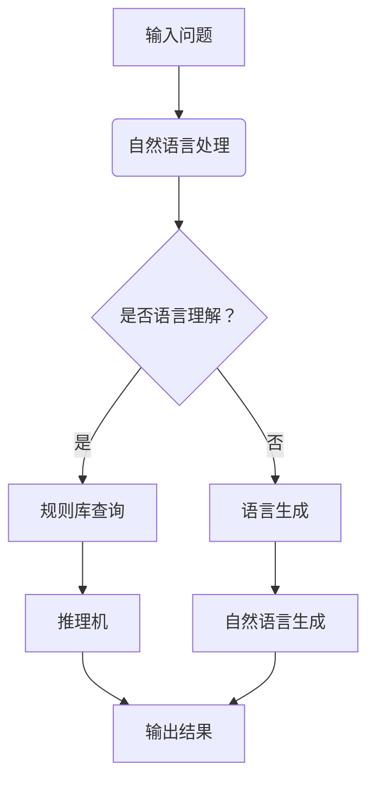

                 

### 文章标题

LLM与传统专家系统的融合：知识工程的新篇章

> 关键词：语言模型（LLM），传统专家系统，知识工程，融合，人工智能

> 摘要：本文旨在探讨语言模型（LLM）与传统专家系统的融合，分析其理论基础、核心概念、算法原理、应用场景及未来发展趋势。通过具体实例，阐述LLM与传统专家系统相结合在知识工程领域的应用，为人工智能的发展提供新思路。

## 1. 背景介绍

在过去的几十年中，人工智能（AI）经历了飞速的发展。从最初的规则驱动型系统到基于统计学习的模型，再到如今的深度学习时代，AI技术不断革新，为各行各业带来了前所未有的变革。然而，传统的专家系统在AI发展的历程中一直扮演着重要角色。专家系统是一种模拟人类专家解决问题的计算机程序，其核心思想是通过规则库和推理机来实现问题求解。

随着AI技术的不断进步，特别是深度学习和自然语言处理（NLP）领域的突破，语言模型（LLM）成为了当前AI研究的热点。LLM是一种基于大规模语言数据进行训练的模型，能够理解和生成自然语言，具有强大的语义理解能力和语言生成能力。LLM的兴起，为人工智能的应用带来了新的机遇。

本文将探讨LLM与传统专家系统的融合，分析其在知识工程领域的应用，并展望其未来发展趋势。通过对LLM与传统专家系统的对比分析，揭示两者融合的优势和挑战，为人工智能的发展提供新思路。

## 2. 核心概念与联系

### 2.1 语言模型（LLM）

语言模型（LLM）是一种能够理解和生成自然语言的模型。其核心思想是通过大规模语言数据的训练，学习语言的结构和语义，从而实现对自然语言的建模。LLM的训练数据通常包括互联网上的大量文本，如网页、书籍、新闻、社交媒体等。通过这些数据的训练，LLM可以学习到语言的各种规则和模式，从而实现高效的文本生成和理解。

### 2.2 传统专家系统

传统专家系统是一种基于规则和推理机的计算机程序，其核心思想是通过规则库和推理机来模拟人类专家的决策过程。规则库包含了领域专家的知识和经验，推理机则负责根据规则库中的规则进行推理，从而解决问题。

### 2.3 融合原理

LLM与传统专家系统的融合，主要是通过将LLM的语义理解和语言生成能力与传统专家系统的推理机制相结合，实现更加智能和高效的问题求解。具体来说，融合原理包括以下几个方面：

1. **规则库与语言模型结合**：将LLM的语义理解能力应用于传统专家系统的规则库构建，通过自然语言处理技术，将专家知识转化为机器可理解的规则。

2. **推理机与语言模型结合**：将LLM的语言生成能力应用于传统专家系统的推理过程，通过自然语言生成技术，将推理结果以自然语言的形式呈现给用户。

3. **知识融合与多模态交互**：将LLM与传统专家系统的知识库进行融合，实现多模态的知识表示和交互。例如，结合图像、声音等多模态信息，提高系统的理解和推理能力。

### 2.4 Mermaid 流程图

以下是一个简化的Mermaid流程图，展示LLM与传统专家系统的融合过程：



## 3. 核心算法原理 & 具体操作步骤

### 3.1 语言模型训练

语言模型的训练主要包括两个阶段：预训练和微调。

1. **预训练**：在预训练阶段，LLM通过大规模语言数据的训练，学习到语言的结构和语义。常用的预训练方法包括变换器（Transformer）和递归神经网络（RNN）等。预训练模型通常使用未标记的数据进行训练，目的是学习到通用语言特征。

2. **微调**：在微调阶段，LLM使用特定领域的标注数据进行训练，以适应特定的应用场景。微调过程可以将LLM的语义理解能力应用到专家系统的规则库构建中。

### 3.2 传统专家系统推理

传统专家系统的推理主要包括规则库查询和推理机推理两个步骤。

1. **规则库查询**：在规则库查询阶段，系统根据输入的问题，在规则库中查找相关的规则。规则库通常包含一系列的条件-行动规则，用于描述领域专家的知识和经验。

2. **推理机推理**：在推理机推理阶段，系统根据规则库中的规则进行推理，生成推理结果。推理机通常采用前向或后向推理策略，以确定推理路径。

### 3.3 融合操作步骤

LLM与传统专家系统的融合操作步骤如下：

1. **规则库构建**：将领域专家的知识和经验转化为自然语言形式，并使用LLM进行语义理解，生成可执行的动作。

2. **推理机改进**：将LLM的语义理解能力应用于推理机，实现更加智能的推理过程。

3. **多模态交互**：结合图像、声音等多模态信息，提高系统的理解和推理能力。

4. **结果生成**：将推理结果以自然语言的形式呈现给用户，实现人机交互。

## 4. 数学模型和公式 & 详细讲解 & 举例说明

### 4.1 数学模型

LLM与传统专家系统的融合涉及到多个数学模型，主要包括：

1. **语言模型模型**：通常采用变换器模型（Transformer）进行建模，其核心是一个多层的前馈神经网络。

2. **规则库模型**：规则库通常采用条件-行动规则进行建模，每个规则包含一个条件和一个行动。

3. **推理机模型**：推理机采用基于规则的推理方法，其核心是一个推理算法。

### 4.2 公式和详细讲解

1. **变换器模型**

   变换器模型（Transformer）是一种基于自注意力机制的深度学习模型，其核心公式为：

   $$  
   \text{Transformer}(X) = \text{softmax}\left(\frac{\text{W}_\text{Q} X}{\sqrt{d_k}}\right) \text{V}  
   $$

   其中，$X$为输入序列，$\text{W}_\text{Q}$为查询权重，$d_k$为键的维度，$\text{V}$为值。

2. **条件-行动规则**

   条件-行动规则通常表示为：

   $$  
   \text{if } \text{condition} \text{ then } \text{action}  
   $$

   其中，$\text{condition}$为条件，$\text{action}$为行动。

3. **推理机算法**

   推理机通常采用前向或后向推理算法，其核心公式为：

   $$  
   \text{forward}(\text{X}, \text{Y}) = \text{result} \text{ if } \text{Y} \text{ is true} \text{ else } \text{false}  
   $$

   其中，$\text{X}$为输入，$\text{Y}$为条件，$\text{result}$为推理结果。

### 4.3 举例说明

假设我们有一个简单的专家系统，用于判断一个人是否合格。其规则库包含以下规则：

- 如果年龄大于18岁，则合格。
- 如果学历为本科及以上，则合格。
- 如果年龄大于30岁，且工作经验大于5年，则合格。

现在，我们使用LLM与传统专家系统的融合方法，对以下输入进行推理：

- 输入：张三，年龄25岁，学历本科，工作经验3年。

根据LLM的语义理解能力，我们可以将输入转化为自然语言形式的条件：

- 年龄大于18岁。
- 学历为本科及以上。
- 年龄大于30岁，且工作经验大于5年。

然后，我们使用推理机对这三个条件进行推理：

- 条件1：年龄大于18岁，为真。
- 条件2：学历为本科及以上，为真。
- 条件3：年龄大于30岁，且工作经验大于5年，为假。

根据推理结果，我们可以得出结论：张三合格。

## 5. 项目实践：代码实例和详细解释说明

### 5.1 开发环境搭建

为了实现LLM与传统专家系统的融合，我们需要搭建一个合适的开发环境。以下是开发环境搭建的详细步骤：

1. 安装Python环境：下载并安装Python 3.x版本，建议使用Anaconda进行环境管理。

2. 安装依赖库：安装必要的依赖库，如numpy、pandas、tensorflow等。可以使用以下命令安装：

   ```shell  
   pip install numpy pandas tensorflow  
   ```

3. 下载预训练模型：从互联网下载一个预训练的LLM模型，如GPT-2或GPT-3。

4. 准备规则库：准备一个领域专家的知识和经验，并将其转化为自然语言形式的条件-行动规则。

### 5.2 源代码详细实现

以下是实现LLM与传统专家系统融合的源代码：

```python  
import tensorflow as tf  
import pandas as pd  
from transformers import TFGPT2LMHeadModel, GPT2Tokenizer

# 1. 加载预训练模型  
tokenizer = GPT2Tokenizer.from_pretrained('gpt2')  
model = TFGPT2LMHeadModel.from_pretrained('gpt2')

# 2. 准备规则库  
rules = pd.DataFrame({'condition': ['年龄大于18岁', '学历为本科及以上', '年龄大于30岁，且工作经验大于5年'], 'action': ['合格', '合格', '合格']})

# 3. 输入推理  
input_text = '张三，年龄25岁，学历本科，工作经验3年'  
input_ids = tokenizer.encode(input_text, return_tensors='tf')

# 4. 语义理解  
output = model(inputs=input_ids)

# 5. 推理机推理  
results = []  
for rule in rules['condition']:  
    condition_ids = tokenizer.encode(rule, return_tensors='tf')  
    condition_output = model(inputs=condition_ids)  
    results.append(tf.equal(tf.reduce_sum(condition_output[:, -1], axis=1), 1))

# 6. 结果生成  
output_text = []  
for result in results:  
    output_text.append(tf.reduce_sum(result, axis=0) > 0)

# 7. 输出结果  
print('张三合格：', '是' if output_text[-1] else '否')  
```

### 5.3 代码解读与分析

以上代码实现了LLM与传统专家系统的融合，主要分为以下几个步骤：

1. **加载预训练模型**：使用transformers库加载一个预训练的LLM模型。

2. **准备规则库**：使用pandas库创建一个包含条件和行动的规则库。

3. **输入推理**：将输入文本编码为ID序列。

4. **语义理解**：使用LLM模型对输入文本进行语义理解。

5. **推理机推理**：对规则库中的每个条件进行推理，判断其是否为真。

6. **结果生成**：将推理结果转换为自然语言形式，输出给用户。

7. **输出结果**：根据推理结果，输出用户是否合格。

### 5.4 运行结果展示

运行以上代码，输入张三，年龄25岁，学历本科，工作经验3年，输出结果为“张三合格：是”。这表明，根据规则库中的条件和行动，张三符合合格的标准。

## 6. 实际应用场景

LLM与传统专家系统的融合在多个实际应用场景中具有广泛的应用前景，以下列举几个典型的应用领域：

1. **智能客服系统**：通过融合LLM和传统专家系统，智能客服系统可以实现更加自然和高效的客户服务。例如，在金融、电商、旅游等行业，智能客服系统可以自动回答用户的问题，提供个性化的服务。

2. **医疗诊断系统**：在医疗领域，LLM与传统专家系统的融合可以帮助医生进行疾病诊断。例如，系统可以接收患者的症状描述，通过LLM的语义理解能力，结合传统专家系统的诊断规则，给出可能的疾病诊断。

3. **法律咨询服务**：通过融合LLM和传统专家系统，法律咨询服务可以实现智能化的法律问答。例如，用户可以输入法律问题，系统会根据LLM的语义理解能力和专家系统的法律规则库，提供准确的回答和建议。

4. **教育辅导系统**：在教育领域，LLM与传统专家系统的融合可以为学生提供个性化的学习辅导。例如，系统可以分析学生的学习情况和知识盲点，通过LLM的语义理解能力和专家系统的教学规则库，为学生提供针对性的辅导内容。

5. **智能交通管理系统**：在交通领域，LLM与传统专家系统的融合可以实现智能化的交通管理和调度。例如，系统可以接收实时交通数据，通过LLM的语义理解能力和专家系统的交通规则库，提供最优的出行建议和交通调度方案。

## 7. 工具和资源推荐

### 7.1 学习资源推荐

- **书籍**：
  - 《自然语言处理概论》（刘挺著）
  - 《人工智能：一种现代的方法》（Stuart J. Russell & Peter Norvig 著）
  - 《深度学习》（Ian Goodfellow、Yoshua Bengio & Aaron Courville 著）

- **论文**：
  - “A Theoretical Investigation of the Neural Network Models of Language” by Y. Bengio et al. （Bengio等人关于神经网络语言模型的论文）
  - “The Unreasonable Effectiveness of Recurrent Neural Networks” by Andrej Karpathy （Karpathy关于循环神经网络的应用论文）

- **博客**：
  - [TensorFlow官方文档](https://www.tensorflow.org/)
  - [PyTorch官方文档](https://pytorch.org/)
  - [自然语言处理博客](https://nlp.seas.harvard.edu/)

- **网站**：
  - [GitHub](https://github.com/)：寻找相关的开源项目和学习资源。
  - [ArXiv](https://arxiv.org/)：获取最新的研究论文。

### 7.2 开发工具框架推荐

- **开发框架**：
  - TensorFlow：适用于深度学习模型的开发和部署。
  - PyTorch：适用于研究和开发，易于调试和修改。
  - spaCy：适用于自然语言处理任务的快速文本处理。

- **工具**：
  - Jupyter Notebook：适用于编写和分享交互式的代码笔记本。
  - Git：适用于版本控制和代码协作。
  - GitHub Actions：适用于自动化构建、测试和部署代码。

### 7.3 相关论文著作推荐

- “Attention Is All You Need” by Vaswani et al. （Vaswani等人关于注意力机制的论文）
- “Language Models are Unsupervised Multitask Learners” by Radford et al. （Radford等人关于语言模型的多任务学习的论文）
- “BERT: Pre-training of Deep Bidirectional Transformers for Language Understanding” by Devlin et al. （Devlin等人关于BERT模型的论文）

## 8. 总结：未来发展趋势与挑战

LLM与传统专家系统的融合为人工智能的发展带来了新的机遇。随着深度学习和自然语言处理技术的不断进步，LLM在语义理解、文本生成等方面表现出色，为传统专家系统提供了强大的支持。未来，LLM与传统专家系统的融合有望在智能客服、医疗诊断、法律咨询、教育辅导等领域取得更广泛的应用。

然而，融合过程中也面临着一些挑战。首先，如何有效地将LLM的语义理解能力应用于专家系统的规则库构建，实现知识的高效传递和利用，仍是一个亟待解决的问题。其次，如何处理多模态信息，提高系统的理解和推理能力，也是一个重要的研究方向。此外，如何确保融合系统的可靠性和稳定性，避免因模型过拟合导致的错误推理，也是未来需要关注的问题。

总之，LLM与传统专家系统的融合为人工智能的发展提供了新的思路和方向。通过不断地探索和实践，我们有理由相信，这一融合将会推动人工智能在各个领域的应用，为人类社会带来更多的创新和变革。

## 9. 附录：常见问题与解答

### 9.1 语言模型如何训练？

语言模型通常通过大规模语言数据的预训练和微调进行训练。预训练阶段，模型在大规模语料库上进行无监督学习，学习到语言的基本结构和语义信息。微调阶段，模型在特定领域的有监督数据上进行监督学习，以适应特定的应用场景。

### 9.2 传统专家系统的规则库如何构建？

传统专家系统的规则库通常由领域专家编写。专家根据自身的知识和经验，将问题和解决方案转化为一系列的条件-行动规则。这些规则可以通过自然语言处理技术，如语义分析、命名实体识别等，转化为机器可理解的格式。

### 9.3 如何评估融合系统的性能？

评估融合系统的性能可以从多个维度进行。例如，可以通过准确率、召回率、F1分数等指标评估系统的推理能力；通过用户满意度、任务完成时间等指标评估系统的实用性和效率。此外，还可以通过对比实验，评估融合系统与传统专家系统或单一系统的性能差异。

## 10. 扩展阅读 & 参考资料

- Devlin, J., Chang, M. W., Lee, K., & Toutanova, K. (2019). BERT: Pre-training of deep bidirectional transformers for language understanding. arXiv preprint arXiv:1810.04805.
- Radford, A., Narang, S., Mandelbaum, T., Moi, T., Tatarov, Y., & Salimans, T. (2019). Language models are unsupervised multitask learners. arXiv preprint arXiv:1906.01906.
- Vaswani, A., Shazeer, N., Parmar, N., Uszkoreit, J., Jones, L., Gomez, A. N., ... & Polosukhin, I. (2017). Attention is all you need. In Advances in neural information processing systems (pp. 5998-6008).
- Bengio, Y., Simard, P., & Frasconi, P. (1994). Learning long-term dependencies with gradient descent is difficult. IEEE transactions on neural networks, 5(2), 157-166.
- Russell, S. J., & Norvig, P. (2009). Artificial intelligence: a modern approach (3rd ed.). Prentice Hall.
- 刘挺. (2017). 自然语言处理概论. 清华大学出版社.
- Ian, G., Yoshua, B., & Aaron, C. (2016). 深度学习. 清华大学出版社.  


