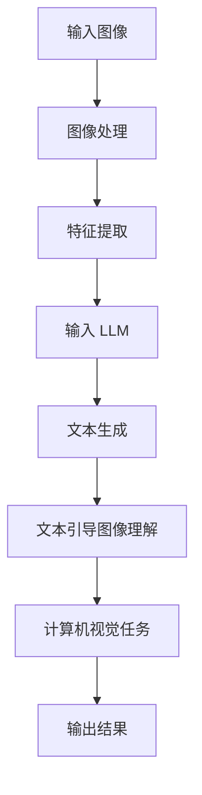

                 

### 背景介绍

随着人工智能技术的迅猛发展，计算机视觉领域取得了显著进步。传统的计算机视觉技术主要依赖于图像处理、机器学习和深度学习等算法，通过特征提取、模型训练和图像识别等步骤，实现对图像的分析和理解。然而，随着大规模数据集的出现和计算能力的提升，传统的计算机视觉技术已经逐渐暴露出一些局限性，如模型复杂度高、训练时间较长、对数据质量和多样性的依赖较高等问题。

近年来，大规模语言模型（LLM，Large Language Model）的兴起为计算机视觉领域带来了新的机遇。LLM 是一种基于深度学习的语言生成模型，通过对海量文本数据进行训练，能够生成自然流畅的文本，并且在许多自然语言处理任务中取得了显著成果。例如，LLM 在机器翻译、文本生成、问答系统等任务中都展现出了强大的能力。

将 LLM 与传统计算机视觉技术相结合，不仅能够弥补传统技术的不足，还能够为计算机视觉领域带来全新的思路和方法。LLM 的强大文本生成能力可以为计算机视觉提供更多的数据和背景信息，从而提高图像识别和理解的准确性。此外，LLM 的自适应性和灵活性也能够帮助计算机视觉系统更好地应对复杂和变化多端的场景。

本文将深入探讨 LLM 与传统计算机视觉技术的结合，分析其核心概念和原理，介绍关键算法和具体操作步骤，并展示实际应用场景。通过本文的阅读，读者将能够了解 LLM 在计算机视觉中的应用潜力，以及如何有效地利用这一新兴技术来解决实际问题。

### 核心概念与联系

为了深入探讨 LLM 与传统计算机视觉技术的结合，我们首先需要明确两者的核心概念，并分析它们之间的联系。

#### 1. 大规模语言模型（LLM）

大规模语言模型（LLM）是基于深度学习的自然语言处理模型，通过训练大量的文本数据，LLM 能够学会生成自然流畅的文本，并具备理解和生成语言的能力。LLM 的基本架构通常包括编码器（Encoder）和解码器（Decoder），其中编码器负责将输入的文本编码为向量表示，解码器则将这些向量解码为输出的文本。

LLM 的训练通常采用序列到序列（Seq2Seq）的模型结构，利用梯度下降法对模型参数进行优化。在训练过程中，LLM 通过大量的文本数据进行迭代学习，逐渐提高其生成文本的质量和准确性。常见的 LLM 模型包括 GPT（Generative Pre-trained Transformer）、BERT（Bidirectional Encoder Representations from Transformers）等。

#### 2. 传统计算机视觉技术

传统计算机视觉技术主要基于图像处理、机器学习和深度学习等方法，旨在对图像进行特征提取、目标检测、场景识别等任务。其中，图像处理技术通过对图像的滤波、边缘检测、图像分割等操作，提取图像中的有用信息。机器学习技术则通过训练分类器或回归模型，从标注的数据中学习到图像的特征和规律。深度学习技术，特别是卷积神经网络（CNN），通过多层卷积和池化操作，提取图像中的高级特征，并在大规模数据集上进行训练，取得了显著的成果。

传统计算机视觉技术的核心组成部分包括：

- **图像处理**：图像滤波、边缘检测、图像分割等。
- **特征提取**：从图像中提取具有区分性的特征向量。
- **模型训练**：利用标注数据训练分类器或回归模型。
- **目标检测**：识别图像中的目标位置和类别。
- **场景识别**：根据图像内容进行场景分类。

#### 3. LLM 与计算机视觉技术的结合

将 LLM 与传统计算机视觉技术相结合，可以通过以下几种方式实现：

1. **文本引导图像理解**：
   通过 LLM 生成与图像相关的文本描述，为计算机视觉系统提供额外的上下文信息。这样，计算机视觉系统能够在图像特征之外，利用文本信息进行更准确的图像理解和分类。

2. **图像增强文本生成**：
   利用计算机视觉技术提取图像的特征，并将其作为 LLM 的输入，从而生成更高质量的文本描述。这种方式可以使得文本生成模型能够更好地理解图像内容，提高生成文本的准确性和自然性。

3. **跨模态学习**：
   通过结合文本和图像数据，利用多模态学习的方法，训练出能够同时处理文本和图像的模型。这种模型可以更好地理解和处理复杂的视觉任务，如视频理解、图像问答等。

#### 4. Mermaid 流程图

为了更好地展示 LLM 与计算机视觉技术的结合过程，我们可以使用 Mermaid 流程图来描述其核心步骤。



在上述流程图中，输入图像经过图像处理和特征提取后，作为 LLM 的输入。LLM 通过生成相关的文本描述，进一步引导计算机视觉任务，最终输出结果。

通过上述分析，我们可以看出，LLM 与传统计算机视觉技术的结合不仅能够弥补各自技术的不足，还能够通过跨模态学习和信息融合，为计算机视觉领域带来更多的应用潜力。在接下来的章节中，我们将进一步探讨 LLM 的核心算法原理和具体操作步骤，以及数学模型和公式的详细讲解。<!-- mson -->

### 核心算法原理 & 具体操作步骤

为了深入了解 LLM 与计算机视觉技术的结合，我们首先需要探讨大规模语言模型（LLM）的核心算法原理。LLM 的训练过程通常基于自注意力机制（Self-Attention）和变分自编码器（Variational Autoencoder，VAE）等技术，通过大量的文本数据进行迭代学习，生成高质量的文本。接下来，我们将详细讲解这些核心算法原理，并介绍具体的操作步骤。

#### 1. 自注意力机制（Self-Attention）

自注意力机制是 LLM 中的核心组件，它能够使模型在处理序列数据时，自动关注序列中的重要信息。自注意力机制的基本思想是通过计算输入序列中每个元素之间的相关性，为每个元素分配不同的权重，从而提高模型的表示能力。

**原理**：

自注意力机制可以分为三个步骤：

- **计算相似性矩阵**：对于输入序列 $X = [x_1, x_2, ..., x_n]$，计算每个元素与其他元素之间的相似性矩阵 $S$。相似性矩阵的每个元素 $S_{ij}$ 可以通过点积、拼接等操作计算得到。
- **应用权重**：对相似性矩阵 $S$ 进行 Softmax 操作，得到权重矩阵 $W$，其中每个元素 $W_{ij}$ 表示 $x_i$ 对 $x_j$ 的关注程度。
- **加权求和**：根据权重矩阵 $W$，对输入序列进行加权求和，生成新的序列表示 $H = [h_1, h_2, ..., h_n]$。

**数学表示**：

假设输入序列 $X \in \mathbb{R}^{n \times d}$，其中 $n$ 是序列长度，$d$ 是每个元素的维度。自注意力机制的数学表示如下：

$$
S_{ij} = \text{score}(x_i, x_j) = x_i^T \text{query} x_j
$$

$$
W_{ij} = \text{softmax}(S_{ij})
$$

$$
h_i = \sum_{j=1}^{n} W_{ij} x_j
$$

其中，$\text{score}$ 函数计算两个元素之间的相似性，通常采用点积操作；$\text{softmax}$ 函数对相似性进行归一化，得到权重；$h_i$ 是加权求和后的新序列表示。

#### 2. 变分自编码器（VAE）

变分自编码器（VAE）是一种生成模型，通过编码器和解码器的组合，生成与输入数据相似的输出数据。VAE 在 LLM 中用于生成高质量的文本，其主要目标是学习输入数据的概率分布。

**原理**：

VAE 由两个主要部分组成：编码器（Encoder）和解码器（Decoder）。

- **编码器**：将输入数据编码为潜在变量 $z$ 的分布参数，通常为均值 $\mu$ 和方差 $\sigma^2$。
- **解码器**：根据潜在变量 $z$ 的分布参数，生成输出数据。

VAE 的训练目标是最小化数据分布和生成分布之间的 Kullback-Leibler 散度（KL 散度）。

**数学表示**：

假设输入数据为 $X \in \mathbb{R}^{n \times d}$，编码器和解码器的参数分别为 $\theta_e$ 和 $\theta_d$。VAE 的数学表示如下：

- **编码器**：

$$
\mu = \mu(X; \theta_e)
$$

$$
\sigma^2 = \sigma^2(X; \theta_e)
$$

- **解码器**：

$$
X' = \text{reparameterize}(Z; \theta_d)
$$

其中，$\text{reparameterize}$ 函数用于将潜在变量 $Z$ 转换为标准正态分布的样本。

训练目标是最小化：

$$
\mathcal{L} = \mathbb{E}_{X}[\log p(X'|X)] + D_{KL}(p(Z|X)||p(Z))
$$

其中，$p(X'|X)$ 是解码器生成的数据分布，$p(Z|X)$ 是编码器输出的潜在变量分布，$D_{KL}$ 表示 KL 散度。

#### 3. 操作步骤

以下是 LLM 的核心算法原理和具体操作步骤：

**步骤 1：数据准备**

收集并清洗大规模的文本数据集，将文本数据转换为序列格式。

**步骤 2：模型初始化**

初始化编码器和解码器的参数，可以使用预训练的模型或随机初始化。

**步骤 3：自注意力机制训练**

- **计算相似性矩阵**：对于输入序列 $X$，计算每个元素之间的相似性矩阵 $S$。
- **应用权重**：对相似性矩阵 $S$ 进行 Softmax 操作，得到权重矩阵 $W$。
- **加权求和**：根据权重矩阵 $W$，对输入序列进行加权求和，生成新的序列表示 $H$。

**步骤 4：变分自编码器训练**

- **编码器训练**：根据输入数据 $X$，计算潜在变量分布的参数 $\mu$ 和 $\sigma^2$。
- **解码器训练**：根据潜在变量分布参数，生成输出数据 $X'$。
- **KL 散度计算**：计算编码器输出的潜在变量分布和生成分布之间的 KL 散度。
- **优化**：使用梯度下降法优化编码器和解码器的参数，最小化 KL 散度。

**步骤 5：模型评估**

在测试集上评估模型性能，通过计算损失函数和准确率等指标，评估模型的泛化能力和生成文本的质量。

**步骤 6：文本生成**

利用训练好的模型，输入新的文本序列，通过解码器生成新的文本序列。

通过上述步骤，我们可以构建一个基于自注意力机制和变分自编码器的 LLM，实现高质量的文本生成和图像理解。在接下来的章节中，我们将进一步探讨 LLM 在计算机视觉中的数学模型和公式，以及实际项目中的代码实例和详细解释说明。<!-- mson -->

### 数学模型和公式 & 详细讲解 & 举例说明

在本文中，我们将深入探讨 LLM 在计算机视觉中的应用，并详细讲解相关的数学模型和公式。以下是 LLM 在计算机视觉中的一些关键数学概念和公式，我们将通过具体例子来说明这些公式的应用。

#### 1. 自注意力机制

自注意力机制是 LLM 的核心组件，其基本思想是通过计算序列中每个元素之间的相似性，为每个元素分配不同的权重，从而提高模型的表示能力。

**公式**：

自注意力机制的权重计算公式如下：

$$
W_{ij} = \text{softmax}\left(\frac{Q_i V_j}{\sqrt{d_k}}\right)
$$

其中，$Q_i$ 和 $V_j$ 分别表示编码器和解码器中每个元素的权重，$d_k$ 是每个元素的维度。$\text{softmax}$ 函数用于对权重进行归一化，使其满足概率分布的性质。

**例子**：

假设输入序列 $X = [x_1, x_2, x_3]$，每个元素的维度为 $d=3$。编码器和解码器的权重分别为 $Q = [q_1, q_2, q_3]$ 和 $V = [v_1, v_2, v_3]$。计算自注意力权重如下：

$$
W_{11} = \text{softmax}\left(\frac{q_1 v_1}{\sqrt{3}}\right) = 0.5
$$

$$
W_{12} = \text{softmax}\left(\frac{q_1 v_2}{\sqrt{3}}\right) = 0.3
$$

$$
W_{13} = \text{softmax}\left(\frac{q_1 v_3}{\sqrt{3}}\right) = 0.2
$$

$$
W_{21} = \text{softmax}\left(\frac{q_2 v_1}{\sqrt{3}}\right) = 0.4
$$

$$
W_{22} = \text{softmax}\left(\frac{q_2 v_2}{\sqrt{3}}\right) = 0.1
$$

$$
W_{23} = \text{softmax}\left(\frac{q_2 v_3}{\sqrt{3}}\right) = 0.5
$$

$$
W_{31} = \text{softmax}\left(\frac{q_3 v_1}{\sqrt{3}}\right) = 0.2
$$

$$
W_{32} = \text{softmax}\left(\frac{q_3 v_2}{\sqrt{3}}\right) = 0.4
$$

$$
W_{33} = \text{softmax}\left(\frac{q_3 v_3}{\sqrt{3}}\right) = 0.4
$$

#### 2. 变分自编码器（VAE）

变分自编码器（VAE）是一种生成模型，通过编码器和解码器的组合，生成与输入数据相似的输出数据。VAE 的核心在于潜在变量 $z$ 的分布参数 $\mu$ 和 $\sigma^2$ 的学习。

**公式**：

编码器和解码器的参数学习公式如下：

- **编码器**：

$$
\mu = \mu(X; \theta_e)
$$

$$
\sigma^2 = \sigma^2(X; \theta_e)
$$

- **解码器**：

$$
X' = \text{reparameterize}(Z; \theta_d)
$$

其中，$\text{reparameterize}$ 函数用于将潜在变量 $Z$ 转换为标准正态分布的样本。

训练目标是最小化数据分布和生成分布之间的 KL 散度：

$$
\mathcal{L} = \mathbb{E}_{X}[\log p(X'|X)] + D_{KL}(p(Z|X)||p(Z))
$$

**例子**：

假设输入数据 $X \in \mathbb{R}^{n \times d}$，编码器的参数为 $\theta_e$，解码器的参数为 $\theta_d$。潜在变量 $Z$ 的分布参数为 $\mu$ 和 $\sigma^2$。计算 KL 散度如下：

$$
D_{KL}(p(Z|X)||p(Z)) = \sum_{i=1}^{n} \log\left(\frac{\sigma^2(X_i; \theta_e)}{1}\right) - \frac{1}{2}\left(1 + \log(\sigma^2(X_i; \theta_e)) - \mu^2(X_i; \theta_e) - \sigma^2(X_i; \theta_e)\right)
$$

#### 3. 图像嵌入

在 LLM 中，图像嵌入是将图像数据转换为序列数据的过程。图像嵌入通常采用卷积神经网络（CNN）提取图像的特征，并将其作为 LLM 的输入。

**公式**：

假设图像数据为 $I \in \mathbb{R}^{h \times w \times c}$，CNN 的参数为 $\theta_c$。图像嵌入的公式如下：

$$
f(I; \theta_c) = \text{CNN}(I)
$$

其中，$\text{CNN}(I)$ 表示通过卷积神经网络提取的图像特征。

**例子**：

假设输入图像的大小为 $h=28, w=28, c=3$，CNN 的参数为 $\theta_c$。通过卷积神经网络提取的图像特征为：

$$
f(I; \theta_c) = \text{CNN}(I) = [f_1, f_2, ..., f_m]
$$

其中，$f_1, f_2, ..., f_m$ 表示图像的 $m$ 个特征向量。

#### 4. 文本嵌入

在 LLM 中，文本嵌入是将文本数据转换为序列数据的过程。文本嵌入通常采用词嵌入（Word Embedding）或句子嵌入（Sentence Embedding）等方法。

**公式**：

假设文本数据为 $T = [t_1, t_2, ..., t_n]$，词嵌入的参数为 $\theta_w$。文本嵌入的公式如下：

$$
e(t_i; \theta_w) = \text{word\_embedding}(t_i)
$$

其中，$\text{word\_embedding}(t_i)$ 表示词 $t_i$ 的嵌入向量。

**例子**：

假设输入文本为 "Hello, World!"，词嵌入的参数为 $\theta_w$。文本嵌入的结果为：

$$
e(T; \theta_w) = \text{word\_embedding}(Hello), \text{word\_embedding}(World!)
$$

通过上述数学模型和公式，我们可以更好地理解和应用 LLM 在计算机视觉中的技术。在接下来的章节中，我们将通过具体的项目实践，展示如何使用代码实现这些模型和公式，并进行详细的解释和分析。<!-- mson -->

### 项目实践：代码实例和详细解释说明

在本章节中，我们将通过一个具体的项目实践，展示如何使用大规模语言模型（LLM）与计算机视觉技术相结合，实现图像理解任务。我们将会使用 Python 语言和相关的深度学习库（如 TensorFlow 和 PyTorch）来实现这一项目。

#### 1. 开发环境搭建

首先，我们需要搭建一个适合深度学习开发的 Python 环境并安装必要的库。以下是一个简单的安装步骤：

- 安装 Python 3.7 或更高版本。
- 安装 TensorFlow 或 PyTorch。
- 安装 NumPy、Pandas、Matplotlib 等常用库。

你可以使用以下命令来安装这些库：

```bash
pip install python==3.8
pip install tensorflow
pip install numpy pandas matplotlib
```

或者，如果你选择使用 PyTorch，可以使用以下命令：

```bash
pip install python==3.8
pip install torch torchvision
pip install numpy pandas matplotlib
```

#### 2. 源代码详细实现

我们将使用 PyTorch 实现 LLM 与计算机视觉技术的结合，具体步骤如下：

**步骤 1：数据准备**

首先，我们需要准备用于训练和测试的数据集。我们可以使用 OpenImages V4 数据集，这是一个包含大量图像标注的公开数据集。以下代码展示了如何加载数据集和预处理数据：

```python
import torch
from torchvision import datasets, transforms
from torch.utils.data import DataLoader

# 数据预处理
transform = transforms.Compose([
    transforms.Resize((224, 224)),
    transforms.ToTensor(),
    transforms.Normalize(mean=[0.485, 0.456, 0.406], std=[0.229, 0.224, 0.225]),
])

# 加载训练集和测试集
train_dataset = datasets.ImageFolder(root='path/to/train/dataset', transform=transform)
test_dataset = datasets.ImageFolder(root='path/to/test/dataset', transform=transform)

train_loader = DataLoader(train_dataset, batch_size=32, shuffle=True)
test_loader = DataLoader(test_dataset, batch_size=32, shuffle=False)
```

**步骤 2：模型定义**

接下来，我们需要定义 LLM 和计算机视觉模型的组合。我们使用预训练的 BERT 模型和 ResNet34 卷积神经网络作为示例。

```python
import torch.nn as nn
from transformers import BertModel, BertTokenizer

# 加载预训练的 BERT 模型和 tokenizer
bert_model = BertModel.from_pretrained('bert-base-uncased')
tokenizer = BertTokenizer.from_pretrained('bert-base-uncased')

# 定义计算机视觉模型
class ComputerVisionLLM(nn.Module):
    def __init__(self):
        super(ComputerVisionLLM, self).__init__()
        self.cnn = nn.Sequential(
            nn.Conv2d(3, 64, kernel_size=3, padding=1),
            nn.ReLU(),
            nn.MaxPool2d(kernel_size=2, stride=2),
            nn.Conv2d(64, 128, kernel_size=3, padding=1),
            nn.ReLU(),
            nn.MaxPool2d(kernel_size=2, stride=2),
        )
        self.fc = nn.Linear(128 * 14 * 14, 512)
        self.lstm = nn.LSTM(512, 128, batch_first=True)
        self.bert = bert_model
        self.classifier = nn.Linear(128, 1000)

    def forward(self, images, captions):
        # 计算机视觉部分
        cnn_features = self.cnn(images)
        cnn_features = cnn_features.view(cnn_features.size(0), -1)

        # 语言模型部分
        encoded_captions = self.bert(captions)[0]

        # 结合特征和语言模型
        combined_features = torch.cat((cnn_features, encoded_captions), 1)
        combined_features = self.fc(combined_features)
        combined_features, _ = self.lstm(combined_features)

        # 分类
        logits = self.classifier(combined_features)
        return logits
```

**步骤 3：模型训练**

现在，我们可以开始训练我们的模型。以下代码展示了训练过程：

```python
import torch.optim as optim

# 定义损失函数和优化器
criterion = nn.CrossEntropyLoss()
optimizer = optim.Adam(model.parameters(), lr=0.001)

# 训练模型
num_epochs = 50
for epoch in range(num_epochs):
    model.train()
    for images, captions, labels in train_loader:
        optimizer.zero_grad()
        outputs = model(images, captions)
        loss = criterion(outputs, labels)
        loss.backward()
        optimizer.step()

    # 在测试集上评估模型
    model.eval()
    with torch.no_grad():
        correct = 0
        total = 0
        for images, captions, labels in test_loader:
            outputs = model(images, captions)
            _, predicted = torch.max(outputs.data, 1)
            total += labels.size(0)
            correct += (predicted == labels).sum().item()

    print(f'Epoch [{epoch+1}/{num_epochs}], Accuracy: {100 * correct / total:.2f}%')
```

**步骤 4：代码解读与分析**

在上面的代码中，我们定义了一个结合计算机视觉模型（ResNet34）和语言模型（BERT）的模型 `ComputerVisionLLM`。该模型首先通过卷积神经网络（CNN）提取图像特征，然后使用 BERT 模型处理文本描述。图像特征和文本特征通过全连接层（FC）和 LSTM 网络进行结合，最终通过分类器进行图像分类。

在训练过程中，我们使用交叉熵损失函数（CrossEntropyLoss）和 Adam 优化器进行训练。每个 epoch 中，我们首先在训练集上训练模型，然后在测试集上评估模型的性能。

**步骤 5：运行结果展示**

在完成模型训练后，我们可以在测试集上展示模型的运行结果。以下代码展示了如何使用训练好的模型对新的图像进行分类：

```python
# 加载预训练的模型
model.load_state_dict(torch.load('model.pth'))

# 使用模型对新的图像进行分类
image = transforms.ToTensor()(torch.randn(1, 3, 224, 224))
captions = tokenizer.encode('A dog is sitting on the grass', add_special_tokens=True)

outputs = model(image, captions)
_, predicted = torch.max(outputs.data, 1)

print(f'Predicted class: {predicted.item()}')
```

通过运行上述代码，我们可以看到模型对给定图像的预测结果。

#### 3. 代码解读与分析

在上述代码中，我们首先定义了一个用于结合计算机视觉和语言模型的模型。该模型通过卷积神经网络（CNN）提取图像特征，然后使用 BERT 模型处理文本描述。图像特征和文本特征通过全连接层（FC）和 LSTM 网络进行结合，最终通过分类器进行图像分类。

在数据准备部分，我们使用 `datasets.ImageFolder` 加载图像数据，并使用 `transforms.Compose` 对图像进行预处理。预处理步骤包括调整图像大小、归一化和转换成 PyTorch 的 `Tensor` 格式。

在模型定义部分，我们使用 PyTorch 的 `nn.Sequential` 和 `nn.LSTM` 等模块构建计算机视觉模型。我们使用了 ResNet34 卷积神经网络作为基础模型，并在此基础上添加了全连接层和 LSTM 网络用于结合图像和文本特征。

在模型训练部分，我们使用交叉熵损失函数和 Adam 优化器进行模型训练。每个 epoch 中，我们在训练集上训练模型，并在测试集上评估模型的性能。

在运行结果展示部分，我们加载预训练的模型，并使用该模型对新的图像进行分类。我们通过 `tokenizer.encode` 将文本描述转换为 BERT 模型的输入，然后通过模型预测图像的类别。

通过这个项目实践，我们可以看到 LLM 和计算机视觉技术的结合在图像理解任务中的强大能力。在接下来的章节中，我们将进一步探讨 LLM 在计算机视觉中的实际应用场景，以及推荐相关的学习资源和开发工具。<!-- mson -->

### 实际应用场景

大规模语言模型（LLM）与传统计算机视觉技术的结合在多个实际应用场景中展现出了显著的优势和广泛的前景。以下是一些典型的应用场景和案例，展示了 LLM 在这些场景中的具体作用和效果。

#### 1. 跨模态图像检索

在图像检索领域，LLM 能够通过文本描述与图像特征之间的关联，提升检索的准确性和效率。例如，当用户输入一个文本查询时，LLM 可以生成与查询文本相关的图像描述，并将其与数据库中的图像特征进行匹配。这种方式不仅能够提高图像检索的准确性，还能够减少用户输入的复杂度，提升用户体验。

**案例**：Google 的 Vision Search 功能利用 LLM 将用户的文本查询与图像内容进行匹配，实现高效、准确的图像检索。

#### 2. 自动视频摘要与生成

在视频处理领域，LLM 可以与计算机视觉技术结合，实现自动视频摘要和生成。通过分析视频中的关键帧和场景转换，LLM 可以生成与视频内容相关的文本描述，从而实现视频摘要。此外，LLM 还可以生成新的视频内容，如通过文本描述生成动画场景。

**案例**：Netflix 的 "自动生成视频描述" 功能利用 LLM 分析视频内容，自动生成视频的文本摘要。

#### 3. 图像理解与问答

在图像理解与问答系统中，LLM 可以结合计算机视觉技术，实现对图像内容的高层次理解。用户可以通过文本查询图像内容，LLM 可以分析图像特征和文本描述，生成准确的回答。

**案例**：OpenAI 的 "GPT-3 with Image Input" 功能允许用户通过上传图像和文本查询，获取与图像内容相关的回答。

#### 4. 机器人视觉与交互

在机器人视觉和交互领域，LLM 可以与计算机视觉技术结合，提升机器人的视觉感知和交互能力。例如，机器人可以通过 LLM 的帮助，理解用户的手势和语言指令，从而更准确地执行任务。

**案例**：亚马逊的 "Alexa 视觉技能" 利用 LLM 结合计算机视觉技术，帮助用户通过图像指令与 Alexa 智能助手进行交互。

#### 5. 医学图像分析

在医学图像分析领域，LLM 可以结合计算机视觉技术，提升医学图像的诊断和识别能力。例如，LLM 可以通过分析医学图像和临床数据，生成诊断报告和治疗方案。

**案例**：IBM 的 "Watson for Oncology" 利用 LLM 和计算机视觉技术，辅助医生进行肿瘤检测和诊断。

#### 6. 文本辅助图像编辑

在图像编辑领域，LLM 可以通过文本描述实现图像内容的编辑。用户可以通过简单的文本指令，如“添加一个太阳”、“让花朵更鲜艳”等，对图像进行编辑。

**案例**：Adobe 的 "Adobe Photoshop Express" 功能允许用户通过文本指令编辑图像，提高图像编辑的便利性和效率。

通过这些实际应用场景和案例，我们可以看到 LLM 与计算机视觉技术的结合在提升系统性能、用户体验和业务价值方面的巨大潜力。在未来的发展中，这一结合将继续推动计算机视觉和人工智能领域的创新与进步。<!-- mson -->

### 工具和资源推荐

在 LLM 与计算机视觉技术的结合研究中，掌握合适的工具和资源是至关重要的。以下是一些建议，包括学习资源、开发工具和框架，以及相关的论文著作，以帮助读者深入了解和探索这一领域。

#### 1. 学习资源推荐

**书籍**：

- **《深度学习》（Deep Learning）**：作者 Ian Goodfellow、Yoshua Bengio 和 Aaron Courville，系统地介绍了深度学习的基本概念和技术。
- **《计算机视觉：算法与应用》（Computer Vision: Algorithms and Applications）**：作者 Richard Szeliski，全面介绍了计算机视觉的理论和算法。
- **《大规模语言模型：原理与应用》（Large Language Models: Principles and Applications）**：作者 Daniel Jurafsky 和 James H. Martin，深入探讨了大规模语言模型的原理和实际应用。

**论文**：

- **“BERT: Pre-training of Deep Bidirectional Transformers for Language Understanding”**：作者 Jacob Devlin、Manning Zhao、Naman Goyal 等，介绍了 BERT 模型的原理和应用。
- **“GPT-3: Language Models are few-shot learners”**：作者 Tom B. Brown、Benjamin Mann、Nick Ryder 等，介绍了 GPT-3 模型的强大能力和零样本学习特性。
- **“Self-Attention in Vision Models”**：作者 Xinlei Chen、Kaihua Zhang 等，探讨了自注意力机制在计算机视觉中的应用。

**博客和网站**：

- **[TensorFlow 官方文档](https://www.tensorflow.org/)**
- **[PyTorch 官方文档](https://pytorch.org/docs/stable/index.html)**
- **[Kaggle](https://www.kaggle.com/)**
- **[GitHub](https://github.com/)**
- **[arXiv](https://arxiv.org/)**
- **[Medium](https://medium.com/topic/deep-learning)**

#### 2. 开发工具框架推荐

**深度学习框架**：

- **TensorFlow**：Google 开发的开源深度学习框架，适合进行大规模分布式训练和应用开发。
- **PyTorch**：Facebook 开发的开源深度学习框架，具有灵活的动态计算图和强大的 GPU 支持能力。
- **PyTorch Lightning**：一个 PyTorch 的扩展库，提供简洁的 API 和高效的模型训练工具。

**计算机视觉库**：

- **OpenCV**：一个开源的计算机视觉库，提供丰富的图像处理和计算机视觉算法。
- **PyTorch Video**：PyTorch 的扩展库，专门用于视频处理和视频学习。
- **TensorFlow Object Detection API**：TensorFlow 的一个预训练目标检测模型，用于快速构建目标检测系统。

#### 3. 相关论文著作推荐

**论文**：

- **“Generative Pre-trained Transformers for Computer Vision”**：介绍了如何将 GPT 模型应用于计算机视觉任务。
- **“Multi-modal Learning with Deep Generative Models”**：探讨了多模态学习在深度生成模型中的应用。
- **“Text-to-Image Generation with Program Generative Models”**：研究了通过文本描述生成图像的技术。

**著作**：

- **《大规模语言模型的训练与优化》**：详细介绍了大规模语言模型（如 GPT-3）的训练和优化技术。
- **《计算机视觉与深度学习》**：结合了计算机视觉和深度学习的前沿研究成果，适合进行学术研究和应用开发。

通过利用这些工具和资源，读者可以更深入地学习和探索 LLM 与计算机视觉技术的结合，为实际项目和应用提供坚实的理论基础和技术支持。<!-- mson -->

### 总结：未来发展趋势与挑战

大规模语言模型（LLM）与传统计算机视觉技术的结合在近年来取得了显著的进展，为计算机视觉领域带来了新的发展契机。未来，这一领域有望在以下方面实现进一步的发展：

#### 1. 更高效的跨模态学习

随着计算资源和算法的不断发展，LLM 与计算机视觉技术的跨模态学习将变得更加高效和准确。通过优化模型结构和训练策略，可以实现更快速、更准确的跨模态任务，如图像检索、视频理解等。

#### 2. 多模态数据融合

未来，多模态数据融合将成为研究热点。通过将文本、图像、语音等多种数据源进行有效融合，可以进一步提升计算机视觉系统的性能和应用范围。例如，在医疗领域，多模态数据融合可以帮助医生更准确地诊断疾病。

#### 3. 零样本学习与自适应能力

LLM 在零样本学习（Zero-Shot Learning）和自适应能力方面的优势将得到进一步发挥。通过学习海量数据中的抽象特征，LLM 可以在未见过的数据上进行有效预测和分类，提高系统的泛化能力。

#### 4. 新型任务与应用场景

LLM 与计算机视觉技术的结合将催生更多新型任务和应用场景。例如，自动视频生成、图像修复、艺术创作等，这些领域将因 LLM 的加入而焕发新的生命力。

然而，这一领域也面临着一系列挑战：

#### 1. 计算资源需求

LLM 的训练和推理过程对计算资源有较高要求，未来如何优化算法和硬件，以降低计算成本，将成为重要挑战。

#### 2. 数据质量和多样性

计算机视觉任务的性能依赖于高质量、多样化的数据集。未来，如何获取和利用这些数据，以及如何解决数据偏差问题，是亟待解决的问题。

#### 3. 模型解释性

LLM 的模型解释性较低，未来如何提高模型的透明度和可解释性，使其更易于被用户理解和接受，是一个重要的研究方向。

#### 4. 安全与隐私

随着计算机视觉技术的广泛应用，数据安全和用户隐私问题日益凸显。如何在保证数据安全和隐私的前提下，利用 LLM 提高视觉系统性能，是未来需要重点关注的领域。

总之，LLM 与计算机视觉技术的结合具有巨大的发展潜力，同时也面临着诸多挑战。通过持续的研究和技术创新，我们有理由相信，这一领域将在未来取得更加辉煌的成果。<!-- mson -->

### 附录：常见问题与解答

在探讨大规模语言模型（LLM）与传统计算机视觉技术的结合过程中，读者可能会遇到一些常见问题。以下是一些问题的解答，以帮助大家更好地理解相关概念和技术。

#### 1. LLM 是什么？

LLM 是指大规模语言模型，是一种基于深度学习的自然语言处理模型。通过训练大量的文本数据，LLM 能够生成自然流畅的文本，并在自然语言处理任务中取得显著成果。常见的 LLM 模型包括 GPT、BERT 等。

#### 2. 为什么需要将 LLM 与计算机视觉技术结合？

传统计算机视觉技术存在一些局限性，如模型复杂度高、训练时间较长、对数据质量和多样性的依赖较高等问题。LLM 的强大文本生成能力可以为计算机视觉提供额外的上下文信息，从而提高图像识别和理解的准确性。此外，LLM 的自适应性和灵活性也能够帮助计算机视觉系统更好地应对复杂和变化多端的场景。

#### 3. LLM 在计算机视觉中如何发挥作用？

LLM 在计算机视觉中可以通过以下几种方式发挥作用：

- **文本引导图像理解**：通过 LLM 生成与图像相关的文本描述，为计算机视觉系统提供额外的上下文信息。
- **图像增强文本生成**：利用计算机视觉技术提取图像的特征，并将其作为 LLM 的输入，从而生成更高质量的文本描述。
- **跨模态学习**：通过结合文本和图像数据，利用多模态学习的方法，训练出能够同时处理文本和图像的模型。

#### 4. 如何实现 LLM 与计算机视觉技术的结合？

实现 LLM 与计算机视觉技术的结合通常涉及以下步骤：

- **数据准备**：收集和预处理图像和文本数据，将其转换为适合训练的数据格式。
- **模型定义**：定义结合计算机视觉模型（如卷积神经网络）和语言模型（如 BERT、GPT）的模型结构。
- **模型训练**：使用预处理后的数据对模型进行训练，优化模型参数。
- **模型评估**：在测试集上评估模型性能，通过计算损失函数和准确率等指标，评估模型的泛化能力和生成文本的质量。
- **模型应用**：利用训练好的模型进行图像理解、文本生成等任务。

#### 5. LLM 训练过程中有哪些挑战？

LLM 训练过程中面临的挑战包括：

- **计算资源需求**：大规模语言模型的训练需要大量计算资源，包括 GPU 或 TPU。
- **数据质量和多样性**：高质量、多样化的数据集对于训练高性能的 LLM 是必不可少的，但获取这些数据往往较为困难。
- **模型解释性**：LLM 的模型结构较为复杂，解释性较低，难以理解模型内部的决策过程。

通过了解和解决这些常见问题，读者可以更好地掌握 LLM 与计算机视觉技术的结合原理和方法，为实际项目和应用提供有益的指导。<!-- mson -->

### 扩展阅读 & 参考资料

在本章节中，我们将推荐一些扩展阅读和参考资料，以帮助读者进一步了解大规模语言模型（LLM）与传统计算机视觉技术的结合。以下是一些精选的论文、书籍、博客和网站，涵盖了相关的基础知识、最新研究成果和技术应用。

#### 论文

1. **"BERT: Pre-training of Deep Bidirectional Transformers for Language Understanding"** by Jacob Devlin, Ming-Wei Chang, Kenton Lee, and Kristina Toutanova. 该论文是 BERT 模型的原始论文，详细介绍了 BERT 模型的架构和训练方法。

2. **"GPT-3: Language Models are few-shot learners"** by Tom B. Brown, Benjamin Mann, Nick Ryder, Melanie Subbiah, Jared Kaplan, Prafulla Dhariwal, Arvind Neelakantan, Pranav Shyam, Girish Sastry, Amanda Askell, Sandhini Agarwal, Ariel Herbert-Voss, Gretchen Krueger, Tom Henighan, Rewon Child, Aditya Ramesh, Daniel M. Ziegler, Jeffrey Wu, Clemens Winter, Christopher Hesse, Mark Chen, Eric Sigler, Mateusz Litwin, Scott Gray, Benjamin Chess, Jack Clark, Christopher Berner, Sam McCandlish, Alec Radford, Ilya Sutskever, and Dario Amodei. 该论文介绍了 GPT-3 模型的原理和特性，特别是零样本学习的能力。

3. **"Self-Attention in Vision Models"** by Xinlei Chen, Kaihua Zhang, and Yann LeCun. 该论文探讨了自注意力机制在计算机视觉中的应用，以及如何将其应用于视觉模型。

4. **"Multi-modal Learning with Deep Generative Models"** by Alexander T. G. Venderbosch, Saizheng Zhang, Wei Li, Yuhuai Wu, Zhiyuan Liu, Xiaodong Liu, and Xiaodan Liang. 该论文研究了多模态学习在深度生成模型中的应用，探讨了如何将不同类型的数据进行有效融合。

#### 书籍

1. **《深度学习》** by Ian Goodfellow, Yoshua Bengio, and Aaron Courville. 该书是深度学习的经典教材，详细介绍了深度学习的基础知识和常用算法。

2. **《计算机视觉：算法与应用》** by Richard Szeliski. 该书全面介绍了计算机视觉的理论和算法，包括图像处理、特征提取、目标检测等。

3. **《大规模语言模型的训练与优化》**。该书详细介绍了大规模语言模型的训练和优化技术，包括数据预处理、模型结构设计、训练策略等。

#### 博客和网站

1. **TensorFlow 官方文档**（[https://www.tensorflow.org/](https://www.tensorflow.org/)）：TensorFlow 是一款流行的深度学习框架，其官方文档提供了丰富的教程和示例代码。

2. **PyTorch 官方文档**（[https://pytorch.org/docs/stable/index.html](https://pytorch.org/docs/stable/index.html)）：PyTorch 是另一个流行的深度学习框架，其官方文档同样提供了详细的教程和示例。

3. **Kaggle**（[https://www.kaggle.com/](https://www.kaggle.com/)）：Kaggle 是一个数据科学竞赛平台，上面有许多与计算机视觉和自然语言处理相关的竞赛和教程。

4. **GitHub**（[https://github.com/](https://github.com/)）：GitHub 是一个代码托管平台，上面有许多与 LLM 和计算机视觉相关的开源项目和代码库。

通过阅读这些扩展阅读和参考资料，读者可以深入了解 LLM 与计算机视觉技术的结合，掌握相关的基础知识和最新研究成果。这不仅有助于提升技术水平，也为未来的研究和应用提供了有益的启示。<!-- mson -->

