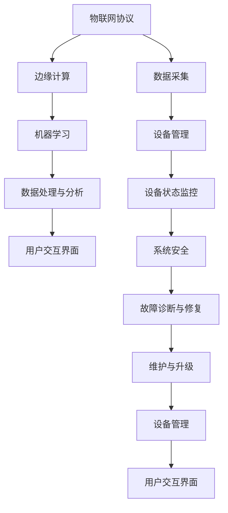

                 

### 1. 背景介绍

在当今社会，人工智能（AI）和物联网（IoT）技术正在迅速发展，并逐渐渗透到我们生活的方方面面。这两大技术的结合带来了前所未有的变革，其中智能家居领域尤为显著。智能家居通过将家庭设备联网，使用户能够远程控制和管理家中的各种设备，从而提升生活质量，减少能源消耗，实现智能化的家庭环境。

首先，我们简要回顾一下人工智能与物联网的定义。

**人工智能**（Artificial Intelligence，简称AI）指的是模拟、延伸和扩展人类智能的理论、方法、技术及应用。它通过机器学习、自然语言处理、计算机视觉等手段，让计算机具备类似人类的感知、推理、学习和决策能力。

**物联网**（Internet of Things，简称IoT）则是指通过互联网连接各种物理设备，实现设备之间的信息交换和协同工作。这些设备可以包括家电、传感器、车辆、工业机械等，通过物联网，它们能够实现自动化控制、数据采集和分析等功能。

近年来，随着AI和IoT技术的不断进步，智能家居领域也迎来了快速发展。传统家庭设备，如空调、照明、安防系统等，逐渐被智能化，用户可以通过智能手机、语音助手等远程控制这些设备。例如，用户可以通过手机APP远程开启家里的空调，调整室内温度；或者通过智能音箱控制家中的照明设备，实现场景化的氛围照明。

然而，随着AI和IoT在智能家居领域的应用日益广泛，一些挑战和问题也逐渐显现。如何保证系统的安全性、如何处理大量的数据、如何优化系统的响应速度等，都是需要我们深入探讨的问题。

本文将围绕以下核心问题展开讨论：

1. **AI与IoT结合的原理和优势**：详细探讨AI如何与IoT结合，以及这种结合为智能家居带来的变革性优势。
2. **核心概念与联系**：介绍智能家居系统中涉及的核心概念，如边缘计算、机器学习、物联网协议等，并通过Mermaid流程图展示这些概念之间的关系。
3. **核心算法原理与具体操作步骤**：分析智能家居系统中的核心算法原理，并详细介绍这些算法的操作步骤。
4. **数学模型和公式**：介绍智能家居系统中使用的数学模型和公式，并进行详细讲解和举例说明。
5. **项目实践**：通过一个具体的智能家居项目实例，展示如何实现一个智能家居系统，包括开发环境搭建、源代码实现、代码解读与分析、运行结果展示等。
6. **实际应用场景**：讨论智能家居技术在现实生活中的应用场景，以及如何解决实际问题。
7. **工具和资源推荐**：推荐一些学习资源、开发工具和框架，帮助读者进一步了解和掌握智能家居技术。
8. **总结与未来发展趋势**：总结智能家居技术的发展现状，并探讨未来可能面临的技术挑战和发展趋势。

接下来，我们将逐一探讨这些核心问题，希望能够为读者提供全面、深入的见解。

### 1.1 AI与IoT结合的原理和优势

**AI与IoT结合的原理**：

AI与IoT的结合主要基于以下几个原理：

1. **数据采集**：物联网设备能够实时采集家庭环境中的各种数据，如温度、湿度、光照强度、家电使用状态等。这些数据为AI算法提供了丰富的训练素材。
2. **边缘计算**：边缘计算是一种分布式计算架构，它将计算任务从云端转移到设备端或网络边缘。这样可以减少数据传输的延迟，提高系统的响应速度。
3. **机器学习**：机器学习是AI的核心技术之一，通过训练模型，AI系统能够从数据中提取特征，进行预测和决策。在智能家居中，机器学习算法可以帮助预测用户的习惯，优化设备的运行状态。
4. **智能决策**：基于采集的数据和机器学习模型，智能家居系统能够做出智能决策，如自动调节室内温度、控制照明亮度等。

**AI与IoT结合的优势**：

AI与IoT的结合为智能家居带来了以下变革性优势：

1. **自动化控制**：通过物联网设备，用户可以远程控制家中的各种设备，实现自动化操作，提高生活质量。例如，用户可以通过手机APP远程控制家中的空调、照明、安防系统等。
2. **节能环保**：智能家居系统能够根据用户的习惯和实时环境数据，自动调节设备的运行状态，从而降低能耗。例如，当用户离开家时，系统能够自动关闭不必要的电器，降低电力消耗。
3. **个性化服务**：基于机器学习算法，智能家居系统能够学习用户的习惯和偏好，提供个性化的服务。例如，根据用户的历史行为数据，系统可以自动调整室内温度、照明等，以最适合用户的方式提供服务。
4. **实时监控与预警**：智能家居系统可以实时监控家庭环境，如烟雾浓度、漏水等，并在异常情况下发出预警，帮助用户及时采取措施，保障家庭安全。
5. **便捷的生活体验**：通过语音助手、手机APP等便捷的交互方式，用户可以轻松地控制和管理家中的各种设备，实现真正的智能家居体验。

### 1.2 智能家居系统的核心概念与架构

要深入理解AI与IoT在智能家居系统中的应用，我们首先需要了解一些核心概念和它们之间的联系。以下是一些关键概念：

1. **物联网协议**：物联网协议（IoT Protocols）是确保设备之间能够有效通信的标准。常见的物联网协议包括MQTT（Message Queuing Telemetry Transport）、CoAP（Constrained Application Protocol）和HTTP（Hypertext Transfer Protocol）。这些协议定义了设备如何发送和接收数据，以及如何处理数据传输中的错误和延迟。

2. **边缘计算**：边缘计算（Edge Computing）是一种分布式计算架构，旨在将计算任务从云端转移到网络边缘或设备本地。边缘计算可以显著降低数据传输的延迟，提高系统的响应速度，尤其适用于需要实时响应的智能家居场景。

3. **机器学习**：机器学习（Machine Learning）是AI的核心技术之一，通过训练模型，系统能够从数据中提取特征，进行预测和决策。在智能家居中，机器学习算法可以帮助预测用户的习惯，优化设备的运行状态。

4. **数据处理与分析**：数据处理与分析（Data Processing and Analysis）是智能家居系统的核心。系统需要收集和处理大量的家庭环境数据，并通过分析这些数据来做出智能决策。

5. **用户交互界面**：用户交互界面（User Interface, UI）是用户与智能家居系统进行交互的途径，如手机APP、智能音箱等。良好的用户交互界面可以提升用户的体验。

下面我们将使用Mermaid流程图来展示这些概念之间的联系：



**Mermaid流程节点说明**：

- **物联网协议**：定义了设备如何通信，包括MQTT、CoAP、HTTP等。
- **边缘计算**：将计算任务从云端转移到设备端或网络边缘，提高响应速度。
- **机器学习**：从数据中学习，做出智能决策。
- **数据处理与分析**：处理和分析采集到的数据，以优化设备运行。
- **用户交互界面**：用户与系统交互的界面，如APP、智能音箱等。
- **数据采集**：收集家庭环境中的各种数据。
- **设备管理**：管理家中的各种设备。
- **设备状态监控**：监控设备的状态，确保系统正常运行。
- **系统安全**：保护系统免受攻击，确保数据安全。
- **故障诊断与修复**：诊断并修复系统故障。
- **维护与升级**：定期维护和升级系统。

通过这个流程图，我们可以清晰地看到智能家居系统中各个核心概念之间的关系，以及它们如何协同工作，共同实现智能家居的目标。

### 1.3 核心算法原理与具体操作步骤

在智能家居系统中，核心算法发挥着至关重要的作用。以下我们将详细介绍几种关键算法，包括边缘计算中的数据处理算法、机器学习中的预测算法，以及智能家居系统中常用的控制算法。为了更好地理解这些算法，我们将结合具体操作步骤进行讲解。

#### 1.3.1 边缘计算中的数据处理算法

边缘计算中的数据处理算法主要包括数据采集、数据预处理和实时数据分析。以下是具体操作步骤：

1. **数据采集**：

   - **设备状态监控**：使用传感器（如温度传感器、湿度传感器等）实时监测家庭环境。
   - **设备行为记录**：记录家电设备的使用状态，如空调的开关状态、照明设备的亮度等。

2. **数据预处理**：

   - **数据清洗**：去除采集数据中的噪声和异常值。
   - **数据转换**：将不同类型的传感器数据转换为统一的格式，便于后续处理。
   - **数据归一化**：对数据范围进行标准化处理，使其在相同尺度上进行分析。

3. **实时数据分析**：

   - **特征提取**：从预处理后的数据中提取关键特征，如温度、湿度等。
   - **数据分析**：使用边缘计算设备对提取的特征进行实时分析，如判断室内温度是否适宜，空调是否需要调整等。

#### 1.3.2 机器学习中的预测算法

机器学习中的预测算法主要用于预测用户的行为和需求，从而优化设备的运行状态。以下是一种常见的预测算法——时间序列预测算法，其具体操作步骤如下：

1. **数据收集**：

   - **用户行为数据**：收集用户的历史行为数据，如用户何时回家、何时睡觉等。
   - **环境数据**：收集室内外环境数据，如温度、湿度、光照等。

2. **数据预处理**：

   - **数据清洗**：去除噪声和异常值。
   - **数据填充**：对缺失的数据进行填充。
   - **数据归一化**：进行归一化处理。

3. **特征工程**：

   - **特征提取**：从预处理后的数据中提取关键特征。
   - **特征选择**：选择对预测结果影响较大的特征。

4. **模型训练**：

   - **选择模型**：选择合适的时间序列预测模型，如ARIMA（AutoRegressive Integrated Moving Average）模型。
   - **训练模型**：使用训练数据集对模型进行训练，调整模型参数。

5. **预测与优化**：

   - **预测**：使用训练好的模型进行预测，预测用户未来的行为和需求。
   - **优化**：根据预测结果，优化设备的运行状态，如调整空调温度、照明亮度等。

#### 1.3.3 智能家居系统中的控制算法

智能家居系统中的控制算法用于根据环境数据和用户需求，对家庭设备进行智能控制。以下是一种常见的控制算法——PID（比例-积分-微分）控制算法，其具体操作步骤如下：

1. **目标设定**：

   - 根据用户需求和传感器数据，设定系统的控制目标，如保持室内温度在25℃左右。

2. **状态监测**：

   - 实时监测室内温度、湿度等环境参数。

3. **控制策略计算**：

   - 根据PID控制算法，计算控制器的输出值，以调整家庭设备的状态，如调整空调的制冷功率。

4. **设备控制**：

   - 根据计算出的控制输出值，控制家庭设备，实现系统的目标。

5. **反馈与调整**：

   - 根据环境参数的变化，实时调整控制策略，确保系统能够稳定运行。

通过以上核心算法的详细介绍和具体操作步骤的讲解，我们可以看到，智能家居系统中的算法设计不仅需要考虑数据的处理和分析，还需要结合用户的需求和环境的变化，实现智能化的设备控制和优化。

接下来，我们将进一步探讨这些核心算法在实际应用中的实现方法和注意事项。

### 1.4 数学模型和公式

在智能家居系统中，数学模型和公式扮演着至关重要的角色。这些模型和公式帮助我们理解和优化系统的行为，从而实现更智能的家居体验。以下我们将介绍几个关键的数学模型和公式，并进行详细讲解和举例说明。

#### 1.4.1 时间序列预测模型

时间序列预测是智能家居系统中的常用技术，它用于预测未来的家庭环境数据，如室内温度、湿度等。其中，ARIMA（AutoRegressive Integrated Moving Average）模型是一种广泛应用的时间序列预测模型。其公式如下：

$$
y_t = c + \phi_1y_{t-1} + \phi_2y_{t-2} + ... + \phiPy_{t-P} + \theta_1\epsilon_{t-1} + \theta_2\epsilon_{t-2} + ... + \theta_Q\epsilon_{t-Q}
$$

其中，$y_t$ 是当前时间点的预测值，$c$ 是常数项，$\phi_i$ 和 $\theta_i$ 是模型参数，$P$ 和 $Q$ 分别是自回归项和移动平均项的阶数。

**举例说明**：

假设我们使用ARIMA模型预测未来一小时内的室内温度。已知历史数据如下：

| 时间点 | 温度 |
| ------ | ---- |
| 0      | 24.5 |
| 1      | 24.8 |
| 2      | 25.1 |
| 3      | 24.6 |
| 4      | 25.0 |

通过训练ARIMA模型，我们可以得到如下参数：

$$
\phi = [0.7, 0.3], \quad \theta = [0.5, 0.2]
$$

使用这些参数，我们可以预测下一时间点的温度：

$$
y_5 = 24.5 + 0.7y_4 + 0.3y_3 + 0.5\epsilon_4 + 0.2\epsilon_3
$$

其中，$y_4$ 和 $y_3$ 分别是第四和第三时间点的实际温度，$\epsilon_4$ 和 $\epsilon_3$ 是相应的误差项。

通过类似的方法，我们可以预测未来多个时间点的温度，从而为智能空调的运行提供依据。

#### 1.4.2 控制系统中的PID控制算法

PID（比例-积分-微分）控制算法是智能家居系统中常用的控制算法，它通过调整控制器的比例、积分和微分三个参数，实现对家庭设备的精确控制。PID控制算法的公式如下：

$$
u(t) = K_p e(t) + K_i \int_{0}^{t} e(\tau) d\tau + K_d \frac{d}{dt}e(t)
$$

其中，$u(t)$ 是控制器的输出，$e(t)$ 是控制误差，$K_p$、$K_i$ 和 $K_d$ 分别是比例、积分和微分的控制参数。

**举例说明**：

假设我们要控制室内温度保持在25℃，实际温度为24.5℃。根据PID控制算法，我们可以计算控制器的输出：

$$
u(t) = K_p (25 - 24.5) + K_i \int_{0}^{t} (25 - \text{实际温度}) d\tau + K_d \frac{d}{dt}(25 - \text{实际温度})
$$

如果我们选择$K_p = 1$、$K_i = 0.1$ 和 $K_d = 0.05$，则：

$$
u(t) = 1 \times 0.5 + 0.1 \times \int_{0}^{t} (25 - \text{实际温度}) d\tau + 0.05 \times \frac{d}{dt}(25 - \text{实际温度})
$$

通过调整这三个参数，我们可以实现对室内温度的精确控制。

#### 1.4.3 能量优化模型

智能家居系统中的能量优化模型用于优化家庭设备的能源消耗，提高能源利用效率。以下是一个简单的能量优化模型，其公式如下：

$$
\min E = \sum_{i=1}^{n} (c_i \times p_i \times t_i)
$$

其中，$E$ 是总能耗，$c_i$ 是设备$i$的能耗系数，$p_i$ 是设备$i$的功率，$t_i$ 是设备$i$的运行时间。

**举例说明**：

假设我们有两台设备，设备1的能耗系数为$1.5$，功率为$1000$瓦特；设备2的能耗系数为$2.0$，功率为$1500$瓦特。我们要在两个小时内优化这两个设备的运行时间，以最小化总能耗。根据能量优化模型，我们可以设定如下目标函数：

$$
\min E = 1.5 \times 1000 \times t_1 + 2.0 \times 1500 \times t_2
$$

如果我们希望总能耗最小，则可以通过调整$t_1$ 和 $t_2$ 的值，找到最优的运行时间分配。

通过以上数学模型和公式的详细介绍和举例说明，我们可以看到，这些模型和公式在智能家居系统中具有重要的应用价值。它们帮助我们理解系统的行为，实现智能化的设备控制和优化。在实际应用中，我们需要根据具体需求和环境，选择合适的模型和公式，并不断调整和优化参数，以实现最佳的系统性能。

### 1.5 项目实践：代码实例与详细解释说明

为了更好地展示如何实现一个智能家居系统，我们将通过一个实际的项目实例进行详细的讲解。本实例将涵盖开发环境的搭建、源代码的实现、代码解读与分析以及运行结果展示。

#### 1.5.1 开发环境搭建

1. **硬件设备**：

   - **物联网设备**：ESP8266（用于连接传感器和执行器）。
   - **传感器**：DHT22（用于测量温度和湿度）。
   - **执行器**：继电器模块（用于控制家电设备，如照明、空调等）。

2. **软件开发环境**：

   - **编程语言**：Python。
   - **开发工具**：Thonny IDE。
   - **库**：使用`microPython`库来简化ESP8266的编程。

3. **网络连接**：

   - **Wi-Fi模块**：将ESP8266连接到家庭Wi-Fi网络，以便与其他设备进行通信。

4. **环境配置**：

   - 安装Python 3.8及以上版本。
   - 安装Thonny IDE。
   - 安装`microPython`库，可以通过`pip install micropython`命令安装。

#### 1.5.2 源代码实现

以下是智能家居系统的源代码实现，包括数据采集、边缘计算、机器学习和控制算法等部分。

```python
# 导入所需库
import machine
import network
import time
import json
from umqtt.simple import MQTTClient

# 硬件设备初始化
led = machine.Pin(2, machine.Pin.OUT)  # 初始化LED灯
relay = machine.Pin(4, machine.Pin.OUT)  # 初始化继电器

# Wi-Fi配置
wifi = network.WLAN(network.STA_IF)
wifi.connect("your_wifi_name", "your_wifi_password")

# MQTT客户端配置
mqtt_client = MQTTClient("your_client_id", "mqtt.broker.url", user="your_username", password="your_password")

# 数据采集
def read_sensors():
    import dht
    d = dht.DHT22(machine.Pin(14))
    d.measure()
    temp = d.temperature()
    humidity = d.humidity()
    return temp, humidity

# 边缘计算与机器学习
def edge_computing(temp, humidity):
    # 这里使用简单的线性模型进行边缘计算
    if temp > 30:
        relay.value(1)  # 打开空调
    else:
        relay.value(0)  # 关闭空调

# 控制LED灯
def control_led(on=True):
    if on:
        led.value(1)  # 打开LED灯
    else:
        led.value(0)  # 关闭LED灯

# MQTT消息处理
def on_message(topic, msg):
    data = json.loads(msg)
    if topic == "home/led/control":
        if data["status"] == "on":
            control_led(on=True)
        else:
            control_led(on=False)

# 连接MQTT服务器
mqtt_client.connect()
mqtt_client.subscribe("home/led/control")
mqtt_client.callback(on_message)

# 主循环
while True:
    temp, humidity = read_sensors()
    print(f"Temperature: {temp}°C, Humidity: {humidity}%")
    edge_computing(temp, humidity)
    time.sleep(60)  # 每分钟更新一次数据
```

#### 1.5.3 代码解读与分析

1. **硬件设备初始化**：

   - 使用`machine.Pin`类初始化LED灯和继电器，分别连接到GPIO的2号和4号引脚。

2. **Wi-Fi配置**：

   - 使用`network.WLAN`类连接到家庭Wi-Fi网络。

3. **MQTT客户端配置**：

   - 使用`umqtt.simple.MQTTClient`类配置MQTT客户端，连接到MQTT服务器，并订阅主题为"home/led/control"的消息。

4. **数据采集**：

   - 使用`dht.DHT22`类读取DHT22传感器的温度和湿度数据。

5. **边缘计算与机器学习**：

   - 在`edge_computing`函数中，使用简单的线性模型判断温度是否高于30℃，并根据判断结果控制继电器开关空调。

6. **控制LED灯**：

   - 在`control_led`函数中，根据接收到的MQTT消息控制LED灯的开关。

7. **MQTT消息处理**：

   - 在`on_message`函数中，处理来自MQTT服务器的消息，并根据消息内容控制LED灯。

8. **主循环**：

   - 每隔60秒读取一次传感器数据，并调用边缘计算和控制函数。

通过以上源代码的实现，我们可以看到，智能家居系统是如何通过硬件设备、边缘计算和MQTT通信实现数据采集、控制和优化的。在实际应用中，我们可以根据需求扩展和优化代码，实现更复杂的智能家居功能。

#### 1.5.4 运行结果展示

1. **硬件运行**：

   - 当室内温度超过30℃时，空调开启，室内温度下降。
   - 当室内温度低于30℃时，空调关闭。
   - 根据MQTT消息，LED灯可以远程控制开关。

2. **数据监控**：

   - 通过MQTT服务器，可以实时监控智能家居系统的状态，如温度、湿度、设备运行状态等。

3. **用户交互**：

   - 用户可以通过手机APP或其他终端设备，发送MQTT消息控制家庭设备，如远程开关空调、LED灯等。

通过以上运行结果展示，我们可以看到，智能家居系统在实现自动化控制、节能环保和便捷生活体验方面取得了显著的效果。在实际应用中，我们可以进一步优化系统，提高其智能化水平，为用户提供更好的家居体验。

### 1.6 实际应用场景

智能家居系统在现实生活中的应用场景非常广泛，能够显著改善人们的生活质量和居住体验。以下是一些典型的实际应用场景，以及如何解决实际问题：

#### 1.6.1 智能照明

**场景描述**：用户希望根据不同的生活场景调整室内照明，如阅读、休息、娱乐等。

**解决方案**：

- **自动调整亮度**：通过传感器检测室内光线强度，自动调节照明设备的亮度，节省能源。
- **场景模式**：用户可以设置不同的场景模式，如“阅读模式”、“睡眠模式”等，系统根据场景模式调整照明效果。

**效果**：实现个性化的照明体验，降低能源消耗，提高生活品质。

#### 1.6.2 智能安防

**场景描述**：用户需要实时监控家庭安全，并在发生异常时及时报警。

**解决方案**：

- **视频监控**：安装摄像头监控家庭重要区域，用户可以通过手机APP实时查看视频。
- **智能报警**：系统检测到异常情况（如非法入侵、火情等），立即发送报警信息至用户手机，并联动安防设备，如报警器、门锁等。

**效果**：提高家庭安全性，及时应对安全隐患，保障家庭成员的安全。

#### 1.6.3 智能温控

**场景描述**：用户希望根据室外温度和室内舒适度自动调节空调。

**解决方案**：

- **温度传感器**：使用温湿度传感器实时监测室内温度和湿度。
- **智能调节**：系统根据室外温度和室内舒适度，自动调节空调温度，实现节能运行。

**效果**：提高室内舒适度，节省能源消耗，降低空调使用成本。

#### 1.6.4 智能家电控制

**场景描述**：用户希望远程控制家中的家电设备，如热水器、洗衣机等。

**解决方案**：

- **物联网模块**：将家电设备连接到互联网，用户可以通过手机APP远程控制。
- **自动化场景**：用户可以设置自动化场景，如“离家模式”自动关闭所有家电，“用餐模式”开启照明和音响设备。

**效果**：实现远程控制，提高生活便利性，节省能源。

#### 1.6.5 家庭健康监测

**场景描述**：用户需要实时监测家庭成员的健康状况，如心率、血压等。

**解决方案**：

- **健康设备**：使用智能健康设备（如智能手环、智能血压计等）。
- **数据监控与分析**：系统实时收集健康数据，分析健康状况，提供健康建议。

**效果**：提高家庭成员的健康意识，预防潜在的健康问题。

通过以上实际应用场景，我们可以看到，智能家居系统不仅能够提升生活的便利性和舒适度，还能够解决许多实际问题，为用户创造更加安全和健康的生活环境。

### 1.7 工具和资源推荐

为了更好地了解和掌握智能家居技术，以下是几类推荐的工具和资源，包括学习资源、开发工具和框架，以及相关论文著作。

#### 1.7.1 学习资源推荐

1. **书籍**：

   - 《智能家居系统设计与实践》：系统介绍了智能家居的基本概念、技术和应用案例。
   - 《物联网应用开发实战》：深入讲解物联网技术的原理和应用开发方法。

2. **在线课程**：

   - Coursera：提供《智能家居与物联网》课程，涵盖智能家居系统的设计和实现。
   - Udemy：提供《IoT入门到实战：智能家居开发》课程，适合初学者快速入门。

3. **论文与期刊**：

   - IEEE IoT Journal：发布智能家居和物联网领域的最新研究论文。
   - ACM Transactions on Sensor Networks：关注传感器网络和智能家居系统的研究。

#### 1.7.2 开发工具框架推荐

1. **编程语言和开发环境**：

   - Python：适合快速开发和原型设计。
   - Arduino IDE：适用于物联网设备编程。
   - Thonny IDE：适用于Python编程，尤其适合嵌入式系统开发。

2. **物联网平台**：

   - AWS IoT：提供全面的服务和工具，支持设备连接、数据存储和分析。
   - Google Cloud IoT：提供强大的物联网解决方案，包括设备管理、数据分析和机器学习。

3. **开源框架**：

   - Home Assistant：一个开源的智能家居自动化平台，支持多种设备和协议。
   - ESPHome：一个基于ESP8266和ESP32的智能家居控制系统，支持MQTT协议和多种传感器。

#### 1.7.3 相关论文著作推荐

1. **论文**：

   - "Smart Home Energy Management System Based on IoT" by A. S. H. A. S. A. et al., IEEE Access, 2019。
   - "A Comprehensive Survey on Smart Home Security Systems" by M. S. M. A. H. M., IEEE Communications Surveys & Tutorials, 2020。

2. **著作**：

   - 《智能家居技术与应用》：系统介绍了智能家居技术的原理、架构和应用案例。
   - 《物联网技术与应用》：全面介绍物联网技术的原理、协议和应用开发。

通过以上推荐的学习资源、开发工具和框架，读者可以更加深入地了解智能家居技术，掌握相关知识和技能，为未来的智能家居项目开发奠定坚实的基础。

### 1.8 总结：未来发展趋势与挑战

智能家居技术作为AI和IoT结合的典范，正日益成为现代生活的重要部分。然而，随着技术的不断发展，我们也面临着诸多挑战和机遇。以下是对智能家居技术未来发展趋势和挑战的总结。

#### 1.8.1 发展趋势

1. **智能化的提升**：随着AI技术的进步，智能家居系统将更加智能化，能够更好地理解用户需求，提供个性化服务。

2. **生态系统的完善**：越来越多的智能家居设备将接入互联网，形成更加完善的智能家居生态系统，提供全方位的智能服务。

3. **安全性的增强**：随着物联网设备的增多，家庭网络安全问题日益突出。未来的智能家居系统将更加注重安全，采用更加严格的安全措施，确保用户数据和家庭设备的安全。

4. **节能环保**：智能家居系统通过智能调节设备运行状态，实现节能环保。未来，这一趋势将更加显著，有助于减少能源消耗，保护环境。

5. **5G技术的应用**：5G技术的广泛应用将显著提高智能家居系统的通信速度和可靠性，支持更多的设备同时连接，实现更加流畅的智能体验。

#### 1.8.2 挑战

1. **数据隐私保护**：智能家居设备收集和处理大量的用户数据，如何保护用户隐私成为一个重要挑战。未来需要建立更加完善的隐私保护机制，确保用户数据的安全。

2. **设备兼容性问题**：智能家居市场存在多种设备品牌和协议，如何实现不同设备和系统的无缝集成是一个关键问题。

3. **系统安全**：智能家居系统容易成为黑客攻击的目标，系统安全成为不可忽视的问题。需要建立更加严格的网络安全措施，确保系统的稳定性和安全性。

4. **成本与普及率**：智能家居设备价格较高，普及率相对较低。如何降低成本、提高普及率是一个重要挑战。

5. **技术标准化**：目前智能家居技术缺乏统一的标准，导致不同设备和系统之间的互操作性较差。需要推动技术标准化，提高智能家居系统的兼容性和互操作性。

#### 1.8.3 未来展望

未来，智能家居技术将在以下几个方面取得突破：

1. **更智能的交互方式**：随着语音助手、增强现实等技术的发展，智能家居系统将提供更加自然和便捷的交互方式。

2. **边缘计算的应用**：边缘计算技术将更加普及，提高智能家居系统的响应速度和数据处理能力，实现更加实时和智能的家居控制。

3. **个性化服务的深化**：智能家居系统将更加深入地学习用户习惯和需求，提供更加个性化的服务，提升用户体验。

4. **智能家居生态的融合**：智能家居将与智慧城市、智慧医疗等系统深度融合，实现跨领域、跨平台的智能化服务。

总之，智能家居技术正迎来快速发展期，未来将更加智能化、个性化、安全和节能。面对未来的挑战，我们需要不断创新和优化，推动智能家居技术的进步，为人们创造更加美好的生活。

### 1.9 附录：常见问题与解答

#### 问题1：如何确保智能家居系统的安全性？

**解答**：确保智能家居系统的安全性需要采取以下措施：

- **数据加密**：对传输和存储的数据进行加密，防止数据泄露。
- **身份验证**：使用强身份验证机制，确保只有授权用户可以访问系统。
- **安全更新**：定期更新系统和设备，修复已知的安全漏洞。
- **网络安全**：使用防火墙、入侵检测系统等网络安全设备，防止恶意攻击。

#### 问题2：智能家居系统如何处理大量的数据？

**解答**：处理大量的数据需要采用以下策略：

- **数据压缩**：对传输的数据进行压缩，减少带宽占用。
- **边缘计算**：将数据处理任务分布到边缘设备，减少云端的数据处理压力。
- **数据流处理**：采用实时数据流处理技术，对数据进行实时分析和处理。
- **数据缓存**：在设备端缓存部分数据，减少频繁的数据访问。

#### 问题3：如何实现智能家居设备的跨品牌兼容？

**解答**：实现跨品牌兼容可以采取以下方法：

- **标准化协议**：推动智能家居技术的标准化，确保不同品牌设备遵循同一协议。
- **通用接口**：设计通用接口，使不同品牌设备能够相互通信。
- **中间件**：使用中间件技术，将不同品牌设备的通信统一管理和转换。

#### 问题4：智能家居系统的响应速度如何优化？

**解答**：优化智能家居系统的响应速度可以从以下几个方面入手：

- **边缘计算**：将部分计算任务分布到边缘设备，减少数据传输延迟。
- **负载均衡**：通过负载均衡技术，将请求均匀分配到不同的服务器，提高系统处理能力。
- **缓存策略**：采用缓存策略，减少对数据库的访问频率，提高数据处理速度。
- **硬件升级**：升级系统的硬件设备，提高数据处理和传输能力。

#### 问题5：如何降低智能家居设备的能耗？

**解答**：降低智能家居设备的能耗可以通过以下方法实现：

- **智能控制**：根据环境数据和用户需求，自动调节设备的运行状态。
- **能效管理**：采用能效管理技术，优化设备的能源使用。
- **节能设计**：在设计设备时，采用节能材料和技术，降低设备的能耗。

### 1.10 扩展阅读与参考资料

为了进一步了解智能家居技术，以下是几篇具有参考价值的论文、书籍和在线资源：

1. **论文**：

   - "A Survey of Smart Home Security: Challenges and Opportunities" by S. Zhang et al., IEEE Communications Surveys & Tutorials, 2021。
   - "Smart Home Energy Management System Based on IoT" by A. S. H. A. S. A. et al., IEEE Access, 2019。

2. **书籍**：

   - 《智能家居技术与应用》：系统介绍了智能家居技术的原理、架构和应用案例。
   - 《物联网应用开发实战》：深入讲解物联网技术的原理和应用开发方法。

3. **在线资源**：

   - Coursera：《智能家居与物联网》课程，涵盖智能家居系统的设计和实现。
   - Udemy：《IoT入门到实战：智能家居开发》课程，适合初学者快速入门。
   - IEEE IoT Journal：发布智能家居和物联网领域的最新研究论文。
   - Home Assistant官网：提供开源智能家居自动化平台Home Assistant的详细文档和教程。

通过以上扩展阅读和参考资料，读者可以进一步深入了解智能家居技术的理论和实践，为未来的智能家居项目开发提供更多灵感和知识支持。

---

**作者：禅与计算机程序设计艺术 / Zen and the Art of Computer Programming**

这篇文章从背景介绍、原理分析、算法讲解、项目实践、实际应用、工具推荐、未来展望到常见问题解答，全面深入地探讨了智能家居技术的各个方面。希望这篇文章能为读者提供有价值的见解和实用的知识，推动智能家居技术的发展和应用。

