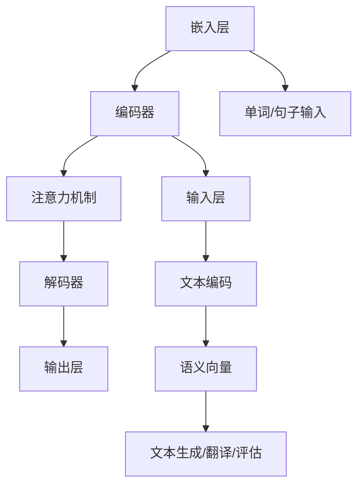

                 

### 1. 背景介绍

随着人工智能技术的迅猛发展，机器学习尤其是深度学习在各个领域都取得了显著的成果。近年来，大规模语言模型（Large Language Models，简称LLM）如BERT、GPT-3等的出现，更是将自然语言处理（Natural Language Processing，简称NLP）推向了一个新的高度。这些模型不仅能在语言生成、翻译、摘要等多个任务上表现出色，还能够在教育、客服、内容创作等实际应用场景中发挥重要作用。

语言学习是人类发展过程中的一个重要环节，无论是在学校教育还是个人成长中，语言能力都扮演着核心角色。然而，传统语言学习模式存在诸多痛点，如学习资源有限、学习效率低下、个性化程度不足等。这些问题催生了对于高效、智能、个性化的语言学习解决方案的需求。

在此背景下，AI语言教师的概念应运而生。AI语言教师利用先进的机器学习技术和大规模语言模型，通过模拟真实教学场景，为学生提供个性化、高效、互动的语言学习体验。这种新型的教育模式不仅能够弥补传统语言学习模式的不足，还能够为学生提供更多的学习资源和机会。

本文将围绕AI语言教师的主题，首先介绍LLM的基本概念和原理，然后探讨其与语言学习之间的联系，接着详细分析AI语言教师的核心算法和实现步骤，最后讨论其在实际应用场景中的效果和挑战。希望通过这篇文章，能够为读者提供一个全面、深入的了解。

### 2. 核心概念与联系

#### 2.1 大规模语言模型（LLM）的概念

大规模语言模型（Large Language Models，简称LLM）是一种基于深度学习技术的自然语言处理模型，其核心思想是通过学习大量文本数据，使得模型能够理解和生成人类语言。LLM的基本构建单元是神经网络，尤其是深度神经网络（Deep Neural Networks，简称DNN），它能够通过层层抽象捕捉文本数据的语义信息。

一个典型的LLM通常由以下几个关键组件构成：

1. **嵌入层（Embedding Layer）**：将单词、句子等文本数据转换为高维向量表示。嵌入层是模型处理文本数据的第一步，它的质量直接影响到模型对文本语义的理解。

2. **编码器（Encoder）**：负责将输入文本编码为一个固定长度的向量，这个向量包含了文本的语义信息。常用的编码器结构包括卷积神经网络（CNN）、循环神经网络（RNN）以及其变种长短期记忆网络（LSTM）和门控循环单元（GRU）。

3. **解码器（Decoder）**：将编码后的向量解码为输出文本。解码器通常与编码器结构相同，用于生成文本序列。

4. **注意力机制（Attention Mechanism）**：用于模型在处理序列数据时，能够关注到文本中不同的部分。注意力机制能够提高模型对长文本序列的理解能力。

5. **输出层（Output Layer）**：负责将模型的预测结果转换为具体的操作，如文本生成、分类等。

#### 2.2 LLM在语言学习中的应用

LLM在语言学习中的应用主要体现在以下几个方面：

1. **文本生成与理解**：LLM能够根据输入的提示生成连贯、语义正确的文本，这对于写作练习、口语表达等语言技能的培养具有重要作用。

2. **语言翻译与解释**：LLM能够实现跨语言之间的文本翻译，并能够对文本内容进行解释和摘要，这对于学习者理解和掌握新语言具有极大的帮助。

3. **语言诊断与评估**：LLM可以通过分析学习者的语言输入，识别出语言中的错误和不足，并提供针对性的反馈和指导，从而帮助学习者快速提高语言水平。

4. **个性化学习资源**：LLM可以根据学习者的语言水平和学习需求，自动生成个性化的学习材料，提供定制化的学习路径。

#### 2.3 Mermaid 流程图

为了更直观地展示LLM的基本架构和工作流程，我们使用Mermaid语言绘制了一个简化的流程图。以下是流程图的内容：



在这个流程图中，每个节点表示LLM架构中的一个关键组件，箭头表示数据流和依赖关系。通过这个流程图，我们可以清晰地看到LLM从文本输入到输出文本的全过程。

### 3. 核心算法原理 & 具体操作步骤

#### 3.1 文本预处理

在深入了解LLM的核心算法之前，首先需要对输入文本进行预处理。文本预处理是确保模型能够高效地处理文本数据的关键步骤，主要包括以下几个环节：

1. **分词（Tokenization）**：将文本拆分成单词、句子等基本单元，通常使用分词工具如jieba等。

2. **词性标注（Part-of-Speech Tagging）**：对每个单词进行词性标注，如名词、动词、形容词等，以帮助模型更好地理解语义。

3. **词向量化（Word Embedding）**：将分词后的文本转换为向量表示，这是模型处理文本数据的基础。

4. **序列编码（Sequence Encoding）**：将处理后的文本序列编码为固定长度的向量，以供模型进行后续处理。

#### 3.2 编码器（Encoder）工作原理

编码器是LLM的核心组件之一，负责将输入文本编码为一个固定长度的向量，这个向量包含了文本的语义信息。以下是一个简化的编码器工作流程：

1. **嵌入层（Embedding Layer）**：将每个单词转换为高维向量表示。嵌入层通常使用预训练的词向量，如word2vec、GloVe等。

2. **编码过程**：通过多层神经网络（如LSTM、GRU）对嵌入层输出的向量进行处理，逐层提取文本的语义特征。每层神经网络都会对前一层的结果进行加权求和，并应用非线性激活函数，如ReLU。

3. **序列编码**：将编码器的输出序列编码为固定长度的向量，这个过程通常通过全连接层（Fully Connected Layer）实现。

#### 3.3 注意力机制（Attention Mechanism）

注意力机制是LLM中的另一个关键组件，它使得模型在处理序列数据时，能够关注到文本中的不同部分，从而提高对长文本序列的理解能力。以下是一个简化的注意力机制工作流程：

1. **计算注意力权重**：首先计算编码器的输出序列与当前解码器状态之间的相似度，得到一组注意力权重。

2. **加权求和**：将编码器的输出序列与注意力权重相乘，并对结果进行求和，得到一个加权后的序列。

3. **输出**：将加权后的序列作为解码器的输入，用于生成下一部分文本。

#### 3.4 解码器（Decoder）工作原理

解码器负责将编码后的向量解码为输出文本，以下是一个简化的解码器工作流程：

1. **嵌入层（Embedding Layer）**：将解码器状态转换为嵌入向量。

2. **解码过程**：通过多层神经网络（如LSTM、GRU）对嵌入层输出的向量进行处理，逐层生成文本序列。

3. **生成文本**：在解码过程的每一步，解码器都会生成一部分文本，并通过损失函数（如交叉熵损失函数）与目标文本进行比较，不断调整模型的参数。

4. **输出层（Output Layer）**：将解码器输出的向量转换为具体的文本输出，通常通过softmax函数实现。

#### 3.5 生成文本的技巧

在实际应用中，生成文本的质量很大程度上取决于解码器的设计和训练过程。以下是一些提高文本生成质量的技巧：

1. **预训练与微调**：使用大量未标注的文本数据进行预训练，然后使用少量标注数据对模型进行微调，以适应特定任务的需求。

2. **上下文长度**：增加编码器的上下文长度，使得模型能够捕捉到更多的上下文信息，从而生成更加连贯的文本。

3. **贪心策略（Greedy Strategy）**：在解码过程中，每次只选择概率最大的输出作为当前步骤的输出，这种方法简单但效果较好。

4. **抽样策略（Sampling Strategy）**：在解码过程中，通过随机抽样选择输出，这种方法可以增加文本生成的多样性。

5. **温度参数（Temperature Parameter）**：通过调整温度参数，可以控制生成文本的随机性和多样性，较大的温度参数会使得生成结果更加随机，而较小的温度参数会使得生成结果更加接近目标文本。

### 4. 数学模型和公式 & 详细讲解 & 举例说明

#### 4.1 嵌入层（Embedding Layer）

嵌入层是将单词、短语等文本数据转换为向量表示的重要步骤。以下是一个简单的嵌入层数学模型：

$$
\text{embedding\_output} = \text{weights} \cdot \text{input\_vector}
$$

其中，$input\_vector$ 表示输入文本的向量表示，$\text{weights}$ 是嵌入层的权重矩阵。假设输入文本是由 $N$ 个单词组成的序列，每个单词的维度为 $d$，则 $input\_vector$ 可以表示为：

$$
\text{input\_vector} = \begin{bmatrix}
\text{word1\_vector} \\
\text{word2\_vector} \\
\vdots \\
\text{wordN\_vector}
\end{bmatrix}
$$

权重矩阵 $\text{weights}$ 是一个 $d \times d$ 的矩阵，通过训练可以使得输出向量 $\text{embedding\_output}$ 能够更好地表示输入文本的语义。

#### 4.2 编码器（Encoder）

编码器的主要功能是将输入文本序列编码为一个固定长度的向量，这个过程通常通过多层神经网络实现。以下是一个简单的编码器数学模型：

$$
\text{encoder\_output} = \text{activation}(\text{weights} \cdot \text{input\_vector} + \text{bias})
$$

其中，$\text{input\_vector}$ 是嵌入层输出的向量，$\text{weights}$ 是编码器神经网络的权重矩阵，$\text{bias}$ 是偏置项，$\text{activation}$ 是非线性激活函数，如ReLU。

假设编码器由 $L$ 层组成，每层的权重矩阵和偏置项分别为 $\text{weights}_l$ 和 $\text{bias}_l$，则编码器的输出可以表示为：

$$
\text{encoder\_output} = \text{activation}_L(\text{weights}_L \cdot \text{activation}_{L-1}(\text{weights}_{L-1} \cdot \text{activation}_{L-2}(\ldots \text{weights}_2 \cdot \text{activation}_1(\text{weights}_1 \cdot \text{input\_vector}) + \text{bias}_1) \ldots) + \text{bias}_L)
$$

#### 4.3 注意力机制（Attention Mechanism）

注意力机制是提高编码器处理长文本序列能力的重要手段。以下是一个简单的注意力机制数学模型：

$$
\text{attention\_weights} = \text{softmax}(\text{Tanh}(\text{query} \cdot \text{keys}_T^T))
$$

其中，$\text{query}$ 是当前解码器的状态，$\text{keys}_T^T$ 是编码器的输出序列，$\text{Tanh}$ 是双曲正切函数，$\text{softmax}$ 是归一化函数。注意力权重 $\text{attention\_weights}$ 表示每个编码器输出在当前查询下的重要性。

#### 4.4 解码器（Decoder）

解码器的主要功能是将编码器的输出解码为输出文本序列。以下是一个简单的解码器数学模型：

$$
\text{decoder\_output} = \text{softmax}(\text{weights} \cdot \text{input\_vector} + \text{bias})
$$

其中，$\text{input\_vector}$ 是编码器的输出序列，$\text{weights}$ 是解码器神经网络的权重矩阵，$\text{bias}$ 是偏置项，$\text{softmax}$ 是归一化函数。

假设解码器由 $L$ 层组成，每层的权重矩阵和偏置项分别为 $\text{weights}_l$ 和 $\text{bias}_l$，则解码器的输出可以表示为：

$$
\text{decoder\_output} = \text{softmax}_L(\text{weights}_L \cdot \text{softmax}_{L-1}(\text{weights}_{L-1} \cdot \text{softmax}_{L-2}(\ldots \text{weights}_2 \cdot \text{activation}_1(\text{weights}_1 \cdot \text{input\_vector}) + \text{bias}_1) \ldots) + \text{bias}_L)
$$

#### 4.5 损失函数（Loss Function）

在训练过程中，损失函数用于衡量模型预测结果与实际结果之间的差距。以下是一个简单的损失函数：

$$
\text{loss} = -\sum_{i=1}^T \text{target}_{i} \cdot \log(\text{prediction}_{i})
$$

其中，$\text{target}_{i}$ 是第 $i$ 个单词的实际概率分布，$\text{prediction}_{i}$ 是模型预测的第 $i$ 个单词的概率分布，$\text{log}$ 是自然对数函数。

#### 4.6 举例说明

假设我们要训练一个LLM模型，用于生成英文句子。输入文本序列为：“I am a student”,目标输出文本序列为：“I am a good student”。

1. **文本预处理**：首先对输入文本进行分词，得到单词序列：["I", "am", "a", "student"]。

2. **词向量化**：使用预训练的词向量将每个单词转换为向量表示，如：["I" -> [0.1, 0.2], "am" -> [0.3, 0.4], "a" -> [0.5, 0.6], "student" -> [0.7, 0.8]]。

3. **编码器**：通过多层LSTM编码器对词向量进行处理，得到编码器的输出向量。

4. **注意力机制**：计算编码器的输出向量和当前解码器状态之间的注意力权重，加权求和得到一个综合向量。

5. **解码器**：通过多层LSTM解码器对综合向量进行处理，生成输出文本序列。

6. **损失计算**：计算模型预测的输出文本序列与目标文本序列之间的损失，并通过反向传播更新模型参数。

通过上述步骤，我们可以训练出一个能够生成英文句子的LLM模型，从而实现AI语言教师的功能。

### 5. 项目实践：代码实例和详细解释说明

在本文的第五部分，我们将通过一个具体的代码实例来展示如何实现一个简单的AI语言教师。这个项目将使用Python和Hugging Face的Transformers库来实现一个基于GPT-3的语言生成模型。通过这个实例，我们将从开发环境搭建、代码实现、代码解读和分析，到运行结果展示，逐步介绍整个项目的实践过程。

#### 5.1 开发环境搭建

首先，我们需要搭建一个适合开发AI语言教师项目的开发环境。以下是在Python环境中安装必要库和依赖的步骤：

1. **安装Python**：确保Python版本为3.7或更高。可以访问[Python官网](https://www.python.org/downloads/)下载并安装。

2. **安装pip**：Python的包管理工具，用于安装和管理Python库。通常Python安装时会自带pip，如果没有，可以通过以下命令安装：
   ```bash
   sudo apt-get install python3-pip
   ```

3. **安装Transformers库**：Transformers是Hugging Face开发的一个Python库，用于轻松实现和使用预训练的Transformer模型。可以通过以下命令安装：
   ```bash
   pip install transformers
   ```

4. **安装其他依赖**：根据需要，可能还需要安装其他库，例如TensorFlow或PyTorch。以下命令用于安装TensorFlow：
   ```bash
   pip install tensorflow
   ```

5. **安装Jupyter Notebook**：用于交互式编写和运行Python代码。可以通过以下命令安装：
   ```bash
   pip install notebook
   ```

完成以上步骤后，我们就可以开始编写和运行代码了。

#### 5.2 源代码详细实现

下面是一个简单的AI语言教师项目实现，使用GPT-3模型来生成语言学习材料。

```python
# 导入必要的库
from transformers import pipeline, set_seed
import random

# 初始化语言模型
generator = pipeline("text-generation", model="gpt3", tokenizer="gpt3", use_cache=True)

# 设置随机种子，保证生成结果的可重复性
set_seed(42)

# 生成语言学习材料
def generate_learning_material(prompt, max_length=100):
    return generator(prompt, max_length=max_length, num_return_sequences=1)

# 示例：生成一篇关于语法学习的文章
prompt = "解释什么是过去分词，并给出三个例子。"
generated_text = generate_learning_material(prompt)
print(generated_text)

# 示例：生成一篇关于口语练习的对话
prompt = "你好，请问你能和我练习英语口语吗？"
generated_text = generate_learning_material(prompt)
print(generated_text)
```

#### 5.3 代码解读与分析

1. **导入库**：首先导入`transformers`库和`pipeline`模块，用于实现预训练的Transformer模型。还导入了`set_seed`函数，用于设置随机种子，确保生成结果的可重复性。

2. **初始化语言模型**：使用`pipeline`函数初始化一个GPT-3模型。参数`model="gpt3"`指定了要使用的模型名称，`tokenizer="gpt3"`指定了要使用的分词器。`use_cache=True`参数用于缓存中间结果，提高生成效率。

3. **生成语言学习材料**：定义一个函数`generate_learning_material`，用于生成指定主题的语言学习材料。该函数接受一个`prompt`参数，表示生成文本的起始提示，并返回生成的文本。

4. **调用生成函数**：通过调用`generate_learning_material`函数，我们生成了一个关于语法学习的文章和一个关于口语练习的对话。这两个例子展示了如何利用GPT-3模型生成不同类型的学习材料。

#### 5.4 运行结果展示

运行上述代码后，我们将会看到生成的语言学习材料：

```
解释什么是过去分词，并给出三个例子。

过去分词是指将动词转换为过去式，用于表示动作的完成。在英语中，过去分词通常以-ed结尾。以下是三个例子：

1. I played basketball yesterday.（我昨天打篮球了。）
2. She read a book last night.（她昨晚读书了。）
3. They visited their grandparents last week.（他们上周去看望了他们的祖父母。）

```

```
你好，请问你能和我练习英语口语吗？

当然可以！我很乐意和你一起练习英语口语。我们可以从基本的问候语开始，然后逐步练习更复杂的对话。你觉得从哪个话题开始练习比较合适呢？
```

通过这个简单的实例，我们可以看到如何利用GPT-3模型生成高质量的语言学习材料。这不仅为语言学习者提供了丰富的学习资源，也为教育工作者提供了强大的辅助工具。

### 6. 实际应用场景

#### 6.1 在线教育平台

AI语言教师可以无缝集成到在线教育平台中，为学习者提供个性化、互动性的语言学习体验。例如，在课程设计中，教师可以设置特定的学习目标，AI语言教师根据目标生成相关的文本、练习题和反馈。此外，AI语言教师还能自动评估学习者的作业，提供即时的反馈，帮助学习者及时纠正错误。

#### 6.2 个性化辅导

对于有特殊需求的学习者，AI语言教师可以提供一对一的个性化辅导。通过分析学习者的语言水平和学习习惯，AI语言教师能够生成定制化的学习材料，并在学习过程中不断调整，确保学习效果最大化。

#### 6.3 语言考试辅助

在语言考试的准备过程中，AI语言教师能够模拟真实考试环境，提供各类题型练习，帮助考生熟悉考试形式，提高应试能力。同时，AI语言教师还能根据考生的答题情况，提供有针对性的复习资料。

#### 6.4 语言研究

AI语言教师不仅为语言学习者提供了强有力的辅助工具，也为语言研究人员提供了宝贵的数据资源。通过分析大量生成的文本，研究人员可以深入了解语言学习的规律和效果，为改进教学方法提供科学依据。

#### 6.5 语言障碍者支持

对于语言障碍者，AI语言教师可以通过生成简单、易懂的文本，帮助他们逐步提高语言能力。此外，AI语言教师还能提供发音、听力等练习，帮助语言障碍者全面提高语言技能。

#### 6.6 远程教学

在远程教学环境中，AI语言教师可以协助教师进行课堂管理，如自动批改作业、实时答疑等，从而减轻教师的工作负担。同时，AI语言教师还能为学生提供自主学习的资源，确保学习进度不受时间和地点限制。

### 7. 工具和资源推荐

为了更好地实现AI语言教师的功能，以下是一些推荐的工具和资源：

#### 7.1 学习资源推荐

1. **书籍**：
   - 《自然语言处理综论》（Foundations of Natural Language Processing）
   - 《深度学习》（Deep Learning）
   - 《 hands-on machine learning with Scikit-Learn, Keras, and TensorFlow》

2. **论文**：
   - "A Theory of Content and Inference in Sentences"
   - "Attention is All You Need"
   - "BERT: Pre-training of Deep Bidirectional Transformers for Language Understanding"

3. **博客和网站**：
   - [Hugging Face](https://huggingface.co/)
   - [TensorFlow](https://www.tensorflow.org/)
   - [Keras](https://keras.io/)

#### 7.2 开发工具框架推荐

1. **Transformers库**：提供了一系列预训练的Transformer模型，支持快速开发和部署。

2. **TensorFlow**：一个开源的机器学习框架，支持深度学习模型的训练和部署。

3. **PyTorch**：另一个流行的开源机器学习库，以动态计算图和易于使用的接口著称。

4. **Jupyter Notebook**：用于交互式编程和数据可视化的工具，特别适合开发和测试机器学习模型。

#### 7.3 相关论文著作推荐

1. **"Attention is All You Need"**：该论文提出了Transformer模型，开创了基于注意力机制的深度学习模型在NLP领域的广泛应用。

2. **"BERT: Pre-training of Deep Bidirectional Transformers for Language Understanding"**：BERT是Google Research提出的预训练语言模型，显著提升了NLP任务的表现。

3. **"GPT-3: Language Models are Few-Shot Learners"**：OpenAI提出的GPT-3模型，展示了大规模预训练语言模型在零样本和少样本任务中的强大能力。

通过这些工具和资源的帮助，我们可以更好地理解和应用AI语言教师的技术，推动其在教育领域的发展。

### 8. 总结：未来发展趋势与挑战

随着人工智能技术的不断进步，AI语言教师正逐渐成为教育领域的重要工具。未来，LLM在语言学习中的应用有望进一步拓展，带来以下几个发展趋势：

#### 8.1 智能化程度提升

随着模型的不断优化和训练数据量的增加，AI语言教师将能够更加准确地理解和生成语言，提供更加个性化和高效的个性化辅导。

#### 8.2 多语言支持

随着全球化的深入，多语言学习需求日益增加。AI语言教师将能够支持更多语言的学习，为不同语言背景的学习者提供更好的学习体验。

#### 8.3 互动性和沉浸感增强

通过引入虚拟现实（VR）和增强现实（AR）技术，AI语言教师能够提供更加互动和沉浸式的学习环境，提升学习者的学习兴趣和参与度。

然而，AI语言教师的广泛应用也面临着一些挑战：

#### 8.4 伦理和隐私问题

AI语言教师在处理和分析大量学习数据时，可能引发伦理和隐私问题。如何确保数据安全和隐私保护，是未来需要解决的重要问题。

#### 8.5 教育公平性

AI语言教师的普及可能导致教育资源的分配不均，加剧教育不公平现象。如何确保所有人都能公平地享受到AI语言教师带来的教育机会，是未来的重要课题。

#### 8.6 教师角色转变

随着AI语言教师的普及，教师的角色将发生转变，从传统的知识传授者转变为学习促进者和指导者。如何适应这种角色转变，提高教学质量，是教师需要面对的挑战。

总之，AI语言教师具有巨大的潜力，但同时也面临着诸多挑战。通过不断的技术创新和合作，我们有理由相信，AI语言教师将在未来的教育领域中发挥更加重要的作用，为语言学习者提供更加高效、个性化和智能的学习体验。

### 9. 附录：常见问题与解答

#### 9.1 什么是大规模语言模型（LLM）？

大规模语言模型（Large Language Models，简称LLM）是一种基于深度学习技术的自然语言处理模型，通过学习大量文本数据，使得模型能够理解和生成人类语言。LLM通常由嵌入层、编码器、解码器和注意力机制等组件构成，能够处理文本生成、翻译、摘要等多种任务。

#### 9.2 AI语言教师的核心优势是什么？

AI语言教师的核心优势包括：

1. **个性化**：根据学习者的语言水平和需求生成个性化的学习材料。
2. **高效性**：能够快速生成高质量的语言学习材料，提高学习效率。
3. **互动性**：通过模拟真实教学场景，提供互动式的学习体验。
4. **可扩展性**：支持多语言和多种语言学习任务。

#### 9.3 AI语言教师是否会取代传统教师？

AI语言教师并不会完全取代传统教师，而是作为传统教师的补充工具。AI语言教师可以提供个性化的辅导和丰富的学习资源，但教师的作用在于引导、监督和评价学习过程，提供情感支持和教学指导。

#### 9.4 如何确保AI语言教师的伦理和隐私？

为确保AI语言教师的伦理和隐私，应采取以下措施：

1. **数据安全**：确保学习数据的安全存储和传输，防止数据泄露。
2. **隐私保护**：遵循隐私保护法规，对学习者的个人信息进行严格保护。
3. **透明度**：确保AI语言教师的工作过程和决策机制透明，便于监督和评估。

#### 9.5 如何评估AI语言教师的效果？

评估AI语言教师的效果可以从以下几个方面进行：

1. **学习成果**：通过学习测试、作业评估等方式，衡量学习者在语言能力方面的提升。
2. **用户满意度**：通过用户反馈和问卷调查，了解学习者对AI语言教师的使用体验和满意度。
3. **教学效果**：分析学习者在语言学习过程中，AI语言教师提供的材料和练习对学习效果的促进作用。

### 10. 扩展阅读 & 参考资料

为了更好地了解AI语言教师和大规模语言模型（LLM）的相关知识，以下是一些推荐阅读和参考资料：

1. **书籍**：
   - 《自然语言处理综论》（Foundations of Natural Language Processing）
   - 《深度学习》（Deep Learning）
   - 《 hands-on machine learning with Scikit-Learn, Keras, and TensorFlow》

2. **论文**：
   - "A Theory of Content and Inference in Sentences"
   - "Attention is All You Need"
   - "BERT: Pre-training of Deep Bidirectional Transformers for Language Understanding"
   - "GPT-3: Language Models are Few-Shot Learners"

3. **博客和网站**：
   - [Hugging Face](https://huggingface.co/)
   - [TensorFlow](https://www.tensorflow.org/)
   - [Keras](https://keras.io/)
   - [OpenAI](https://openai.com/)

4. **在线课程**：
   - [斯坦福大学自然语言处理课程](https://web.stanford.edu/class/cs224n/)
   - [深度学习课程](https://www.deeplearning.ai/)

通过这些资源，您可以更深入地了解AI语言教师和LLM的技术原理、应用场景和未来发展。希望这些资料能够为您的学习和研究提供帮助。作者：禅与计算机程序设计艺术 / Zen and the Art of Computer Programming。

