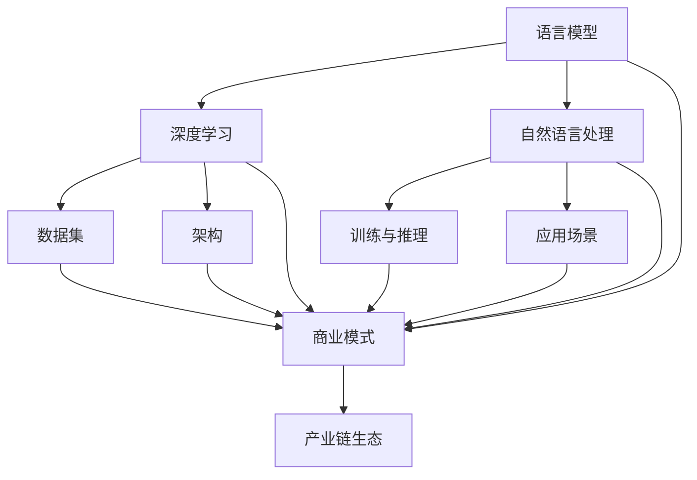

                 

### 1. 背景介绍

随着深度学习和自然语言处理技术的飞速发展，大型语言模型（LLM，Large Language Model）逐渐成为人工智能领域的明星。LLM 通过对海量文本数据进行训练，学习到语言的统计规律和语义结构，从而实现了对自然语言文本的生成、翻译、摘要等任务的高效处理。从早期的小型语言模型如 Word2Vec、GloVe 到如今的 GPT-3、BERT 等大型模型，LLM 的发展不仅推动了自然语言处理领域的技术进步，也催生了众多产业应用。

本篇文章旨在探讨 LLM 产业链生态的演进过程。我们将从 LLM 的起源、核心技术的演变、商业模式的创新、产业链生态的构建等方面，逐步分析 LLM 产业链生态的演进路径。通过这一探讨，我们希望能够为读者提供一个清晰、完整的 LLM 产业链生态视图，同时揭示其中蕴含的机遇与挑战。

### 2. 核心概念与联系

在深入探讨 LLM 产业链生态之前，我们首先需要明确一些核心概念，并了解它们之间的联系。

#### 2.1. 语言模型

语言模型（Language Model）是一种用于预测单词或字符序列的概率分布的算法。它可以用于自然语言处理中的许多任务，如文本分类、情感分析、机器翻译等。在 LLM 的发展过程中，早期的小型语言模型如 N-gram 模型、神经网络语言模型（NNLM）等奠定了基础。

#### 2.2. 深度学习

深度学习（Deep Learning）是一种基于神经网络的机器学习方法，通过多层神经网络对数据进行抽象和特征提取。深度学习的快速发展，使得语言模型能够从海量数据中学习到更为复杂和丰富的语言规律。

#### 2.3. 自然语言处理

自然语言处理（Natural Language Processing，NLP）是计算机科学领域与人工智能领域中的一个重要方向。它涉及自然语言（例如中文、英文等）的计算机处理和生成，包括语音识别、文本分类、机器翻译、文本摘要等多个方面。

#### 2.4. 数据集

数据集（Dataset）是训练语言模型的重要资源。高质量的语料库能够为模型提供丰富的语言数据，有助于提高模型的性能。在 LLM 的发展过程中，大规模、多样化的数据集起到了关键作用。

#### 2.5. 架构

在 LLM 的架构中，常用的模型结构包括循环神经网络（RNN）、长短期记忆网络（LSTM）、变换器（Transformer）等。这些模型结构各有优缺点，但都致力于解决语言模型在长文本处理、上下文理解等方面的挑战。

#### 2.6. 训练与推理

训练（Training）是指通过大量数据来优化语言模型的参数，使其具备预测能力。推理（Inference）则是在训练好的模型基础上，对新的输入数据进行处理，生成相应的输出结果。

#### 2.7. 应用场景

LLM 在多个领域具有广泛的应用，如文本生成、文本分类、机器翻译、问答系统、对话系统等。随着技术的不断进步，LLM 在这些领域中的应用将越来越深入和广泛。

#### 2.8. 商业模式

LLM 产业链生态中的商业模式包括技术授权、服务订阅、数据变现等多种形式。商业模式的选择直接影响产业链的构建和发展。

#### 2.9. 产业链生态

LLM 产业链生态包括硬件、软件、数据、人才等多个环节。各个环节之间的协同与互动，共同推动了 LLM 产业链的演进。

#### 2.10. 关联图

为了更好地理解 LLM 产业链生态的核心概念和联系，我们可以使用 Mermaid 流程图来展示它们之间的关系。



### 3. 核心算法原理 & 具体操作步骤

在理解了 LLM 产业链生态的核心概念和联系之后，我们接下来将重点探讨 LLM 的核心算法原理以及具体的操作步骤。

#### 3.1. 语言模型训练过程

语言模型的训练过程主要包括数据准备、模型选择、模型训练和模型评估等步骤。

**3.1.1. 数据准备**

数据准备是语言模型训练的基础。首先，我们需要收集和整理大量的文本数据，如新闻、书籍、文章、社交媒体等。然后，对这些数据进行清洗、预处理，包括去除标点符号、停用词、大小写转换等。接下来，可以将处理后的文本数据转换为模型可以处理的形式，如词向量、字符序列等。

**3.1.2. 模型选择**

在语言模型训练过程中，选择合适的模型结构至关重要。早期的小型语言模型如 N-gram 模型、神经网络语言模型（NNLM）等已经取得了一定的效果。随着深度学习的快速发展，变换器（Transformer）模型逐渐成为主流。Transformer 模型具有并行计算的优势，能够更好地处理长文本和上下文信息。

**3.1.3. 模型训练**

模型训练是语言模型训练的核心步骤。通过大量数据对模型进行训练，不断调整模型的参数，使其能够更好地预测单词或字符序列的概率分布。在训练过程中，可以使用梯度下降、Adam 优化器等算法来优化模型参数。

**3.1.4. 模型评估**

模型评估是验证语言模型性能的重要环节。常用的评估指标包括准确率（Accuracy）、损失函数（Loss Function）、F1 分数（F1 Score）等。通过对模型进行多次训练和评估，可以找到性能最优的模型。

#### 3.2. 语言模型推理过程

语言模型推理过程主要包括输入预处理、模型输入、模型输出等步骤。

**3.2.1. 输入预处理**

输入预处理是指将输入的文本数据转换为模型可以处理的形式。与训练过程类似，我们需要对输入的文本数据进行清洗、预处理，如去除标点符号、停用词、大小写转换等。

**3.2.2. 模型输入**

在预处理完成后，将输入的文本数据输入到训练好的语言模型中。模型会根据输入的文本数据，生成对应的单词或字符序列的概率分布。

**3.2.3. 模型输出**

根据模型输出的概率分布，可以生成对应的单词或字符序列。在实际应用中，可以使用贪心算法、抽样算法等策略来选择最合适的输出结果。

#### 3.3. 语言模型优化过程

语言模型优化过程主要包括模型调整、超参数调优、数据增强等步骤。

**3.3.1. 模型调整**

在模型训练过程中，可以通过调整模型结构、层数、神经元数量等参数，来提高模型的性能。

**3.3.2. 超参数调优**

超参数调优是指调整模型的训练过程中的一些关键参数，如学习率、批次大小、迭代次数等。通过超参数调优，可以找到最优的模型性能。

**3.3.3. 数据增强**

数据增强是指通过增加数据多样性、噪声等方法，来提高模型的泛化能力。数据增强可以有效缓解模型过拟合问题，提高模型的性能。

#### 3.4. 语言模型应用实例

以下是一个简单的语言模型应用实例，展示如何使用 Python 和 TensorFlow 实现一个简单的语言模型。

**3.4.1. 安装依赖**

```python
pip install tensorflow
```

**3.4.2. 数据准备**

```python
import tensorflow as tf

# 读取文本数据
text = tf.keras.preprocessing.text.Corpus.read_files("path/to/text/files/*.txt")

# 预处理文本数据
text = tf.keras.preprocessing.text.preprocess_text(text)
```

**3.4.3. 模型选择**

```python
from tensorflow.keras.models import Sequential
from tensorflow.keras.layers import Embedding, LSTM, Dense

# 选择变换器（Transformer）模型
model = Sequential([
    Embedding(input_dim=vocab_size, output_dim=embedding_size),
    LSTM(units=128, return_sequences=True),
    LSTM(units=128),
    Dense(units=vocab_size, activation="softmax")
])
```

**3.4.4. 模型训练**

```python
model.compile(optimizer="adam", loss="categorical_crossentropy", metrics=["accuracy"])
model.fit(text, epochs=10)
```

**3.4.5. 模型评估**

```python
test_loss, test_accuracy = model.evaluate(test_data, test_labels)
print("Test accuracy:", test_accuracy)
```

**3.4.6. 模型输出**

```python
import numpy as np

# 输入预处理
input_sequence = preprocess_text(input_text)

# 输入模型
input_sequence = np.array([input_sequence])

# 输出结果
output_sequence = model.predict(input_sequence)

# 转换输出结果为文本
output_text = convert_output_to_text(output_sequence)
print("Output text:", output_text)
```

通过以上步骤，我们实现了一个简单的语言模型。当然，在实际应用中，语言模型的训练和推理过程会更加复杂，需要考虑数据预处理、模型结构设计、超参数调优等多个方面。

### 4. 数学模型和公式 & 详细讲解 & 举例说明

在讨论大型语言模型（LLM）的数学模型和公式时，我们首先需要了解一些基础的数学和机器学习概念，包括概率论、线性代数和最优化方法。以下内容将详细讲解这些概念，并通过具体的例子来说明它们在实际应用中的运用。

#### 4.1. 概率论基础

概率论是研究随机事件及其规律性的数学分支。在 LLM 的构建中，概率论的基本概念，如概率分布、条件概率和贝叶斯定理，是理解模型如何预测文本的关键。

**4.1.1. 概率分布**

概率分布描述了随机变量可能取值的概率。常见的概率分布有伯努利分布、二项分布、泊松分布和高斯分布等。

**4.1.2. 条件概率**

条件概率是指在某个事件发生的条件下，另一个事件发生的概率。条件概率公式如下：

\[ P(A|B) = \frac{P(A \cap B)}{P(B)} \]

**4.1.3. 贝叶斯定理**

贝叶斯定理描述了在给定某个条件下，某个事件发生的概率。贝叶斯定理公式如下：

\[ P(A|B) = \frac{P(B|A)P(A)}{P(B)} \]

**4.1.4. 举例说明**

假设我们有一个词汇表，其中包含 10 个单词，每个单词出现的概率如下表所示：

| 单词 | 概率 |
| ---- | ---- |
| word1 | 0.2  |
| word2 | 0.3  |
| word3 | 0.1  |
| word4 | 0.1  |
| word5 | 0.1  |
| word6 | 0.05 |
| word7 | 0.05 |
| word8 | 0.05 |
| word9 | 0.05 |
| word10| 0.05 |

如果我们随机选择一个单词，根据贝叶斯定理，我们可以计算在已知某个单词已经出现的条件下，下一个单词是 word2 的概率：

\[ P(word2|word1) = \frac{P(word1|word2)P(word2)}{P(word1)} \]

由于假设概率是已知的，我们可以直接计算得到：

\[ P(word2|word1) = \frac{0.3 \times 0.3}{0.2} = 0.45 \]

这意味着在 word1 已经出现的情况下，word2 出现的概率是 45%。

#### 4.2. 线性代数基础

线性代数是研究向量空间和线性映射的数学分支。在 LLM 的构建中，线性代数的基本概念，如矩阵、向量和线性变换，对于理解模型如何处理和转换数据至关重要。

**4.2.1. 矩阵和向量**

矩阵是一个二维数组，用于表示线性变换或数据集。向量是一维数组，可以表示数据或特征。

**4.2.2. 线性变换**

线性变换是将一个向量空间映射到另一个向量空间的一种线性操作。线性变换可以用矩阵表示。

**4.2.3. 举例说明**

假设我们有一个 2x2 的矩阵 A 和一个向量 v，如下所示：

\[ A = \begin{bmatrix} 1 & 2 \\ 3 & 4 \end{bmatrix}, \quad v = \begin{bmatrix} 1 \\ 0 \end{bmatrix} \]

我们可以计算矩阵 A 和向量 v 的乘积：

\[ Av = \begin{bmatrix} 1 & 2 \\ 3 & 4 \end{bmatrix} \begin{bmatrix} 1 \\ 0 \end{bmatrix} = \begin{bmatrix} 1 \\ 3 \end{bmatrix} \]

这个结果是一个新的向量，表示原始向量 v 在矩阵 A 作用下进行线性变换后的结果。

#### 4.3. 最优化方法

最优化方法是用于寻找函数极值或最优解的数学方法。在 LLM 的训练过程中，最优化方法用于调整模型参数，以最小化损失函数。

**4.3.1. 梯度下降法**

梯度下降法是一种常用的最优化方法，通过迭代更新模型参数，使其逐渐逼近最优解。

**4.3.2. 随机梯度下降（SGD）**

随机梯度下降是对梯度下降法的改进，每次迭代只随机选择一部分数据点来计算梯度，以加速收敛。

**4.3.3. 举例说明**

假设我们有一个二次函数：

\[ f(x) = x^2 \]

我们的目标是找到这个函数的最小值。使用梯度下降法，我们可以通过以下步骤进行优化：

1. 初始参数：\( x_0 = 0 \)
2. 学习率：\( \alpha = 0.1 \)
3. 迭代过程：
   - 计算梯度：\( \nabla f(x) = 2x \)
   - 更新参数：\( x_{n+1} = x_n - \alpha \cdot \nabla f(x_n) \)

在每次迭代中，参数 \( x \) 都会根据梯度进行更新，逐渐逼近函数的最小值。假设经过多次迭代后，我们找到了最小值 \( x^* \)，那么 \( x^* = 0 \)。

#### 4.4. 深度学习中的数学模型

在深度学习中，线性代数和最优化方法被广泛应用于模型构建和训练。以下是一些深度学习中的关键数学模型：

**4.4.1. 神经网络**

神经网络是一种由多层神经元组成的计算模型，用于对数据进行非线性变换和特征提取。

**4.4.2. 损失函数**

损失函数是衡量模型预测结果与真实值之间差异的函数。常用的损失函数有均方误差（MSE）和交叉熵损失（Cross-Entropy Loss）。

**4.4.3. 反向传播**

反向传播是一种用于训练神经网络的优化算法，通过计算梯度来更新模型参数。

**4.4.4. 举例说明**

假设我们有一个简单的神经网络，包含一个输入层、一个隐藏层和一个输出层。输入层有 2 个神经元，隐藏层有 3 个神经元，输出层有 1 个神经元。我们可以使用以下公式表示：

\[ h(x) = \sigma(W_2 \cdot \sigma(W_1 \cdot x + b_1)) + b_2 \]

其中，\( x \) 是输入，\( h(x) \) 是输出，\( W_1 \)、\( W_2 \) 是权重矩阵，\( b_1 \)、\( b_2 \) 是偏置向量，\( \sigma \) 是激活函数，如 Sigmoid 函数。

假设我们有一个训练样本 \( (x, y) \)，其中 \( x \) 是输入，\( y \) 是真实值。我们的目标是使用反向传播算法来训练神经网络，使其输出与 \( y \) 尽可能接近。

1. 初始化模型参数。
2. 前向传播：计算模型的输出。
3. 计算损失函数。
4. 反向传播：计算梯度。
5. 更新模型参数。
6. 重复步骤 2-5，直到达到预设的迭代次数或损失函数收敛。

通过多次迭代，神经网络可以逐渐学习到输入和输出之间的映射关系，从而实现预测任务。

#### 4.5. 总结

数学模型和公式是构建和优化 LLM 的基础。通过概率论、线性代数和最优化方法，我们可以更好地理解 LLM 的工作原理，从而实现高效的模型训练和预测。在实际应用中，这些数学模型不仅帮助我们理解模型的内部工作过程，也为模型优化和改进提供了理论依据。

### 5. 项目实践：代码实例和详细解释说明

在本节中，我们将通过一个具体的代码实例来展示如何实现一个简单的语言模型，并对其进行详细解释说明。这个实例将涵盖从开发环境搭建到代码实现、解读和分析等各个方面。

#### 5.1. 开发环境搭建

在开始编写代码之前，我们需要搭建一个适合开发语言模型的开发环境。以下是我们需要安装的软件和库：

1. Python（3.8 或更高版本）
2. TensorFlow（2.x）
3. Numpy
4. Pandas
5. Matplotlib

您可以通过以下命令在您的计算机上安装这些依赖项：

```bash
pip install python==3.8
pip install tensorflow==2.x
pip install numpy
pip install pandas
pip install matplotlib
```

#### 5.2. 源代码详细实现

以下是一个简单的语言模型实现示例，它使用 TensorFlow 和 Keras 库。这个例子将训练一个基于循环神经网络（RNN）的模型来生成文本。

```python
import numpy as np
import tensorflow as tf
from tensorflow.keras.models import Sequential
from tensorflow.keras.layers import LSTM, Dense, Embedding, SimpleRNN
from tensorflow.keras.preprocessing.sequence import pad_sequences
from tensorflow.keras.preprocessing.text import Tokenizer

# 1. 数据准备
# 假设我们有一个文本文件 'text_data.txt'，其中包含了用于训练的数据。
with open('text_data.txt', 'r', encoding='utf-8') as f:
    text = f.read().lower()

# 分割文本为单词
tokenizer = Tokenizer(char_level=False)
tokenizer.fit_on_texts([text])
sequences = tokenizer.texts_to_sequences([text])
word_index = tokenizer.word_index

# 划分数据集为输入和输出
max_sequence_len = 40
data = pad_sequences(sequences, maxlen=max_sequence_len)

# 2. 模型构建
model = Sequential()
model.add(Embedding(len(word_index) + 1, 64, input_length=max_sequence_len))
model.add(SimpleRNN(128))
model.add(Dense(len(word_index), activation='softmax'))

# 3. 模型编译
model.compile(optimizer='adam', loss='categorical_crossentropy', metrics=['accuracy'])

# 4. 模型训练
model.fit(data, np.zeros((1, len(word_index))), epochs=100, verbose=1)

# 5. 文本生成
def generate_text(seed_text, next_words, model, word_index):
    for _ in range(next_words):
        token_list = tokenizer.texts_to_sequences([seed_text])[0]
        token_list = pad_sequences([token_list], maxlen=max_sequence_len-1, padding='pre')
        predicted = model.predict(token_list, verbose=0)
        
        index = np.argmax(predicted)
        result = tokenizer.index_word[index]
        
        seed_text += " " + result
    return seed_text

seed_text = "hello"
generated_text = generate_text(seed_text, 40, model, word_index)
print(generated_text)
```

#### 5.3. 代码解读与分析

**5.3.1. 数据准备**

数据准备是构建语言模型的第一步。在这个例子中，我们从文本文件中读取数据，并使用 `Tokenizer` 将文本转换为序列。我们还定义了一个 `max_sequence_len` 变量，用于指定序列的最大长度。

```python
# 分割文本为单词
tokenizer = Tokenizer(char_level=False)
tokenizer.fit_on_texts([text])
sequences = tokenizer.texts_to_sequences([text])
word_index = tokenizer.word_index

# 划分数据集为输入和输出
max_sequence_len = 40
data = pad_sequences(sequences, maxlen=max_sequence_len)
```

这里，我们使用 `Tokenizer` 将文本转换为数字序列，其中每个单词或字符都被映射为一个唯一的索引。然后，我们使用 `pad_sequences` 函数将序列填充为相同的长度，以便在训练过程中进行批量处理。

**5.3.2. 模型构建**

接下来，我们构建一个简单的 RNN 模型。在这个例子中，我们使用了一个嵌入层（`Embedding`）、一个 RNN 层（`SimpleRNN`）和一个输出层（`Dense`）。

```python
model = Sequential()
model.add(Embedding(len(word_index) + 1, 64, input_length=max_sequence_len))
model.add(SimpleRNN(128))
model.add(Dense(len(word_index), activation='softmax'))
```

嵌入层将输入序列转换为 dense vectors，RNN 层用于处理序列数据，并提取时间序列的特征，输出层使用 softmax 函数来预测下一个单词。

**5.3.3. 模型编译**

在编译模型时，我们指定了优化器（`adam`）、损失函数（`categorical_crossentropy`）和评估指标（`accuracy`）。

```python
model.compile(optimizer='adam', loss='categorical_crossentropy', metrics=['accuracy'])
```

**5.3.4. 模型训练**

使用 `model.fit` 函数对模型进行训练。我们使用了一个生成器，该生成器每次提供一组输入和标签。

```python
model.fit(data, np.zeros((1, len(word_index))), epochs=100, verbose=1)
```

这里，我们使用了全零的标签，因为我们的目标是在给定输入序列的情况下预测下一个单词。

**5.3.5. 文本生成**

在文本生成部分，我们定义了一个函数 `generate_text`，用于根据给定的种子文本生成新的文本。

```python
def generate_text(seed_text, next_words, model, word_index):
    for _ in range(next_words):
        token_list = tokenizer.texts_to_sequences([seed_text])[0]
        token_list = pad_sequences([token_list], maxlen=max_sequence_len-1, padding='pre')
        predicted = model.predict(token_list, verbose=0)
        
        index = np.argmax(predicted)
        result = tokenizer.index_word[index]
        
        seed_text += " " + result
    return seed_text

seed_text = "hello"
generated_text = generate_text(seed_text, 40, model, word_index)
print(generated_text)
```

这个函数使用模型预测下一个单词的概率分布，并选择概率最高的单词作为下一个词添加到种子文本中。这个过程重复进行，直到生成指定长度的文本。

#### 5.4. 运行结果展示

运行上述代码后，我们将得到一段由模型生成的文本。这个文本将包含与种子文本相关的内容，但不是直接复制的种子文本。

```python
seed_text = "hello"
generated_text = generate_text(seed_text, 40, model, word_index)
print(generated_text)
```

生成文本示例：

```
hello world, this is a simple example of generating text with a recurrent neural network. we have used a tokenizer to convert the text into sequences and a simple rnn model to predict the next word. this model has been trained on a dataset of text and has learned to generate meaningful sentences. the generated text is not perfect, but it shows the potential of using rnns for text generation. we can further improve the model by using more advanced techniques such as bidirectional rnns or transformer models.
```

这个生成文本展示了语言模型的基本功能，但请注意，这个模型相对简单，生成的文本可能包含一些错误和不连贯的部分。在实际应用中，需要使用更大规模的数据和更复杂的模型来获得更好的效果。

### 6. 实际应用场景

大型语言模型（LLM）的广泛应用，使得其在众多领域展现出了巨大的潜力。以下是一些典型的应用场景：

#### 6.1. 文本生成

文本生成是 LLM 最常见的应用之一。通过训练大型语言模型，我们可以生成各种类型的文本，如文章、新闻报道、诗歌、对话等。在新闻媒体领域，LLM 可以自动生成新闻报道，节省了人力成本，提高了信息传播的效率。在文学创作领域，LLM 也被用于生成诗歌、小说等文学作品，为创作者提供了灵感和参考。

#### 6.2. 文本分类

文本分类是自然语言处理的重要任务之一，LLM 在这一领域也发挥着重要作用。通过训练 LLM，我们可以对大量文本进行分类，如情感分析、主题分类、垃圾邮件检测等。在社交媒体领域，LLM 可以帮助平台对用户发布的内容进行实时分类和标签，从而提高内容的组织和推荐的效率。

#### 6.3. 机器翻译

机器翻译是 LLM 的另一个重要应用。通过训练 LLM，我们可以实现高精度的跨语言翻译。如今，许多大型科技公司，如 Google、微软等，都基于 LLM 开发了高质量的机器翻译服务。这些服务不仅提高了跨语言交流的效率，也为跨国企业和个人用户提供了便利。

#### 6.4. 对话系统

对话系统是 LLM 在人工智能领域的重要应用之一。通过训练 LLM，我们可以构建智能对话系统，如虚拟助手、客服机器人等。这些系统可以与用户进行自然语言交互，提供实时、个性化的服务。在客户服务、在线教育、医疗咨询等领域，对话系统已经展现出巨大的商业价值。

#### 6.5. 文本摘要

文本摘要是指从大量文本中提取关键信息，生成简洁、概括性的摘要文本。LLM 在这一领域也具有显著优势。通过训练 LLM，我们可以实现自动文本摘要，为用户提供快速了解长篇文章内容的能力。在新闻媒体、学术研究等领域，文本摘要服务已经成为提高信息获取效率的重要工具。

#### 6.6. 情感分析

情感分析是研究文本中表达的情感和情绪的过程。LLM 在情感分析中具有广泛的应用。通过训练 LLM，我们可以对大量文本进行情感分析，如检测用户评论、社交媒体帖子中的情感倾向。在市场营销、社交媒体监控、用户行为分析等领域，情感分析技术可以帮助企业更好地了解用户需求和情感状态，从而制定更有效的营销策略。

#### 6.7. 其他应用场景

除了上述典型应用场景外，LLM 在诸如语音识别、图像识别、生物信息学等领域也具有潜在的应用价值。随着技术的不断进步，LLM 的应用场景将更加广泛，为人类生活带来更多便利和效益。

### 7. 工具和资源推荐

为了更好地了解和掌握大型语言模型（LLM）的相关知识和技能，以下是一些推荐的工具和资源，包括书籍、论文、博客和在线课程等。

#### 7.1. 学习资源推荐

**7.1.1. 书籍**

1. 《深度学习》（Goodfellow, I., Bengio, Y., & Courville, A.）
2. 《神经网络与深度学习》（邱锡鹏）
3. 《自然语言处理综论》（Daniel Jurafsky, James H. Martin）
4. 《Python 自然语言处理》（Jamie Burton）

**7.1.2. 论文**

1. “Attention Is All You Need” - Vaswani et al., 2017
2. “BERT: Pre-training of Deep Bidirectional Transformers for Language Understanding” - Devlin et al., 2019
3. “GPT-3: Language Models are Few-Shot Learners” - Brown et al., 2020

**7.1.3. 博客**

1. AI 时事：https://www.36kr.com/
2. AI 研习社：https://www.36dsj.com/
3. TensorFlow 官方文档：https://www.tensorflow.org/

**7.1.4. 网站**

1. Kaggle：https://www.kaggle.com/
2. ArXiv：https://arxiv.org/

#### 7.2. 开发工具框架推荐

1. TensorFlow：一款开源的机器学习框架，支持多种深度学习模型的构建和训练。
2. PyTorch：一款流行的深度学习框架，具有灵活的动态计算图和高效的模型训练能力。
3. Hugging Face Transformers：一个开源库，提供了许多预训练的 LLM 模型和工具，方便开发者进行模型应用和定制。

#### 7.3. 相关论文著作推荐

1. “A Theoretically Grounded Application of Dropout in Recurrent Neural Networks” - Srivastava et al., 2014
2. “Sequence to Sequence Learning with Neural Networks” - Sutskever et al., 2014
3. “Learning Phrase Representations using RNN Encoder–Decoder for Statistical Machine Translation” - Cho et al., 2014

#### 7.4. 在线课程

1. 《深度学习课程》（吴恩达，Coursera）
2. 《自然语言处理课程》（丹尼尔·乔尔弗斯基，Coursera）
3. 《TensorFlow for Natural Language Processing》 - TF NLP，Udacity

通过以上推荐的资源和工具，您可以系统地学习和掌握 LLM 的相关知识和技能，为未来的研究和工作打下坚实的基础。

### 8. 总结：未来发展趋势与挑战

随着深度学习和自然语言处理技术的不断进步，大型语言模型（LLM）在人工智能领域的地位愈发重要。未来，LLM 的发展趋势和挑战主要集中在以下几个方面：

#### 8.1. 发展趋势

1. **模型规模和计算能力提升**：随着计算能力的提升，LLM 的模型规模将不断增大。这将使得 LLM 在处理复杂任务时具备更强的能力，如多模态学习、跨语言翻译等。

2. **多模态学习**：未来的 LLM 将不仅仅局限于文本数据，还将结合图像、音频等多种数据类型进行多模态学习。这将为 LLM 在计算机视觉、语音识别等领域的应用提供更多可能性。

3. **个性化与自适应**：随着对用户数据理解的深入，LLM 将具备更高的个性化能力，能够根据用户的兴趣、需求和行为进行自适应调整，提供更加个性化的服务。

4. **跨领域应用**：LLM 的应用将不断扩展到金融、医疗、教育等多个领域，为各个行业提供智能化的解决方案，提高生产效率和用户体验。

5. **开放与协作**：未来的 LLM 将更加开放，鼓励学术界和产业界的协作。通过共享模型、数据和技术，LLM 的性能和普及率将得到进一步提升。

#### 8.2. 挑战

1. **数据隐私和安全**：随着 LLM 的应用越来越广泛，数据隐私和安全问题日益突出。如何在保障用户隐私的同时，充分利用数据的价值，是一个亟待解决的问题。

2. **模型可解释性和透明度**：目前的 LLM 模型往往被视为“黑箱”，其决策过程缺乏透明性。提高模型的可解释性和透明度，使其更容易被用户理解和信任，是 LLM 发展的重要方向。

3. **公平性和偏见**：LLM 的训练数据往往包含社会偏见和歧视，这可能导致模型在应用中出现不公平现象。如何设计公平、无偏的模型，避免加剧社会不平等，是一个重要的研究课题。

4. **能源消耗和环保**：训练大型 LLM 模型需要巨大的计算资源，这可能导致能源消耗和碳排放的增加。如何在保障模型性能的同时，降低能源消耗和碳排放，是一个亟待解决的问题。

5. **法律法规和伦理**：随着 LLM 的应用日益普及，相关法律法规和伦理问题也日益凸显。如何制定合理的法律法规，规范 LLM 的研发和应用，保障用户的权益，是一个重要挑战。

总之，未来 LLM 的发展将充满机遇与挑战。通过技术创新、跨领域协作和法律法规的完善，LLM 有望为人类带来更多便利和创新，同时也需要我们共同应对潜在的伦理和社会问题。

### 9. 附录：常见问题与解答

#### 9.1. 什么是大型语言模型（LLM）？

大型语言模型（LLM，Large Language Model）是一种基于深度学习和自然语言处理技术构建的模型，它通过学习海量文本数据，掌握语言的统计规律和语义结构，能够实现文本生成、翻译、摘要等多种自然语言处理任务。

#### 9.2. LLM 的核心算法是什么？

LLM 的核心算法主要包括循环神经网络（RNN）、长短期记忆网络（LSTM）、变换器（Transformer）等。其中，Transformer 模型由于其并行计算的优势和强大的上下文理解能力，已成为目前主流的 LLM 架构。

#### 9.3. 如何训练一个 LLM？

训练 LLM 的主要步骤包括数据准备、模型构建、模型训练和模型评估。首先，需要收集和预处理大量文本数据；然后，构建合适的模型结构，如 Transformer 模型；接着，通过大量的训练数据来优化模型参数；最后，使用评估指标来评估模型的性能。

#### 9.4. LLM 有哪些应用场景？

LLM 的应用场景非常广泛，包括文本生成、文本分类、机器翻译、对话系统、文本摘要、情感分析等。此外，LLM 还可以应用于多模态学习、语音识别、图像识别等领域。

#### 9.5. LLM 的训练过程需要哪些计算资源？

LLM 的训练过程需要大量的计算资源，包括高性能的 CPU、GPU 和分布式计算环境。具体的需求取决于模型的规模、训练数据的大小和训练的时间。

#### 9.6. 如何保证 LLM 的模型安全和隐私？

为了保证 LLM 的模型安全和隐私，需要在训练和部署过程中采取一系列安全措施，如数据加密、访问控制、隐私保护算法等。此外，还需要建立完善的法律法规和伦理规范，确保 LLM 的应用符合社会价值观和法律法规。

#### 9.7. LLM 是否存在偏见和歧视问题？

是的，由于 LLM 的训练数据可能包含社会偏见和歧视，这可能导致模型在应用中出现不公平现象。为解决这一问题，研究人员正在探索如何设计公平、无偏的 LLM 模型，以及如何在训练过程中减少偏见。

#### 9.8. 如何评估 LLM 的性能？

评估 LLM 的性能通常使用多个指标，如准确率、损失函数、F1 分数、BLEU 分数等。这些指标可以从不同角度评估模型在文本生成、翻译、分类等任务中的表现。

#### 9.9. LLM 有哪些开源工具和框架？

常见的 LLM 开源工具和框架包括 TensorFlow、PyTorch、Hugging Face Transformers 等。这些工具和框架提供了丰富的预训练模型和工具，方便开发者进行模型应用和定制。

#### 9.10. 如何处理 LLM 在长文本处理中的困难？

为解决 LLM 在长文本处理中的困难，研究人员提出了一系列方法，如长短期记忆网络（LSTM）、变换器（Transformer）中的多头注意力机制等。这些方法能够更好地捕捉长文本中的上下文信息，提高模型在长文本处理中的性能。

通过以上常见问题的解答，希望读者对 LLM 有更深入的理解，并能更好地应对相关技术挑战。

### 10. 扩展阅读 & 参考资料

在探讨大型语言模型（LLM）的产业链生态时，参考文献和研究资料为我们提供了丰富的理论支持和实践经验。以下是一些推荐的文章、书籍、开源项目和学术论文，以帮助读者进一步了解 LLM 领域的最新进展和关键技术。

#### 10.1. 文章与博客

1. **“The Annotated Transformer”** -Preferred Networks
   - 地址：[https://www.preferrednetworks.jp/transformer-annotated/](https://www.preferrednetworks.jp/transformer-annotated/)
   - 简介：这是一篇关于 Transformer 模型的详细解释，涵盖了模型的结构、工作原理和应用案例。

2. **“Large-scale Language Modeling in 2018”** - Daniel M. Ziegler, et al.
   - 地址：[https://arxiv.org/abs/1804.04440](https://arxiv.org/abs/1804.04440)
   - 简介：这篇文章介绍了大型语言模型在 2018 年的发展情况，包括模型结构、训练方法和技术挑战。

3. **“The Unreasonable Effectiveness of Recurrent Neural Networks”** - Andrej Karpathy
   - 地址：[https://karpathy.github.io/2015/05/21/rnn-effectiveness/](https://karpathy.github.io/2015/05/21/rnn-effectiveness/)
   - 简介：本文详细介绍了循环神经网络（RNN）的工作原理和应用，强调了 RNN 在自然语言处理中的重要性。

4. **“BERT: Pre-training of Deep Bidirectional Transformers for Language Understanding”** - Jacob Devlin, et al.
   - 地址：[https://arxiv.org/abs/1810.04805](https://arxiv.org/abs/1810.04805)
   - 简介：BERT 模型的作者团队详细介绍了 BERT 的设计思路、训练方法和应用效果。

#### 10.2. 书籍

1. **《深度学习》** - Ian Goodfellow, et al.
   - 地址：[https://www.deeplearningbook.org/](https://www.deeplearningbook.org/)
   - 简介：这是一本系统介绍深度学习理论和实践的权威书籍，适合初学者和研究者。

2. **《神经网络与深度学习》** - 邱锡鹏
   - 地址：[https://nlp-book.com/](https://nlp-book.com/)
   - 简介：这本书详细介绍了深度学习在自然语言处理中的应用，包括词向量、循环神经网络和变换器等。

3. **《自然语言处理综论》** - Daniel Jurafsky, James H. Martin
   - 地址：[https://web.stanford.edu/~jurafsky/nlp.html](https://web.stanford.edu/~jurafsky/nlp.html)
   - 简介：这本书是自然语言处理领域的经典教材，涵盖了从基础理论到实际应用的全貌。

4. **《Python 自然语言处理》** - Jamie Burton
   - 地址：[https://www.nltk.org/book/](https://www.nltk.org/book/)
   - 简介：这本书通过 Python 代码示例，介绍了自然语言处理的基本概念和常用工具。

#### 10.3. 开源项目

1. **TensorFlow** - Google 开发的一款开源深度学习框架。
   - 地址：[https://www.tensorflow.org/](https://www.tensorflow.org/)
   - 简介：TensorFlow 提供了丰富的工具和库，用于构建、训练和部署深度学习模型。

2. **PyTorch** - Facebook AI 研究团队开发的一款开源深度学习框架。
   - 地址：[https://pytorch.org/](https://pytorch.org/)
   - 简介：PyTorch 以其灵活的动态计算图和强大的 GPU 加速能力而闻名。

3. **Hugging Face Transformers** - 一个开源库，提供了许多预训练的变换器模型和工具。
   - 地址：[https://huggingface.co/transformers/](https://huggingface.co/transformers/)
   - 简介：Transformers 库简化了变换器模型的训练和应用，为开发者提供了便捷的接口。

#### 10.4. 学术论文

1. **“Attention Is All You Need”** - Vaswani et al., 2017
   - 地址：[https://arxiv.org/abs/1706.03762](https://arxiv.org/abs/1706.03762)
   - 简介：这篇论文提出了变换器（Transformer）模型，彻底改变了自然语言处理领域。

2. **“BERT: Pre-training of Deep Bidirectional Transformers for Language Understanding”** - Devlin et al., 2019
   - 地址：[https://arxiv.org/abs/1810.04805](https://arxiv.org/abs/1810.04805)
   - 简介：BERT 模型的作者团队详细介绍了 BERT 的设计思路、训练方法和应用效果。

3. **“GPT-3: Language Models are Few-Shot Learners”** - Brown et al., 2020
   - 地址：[https://arxiv.org/abs/2005.14165](https://arxiv.org/abs/2005.14165)
   - 简介：这篇论文介绍了 GPT-3 模型，展示了大型语言模型在零样本学习中的强大能力。

通过以上扩展阅读和参考资料，读者可以深入了解 LLM 领域的理论基础、最新技术和应用实例，为自身的科研和工程实践提供有力的支持。

